# Linux系统服务-DNS

# 一、DNS介绍

DNS(domain name system) 域名管理系统

# 二、域名介绍

- 不同于MAC或IP地址的主机的名称
- 用来表示互联网中==某一台计算机或者计算机组的名称==
- 方便人类的记忆
- 为了人类记忆一台主机的IP地址，为了给IP起一个方便记忆的名称，这就是域名

# 三、域名格式

- 主机的名+主机的姓
- baidu+com

# 四、DNS与域名、IP的关系

# 五、DNS作用

- 域名的正向解析

拿服务器的域名到DNS解析为IP地址，我们称之为正向解析。

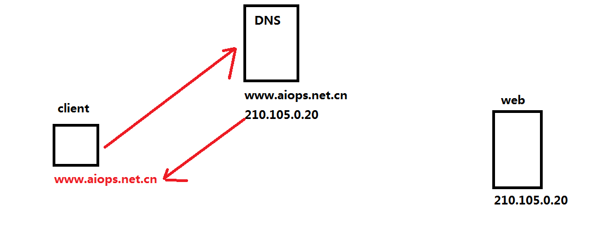

- 域名的反向解析

把服务器的IP地址解析为域名，我们称之为反向解析。

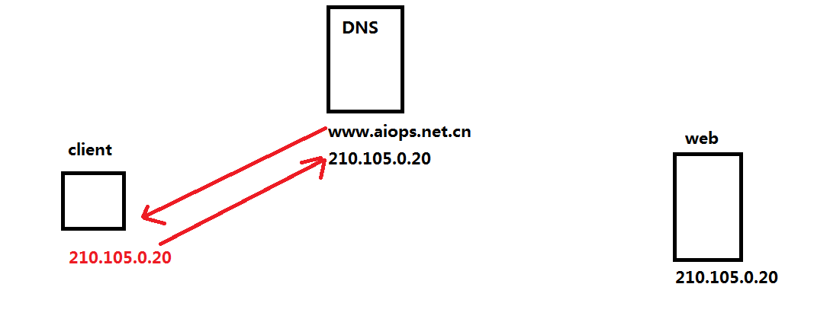

# 六、域名结构

> 域名格式 主机名+主机姓

> 重点讲主机姓

**根域**

- 在整个 DNS 系统的最上方一定是 . (小数点) 这个 DNS 服务器 (称为 root)，也叫”根域“。
- 根域 （13台 全世界只有13台。1个为主根服务器，放置在美国。其余12个均为辅根服务器，其中9个放置在美国，欧洲2个，位于英国和瑞典，亚洲1个，位于日本。）

**一级域名或顶级域名**

- com 商业类
- org   非盈利组织 
- gov   政府类
- edu 教育类
- cn
- us
- uk
- jp
- hk
- tw
- ai 人工智能
- io 云计算相关的行业

**二级域名**

- baidu.com
- org.cn
- net.cn

> 提醒: 一定要注册可以在中国大陆备案，向谁备案？北京市通信管理局 管局 河北省通信管理局

# 七、域名注册

## 7.1 域名注册商

- 新网
- 万网

## 7.2 域名注册

- www.net.cn
- 转到：wanwang.aliyun.com
- 直接到www.aliyun.com

**购买域名**

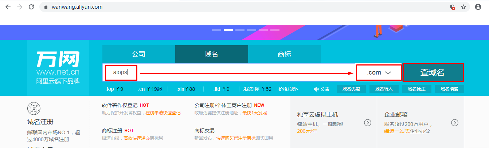

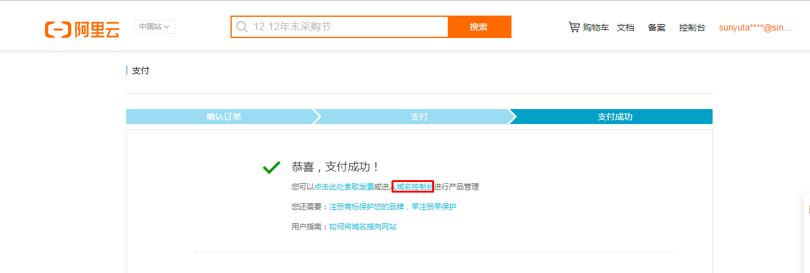

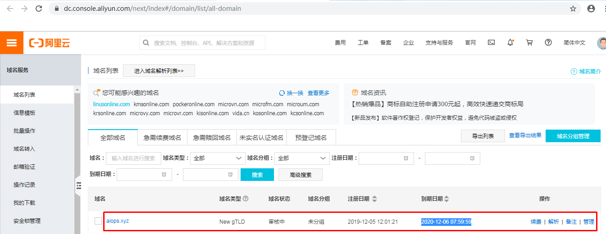

**购买ECS主机**

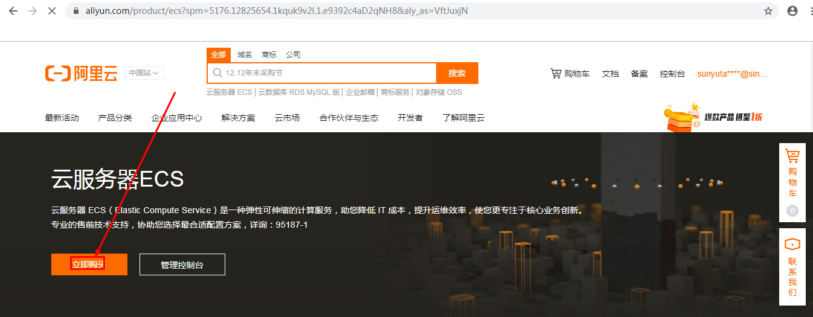

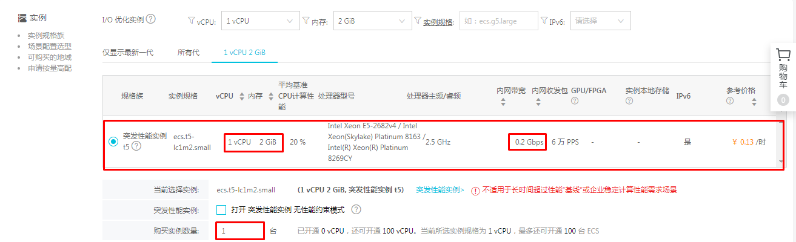

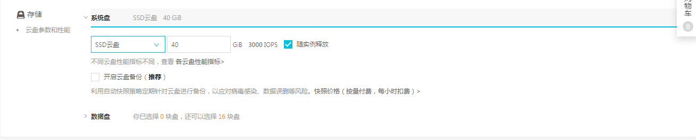

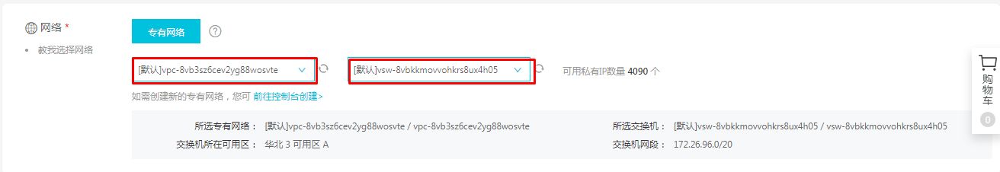

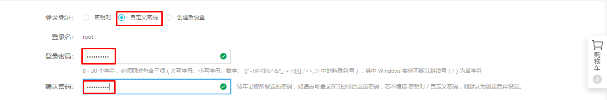

**域名解析**

域名：aiops.xyz

IP地址：39.100.81.147

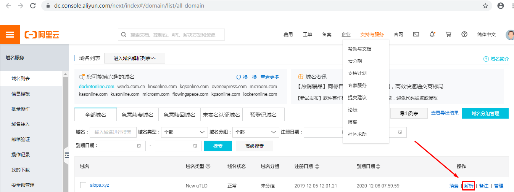

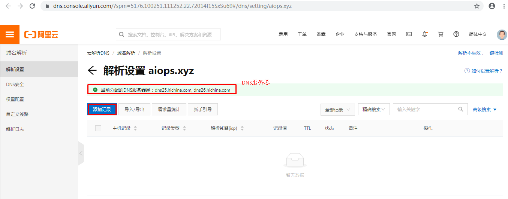

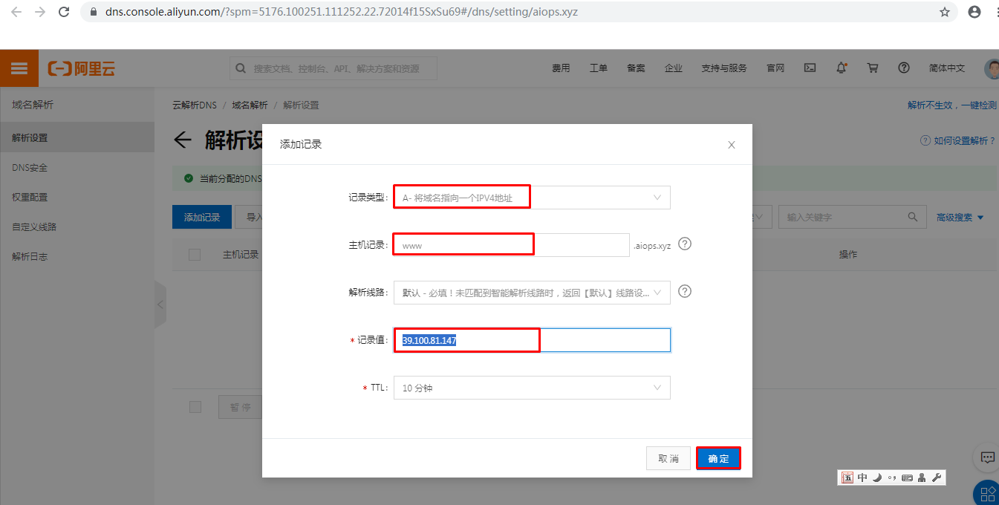

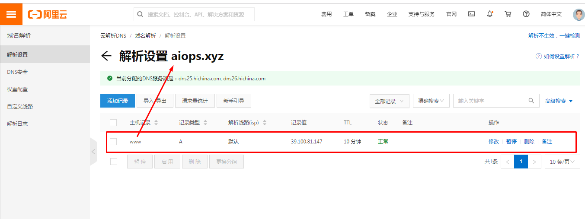

# 八、域名解析

> 正向解析

~~~powershell
[root@client ~]# nslookup
> server
Default server: 119.29.29.29
Address: 119.29.29.29#53
> www.aiops.xyz
Server:         119.29.29.29
Address:        119.29.29.29#53

Non-authoritative answer:
Name:   www.aiops.xyz
Address: 39.100.81.147

>exit

~~~

~~~powershell
[root@client ~]# ssh root@39.100.81.147
The authenticity of host '39.100.81.147 (39.100.81.147)' can't be established.
RSA key fingerprint is 35:65:a4:4c:5a:24:ab:93:87:95:ed:0e:ee:5f:46:5e.
Are you sure you want to continue connecting (yes/no)? yes
Warning: Permanently added '39.100.81.147' (RSA) to the list of known hosts.
root@39.100.81.147's password:
Last login: Thu Dec  5 12:33:52 2019 from 36.112.0.68

Welcome to Alibaba Cloud Elastic Compute Service !

[root@aiops ~]# ip a s
1: lo: <LOOPBACK,UP,LOWER_UP> mtu 65536 qdisc noqueue state UNKNOWN group default qlen 1000
    link/loopback 00:00:00:00:00:00 brd 00:00:00:00:00:00
    inet 127.0.0.1/8 scope host lo
       valid_lft forever preferred_lft forever
2: eth0: <BROADCAST,MULTICAST,UP,LOWER_UP> mtu 1500 qdisc pfifo_fast state UP group default qlen 1000
    link/ether 00:16:3e:0a:6f:30 brd ff:ff:ff:ff:ff:ff
    inet 172.26.108.141/20 brd 172.26.111.255 scope global dynamic eth0
       valid_lft 315359099sec preferred_lft 315359099sec
       

[root@client ~]# ssh root@www.aiops.xyz
The authenticity of host 'www.aiops.xyz (39.100.81.147)' can't be established.
RSA key fingerprint is 35:65:a4:4c:5a:24:ab:93:87:95:ed:0e:ee:5f:46:5e.
Are you sure you want to continue connecting (yes/no)? yes
Warning: Permanently added 'www.aiops.xyz' (RSA) to the list of known hosts.
root@www.aiops.xyz's password:
Last login: Thu Dec  5 12:37:21 2019 from 36.112.0.68

Welcome to Alibaba Cloud Elastic Compute Service !

[root@aiops ~]#
~~~

# 九、DNS工作原理

## 9.1 主机自带的域名解析

~~~powershell
[root@client ~]# cat /etc/hosts
127.0.0.1   localhost localhost.localdomain localhost4 localhost4.localdomain4
::1         localhost localhost.localdomain localhost6 localhost6.localdomain6
192.168.216.178 client
192.168.216.179 dnsserver
39.100.81.147 www.aiops.xyz
~~~

~~~powershell
[root@client ~]# ping www.aiops.xyz
PING www.aiops.xyz (39.100.81.147) 56(84) bytes of data.

~~~

> 比DNS服务器解析优先级高，缺点：不能够存入太多的域名与IP地址对应关系。

## 9.2 使用DNS服务

- 迭代
- 递归

~~~powershell
[root@client ~]# cat /etc/sysconfig/network-scripts/ifcfg-eth0
DEVICE=eth0
TYPE=Ethernet
ONBOOT=yes
NM_CONTROLLED=yes
BOOTPROTO=none
IPADDR=192.168.216.178
PREFIX=24
GATEWAY=192.168.216.2
DNS1=119.29.29.29
~~~

~~~powershell
[root@client ~]# cat /etc/resolv.conf
# Generated by NetworkManager
nameserver 119.29.29.29
~~~

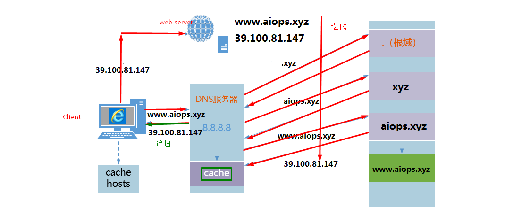

# 十、DNS软件介绍

==Bind==是一款开放源码的DNS服务器软件，Bind由美国加州大学Berkeley（伯克利）分校开发和维护的，全名为Berkeley Internet Name Domain它是目前世界上使用最为广泛的DNS服务器软件，支持各种unix平台和windows平台。BIND现在由互联网系统协会（Internet Systems Consortium）负责开发与维护。

DNS 的==域名解析==都是 **==udp/53==** . 主从之间的==数据传输==默认使用**==tcp/53==**

# 十一、DNS系统部署

## 11.1 构想域名

webserver: www.aiopsweb.com  192.168.216.179

dnsserver: www.aiopsdns.com   192.168.216.179

客户端: 192.168.216.178 即DNS客户端也是web服务器的客户端

## 11.2 安装软件

### 11.2.1 主机环境准备

~~~powershell
[root@dnsserver ~]# hostname
dnsserver
[root@dnsserver ~]# ip a s
1: lo: <LOOPBACK,UP,LOWER_UP> mtu 65536 qdisc noqueue state UNKNOWN
    link/loopback 00:00:00:00:00:00 brd 00:00:00:00:00:00
    inet 127.0.0.1/8 scope host lo
    inet6 ::1/128 scope host
       valid_lft forever preferred_lft forever
2: eth0: <BROADCAST,MULTICAST,UP,LOWER_UP> mtu 1500 qdisc pfifo_fast state UP qlen 1000
    link/ether 00:0c:29:c0:7f:0e brd ff:ff:ff:ff:ff:ff
    inet 192.168.216.179/24 brd 192.168.216.255 scope global eth0
    inet6 fe80::20c:29ff:fec0:7f0e/64 scope link
       valid_lft forever preferred_lft forever
[root@dnsserver ~]# service iptables status
iptables：未运行防火墙。
[root@dnsserver ~]# getenforce
Disabled
[root@dnsserver ~]# ntpdate time1.aliyun.com
 5 Dec 15:25:50 ntpdate[4027]: step time server 203.107.6.88 offset 128821.153951 sec
[root@dnsserver ~]# date
2019年 12月 05日 星期四 15:25:53 CST
~~~

### 11.2.2 安装bind

~~~powershell
[root@dnsserver ~]# yum -y install bind
~~~

## 11.3 bind配置

### 11.3.1 配置named.conf

~~~powershell
 [root@dnsserver ~]# vim /etc/named.conf
 ......
 10 options {
 11         listen-on port 53 { 127.0.0.1;any; };
 12         listen-on-v6 port 53 { ::1; };
 13         directory       "/var/named";
 14         dump-file       "/var/named/data/cache_dump.db";
 15         statistics-file "/var/named/data/named_stats.txt";
 16         memstatistics-file "/var/named/data/named_mem_stats.txt";
 17         allow-query     { localhost;any; };
......
~~~

### 11.3.2 配置named.rfc1912.zones

> 注册正向解析和反向解析文件

~~~powershell
[]# vim /etc/named.rfc1912.zones
.......
正向解析
zone "aiopsweb.com" IN {
        type master;
        file "aiopsweb.com.zone";
        allow-update { none; };
};

反向解析
zone "216.168.192.in-addr.arpa" IN {
        type master;
        file "192.168.216.zone";
        allow-update { none; };
};

~~~

### 11.3.3 创建aiopsweb.com正向解析文件

~~~powershell
[root@dnsserver ~]# cd /var/named
[root@dnsserver named]# pwd
/var/named
[root@dnsserver named]# ls
data  dynamic  named.ca  named.empty  named.localhost  named.loopback  slaves

正向解析文件
[root@dnsserver named]# cp -p named.localhost aiopsweb.com.zone
[root@dnsserver named]# ll
总用量 32
-rw-r----- 1 root  named  152 6月  21 2007 aiopsweb.com.zone
drwxrwx--- 2 named named 4096 6月  19 00:19 data
drwxrwx--- 2 named named 4096 6月  19 00:19 dynamic
-rw-r----- 1 root  named 3289 4月  11 2017 named.ca
-rw-r----- 1 root  named  152 12月 15 2009 named.empty
-rw-r----- 1 root  named  152 6月  21 2007 named.localhost
-rw-r----- 1 root  named  168 12月 15 2009 named.loopback
drwxrwx--- 2 named named 4096 6月  19 00:19 slaves

内容
[root@dnsserver ~]# vim aiopsweb.com.zone

$TTL 1D
@       IN SOA  aiopsweb.com. rname.invalid. (
                                        0       ; serial
                                        1D      ; refresh
                                        1H      ; retry
                                        1W      ; expire
                                        3H )    ; minimum
        NS      @
@       A       192.168.216.179
www     A       192.168.216.179

~~~

### 11.3.4 创建aiopsweb.com反向解析文件

~~~powershell
[root@dnsserver named]# cp -p named.loopback 192.168.216.zone
[root@dnsserver named]# ls
192.168.216.zone   data     named.ca     named.localhost  slaves
aiopsweb.com.zone  dynamic  named.empty  named.loopback

[root@dnsserver named]# vim 192.168.216.zone

$TTL 1D
@       IN SOA  @ rname.invalid. (
                                        0       ; serial
                                        1D      ; refresh
                                        1H      ; retry
                                        1W      ; expire
                                        3H )    ; minimum
        NS      @
@       A       192.168.216.179
179     PTR     www.aiopsweb.com.

~~~

## 11.4 启动bind服务

~~~powershell
配置文件语法检查
[root@dnsserver ~]# named-checkconf /etc/named.conf
[root@dnsserver ~]# named-checkconf /etc/named.rfc1912.zones

[root@dnsserver ~]# named-checkzone aiopsweb.com /var/named/aiopsweb.com.zone
zone aiopsweb.com/IN: loaded serial 0
OK
在此处应该把zonename及filename全部加上，并且如果检查时不在/var/named目录中，filename请使用绝对路径。

[root@dnsserver ~]# named-checkzone 216.168.192.in-addr.arpa /var/named/192.168.216.zone
zone 216.168.192.in-addr.arpa/IN: loaded serial 0
OK

~~~

~~~powershell
[root@dnsserver ~]# service named start
Generating /etc/rndc.key:                                  [确定]
启动 named：                                               [确定]
[root@dnsserver ~]# chkconfig --list | grep named
named           0:关闭  1:关闭  2:关闭  3:关闭  4:关闭  5:关闭  6:关闭
[root@dnsserver ~]# chkconfig named on
[root@dnsserver ~]# chkconfig --list | grep named
named           0:关闭  1:关闭  2:启用  3:启用  4:启用  5:启用  6:关闭
~~~

~~~powershell
[root@dnsserver ~]# ss -anput | grep ":53"
udp    UNCONN     0      0        192.168.216.179:53                    *:*      users:(("named",4805,513))
udp    UNCONN     0      0              127.0.0.1:53                    *:*      users:(("named",4805,512))
udp    UNCONN     0      0                    ::1:53                   :::*      users:(("named",4805,514))
tcp    LISTEN     0      3                    ::1:53                   :::*      users:(("named",4805,22))
tcp    LISTEN     0      3        192.168.216.179:53                    *:*      users:(("named",4805,21))
tcp    LISTEN     0      3              127.0.0.1:53                    *:*      users:(("named",4805,20))

~~~

## 11.5 DNS应用

### 11.5.1 dns使用

~~~powershell
修改网卡配置
[root@client ~]# tail /etc/sysconfig/network-scripts/ifcfg-eth0
DEVICE=eth0
TYPE=Ethernet
ONBOOT=yes
NM_CONTROLLED=yes
BOOTPROTO=none
IPADDR=192.168.216.178
PREFIX=24
GATEWAY=192.168.216.2
DNS1=192.168.216.179
把DNS1修改为192.168.216.179

[root@client ~]# service network restart
正在关闭接口 eth0： 设备状态：3 （断开连接）
                                                           [确定]
关闭环回接口：                                             [确定]
弹出环回接口：                                             [确定]
弹出界面 eth0： 活跃连接状态：已激活
活跃连接路径：/org/freedesktop/NetworkManager/ActiveConnection/3
                                                           [确定]
[root@client ~]# cat /etc/resolv.conf
# Generated by NetworkManager
nameserver 192.168.216.179
~~~

~~~powershell
正向解析的结果验证
[root@client ~]# nslookup
> server
Default server: 192.168.216.179
Address: 192.168.216.179#53
> www.aiopsweb.com
Server:         192.168.216.179
Address:        192.168.216.179#53

Name:   www.aiopsweb.com
Address: 192.168.216.179
>

反向解析的结果验证
> 192.168.216.179
Server:         192.168.216.179
Address:        192.168.216.179#53

179.216.168.192.in-addr.arpa    name = www.aiopsweb.com.
~~~

### 11.5.2 域名别名

~~~powershell
域名别名
CDN 内容分发网络

[root@dnsserver named]# cat aiopsweb.com.zone
$TTL 1D
@       IN SOA  aiopsweb.com. rname.invalid. (
                                        0       ; serial
                                        1D      ; refresh
                                        1H      ; retry
                                        1W      ; expire
                                        3H )    ; minimum
        NS      @
@       A       192.168.216.179
www     A       192.168.216.179
www1    CNAME   www.aiopsweb.com.

[root@dnsserver named]# service named restart
停止 named：                                               [确定]
启动 named：                                               [确定]

~~~

~~~powershell
在客户端验证
> www1.aiopsweb.com
Server:         192.168.216.179
Address:        192.168.216.179#53

www1.aiopsweb.com       canonical name = www.aiopsweb.com.
Name:   www.aiopsweb.com
Address: 192.168.216.179

~~~

### 11.5.3 互联网DNS与本地DNS共存的问题

- 本地DNS和互联网DNS共存

~~~powershell
[root@client ~]# cat /etc/sysconfig/network-scripts/ifcfg-eth0
DEVICE=eth0
TYPE=Ethernet
ONBOOT=yes
NM_CONTROLLED=yes
BOOTPROTO=none
IPADDR=192.168.216.178
PREFIX=24
GATEWAY=192.168.216.2
DNS1=192.168.216.179
DNS2=119.29.29.29
~~~

~~~powershell

[root@client ~]# service network restart
正在关闭接口 eth0： 设备状态：3 （断开连接）
                                                           [确定]
关闭环回接口：                                             [确定]
弹出环回接口：                                             [确定]
弹出界面 eth0： 活跃连接状态：已激活
活跃连接路径：/org/freedesktop/NetworkManager/ActiveConnection/4
                                                           [确定]
[root@client ~]# cat /etc/resolv.conf
# Generated by NetworkManager
nameserver 192.168.216.179
nameserver 119.29.29.29

[root@client ~]# nslookup
> server
Default server: 192.168.216.179
Address: 192.168.216.179#53
Default server: 119.29.29.29
Address: 119.29.29.29#53
> www.aiopsweb.com
Server:         192.168.216.179
Address:        192.168.216.179#53

Name:   www.aiopsweb.com
Address: 192.168.216.179
> www.baidu.com
Server:         119.29.29.29
Address:        119.29.29.29#53

Non-authoritative answer:
www.baidu.com   canonical name = www.a.shifen.com.
Name:   www.a.shifen.com
Address: 14.215.177.38
Name:   www.a.shifen.com
Address: 14.215.177.39
>

~~~

- 仅有本地DNS

~~~powershell
[root@client ~]# vim /etc/sysconfig/network-scripts/ifcfg-eth0
[root@client ~]# service network restart
正在关闭接口 eth0： 设备状态：3 （断开连接）
                                                           [确定]
关闭环回接口：                                             [确定]
弹出环回接口：                                             [确定]
弹出界面 eth0： 活跃连接状态：激活中
活跃连接路径：/org/freedesktop/NetworkManager/ActiveConnection/5
状态：已激活
连接被激活
                                                           [确定]
[root@client ~]# cat /etc/resolv.conf
# Generated by NetworkManager
nameserver 192.168.216.179
[root@client ~]# nslookup
> server
Default server: 192.168.216.179
Address: 192.168.216.179#53
> www.baidu.com
Server:         192.168.216.179
Address:        192.168.216.179#53

Non-authoritative answer:
www.baidu.com   canonical name = www.a.shifen.com.
Name:   www.a.shifen.com
Address: 180.101.49.12
Name:   www.a.shifen.com
Address: 180.101.49.11

~~~

# 十二、多域配置

12.1 域名

- test1.com   www.test1.com  192.168.1.1/24
- test2.com  www.test2.com   192.168.2.1/24
- test3.com  www.test3.com   192.168.3.1/24

12.2 添加域名注册到rfc1912文件

~~~powershell
[root@dnsserver ~]# cat /etc/named.rfc1912.zones
......
zone "test1.com" IN {
        type master;
        file "test1.com.zone";
        allow-update { none; };
};
zone "test2.com" IN {
        type master;
        file "test2.com.zone";
        allow-update { none; };
};
zone "test3.com" IN {
        type master;
        file "test3.com.zone";
        allow-update { none; };
};

~~~

12.3 创建域名文件

~~~powershell
[root@dnsserver ~]# cd /var/named/
[root@dnsserver named]# pwd
/var/named
[root@dnsserver named]# ls
192.168.216.zone   data     named.ca     named.localhost  slaves
aiopsweb.com.zone  dynamic  named.empty  named.loopback
[root@dnsserver named]# cp -p aiopsweb.com.zone test1.com.zone
[root@dnsserver named]# cp -p aiopsweb.com.zone test2.com.zone
[root@dnsserver named]# cp -p aiopsweb.com.zone test3.com.zone
[root@dnsserver named]# ls
192.168.216.zone   dynamic      named.localhost  test1.com.zone
aiopsweb.com.zone  named.ca     named.loopback   test2.com.zone
data               named.empty  slaves           test3.com.zone

[root@dnsserver named]# cat test1.com.zone
$TTL 1D
@       IN SOA  test1.com. rname.invalid. (
                                        0       ; serial
                                        1D      ; refresh
                                        1H      ; retry
                                        1W      ; expire
                                        3H )    ; minimum
        NS      @
@       A       192.168.1.1
www     A       192.168.1.1

[root@dnsserver named]# cat test2.com.zone
$TTL 1D
@       IN SOA  test2.com. rname.invalid. (
                                        0       ; serial
                                        1D      ; refresh
                                        1H      ; retry
                                        1W      ; expire
                                        3H )    ; minimum
        NS      @
@       A       192.168.2.1
www     A       192.168.2.1

[root@dnsserver named]# cat test3.com.zone
$TTL 1D
@       IN SOA  test3.com. rname.invalid. (
                                        0       ; serial
                                        1D      ; refresh
                                        1H      ; retry
                                        1W      ; expire
                                        3H )    ; minimum
        NS      @
@       A       192.168.3.1
www     A       192.168.3.1
~~~

~~~powershell
[root@dnsserver named]# service named restart
停止 named：                                               [确定]
启动 named：                                               [确定]
~~~

~~~powershell
在客户端验证
> www.test1.com
Server:         192.168.216.179
Address:        192.168.216.179#53

Name:   www.test1.com
Address: 192.168.1.1
> www.test2.com
Server:         192.168.216.179
Address:        192.168.216.179#53

Name:   www.test2.com
Address: 192.168.2.1
> www.test3.com
Server:         192.168.216.179
Address:        192.168.216.179#53

Name:   www.test3.com
Address: 192.168.3.1
~~~

