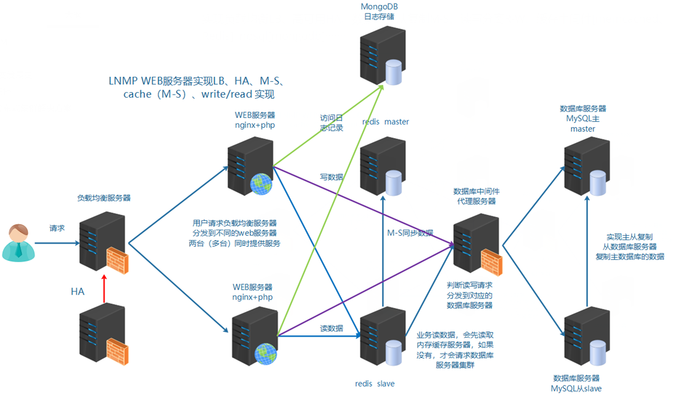
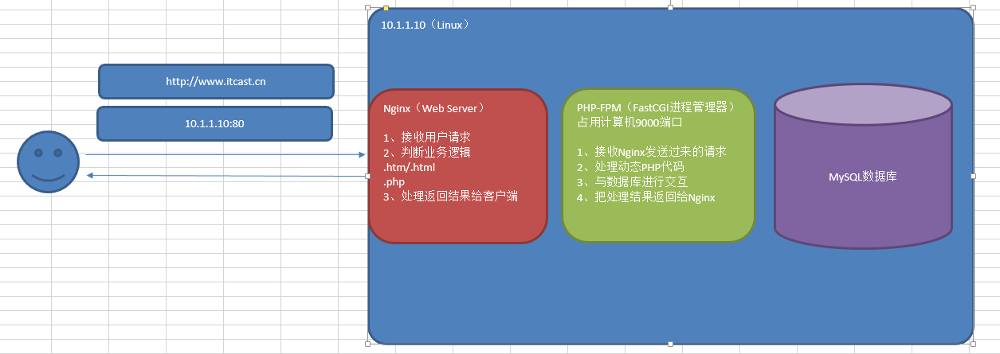
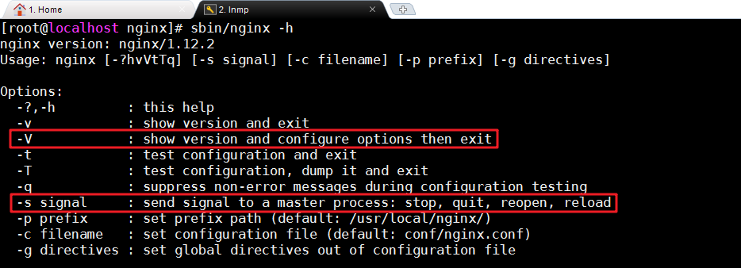
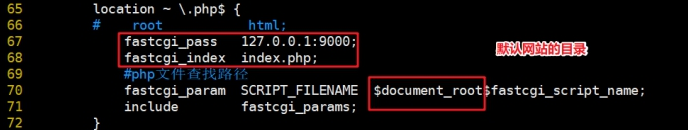

# 企业级架构之LNMP

# 学习目标

- [ ] 能够描述Web项目运行流程
- [ ] 能够了解PV、DAU、QPS等参数
- [ ] 能够理解LNMP的关系
  - [ ] 能够部署配置MySQL生产环境
  - [ ] 能够部署配置Nginx生产环境（重点）
  - [ ] 能够部署配置PHP生产环境（重点）
- [ ] 能够理解PHP-FPM和Nginx关联关系
- [ ] 能够配置Nginx关联到PHP-FPM

# 一、运维十年演变发展史

## 1、项目开发流程

公司老板和产品经理根据市场调查，决定开发的一整套互联网产品

==互动社交+电商+用户论坛（BBS）==

> 产品决策（老板+产品+UI设计）=> 代码开发（程序开发人员[前端开发[客户端页面或者APP]和后端开发[java php python node ruby]）=> 测试工作（测试人员）=> 部署上线（运维人员）（sa、dev 开发ops运维=devops=>7（运维）:3（开发））

项目周期：技术人员在项目周期加班大概1-3个月

## 2、企业架构分布式集群解决方案

集群：多台服务器在一起作同样的事 。

分布式 ：多台服务器在一起作不同的事 。

咋理解集群与分布式？讲个故事：

小饭店原来只有一个厨师，切菜洗菜备料炒菜全干。后来客人多了，厨房一个厨师忙不过来，又请了个厨师，两个厨师都能炒一样的菜，这两个厨师的关系是集群。为了让厨师专心炒菜，把菜做到极致，又请了个配菜师负责切菜，备菜，备料，厨师和配菜师的关系是分布式，一个配菜师也忙不过来了，又请了个配菜师，两个配菜师关系是集群

最终的架构图示

实现负载均衡LB、高可用HA、数据库主从复制M-S、读写分离R-W、缓存中间件[memcached、Redis]  nosql[mongodb]·······



## 3、业务背景

年份：2008-2010

发布产品类型：互联网动态站点 社区论坛 商城 社交类站点

用户数量： 500左右

PV ： 1000-3000

DAU： 100-300（日活，每天的独立访客数量）

参数解析：

```powershell
PV（Page View）：页面访问量，即页面浏览量或点击量，用户每次刷新一次即被计算一次

UV（Unique Visitor）：独立访客，统计1天内访问某站点的用户数

DAU(Daily Active User)，日活跃用户数量。常用于反映网站、互联网应用或网络游戏的运营情况

吞吐量：应用系统每秒钟最大能接受的用户访问量或者每秒钟最大能处理的请求数

QPS（Query Per Second）：每秒钟处理完请求的次数，注意这里是处理完。具体是指发出请求到服务器处理完成功返回结果。可以理解在Server中有个Counter，每处理一个请求加1，1秒后Counter=QPS

TPS（Transactions Per Second）：每秒钟处理完的事务次数，一般TPS是对整个系统来讲的。一个应用系统1s能完成多少事务处理，一个事务在分布式处理中，可能会对应多个请求，对于衡量单个接口服务的处理能力，用QPS比较多

并发量：系统能同时处理的请求数
RT：响应时间，处理一次请求所需要的平均处理时间

计算公式：
QPS = 并发量 / 平均响应时间
并发量 = QPS * 平均响应时间
```

举个栗子：

假设服务并发量为1500，RT为150ms，那么该服务的QPS ：

10000 = 1500（并发数） /  0.15 （RT） 

假如通过压测一台机器的QPS为500，那么该服务需要20台这样的机器。

# 二、服务器准备

## 1、操作系统

CentOS7.6（最小化安装）

## 2、修改主机名和hosts

~~~powershell
# hostnamectl set-hostname web01.itcast.cn
# cat /etc/hosts
127.0.0.1   localhost localhost.localdomain localhost4 localhost4.localdomain4
::1         localhost localhost.localdomain localhost6 localhost6.localdomain6
10.1.1.11   web01 web01.itcast.cn
~~~

## 3、关闭防火墙与SELinux

扩展：CentOS6=>service，CentOS7=>systemctl

服务管理：启动/停止/重启/查看状态

```powershell
# systemctl start/stop/restart/status 服务名称
```

开机启动项管理：

```powershell
# systemctl enable  服务名称	=>  开机启动
# systemctl disable 服务名称	=>  开机不启动
```

关闭防火墙与SELinux：

~~~powershell
# systemctl stop firewalld
# systemctl disable firewalld
# setenforce 0
# sed -i '/SELINUX=enforcing/cSELINUX=disabled' /etc/selinux/config
等价于
# vim /etc/selinux/config
SELINUX=disabled
~~~

## 4、关闭NetworkManager服务（重要）

~~~powershell
# systemctl stop NetworkManager
# systemctl disable NetworkManager
~~~

## 5、配置yum源

分别配置本地源、阿里云以及epel源（扩展源）

~~~powershell
[root@db01 ~]# mount /dev/sr0 /mnt
[root@db01 yum.repos.d]# cat server.repo 
[local]
name=local yum
baseurl=file:///mnt
enabled=1
gpgcheck=0

[aliyun]
name=aliyun yum
baseurl=http://mirrors.aliyun.com/centos/7/os/x86_64/
enabled=1
gpgcheck=0

[epel]
name=Extra Packages for Enterprise Linux 7 - $basearch
baseurl=https://mirrors.tuna.tsinghua.edu.cn/epel/7/$basearch
#mirrorlist=https://mirrors.fedoraproject.org/metalink?repo=epel-7&arch=$basearch
failovermethod=priority
enabled=1
gpgcheck=1
gpgkey=file:///etc/pki/rpm-gpg/RPM-GPG-KEY-EPEL-7

[epel-debuginfo]
name=Extra Packages for Enterprise Linux 7 - $basearch - Debug
baseurl=https://mirrors.tuna.tsinghua.edu.cn/epel/7/$basearch/debug
#mirrorlist=https://mirrors.fedoraproject.org/metalink?repo=epel-debug-7&arch=$basearch
failovermethod=priority
enabled=0
gpgkey=file:///etc/pki/rpm-gpg/RPM-GPG-KEY-EPEL-7
gpgcheck=1

[epel-source]
name=Extra Packages for Enterprise Linux 7 - $basearch - Source
baseurl=https://mirrors.tuna.tsinghua.edu.cn/epel/7/SRPMS
#mirrorlist=https://mirrors.fedoraproject.org/metalink?repo=epel-source-7&arch=$basearch
failovermethod=priority
enabled=0
gpgkey=file:///etc/pki/rpm-gpg/RPM-GPG-KEY-EPEL-7
gpgcheck=1

# yum makecache
# yum install vim -y
# yum install net-tools -y     ===>    net-tools中包含了ifconfig
~~~

## 6、设置网络

```powershell
# vim /etc/sysconfig/network-scripts/ifcfg-ens33
IPADDR=10.1.1.10
NETMASK=255.255.255.0
GATEWAY=10.1.1.2
DNS1=119.29.29.29
DNS2=114.114.114.114

# systemctl restart network
```

## 7、ntpdate时间同步

```powershell
# yum install ntpdate -y
# ntpdate cn.ntp.org.cn
```

# 三、LNMP环境搭建

LNMP = Linux + Nginx + MySQL + PHP



rpm、yum、源码编译安装

## 前期准备

| 编号 | 主机名称        | IP地址    | 角色  |
| ---- | --------------- | --------- | ----- |
| 1    | web01.itcast.cn | 10.1.1.11 | Web01 |

第一步：更改服务器的IP地址

```powershell
# vim /etc/sysconfig/network-scripts/ifcfg-ens33
IPADDR=10.1.1.11
更改UUID的后三位编号
# systemctl restart network
```

第二步：更改主机名称与/etc/hosts文件

```powershell
# hostnamectl set-hostname lnmp01.itcast.cn
# su
# vim /etc/hosts
10.1.1.11 lnmp01 lnmp01.itcast.cn
# systemctl restart network
```

## 1、MySQL软件安装

瑞典AB公司，MySQL默认编码=>latin1 => 甲骨文（Oracle），Oracle MySQL

yum安装：默认安装并不是mysql，实际使用的是mariadb

mariadb => 基于mysql的衍生版，开源免费的

安装mysql可以使用yum或者编译安装，另外一种安装方式：glibc软件包安装

glibc软件包：经过编译的二进制软件包（类似Windows中的绿色软件）

官网：www.mysql.com

### ☆ 常见的Web架构

ASP  ： IIS服务器软件

PHP ： LAMP/LNMP

JSP   ： Nginx + Tomcat

### ☆ MySQL软件安装

第一步：软件包下载

```powershell
mysql-5.6.35-linux-glibc2.5-x86_64.tar.gz
说明：通用linux下的二进制包，已编译好，只需放到相应的安装目录里即可
```

第二步：默认选项

```powershell
默认安装路径：/usr/local/mysql             mysql安装目录
默认数据目录：/usr/local/mysql/data		mysql数据目录
默认端口：3306
默认socket文件存放路径：/tmp/mysql.sock	   套接字文件，负责客户端与服务器端进行网络连接
```

第三步：安装步骤

参考官当：[MySQL-glibc安装手册](https://dev.mysql.com/doc/refman/5.6/en/binary-installation.html)

需求：

1. MySQL的安装目录为：/usr/local/mysql
2. MySQL的数据目录为:  /usr/local/mysql/data

① 创建用户和安装目录

```powershell
[root@web01 ~]# useradd mysql -r -s /sbin/nologin
[root@web01 ~]# id mysql
uid=997(mysql) gid=995(mysql) 组=995(mysql)
[root@web01 ~]# mkdir /usr/local/mysql
```

② 拷贝程序到安装目录

```powershell
1）下载glibc的软件包
[root@web01 ~]# ls /soft/installer/mysql-5.6.35-linux-glibc2.5-x86_64.tar.gz 
/soft/installer/mysql-5.6.35-linux-glibc2.5-x86_64.tar.gz
2）解压glibc的软件包
[root@web01 ~]# cd /soft/installer/
[root@web01 installer]# tar -xf mysql-5.6.35-linux-glibc2.5-x86_64.tar.gz 
3）进入到解压目录里拷贝数据文件到安装目录
[root@web01 installer]# cd mysql-5.6.35-linux-glibc2.5-x86_64/
[root@web01 mysql-5.6.35-linux-glibc2.5-x86_64]# cp -a ./* /usr/local/mysql/
说明：将数据文件拷贝到mysql的安装路径后，说明mysql数据库已经安装完成！！
```

==③ 初始化数据库（重点）==

```powershell
1）进入到mysql的安装目录里
[root@web01 mysql-5.6.35-linux-glibc2.5-x86_64]# cd /usr/local/mysql/
[root@web01 mysql]# 

2）更改mysql安装目录的权限
[root@web01 mysql]# chown -R mysql.mysql /usr/local/mysql/
[root@web01 mysql]# ll -d /usr/local/mysql/               
drwxr-xr-x 13 mysql mysql 191 1月  20 18:54 /usr/local/mysql/

3）初始化数据库
注意：确保当前系统没有/etc/my.cnf文件
# yum remove mariadb-libs
# rm -f /etc/my.cnf
[root@web01 mysql]# scripts/mysql_install_db --user=mysql
[root@web01 mysql]# ls /usr/local/mysql/data/
ibdata1  ib_logfile0  ib_logfile1  mysql  performance_schema  test
```

④ 启动数据库

```powershell
[root@web01 mysql]# cp support-files/mysql.server /etc/init.d/mysql
[root@web01 mysql]# service mysql start
Starting MySQL.Logging to '/usr/local/mysql/data/web01.itcast.cn.err'.
 SUCCESS! 
[root@web01 mysql]# ss -naltp|grep mysqld
LISTEN     0      80          :::3306                    :::*                   users:(("mysqld",pid=15921,fd=10))
```

⑤ 后续配置(任选其一)

```powershell
1）更改数据库管理员root密码
[root@web01 mysql]# ./bin/mysqladmin -u root password '123'
Warning: Using a password on the command line interface can be insecure.

2）安全初始化数据库
[root@web01 mysql]# ./bin/mysql_secure_installation
...
Enter current password for root (enter for none): 输入当前密码
OK, successfully used password, moving on...
...
Change the root password? [Y/n] n	是否更改管理员root密码
...
Remove anonymous users? [Y/n] y		是否移除匿名用户
 ... Success!
...
Disallow root login remotely? [Y/n] n 	是否禁止root从远程登录;生产禁止，测试允许
...
Remove test database and access to it? [Y/n] y 是否移除test库
...
Reload privilege tables now? [Y/n] y	是否刷新权限表
 ... Success!
```

⑥ 测试登录

```powershell
[root@web01 mysql]# mysql -u root -p
-bash: mysql: 未找到命令
说明：
-u 指定连接用户
-p 指定用户密码

原因：环境变量找不到
解决：修改/etc/profile文件追加以下内容
[root@web01 mysql]# echo 'export PATH=$PATH:/usr/local/mysql/bin' >> /etc/profile
[root@web01 mysql]# source /etc/profile

[root@web01 mysql]# mysql -u root -p  
Enter password: 
...
mysql> show databases;
+--------------------+
| Database           |
+--------------------+
| information_schema |
| mysql              |
| performance_schema |
+--------------------+
3 rows in set (0.00 sec)
```

### ☆ MySQL服务配置

```powershell
# vim /usr/lib/systemd/system/mysql.service
[Unit]
Description=MySQL Server
After=network.target
After=syslog.target

[Service]
User=mysql
Group=mysql
ExecStart=/usr/local/mysql/bin/mysqld --defaults-file=/usr/local/mysql/my.cnf
LimitNOFILE = 5000
PrivateTmp=false

[Install]
WantedBy=multi-user.target
```

## 2、Nginx软件安装

### ☆ Nginx概述

Nginx (engine x) 是一个高性能的HTTP和反向代理web服务器，同时也提供了IMAP/POP3/SMTP服务。Nginx是由伊戈尔·赛索耶夫为俄罗斯访问量第二的Rambler.ru站点（俄文：Рамблер）开发的，第一个公开版本0.1.0发布于2004年10月4日。

Nginx是一款轻量级的Web 服务器/反向代理服务器及电子邮件（IMAP/POP3）代理服务器，在BSD-like 协议下发行。其特点是占有内存少，并发能力强，事实上nginx的并发能力确实在同类型的网页服务器中表现较好，中国大陆使用nginx网站用户有：百度、京东、新浪、网易、腾讯、淘宝等。

```powershell
# curl -I 域名地址
Server:Nginx
```

### ☆ 常见用法

```powershell
1) web服务器软件 httpd(apache)
   同类型web服务器软件：apache nginx(俄罗斯) iis(微软) lighttpd(德国)
2) 提供了IMAP/POP3/SMTP服务
3) 充当反向代理服务器，实现负载均衡功能。LB=>Load Blance
```

### ☆ Nginx特点

① 高可靠：稳定性  master进程 管理调度请求分发到哪一个worker=> worker进程 响应请求   一master多worker

② 热部署 ：（1）平滑升级  （2）可以快速重载配置

③ 高并发：可以同时响应更多的请求  事件 epoll模型   几万

④ 响应快：尤其在处理静态文件上，响应速度很快  sendfile

⑤ 低消耗：cpu和内存   1w个请求  内存2-3MB

⑥ 分布式支持：反向代理  七层负载均衡，新版本也支持四层负载均衡

### ☆  常见安装方式

常见安装方式：

① yum安装配置，需使用Nginx官方源或者EPEL源

② 源码编译

### ☆ 编译安装Nginx

软件的编译安装过程：编译安装三步走

① 配置软件./configure

② 编译，生成可执行的软件包make

③ 安装make install

--------------------------------------- 华丽的分割线 ------------------------------------

第一步：安装依赖库

```powershell
[root@web01 ~] # mount /dev/sr0 /mnt
[root@web01 ~] # yum -y install pcre-devel zlib-devel openssl-devel
```

第二步：创建账号

```powershell
[root@web01 ~] # useradd -r -s /sbin/nologin www
```

第三步：配置/编译与安装

```powershell
tar xvf nginx-1.12.2.tar.gz

cd nginx-1.12.2
./configure --prefix=/usr/local/nginx --user=www --group=www --with-http_ssl_module --with-http_stub_status_module --with-http_realip_module

make && make install
```

编译参数说明

| 参数                           | 作用                                                         |
| ------------------------------ | ------------------------------------------------------------ |
| --prefix                       | 编译安装到的软件目录                                         |
| --user                         | worker进程运行用户                                           |
| --group                        | worker进程运行用户组                                         |
| --with-http_ssl_module         | 支持https  需要==**pcel-devel**==依赖                        |
| --with-http_stub_status_module | 基本状态信息显示       查看请求数、连接数等                  |
| --with-http_realip_module      | 定义客户端地址和端口为header头信息     常用于反向代理后的真实IP获取 |

### ☆  Nginx目录介绍

| 目录 | 作用                                 |
| ---- | ------------------------------------ |
| conf | 配置文件(nginx.conf)                 |
| html | 网站默认目录                         |
| logs | 日志(access.log、error.log)          |
| sbin | 可执行文件  [软件的启动 停止 重启等] |

### ☆ 软件操作参数



| 参数       | 作用                                                         |
| ---------- | ------------------------------------------------------------ |
| -V         | 显示Nginx版本号以及配置选项                                  |
| -s  signal | stop关闭     quit优雅的关闭     reopen重开日志     reload重载 |

### ☆ Nginx服务配置

CentOS7.6 配置：

```powershell
# sbin/nginx -s stop
# Nginx服务配置到该文件中
vim /usr/lib/systemd/system/nginx.service

[Unit]
Description=Nginx Web Server
After=network.target
  
[Service]
Type=forking
ExecStart=/usr/local/nginx/sbin/nginx -c /usr/local/nginx/conf/nginx.conf
ExecReload=/usr/local/nginx/sbin/nginx -s reload
ExecStop=/usr/local/nginx/sbin/nginx -s quit
PrivateTmp=true
  
[Install]
WantedBy=multi-user.target

扩展：
Type=forking，forking代表后台运行
```

启动Nginx服务：

```powershell
[root@server01 ~] # systemctl start nginx.service
```

设置Nginx开机启动：

```powershell
[root@server01 ~] # systemctl enable nginx.service
```

## 3、PHP软件安装

### ☆ PHP概述

==**PHP**==（外文名:PHP: Hypertext Preprocessor，中文名：“超文本预处理器”）是一种通用开源脚本语言，主要应用于Web领域。

==PHP是将程序嵌入到HTML（标准通用标记语言下的一个应用）文档中去执行，执行效率比完全生成HTML标记的CGI要高许多==

PHP还可以执行编译后代码，编译可以达到加密和优化代码运行，使代码运行更快。（新特性）

### ☆ PHP-FPM

Apache：Apache + PHP（FCGI），容易崩溃，效率低

==Nginx ： Nginx + PHP，PHP-FPM进程管理器，稳定，效率高==

```powershell
PHP-FPM(FastCGI Process Manager：FastCGI进程管理器)
对于PHP 5.3.3之前的php来说，是一个补丁包 ，旨在将FastCGI进程管理整合进PHP包中。
相对Spawn-FCGI，PHP-FPM在CPU和内存方面的控制都更胜一筹，而且前者很容易崩溃，必须用crontab定时进行监控，而PHP-FPM则没有这种烦恼。
PHP5.3.3已经集成php-fpm了，不再是第三方的包了。PHP-FPM提供了更好的PHP进程管理方式，可以有效控制内存和进程、可以平滑重载PHP配置，比spawn-fcgi具有更多优点，所以被PHP官方收录了。
注意：
在./configure的时候带 –-enable-fpm 参数即可开启PHP-FPM
```

### ☆ 编译安装PHP

第一步：安装依赖库

```powershell
[root@web01 ~] # yum -y install libxml2-devel libjpeg-devel libpng-devel freetype-devel curl-devel openssl-devel
```

第二步：解压压缩包

```powershell
[root@web01 ~] # tar -zxf php-7.2.12.tar.gz
[root@web01 ~] # cd php-7.2.12
```

第三步：编译安装PHP => php_fpm（PHP扩展，PHP连接MySQL，需要MySQL扩展）

```powershell
[root@web01 php-7.2.12] # ./configure --prefix=/usr/local/php --with-config-file-path=/usr/local/php/etc --enable-fpm --with-fpm-user=www --with-fpm-group=www --with-mysqli=mysqlnd --with-pdo-mysql=mysqlnd --with-iconv-dir --with-freetype-dir --with-jpeg-dir --with-png-dir --with-zlib --with-libxml-dir --enable-xml --disable-rpath --enable-bcmath --enable-shmop --enable-sysvsem --enable-inline-optimization --with-curl --enable-mbregex --enable-mbstring --enable-ftp --with-gd --with-openssl --with-mhash --enable-pcntl --enable-sockets --with-xmlrpc --with-libzip --enable-soap --without-pear --with-gettext --disable-fileinfo --enable-maintainer-zts

[root@server01 php-7.2.12] # make && make install
```

### ☆ 配置

使用php-fpm进行管理php服务，有两个配置文件：

① php.ini                   #默认php配置文件（/root/php-7.2.12）

② php-fpm.conf       #php-fpm相关的配置 （默认已存在）

③ www.conf			  #php-fpm主配置文件（默认已存在）

```powershell
# cp /root/php-7.2.12/php.ini-development /usr/local/php/etc/php.ini
# cp /usr/local/php/etc/php-fpm.conf.default /usr/local/php/etc/php-fpm.conf
# cp /usr/local/php/etc/php-fpm.d/www.conf.default /usr/local/php/etc/php-fpm.d/www.conf
```

注意：

development配置项多一些  显示语法错误等等信息  适合于部署开发环境和测试环境

production  默认开启项少  生产环境是不要出现错误  暴露服务器目录结构

### ☆ 添加启动服务

```powershell
# cp /root/php-7.2.12/sapi/fpm/init.d.php-fpm /etc/init.d/php-fpm
# chmod +x /etc/init.d/php-fpm
# service php-fpm start
```

### ☆ 添加环境变量

（方便php、phpize、phpconfig查找使用）

```powershell
# echo 'PATH=/usr/local/php/bin:$PATH' >> /etc/profile
# source /etc/profile
```

### ☆ php-fpm服务配置

```powershell
# service php-fpm stop
# vim /usr/lib/systemd/system/php-fpm.service
[Unit]
Description=PHP FastCGI Process Manager
After=syslog.target network.target

[Service]
Type=forking
PIDFile=/var/run/php-fpm.pid
ExecStart=/usr/local/php/sbin/php-fpm -D
ExecReload=/bin/kill -USR2 $MAINPID
PrivateTmp=true

[Install]
WantedBy=multi-user.target

# systemctl daemon-reload
```

## 4、Nginx+PHP配置

写入文件/usr/local/nginx/html/demo.php

```powershell
<?php
	phpinfo();
```

nginx和php进行关联，告诉nginx，php在哪里：

vim /usr/local/nginx/conf/nginx.conf，提升root：

```powershell
root html;
location / {
	index index.html index.htm;
}
```

设置nginx+php关联，$document_root就是加载root目录：

 

