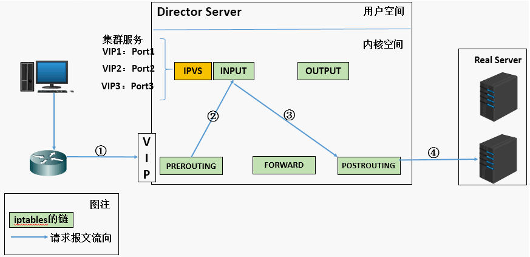
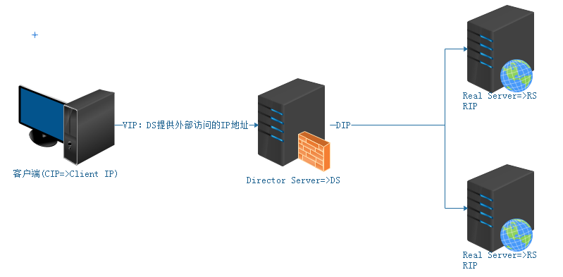
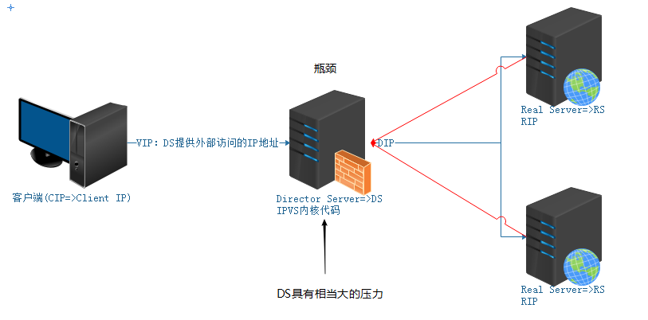
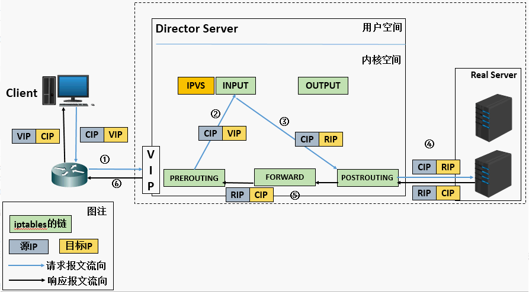
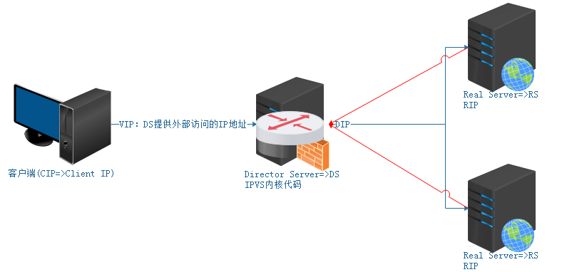
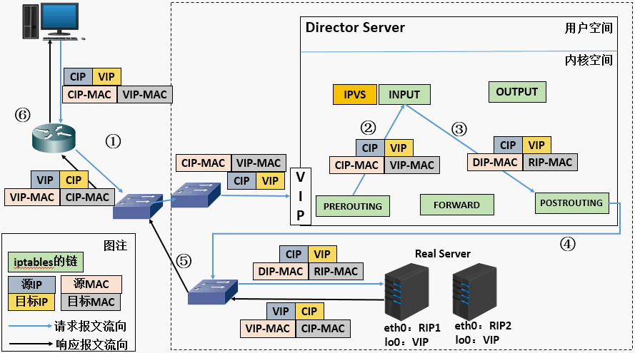
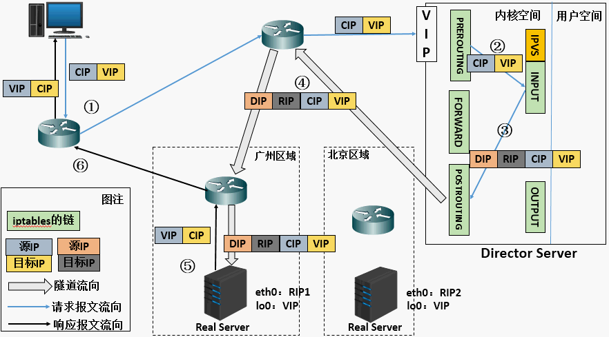

# 企业级架构之LVS负载均衡

# 学习目标

1、能够了解LVS的基本工作方式

2、能够安装配置LVS实现负载均衡

3、能够了解LVS-NAT的配置方式

4、能够了解LVS-DR的配置方式

5、了解LVS的十种调度算法

# 一、LVS概述

## 1、什么是LVS

LVS是 Linux Virtual Server 的简称，也就是Linux虚拟服务器。这是一个由章文嵩博士发起的一个开源项目，它的官方网是 http://www.linuxvirtualserver.org 现在 LVS 已经是 Linux 内核标准的一部分。使用 LVS 可以达到的技术目标是：通过 LVS 达到的负载均衡技术和 Linux 操作系统实现一个高性能高可用的 Linux 服务器集群，它具有良好的可靠性、可扩展性和可操作性。从而以低廉的成本实现最优的性能。LVS 是一个实现负载均衡集群的开源软件项目，LVS架构从逻辑上可分为调度层、Server集群层和共享存储。

## 2、LVS工作原理



```powershell
第一步：当用户向负载均衡调度器（Director Server）发起请求，调度器将请求发往至内核空间
第二步：PREROUTING链首先会接收到用户请求，判断目标IP确定是本机IP，将数据包发往INPUT链
第三步：IPVS是工作在INPUT链上的，当用户请求到达INPUT时，IPVS会将用户请求和自己已定义好的集群服务进行比对，如果用户请求的就是定义的集群服务，那么此时IPVS会强行修改数据包里的目标IP地址及端口，并将新的数据包发往POSTROUTING链
第四步：POSTROUTING链接收数据包后发现目标IP地址刚好是自己的后端服务器，那么此时通过选路，将数据包最终发送给后端的服务器
```

## 3、LVS的组成

LVS 由2部分程序组成，包括 ipvs 和 ipvsadm

① ipvs(ip virtual server)：一段代码工作在内核空间，叫ipvs，是真正生效实现调度的代码（类似Nginx中的proxy_pass）。

② ipvsadm：另外一段是工作在用户空间，叫ipvsadm，负责为ipvs内核框架编写规则，定义谁是集群服务，而谁是后端真实的服务器(Real Server)，类似Nginx中的upstream

==LVS组成 = ipvs（内核，负载均衡调度代码）+ ipvsadm（ipvs管理器，负责提供集群/Real Server后端服务器等信息）==

## 4、LVS相关术语

负载均衡（1台） + Web服务器（2台）

DS：Director Server。指的是前端负载均衡器节点（负载均衡服务器）

RS：Real Server。后端真实的工作服务器（Web服务器）

VIP：向外部直接面向用户请求，作为用户请求的目标的IP地址（负载均衡的VIP地址，提供给用户）

DIP：Director Server IP，主要用于和内部主机通讯的IP地址（负载与Web服务器交互的内部IP）

RIP：Real Server IP，后端服务器的IP地址。

CIP：Client IP，访问客户端的IP地址。



## 5、LVS三种工作模式

① NAT模式（重点=>使用量次之）

② DR模式（重点=>使用量最大）

③ Tun模式（了解）=> IP隧道模式

# 二、LVS/NAT原理和特点

## 1、NAT工作原理图

重点理解NAT方式的实现原理和数据包的改变





```powershell
(a) 当用户请求到达Director Server，此时请求的数据报文会先到内核空间的PREROUTING链。 此时报文的源IP为CIP，目标IP为VIP
(b) PREROUTING检查发现数据包的目标IP是本机，将数据包送至INPUT链
(c) IPVS比对数据包请求的服务是否为集群服务，若是，修改数据包的目标IP地址为后端服务器IP，然后将数据包发至POSTROUTING链。 此时报文的源IP为CIP，目标IP为RIP
(d) POSTROUTING链通过选路，将数据包发送给Real Server
(e) Real Server比对发现目标为自己的IP，开始构建响应报文发回给Director Server。 此时报文的源IP为RIP，目标IP为CIP
(f) Director Server在响应客户端前，此时会将源IP地址修改为自己的VIP地址，然后响应给客户端。 此时报文的源IP为VIP，目标IP为CIP
```

## 2、NAT模型的特性

- RS应该使用私有地址，RS的网关必须指向DIP
- DIP和RIP必须在同一个网段内
- 请求和响应报文都需要经过Director Server，高负载场景中，Director Server易成为性能瓶颈
- 支持端口映射
- RS可以使用任意操作系统
- 缺陷：对Director Server压力会比较大，请求和响应都需经过director server



# 三、LVS/DR原理和特点

## 1、DR工作原理图

注意：重点理解请求报文的目标MAC地址设定为挑选出的RS的MAC地址



```powershell
(a) 当用户请求到达Director Server，此时请求的数据报文会先到内核空间的PREROUTING链。 此时报文的源IP为CIP，目标IP为VIP
(b) PREROUTING检查发现数据包的目标IP是本机，将数据包送至INPUT链
(c) IPVS比对数据包请求的服务是否为集群服务，若是，将请求报文中的源MAC地址修改为DIP的MAC地址，将目标MAC地址修改RIP的MAC地址，然后将数据包发至POSTROUTING链。 此时的源IP和目的IP均未修改，仅修改了源MAC地址为DIP的MAC地址，目标MAC地址为RIP的MAC地址
(d) 由于DS和RS在同一个网络中，所以是通过二层来传输。POSTROUTING链检查目标MAC地址为RIP的MAC地址，那么此时数据包将会发至Real Server。
(e) RS发现请求报文的MAC地址是自己的MAC地址，就接收此报文。处理完成之后，将响应报文通过lo接口传送给eth0网卡然后向外发出。 此时的源IP地址为VIP，目标IP为CIP
(f) 响应报文最终送达至客户端
```

## 2、**LVS-DR模型的特性**

- 特点1：保证前端路由将目标地址为VIP报文统统发给Director Server，而不是RS
- RS可以使用私有地址；也可以是公网地址，如果使用公网地址，此时可以通过互联网对RIP进行直接访问
- RS跟Director Server必须在同一个物理网络中
- 所有的请求报文经由Director Server，但响应报文必须不能进过Director Server
- 不支持地址转换，也不支持端口映射
- RS可以是大多数常见的操作系统
- RS的网关绝不允许指向DIP(因为我们不允许他经过director)
- RS上的lo接口配置VIP的IP地址
- 缺陷：RS和DS必须在同一机房中

## 3、特点1的解决方案

- 在前端路由器做静态地址路由绑定，将对于VIP的地址仅路由到Director Server
- 存在问题：用户未必有路由操作权限，因为有可能是运营商提供的，所以这个方法未必实用
- arptables：在arp的层次上实现在ARP解析时做防火墙规则，过滤RS响应ARP请求。这是由iptables提供的
- 修改RS上内核参数（arp_ignore和arp_announce）将RS上的VIP配置在lo接口的别名上，并限制其不能响应对VIP地址解析请求。

# 四、LVS/Tun原理和特点(了解)

## 1、Tun工作原理图

在原有的IP报文外再次封装多一层IP首部，内部IP首部(源地址为CIP，目标IP为VIP)，外层IP首部(源地址为DIP，目标IP为RIP)



```powershell
(a) 当用户请求到达Director Server，此时请求的数据报文会先到内核空间的PREROUTING链。 此时报文的源IP为CIP，目标IP为VIP 。
(b) PREROUTING检查发现数据包的目标IP是本机，将数据包送至INPUT链
(c) IPVS比对数据包请求的服务是否为集群服务，若是，在请求报文的首部再次封装一层IP报文，封装源IP为为DIP，目标IP为RIP。然后发至POSTROUTING链。 此时源IP为DIP，目标IP为RIP
(d) POSTROUTING链根据最新封装的IP报文，将数据包发至RS（因为在外层封装多了一层IP首部，所以可以理解为此时通过隧道传输）。 此时源IP为DIP，目标IP为RIP
(e) RS接收到报文后发现是自己的IP地址，就将报文接收下来，拆除掉最外层的IP后，会发现里面还有一层IP首部，而且目标是自己的lo接口VIP，那么此时RS开始处理此请求，处理完成之后，通过lo接口送给eth0网卡，然后向外传递。 此时的源IP地址为VIP，目标IP为CIP
(f) 响应报文最终送达至客户端
```

## 2、LVS-Tun模型的特性

- RIP、VIP、DIP全是公网地址
- RS的网关不会也不可能指向DIP
- 所有的请求报文经由Director Server，但响应报文必须不能进过Director Server
- 不支持端口映射
- RS的系统必须支持隧道

注：其实企业中最常用的是 DR 实现方式，而 NAT 配置上比较简单和方便，后边实践中会总结 DR 和 NAT 具体使用配置过程。

# 五、LVS的十种调度算法

## 1、Fixed Scheduling Method 静态调度

**① RR  轮询**（常用）
调度器通过"轮叫"调度算法将外部请求按顺序轮流分配到集群中的真实服务器上，它均等地对待每一台服务器，而不管服务器上实际的连接数和系统负载。

**② WRR  加权轮询**（常用） => weight
调度器通过"加权轮叫"调度算法根据真实服务器的不同处理能力来调度访问请求。 这样可以保证处理能力强的服务器处理更多的访问流量。调度器 可以自动问询真实服务器的负载情况，并动态地调整其权值。

**③ DH  目标地址hash**
算法也是针对目标IP地址的负载均衡，但它是一种静态映射算法，通过一个散列（Hash）函数将一个目标IP地址映射到一台服务器。
目标地址散列调度算法先根据请求的目标IP地址，作为散列键（Hash Key）从静态分配的散列表找出对应的服务器，若该服务器是可用的且未超载，将请求发送到该服务器，否则返回空。

**④ SH  源地址hash** => 类似ip_hash => 解决Session共享问题 （基于算法、基于NoSQL）
算法正好与目标地址散列调度算法相反，它根据请求的源IP地址，作为散列键（Hash Key）从静态分配的散列表找出对应的服务器，若该服务器是 可用的且未超载，将请求发送到该服务器，否则返回空。
它采用的散列函数与目标地址散列调度算法的相同。除了将请求的目标IP地址换成请求的源IP地址外，它的算法流程与目标地址散列调度算法的基本相似。在实际应用中，源地址散列调度和目标地址散列调度可以结合使用在防火墙集群中，它们可以保证整个系统的唯一出入口。

## 2、Dynamic Scheduling Method 动态调度

**① LC  最少连接**（常用）
调度器通过"最少连接"调度算法动态地将网络请求调度到已建立的链接数最少的服务器上。 如果集群系统的真实服务器具有相近的系统性能，采用"最小连接"调度算法可以较好地均衡负载。

==active活动连接：正在传输数据==

==inactive非活动连接：刚建立握手，还没有传输数据或传输数据完毕，还没有来得及断开==

active*256+inactive，然后挑选服务器中上述值最小者分配新连接

**② WLC 加权最少连接**（常用）
在集群系统中的服务器性能差异较大的情况下，调度器采用"加权最少链接"调度算法优化负载均衡性能，具有较高权值的服务器将承受较大比例的活动连接负载。调度器可以自动问询真实服务器的负载情况，并动态地调整其权值。

（active*256+inactive）/ 权重

**③ SED 最少期望延迟**

最短的期望的延迟调度（Shortest Expected Delay 简称'SED'）算法基于WLC算法。举个例子吧，ABC三台服务器的权重分别为1、2、3 。那么如果使用WLC算法的话一个新请求进入时它可能会分给ABC中的任意一个。使用SED算法后会进行一个运算

（active +1）*256 / 权重

**④ vNQ  从不排队调度方法**
无需列队，如果有台realserver的活动连接数=0 就直接分配过去，不需要进行sed运算

**⑤ LBLC   基于本地的最少连接**
"基于局部性的最少链接" 调度算法是针对目标IP地址的负载均衡，目前主要用于Cache集群系统。
该算法根据请求的目标IP地址找出该 目标IP地址最近使用的服务器，若该服务器 是可用的且没有超载，将请求发送到该服务器；
若服务器不存在，或者该服务器超载且有服务器处于一半的工作负载，则用"最少链接"的原则选出一个可用的服务器，将请求发送到该服务器。

**⑥ LBLCR   带复制的基于本地的最少连接**
"带复制的基于局部性最少链接"调度算法也是针对目标IP地址的负载均衡，目前主要用于Cache集群系统。
它与LBLC算法的不同 之处是它要维护从一个 目标IP地址到一组服务器的映射，而LBLC算法维护从一个目标IP地址到一台服务器的映射。
该算法根据请求的目标IP地址找出该目标IP地址对应的服务器组，按"最小连接"原则从服务器组中选出一台服务器，
若服务器没有超载，将请求发送到该服务器；若服务器超载，则按"最小连接"原则从这个集群中选出一 台服务器 ，将该服务器加入到服务器组中，将请求发送到该服务器。同时，当该服务器组有一段时间没有被修改， 将最忙的服务器从服务器组中删除，以降低复制的程度。

# 六、LVS/NAT模式实践

## 1、环境准备

| 角色  | 作用                           | IP                                               |
| ----- | ------------------------------ | ------------------------------------------------ |
| lvs   | 负载均衡调度服务器          DS | 192.168. 22.* (对外访问的VIP)     10.1.1.18(DIP) |
| web01 | 真实服务器   web服务器    RS   | 10.1.1.11(RIP)                                   |
| web02 | 真实服务器   web服务器    RS   | 10.1.1.13(RIP)                                   |

给lvs增加一块网卡，命名为ens37桥接模式，自动获取IP即可，例子中IP获取为192.168.22.*

## 2、NAT实践

安装ipvsadm，只在负载均衡调度服务器上安装即可

```shell
shell > yum -y install ipvsadm
```

① RS上web服务正常运行，这个之前案例已经实现，可以沿用

```powershell
#启动web服务，能够正常访问
#添加默认路由网关
#如果有默认路由网关删除掉即可
shell > route del default
shell > route add default gw 10.1.1.18

#永久更改（策略）
# vim /etc/sysconfig/network
# GATEWAY=10.1.1.18
```

② 在DS上通过ipvsadm配置调度规则

```powershell
#定义一个集群服务
shell > ipvsadm -A -t 192.168.22.100:80 -s rr 
#添加RealServer并指定工作模式为NAT
shell > ipvsadm -a -t 192.168.22.*:80 -r 10.1.1.11 -m 
shell > ipvsadm -a -t 192.168.22.*:80 -r 10.1.1.13 -m
#查看ipvs定义的规则列表
shell > ipvsadm -L -n
#启动Linux的路由转发功能
shell > echo 1 > /proc/sys/net/ipv4/ip_forward

问题1：Zero port specified for non-persistent service
解决方案：未设置端口
问题2：Memory allocation problem
解决方案：信息输入错误
问题3：永久开启ip转发?
# vim /etc/sysctl.conf
net.ipv4.ip_forward = 1   => 设置完成后，使用sysctl -p刷新到内存
问题4：权重算法怎么设置?
ipvsadm -A -t 192.168.22.100:80 -s wrr  =>  wrr加权轮询/wlc加权最小连接
ipvsadm -a -t 192.168.22.100:80 -r 10.1.1.11 -m -w 8
ipvsadm -a -t 192.168.22.100:80 -r 10.1.1.13 -m -w 2
```

```powershell
ipvsadm常用参数说明
-A 增加一个虚拟服务
-t 配置虚拟机服务的地址
-s 负载均衡调度算法
-a 增加一个真实服务器
-r 真实服务器的地址
-m NAT工作模式
-C 清除所有规则
-g DR工作模式
-w 权重
```

③ 访问查看效果

④ 修改测试调度算法

删除RS：

```powershell
ipvsadm -d -t 192.168.22.100:80 -r 10.1.1.11
```

通过-s重新指定负载均衡调度算法

```powershell
ipvsadm -E -t 192.168.22.100:80 -s wrr
```

# 七、LVS/DR模式实践

## 1、环境准备

| 角色  | 作用                        | IP                                    |
| ----- | --------------------------- | ------------------------------------- |
| lvs   | 负载均衡调度服务器  DS      | 10.1.1.18(DIP)       10.1.1.100(VIP)  |
| web01 | 真实服务器   web服务器  RS1 | 10.1.1.11(RIP)        10.1.1.100(VIP) |
| web02 | 真实服务器   web服务器  RS2 | 10.1.1.13(RIP)        10.1.1.100(VIP) |

## 2、DR实践

安装ipvsadm，只在负载均衡调度服务器上安装即可

```shell
shell > yum -y install ipvsadm
```

① 在RS上配置

```powershell
# 设置arp的通告模式：禁止ARP请求风暴
shell > echo 1 > /proc/sys/net/ipv4/conf/lo/arp_ignore
shell > echo 2 > /proc/sys/net/ipv4/conf/lo/arp_announce
shell > echo 1 > /proc/sys/net/ipv4/conf/all/arp_ignore
shell > echo 2 > /proc/sys/net/ipv4/conf/all/arp_announce
# 绑定VIP到网卡（
shell > ifconfig lo:0 10.1.1.100  broadcast 10.1.1.100 netmask 255.255.255.255 up
# 添加主机路由
shell > route add -host 10.1.1.100 dev lo:0

问题1：永久更改arp_ignore与arp_announce
net.ipv4.conf.all.arp_ignore=1
net.ipv4.conf.lo.arp_ignore=1
net.ipv4.conf.all.arp_announce=2
net.ipv4.conf.lo.arp_announce=2
# sysctl -p  =>  刷新到内存

问题2：arp_ignore与arp_announce怎么理解?
https://www.cnblogs.com/lipengxiang2009/p/7451050.html

问题3：为什么把VIP的子网掩码设置为255.255.255.255?
比如不接受广播，可以让真实的IP地址接受广播等信息，并且一个该IP代表一个单独网段。
这样设置后，可以根据管理，随时通告ARP，进行IP与MAC对应，让交换的MAC表有对应的项，进而转发数据到RealServer
```

② 在DS上配置

```powershell
# 配置DS上的VIP
shell > ifconfig ens33:0 10.1.1.100 broadcast 10.1.1.100 netmask 255.255.255.255 up
# 添加主机路由
shell > route add -host 10.1.1.100 dev ens33:0
# 开启网卡转发
shell > echo 1 > /proc/sys/net/ipv4/ip_forward
# 配置转发规则
shell > ipvsadm -C
shell > ipvsadm -A -t 10.1.1.100:80 -s rr
shell > ipvsadm -a -t 10.1.1.100:80 -r 10.1.1.11 -g
shell > ipvsadm -a -t 10.1.1.100:80 -r 10.1.1.13 -g

ipvsadm常用参数说明
-A 增加一个虚拟服务
-t 配置虚拟机服务的地址
-s 负载均衡调度算法
-a 增加一个真实服务器
-r 真实服务器的地址
-m NAT工作模式
-C 清除所有规则
-g DR工作模式
-w 权重
```

## 3、把域名绑定到VIP

```powershell
Windows：
10.1.1.100 www.shop.com
```

