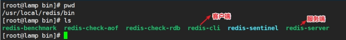
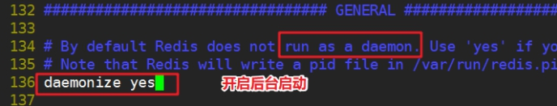
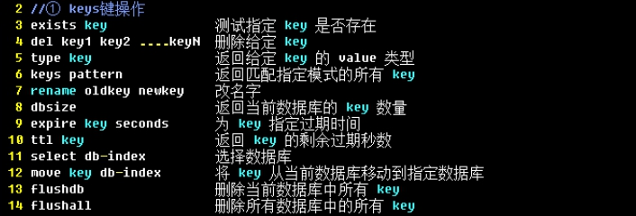
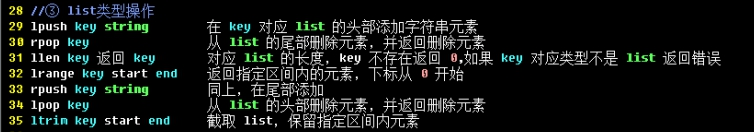
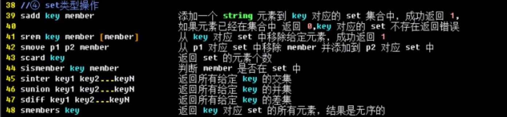
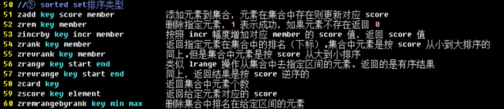

# 企业级架构缓存篇之Redis（重点）

# 学习目标

1、能够描述Redis作用及其业务适用场景

2、能够安装配置启动Redis

3、能够使用命令行客户端简单操作Redis

4、能够实现操作基本数据类型

5、能够理解描述Redis数据持久化机制

6、能够操作安装php的Redis扩展

7、能够操作实现Redis5主从模式（Redis新版集群以及哨兵模式）

# 一、背景描述及其方案设计

## 1、业务背景描述

时间：2016.9.-2017.6

发布产品类型：互联网动态站点 商城

用户数量： 25000（用户量猛增）

PV ： 1000000-5000000（24小时访问次数总和）

DAU： 12000（每日活跃用户数）

## 2、模拟运维设计方案


根据以上业务需求，准备加入Redis缓存中间件服务器，可以使用到redis更加丰富的功能

在商城业务中实现：

① 实现活跃用户数的统计（使用set集合）

② session存储到redis

③ openresty（nginx+lua）动态限制IP访问waf（web application firewalld）

# 二、Redis概述

## 1、什么是Redis


Nosql 非关系数据库 key => value  键值对

Redis是**R**emote **D**ictionary **S**erver(远程数据服务)的缩写

由意大利人 antirez(Salvatore Sanfilippo萨尔瓦托桑菲利波)  开发的一款 内存高速缓存数据库

该软件使用C语言编写，它的数据模型为 key-value

它支持丰富的数据结构，比如 **string   list（双向链表）  hash（哈希）   set（集合）  sorted set（zset有序集合）**

可持久化（保存数据到磁盘中），保证了数据安全

## 2、业务使用场合

**① [Sort Set]**排行榜应用，取top n操作，例如sina微博热门话题（取最热的前10个话题）

**② [List]**获得最新N个数据 或 某个分类的最新数据

**③ [String]**计数器应用

**④ [Set]**sns(social network site)获得共同好友

**⑤ [Set]**防攻击系统(ip判断)黑白名单等等

## 3、与memcached区别

① Redis不仅仅支持简单的k/v类型的数据，同时还提供list，set，zset，hash等数据结构的存储。

② Redis支持master-slave(主—从)模式应用。

③ Redis支持数据的持久化，可以将内存中的数据保持在磁盘中，重启的时候可以再次加载进行使用。

④ Redis单个value存储string的最大限制是512MB， memcached只能保存1MB的数据

⑤ redis是单核，memcached是多核

由于redis只能使用单核，而memcached可以使用多核，所以在比较上，平均每一个核上redis在储存小数据时比memcached性能更高。而却100K以上数据中，memcached性能要高于redis，虽然redis最近也在储存大数据的性能上进行优化，但是比起memcached还是有点逊色。结论是无论你使用那个，每秒处理请求的次数都不会成为瓶颈。

你需要关注内存使用率。对于key-vlaue这样简单的数据储存，memcached的内存使用率更高，如果采用hash结构，redis的内存使用率会更高，当然这都依赖于具体的应用场景。

# 三、安装与配置Redis

官方网址：<https://redis.io/>

github: <https://github.com/antirez/redis>

## 1、安装方式

可以通过yum方式在线安装，也可以通过源码编译方式安装

这里，采用源码编译方式安装：

```powershell
第一步：上传Redis到Linux系统中
redis-5.0.5.tar.gz
第二步：配置=>编译=>安装
shell > tar xvf redis-5.0.5.tar.gz
shell > cd redis-5.0.5
shell > make PREFIX=/usr/local/redis install
```

 安装成功后，如下图所示：

 

## 2、启动Redis


## 3、6379端口


Alessia Merz（阿莱西亚-梅尔兹）

<http://oldblog.antirez.com/post/redis-as-LRU-cache.html>

## 4、后台启动配置

① 复制配置文件到软件目录下


② 编辑配置文件

```powershell
shell > vim /usr/local/redis/conf/redis.conf
```

 

③ 启动redis-server加入redis.conf参数

 

## 5、命令行客户端简单使用

telnet可以连接redis，没有本身redis-cli更加好用

**① 简单的数据操作**

```powershell
# ./redis-cli
127.0.0.1:6379 > set name devops
OK
127.0.0.1:6379 > get name
"devops"
```

**② 查看操作语法帮助**

```powershell
# 127.0.0.1:6379 > help
# 127.0.0.1:6379 > help set
```

**③ 系统状态信息**

```powershell
# 127.0.0.1:6379 > info
```

# 四、数据结构类型操作

## 1、key（键名）

内存：NoSQL数据库，存储形式，键值对，类似身份证（不能重复，必须唯一）

key的命名规则不同于一般语言，键盘上除了空格、\n换行符外其他的大部分字符都可以使用。

但是像"my key"和"mykey\n"这样包含空格和换行的key是不允许的。

我们在使用的时候可以自己定义一个key的格式，但是要特别注意：

key不要太长。占内存，查询慢。

key不要太短。像u:1000:pwd:123456   就不如   user:1000:password:123456可读性好

 

默认在redis配置文件redis.conf中，提供了16库，查看配置文件：

```powershell
# databases 16
# 数据库的编号都是从0开始，最大值为16-1
```

☆ 判断key是否存在

```powershell
# exists key
存在1，不存在0
```

☆ 删除key

```powershell
# del key
```

☆ 获取type类型

```powershell
# type key
```

☆ 显示所有key

```powershell
# keys *
```

☆ 设置过期时间（单位s）

```powershell
# expire name 8
```

☆ 查看剩余时间

```powershell
# ttl name
```

☆ 查看当前库key数量

```powershell
# dbsize
```

☆ 切换数据库（共16个库，index = number -1）

```powershell
# select 0-15
```

☆ flushdb清空当前库

```powershell
# flushdb
```

☆ 清空所有库

```powershell
# flushall
```

## 2、string

string是redis最基本的类型

redis的string可以包含任何数据。包括jpg图片 base64或者序列化的对象

单个value值最大上限是512MB

如果只用string类型，redis就可以被看作加上持久化特性的memcached

 

☆ 设置string

```powershell
# set name itheima
```

☆ 批量设置string

```powershell
# mset name cndws age 18 address beijing
```

☆ 批量获取

```powershell
# mget name age address
```

☆ 增加与减少（+1与-1）

```powershell
# incr age
# decr age
# incrby age 2
# decrby age 3
```

☆ 追加

```powershell
# append name 123
```

☆ 截取

```powershell
# substr name start end

start：从哪里开始截取，默认从0第一个字符开始
end  ：到哪里截取结束，必须要添加结束字符的索引号
```

## 3、list

key value(value1,value2,value3)

list类型其实就是一个双向链表。通过push,pop操作从链表的头部或者尾部添加删除元素

这使得list既可以用作栈，也可以用作队列

同一端进出，先进后出，后进先出  ==>  栈

一端进，另外一端出，先进先出  ==>  队列


首部（左 left）   尾部（右right）

需求：显示最后登录的几个用户

设计实现：

① 登录一个用户，把用户名称或者id存储在list中

② 从左侧取第一个元素

用户：xiaohua xiaoming xiaobaitu

key名称：lastlogin

 

案例：获取最后登录的用户

```powershell
# lpush lastlogin xiaohua
# lpush lastlogin xiaoming
# lpush lastlogin xiaobaitu
```

栈操作：获取最后登录的用户

```powershell
# lrange lastlogin 0 0
```

## 4、set

redis的set是string类型的无序集合。集合里不允许有重复的元素

set元素最大可以包含(2的32次方-1)个元素。

关于set集合类型除了基本的添加删除操作，其他常用的操作还包含集合的取==并集(union)，交集(intersection)，差集(difference)==。通过这些操作可以很容易的实现sns中的好友推荐功能。

TIP:MySQL连表文氏图

<https://www.cnblogs.com/sunjie9606/p/4167190.html>



案例1：实现朋友圈的存储和共同好友的计算

设计：

key                           value

xiaomingFR    xiaohong  xiaoqiang  xiaogang  xiaobai  xiaohei

xiaohongFR    xiaoming  xiaolv  xiaolan  xiaobai  xiaohei

第一步：使用sadd添加xiaomingFR与xiaohongFR

```powershell
# sadd xiaomingFR xiaohong xiaoqiang xiaogang xiaobai xiaohei
# sadd xiaohongFR xiaoming xiaolv xiaolan xiaobai xiaohei
```

第二步：求交集(共同好友)

```powershell
# sinter xiaomingFR xiaohongFR
```

第三步：求并集(所有好友)

```powershell
# sunion xiaomingFR xiaohongFR
```

第四步：求差集(互相推荐好友)

```powershell
# sdiff xiaomingFR xiaohongFR
```

案例2：使用set实现制作ip黑名单(白名单)

```powershell
# sadd ips 10.1.1.11 10.1.1.12
# sismember ips 10.1.1.11
# sismember ips 10.1.1.100
```

## 5、zset

和set一样sorted set也是string类型元素的集合，有序集合，元素不允许重复

不同的是每个元素都会关联一个权。

通过权值可以有序的获取集合中的元素，可以通过score值进行排序



需求：实现手机APP市场的软件排名

key : hotTop

id   score    name

1        2        qq

2        3        wechat

3        5        alipay

4        7        taobao

5       10        mi

6        8         jd

第一步：插入数据

```powershell
# zadd  hotTop  2 qq 3 wechat 5 alipay 7 taobao 10 king 8 jd 
```

第二步：排序，从小到大

```powershell
# zrange hotTop 0 5
```

第三步：排序，从大到小

```powershell
# zrevrange hotTop 0 5
```

扩展：获取某个软件的score值

```powershell
# zscore hotTop  jd
# zscore hotTop  taobao
```

扩展：更新某个软件的score值

```powershell
# zincrby hotTop -2 jd
# zrange hotTop 0 5
```

## 6、hash（哈希）

使用redis做缓存，可以使用hash结构，比string压缩效率和使用效率更高。

hash存储数据和关系型数据库（mysql），存储的一条数据的结构极为相似

key：value（field：value）

insert into table(id,name,sex,address) values (null,'王维','男',18,'北京市昌平区')

id:1

name:'王维'

sex:'男'

age:18

address:'北京市昌平区'


☆ 设置hash数据

```powershell
# hmset devops username cndws age 18 email cndws@itcast.cn
```

☆ 获取的指定的field字段信息

```powershell
# hget devops username
```

```powershell
# hmget devops username age email
```

☆ 更新devops的age字段信息

```powershell
# hincrby devops age 1
```

☆ 获取某个key的所有field信息

```powershell
# hkeys devops
```

☆ 获取某个key的所有field的所有value信息

```powershell
# hvals devops
```

☆ 删除指定的field字段

```powershell
# hdel devops age
```

☆ 获取devops的key数量

```powershell
# hlen devops
```

☆ 查询指定field是否存在

```powershell
# hexists devops name
```

# 五、数据持久化操作

## 1、什么是数据持久化

数据持久化（数据在服务或者软件重启之后不丢失）

如果数据只存在内存中，肯定会丢失，实现持久化，就需要把数据存储到磁盘中（hdd ssd）

## 2、snappshoting(快照)=>RDB持久化

默认snappshoting是开启的，而且有一个"拍照"的频率

### ☆ 自动备份

通过查看配置文件可以看到：

```powershell
save 900 1			=>  15分钟内最少有1个key改变
save 300 10			=>  5分钟内最少有10个key改变
save 60	 10000		=>  1分钟内最少有10000个key改变
```

快照文件：

```powershell
dbfilename dump.rdb
```

测试备份频率

在5分钟内，进行10key的改变，查看备份效果：

```powershell
127.0.0.1:6379 > set num0 0
127.0.0.1:6379 > set num1 1
127.0.0.1:6379 > set num2 2
127.0.0.1:6379 > set num3 3
127.0.0.1:6379 > set num4 4
127.0.0.1:6379 > set num5 5
127.0.0.1:6379 > set num6 6
127.0.0.1:6379 > set num7 7
127.0.0.1:6379 > set num8 8
127.0.0.1:6379 > set num9 9
```

测试结果：查看dump.rdb文件大小的变化

### ☆ 手工快照备份

```powershell
127.0.0.1:6379 > save或bgsave
```

## 3、append only file(aof)


第一步：开启aof

```powershell
appendonly yes
```

第二步：在redis.conf配置文件中，设置备份频率：

```powershell
appendfsync everysec
```

第三步：写入测试数据

```powershell
127.0.0.1:6379 > set name devops
127.0.0.1:6379 > set age 18
127.0.0.1:6379 > set address beijing
```

第四步：查看测试结果

① 查看/usr/local/redis/appendonly.aof文件大小的变化

② 查看appendonly.aof的内容

```powershell
# cat /usr/local/redis/appendonly.aof
```

## 4、总结

rdb 适用于一般的数据持久化使用，效率高，数据迁移方便

aof 适合于备份、数据实时性备份要求更高的情况

rdb和aof同时开启，redis听谁的？

答：

① 听aof的，rdb与aof同时开启默认加载AOF的配置文件
② 相同数据集，aof文件要远大于rdb文件，恢复速度慢于rdb
③ aof运行效率慢于rdb，但是同步策略效率好，异步效率和rdb相同

# 六、Redis实际案列

## 1、主从模式


| 编号    | IP        | Redis版本   | 角色   |
| ------- | --------- | ----------- | ------ |
| redis01 | 10.1.1.21 | redis-5.0.5 | master |
| redis02 | 10.1.1.22 | redis-5.0.5 | slave  |

第一步：配置master

```powershell
# vim /usr/local/redis/conf/redis.conf
```

开启监听，在网络中与其他服务器进行网络交互的网卡，默认ens33。bind的ip指的是其他的主机需要和这个主机通讯的ip：

```powershell
bind 127.0.0.1 10.1.1.21
```

第二步：配置slave

```powershell
# vim /usr/local/redis/conf/redis.conf
```

主从配置：设置master redis信息

```powershell
redis4 版本 # slaveof 10.1.1.21 6379
或
redis5 版本 # replicaof 10.1.1.21 6379
```

第三步：重启redis服务器，查看是否成功

第四步：测试redis主从，主写从读

```powershell
127.0.0.1:6379 master > set title itheima
127.0.0.1:6379 slave > keys *
127.0.0.1:6379 slave > get title
```

注：slave不允许写操作，因为从服务器redis配置文件里进行了replica-read-only设置，也是符合业务的使用需求

```powershell
replica-read-only yes
```

## 2、安全限制

==**IP限制登录**==

① master打开配置IP限制

注意如果有防火墙，先关闭防火墙或者开启端口放行。

bind ip 监听绑定网卡的IP

```powershell
# vim /usr/local/redis/conf/redis.conf
bind 127.0.0.1 IP地址
```

重启redis服务

② slave服务器进行远程连接测试

```powershell
# bin/redis-cli -h 远程IP地址
```

③ master进行密码限制

```powershell
507行 # requirepass 密码
```

重启redis服务，在slave服务器测试密码是否可用

```powershell
127.0.0.1:6379> set name devops
(error) NOAUTH Authentication required.
127.0.0.1:6379> auth 密码
```

==注意：如果开启了密码限制，搭建主从需要在slave配置中填写master密码==

```powershell
# vim /usr/local/redis/conf/redis.conf
masterauth 密码
```

## 3、PHP Redis扩展

第一步：安装redis.so扩展

```powershell
shell > tar xvf redis-4.3.0.tgz
shell > cd redis-4.3.0
shell > phpize
shell > ./configure && make && make install
```

查看是否安装成功：

```powershell
# ls /usr/local/php/lib/php/extensions/no-debug-zts-20131226
redis.so
```

第二步：配置php.ini

```powershell
# vim /usr/local/php/etc/php.ini
extension=redis.so
```

第三步：重启php-fpm

```powershell
# service php-fpm restart
```

第四步：测试php redis是否安装成功

```powershell
# vim /home/www/public/demo.php
<?php
	phpinfo();
```

## 4、session入redis

与之前session存储到memcached的方式一样，将session存储到redis中，也可以实现session的共享和实现单点登录(sso)的操作。

www.baidu.com

pan.baidu.com

image.baidu.com

music.baidu.com

下面就是配置thinkphp框架存储session到redis中的配置文件/home/www/application/config.php：

```powershell
'session'	=> 	 [
	'type'=>'redis',
    ...
    'host'=>'10.1.1.18',
    'port'=>6379,
    'password'=>'密码'
]
```

## 5、nginx+lua+redis实现访问攻击黑名单 WAF

<https://www.cnblogs.com/huligong1234/p/4163832.html>

① 安装openresty 和之前安装一致

```powershell
#!/bin/bash
tar -zxf openresty-1.13.6.2.tar.gz
cd openresty-1.13.6.2
./configure && make && make install
```

② 编写lua脚本

```powershell
-- access_by_lua_file '/usr/local/lua_test/access_by_lua';
ngx.req.read_body()
-- 引入redis的包
local redis = require "resty.redis"
-- 实例化
local red = redis.new()
-- 连接redis
red.connect(red, '10.1.1.21', '6379')
-- redis的密码
red:auth("devops")
-- 用户的真实IP
--local myIP = ngx.req.get_headers()["X-Real-IP"]
--if myIP == nil then
--   myIP = ngx.req.get_headers()["x_forwarded_for"]
--end
--if myIP == nil then
   myIP = ngx.var.remote_addr
--end
-- 匹配需要验证的URI
if ngx.re.match(ngx.var.uri,"/index.html") then
    -- 校验IP是否存在黑名单中
    local hasIP = red:sismember('black.ip',myIP)
    -- 在黑名单
    if hasIP==1 then
        -- ngx.say("This is 'Black List' request")
        ngx.exit(ngx.HTTP_FORBIDDEN)
    end
    --如果访问超过10次 就加入IP到黑名单
        local count = red:get(myIP)
        if count == ngx.null then
           count = 0
        end
        if (tonumber(count)>10) then
          red:sadd('black.ip',myIP)
          ngx.exit(ngx.HTTP_FORBIDDEN)
        end
        --每次访问+1
        red:incr(myIP)
end
```

在Nginx中添加Lua脚本：

```powershell
location / {
	index index.html index.html;
	access_by_lua_file /usr/local/lua_test/access_by_lua;
}
```

③ 测试验证黑名单效果


