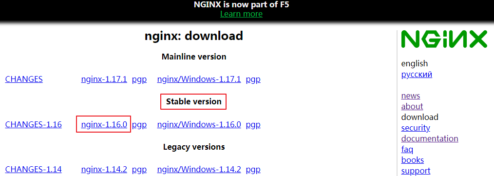
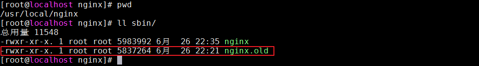
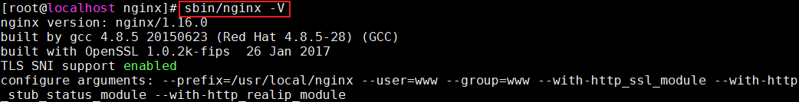
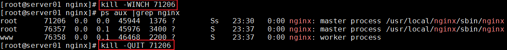
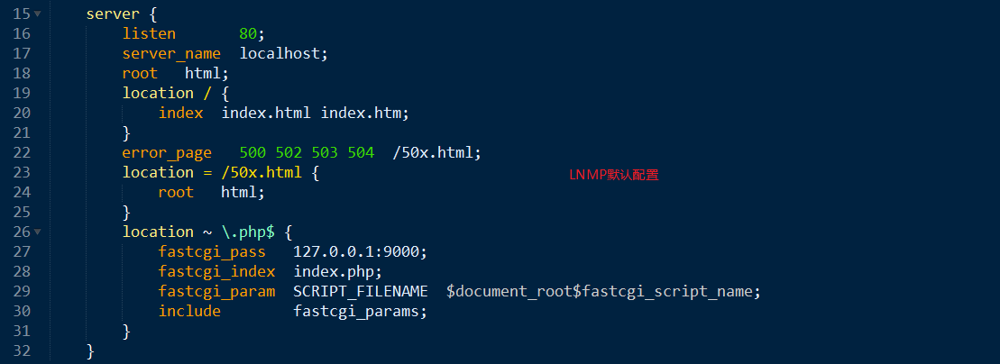
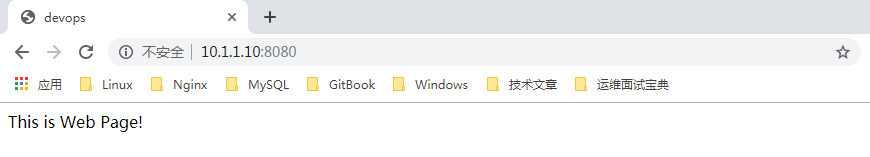
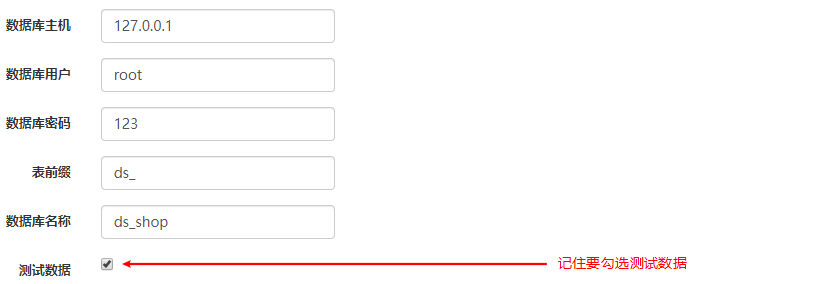
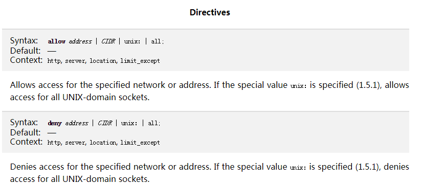
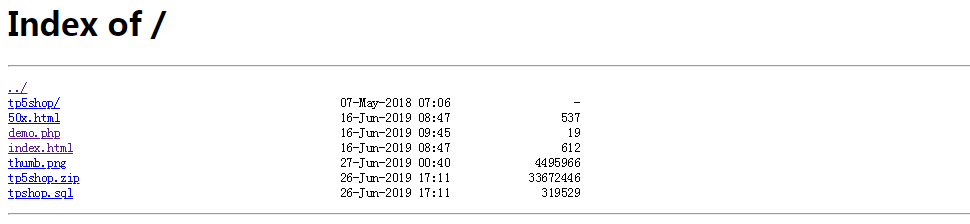
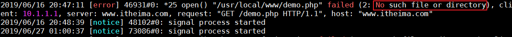

# 企业级架构之Nginx

# 学习目标

1、能够了解Nginx配置文件组成（重点）=>nginx.conf

2、能够配置server虚拟机（重点）

3、能够部署上线项目到LNMP架构中

4、能够了解Nginx的常用官方模块

5、能够了解日志相关使用=>log=>access.log/error.log（扩展GoAccess日志统计软件）

# 一、重装与升级

在实际业务场景中，需要使用软件新版本的功能、特性，就需要对原有软件进行升级或者重装操作。

旧statble 稳定版  1.12

stable 稳定版  1.16

mainline 主线版本   最新的 1.17

如下图所示：



## 1、信号参数

kill  命令  传输信号给进程

```powershell
TERM, INT（快速退出，当前的请求不执行完成就退出）
QUIT     （优雅退出，执行完当前的请求后退出）
HUP      （重新加载配置文件，用新的配置文件启动新worker进程，并优雅的关闭旧的worker进程）
USR1     （重新打开日志文件）
USR2     （平滑的升级nginx二进制文件  拉起一个新的主进程  旧主进程不停止）
WINCH    （优雅的关闭worker进程）

重点：
平滑升级
kill -USR2 pid
关闭master下面的所有work（子进程）
kill -WINCH pid
优雅的退出master
kill -QUIT pid
```

基本语法：

```powershell
kill 选项参数 pid
# 快速关闭
kill -INT  pid
# 优雅关闭
kill -QUIT pid
```

## 2、重新安装（了解）

① 停止掉服务，删除编译的安装的软件包和源码包，rm -rf /usr/local/nginx

② 重新解压编译安装即可

==注意：如果有需要，请备份配置文件和网站目录里的资源文件==

## 3、平滑升级（重点）

虽然通过上面的方式可以实现Nginx的升级，但是如果直接把旧版本的服务停止掉，会影响线上业务的使用。那我们该如何进行升级呢？答：可以采用平滑升级，大致可以分为以下三个步骤

```powershell
① 旧的先不停掉
② 新的又可以起来
③ 旧的和新的同时提供服务，旧的请求完成之后，就停掉旧进程
-USR2  平滑启动一个进程（平滑升级）
-WINCH 优雅的关闭子进程
-QUIT  优雅关闭主进程
```

==第一步：编译安装新软件==

```powershell
[root@web01]# tar xvf nginx-1.16.0.tar.gz
[root@web01]# cd nginx-1.16.0
[root@web01]# ./configure  --prefix=/usr/local/nginx --user=www --group=www --with-http_ssl_module --with-http_stub_status_module --with-http_realip_module
[root@web01]# make && make install
```

==第二步：升级新版本，需要把软件的安装路径，指定到旧版本上==

> 注：以上操作完成之后，会把原来的旧版本备份为nginx.old



通过nginx -V选项查看nginx版本信息：



通过nginx.old -V选项查看nginx版本信息：


==第三步：新旧版本同时运行==

平滑升级：

```powershell
kill -USR2  旧的主进程号
```


==第四步：查看旧的主进程号，并使用kill -WINCH 优雅的关闭的子进程,再关闭旧的主进程==

```powershell
kill -WINCH 旧的主进程号
kill -QUIT  旧的主进程号
```



# 二、企业级服务配置

## 1、nginx.conf配置文件

编译的nginx默认的配置文件位置：`/usr/local/nginx/conf/nginx.conf`

使用grep删除注释与空行：`grep -Ev '#|^$' conf/nginx.conf > nginx.conf`


**==http=>server=>location==**

配置里有且只有一个http区块，可以有多个server区块（类似apache中的vhost虚拟主机），一个server里，可以有多个location区块。

## 2、server区块配置（虚拟主机）

### ☆ 基于域名虚拟机

在实际生产业务环境中，一台web服务器，需要使用多个网站部署。搭建vhost虚拟机主机实现不同域名，解析绑定到不同的目录。



案例：添加一个www.devops.com

第一步：编译nginx.conf，添加虚拟主机

```powershell
# 添加虚拟主机
server {
	# 监听端口
	listen 80;
	# 配置域名
	server_name www.devops.com
	# 配置目录
	root html/devops;
	# 配置uri匹配规则
	location / {
		# 默认索引页
		index index.html index.htm;
	}
}
```

注意：每行配置完成之后，一定要注意结束标记符号。

第二步：解析host域名，建立项目目录及其文件

```powershell
# 10.1.1.11 www.devops.com
```

第三步：在/usr/local/nginx/html目录下创建devops文件夹，然后在其目录下创建index.html文件

```powershell
# cd /usr/local/nginx/html
# mkdir devops
# vim index.html
```

写入内容：

```html
<html>
    <head>
        <title>devops</title>
    </head>
    <body>
        This is Web Page!
    </body>
</html>
```

第四步：重载Nginx

```powershell
systemctl reload nginx
```

运行效果：


扩展：

```powershell
# sed -n '11,24p' conf/nginx.conf > conf/extra/devops.conf
include extra/devops.conf
include conf.d/*.conf;
```

### ☆ 基于IP虚拟机

多个IP访问同一台服务器主机，不同的IP解析到不同的vhost虚拟机中。

核心：ens33绑定多个IP地址（选做一个临时绑定ip或者配置文件绑定ip）

第一步：使用ifconfig为ens33临时绑定一个虚拟网卡IP

```powershell
ifconfig ens33:1 10.1.1.100
```

运行结果：# ifconfig

 

注意：如果是通过桌面安装的linux，启动了NetworkManager服务，需要关闭，才可以在配置文件里绑定虚拟网卡。

```powershell
systemctl stop NetworkManager
systemctl disable NetworkManager
```

第二步：建立一个虚拟主机，绑定虚拟网卡IP


第三步：重载Nginx

```powershell
systemctl reload nginx
```

运行结果：


### ☆ 基于端口虚拟机

优势：默认不占用80端口，能够稍微隐秘一些

第一步：编辑nginx.conf配置文件


第二步：重载Nginx

```powershell
systemctl reload nginx
```

运行结果：



## 3、上线DSShop商城系统

第一步：编辑nginx.conf配置文件

 ```powershell
# vim /usr/local/nginx/conf/nginx.conf
server {
	listen 80;
	server_name www.shop.com;
	root /home/www/public;
	location / {
		index index.html index.htm index.php;
	}
	location ~ \.php$ {
		fastcgi_pass  127.0.0.1:9000;
		fastcgi_index index.php;
		fastcgi_param SCRIPT_FILENAME $document_root$fastcgi_script_name;
		include 	  fastcgi_params;
	}
}
 ```

第二步：配置Window中的hosts文件

```powershell
10.1.1.11 www.shop.com
```

第三步：重载Nginx

```powershell
systemctl reload nginx
```

第四步：上传shop商城源代码到虚拟主机目录

第五步：解压文件

```powershell
# unzip dsshop.zip
```

第六步：设置权限

问题：

 

解决方案：

```powershell
[root@web01 www]# chmod -R a+w public
[root@web01 www]# chmod -R a+w runtime
[root@web01 www]# chmod a+w application/database.php
```

第七步：设置MySQL数据库信息



第八步：设置重写规则

```powershell
location = / {
	rewrite / /index.php redirect;
}
location / {
	if (!-e $request_filename) {
		rewrite ^/index.php/(.*)$ /index.php?s=/$1 last;
		break;
	}
}
注意：设置完成后，一定要重载一下nginx.conf配置文件
# systemctl reload nginx
```

到此完成项目设置！

# 三、Nginx默认官方模块

## 1、GZIP压缩

压缩文件大小变小了，传输更快了。目前市场上大部分浏览器是支持GZIP的。IE6以下支持不好，会出现乱码情况。

http://nginx.org/en/docs/http/ngx_http_gzip_module.html

```powershell
gzip on;
gzip_min_length 1k;
gzip_buffers 4 16k;
gzip_http_version 1.0;
gzip_comp_level 2;
gzip_types text/plain text/css text/javascript application/x-javascript image/jpeg image/gif image/png;
gzip_vary off;
gzip_disable "MSIE [1-6]\.";

第1行：开启Gzip
第2行：不压缩临界值，大于1K的才压缩，一般不用改
第3行：gzip_buffers number,size，压缩文件时使用的缓存空间的大小，默认128
第4行：用了反向代理的话，末端通信是HTTP/1.0，默认是HTTP/1.1
第5行：压缩级别，1-10，数字越大压缩的越好，时间也越长
第6行：进行压缩的文件类型，建议js|css|图片,注：javascript有两种写法，最好都写上
第7行：跟Squid等缓存服务有关，on的话会在Header里增加"Vary:Accept-Encoding"
第8行：IE6对Gzip不怎么友好，不给它Gzip了
```


gzip压缩文本、css(层叠样式表)、js（浏览器端执行的脚本）、图片文件。

## 2、客户端缓存

告知浏览器获取的信息是在某个区间时间段是有效的，基本格式：

```powershell
expires 30s; //表示把数据缓存30秒
expires 30m; //表示把数据缓存30分
expires 10h; //表示把数据缓存10小时
expires 3d;  //表示把数据缓存3天
expires -1;  //表示不缓存
```

案例：缓存图片/js/css文件，缓存时间为1天

```powershell
location ~ \.(jpg|jpeg|gif|png|js|css)$ {
    expires 1d;
}
```

## 3、反向代理

正向代理：


特点：知道自己使用了代理，需要填写代理服务器的IP等相关连接信息

场景：常见于代理客户端上网等操作（翻墙）

反向代理：


特点：用户是无感知的，不知道使用了代理服务器。反向代理服务器是和真实访问的服务器是在一起的，有关联的。

作用：

① 可以根据实际业务需求，分发代理页面到不同的解释器

② 可以隐藏真实服务器的路径

场景：常见于代理后端服务器

案例：配置反向代理LNMPA

LNMPA：Nginx作为代理服务器，将请求转发到Apache

第一步：安装httpd软件

```powershell
# yum install httpd
```

第二步：编辑httpd配置文件/etc/httpd/conf/httpd.conf


启动httpd软件

```powershell
# systemctl start httpd.service
```

第三步：编写Nginx配置文件，设置proxy_pass

```powershell
server {
	listen 80;
	server_name 10.1.1.11;
	root html;
	location / {
		proxy_pass http://127.0.0.1:8080;
	}
}
```

第四步：重载Nginx配置

```powershell
# systemctl reload nginx
```

打开浏览器，访问10.1.1.11，如下图所示：


## 4、基于IP的访问控制

基于ngx_http_access_module模块，默认可使用

语法：

```powershell
deny  ip  禁止IP访问
allow ip  允许IP访问
```

https://nginx.org/en/docs/http/ngx_http_access_module.html



默认是允许所有IP访问。

## 5、基于用户的访问控制

基于ngx_http_auth_basic_module模块，默认可用

语法：

加密文本: 由htpasswd命令实现

htpasswd  httpd里的一个工具  如果没有 可以通过yum install httpd-tools

```powershell
创建密码文件：htpasswd  -c  生成到的路径  用户名
-c 创建新文件，如果再次添加用户去掉-c参数，否则会被删除覆盖原来的
auth_basic “提示信息”
auth_basic_user_file  /etc/nginx/htpasswd;
```

第一步：生成passwd密钥文件


第二步：在nginx.conf中配置密钥文件


第三步：打开浏览器，访问shop.devops.com域名，运行效果：


## 6、目录显示

基本语法：

```powershell
autoindex on;
```


打开浏览器，访问如下图所示：



# 四、日志管理

Nginx里默认会有两种日志：

access.log 访问日志，查看统计用户的访问信息与流量

error.log 错误日志，错误信息以及重写信息

<http://nginx.org/en/docs/http/ngx_http_log_module.html>

默认路径 /usr/local/nginx/logs

yum安装默认的日志目录 /var/logs/nginx

## 1、access.log访问日志

```powershell
# cat /usr/local/nginx/logs/access.log
```


## 2、日志参数详解

```powershell
# vim /usr/local/nginx/conf/nginx.conf
```

| 参数                      | 意义                                                 |
| ------------------------- | ---------------------------------------------------- |
| **$remote_addr**          | 客户端的ip地址(代理服务器，显示代理服务ip)           |
| $remote_user              | 用于记录远程客户端的用户名称（一般为“-”）            |
| $time_local               | 用于记录访问时间和时区                               |
| **$request**              | 用于记录请求的url以及请求方法                        |
| $status                   | 响应状态码，例如：200成功、404页面找不到等。         |
| $body_bytes_sent          | 给客户端发送的文件主体内容字节数                     |
| **$http_user_agent**      | 用户所使用的代理（一般为浏览器）                     |
| **$http_x_forwarded_for** | 可以记录客户端IP，通过代理服务器来记录客户端的ip地址 |
| $http_referer             | 可以记录用户是从哪个链接访问过来的                   |

访问日志，可以统计分析用户的流量的相关情况。

## 3、错误日志

error.log，默认记录配置启动错误信息和访问请求错误信息。

```powershell
# cat /usr/local/nginx/logs/error.log
```



配置error_log：

```powershell
# vim /usr/local/nginx/conf/nginx.conf
```


在配置nginx.conf 的时候，有一项是指定错误日志的，默认情况下你不指定也没有关系，因为nginx很少有错误日志记录的。但有时出现问题时，是有必要记录一下错误日志的，方便我们排查问题。

error_log 级别分为 debug, info, notice, warn, error, crit  默认为crit, 该级别在日志名后边定义格式如下：

| 错误级别 | 备注                       |
| -------- | -------------------------- |
| debug    | 调试模式，记录的日志最多   |
| info     | 信息                       |
| notice   | 提示                       |
| warn     | 警告                       |
| error    | 错误                       |
| crit     | 默认为crit，记录的日志最少 |

crit 记录的日志最少，而debug记录的日志最多。如果你的nginx遇到一些问题，比如502比较频繁出现，但是看默认的error_log并没有看到有意义的信息，那么就可以调一下错误日志的级别，当你调成error级别时，错误日志记录的内容会更加丰富。

错误日志的作用：用来查看错误信息，通过提示的错误信息，排除错误

## 4、日志轮转

利用Shell脚本对日志进行切割

```powershell
# vim logrotate.sh
------------------华丽的分割线-------------------
#!/bin/bash
date_info=$(date +%F-%H:%M)
mv /usr/local/nginx/logs/access.log /usr/local/nginx/logs/access.log.$date_info
/usr/local/nginx/sbin/nginx -s reload
------------------华丽的分割线-------------------
# crontab -e
* */6 * * * /bin/sh /scripts/logrotate.sh &>/dev/null
```

# 五、location区块

http://nginx.org/en/docs/http/ngx_http_core_module.html#location

## 1、location的作用

location指令的作用是根据用户请求的uri来执行不同的应用，也就是根据用户请求的网站url进行匹配，匹配指定的请求uri（请求uri不包含查询字符串，如http://localhost:8080/test?id=10，请求uri是/test）

## 2、location基本语法

```powershell
location  [ = | ~ | ~* | ^~ ]  uri  { .... }
# 指令  匹配标识  匹配的网站网址  匹配URI之后要执行的配置段
```

**①   =  精确匹配**

```nginx
location = / {
    #规则
}
```
> 则匹配到 http://www.example.com/ 这种请求

**② ~  大小写敏感**

```nginx
location ~ /Example/ {
    #规则
}
```
> 请求示例
> http://www.example.com/Example/  [成功]
> http://www.example.com/example/  [失败]

**③  ~* 大小写忽略**

```nginx
location ~* /Example/ {
    #规则
}
```
> 请求示例
> http://www.example.com/Example/  [成功]
> http://www.example.com/example/  [成功]

**④  ^~ 只匹配以 uri 开头**

```nginx
location ^~ /img/ {
    #规则
}
```
请求实例
以 /img/ 开头的请求，都会匹配上
http://www.example.com/img/a.jpg   [成功]
http://www.example.com/img/b.mp4 [成功]
http://www.example.com/bimg/b.mp4 [失败]
http://www.example.com/Img/b.mp4 [失败]

## 3、location优先级

```powershell
① 优先级最高
location = / {
	#规则
}
② 优先匹配
location ^~ /images/ {
    #规则
}
③ 不区分大小写匹配网站资源
location ~* \.(gif|jpg|jpeg|png) {
	#规则
}
③ 根据资源目录进行匹配
location /documents/ {
	#规则
}
④ 所有匹配不满足时，匹配默认的location /
location / {
	#规则
}
```

# 六、URL重写

## 1、return

返回服务器的状态码，基本语法：

```powershell
return 服务器响应状态码

200 OK，请求成功，正常响应
301 Moved Permanently，永久重定向，常用于重写规则
302 Found，临时重定向，常用于重写规则
304 Not Modified，请求资源内容没有改变，常用于缓存
404 Not Found，代表请求资源不存在，文件或路径不存在
500 Internal Server Error，服务器遇到了不知道如何处理的情况，常见于代码异常
503 Service Unavailable，服务器没有准备好处理请求。常见于服务器因维护或重载而停机
```

请求状态码：

<https://developer.mozilla.org/zh-CN/docs/Web/HTTP/Status>

## 2、rewrite

基本语法：

```powershell
rewrite  匹配内容  替代内容  flag标记
```

flag标记说明：

| 标记      | 作用                                                 |
| --------- | ---------------------------------------------------- |
| last      | 本条规则匹配完成后，继续向下匹配新的location URI规则 |
| break     | 本条规则匹配完成即终止，不再匹配后面的任何规则       |
| redirect  | 返回302临时重定向，浏览器地址会显示跳转后的URL地址   |
| permanent | 返回301永久重定向，浏览器地址栏会显示跳转后的URL地址 |

> 注：多条rewrite，从上到下匹配，匹配到之后就不在匹配其他rewrite规则。

另外还要特别注意：

last与break，进行重定向时，其客户端URL地址不会改变。

redirect与permanent，进行重定向时，其客户端URL地址会发生改变。

官方文档地址：http://nginx.org/en/docs/http/ngx_http_rewrite_module.html#rewrite

### ☆ 案例一：资源重定向

要求：使用商城项目，把访问的index.html，重定向到index.php，实现伪静态

```powershell
# vim /usr/local/nginx/conf/nginx.conf
location / {
	index index.html index.htm;
	rewrite /index.html /index.php last;
}
```

### ☆ 案例二：域名重定向

要求：公司的域名升级了，需要把所有请求重定向到新域名

```powershell
# vim /usr/local/nginx/conf/nginx.conf
server {
	listen 80;
	server_name www.devops.com;
	rewrite / http://www.baidu.com permanent;
}
```

### ☆ 案例三：防盗链原理和实现


需求：web2服务器经常链接web1服务器上资源文件，用户经常访问web2服务器的图片，以为web2拥有很多资源，但是实际这种操作耗费了web1的大量流量。

解决方案：

① 图片加水印

② 通过判断referer来源，确定是否返回对应的资源文件

基本语法：

```powershell
location / {
	valid_referers 绑定域名;
	if ($invalid_referer) {
		return 404;
	}
}
```

## 3、PATHINFO模式

URL三种模式：

① 普通模式

 

② PATHINFO模式

 

③ REWRITE模式

 

品优购商城默认采用PATHINFO模式，但是PATHINFO需要Nginx的支持：

```powershell
location / {
	if (!-e $request_filename) {
		rewrite ^(.*)$ /index.php?s=/$1 last;
	}
}
```

# 七、第三方模块

## 1、fancyindex

nginx本身官方没有的功能，一些开源开发者定制开发了，把代码公布出来，可以通过加载第三方模块的方式，使用新的功能

第三方模块网址：https://www.nginx.com/resources/wiki/modules

编译安装第三方模块：

```powershell
# tar zxvf ngx-fancyindex-v0.4.3.tar.gz
# tar xvf echo-nginx-module-0.61.tar.gz
# cd /root/nginx-1.16.0
# ./configure  --prefix=/usr/local/nginx --user=www --group=www --with-http_ssl_module --with-http_stub_status_module --with-http_realip_module --add-module=/root/ngx-fancyindex-0.4.3/ --add-module=/root/echo-nginx-module-0.61
# make && make install && make upgrade
```

配置nginx.conf：

```powershell
location / {
  fancyindex on;              # Enable fancy indexes.
  fancyindex_exact_size off;  # Output human-readable file sizes.
}
```

## 2、echo

作用：echo模块常用来进行调试用，比如输出打印Nginx默认系统变量

```powershell
location / {
	echo $document_root;
}
```

# 八、Nginx安全管理

## 1、反向代理

实现隐藏真实服务的操作，起到一定安全作用

## 2、隐藏版本号

```powershell
在http段加入server_tokens off
http {
	server_tokens off;
}
```

## 3、CA https

ssh 公钥 和 私钥  8个步骤

https 是http的一个加密协议，基于ssl套接字，把传输的信息进行加密。默认端口443

CA 证书  部署https的时候，需要购买申请（还有一些免费）

慢是因为，每次进行访问的时候，需要校验证书的有效性。连接国外的机构校验。网慢

<https://www.cnblogs.com/tv151579/p/8268356.html>

<https://my.oschina.net/zijian1315/blog/207311>

腾讯云免费证书申请和使用：

<https://cloud.tencent.com/product/ssl/getting-started>

<https://cloud.tencent.com/document/product/400/4143>

# 九、Nginx发行版本

## 1、Nginx社区免费版

<https://nginx.org/>

## 2、NGINX+商业版

<https://www.nginx.com/>

## 3、淘宝的tengine

<http://tengine.taobao.org/>

tengine是alibaba公司，在nginx的基础上，开发定制，更加服务自己业务的服务器软件。后来进行了开源。

```powershell
# tar xvf tengine-2.2.2.tar.gz
# cd tengine-2.2.2
# ./configure --prefix=/usr/local/tengine
# make && make install
```

## 4、OpenResty

openresty 在nginx的基础上，结合lua脚本实现高并发等web平台。

WAF nginx+lua+redis 实现应用型防火墙

章亦春

<http://openresty.org/cn/>

安装步骤：

```powershell
# tar xvf openresty-1.13.6.2.tar.gz
# cd openresty-1.13.6.2
# ./configure --prefix=/usr/local/openresty
# make && make install
```

