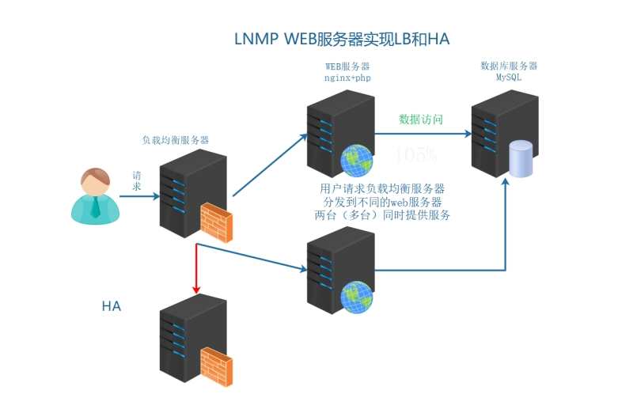
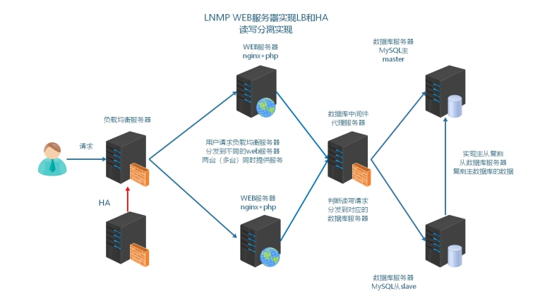
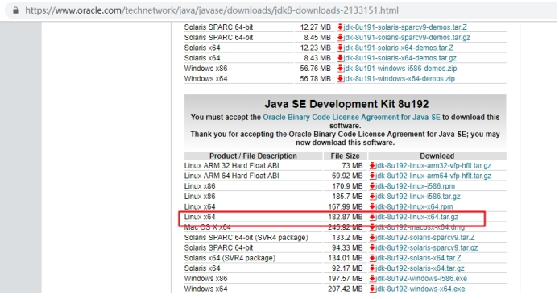
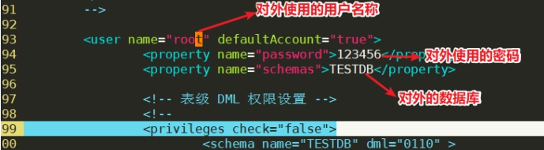
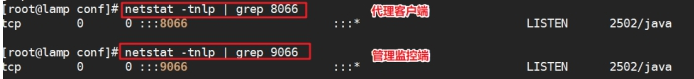
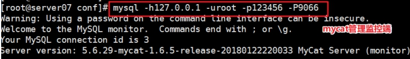
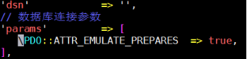
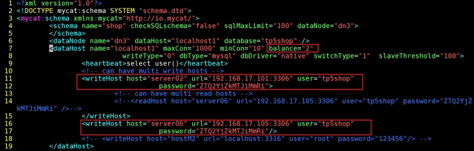

# MySQL读写分离之MyCAT

# 学习目标

1、能够理解读写分离的目的

2、能够描述读写分离的常见实现方式

3、能够通过项目框架配置文件实现读写分离

4、能够通过中间件实现读写分离(学习的重点)

# 一、MySQL读写分离

## 1、业务背景描述

时间：2009.6-2010.9

发布产品类型：互联网动态站点 商城

用户数量： 2000-4000（用户量猛增了4倍）

PV ： 8000-50000（24小时访问次数总和）

DAU： 1500（每日活跃用户数）

之前是单台MySQL提供服务，使用多台MySQL数据库服务器，降低单台压力，实现集群架构的稳定性和高可用性    数据的一致性  完整性  replication

通过业务比对和分析发现，随着用户活跃增多，读取数据的请求变多，故着重解决读取数据的压力

## 2、模拟运维设计方案



根据以上业务需求，在之前业务架构的基础上实现数据的读写分离。


# 二、MySQL读写分离介绍

## 1、什么是读写分离

读写分离：读写操作，分发不同的服务器，读分发到对应的服务器（slave），写分发到对应的服务器（master）

## 2、读写分离的目的

读写分离  将读写业务分配到不同的服务器上，让服务器做特定的操作，不需要不断的切换工作模式，使工作效率提高 写主服务器，读从服务器

同时降低主服务器的压力，在正常业务下，也是读比较多的情况，写相对读少一些。

大约比例在写3/7读

读写分离：

①M-S下，读写必须分离，如果不分离，业务不可用出问题

②M-M 在此架构中，虽然可以随意读写操作，特定的操作交由特定的服务器操作，工作效率更高

## 3、读写分离的实现基础和原理

实现基础：通过主从复制机制实现数据的一致性 完整性

mysql的读写分离的基本原理是：

SQL语句

==让master（主数据库）来响应事务性操作（insert，update，delete，create，drop）==

==让slave（从数据库）来响应select非事务性操作==

然后再采用主从复制来把master上的事务性操作同步到slave数据库中

没有主从复制，就无法实现业务上的读写分离

## 4、读写分离常见的实现方式

**① 业务代码的读写分离**

需要在业务代码中，判断数据操作是读还是写，读连接从数据服务器操作，写连接主数据库服务器操作mysql01/mysql02

以当前LNMP为例，就需要使用PHP代码实现读写分离

在代码端对数据库的操作进行判断：

增加：

mysql> insert  into  数据表  values  (字段值,字段值,...);

删除：

mysql> delete  from 数据表 where 字段=字段值;

mysql> delete  from 数据表  where 字段  in (字段值1,字段值2...);

mysql> delete  from  数据表;

修改：

mysql> update  数据表  set  字段=字段的值  where  字段=字段值;

mysql> update  数据表  set  字段=字段的值;

查询：

mysql> select  */字段列表  from 数据表;

如果insert/update/delete操作，自动连接master主数据库。

如果select操作，自动连接slave从数据库。

**② 中间件代理方式的读写分离**

在业务代码中，数据库的操作，不直接连接数据库，而是先请求到中间件服务器（代理）

由代理服务器，判断是读操作去从数据服务器，写操作去主数据服务器

| 名称        | 描述                                                         |
| ----------- | ------------------------------------------------------------ |
| MySQL Proxy | MySQL官方 测试版 不再维护                                    |
| Atlas       | 奇虎360 基于MySQL Proxyhttps://github.com/Qihoo360/Atlas/blob/master/README_ZH.md |
| DBProxy     | 美团点评                                                     |
| Amoeba      | 早期阿里巴巴                                                 |
| cobar       | 阿里巴巴                                                     |
| MyCat       | 基于阿里开源的Cobar                                          |
| kingshard   | go语言开发https://github.com/flike/kingshard                 |

也就是如下图所示架构



问：如何选择？

① 业务上实现更加方便，成本低一下，如果使用的开发框架不支持分布式数据库的部署模式，

业务的SQL需要修改，改代码（程序猿）

② 中间件代理服务器 更加适合管理更多的数据库服务器集群，查看到服务器是否可用，

不只可以实现读写分离，使用中间件实现分库、分表的操作（运维）

# 三、MySQL读写分离的具体实现

## 1、配置主从

主从复制的原理 ：主服务器开启bin-log（记录了写操作） 从服务器获取到主服务器的bin-log  记录到relay-log中。从服务器在通过异步的线程方式，对于relay-log进行重放操作。

主服务器： bin-log

从服务器： relay-log

DML =>  MASTER SQL => binlog日志中

SLAVE SQL => 监听MASTER binlog日志变化，一旦监测到主服务器发生变化 => 通过网络IO线程复制到SLAVE从服务器中，放入relaylog中继日志 => SLAVE使用SQL线程重演MASTER SQL操作

```powershell
[root@master ~]# cat /etc/my.cnf
[mysqld]
basedir=/usr/local/mysql
datadir=/usr/local/mysql/data
port=3306
socket=/tmp/mysql.sock
log-error=/usr/local/mysql/data/mysql.err
character_set_server=utf8mb4
server_id = 10
log-bin=/usr/local/mysql/data/binlog

[root@slave ~]# cat /etc/my.cnf
[mysqld]
basedir=/usr/local/mysql
datadir=/usr/local/mysql/data
port=3306
socket=/tmp/mysql.sock
log-error=/usr/local/mysql/data/mysql.err
character_set_server=utf8mb4
server_id=20
relay-log=/usr/local/mysql/data/relaylog
```

## 2、代码层级的读写分离（了解）

筛选：insert/update/delete操作，把这样的SQL传输到主服务器。

筛选：select操作，把这样的SQL传输到从服务器。

```powershell
vim /home/www/application/database.php

retun [
	'type'=>'mysql',
	'hostname'=>'主IP,从IP',
	...
	'deploy'=>1,     		  ==> 开启分布式数据库（多台数据库，默认为0）
	'rw_separate'=>true,      ==> 开启读写分离模式，主写，从读
]
```

测试可以down主库，看从库是否可以访问，thinkphp5中，如果slave宕机，master提供读服务。

## 3、MyCAT中间件


## 4、MyCAT工作原理图


Mycat 数据库中间件

国内最活跃的、性能最好的开源数据库中间件！

官方网址：<http://www.mycat.io/>

<https://github.com/MyCATApache/MyCAT-Server/>

因为mycat是由java语言开发，必须使用java的允许环境进行启动和操作

## 5、准备机器

最好保证2核2G以上，因为MyCAT占用内存与CPU比较大

更改IP地址与UUID

绑定IP与HOSTNAME到/etc/hosts文件中

时间同步

## 6、JDK安装

java 静态编译的编程语言 代码编译成机器码  执行机器码输出结果。

编译jdk  javac 编译java代码

运行jre  编译好的机器码（可以执行文件）  java

**问：公司服务器部署的java环境是jdk还是jre？**

答：

jre  java解析运行环境  一般情况编译过的可执行的java程序 ，jre就够用了。

jdk  javac 编译的环境  如果服务器上传是源代码文件 就可以编译，之后再执行。

实际业务环境中，如果存在需要编译的情况，就选择jdk。

oracle jdk（sun公司=>oracle公司收购）

open jdk（完全免费的jdk环境）

https://www.oracle.com/technetwork/java/javase/downloads/jdk8-downloads-2133151.html

 

## 7、上传mycat和jdk到Linux

第一步：解压安装jdk

```powershell
shell > tar xvf jdk-8u192-linux-x64.tar.gz
shell > mkdir /usr/local/java
shell > mv jdk1.8.0_192 /usr/local/java/
```

第二步：配置环境变量

```powershell
shell > vim /etc/profile
export PATH=$PATH:/usr/local/java/jdk1.8.0_192/bin
----------------------------华丽的分割线 --------------------------
shell > source /etc/profile
```

## 8、MyCAT安装和测试启动

```powershell
# tar xvf Mycat-server-1.6.5-release-20180122220033-linux.tar.gz -C /usr/local
tar命令
-x ：解压
-v ：显示进度
-f ：指定要解压的文件路径
-C ：解压到指定的目录
```

实际解压到目录即可，无需安装。

## 9、目录说明

```powershell
bin ：mycat二进制文件目录
conf：配置文件目录
logs：目录可以查看到错误日志
```

## 10、启动MyCAT

默认不进行任何配置，mycat也是可以启动的：

```powershell
shell > /usr/local/mycat/bin/mycat console
#确认mycat是否真的启动，查看它的端口 9066 8066
shell > ss -naltp |grep 8066
8066:MyCAT客户端
9066:MyCAT管理端
```

>  如果启动不成功，报错：Ignoring option MaxPerSize:support was removed in 8.0

原因分析：因为系统不能够在规定时间内，启动mycat，可以设置启动等待时间延长（配置低）

部署好mycat之后，先启动一下，是否能够正常启动。就不需要修改。

```powershell
# vim conf/wrapper.conf
111 wrapper.startup.timeout=300  ==>  添加这一行
112 wrapper.ping.timeout=120 ==> 默认存在
```

## 11、配置MyCAT

 

server.xml：对外提供的用户等的设置

schema.xml：配置后端数据库服务器相关信息

**① 修改配置文件(server.xml)**

默认server.xml可以不用修改

配置中间件的登录用户名称和用户密码，对应映射的虚拟库的名称

```powershell
# vim conf/server.xml
```

 

**② 修改配置文件(schema.xml)**

schema标签里配置name的server.xml里的虚拟数据库名称，dataNode填写后面使用的dataNode名称。

dataNode标签和dataHost指定配置使用。

dataHost标签里配置writeHost和readHost（密码，地址，用户名称）

这个文件可以使用分享给大家的精简的，方便使用和操作，注意给予执行权限。


> 注意修改第7行，真实数据库的名称

**③ 启动mycat**

```powershell
shell > /usr/local/mycat/bin/mycat start
```

通过查看端口或者进程的方式，确认是否启动：

 

启动不了，一定要看错误日志：

```powershell
cat /usr/local/mycat/logs/wrapper.log
```

配置完成服务启动不了，常见问题：

```powershell
① master和slave没有对应用户给mycat操作  user password  host
② 配置文件语法错误  wrapper.log查看错误解决
```

# 四、MyCAT客户端与管理端

## 1、测试查看代理客户端 8066（负责对接Web）

```powershell
# yum install mysql -y
# rm -rf /etc/my.cnf
```

启动MyCAT=>通过8066端口代理连接真实数据库服务器：

 

使用show databases以及show tables操作，查看数据信息。

## 2、测试查看管理监控端 9066（负责管理后端）

 

可以查看各数据库服务器的状态：

 

```powershell
mysql > show @@help;  	   //查看管理监控端的所有帮助命令
mysql > show @@heartbeat;  //查看服务器状态
```

> RS_CODE，1代表正常，-1代表宕机

## 3、项目代码修改

```powershell
vim /home/www/application/database.php

retun [
	'type'=>'mysql',
	'hostname'=>'IP',
	'database'=>'TESTDB',
	'username'=>'mycat配置用户名',
	'password'=>'mycat配置密码',
	'hostport'=>'8066',
	...
	'deploy'=>0,     		   ==> 不需要代码层级的分发了
	'rw_separate'=>false,      ==> 开启读写分离模式，主写，从读
]
```

bug说明：

 

① balance =1

② 两个writehost可以解决 w对应的master不可用时，slave可读可写

 

# 五、MyCAT其他选项

## 1、关于balance属性

**balance 属性**，负载均衡类型，目前支持的取值有 4 种：

```powershell
balance="0", 不开启读写分离机制,所有读操作都发送到当前可用的 writeHost 上。

balance="1", 读请求随机分发到当前writeHost对应的readHost和standby的writeHost上。即全部的readHost与stand by writeHost 参与select 语句的负载均衡，简单的说，当双主双从模式(M1 ->S1，M2->S2，并且 M1 与 M2 互为主备)，正常情况下，M2,S1,S2 都参与 select 语句的负载均衡

balance="2", 所有读操作都随机的在 writeHost、readhost上分发。

balance="3", 所有读请求随机的分发到 writerHost 对应的 readHost 执行,writerHost 不负担读压力,注意 balance=3 只在 1.4 及其以后版本有,1.3之前版本没有 balance=3。
```

## 2、writeType 属性

负载均衡类型，目前的取值有 3 种：

```powershell
writeType="0", 所有写操作发送到配置的第一个writeHost，第一个宕机后自动切到还生存的第二个writeHost，重新启动后以切换后的为准.

writeType="1", 所有写操作都随机的发送到配置的 writeHost,1.5 以后废弃不推荐

writeType="2", 未实现...
```

## 3、switchType 属性

```powershell
switchType="-1" 表示不自动切换
switchType="1"  默认值，自动切换
switchType="2"  基于MySQL主从同步的状态来决定是否切换。需修改heartbeat语句（即心跳语句）：show slave status
```

