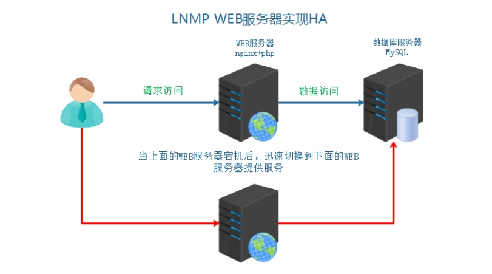
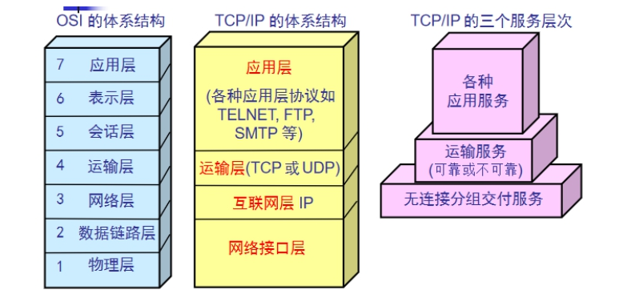
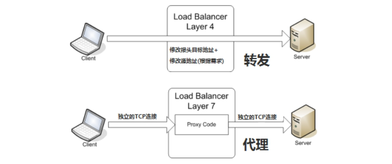
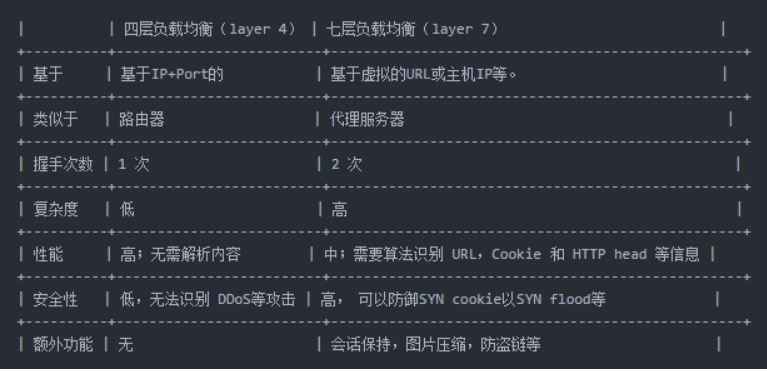
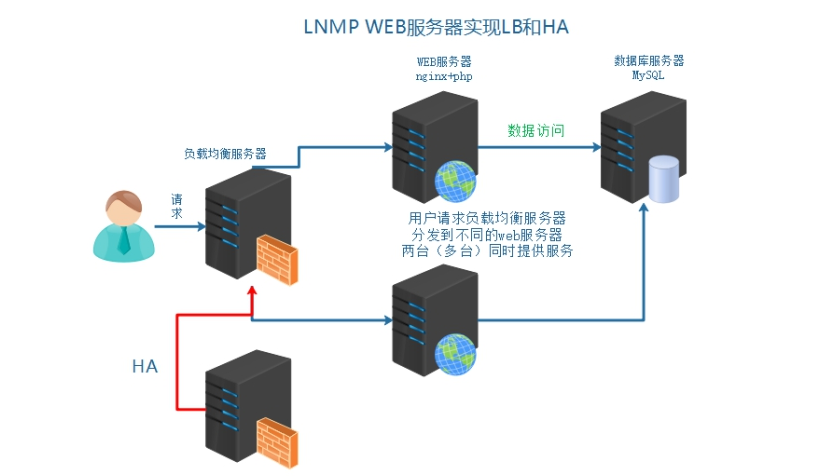

# 企业级架构之Nginx负载均衡

# 学习目标

1、能够描述负载均衡的作用

2、能够了解负载均衡常见实现方式

3、能够使用Nginx实现负载均衡

4、能够描述Nginx的常见负载均衡算法

# 一、背景描述及其方案设计

## 1、业务背景描述

时间：2011.6.-2013.9

发布产品类型：互联网动态站点商城

用户数量： 4000-8000（用户量猛增）

PV ：300000~500000（24小时访问次数总和）

DAU： 3000（每日活跃用户数）

随着业务量骤增，之前单点服务器，已经不能够满足业务使用需要，主服务器宕机，备服务器提供服务，因为流量太大，备也宕机，需要多台服务器，同时提供服务。

## 2、模拟运维场景



上述架构服务器，已经不能够满足以上提到的业务需求，架构发生如下变化，怎么办呢？

# 二、引入负载均衡技术

## 1、讲个故事

有一天上班，老板就把我叫进了办公室，一边舒服地喝茶一边和我说：我们公司开发的这个网站，现在怎么越来越慢了？ 

其实我也注意到了这个问题，一脸无奈和老板说： “唉，我昨天检查了一下系统，现在的访问量已经越来越大了，无论是CPU，还是硬盘、内存都不堪重负了，高峰期的响应速度越来越慢。"

我试探地问道：“老板，要不咱买两台好点机器？ 把现在的破服务器给替换掉吧。我听说IBM的服务器挺好的，性能强劲，要不来一台？”

老板问："大概多少钱？"。

我说大概2万左右吧，性能强劲，咱们这点流量，轻轻松松？老板很委婉的和我说：好你个鬼，我们小公司，钱要花在刀刃，我最多给你10000块，你给想办法解决掉，一周内弄不好，你可以换家公司...

冷汗直流，内心谴责一下万恶的资本家啊...

## 2、解决方案

思考个问题：现在一共有3台服务器，但是真正工作的只有一台服务器。另外一台服务器还处于待机备战状态，能不能把它也利用起来，干点活呢？

答：可以，使用==负载均衡技术==。

## 3、负载均衡技术（LB）

负载均衡技术 （Load Balance） 是一种概念，其原理就是把用户请求进行平均分配。

简单来说：就是分发流量、请求到不同的服务器。使流量平均分配（理想的状态的）

负载均衡作用：服务器容灾，流量分发

① 流量分发  请求平均  降低单例压力

② 安全  隐藏后端真实服务

③ 屏蔽非法请求（七层负载均衡）

http://www.itcast.cn/images/1.jpg   =>   *.jpg图片  => 调度后端的图片服务器

## 4、负载均衡业务架构图


## 5、负载均衡分类



**1）二层负载均衡（mac）**

根据OSI模型分的二层负载，一般是用虚拟mac地址方式，外部对虚拟MAC地址请求，负载均衡接收后分配后端实际的MAC地址响应 

**2）三层负载均衡（ip） DNS**

一般采用虚拟IP地址方式，外部对虚拟的ip地址请求，负载均衡接收后分配后端实际的IP地址响应

**3）四层负载均衡（tcp）**  网络层面的负载均衡

在三层负载均衡的基础上，用ip+port接收请求，再转发到对应的机器

**4）七层负载均衡（http）**  智能型负载均衡

根据虚拟的url或IP，主机接收请求，再转向（反向代理）相应的处理服务器

## 6、常见负载均衡实现方式

==硬件级别   F5   BIG-IP    性能好  价格高   几万到几十万不等==

==软件级别   性价比高==

lvs        	Linux下分发软件      四层  ip+port  NAT  lvs内核支持  IPVS配置调度

nginx   	upstream功能分发  七层应用层分发 http 等等   也可以基于四层（新版本）

haproxy  四层   七层负载均衡



**所谓四层负载均衡**，也就是主要通过报文中的目标地址和端口，再加上负载均衡设备设置的服务器选择方式，决定最终选择的内部服务器。
以常见的TCP为例，负载均衡设备在接收到第一个来自客户端的SYN 请求时，即通过上述方式选择一个最佳的服务器，并对报文中目标IP地址进行修改(改为后端服务器IP），直接转发给该服务器。TCP的连接建立，即三次握手是客户端和服务器直接建立的，负载均衡设备只是起到一个类似路由器的转发动作。在某些部署情况下，为保证服务器回包可以正确返回给负载均衡设备，在转发报文的同时可能还会对报文原来的源地址进行修改。

**所谓七层负载均衡**，也称为“内容交换”，也就是主要通过报文中的真正有意义的应用层内容，再加上负载均衡设备设置的服务器选择方式，决定最终选择的内部服务器。

以常见的TCP为例，负载均衡设备如果要根据真正的应用层内容再选择服务器，只能先代理最终的服务器和客户端建立连接(三次握手)后，才可能接受到客户端发送的真正应用层内容的报文，然后再根据该报文中的特定字段，再加上负载均衡设备设置的服务器选择方式，决定最终选择的内部服务器。负载均衡设备在这种情况下，更类似于一个代理服务器。负载均衡和前端的客户端以及后端的服务器会分别建立TCP连接。所以从这个技术原理上来看，七层负载均衡明显的对负载均衡设备的要求更高，处理七层的能力也必然会低于四层模式的部署方式。

```powershell
七层应用负载的好处，是使得整个网络更智能化。例如访问一个网站的用户流量，可以通过七层的方式，将对图片类的请求转发到特定的图片服务器并可以使用缓存技术；将对文字类的请求可以转发到特定的文字服务器并可以使用压缩技术。当然这只是七层应用的一个小案例，从技术原理上，这种方式可以对客户端的请求和服务器的响应进行任意意义上的修改，极大的提升了应用系统在网络层的灵活性。很多在后台，例如Nginx或者Apache上部署的功能可以前移到负载均衡设备上，例如客户请求中的Header重写，服务器响应中的关键字过滤或者内容插入等功能。
另外一个常常被提到功能就是安全性。网络中最常见的SYN Flood攻击，即黑客控制众多源客户端，使用虚假IP地址对同一目标发送SYN攻击，通常这种攻击会大量发送SYN报文，耗尽服务器上的相关资源，以达到Denial of Service(DoS)的目的。从技术原理上也可以看出，四层模式下这些SYN攻击都会被转发到后端的服务器上；而七层模式下这些SYN攻击自然在负载均衡设备上就截止，不会影响后台服务器的正常运营。另外负载均衡设备可以在七层层面设定多种策略，过滤特定报文，例如SQL Injection等应用层面的特定攻击手段，从应用层面进一步提高系统整体安全。
现在的7层负载均衡，主要还是着重于应用HTTP协议，所以其应用范围主要是众多的网站或者内部信息平台等基于B/S开发的系统。 4层负载均衡则对应其他TCP应用，例如基于C/S开发的ERP等系统。
```

四层的网络层数据转发，没有“请求”的概念：



今天主要给大家介绍一下Nginx七层负载均衡，主要通过以下两个步骤来完成：

① 环境准备

② Nginx负载均衡配置

# 三、服务器基本环境部署

## 1、克隆复制虚拟机（LB）

| 角色  | IP        | 主机名          | 功能         | 备注 |
| ----- | --------- | --------------- | ------------ | ---- |
| web01 | 10.1.1.11 | web01.itcast.cn | master       | 主   |
| mycat | 10.1.1.15 | mycat.itcast.cn | 数据节点     |      |
| web02 | 10.1.1.13 | web02.itcast.cn | backup       | 备   |
| lb01  | 10.1.1.16 | lb01.itcast.cn  | load balance |      |

## 2、修改主机名和hosts

~~~powershell
# hostnamectl set-hostname web01.itcast.cn
# hostnamectl set-hostname mysql.itcast.cn
# hostnamectl set-hostname web02.itcast.cn
# hostnamectl set-hostname lb01.itcast.cn

# cat /etc/hosts
127.0.0.1   localhost localhost.localdomain localhost4 localhost4.localdomain4
::1         localhost localhost.localdomain localhost6 localhost6.localdomain6
10.1.1.16   lb01  lb01.itcast.cn
~~~

## 3、关闭防火墙与SELinux

~~~powershell
# systemctl stop firewalld
# systemctl disable firewalld
# setenforce 0
# sed -i '/SELINUX=enforcing/cSELINUX=disabled' /etc/selinux/config
~~~

## 4、关闭NetworkManager服务（重要）

~~~powershell
# systemctl stop NetworkManager
# systemctl disable NetworkManager
~~~

## 5、配置yum源

分别配置 aliyun、epel 和本地源

~~~powershell
# rpm -ivh epel-release-latest-7.noarch.rpm	=> 清华/阿里云
[root@db01 yum.repos.d]# cat server.repo 
[local]
name=local yum
baseurl=file:///mnt
enabled=1
gpgcheck=0

[aliyun]
name=aliyun yum
baseurl=http://mirrors.aliyun.com/centos/7/os/x86_64/
enabled=1
gpgcheck=0
~~~

# 四、Nginx负载均衡实现

## 1、把www.shop.com域名解析到LB

```powershell
Windows:hosts文件
10.1.1.16 www.shop.com
```

## 2、在LB上编译安装Nginx（仅安装Nginx）

```powershell
[root@lb01]# tar -zxf nginx-1.16.0.tar.gz
[root@lb01]# cd nginx-1.16.0
[root@lb01]# useradd -r -s /sbin/nologin www
[root@lb01]# ./configure  --prefix=/usr/local/nginx --user=www --group=www --with-http_ssl_module --with-http_stub_status_module --with-http_realip_module
[root@lb01]# make && make install
[root@lb01]# /usr/local/nginx/sbin/nginx -c /usr/local/nginx/conf/nginx.conf

特别注意：安装依赖库
# yum -y install pcre-devel zlib-devel openssl-devel
```

## 3、编辑nginx.conf配置负载均衡

① LB服务器Nginx配置

```powershell
upstream shop {
	server 10.1.1.11;
	server 10.1.1.13;
}
server {
	listen 80;
	server_name www.shop.com;
    location / {
        proxy_pass http://shop;
		# 获取客户端真实的IP地址
        proxy_set_header HOST $host;
        proxy_set_header X-Real-IP $remote_addr;
        proxy_set_header X-Forwarded-For $proxy_add_x_forwarded_for;
    }
}
```

② Web01与Web02重新定义日志格式（重新定义日志格式，否则无法捕获真实的IP地址）

```powershell
http {
    log_format main '$remote_addr - $remote_user [$time_local] "$request" '
                    '$status $body_bytes_sent "$http_referer" '
                    '"$http_user_agent" "$http_x_forwarded_for"';
    access_log  logs/access.log main;
}

为什么要更改日志格式：
因为默认情况下，日志中并没有获取客户端真实的IP地址。非代理型请求，真实的IP地址可以通过$remote_addr获取。但是如果是代理结构（负载均衡），必须使用$http_x_forwarded_for来获取真实的客户端IP地址。
```

## 4、分发请求关键字

upstream中的分发之后的几个关键字：

backup  备，其他的没有backup标识的都无响应，才分发到backup

down  此条配置，请求不会被分发

```powershell
upstream {
	server 10.1.1.10 backup或down;
	server 10.1.1.12;
}
```

## 5、session共享


① 比如分发到web1服务器，生成验证码，存储到session中，默认在服务器本地

② 再次校验的时候，请求分发到web2服务器了，所有验证码一直校验不通过

解决方案思路：

① 生成和验证session都请求同一台服务器

```powershell
upstream shop {
	ip_hash;	=>  核心代码
	server 10.1.1.11;
	server 10.1.1.13;
}
```

② 共享session  nfs   mysql   ==内存缓存软件（memcached、redis）==

## 6、负载均衡算法

Nginx 官方默认3种负载均衡的算法

① ==Round-Robin  RR轮询（默认）==  一次一个的来（理论上的，实际实验可能会有间隔）

② ==weight 权重==  权重高多分发一些  服务器硬件更好的设置权重更高一些

```powershell
upstream shop {
	server 10.1.1.11 weight=8;
	server 10.1.1.13 weight=2;
}
```

③ ==ip_hash== 代表把同一个IP来源的请求分到到同一个后端服务器

## 7、高可用负载（keepalived+lb）

所有的请求流量，都要经过负载均衡服务器，负载均衡服务器压力很大，防止它宕机，导致后端服务所有都不可用，需要对负载均衡服务器，做高可用。



第一步：克隆一台Nginx的负载均衡服务器（LB02），这台服务器只安装Nginx

第二步：在两台机器上安装keepalived软件（必须安装epel源，清华或阿里云）

第三步：配置keepalived.conf文件，设置keepalived高可用组，组编号，权重，VIP

注意事项：1.3.5版本，注意注释vrrp_strict选项（无法ping通VIP）

第四步：配置监听Nginx脚本

第五步：把www.shop.com域名绑定到LB的VIP上

