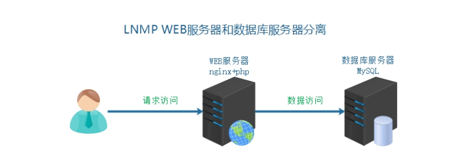
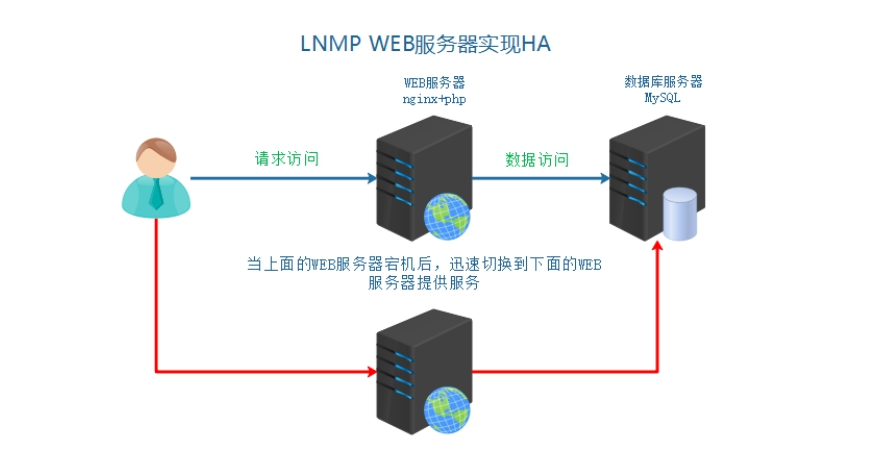
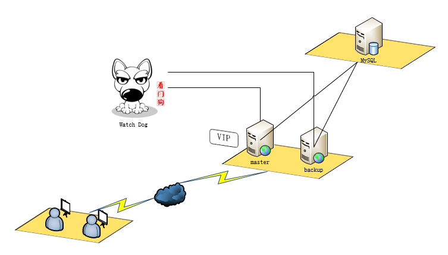
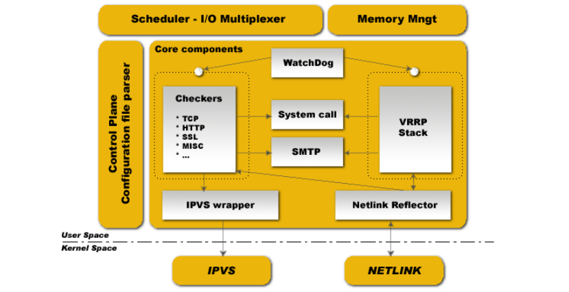
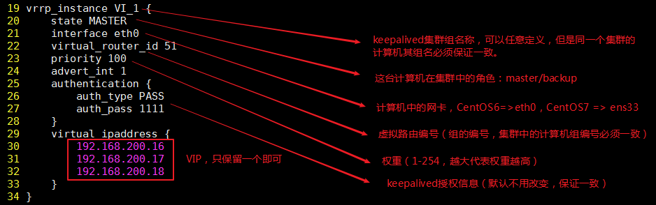
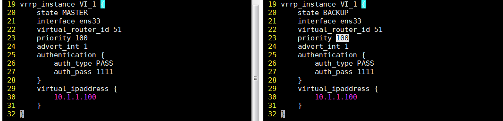

# Keepalived实现双机热备

# 学习目标

1、能够描述高可用HA的作用

2、能够理解VIP的漂移

3、能够描述keepalived作用

4、能够理解主master和备backup服务器关系

5、能够实现主备服务器高可用配置（重点）

6、能够实现模拟业务宕机服务切换（FailOver、扩展：VIP脑裂）

# 一、背景描述及其方案设计

## 1、业务背景描述

时间：2009.6-2010.9

发布产品类型：互联网动态站点 商城

用户数量： 2000-4000（用户量猛增了4倍）

PV ： 8000-50000（24小时访问次数总和）

DAU： 1500（每日活跃用户数）

随着用户量增多，总的页面数量一直在持续增加，可以预料到的是，WEB服务器，压力会越来越大。虽然单台WEB服务器，完全可以完成工作任务。但是如果一旦宕机，用户就完全失去服务了，用户体验特别不好，这就是造成了所谓的单点故障。

解决方案：

需要备用一台服务器进行使用，如果出现宕机，切换为备用服务器。

## 2、模拟运维设计方案



针对业务背景下的需求，升级为以下架构：



# 二、数据库服务器的迁移

## 1、克隆虚拟机

| 角色    | IP        | 主机名            | 功能     | 备注 |
| ------- | --------- | ----------------- | -------- | ---- |
| web01   | 10.1.1.11 | web01.itcast.cn   | master   | 主   |
| mysql01 | 10.1.1.12 | mysql01.itcast.cn | 数据节点 |      |
| web02   | 10.1.1.13 | web02.itcast.cn   | backup   | 备   |

## 2、修改主机名和hosts

~~~powershell
# hostnamectl set-hostname web01.itcast.cn
# hostnamectl set-hostname mysql.itcast.cn
# hostnamectl set-hostname web02.itcast.cn

# cat /etc/hosts
127.0.0.1   localhost localhost.localdomain localhost4 localhost4.localdomain4
::1         localhost localhost.localdomain localhost6 localhost6.localdomain6
10.1.1.11   web01 web01.itcast.cn
10.1.1.12   mysql01 mysql.itcast.cn
10.1.1.13   web02 web02.itcast.cn
~~~

## 3、关闭防火墙与SELinux

~~~powershell
# systemctl stop firewalld
# systemctl disable firewalld
# setenforce 0
# sed -i '/SELINUX=enforcing/cSELINUX=disabled' /etc/selinux/config
~~~

## 4、关闭NetworkManager服务（重要）

~~~powershell
# systemctl stop NetworkManager
# systemctl disable NetworkManager
~~~

## 5、配置yum源

分别配置 aliyun、epel 和本地源

~~~powershell
# rpm -ivh epel-release-latest-7.noarch.rpm	=> 替换成清华/阿里
[root@db01 yum.repos.d]# cat server.repo 
[local]
name=local yum
baseurl=file:///mnt
enabled=1
gpgcheck=0

[aliyun]
name=aliyun yum
baseurl=http://mirrors.aliyun.com/centos/7/os/x86_64/
enabled=1
gpgcheck=0
~~~

## 6、数据备份和迁移

第一步：源数据库服务器导出数据

```powershell
# mysqldump -uroot --databases ds_shop > ~/ds_shop.sql -p
```

第二步：导入数据到新数据库服务器

```powershell
# rsync -av ~/ds_shop.sql root@10.1.1.12:/root/
```

第三步：在mysql.itcast.cn主机创建数据库

```powershell
mysql > create database ds_shop;
mysql > use ds_shop
mysql > source /root/ds_shop.sql
```

第四步：在mysql.itcast.cn主机中创建授权用户允许远程连接（不要直接使用root账号）

```powershell
mysql > grant all on ds_shop.* to 'dsshop'@'10.1.1.%' identified by '密码';
mysql > flush privileges;
```

第五步：更改web01.itcast.cn主机的/home/www/application/database.php

```powershell
'hostname'=>'10.1.1.12',
'database'=>'ds_shop',
'username'=>'dsshop',
'password'=>'123',    => 实际密码越复杂越好
```

第六步：访问页面，查看业务恢复情况

# 三、HA高可用服务搭建

## 1、HA Cluster高可用集群

HA是High Available缩写。

HA Cluster是指高可用性集群，是==保证业务连续性的有效解决方案==，一般有两个或两个以上的节点，且分为活动节点及备用节点。

## 2、为什么要引入HA高可用

我们之前使用LNMP架构属于单点服务器，一台服务器完成所有工作。

但是单点往往是系统高可用最大的风险和敌人，应该尽量在系统设计的过程中避免单点。方法论上，高可用保证的原则是“集群化”，或者叫“冗余”：只有一个单点，挂了服务会受影响；如果有冗余备份，挂了还有其他backup能够顶上。

保证系统高可用，架构设计的核心准则是：冗余。有了冗余之后，还不够，每次出现故障都需要人工介入恢复，但是这样势必会增加系统的不可用服务时间。所以最好的解决办法就是通过“FailOver自动故障转移”来实现系统的高可用。

==实现高可用的核心点：冗余（多台服务器） 中，当master发生故障时，backup可以自动切换==

FailOver ：故障自动切换（MHA）

备份服务器：

冷备  服务器不启用（域名不解析），使用的时候再开启，需要手动切换

热备  服务器在等待状态（监控主服务器状态），一旦主宕机，备就接管，自动切换

实现热备，引入VIP的切换（回顾一下MHA）



## 3、Keepalived软件概述

Keepalived软件起初是专为LVS负载均衡软件设计的，用来管理并监控LVS集群系统中各个服务节点的状态，后来又加入了可以实现高可用的VRRP功能。因此，Keepalived除了能够管理LVS软件外，还可以作为其他服务（例如：Nginx、HAproxy、MySQL等）的高可用解决方案软件。

## 4、Keepalived组成和原理

Keepalived软件主要是通过==VRRP协议实现高可用功能的（故障切换方式）==。VRRP是Virtual Router RedundancyProtocol(虚拟路由器冗余协议）的缩写，VRRP出现的目的就是为了解决静态路由单点故障问题的，它能够保证当个别节点宕机时，整个网络可以不间断地运行。（FailOver+VIP漂移）

使用Keepalived进行VIP（虚拟的IP地址），所有服务器共享一个虚拟的VIP的实现。

虚拟路由冗余协议，可以认为是实现路由器高可用的协议，即将N台提供相同功能的路由器组成一个路由器组，这个组里面有一个master和多个backup，master上面有一个对外提供服务的vip（该路由器所在局域网内其他机器的默认路由为该vip），master会发组播，当backup收不到vrrp包时就认为master宕掉了，这时就需要根据VRRP的优先级来选举一个backup当master。这样的话就可以保证路由器的高可用了。



Keepalived的功能体系结构，大致分两层：**用户空间（user space）和内核空间（kernel space）**。

内核空间：主要包括IPVS（IP虚拟服务器，用于实现网络服务的负载均衡）和NETLINK（提供高级路由及其他相关的网络功能）两个部份。

用户空间：

```powershell
WatchDog：负则监控checkers和VRRP进程的状况
VRRP Stack：负载均衡器之间的失败切换FailOver，如果只用一个负载均衡器，则VRRP不是必须的。
Checkers：负责真实服务器的健康检查healthchecking，是keepalived最主要的功能。换言之，可以没有VRRP Stack，但健康检查healthchecking是一定要有的。
IPVS wrapper：用户发送设定的规则到内核ipvs代码.
Netlink Reflector：用来设定vrrp的vip地址等。
```

keepalived主要使用三个模块，分别是core、check和vrrp。core模块为keepalived的核心，负责主进程的启动、维护以及全局配置文件的加载和解析。check负责健康检查，包括常见的各种检查方式。vrrp模块是来实现VRRP协议的。

## 5、安装KeepAlived

keepalived可以使用通过yum方式或者源码编译的方式实现。

在目前案列实现中，通过yum安装的版本即可。

使用yum方式安装

master和backup都需要进行安装，所以给web01和web02进行安装keepalived

```powershell
# yum -y install keepalived
```

配置文件：

```powershell
# /etc/keepalived/keepalived.conf
```

日志文件：

```powershell
# /var/log/messages
```

注意事项：启动之前，一定要配置一下/etc/keepalived/keepalived.conf：



详细配置：



设置VIP注意事项：

```powershell
① 用户可以访问VIP，VIP所在的机器没有限制外网访问
② VIP是没有被占用的
```

以下实现，VIP选择同网段的。

## 6、启动Keepalived

通过yum方式安装的keepalived，直接使用systemctl命令进行管理，如果是通过源码包安装的可以使用keepalived -D 参数启动。

```powershell
# systemctl start keepalived
```

**查看主备服务器的网卡信息**（不要使用ifconfig）

master的网卡信息：

```powershell
# ip a
```

backup的网卡信息：

```powershell
# ip a
```

通过keepalived的主备模式，实现默认VIP绑定到了master服务器

master服务器宕机了（关机，断电了，网线断了），VIP会切换到了backup

抢占模式：

默认state master和backup模式，优先master，如果一旦master恢复，就会把VIP重新切换master上，本来没有问题，但是对于用户的友好性不好。如果master恢复，不争抢作为备机更好。

可以通过把两台服务器的state状态，都调整为backup，就不存在恢复争抢的问题。

# 四、实现Nginx服务HA

## 1、解析域名到VIP

把域名解析到VIP，通过VIP访问到提供服务的服务器。

==特别注意：1.3以后版本要注释vrrp_strict，否则虚拟IP无法ping通==


## 2、模拟宕机实现服务切换

真实业务环境下，可能是服务器整机没有宕机，nginx服务down，监控nginx服务，如果nginx服务down，就关闭keepalived。

**① 配置服务检测脚本**

在多台服务器的keepalived的配置文件目录，建立一个检测nginx服务的脚本，作用在于当检测nginx服务宕机，关闭到keepalived

 

 注：7版本中，使用systemctl  stop  keepalived

**② 赋予执行权限**

脚本需要实际测试一下，是否可以实现nginx宕机关闭keepalived

```powershell
# chmod +x /etc/keepalived/check_nginx.sh
```

**③ 在多台服务器中配置keepalived定时触发检测nginx的脚本模块**

```powershell
vrrp_script 名称[方便调用的] {
    script    脚本的路径
    interval  检测时间间隔
    weight    降低的权重值
}
```

定义一个脚本模块：

 

在vrrp_instance里进行调用：

```powershell
vrrp_instance VI_1 {
	track_script {
		check_nginx
	}
}
```

当nginx服务不可用之后，关闭keepalived，VIP进行飘移

> Tip:priority 权重  在多备情况，会根据权重选择成为Master的BACKUP

# 五、Keepalived的配置补充

## 1、非抢占模式

第一步：在vrrp_instance块下两个节点各增加了nopreempt指令，表示不争抢vip

```powershell
vrrp_instance VI_1 {
	virtual_router_id 51
	nopreempt
	priority 100
}
```

第二步：节点的state都为BACKUP

```powershell
vrrp_instance VI_1 {
	state BACKUP
}
```

两个keepalived节点都启动后，默认都是BACKUP状态，双方在发送组播信息后，会根据优先级来选举一个MASTER出来。由于两者都配置了nopreempt，所以MASTER从故障中恢复后，不会抢占vip。这样会避免VIP切换可能造成的服务延迟。

非抢占模式，就是为了用户体验更加。服务恢复服务之后，不要抢占VIP

## 2、VIP脑裂

脑裂（split-brain）：指在一个高可用（HA）系统中，当联系着的两个节点断开联系时，本来为一个整体的系统，分裂为两个独立节点，这时两个节点开始争抢共享资源，结果会导致系统混乱，数据损坏。（MASTER-BACKUP，两台机器上同时拥有VIP）

主要原因：防火墙未关闭

查看日志：

```powershell
# tail -f /var/log/messages
```

使用tcpdump抓取vrrp数据包：

```powershell
# yum install tcpdump -y
# tcpdump -i ens33 vrrp -n
-i：指定网卡
-n：以数字形式显示IP地址
```

扩展防火墙配置：

```powershell
# firewall-cmd --direct --permanent --add-rule ipv4 filter INPUT 0 --in-interface ens33 --destination 224.0.0.18 --protocol vrrp -j ACCEPT
# firewall-cmd --reload
```

## 3、单播模式

广播  组播  单播

一方面，keepalived在组播模式下所有的信息都会向224.0.0.18的组播地址发送，产生众多的无用信息，并且会产生干扰和冲突。另一方面，在某些特定环境（云服务器）禁止了组播方式，造成没办法获取到MASTER的数据包信息。

所以需要将其组播的模式改为单播。这是一种安全的方法，避免局域网内有大量的keepalived造成虚拟路由id的冲突（VIP脑裂）。 单播模式需要关闭vrrp_strict这个选项。单播需要在VIP实例配置段加入单播的源地址和目标地址

单播模式的配置，是需要在keepalived1.2.10（含）以上版本

```powershell
vrrp_instance VI_1 {
	unicast_src_ip 10.1.1.11 ##（本地IP地址）
    unicast_peer {
       10.1.1.13		 	 ##（对端IP地址）此地址一定不能忘记，支持多台机器
    }
}

注：
针对于web01 unicast_src_ip 就是10.1.1.11   unicast_peer 10.1.1.13
针对于web02 unicast_src_ip 就是10.1.1.13   unicast_peer 10.1.1.11
```

第一步：需要使用高一点版本的keepalived（1.2.11）

```powershell
# cd /root/soft
# tar xvf keepalived-1.2.11.tar.gz
# cd keepalived-1.2.11
# ./configure --prefix=/usr/local/keepalived
# make && make install
```

第二步：查看目录，配置文件和启动文件

注意如果使用的是1.3以上版本的话，注意注释模式：

删除`vrrp_strict`

```powershell
# /usr/local/keepalived/sbin/keepalived -f /usr/local/keepalived/etc/keepalived/keepalived.conf -D
```

脑裂：vip出现在了多台机器上。网络不通畅，禁用了数据包，主备服务器没法通讯，造成备服务器认为主服务器不可用，绑定VIP，主服务器VIP不会释放。

① 双备或者多备模式  BACKUP  通过priority权重来区分谁的优先级更高

② 单播的方式

③ 时间不同步  服务器时间校时

