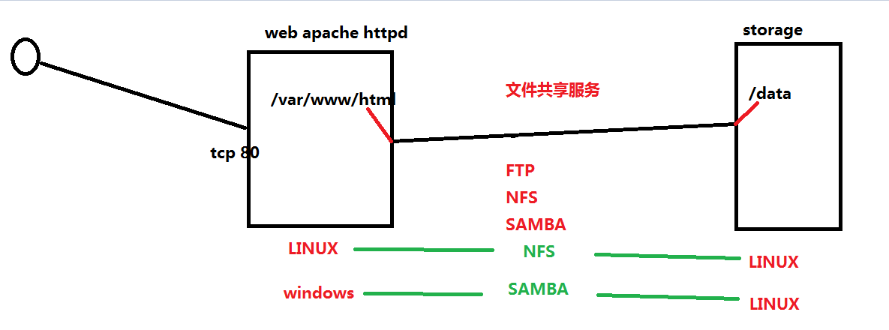
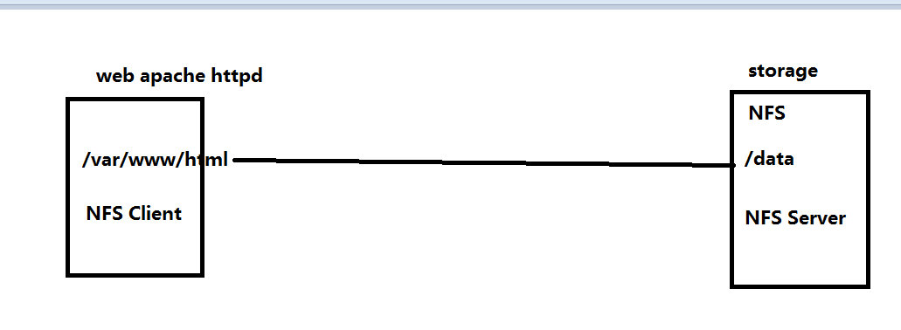
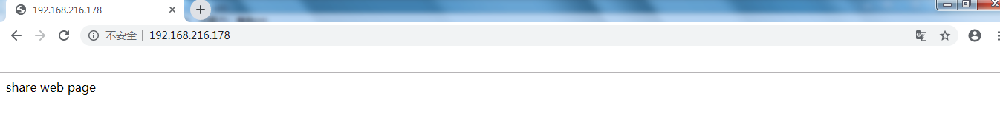

# 文件共享服务 NFS

# 一、任务背景

# 二、架构

# 三、实施

## 3.1 主机准备

~~~powershell
左侧 第一台服务  web服务器
[root@localhost ~]# cat /etc/sysconfig/network
NETWORKING=yes
HOSTNAME=web1

[root@localhost ~]# service iptables status
iptables：未运行防火墙。

[root@localhost ~]# getenforce
Disabled
[root@localhost ~]# sestatus
SELinux status:                 disabled

[root@localhost ~]# ntpdate time1.aliyun.com
 3 Dec 09:49:18 ntpdate[2427]: step time server 203.107.6.88 offset 43624.557229 sec
~~~

~~~powershell
右侧 第二服务  storage服务器
[root@localhost ~]# cat /etc/sysconfig/network
NETWORKING=yes
HOSTNAME=sharestorage

[root@localhost ~]# service iptables status
iptables：未运行防火墙。
[root@localhost ~]# getenforce
Disabled
[root@localhost ~]# sestatus
SELinux status:                 disabled

[root@localhost ~]# ntpdate time1.aliyun.com
 3 Dec 09:49:18 ntpdate[2427]: step time server 203.107.6.88 offset 43624.557229 sec
 
 
 
 如果使用showmount -e直接查看本机是否输出共享，必须要做如下设置 
 [root@sharestorage ~]# cat /etc/hosts
127.0.0.1   localhost localhost.localdomain localhost4 localhost4.localdomain4
::1         localhost localhost.localdomain localhost6 localhost6.localdomain6
192.168.216.179 sharestorage
~~~

## 3.2 软件安装

### 3.2.1 为storage服务器(NFS Server)安装软件

- nfs-utils

### 3.2.2 安装

~~~powershell
查询YUM源中是否有该软件
[root@sharestorage ~]# yum list | grep nfs-utils

安装
[root@sharestorage ~]# yum -y install nfs-utils
~~~

### 3.2.3 为web服务器(NFS Client)安装软件

- nfs-utils
- apache httpd

~~~powershell
[root@web1 ~]# yum -y install nfs-utils httpd
~~~

## 3.3 NFS Server配置

### 3.3.1 创建目录

~~~powershell
[root@sharestorage ~]# mkdir /data

[root@sharestorage ~]# touch /data/1.txt
[root@sharestorage ~]# touch /data/2.txt
[root@sharestorage ~]# touch /data/3.txt
~~~

### 3.3.2 创建共享目录

~~~powershell
[root@sharestorage ~]# ls /etc/exports

[root@sharestorage ~]# cat /etc/exports
/data   *(rw,sync,no_root_squash)

~~~

### 3.3.3 查看是否共享目录

~~~powershell
[root@sharestorage ~]# showmount -e
clnt_create: RPC: Unknown host
因为主机名和IP没有在/etc/hosts中绑定
~~~

### 3.3.4 启动服务

~~~powershell
把默认存在的rpcbind重新启动
[root@sharestorage ~]# service rpcbind restart

[root@sharestorage ~]# service nfs start

[root@sharestorage ~]# chkconfig --level 35 nfs on
~~~

### 3.3.5 在web服务器查看NFS Server共享的目录

~~~powershell
[root@web1 ~]# showmount -e 192.168.216.179
Export list for 192.168.216.179:
/data *
~~~

> RPC 远程过程调用，用于现实进程间通信。

## 3.4 WEB服务器(NFS Client)配置

### 3.4.1 检查软件是否安装

~~~powershell
[root@web1 ~]# rpm -qa | grep "nfs-utils"
nfs-utils-lib-1.1.5-13.el6.x86_64
nfs-utils-1.2.3-78.el6_10.1.x86_64
You have new mail in /var/spool/mail/root
[root@web1 ~]# rpm -qa | grep "rpcbind"
rpcbind-0.2.0-16.el6.x86_64
[root@web1 ~]# rpm -qa | grep "httpd"
httpd-2.2.15-69.el6.centos.x86_64
httpd-tools-2.2.15-69.el6.centos.x86_64
httpd-devel-2.2.15-69.el6.centos.x86_64
~~~

### 3.4.2 查看是否可以看到共享目录

~~~powershell
[root@web1 ~]# showmount -e 192.168.216.179
Export list for 192.168.216.179:
/data *
~~~

### 3.4.3 挂载验证

~~~powershell
[root@web1 ~]# mount -t nfs 192.168.216.179:/data /mnt

[root@web1 ~]# mount
192.168.216.179:/data on /mnt type nfs (rw,vers=4,addr=192.168.216.179,clientaddr=192.168.216.178)

[root@web1 ~]# umount /mnt
~~~

### 3.4.4 挂载到web服务目录

~~~powershell
[root@web1 ~]# mount -t nfs 192.168.216.179:/data /var/www/html
~~~

### 3.4.5 启动httpd服务

~~~powershell
[root@web1 ~]# chkconfig --level 35 httpd on
~~~

### 3.4.6 检查应用情况

~~~powershell
[root@sharestorage ~]# echo "share web page" > /data/index.html

[root@web1 ~]# ls /var/www/html
1.txt  2.txt  3.txt  index.html

~~~

