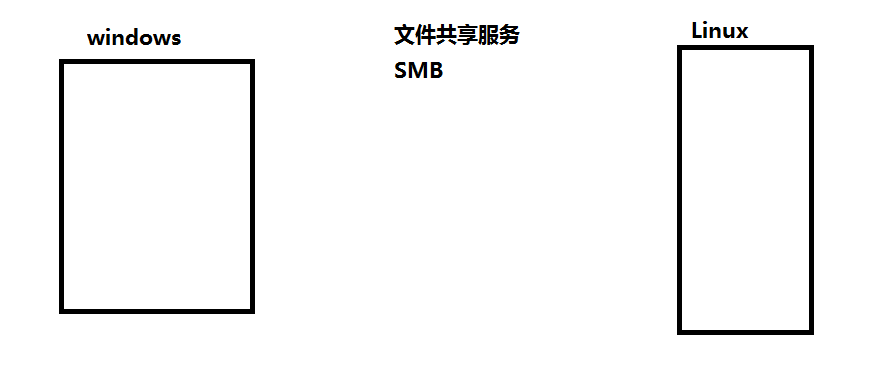
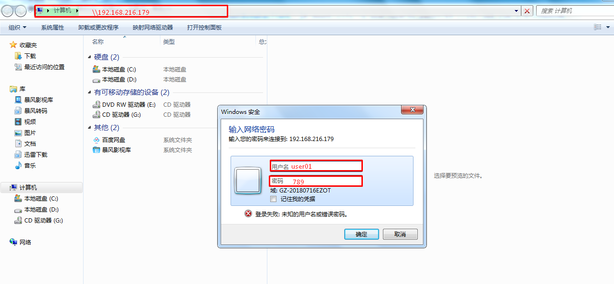
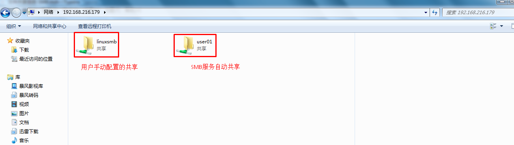
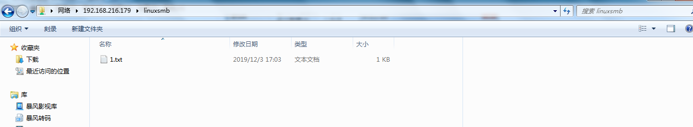
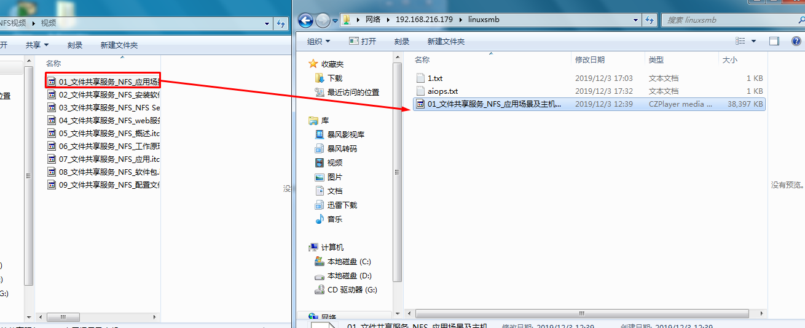

# 文件共享服务 SMB

# 一、应用场景

# 二、SMB介绍

- SMB（Server Message Block）协议
- 作用：windows系统和Linux之间的文件共享服务
- 别名：通用文件系统 CIFS(Common Internet File System)
- Samba服务的主要进程：
  - ==smbd进程== 	   控制发布共享目录与权限、==负责文件传输==   ==TCP  139 445==
  - nmbd进程        用于名称解析 netbios   ==UDP 137 138== ;基于NETBIOS协议获得计算机名称——>解析为相应IP地址，实现信息通讯

# 三、部署SMB

搭建一个SAMBA服务，共享一个目录/samba/share,客户端使用user01/123通过windows或者Linux可以在该目录里创建文件删除文件

## 3.1 主机环境准备

~~~powershell
[root@localhost ~]# cat /etc/sysconfig/network
NETWORKING=yes
HOSTNAME=smabaclient

[root@localhost ~]# cat /etc/sysconfig/network-scripts/ifcfg-eth0
DEVICE=eth0
TYPE=Ethernet
ONBOOT=yes
NM_CONTROLLED=yes
BOOTPROTO=none
IPADDR=192.168.216.178
PREFIX=24
GATEWAY=192.168.216.2
DNS1=119.29.29.29

[root@localhost ~]# cat /etc/hosts
127.0.0.1   localhost localhost.localdomain localhost4 localhost4.localdomain4
::1         localhost localhost.localdomain localhost6 localhost6.localdomain6
192.168.216.178 sambaclient
192.168.216.179 sambaserver

[root@localhost ~]# service iptables status
iptables：未运行防火墙。
[root@localhost ~]# sestatus
SELinux status:                 disabled

[root@localhost ~]# ntpdate time1.aliyun.com
~~~

~~~powershell
[root@localhost ~]# cat /etc/sysconfig/network
NETWORKING=yes
HOSTNAME=sambaserver

[root@localhost ~]# cat /etc/sysconfig/network-scripts/ifcfg-eth0
DEVICE=eth0
TYPE=Ethernet
ONBOOT=yes
NM_CONTROLLED=yes
BOOTPROTO=static
IPADDR=192.168.216.179
PREFIX=24
GATEWAY=192.168.216.2
DNS1=119.29.29.29
DNS2=202.106.0.20

[root@localhost ~]# cat /etc/hosts
127.0.0.1   localhost localhost.localdomain localhost4 localhost4.localdomain4
::1         localhost localhost.localdomain localhost6 localhost6.localdomain6
192.168.216.178 sambaclient
192.168.216.179 sambaserver

[root@localhost ~]# service iptables status
iptables：未运行防火墙。
[root@localhost ~]# sestatus
SELinux status:                 disabled

[root@localhost ~]# ntpdate time1.aliyun.com

~~~

## 3.2 安装软件

### 3.2.1 samba server主机安装软件

~~~powershell
[root@sambaserver ~]# yum -y install samba
~~~

### 3.2.2 samba client主机安装软件

> windows系统可以使用浏览器访问

~~~powershell
[root@smabaclient ~]# yum -y install samba-client
~~~

## 3.3 SMB配置

### 3.3.1 添加本地用户

~~~powershell
[root@sambaserver ~]# useradd user01
[root@sambaserver ~]# echo 123 | passwd --stdin user01
更改用户 user01 的密码 。
passwd： 所有的身份验证令牌已经成功更新。
~~~

### 3.3.2  创建共享目录

> /samba/share

~~~powershell
[root@sambaserver ~]# mkdir -p /samba/share
[root@sambaserver ~]# ll /samba/
总用量 4
drwxr-xr-x 2 root root 4096 12月  3 16:26 share
~~~

### 3.3.3 共享目录

~~~powershell
[root@sambaserver ~]# tail /etc/samba/smb.conf
.......
[linuxsmb]
        comment = samba aiops
        path = /samba/share
        guest ok = no
        writable = yes
~~~

### 3.3.4 设置本地用户到samba用户数据库

~~~powershell
[root@sambaserver ~]# smbpasswd -a user01
New SMB password: 789
Retype new SMB password: 789
Added user user01. 

验证是否有user01用户
[root@sambaserver ~]# pdbedit -L
user01:506:
~~~

## 3.4 启动smb服务

~~~powershell
[root@sambaserver ~]# /etc/init.d/nmb start
启动 NMB 服务：                                            [确定]
[root@sambaserver ~]# /etc/init.d/smb start
启动 SMB 服务：                                            [确定]

[root@sambaserver ~]# service nmb start
启动 NMB 服务：
[root@sambaserver ~]# service smb start
启动 SMB 服务：

[root@sambaserver ~]# chkconfig smb on
[root@sambaserver ~]# chkconfig nmb on
~~~

~~~powershell
[root@sambaserver ~]# ss -anput | grep smb
tcp    LISTEN     0      50                     *:445                   *:*      users:(("smbd",3280,28))
tcp    LISTEN     0      50                    :::445                  :::*      users:(("smbd",3280,26))
tcp    LISTEN     0      50                     *:139                   *:*      users:(("smbd",3280,29))
tcp    LISTEN     0      50                    :::139                  :::*      users:(("smbd",3280,27))

~~~

~~~powershell
[root@sambaserver ~]# ss -anput | grep nmb

udp    UNCONN     0      0                      *:137                   *:*      users:(("nmbd",3268,9))

udp    UNCONN     0      0                      *:138                   *:*      users:(("nmbd",3268,10))

~~~

# 四、SMB访问

## 4.1 Linux主机访问

~~~powershell
[root@smabaclient ~]# rpm -qa | grep samba-client
samba-client-3.6.23-53.el6_10.x86_64
~~~

~~~powershell
查看smb服务器共享目录
[root@smabaclient ~]# smbclient -L 192.168.216.179 -U user01
Enter user01's password:
Domain=[MYGROUP] OS=[Unix] Server=[Samba 3.6.23-53.el6_10]

        Sharename       Type      Comment
        ---------       ----      -------
        linuxsmb        Disk      samba aiops

-L 指列出SMB服务器共享的所有目录，此处指列出192.168.216.179服务器上的所有共享目录
-U 能够访问SMB服务器的用户名
~~~

~~~powershell
访问方法一：
直接访问smb共享目录
[root@smabaclient ~]# smbclient //192.168.216.179/linuxsmb -U user01
Enter user01's password:
Domain=[MYGROUP] OS=[Unix] Server=[Samba 3.6.23-53.el6_10]
smb: \> ls
  .                                   D        0  Tue Dec  3 16:26:11 2019
  ..                                  D        0  Tue Dec  3 16:26:11 2019

                49077 blocks of size 2097152. 43074 blocks available
smb: \> cd .
smb: \> cd ..
smb: \> pwd
Current directory is \\192.168.216.179\linuxsmb\
~~~

~~~powershell
在smb server端在共享目录中添加文件
[root@sambaserver ~]# echo "samba1" >> /samba/share/1.txt

下载文件
smb: \> ls
  .                                   D        0  Tue Dec  3 17:03:36 2019
  ..                                  D        0  Tue Dec  3 16:26:11 2019
  1.txt                                        7  Tue Dec  3 17:03:36 2019

                49077 blocks of size 2097152. 43074 blocks available
smb: \> ?
?              allinfo        altname        archive        blocksize
cancel         case_sensitive cd             chmod          chown
close          del            dir            du             echo
exit           get            getfacl        geteas         hardlink
help           history        iosize         lcd            link
lock           lowercase      ls             l              mask
md             mget           mkdir          more           mput
newer          open           posix          posix_encrypt  posix_open
posix_mkdir    posix_rmdir    posix_unlink   print          prompt
put            pwd            q              queue          quit
readlink       rd             recurse        reget          rename
reput          rm             rmdir          showacls       setea
setmode        stat           symlink        tar            tarmode
timeout        translate      unlock         volume         vuid
wdel           logon          listconnect    showconnect    ..
!
smb: \> get 1.txt
getting file \1.txt of size 7 as 1.txt (3.4 KiloBytes/sec) (average 3.4 KiloBytes/sec)

~~~

~~~powershell
访问方法二：
把共享目录挂载到客户端
[root@smabaclient ~]# mount.cifs -o user=user01,pass=789 //192.168.216.179/linuxsmb /mnt
或
[root@smabaclient ~]# mount -t cifs -o user=user01,pass=789 //192.168.216.179/linuxsmb /mnt

[root@smabaclient ~]# ls /mnt
1.txt
[root@smabaclient ~]# cat /mnt/1.txt
samba1

~~~

## 4.2 Windows主机访问

# 五、上传文件到SMB服务器中共享目录

~~~powershell
Linux客户端连接后上传文件
[root@smabaclient ~]# smbclient //192.168.216.179/linuxsmb -U user01
Enter user01's password:
Domain=[MYGROUP] OS=[Unix] Server=[Samba 3.6.23-53.el6_10]
smb: \> ?
?              allinfo        altname        archive        blocksize
cancel         case_sensitive cd             chmod          chown
close          del            dir            du             echo
exit           get            getfacl        geteas         hardlink
help           history        iosize         lcd            link
lock           lowercase      ls             l              mask
md             mget           mkdir          more           mput
newer          open           posix          posix_encrypt  posix_open
posix_mkdir    posix_rmdir    posix_unlink   print          prompt
put            pwd            q              queue          quit
readlink       rd             recurse        reget          rename
reput          rm             rmdir          showacls       setea
setmode        stat           symlink        tar            tarmode
timeout        translate      unlock         volume         vuid
wdel           logon          listconnect    showconnect    ..
!
smb: \> put install.log
NT_STATUS_ACCESS_DENIED opening remote file \install.log
此处上传文件被拒绝了

解决方法：
首先确定网络权限   writable = yes是否赋予共享目录
[root@sambaserver ~]# tail /etc/samba/smb.conf
;       path = /home/samba
;       public = yes
;       writable = yes
;       printable = no
;       write list = +staff
[linuxsmb]
        comment = samba aiops
        path = /samba/share
        guest ok = no
        writable = yes 共享目录写权限
        
其次确认本地目录权限，如果没有需要添加，此处给user01添加一个写权限
[root@sambaserver ~]# ll /samba/
总用量 4
drwxr-xr-x 2 root root 4096 12月  3 17:03 share
[root@sambaserver ~]# setfacl -m u:user01:rwx /samba/share
[root@sambaserver ~]# ll /samba/
总用量 4
drwxrwxr-x+ 2 root root 4096 12月  3 17:03 share

再次登录并上传文件测试

[root@smabaclient ~]# echo "aiops" >> aiops.txt
[root@smabaclient ~]# smbclient //192.168.216.179/linuxsmb -U user01
Enter user01's password:
Domain=[MYGROUP] OS=[Unix] Server=[Samba 3.6.23-53.el6_10]
smb: \> put aiops.txt
putting file aiops.txt as \aiops.txt (2.0 kb/s) (average 2.0 kb/s)
smb: \> ls
  .                                   D        0  Tue Dec  3 17:03:36 2019
  ..                                  D        0  Tue Dec  3 16:26:11 2019
  aiops.txt                           A        6  Tue Dec  3 17:32:43 2019
  1.txt                                        7  Tue Dec  3 17:03:36 2019

                49077 blocks of size 2097152. 43073 blocks available

在SMB服务器端查看是否上传
[root@sambaserver ~]# ll /samba/share/
总用量 8
-rw-r--r-- 1 root   root   7 12月  3 17:03 1.txt
-rwxr--r-- 1 user01 user01 6 12月  3 17:32 aiops.txt
~~~

**windows系统上传**

~~~powershell
[root@sambaserver ~]# ll /samba/share/
总用量 38408
-rwxr--r-- 1 user01 user01 39318046 12月  3 12:39 01_文件共享服务_NFS_应用场景及主机环境准备.itcast
-rw-r--r-- 1 root   root          7 12月  3 17:03 1.txt
-rwxr--r-- 1 user01 user01        6 12月  3 17:32 aiops.txt

~~~

# 作业：实现samba自动挂载的方法？

