# Linux系统服务-web服务 apache

# 前置操作

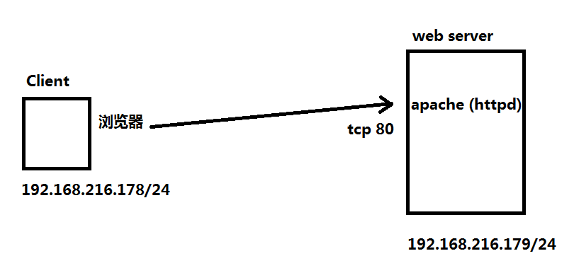

## 0.1 主机环境准备

~~~powershell
客户机
[root@client ~]# cat /etc/sysconfig/network
NETWORKING=yes
HOSTNAME=httpdclient

[root@client ~]# cat /etc/sysconfig/network-scripts/ifcfg-eth0
DEVICE=eth0
TYPE=Ethernet
ONBOOT=yes
NM_CONTROLLED=yes
BOOTPROTO=none
IPADDR=192.168.216.178
PREFIX=24
GATEWAY=192.168.216.2
DNS1=119.29.29.29

[root@client ~]# cat /etc/hosts
127.0.0.1   localhost localhost.localdomain localhost4 localhost4.localdomain4
::1         localhost localhost.localdomain localhost6 localhost6.localdomain6
192.168.216.178 httpdclient
192.168.216.179 httpdserver

[root@client ~]# iptables -F
[root@client ~]# service iptables stop
iptables：将链设置为政策 ACCEPT：filter                    [确定]
iptables：清除防火墙规则：                                 [确定]
iptables：正在卸载模块：                                   [确定]
[root@client ~]# service iptables save
iptables: Nothing to save.                                 [警告]
[root@client ~]# service iptables status
iptables：未运行防火墙。

[root@client ~]# ntpdate time1.aliyun.com
~~~

~~~powershell
服务器
[root@httpdserver ~]# cat /etc/sysconfig/network
NETWORKING=yes
HOSTNAME=httpdserver

[root@httpdserver ~]# cat /etc/sysconfig/network-scripts/ifcfg-eth0
DEVICE=eth0
TYPE=Ethernet
ONBOOT=yes
NM_CONTROLLED=yes
BOOTPROTO=static
IPADDR=192.168.216.179
PREFIX=24
GATEWAY=192.168.216.2
DNS1=119.29.29.29
DNS2=202.106.0.20

[root@httpdserver ~]# cat /etc/hosts
127.0.0.1   localhost localhost.localdomain localhost4 localhost4.localdomain4
::1         localhost localhost.localdomain localhost6 localhost6.localdomain6
192.168.216.178 httpdclient
192.168.216.179 httpdserver

[root@httpdserver ~]# iptables -F
[root@httpdserver ~]# service iptables stop
iptables：将链设置为政策 ACCEPT：filter                    [确定]
iptables：清除防火墙规则：                                 [确定]
iptables：正在卸载模块：                                   [确定]
[root@httpdserver ~]# service iptables save
iptables: Nothing to save.                                 [警告]
[root@httpdserver ~]# service iptables status
iptables：未运行防火墙。

[root@httpdserver ~]# ntpdate time1.aliyun.com

~~~

## 0.2 YUM源

~~~powershell
在默认的YUM源中
[root@dnsserver ~]# yum list | grep httpd
httpd.x86_64                                2.2.15-69.el6.centos        @163
httpd-tools.x86_64                          2.2.15-69.el6.centos        @anaconda-CentOS-201806291108.x86_64/6.10
httpd-devel.i686                            2.2.15-69.el6.centos        163
httpd-devel.x86_64                          2.2.15-69.el6.centos        163
httpd-manual.noarch                         2.2.15-69.el6.centos        163
libmicrohttpd.i686                          0.9.33-4.el6                163
libmicrohttpd.x86_64                        0.9.33-4.el6                163
libmicrohttpd-devel.i686                    0.9.33-4.el6                163
libmicrohttpd-devel.x86_64                  0.9.33-4.el6                163
libmicrohttpd-doc.noarch                    0.9.33-4.el6                163

~~~

# 一、httpd部署

~~~powershell
[root@httpdserver ~]# yum -y install httpd

[root@httpdserver ~]# rpm -qa | grep httpd
httpd-2.2.15-69.el6.centos.x86_64
httpd-tools-2.2.15-69.el6.centos.x86_64

添加一个运行数据目录
[root@httpdserver ~]# ls -d /var/www/html
/var/www/html

添加一个用户
[root@httpdserver ~]# grep apache /etc/passwd
apache:x:48:48:Apache:/var/www:/sbin/nologin

添加一个启动脚本文件
[root@httpdserver ~]# ls /etc/init.d/

httpd

添加httpd配置文件
[root@httpdserver ~]# ls /etc/httpd/
conf  conf.d  logs  modules  run
[root@httpdserver ~]# ll /etc/httpd/
总用量 8
drwxr-xr-x  2 root root 4096 12月  2 19:46 conf
drwxr-xr-x. 2 root root 4096 12月  2 19:46 conf.d
lrwxrwxrwx  1 root root   19 12月  2 19:46 logs -> ../../var/log/httpd
lrwxrwxrwx  1 root root   29 12月  2 19:46 modules -> ../../usr/lib64/httpd/modules
lrwxrwxrwx  1 root root   19 12月  2 19:46 run -> ../../var/run/httpd

~~~

# 二、网页文件准备

~~~powershell
[root@httpdserver ~]# cat /var/www/html/index.html
<h1>test</h1>
~~~

# 三、启动服务

- 端口 tcp 80 
- 数据目录 /var/www/html

~~~powershell
[root@httpdserver ~]# ss -anput | grep ":80"
[root@httpdserver ~]# /etc/init.d/httpd start
正在启动 httpd：httpd: Could not reliably determine the server's fully qualified domain name, using 192.168.216.179 for ServerName
                                                           [确定]
[root@httpdserver ~]# /etc/init.d/httpd stop
停止 httpd：                                               [确定]
[root@httpdserver ~]# service httpd start
正在启动 httpd：httpd: Could not reliably determine the server's fully qualified domain name, using 192.168.216.179 for ServerName
                                                           [确定]
[root@httpdserver ~]# chkconfig httpd on
[root@httpdserver ~]# chkconfig --list | grep httpd
httpd           0:关闭  1:关闭  2:启用  3:启用  4:启用  5:启用  6:关闭
~~~

# 四、访问httpd服务

~~~powershell
命令行的访问方法
[root@httpdclient ~]# which curl
/usr/bin/curl

[root@httpdclient ~]# curl http://192.168.216.179
<h1>test</h1>

命令行查看httpd服务的状态
[root@httpdclient ~]# curl -I http://192.168.216.179
HTTP/1.1 200 OK
Date: Fri, 06 Dec 2019 04:22:13 GMT
Server: Apache/2.2.15 (CentOS)
Last-Modified: Fri, 06 Dec 2019 03:58:49 GMT
ETag: "1008b5-e-59901103b08e2"
Accept-Ranges: bytes
Content-Length: 14
Connection: close
Content-Type: text/html; charset=UTF-8
~~~

**浏览器**

~~~powershell
[root@httpdclient ~]# firefox http://192.168.216.179
~~~

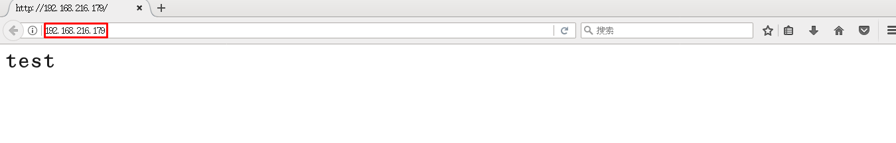

#  五、修改httpd数据目录

~~~powershell
创建数据目录
[root@httpdserver ~]# mkdir /www

修改httpd配置文件中的数据目录为新创建数据目录
[root@httpdserver ~]# cp -p /etc/httpd/conf/httpd.conf{,.bak}

[root@httpdserver ~]# vim /etc/httpd/conf/httpd.conf
293 DocumentRoot "/www"
318 <Directory "/www">
332     Options Indexes FollowSymLinks
344     Order allow,deny
345     Allow from all
347 </Directory>

重启httpd，让修改生效
[root@httpdserver ~]# service httpd restart

准备文件
[root@httpdserver ~]# echo "www web page" >> /www/index.html

访问
[root@httpdclient ~]# curl http://192.168.216.179
www web page

通过elinks
[root@httpdclient ~]# yum provides *bin/elinks
[root@httpdclient ~]# yum -y install elinks
[root@httpdclient ~]# elinks http://192.168.216.179

~~~

# 六、把httpd变成数据共享服务

> 当httpd数据目录中首页文件不存在时，可以把其变为文件共享服务

~~~powershell
创建文件，用于共享

[root@httpdserver ~]# touch /www/1.txt
[root@httpdserver ~]# touch /www/2.txt
[root@httpdserver ~]# touch /www/3.txt
[root@httpdserver ~]# ls /www
1.txt  2.txt  3.txt

更改或删除index.html文件

移动index.html
[root@httpdserver ~]# ls /www
index.html
[root@httpdserver ~]# mv /www/index.html /tmp

默认欢迎页，移除或重新命名
[root@httpdserver ~]# cd /etc/httpd/
[root@httpdserver httpd]# ls
conf  conf.d  logs  modules  run
[root@httpdserver httpd]# cd conf.d
[root@httpdserver conf.d]# ls
mod_dnssd.conf  README  welcome.conf
[root@httpdserver conf.d]# mv welcome.conf welcome.conf.bak
[root@httpdserver conf.d]# ls
mod_dnssd.conf  README  welcome.conf.bak

重启httpd
[root@httpdserver conf.d]# service httpd restart
停止 httpd：                                               [确定]
正在启动 httpd：httpd: Could not reliably determine the server's fully qualified domain name, using 192.168.216.179 for ServerName
                                                           [确定]
~~~

~~~powershell
[root@httpdclient ~]# firefox http://192.168.216.179 &
~~~

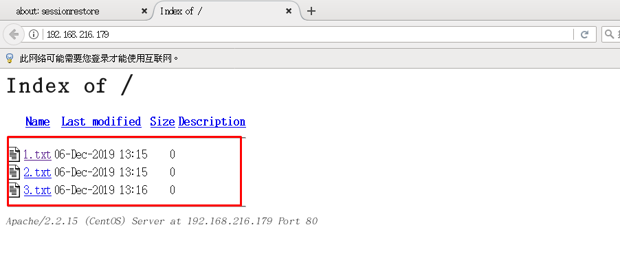

~~~powershell
[root@httpdclient ~]# wget http://192.168.216.179/1.txt
--2019-12-06 13:21:39--  http://192.168.216.179/1.txt
正在连接 192.168.216.179:80... 已连接。
已发出 HTTP 请求，正在等待回应... 200 OK
长度：0 [text/plain]
正在保存至: “1.txt”

    [ <=>                                   ] 0           --.-K/s   in 0s

2019-12-06 13:21:39 (0.00 B/s) - 已保存 “1.txt” [0/0])

[root@httpdclient ~]# ls
1.txt           
~~~

# 七、创建虚拟主机

## 7.1 通过多个目录实现多个网站

> 不推荐

~~~powershell
[root@httpdserver ~]# mkdir /var/www/html/web1
[root@httpdserver ~]# mkdir /var/www/html/web2
[root@httpdserver ~]# echo "web1 test page" >> /var/www/html/web1/index.html
[root@httpdserver ~]# echo "web2 test page" >> /var/www/html/web2/index.html
~~~

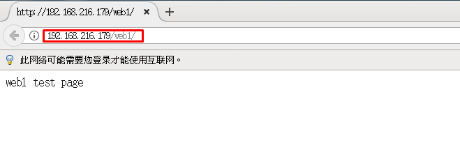

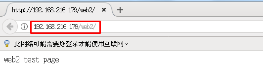

## 7.2 通过多个IP实现多个网站

- 多个IP地址
- 多个数据目录

~~~powershell
配置服务器多IP

方法一：临时方法
[root@httpdserver ~]# ip a s
1: lo: <LOOPBACK,UP,LOWER_UP> mtu 65536 qdisc noqueue state UNKNOWN
    link/loopback 00:00:00:00:00:00 brd 00:00:00:00:00:00
    inet 127.0.0.1/8 scope host lo
    inet6 ::1/128 scope host
       valid_lft forever preferred_lft forever
2: eth0: <BROADCAST,MULTICAST,UP,LOWER_UP> mtu 1500 qdisc pfifo_fast state UP qlen 1000
    link/ether 00:0c:29:c0:7f:0e brd ff:ff:ff:ff:ff:ff
    inet 192.168.216.179/24 brd 192.168.216.255 scope global eth0
    inet6 fe80::20c:29ff:fec0:7f0e/64 scope link
       valid_lft forever preferred_lft forever
[root@httpdserver ~]# ifconfig eth0:1 192.168.216.180/24
[root@httpdserver ~]# ip a s
1: lo: <LOOPBACK,UP,LOWER_UP> mtu 65536 qdisc noqueue state UNKNOWN
    link/loopback 00:00:00:00:00:00 brd 00:00:00:00:00:00
    inet 127.0.0.1/8 scope host lo
    inet6 ::1/128 scope host
       valid_lft forever preferred_lft forever
2: eth0: <BROADCAST,MULTICAST,UP,LOWER_UP> mtu 1500 qdisc pfifo_fast state UP qlen 1000
    link/ether 00:0c:29:c0:7f:0e brd ff:ff:ff:ff:ff:ff
    inet 192.168.216.179/24 brd 192.168.216.255 scope global eth0
    inet 192.168.216.180/24 brd 192.168.216.255 scope global secondary eth0:1
    inet6 fe80::20c:29ff:fec0:7f0e/64 scope link
       valid_lft forever preferred_lft forever
       
注：重启后IP将消失

方法二：修改网卡配置文件

[root@httpdserver ~]# cat /etc/sysconfig/network-scripts/ifcfg-eth0
DEVICE=eth0
TYPE=Ethernet
ONBOOT=yes
NM_CONTROLLED=yes
BOOTPROTO=static
IPADDR1=192.168.216.179
PREFIX1=24
IPADDR2=192.168.216.180
PREFIX2=24
GATEWAY=192.168.216.2
DNS1=119.29.29.29
DNS2=202.106.0.20

[root@httpdserver ~]# service network restart
正在关闭接口 eth0： 设备状态：3 （断开连接）
                                                           [确定]
关闭环回接口：                                             [确定]
弹出环回接口：                                             [确定]
弹出界面 eth0： Determining if ip address 192.168.216.179 is already in use for device eth0...
Determining if ip address 192.168.216.180 is already in use for device eth0...
                                                           [确定]

[root@httpdserver ~]# ip a s
1: lo: <LOOPBACK,UP,LOWER_UP> mtu 65536 qdisc noqueue state UNKNOWN
    link/loopback 00:00:00:00:00:00 brd 00:00:00:00:00:00
    inet 127.0.0.1/8 scope host lo
    inet6 ::1/128 scope host
       valid_lft forever preferred_lft forever
2: eth0: <BROADCAST,MULTICAST,UP,LOWER_UP> mtu 1500 qdisc pfifo_fast state UP qlen 1000
    link/ether 00:0c:29:c0:7f:0e brd ff:ff:ff:ff:ff:ff
    inet 192.168.216.179/24 brd 192.168.216.255 scope global eth0
    inet 192.168.216.180/24 brd 192.168.216.255 scope global secondary eth0
    inet6 fe80::20c:29ff:fec0:7f0e/64 scope link
       valid_lft forever preferred_lft forever

~~~

~~~powershell
添加多个目录
[root@httpdserver ~]# mkdir /www
[root@httpdserver ~]# mkdir /www/web1
[root@httpdserver ~]# mkdir /www/web2
[root@httpdserver ~]# echo "web1 test" >> /www/web1/index.html
[root@httpdserver ~]# echo "web2 test" >> /www/web2/index.html

~~~

~~~powershell
添加虚拟主机

[root@httpdserver ~]# vim /etc/httpd/conf/httpd.conf
990 NameVirtualHost *:80

 <VirtualHost 192.168.216.179:80>
1011     ServerAdmin webmaster@aiops.net.cn
1012     DocumentRoot /www/web1
1013     ErrorLog logs/web1.log
1014     CustomLog logs/web1-access_log common
1015 </VirtualHost>

1016 <VirtualHost 192.168.216.180:80>
1017     ServerAdmin webmaster@aiops.net.cn
1018     DocumentRoot /www/web2
1019     ErrorLog logs/web2-error_log
1020     CustomLog logs/web2-access_log common
1021 </VirtualHost>

~~~

~~~powershell
[root@httpdserver ~]# service httpd restart
~~~

**浏览器访问**

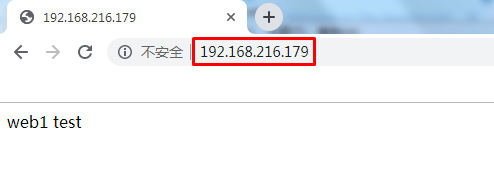

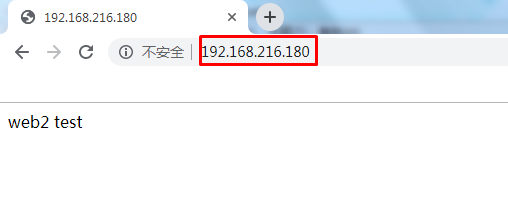

## 7.3通过多个端口实现多个网站

- 多个网站
- 多个端口 tcp 80 ; tcp 81

~~~powershell
[root@httpdserver ~]# vim /etc/httpd/conf/httpd.conf
136 Listen 80
137 Listen 81

1011 <VirtualHost *:80>
1012     ServerAdmin webmaster@aiops.net.cn
1013     DocumentRoot /www/web1
1014     ErrorLog logs/web1-error_log
1015     CustomLog logs/web1-access_log common
1016 </VirtualHost>

1017 <VirtualHost *:81>
1018     ServerAdmin webmaster@aiops.net.cn
1019     DocumentRoot /www/web2
1020     ErrorLog logs/web2-error_log
1021     CustomLog logs/web2-access_log common
1022 </VirtualHost>

[root@httpdserver ~]# service httpd restart
停止 httpd：                                               [确定]
正在启动 httpd：httpd: Could not reliably determine the server's fully qualified domain name, using 192.168.216.179 for ServerName
                                                           [确定]
~~~

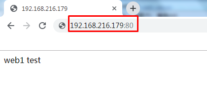

## 7.4 通过多个域名实现多个网站

### 7.4.1 域名准备

- www.aiops.net.cn 192.168.216.179
- www.aiops.com.cn 192.168.216.179

### 7.4.2 域名解析

~~~powershell
在/etc/hosts中添加解析
[root@httpdclient ~]# cat /etc/hosts
127.0.0.1   localhost localhost.localdomain localhost4 localhost4.localdomain4
::1         localhost localhost.localdomain localhost6 localhost6.localdomain6
192.168.216.178 httpdclient
192.168.216.179 httpdserver
192.168.216.179 www.aiops.net.cn
192.168.216.179 www.aiops.com.cn

[root@httpdserver ~]# cat /etc/hosts
127.0.0.1   localhost localhost.localdomain localhost4 localhost4.localdomain4
::1         localhost localhost.localdomain localhost6 localhost6.localdomain6
192.168.216.178 httpdclient
192.168.216.179 httpdserver
192.168.216.179 www.aiops.net.cn
192.168.216.179 www.aiops.com.cn

在dns服务器中添加解析
[root@httpdserver ~]# service named status
version: 9.8.2rc1-RedHat-9.8.2-0.68.rc1.el6_10.3
CPUs found: 1
worker threads: 1
number of zones: 24
debug level: 0
xfers running: 0
xfers deferred: 0
soa queries in progress: 0
query logging is OFF
recursive clients: 0/0/1000
tcp clients: 4/100
server is up and running
named (pid  1658) 正在运行...

在rfc1912文件中注册域名及域名解析文件

[root@httpdserver ~]# tail /etc/named.rfc1912.zones
zone "aiops.net.cn" IN {
        type master;
        file "aiops.net.cn.zone";
        allow-update { none; };
};
zone "aiops.com.cn" IN {
        type master;
        file "aiops.com.cn.zone";
        allow-update { none; };
};

添加域名解析文件
[root@httpdserver ~]# cd /var/named
[root@httpdserver named]# pwd
/var/named
[root@httpdserver named]# ls
192.168.216.zone   dynamic      named.localhost  test1.com.zone
aiopsweb.com.zone  named.ca     named.loopback   test2.com.zone
data               named.empty  slaves           test3.com.zone
[root@httpdserver named]# cp -p aiopsweb.com.zone aiops.net.cn.zone
[root@httpdserver named]# cp -p aiopsweb.com.zone aiops.com.cn.zone

[root@httpdserver named]# cat aiops.net.cn.zone
$TTL 1D
@       IN SOA  aiops.net.cn. rname.invalid. (
                                        0       ; serial
                                        1D      ; refresh
                                        1H      ; retry
                                        1W      ; expire
                                        3H )    ; minimum
        NS      @
@       A       192.168.216.179
www     A       192.168.216.179

[root@httpdserver named]# cat aiops.com.cn.zone
$TTL 1D
@       IN SOA  aiops.com.cn. rname.invalid. (
                                        0       ; serial
                                        1D      ; refresh
                                        1H      ; retry
                                        1W      ; expire
                                        3H )    ; minimum
        NS      @
@       A       192.168.216.179
www     A       192.168.216.179

重启named服务
[root@httpdserver named]# service named restart
停止 named：                                               [确定]
启动 named：                                               [确定]

在客户端验证
[root@httpdclient ~]# cat /etc/sysconfig/network-scripts/ifcfg-eth0
DEVICE=eth0
TYPE=Ethernet
ONBOOT=yes
NM_CONTROLLED=yes
BOOTPROTO=none
IPADDR=192.168.216.178
PREFIX=24
GATEWAY=192.168.216.2
DNS1=192.168.216.179

[root@httpdclient ~]# service network restart

[root@httpdclient ~]# cat /etc/resolv.conf
# Generated by NetworkManager
nameserver 192.168.216.179
[root@httpdclient ~]# nslookup
> server
Default server: 192.168.216.179
Address: 192.168.216.179#53

> www.aiops.net.cn
Server:         192.168.216.179
Address:        192.168.216.179#53

Name:   www.aiops.net.cn
Address: 192.168.216.179
> www.aiops.com.cn
Server:         192.168.216.179
Address:        192.168.216.179#53

Name:   www.aiops.com.cn
Address: 192.168.216.179

~~~

### 7.4.3 配置httpd

~~~powershell
[root@httpdserver ~]# cat /etc/httpd/conf/httpd.conf

<VirtualHost *:80>
    ServerAdmin webmaster@aiops.net.cn
    DocumentRoot /www/web1
    ServerName www.aiops.net.cn
    ErrorLog logs/web1-error_log
    CustomLog logs/web1-access_log common
</VirtualHost>
<VirtualHost *:80>
    ServerAdmin webmaster@aiops.net.cn
    DocumentRoot /www/web2
    ServerName www.aiops.com.cn
    ErrorLog logs/web2-error_log
    CustomLog logs/web2-access_log common
</VirtualHost>
~~~

~~~powershell
重启httpd
[root@httpdserver ~]# service httpd restart
停止 httpd：                                               [确定]
正在启动 httpd：httpd: Could not reliably determine the server's fully qualified domain name, using 192.168.216.179 for ServerName
                                                           [确定]
~~~

~~~powershell
在客户端访问
[root@httpdclient ~]# curl http://www.aiops.net.cn
web1 test
[root@httpdclient ~]# curl http://www.aiops.com.cn
web2 test

~~~

# 八、通过片段配置文件配置虚拟主机

- CentOS6默认通过主配置文件进行配置
- CentOS7默认通过片段配置文件进行配置

~~~powershell
准备：多域名访问的虚拟主机
[root@httpdclient ~]# curl http://www.aiops.net.cn
web1 test
[root@httpdclient ~]# curl http://www.aiops.com.cn
web2 test

把主配置文件中的虚拟主机conf.d目录中
[root@httpdserver ~]# touch /etc/httpd/conf.d/aiops.net.cn.conf

[root@httpdserver ~]# touch /etc/httpd/conf.d/aiops.com.cn.conf

[root@httpdserver ~]# cat /etc/httpd/conf.d/aiops.net.cn.conf
<VirtualHost *:80>
    ServerAdmin webmaster@aiops.net.cn
    DocumentRoot /www/web1
    ServerName www.aiops.net.cn
    ErrorLog logs/web1-error_log
    CustomLog logs/web1-access_log common
</VirtualHost>

[root@httpdserver ~]# cat /etc/httpd/conf.d/aiops.com.cn.conf
<VirtualHost *:80>
    ServerAdmin webmaster@aiops.net.cn
    DocumentRoot /www/web2
    ServerName www.aiops.com.cn
    ErrorLog logs/web2-error_log
    CustomLog logs/web2-access_log common
</VirtualHost>

[root@httpdserver ~]# ls /etc/httpd/conf.d/
aiops.com.cn.conf  aiops.net.cn.conf  mod_dnssd.conf  README  welcome.conf.bak

重启httpd服务
[root@httpdserver ~]# service httpd restart
停止 httpd：                                               [确定]
正在启动 httpd：httpd: Could not reliably determine the server's fully qualified domain name, using 192.168.216.179 for ServerName
                                                           [确定]
                                                           
在客户端验证
[root@httpdclient ~]# curl http://www.aiops.net.cn
web1 test

[root@httpdclient ~]# curl http://www.aiops.com.cn
web2 test

                                                           
~~~

# 九、通过用户名和密码访问网站

- 此处通过用户名和密码访问是指对运维使用的业务系统的网站
  - 例如：某些无用户名和密码验证的监控系统,负载均衡器 haproxy
- 不能用于对终端用户的网站
- 验证方式
  - 用户名和密码
  - 证书
  - 令牌

~~~powershell
创建用户名和密码文件
[root@httpdserver ~]# htpasswd -cm /etc/httpd/conf/.htpass op1
New password:
Re-type new password:
Adding password for user op1
[root@httpdserver ~]# htpasswd -bm /etc/httpd/conf/.htpass op2 456
Adding password for user op2
[root@httpdserver ~]# cat /etc/httpd/conf/.htpass
op1:$apr1$Qa/YDC1m$37Xh1zI00U7BdwEpBKTbv1
op2:$apr1$H/W.FTZZ$Ofm00hrkGE7CxRgBnrye.0

修改httpd.conf配置文件，以便能够开启认证
第一步：关闭虚拟主机
991 NameVirtualHost *:80
把上述内容前面添加#，以注释。

第二步：准备网站首页文件
[root@httpdserver ~]# ls /var/www/html
[root@httpdserver ~]# echo "var www html test" >> /var/www/html/index.html
[root@httpdserver ~]# cat /var/www/html/index.html
var www html test

第三步：重启服务后在本地访问测试
[root@httpdserver ~]# service httpd restart
[root@httpdserver ~]# curl http://192.168.216.179

第四步：修改配置文件
[root@httpdserver ~]# vim /etc/httpd/conf/httpd.conf
添加如下内容
 344     Order allow,deny
 345     Allow from all
 346     AuthType Basic
 347     AuthName "please input your name and password:"
 348     AuthBasicProvider file
 349     AuthUserFile /etc/httpd/conf/.htpass
 350     Require user op1

重启httpd服务
[root@httpdserver ~]# service httpd restart

~~~

**在客户端浏览器中验证**

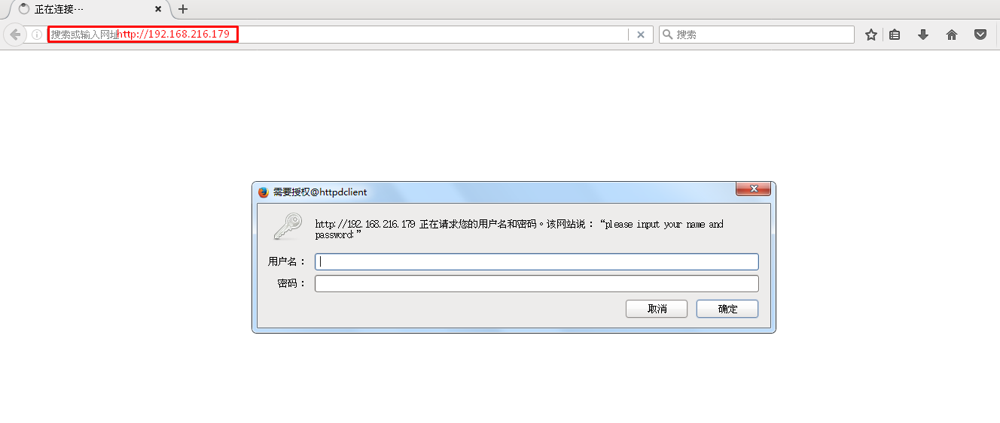

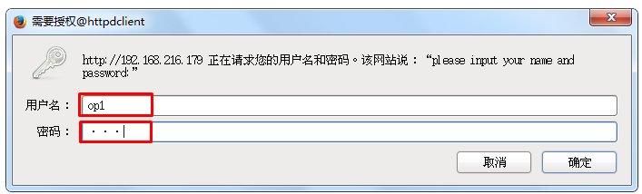

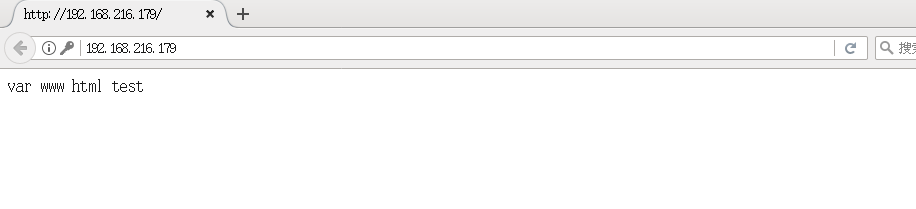

# 十、实现LAMP

- LAMP web架构
- 作用
  - 运行一个以php开发网页
  - 由一个数据库管理系统支撑
  - 运行一个以php语言开发动态网站

## 10.1 关闭httpd

~~~powershell
[root@httpdserver ~]# service httpd stop
停止 httpd：                                               [确定]
[root@httpdserver ~]# ss -anput | grep ":80"
[root@httpdserver ~]# ps aux | grep httpd
root       9034  0.0  0.0 103336   868 pts/2    S+   21:40   0:00 grep httpd
~~~

## 10.2 php模块

- apache借助于libphp.so模块完成php语言的解释

~~~powershell
测试网络连通性

[root@httpdserver ~]# ping -c 4 www.baidu.com
PING www.a.shifen.com (14.215.177.39) 56(84) bytes of data.
64 bytes from 14.215.177.39: icmp_seq=1 ttl=128 time=38.6 ms
64 bytes from 14.215.177.39: icmp_seq=2 ttl=128 time=41.3 ms
64 bytes from 14.215.177.39: icmp_seq=3 ttl=128 time=39.1 ms
64 bytes from 14.215.177.39: icmp_seq=4 ttl=128 time=38.7 ms

--- www.a.shifen.com ping statistics ---
4 packets transmitted, 4 received, 0% packet loss, time 7093ms
rtt min/avg/max/mdev = 38.664/39.479/41.338/1.098 ms

安装php相关
[root@httpdserver ~]# yum -y install php php-devel php-mysql

验证apache使用的模块目录中是否有libphp.so
[root@httpdserver ~]# ls -l /etc/httpd/modules/
总用量 5160
-rwxr-xr-x  1 root root 3699248 11月  1 20:30 libphp5.so
~~~

## 10.3 mysql数据库管理系统

- CentOS 6 默认YUM源中使用mysql
- CentOS7 默认YUM源中使用mairadb

~~~powershell
[root@httpdserver ~]# yum -y install mysql mysql-server

~~~

## 10.4 验证LAMP可用性

### 10.4.1验证httpd可用性

~~~powershell
[root@httpdserver ~]# service httpd start ; chkconfig httpd on
正在启动 httpd：httpd: Could not reliably determine the server's fully qualified domain name, using 192.168.216.179 for ServerName
                                                           [确定]
~~~

**在客户端访问**

### 10.4.2 php相关验证

- apahce使用php，以模块方式  libphp5.so

~~~powershell
做一个php语言开发的网页，放在/var/www/html
[root@httpdserver ~]# cat /var/www/html/index.php
<?php
phpinfo();
?>
~~~

**在客户端访问**

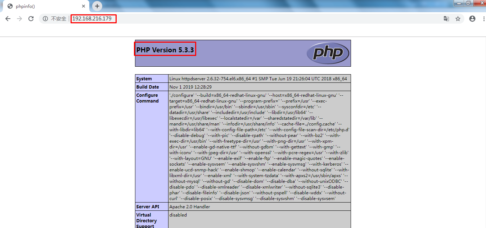

### 10.4.3 mysql相关验证

~~~powershell
启动mysql服务
[root@httpdserver ~]# service mysqld start
初始化 MySQL 数据库： Installing MySQL system tables...
OK
Filling help tables...
OK

To start mysqld at boot time you have to copy
support-files/mysql.server to the right place for your system

PLEASE REMEMBER TO SET A PASSWORD FOR THE MySQL root USER !
To do so, start the server, then issue the following commands:

/usr/bin/mysqladmin -u root password 'new-password'
/usr/bin/mysqladmin -u root -h httpdserver password 'new-password'

Alternatively you can run:
/usr/bin/mysql_secure_installation

which will also give you the option of removing the test
databases and anonymous user created by default.  This is
strongly recommended for production servers.

See the manual for more instructions.

You can start the MySQL daemon with:
cd /usr ; /usr/bin/mysqld_safe &

You can test the MySQL daemon with mysql-test-run.pl
cd /usr/mysql-test ; perl mysql-test-run.pl

Please report any problems with the /usr/bin/mysqlbug script!

                                                           [确定]
正在启动 mysqld：                                          [确定]
You have mail in /var/spool/mail/root

[root@httpdserver ~]# chkconfig mysqld on

设置mysql超级管理员root密码
[root@httpdserver ~]# mysqladmin -u root password '123456'

访问mysql服务，查看数据库
[root@httpdserver ~]# mysql -uroot -p123456
Welcome to the MySQL monitor.  Commands end with ; or \g.
Your MySQL connection id is 3
Server version: 5.1.73 Source distribution

Copyright (c) 2000, 2013, Oracle and/or its affiliates. All rights reserved.

Oracle is a registered trademark of Oracle Corporation and/or its
affiliates. Other names may be trademarks of their respective
owners.

Type 'help;' or '\h' for help. Type '\c' to clear the current input statement.

mysql> show databases;
+--------------------+
| Database           |
+--------------------+
| information_schema |
| mysql              |
| test               |
+--------------------+
3 rows in set (0.00 sec)

mysql> exit
Bye

通过php脚本访问mysql数据库管理系统

[root@httpdserver ~]# cat /var/www/html/index.php
<?php
$link = mysql_connect("127.0.0.1","root","123456");
if($link) echo "mysql is ok";
mysql_close();
?>

~~~

**在客户端访问**

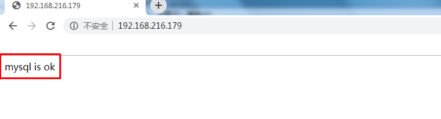

# 十一、部署动态论坛

## 11.1 论坛源码获取

- discuz
- wordpress
- 获取方法
  - 百度搜索

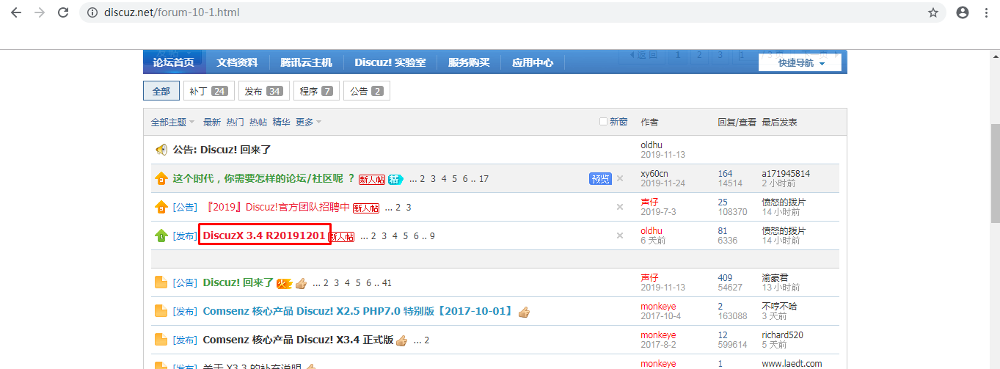

~~~powershell
通过git clone下载
[root@httpdserver ~]# git clone https://gitee.com/ComsenzDiscuz/DiscuzX

查看是否下载
[root@httpdserver ~]# ls
 DiscuzX    

~~~

## 11.2 论坛部署

> 部署指的是把论坛的源码复制到apache数据目录

~~~powershell
[root@httpdserver ~]# cd DiscuzX/

[root@httpdserver DiscuzX]# ls
readme  README.md  upload  utility
[root@httpdserver DiscuzX]# cd upload/
[root@httpdserver upload]# ls
admin.php  connect.php      group.php  member.php  search.php  uc_server
api        crossdomain.xml  home.php   misc.php    source
api.php    data             index.php  plugin.php  static
archiver   favicon.ico      install    portal.php  template
config     forum.php        m          robots.txt  uc_client
[root@httpdserver upload]# rm -rf /var/www/html/*
[root@httpdserver upload]# ll
总用量 112
-rw-r--r--  1 root root 2748 12月  7 13:53 admin.php
drwxr-xr-x 10 root root 4096 12月  7 13:53 api
-rw-r--r--  1 root root  727 12月  7 13:53 api.php
drwxr-xr-x  2 root root 4096 12月  7 13:53 archiver
drwxr-xr-x  2 root root 4096 12月  7 13:53 config
-rw-r--r--  1 root root 1017 12月  7 13:53 connect.php
-rw-r--r--  1 root root  106 12月  7 13:53 crossdomain.xml
drwxr-xr-x 12 root root 4096 12月  7 13:53 data
-rw-r--r--  1 root root 5558 12月  7 13:53 favicon.ico
-rw-r--r--  1 root root 2245 12月  7 13:53 forum.php
-rw-r--r--  1 root root  821 12月  7 13:53 group.php
-rw-r--r--  1 root root 1280 12月  7 13:53 home.php
-rw-r--r--  1 root root 5893 12月  7 13:53 index.php
drwxr-xr-x  5 root root 4096 12月  7 13:53 install
drwxr-xr-x  2 root root 4096 12月  7 13:53 m
-rw-r--r--  1 root root 1025 12月  7 13:53 member.php
-rw-r--r--  1 root root 2435 12月  7 13:53 misc.php
-rw-r--r--  1 root root 1788 12月  7 13:53 plugin.php
-rw-r--r--  1 root root  977 12月  7 13:53 portal.php
-rw-r--r--  1 root root  582 12月  7 13:53 robots.txt
-rw-r--r--  1 root root 1155 12月  7 13:53 search.php
drwxr-xr-x 10 root root 4096 12月  7 13:53 source
drwxr-xr-x  7 root root 4096 12月  7 13:53 static
drwxr-xr-x  3 root root 4096 12月  7 13:53 template
drwxr-xr-x  7 root root 4096 12月  7 13:53 uc_client
drwxr-xr-x 14 root root 4096 12月  7 13:53 uc_server
[root@httpdserver upload]# cp -r * /var/www/html/
[root@httpdserver upload]# ls /var/www/html
admin.php  connect.php      group.php  member.php  search.php  uc_server
api        crossdomain.xml  home.php   misc.php    source
api.php    data             index.php  plugin.php  static
archiver   favicon.ico      install    portal.php  template
config     forum.php        m          robots.txt  uc_client
~~~

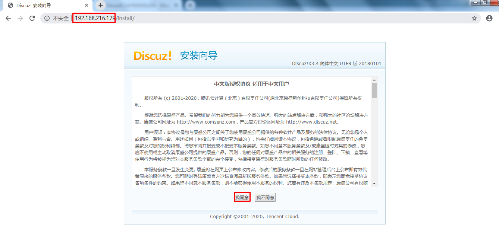

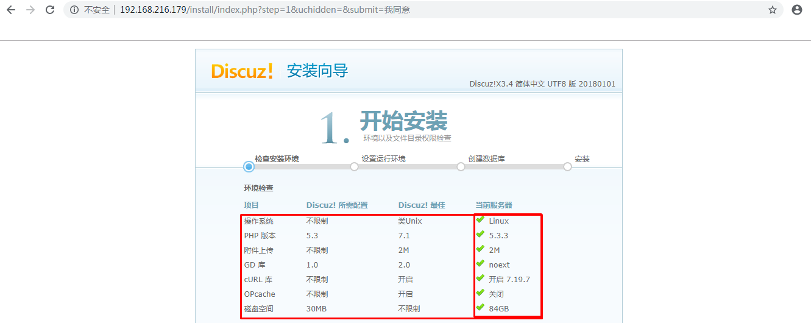

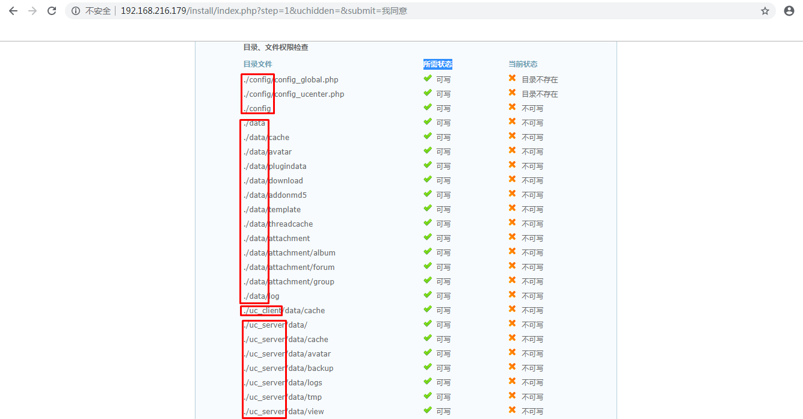

~~~~powershell
[root@httpdserver upload]# cd /var/www/html
[root@httpdserver html]# ls
admin.php  connect.php      group.php  member.php  search.php  uc_server
api        crossdomain.xml  home.php   misc.php    source
api.php    data             index.php  plugin.php  static
archiver   favicon.ico      install    portal.php  template
config     forum.php        m          robots.txt  uc_client
[root@httpdserver html]# chmod -R 757 config
[root@httpdserver html]# chmod -R 757 data
[root@httpdserver html]# chmod -R 757 uc_client
[root@httpdserver html]# chmod -R 757 uc_server

~~~~

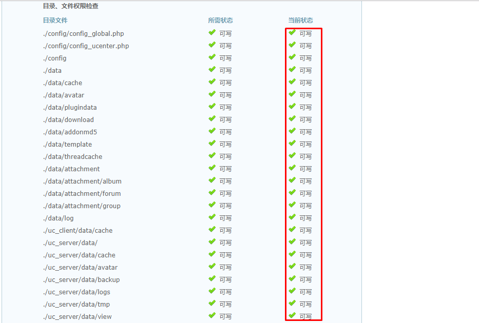

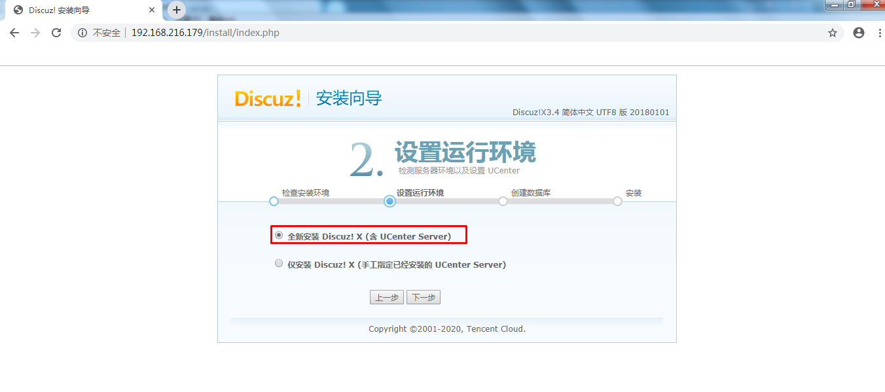

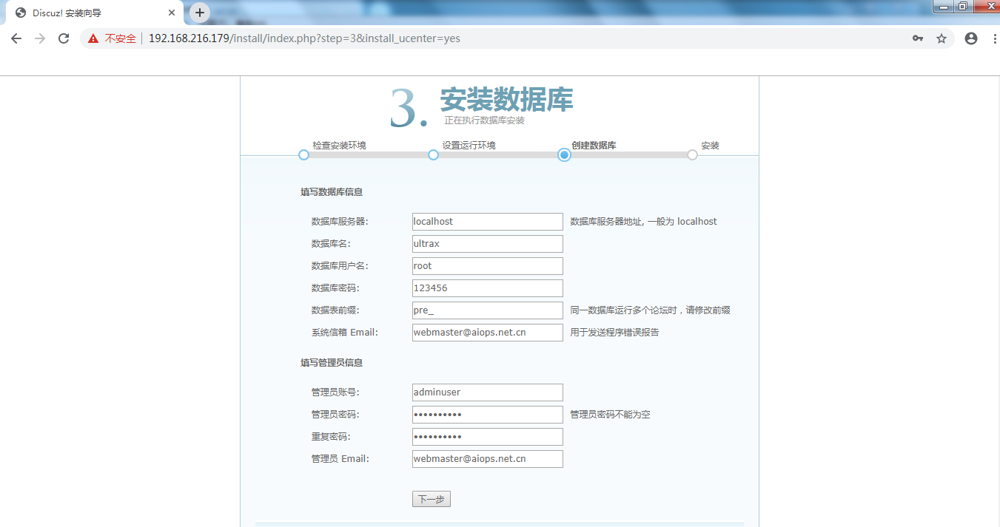

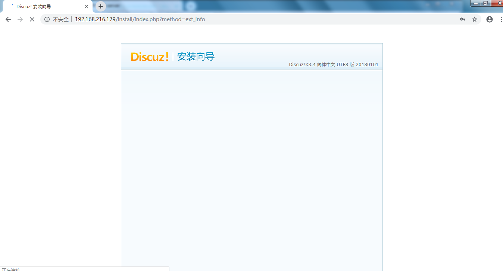

## 11.3 应用测试

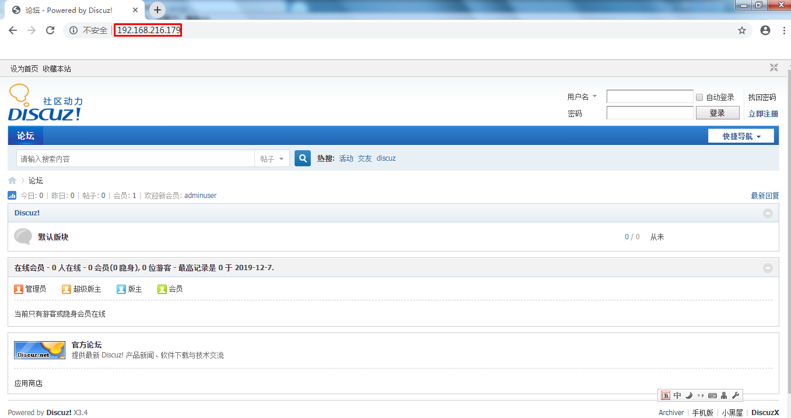

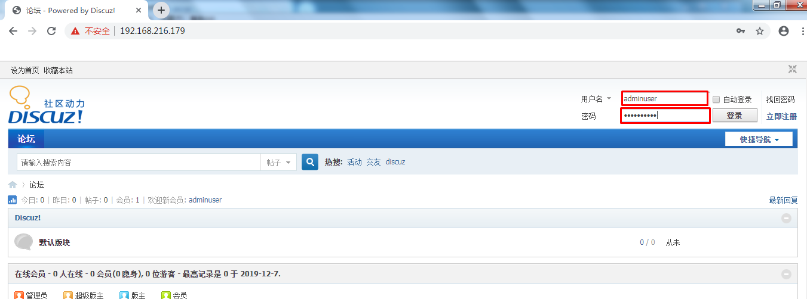

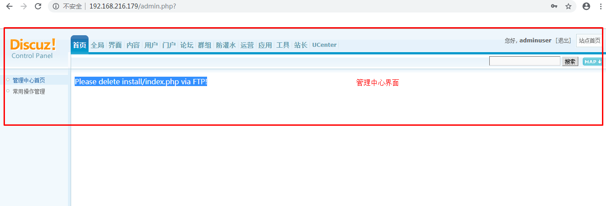

# 十二、阿里云主机部署论坛(wordpress)

## 12.1 购买阿里云主机

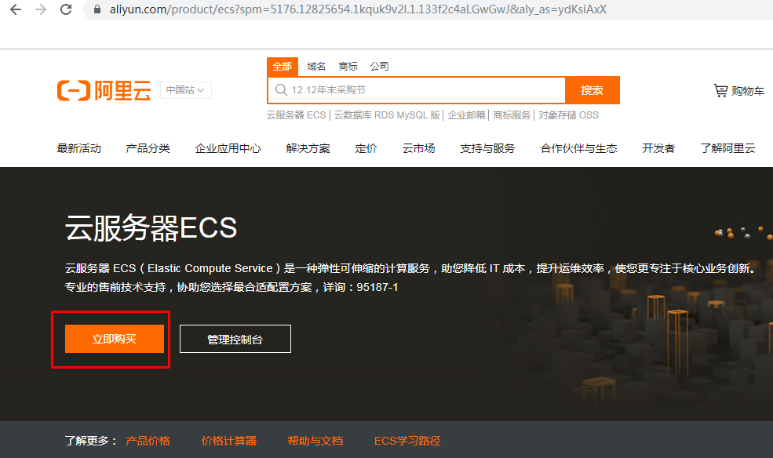

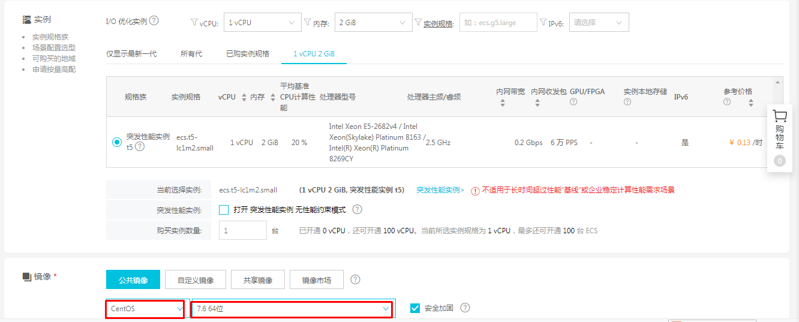

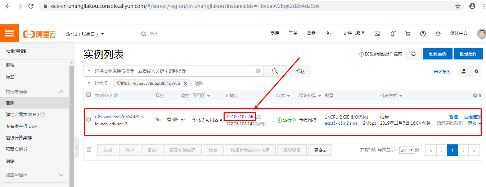

## 12.2 获取wordpress论坛源码

~~~powershell
Welcome to Alibaba Cloud Elastic Compute Service !

[root@iZ8vbavv28q62d854dz9c6Z ~]#
~~~

~~~powershell
[root@iZ8vbavv28q62d854dz9c6Z ~]# wget https://cn.wordpress.org/latest-zh_CN.tar.gz
~~~

## 12.3 准备环境(LAMP)

~~~powershell
关于php，我们使用5.6.20以上的版本
PHP YUM源
[root@iZ8vbavv28q62d854dz9c6Z ~]# cat /etc/yum.repos.d/php.repo
[phprepo]
name=phprepo
baseurl=http://rpms.remirepo.net/enterprise/7/remi/x86_64/
enabled=1
gpgcheck=0

[root@iZ8vbavv28q62d854dz9c6Z ~]# yum -y install httpd php56-php php56-php-devel php56-php-mysql mariadb mariadb-server
~~~

~~~powershell
启动httpd
[root@iZ8vbavv28q62d854dz9c6Z ~]# systemctl start httpd
[root@iZ8vbavv28q62d854dz9c6Z ~]# systemctl enable httpd
Created symlink from /etc/systemd/system/multi-user.target.wants/httpd.service to /usr/lib/systemd/system/httpd.service.
[root@iZ8vbavv28q62d854dz9c6Z ~]# ss -anput | grep ":80"
tcp    LISTEN     0      128       *:80                    *:*                   users:(("httpd",pid=1477,fd=3),("httpd",pid=1476,fd=3),("httpd",pid=1475,fd=3),("httpd",pid=1474,fd=3),("httpd",pid=1473,fd=3),("httpd",pid=1471,fd=3))
tcp    ESTAB      0      0      172.26.108.142:43286              100.100.30.25:80                  users:(("AliYunDun",pid=1185,fd=20))

查看php模块
[root@iZ8vbavv28q62d854dz9c6Z ~]# ls /etc/httpd/modules/
libphp5.so 

验证是否可以使用php模块
[root@iZ8vbavv28q62d854dz9c6Z ~]# cat /var/www/html/index.php
<?php
phpinfo();
?>
此处修改完成后，可能通过浏览器对其进行访问，如果可以看到php版本，表明apache可以调用php模块工作。

验证是否可以使用mariadb数据库管理系统
[root@iZ8vbavv28q62d854dz9c6Z ~]# systemctl start mariadb
[root@iZ8vbavv28q62d854dz9c6Z ~]# systemctl enable mariadb
Created symlink from /etc/systemd/system/multi-user.target.wants/mariadb.service to /usr/lib/systemd/system/mariadb.service.
[root@iZ8vbavv28q62d854dz9c6Z ~]# mysqladmin -uroot password '123456'
[root@iZ8vbavv28q62d854dz9c6Z ~]# mysql -uroot -p123456
Welcome to the MariaDB monitor.  Commands end with ; or \g.
Your MariaDB connection id is 3
Server version: 5.5.64-MariaDB MariaDB Server

Copyright (c) 2000, 2018, Oracle, MariaDB Corporation Ab and others.

Type 'help;' or '\h' for help. Type '\c' to clear the current input statement.

MariaDB [(none)]> show databases;
+--------------------+
| Database           |
+--------------------+
| information_schema |
| mysql              |
| performance_schema |
| test               |
+--------------------+
4 rows in set (0.00 sec)

[root@iZ8vbavv28q62d854dz9c6Z ~]# cat /var/www/html/index.php
<?php
$link=mysql_connect("127.0.0.1","root","123456");
if($link) echo "mariadb is ok";
mysql_close();
?>

[root@iZ8vbavv28q62d854dz9c6Z ~]# curl http://127.0.0.1
mariadb is ok
~~~

## 12.4 论坛部署(wordpress)

~~~powershell
[root@iZ8vbavv28q62d854dz9c6Z ~]# rm -rf /var/www/html/*
~~~

~~~powershell
[root@iZ8vbavv28q62d854dz9c6Z ~]# yum -y install unzip

[root@iZ8vbavv28q62d854dz9c6Z ~]# unzip wordpress524.zip

[root@iZ8vbavv28q62d854dz9c6Z ~]# ls
wordpress  wordpress524.zip

[root@iZ8vbavv28q62d854dz9c6Z ~]# cd wordpress
[root@iZ8vbavv28q62d854dz9c6Z wordpress]# ls
index.php        wp-blog-header.php    wp-includes        wp-settings.php
license.txt      wp-comments-post.php  wp-links-opml.php  wp-signup.php
readme.html      wp-config-sample.php  wp-load.php        wp-trackback.php
wp-activate.php  wp-content            wp-login.php       xmlrpc.php
wp-admin         wp-cron.php           wp-mail.php
[root@iZ8vbavv28q62d854dz9c6Z wordpress]# cp -r * /var/www/html/
[root@iZ8vbavv28q62d854dz9c6Z wordpress]# ls /var/www/html/
index.php        wp-blog-header.php    wp-includes        wp-settings.php
license.txt      wp-comments-post.php  wp-links-opml.php  wp-signup.php
readme.html      wp-config-sample.php  wp-load.php        wp-trackback.php
wp-activate.php  wp-content            wp-login.php       xmlrpc.php
wp-admin         wp-cron.php           wp-mail.php

~~~

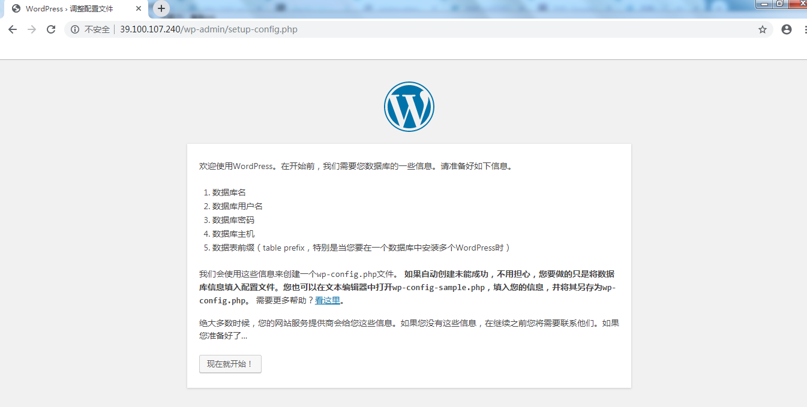

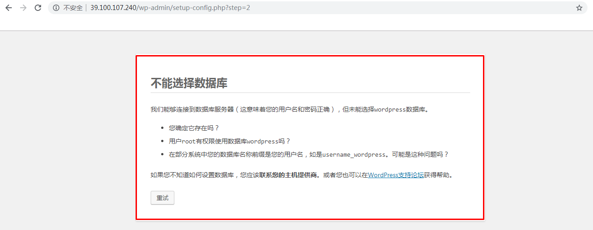

~~~powershell
在数据库管理系统中创建数据库 wordpress
[root@iZ8vbavv28q62d854dz9c6Z ~]# mysql -uroot -p123456
Welcome to the MariaDB monitor.  Commands end with ; or \g.
Your MariaDB connection id is 3
Server version: 5.5.64-MariaDB MariaDB Server

Copyright (c) 2000, 2018, Oracle, MariaDB Corporation Ab and others.

Type 'help;' or '\h' for help. Type '\c' to clear the current input statement.

MariaDB [(none)]> show databases;
+--------------------+
| Database           |
+--------------------+
| information_schema |
| mysql              |
| performance_schema |
| test               |
+--------------------+
4 rows in set (0.00 sec)

MariaDB [(none)]> create database wordpress;
Query OK, 1 row affected (0.00 sec)

MariaDB [(none)]> show databases;
+--------------------+
| Database           |
+--------------------+
| information_schema |
| mysql              |
| performance_schema |
| test               |
| wordpress          |
+--------------------+
5 rows in set (0.00 sec)
~~~

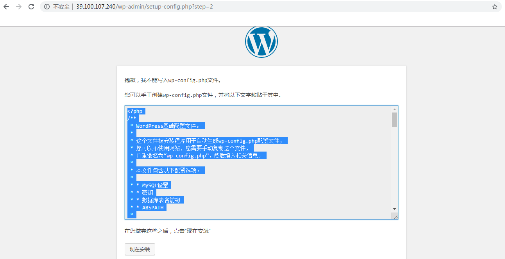

~~~powershell
把上图提示框中的内容写到的/var/www/html/wp-config.php文件中
[root@iZ8vbavv28q62d854dz9c6Z ~]# cd /var/www/html
[root@iZ8vbavv28q62d854dz9c6Z html]# ls
index.php        wp-blog-header.php    wp-includes        wp-settings.php
license.txt      wp-comments-post.php  wp-links-opml.php  wp-signup.php
readme.html      wp-config-sample.php  wp-load.php        wp-trackback.php
wp-activate.php  wp-content            wp-login.php       xmlrpc.php
wp-admin         wp-cron.php           wp-mail.php
[root@iZ8vbavv28q62d854dz9c6Z html]# vim wp-config.php
~~~

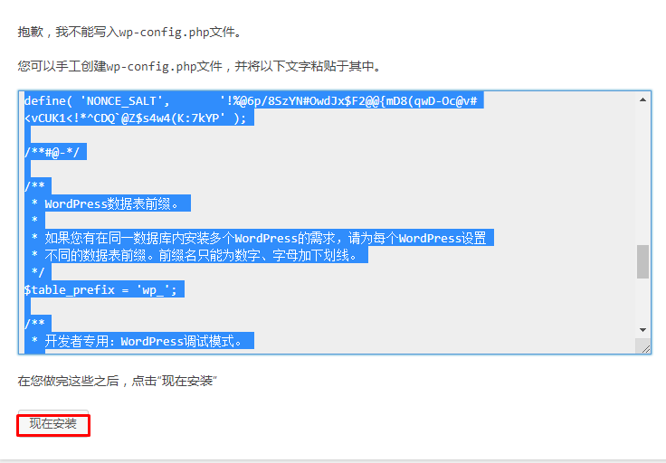

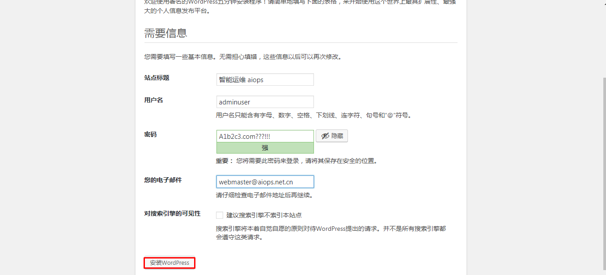

## 12.5 应用验证

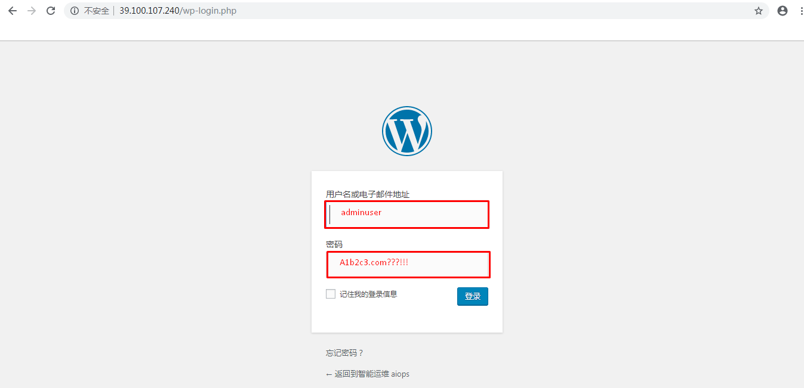

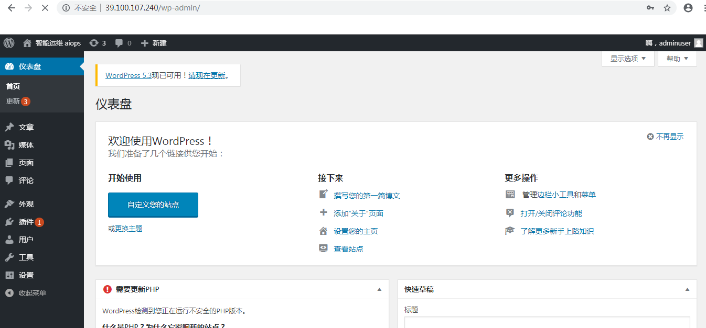

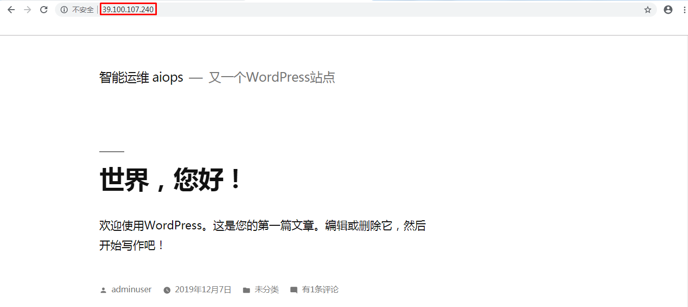

