# 学习目标

- [ ] 能够说出docker容器和虚拟机的主要区别

- [ ] 能够说出docker用到的内核技术

- [ ] 能够安装docker

- [ ] 掌握镜像的常见操作

- [ ] 掌握镜像仓库的搭建与使用

- [ ] 掌握常见的容器操作命令

- [ ] 能够查找docker存储驱动

- [ ] 能够说出写时复制技术的特点

- [ ] 能够说出overlay2联合文件系统的特点

- [ ] 能够使用docker跑httpd等基础应用

- [ ] 能够使用dockerfile构建容器镜像

- [ ] 能够通过link连接容器

- [ ] 能够说出docker本地网络的4种类型

- [ ] 能够通过flannel网络实现容器互联

  


# PAAS介绍

做云的优势: 提高资源利用率,将资源打包做成服务给用户使用,资源提供商极少需要与用户交互打交道。


CaaS 容器即服务就是PAAS的一种实现

由于hypervisor虚拟化技术仍然存在一些性能和资源使用效率方面的问题，因此出现了一种称为容器技术（Container）的新型虚拟化技术来帮助解决这些问题。


容器: 是PAAS的一种实现,相对于虚拟机来说有更好的性能，更高的资源利用率。


大型机-小型机-PC服务器-虚拟化-云计算-容器


# 一、认识容器技术

在生活中，瓶子，罐子，盆，试管，缸等都是用来装东西的容器。


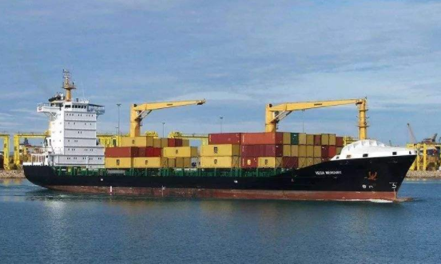

在集装箱没有被使用以前，海上运输货物效率不高（货物大小与形状不一)。有了集装箱后，货物可以统一规格来存放与运输了，极大地提高了效率。

在IT技术中:

虚拟化技术可以在宿主机上安装多个不同的操作系统，运行多套不同的应用。但可能就是为了运行一个nginx,却还要在虚拟机里运行一个完整的操作系统,内核和其它无关程序，这种做法资源利用不高。

**所以我们希望更多的关注应用程序本身,而不再分精力去关注操作系统与无关程序,操作系统内核直接与宿主机共享** 


linux容器技术是一种**==轻量级==**的虚拟化技术。主要特点有:

1. 轻量:只打包了需要的bins/libs(也就是命令和库文件)。与宿主机共享操作系统,直接使用宿主机的内核.
2. 部署快: 容器的镜像相对虚拟机的镜像小。部署速度非常快，秒级部署
3. 移植性好: Build once,Run anywhere(一次构建,随处部署运行)。  build,ship,run
4. 资源利用率更高: 相对于虚拟机，不需要安装操作系统，所以几乎没有额外的CPU,内存消耗


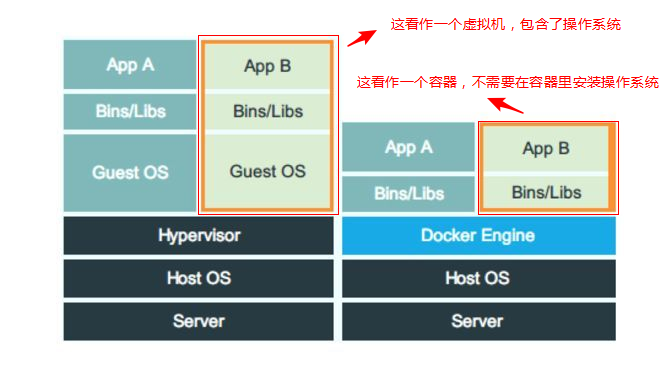

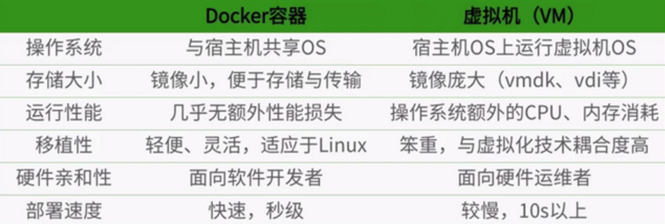


# 二、docker介绍

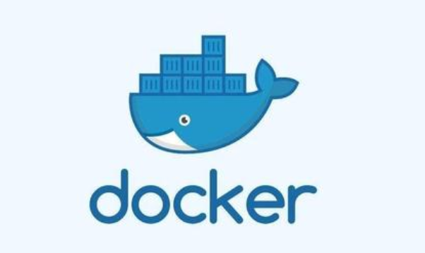


docker就是目前最火热的能实现容器技术的软件,使用go(golang)语言开发。

参考:https://www.docker.com/


## Docker版本

**2017之前版本**

1.7 ,1.8,1.9,1.10,1.11,1.12, 1.13

**2017年的3月1号之后**，Docker的版本命名开始发生变化，同时将CE版本和EE版本进行分开。

Docker社区版（CE）：为了开发人员或小团队创建基于容器的应用,与团队成员分享和自动化的开发管道。docker-ce提供了简单的安装和快速的安装，以便可以立即开始开发。docker-ce集成和优化，基础设施。 

- 17-03-ce
- 17-06-ce
- 18-03-ce
- 18-06-ce
- 18-09-ce

Docker企业版（EE）：专为企业的发展和IT团队建立。docker-ee为企业提供最安全的容器平台，以应用为中心的平台。


## docker用到的内核技术

docker容器本质上是宿主机的**==进程==**. 可以把docker容器内部跑的进程看作是宿主机的线程。

Docker通过==namespace实现了资源隔离==

通过==cgroups实现了资源限制==


### NameSpace

Linux内核实现namespace的一个主要目的就是实现轻量级虚拟化(容器)服务。在同一个namespace下的进程可以感知彼此的变化，而对外界的进程一无所知。

Linux 在很早的版本中就实现了部分的 namespace,比如内核 2.4 就实现了mount namespace。

大多数的namespace支持是在内核 2.6 中完成的，比如 IPC、Network、PID、和 UTS。还有个别的namespace 比较特殊，比如User，从内核 2.6 就开始实现了，但在内核 3.8 中才宣布完成。

同时，随着 Linux 自身的发展以及容器技术持续发展带来的需求，也会有新的 namespace 被支持，比如在内核 4.6 中就添加了Cgroup namespace。

inux内核提拱了6种namespace隔离的系统调用

| namespace | 系统调用参数  | 隔离内容                            |
| --------- | ------------- | ----------------------------------- |
| UTS       | CLONE_NEWUTS  | 主机名或域名                        |
| IPC       | CLONE_NEWIPC  | 信号量、消息队列和共享内存          |
| PID       | CLONE_NEWPID  | 进程编号                            |
| net       | CLONE_NEWNET  | 网络设备接口,IP路由表、防火墙规则等 |
| mount     | CLONE_NEWNS   | 挂载点(文件系统)                    |
| user      | CLONE_NEWUSER | 用户和用户组                        |

UTS: 	    每个NameSpace都拥有独立的主机名或域名，可以把每个NameSpace认为一个独立主机。

IPC: 	     每个容器依旧使用linux内核中进程交互的方法，实现进程间通信

PID:	      每个容器都拥有独立的进程树，而容器是物理机中的一个进程，所以容器中的进程是物理机的线程

Net:	     每个容器的网络是隔离

Mount:	每个容器的文件系统是独立的

User:	   每个容器的用户和组ID是隔离，每个容器都拥有root用户


小结: 应用程序运行在一个隔离的空间(namespace)内, 每个隔离的空间都拥有独立的UTS,IPC,PID,Net,Mount,User.


### Control Group

控制组（CGroups）是Linux内核的一个特性，**主要用来对共享资源进行隔离、限制、审计等**。

只有能控制分配到容器的资源，才能避免多个容器同时运行时对宿主机系统的资源竞争。

控制组可以提供对容器的内存、CPU、磁盘IO等资源进行限制和计费管理。


案例可参考优化课程文档


### LXC与docker区别

LXC为Linux Container的简写。可以提供轻量级的虚拟化.

Docker的底层就是使用了LXC来实现的. docker以LXC为基础，实现了更多更强的功能。


前面内容小结:

* 容器属于操作系统虚拟化,属于Paas
* 容器可看作是一种轻量级，进程级的虚拟机
* 相比于KVM虚拟机的优势
  * 不需要安装OS，和宿主机共享
  * 镜像存储空间小
  * 启动速度快(容器为秒级,虚拟机一般需要10秒左右)
  * 移植性更好,更轻便
  * 性能更好
* docker是一个实现容器的软件，底层使用LXC
* docker主要使用namespace命名空间技术实现资源隔离,使用cgroup实现资源限制


# 三、docker环境准备

建议直接在宿主机上跑docker（当然也可以在虚拟机里跑docker)

不能直接在windows上跑docker(因为namespace,cgroup是linux内核的特性,windows没有,所以需要在windows跑linux虚拟机,再跑docker)

1. 要求能访问公网
2. 关闭防火墙,selinux


## docker软件安装

**docker-ce的yum源下载(任选其一)**

* 下载docker官方ce版

~~~powershell
[root@daniel ~]# wget https://download.docker.com/linux/centos/docker-ce.repo -O /etc/yum.repos.d/docker-ce.repo
~~~

* 或者使用aliyun的docker-ce源

~~~powershell
[root@daniel ~]# wget https://mirrors.aliyun.com/docker-ce/linux/centos/docker-ce.repo -O /etc/yum.repos.d/docker-ce.repo
~~~


**docker安装**

~~~powershell
[root@daniel ~]# yum clean all
[root@daniel ~]# yum install docker-ce -y
~~~

PS: 注意要安装docker-ce版,不要安装docker(否则可能安装1.13老版本)

**启动服务**

~~~powershell
[root@daniel ~]# systemctl start docker
[root@daniel ~]# systemctl enable docker
[root@daniel ~]# systemctl status docker
~~~

**查看版本信息**

~~~powershell
[root@daniel ~]# docker -v
Docker version 18.09.7, build 2d0083d
[root@daniel ~]# docker info
~~~

~~~powershell
[root@daniel ~]# docker version
Client:
 Version:           18.09.7
 API version:       1.39
 Go version:        go1.10.8
 Git commit:        2d0083d
 Built:             Thu Jun 27 17:56:06 2019
 OS/Arch:           linux/amd64
 Experimental:      false

Server: Docker Engine - Community
 Engine:
  Version:          18.09.7
  API version:      1.39 (minimum version 1.12)
  Go version:       go1.10.8
  Git commit:       2d0083d
  Built:            Thu Jun 27 17:26:28 2019
  OS/Arch:          linux/amd64
  Experimental:     false
~~~


## docker daemon管理

可以将client与Server进行分离,实现**远程docker连接**。为了实现它, 就需要对docker daemon进行相应的配置。

~~~powershell
远程客户端主机# docker -H 容器宿主机IP version
Client:
 Version:           18.09.7
 API version:       1.39
 Go version:        go1.10.8
 Git commit:        2d0083d
 Built:             Thu Jun 27 17:56:06 2019
 OS/Arch:           linux/amd64
 Experimental:      false
Cannot connect to the Docker daemon at tcp://10.1.1.11:2375. Is the docker daemon running?

~~~


**配置过程**

1, 修改docker配置文件前，请先关闭docker守护进程

~~~ powershell
[root@daniel ~]# systemctl stop docker
~~~


2, 通过/etc/docker/daemon.json文件对docker守护进程文件进行配置

```powershell
[root@daniel ~]# vim /etc/docker/daemon.json
{
	"hosts": ["tcp://0.0.0.0:2375","unix:///var/run/docker.sock"]
}
[root@daniel ~]# netstat -ntlup | grep :2375
[root@daniel ~]# ls /var/run/docker.sock
```

PS: docker daemon默认侦听使用的是unix格式，侦听文件：UNIX:///run/docker.sock,添加tcp：//0.0.0.0:2375可实现远程管理。


3, 添加/etc/docker/daemon.json后会导致docker daemon无法启动, 请先修改如下文件内容：

~~~powershell
修改前：
[root@daniel ~]# vim /usr/lib/systemd/system/docker.service
[Service]
Type=notify
# the default is not to use systemd for cgroups because the delegate issues still
# exists and systemd currently does not support the cgroup feature set required
# for containers run by docker
ExecStart=/usr/bin/dockerd -H fd:// --containerd=/run/containerd/containerd.sock


修改后：
[root@daniel ~]# vim /usr/lib/systemd/system/docker.service
[Service]
Type=notify
# the default is not to use systemd for cgroups because the delegate issues still
# exists and systemd currently does not support the cgroup feature set required
# for containers run by docker
ExecStart=/usr/bin/dockerd
~~~

4, 修改完成后，一定要加载此配置文件

~~~powershell
[root@daniel ~]# systemctl daemon-reload
~~~

5, 重新开启docker守护进程

~~~powershell
[root@daniel ~]# systemctl start docker
[root@daniel ~]# netstat -ntlup | grep :2375
tcp6       0      0 :::2375                 :::*                    LISTEN      3318/dockerd
~~~

6, 实例远程连接方法

~~~powershell
远程客户端主机# docker -H 容器宿主机IP version
~~~

注意: 客户端远程连接不需要加端口号

**==特别注意: 远程客户端主机远程操作的权限非常大,请测试完后还原==**


**小结:**  docker engine分为client和server,默认都在本地 


# 四、镜像,容器,仓库

镜像(image):  镜像就是打包好的环境与应用。

容器(contanier):  容器就是运行镜像的实例.    镜像看作是静态的,容器是动态的。

仓库(repository):  存放多个镜像的一个仓库。


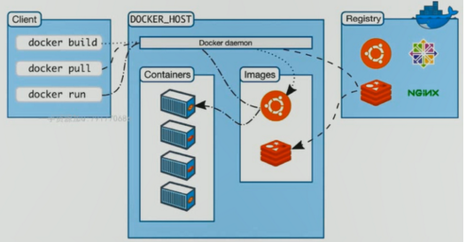

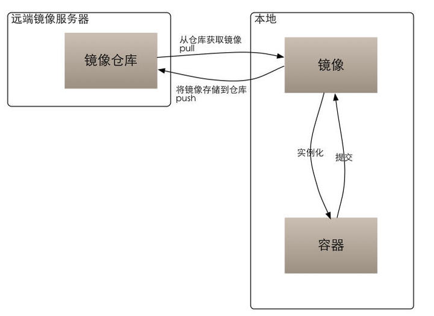


# 五、镜像常见操作

镜像主要分为两类:

1. 操作系统类(如centos,ubuntu)
2. 应用程序类

## 查看镜像列表

通过docker images命令查看当前镜像列表; 使用man docker-images得到参数说明

~~~powershell
[root@daniel ~]# docker images
~~~

## 搜索镜像

通过docker search查找官方镜像; 使用man docker-search得到参数说明

~~~powershell
[root@daniel ~]# docker search centos
~~~

## 拉取镜像

通过docker pull拉取(下载)镜像; 使用man docker-pull得到参数说明

~~~powershell
此镜像大概200多M，网速要好
[root@daniel ~]# docker pull centos
或
[root@daniel ~]# docker pull docker.io/centos    名字为search查找时得到的全名

如果网速慢,可以试试阿里,腾讯,百度,网易等国内的镜像仓库，比如:
[root@daniel ~]# docker pull hub.c.163.com/library/centos:latest
~~~

~~~powershell
[root@daniel ~]# docker images
REPOSITORY                    TAG            IMAGE ID        CREATED          SIZE
docker.io/centos              latest         1e1148e4cc2c    13 days ago      202 MB
hub.c.163.com/library/centos  latest         328edcd84f1b    16 months ago    193 MB
~~~

## 删除镜像

通过docker rmi删除镜像; man docker-rmi查看参数帮助

~~~powershell
[root@daniel ~]# docker rmi hub.c.163.com/library/centos:latest
~~~


**问题:如果镜像pull非常慢,怎么解决?**

1. docker镜像加速器
2. 可以从网速好的宿主机上pull下来,然后**导出**给网速慢的宿主机**导入**


## 镜像加速器

国内的几个互联网巨头都有自己的容器服务。这里以阿里云为例


阿里云容器镜像服务地址:https://cr.console.aliyun.com/cn-hangzhou/new    申请一个阿里账号登录


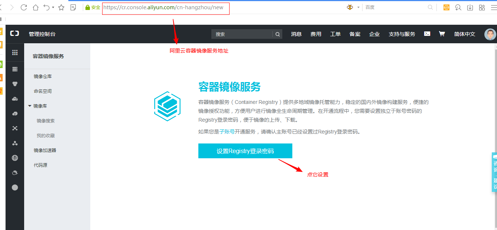

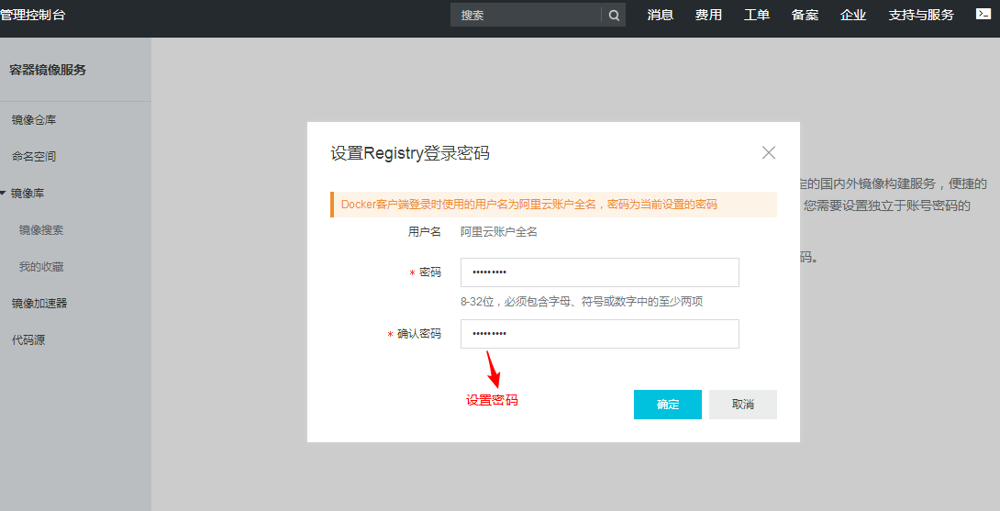

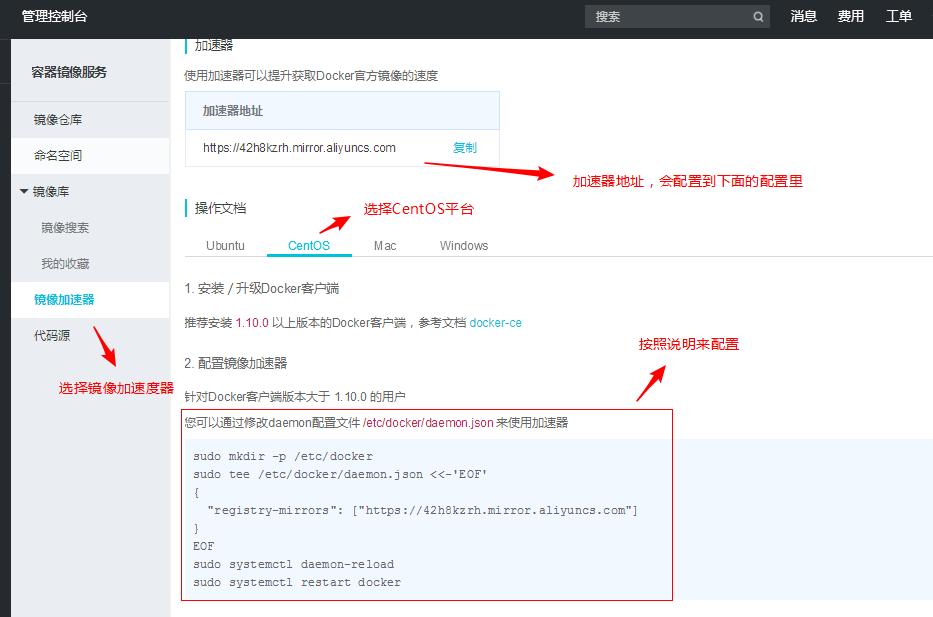

~~~powershell
[root@daniel ~]# vim /etc/docker/daemon.json
{
	"registry-mirrors": ["https://42h8kzrh.mirror.aliyuncs.com"]
}
[root@daniel ~]# systemctl daemon-reload
[root@daniel ~]# systemctl restart docker
~~~


## 镜像导出

使用docker save保存(导出)镜像为一个tar文件

~~~powershell
[root@daniel ~]# docker save centos -o /root/dockerimage_centos.latest
~~~

## 镜像导入

使用docker load导入

测试时可以将导出的文件scp传输到另一台宿主机测试。或者先删除本地的镜像再导入测试

~~~powershell
[root@daniel ~]# docker load < /root/dockerimage_centos.latest
~~~


如果导入后看不到名称,可以使用`docker tag`命令改名称 

~~~powershell
[root@daniel ~]# docker images
REPOSITORY          TAG                 IMAGE ID            CREATED           SIZE
<none>              <none>              9f38484d220f        3 months ago      202 MB

[root@daniel ~]# docker tag 9f38484d220f docker.io/centos:latest

[root@daniel ~]# docker images
REPOSITORY          TAG                 IMAGE ID            CREATED          SIZE
docker.io/centos    latest              9f38484d220f        3 months ago      202 MB
~~~


# 六、镜像仓库

## 官方自建镜像仓库

docker hub为最大的公开仓库,也就是官方仓库: https://hub.docker.com/

1, 没有账号的先上网申请账号

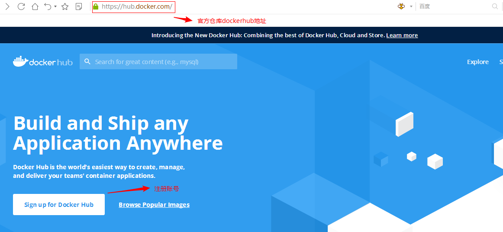

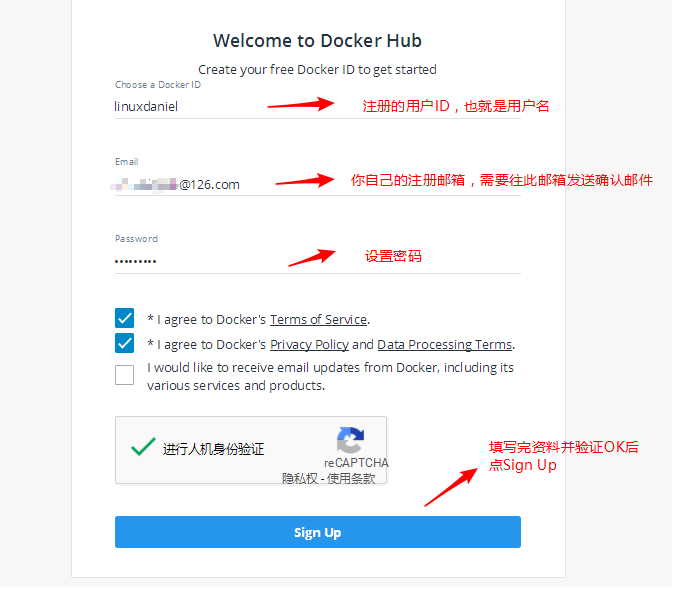

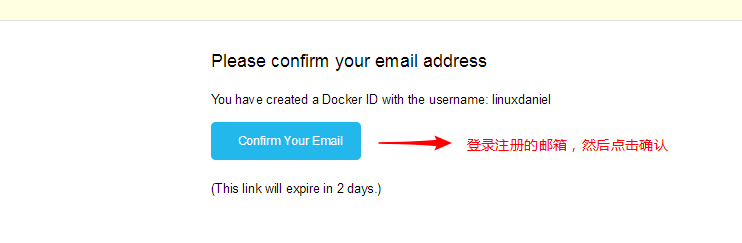

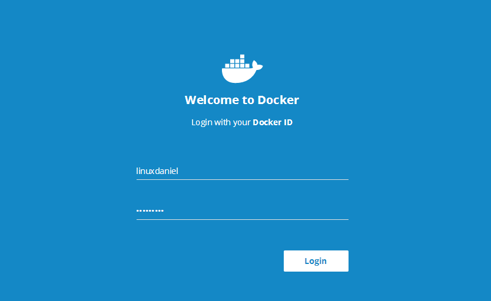

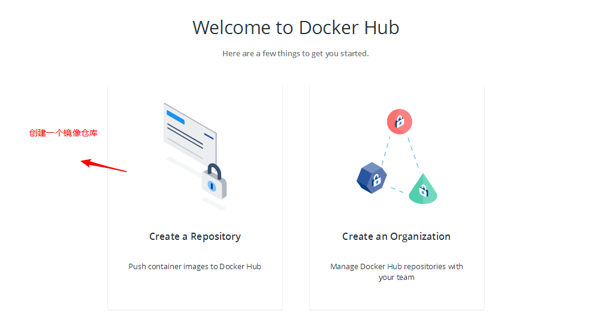

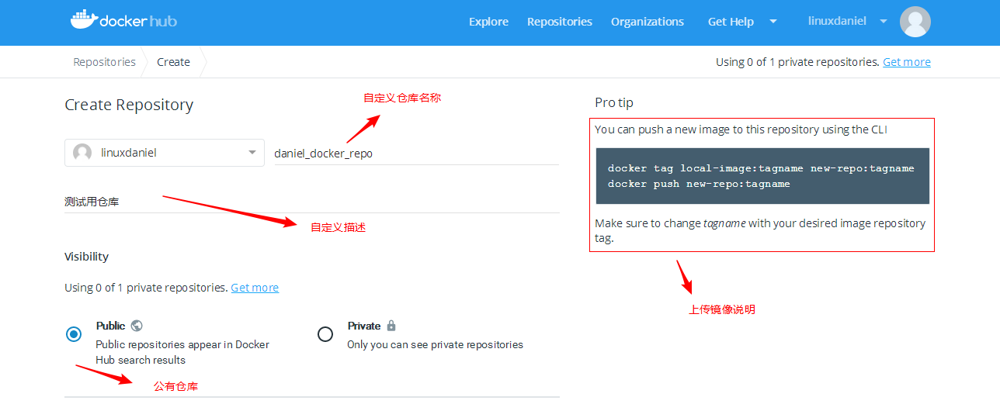

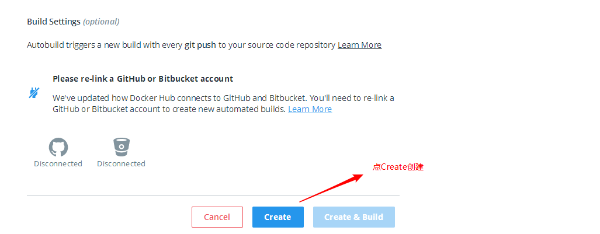

2, 回到宿主机登录账号与密码


~~~powershell
# docker login
Login with your Docker ID to push and pull images from Docker Hub. If you don't have a Docker ID, head over to https://hub.docker.com to create one.
Username: linuxdaniel
Password: 
Login Succeeded
~~~

3, tag你的镜像

我们从dockerhub上下载的公开镜像是不能直接上传的，要先tag(打标签,**类似于重新指定路径并命名**)

~~~powershell
[root@daniel ~]# docker push centos:latest
Error response from daemon: You cannot push a "root" repository. Please rename your repository to docker.io/<user>/<repo> (ex: docker.io/<user>/centos)

[root@daniel ~]# docker tag centos:latest linuxdaniel/daniel_docker_repo:V1
[root@daniel ~]# docker push linuxdaniel/daniel_docker_repo:V1
~~~

4, push镜像到仓库

~~~powershell
[root@daniel ~]# docker push linuxdaniel/daniel_docker_repo:V1
~~~

5, 验证


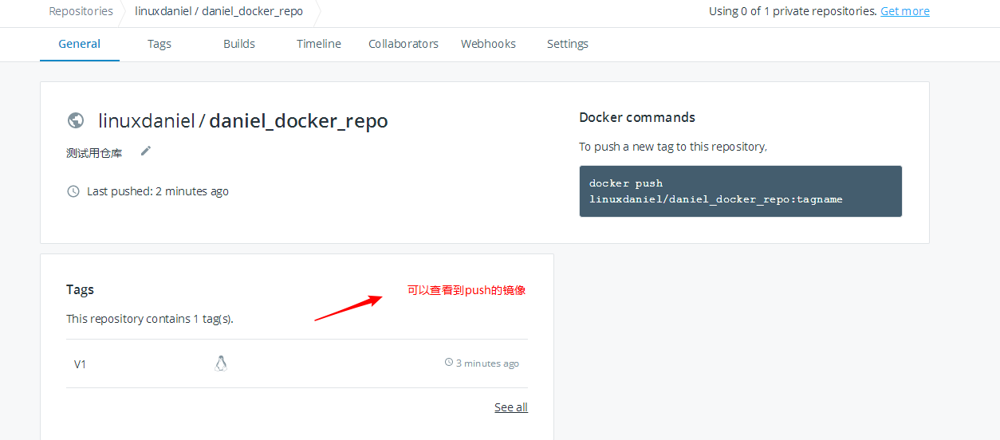

6, 登出账号

~~~powershell
[root@daniel ~]# docker logout
Removing login credentials for https://index.docker.io/v1/
~~~

## 阿里云镜像仓库

登录阿里云账号，主页面上找产品-->云计算基础--> 容器镜像服务-->然后使用账号登录

登录成功后,做下列操作

1, 创建命名空间(命令空间和镜像仓库名称合到一起组成镜像的路径名称)

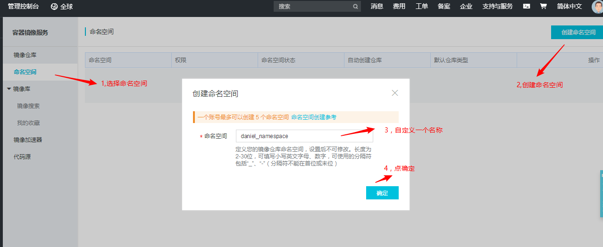

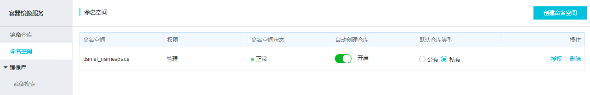

2, 创建镜像仓库,指定仓库名称


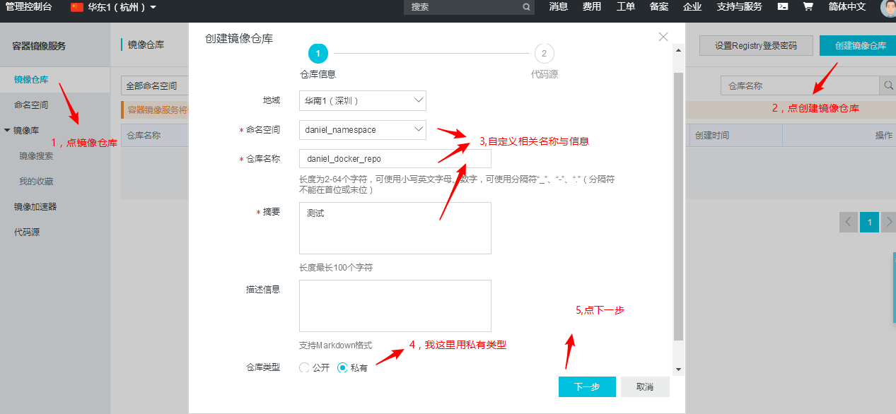

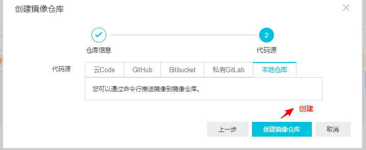

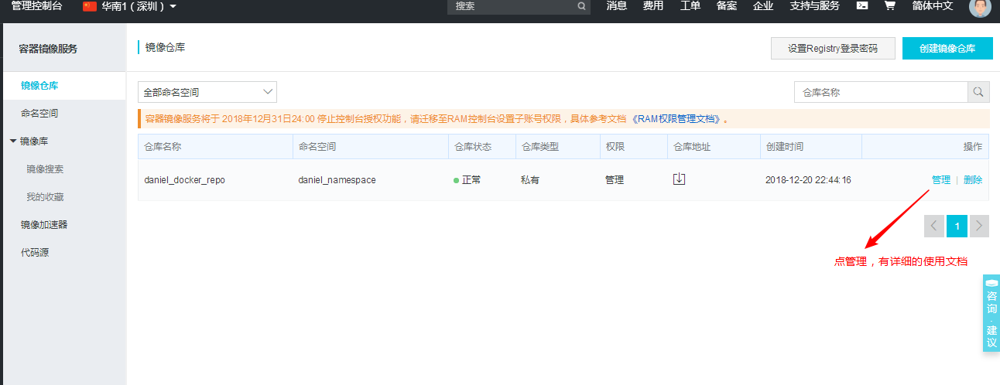


登出方法

~~~powershell
使用docker logout接地址
# docker logout registry.cn-shenzhen.aliyuncs.com
~~~


## harbor私有镜像仓库

Harbor是VMware公司开源了企业级Registry项目, 可以帮助用户快速搭建一个企业级的Docker registry服务.

harbor由python语言开发, 需要使用`docker-compose`工具进行启动

说明: docker-compose是容器编排工具,会在后面的docker三剑客中讲解


### **环境准备**

再准备一台新的虚拟机(192.168.122.18)做harbor服务器

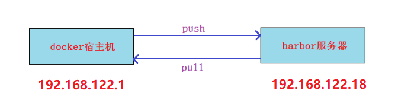

### 安装过程

**1, 安装docker-compose**

==以下3种方法任选其一==

安装方法1:

因为centos7上默认安装了python2.7,我们这里安装python2-pip,然后通过pip安装docker-compose模块

~~~powershell
[root@harbor ~]# yum install epel-release -y
[root@harbor ~]# yum install python2-pip -y
[root@harbor ~]# pip install -i https://pypi.tuna.tsinghua.edu.cn/simple docker-compose
指定清华源安装速度较快

[root@harbor ~]# docker-compose -v
docker-compose version 1.24.1, build 4667896b
~~~
安装方法2:

~~~powershell
[root@harbor ~]# curl -L https://get.daocloud.io/docker/compose/releases/download/1.24.1/docker-compose-`uname -s`-`uname -m` > /usr/local/bin/docker-compose
[root@harbor ~]# chmod +x /usr/local/bin/docker-compose
~~~


安装方法3:

~~~powershell
[root@harbor ~]# yum install epel-release
[root@harbor ~]# yum install docker-compose
注意:此安装方法安装的版本较低,如果harbor版本太新，可能会不兼容
~~~


**2, 在harbor服务器上安装docker-ce并启动docker服务**


~~~powershell
[root@harbor ~]# wget https://mirrors.aliyun.com/docker-ce/linux/centos/docker-ce.repo -O /etc/yum.repos.d/docker-ce.repo
[root@harbor ~]# yum install docker-ce

[root@harbor ~]# systemctl start docker 
[root@harbor ~]# systemctl enable docker
~~~


**3,  安装harbor**

harbor分为离线包和在线包两种。在线包较小，但需要连网下载。我这里使用离线包

下载地址: https://github.com/goharbor/harbor/releases

我这里提供了**harbor-offline-installer-v1.8.2.tgz**给大家拷贝到harbor服务器上

~~~powershell
[root@harbor ~]# tar xf harbor-offline-installer-v1.8.2.tgz -C /usr/local/
[root@harbor ~]# cd /usr/local/harbor/
[root@harbor ~]# vim harbor.yml
5 hostname: 192.168.122.18					将hostname改成harbor服务器的IP
27 harbor_admin_password: 123				admin用户的默认密码，我这里改为简单的123

[root@harbor harbor]# ./install.sh
......
......
......
✔ ----Harbor has been installed and started successfully.----

Now you should be able to visit the admin portal at http://192.168.122.18.
For more details, please visit https://github.com/goharbor/harbor .
~~~

**4,浏览器访问 http://192.168.122.18,登录进行配置**

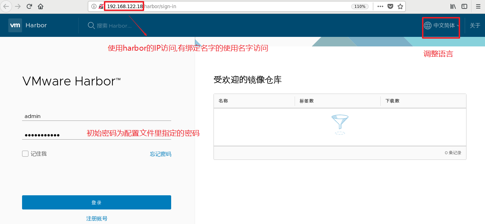

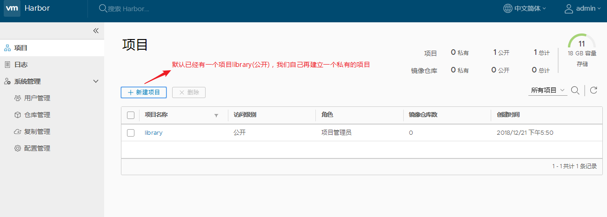


公开项目: 下载镜像不需要docker login登录，但上传镜像还是需要docker login登录

私有项目: 都需要docker login登录才以上传下载

### 镜像上传下载操作

**5, 在docker宿主机配置非https连接**

因为docker用https通讯,所以还需要做证书,太麻烦。

配置**"insecure-registries": ["harbor服务器IP"]**来使用http通讯


~~~powershell
[root@daniel ~]# vim /etc/docker/daemon.json
{
	"registry-mirrors": ["https://42h8kzrh.mirror.aliyuncs.com"],     这里有一个逗号
	"insecure-registries": ["192.168.122.18"]
}
[root@daniel ~]# systemctl restart docker
~~~

**6, 在docker宿主机登下载一个测试镜像,并tag成**  **harborIP/项目名/镜像名:TAG**

~~~powershell
[root@daniel ~]# docker pull hello-world
[root@daniel ~]# docker tag hello-world 192.168.122.18/test/hello-world:v1
~~~

**7, 登陆服务器,并push上传镜像**

~~~powershell
[root@daniel ~]# docker login 192.168.122.18
Username: admin
Password: 					密码为前面修改好的123
Login Succeeded

[root@daniel ~]# docker push 192.168.122.18/test/hello-world:v1

不用了可以logout
[root@daniel ~]# docker logout 192.168.122.18
~~~

**8, 浏览器界面验证**

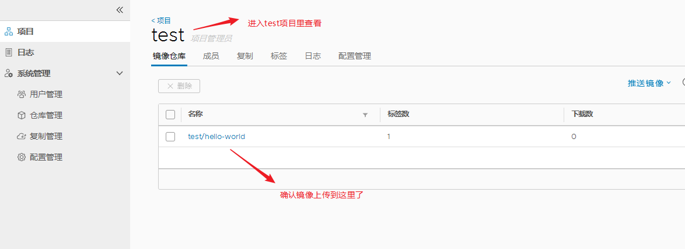

**9, docker宿主机想要pull上传的镜像,可以这样做**

~~~powershell
删除镜像再重新从harbor仓库上下载
[root@daniel ~]# docker rmi 192.168.122.18/test/hello-world:v1

私有项目里的镜像需要先登录,再pull(公共项目里的镜像不用登录就可以直接pull,请自行测试)
[root@daniel ~]# docker login 192.168.122.18
Username: admin
Password: 					密码为前面设置的123
Login Succeeded

[root@daniel ~]# docker pull 192.168.122.18/test/hello-world:v1
~~~


小结: 远程仓库

* 官方仓库  缺点:网络问题
* 国内云运营商提供的镜像仓库   优点:网速较好  缺点: 安全性考虑

* 自建仓库  优点: 网速好,安全性也好  缺点: 自己维护,需要服务器和存储成本


# 七、容器常见操作

## 查看容器列表

列表所有状态的容器,现在为空列表
使用man docker-ps得到参数说明

~~~powershell
[root@daniel ~]# docker ps -a
~~~
## 运行第一个容器

通过hello-world这个镜像,运行一个容器(没有定义容器名称,则为随机名称)

* 当前docker-host(容器宿主机)如果有hello-world这个镜像,则直接使用
* 如果没有相关镜像,则会从docker hub去下载(配置了镜像加速器的优先找加速器)

使用man docker-run得到参数说明

~~~powershell
[root@daniel ~]# docker run hello-world
~~~

再次查看容器列表,多了一个容器,但它的状态是exited，此容器就是运行了一句Hello from Docker!就退出了(我这里容器名随机为silly_lovelace)

~~~powershell
[root@daniel ~]# docker ps -a
CONTAINER ID        IMAGE               COMMAND             CREATED             STATUS                     PORTS               NAMES
6e3f991b9e8a        hello-world         "/hello"            3 minutes ago       Exited (0) 2 minutes ago                       silly_lovelace

上面列表格式比较长，看起来有些不舒服。可以简单处理下,只查看重要的几列
[root@daniel ~]# docker ps -a |awk -F"[  ]{2}*" '{print $1"\t\t"$3"\t\t"$5"\t"$NF}'
CONTAINER ID		 COMMAND			 	STATUS						NAMES
6e3f991b9e8a		 "/hello"			 	Exited (0) 3 minutes ago	silly_lovelace
~~~

问题: 为什么容器运行完hello-world后就退出了,而不是继续运行?

我们前面把容器比喻为轻量级虚拟机,但是容器实际上只是**==进程==**。进行运行完了当然就退出了, 除非是类似服务那样的守护进程。


## 容器运行命令或脚本

指定使用docker.io/centos镜像运行"echo haha"命令
latest是默认的TAG标签,可以省略;如果是其它TAG就不能省略，否则会默认为latest

~~~powershell
[root@daniel ~]# docker run centos:latest echo haha
haha
~~~

docker运行一个不间断的脚本, -d表示后台运行(后台运行表示不输出结果到屏幕)

~~~powershell
[root@daniel ~]# docker run -d centos /bin/bash -c "while true; do echo haha;sleep 3;done"
~~~

查看刚才运行的容器

~~~powershell
只有不间断运行脚本的容器还在UP状态，其它都为Exited状态
[root@daniel ~]# docker ps -a |awk -F"[  ]{2}*" '{print $1"\t\t"$3"\t\t"$5"\t"$NF}'
CONTAINER ID	COMMAND			 		STATUS					   NAMES
21086dab3efa	"/bin/bash -c 'whi..."	Up 1 minutes			   sleepy_ride
495310e96d9f	"echo haha"			 Exited (0) 3 minutes ago	 unruffled_jepsen
6e3f991b9e8a	"/hello"			 Exited (0) 15 minutes ago    silly_lovelace
~~~


## 查看容器运行结果

~~~powershell
后面接容器ID,也可以接容器名称
[root@daniel ~]# docker logs 21086dab3efa
~~~

## 停止容器

~~~powershell
[root@daniel ~]# docker stop 21086dab3efa
~~~

## 启动容器

~~~powershell
[root@daniel ~]# docker start 21086dab3efa
~~~

## 查看容器的相关信息

~~~powershell
[root@daniel ~]# docker inspect 21086dab3efa
~~~


## 运行容器并交互式操作

~~~powershell
使用下面命令启动容器;-i指交互;-t指tty终端;--name是用来指定容器名称
[root@daniel ~]# docker run -i -t --name=c1 centos:latest /bin/bash
[root@f736fe36002c /]# cat /etc/redhat-release 
CentOS Linux release 7.6.1810 (Core) 					可以看到我们下载的centos是7.6版本
[root@f736fe36002c /]# uname -r
3.10.0-862.el7.x86_64				查看的内核却与宿主机centos7.5一样,说明是共享宿主机的内核

在容器内操作(我这里创建一个文件，然后退出)
[root@f736fe36002c /]# touch /root/daniel
[root@f736fe36002c /]# exit
exit
~~~

**实验: 交互式操作退出后如何再查看或修改先前在容器里创建的文件?**

~~~powershell
不要再使用下面的命令了，因为名称冲突，会报错（换一个名称会启动一个新的容器)
[root@daniel ~]# docker run -i -t --name=c1 centos:latest /bin/bash
~~~

1，使用下面命令查看到c1容器已经为Exited状态;-l表示列表最近的容器

~~~powershell
[root@daniel ~]# docker ps -l
CONTAINER ID        IMAGE                     COMMAND                  CREATED             STATUS                      PORTS               NAMES
f736fe36002c        centos:latest             "/bin/bash"              2 minutes ago      Exited (0) 1 minutes ago                       c1
~~~

2，启动容器

~~~powershell
[root@daniel ~]# docker start c1
~~~

3，然后使用attach指令连接UP状态的容器（Exited状态的容器无法attach)

~~~powershell
[root@daniel ~]# docker attach c1
~~~

4，验证文件,可以按需求修改

~~~powershell
[root@f736fe36002c /]# ls /root/daniel -l
-rw-r--r-- 1 root root 0 Dec 19 12:30 /root/daniel
[root@f736fe36002c /]# exit
exit
~~~

5, commit提交成一个新的镜像;c63d63bff173为容器ID;test_image为新的镜像名称

~~~powershell
[root@daniel ~]# docker commit c63d63bff173 test_image
sha256:bfb4e268cc6b683e1fc19346daf446ddd85dc7d75bcaa5cfd80978ac271a913f
~~~

6，验证新的镜像

~~~powershell
[root@daniel ~]# docker images |grep test_image
test_image         latest          bfb4e268cc6b        47 seconds ago     202 MB
~~~


## 容器外指定容器运行命令

可以在宿主机通过exec指令传命令到容器中执行，但要求容器为UP状态

~~~powershell
[root@daniel ~]# docker start c1

在container1容器里创建文件并验证;man docker-exec查看帮助
[root@daniel ~]# docker exec c1 touch /root/123
[root@daniel ~]# docker exec c1 ls -l /root/123

或者用下面的命令连接上去交互式操作
[root@daniel ~]# docker exec -it c1 /bin/bash
~~~


## 删除容器

UP状态的容器要先停止才能删除

~~~powershell
[root@daniel ~]# docker stop 21086dab3efa
[root@daniel ~]# docker rm 21086dab3efa
~~~

批量删除所有容器

~~~powershell
加-q参数只查看所有容器的ID
[root@daniel ~]# docker ps -aq
f736fe36002c
21086dab3efa
495310e96d9f
6e3f991b9e8a
停止所有容器
[root@daniel ~]# docker stop $(docker ps -aq)
删除所有容器
[root@daniel ~]# docker rm $(docker ps -aq)
~~~


小结: 

* docker ps   -a : 列出本地的所有容器信息
* docker run 参数选项 --name 容器名 镜像名:TAG  传给容器内部执行的命令
* docker logs 容器名或容器ID:  输出容器内执行命令的结果
* docker stop 容器名或容器ID: 停止容器
* docker start 容器名或容器ID: 启动容器
* docker attach 容器名或容器ID: 连接一个UP状态的容器,可以进去交互(有bash环境的才可以)
* docker exec 容器名或容器ID  命令:   不用连接容器,可以外部传命令给容器内部操作
* docker exec -it 容器名或容器ID /bin/bash   连接容器交互
* docker inspect 容器名或容器ID: 查看容器的属性
* docker rm 容器名或容器ID: 删除容器
* docker commit 容器名或容器ID 新的镜像名:TAG          将容器提交为一个镜像


**==需要记忆的核心命令==:**

* docker ps -a
* docker run （**重难点**)
* docker start  ;  docker stop;
* docker commit
* docker exec;  docker exec -it 容器名或容器ID /bin/bash
* docker rm


# 八、docker存储驱动

## 写时复制与用时分配

通过上面的学习,我们知道了一个镜像可以跑多个容器,如果每个容器都去复制一份镜像内的文件系统,那么将会占用大量的存储空间。docker使用了**==写时复制cow(copy-on-write)==**和**==用时分配(allocate-on-demand)==**技术来**==提高存储的利用率==**。

**写时复制**: 

* 写时复制技术可以让多个容器共享同一个镜像的文件系统, 所有数据都从镜像中读取

* 只有当要对文件进行写操作时，才从镜像里把要写的文件复制到自己的文件系统进行修改。所以无论有多少个容器共享同一个镜像，所做的写操作都是对从镜像中复制到自己的文件系统中的复本上进行，并不会修改镜像的源文件

* 多个容器操作同一个文件，会在每个容器的文件系统里生成一个复本，每个容器修改的都是自己的复本，相互隔离，相互不影响

**用时分配:**

启动一个容器，并不会为这个容器预分配一些磁盘空间，而是当有新文件写入时，才按需分配新空间


## 联合文件系统

联合文件系统(UnionFS)就是把不同物理位置的目录合并mount到同一个目录中.

比如你可以将一个光盘与一个硬盘上的目录联合挂载到一起,然后对只读的光盘文件进行修改,修改的文件不存放回光盘进行覆盖,而是存放到硬盘目录。这样做达到了不影响光盘原数据,而修改的目的。

**思考: 把光盘看作是docker里的image,而硬盘目录看作是container,你再想想看?**

docker就支持aufs和overlay两种联合文件系统。


## aufs

Docker最开始采用AUFS作为文件系统，也得益于AUFS分层的概念，实现了多个Container可以共享同一个image。


aufs(Another UnionFS)，后来叫Alternative UnionFS，后来可能觉得不够霸气，叫成Advance UnionFS.

Docker最开始采用AUFS作为文件系统，也得益于AUFS分层的概念，实现了多个Container可以共享同一个image

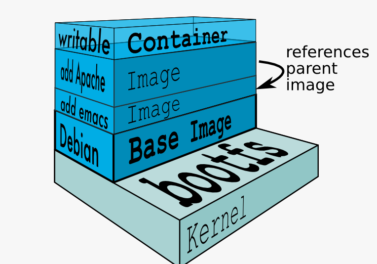

除了最上面的一层为读写层之外，下面的其他的层都是只读的镜像层.


## overlay

由于AUFS未并入Linux内核，且只支持Ubuntu，考虑到兼容性问题，在Docker 0.7版本中引入了存储驱动。 目前，Docker支持AUFS,OverlayFS,Btrfs,Device mapper,ZFS五种存储驱动.

目前, 在ubuntu发行版上默认存储方式为AUFS,CentOS发行版上的默认存储方式为Overlay或Overlay2

~~~powershell
# docker info |grep "Storage Driver"	
Storage Driver: overlay2
~~~

~~~powershell
# lsmod |egrep 'aufs|overlay'			
overlay                71964  7	
~~~

centos上加载了overlay模块,从3.18版本内核开始,就进入了Linux内核主线


Overlay是Linux内核3.18后支持的(当前3.10内核加载模块也可以使用),也是一种Union FS,和AUFS的多层不同的是Overlay只有两层：一个upper文件系统和一个lower文件系统，分别代表Docker的容器层和镜像层..

OverlayFS底层目录称为lowerdir,高层目录称为upperdir。合并统一视图称为merged。当需要修改一个文件时，使用cow将文件从只读的Lower复制到可写的Upper进行修改，结果也保存在Upper层。在Docker中，底下的只读层就是image，可写层就是Container

下图分层图，镜像层是lowdir，容器层是upperdir,统一的视图层是merged层. 

视图层就是给用户提供了一个统一的视角，隐藏了多个层的复杂性，对用户来说只存在一个文件系统。

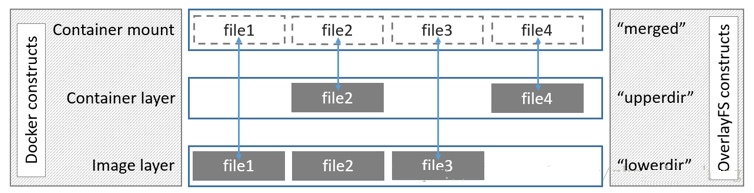


从上图中可以看到: 

* 如果upperdir和lowerdir有同名文件时会用upperdir的文件 

* 读文件的时候，文件不在upperdir则从lowerdir读

* 如果写的文件不在uppderdir在lowerdir,则从lowerdir里面copy到upperdir。

* 不管文件多大,copy完再写,删除镜像层的文件只是在容器层生成whiteout文件标志(标记为删除,并不是真的删除)  （后面的dockefile章节会体现出效果)

  


## aufs,overlay,overlay2对比

aufs: 使用多层分层

overlay: 使用2层分层, 共享数据方式是通过**硬连接**，只挂载一层,其他层通过最高层通过硬连接形式共享(**增加了磁盘inode的负担**)

overlay2: 使用2层分层, 驱动原生地支持多层lower overlay镜像(最多128层),与overlay驱动对比,消耗更少的inode


## 不同阶段观察存储情况

新准备一台VM实例,重新安装docker(安装过程参考前面章节),进行如下测试


### docker第1次启动前

在刚安装docker-ce第1次启动服务之前,/var/lib/下并没有docker这个目录

### docker启动后

而第1次`systemctl start docker`启动后,则会产生`/var/lib/docker`目录

~~~powershell
[root@vm2 ~]# systemctl start docker

[root@vm2 ~]# ls -l /var/lib/docker
total 0
drwx------ 2 root root 24 Jun 23 15:30 builder
drwx------ 4 root root 92 Jun 23 15:30 buildkit
drwx------ 2 root root  6 Jun 23 15:30 containers
drwx------ 3 root root 22 Jun 23 15:30 image
drwxr-x--- 3 root root 19 Jun 23 15:30 network
drwx------ 3 root root 40 Jun 23 15:39 overlay2
drwx------ 4 root root 32 Jun 23 15:30 plugins
drwx------ 2 root root  6 Jun 23 15:39 runtimes
drwx------ 2 root root  6 Jun 23 15:30 swarm
drwx------ 2 root root  6 Jun 23 15:41 tmp
drwx------ 2 root root  6 Jun 23 15:30 trust
drwx------ 2 root root 25 Jun 23 15:30 volumes
~~~

~~~powershell
[root@vm2 ~]# cd /var/lib/docker/overlay2/
[root@vm2 overlay2]# ls
total 0
brw------- 1 root root 8, 3 Jul 26 14:10 backingFsBlockDev
drwx------ 2 root root    6 Jul 26 14:10 l
~~~


### 下载镜像后

~~~powershell
[root@vm2 overlay2]# docker pull centos
Using default tag: latest
latest: Pulling from library/centos
8ba884070f61: Pull complete
Digest: sha256:a799dd8a2ded4a83484bbae769d97655392b3f86533ceb7dd96bbac929809f3c
Status: Downloaded newer image for centos:latest

~~~


~~~powershell
[root@vm2 overlay2]# pwd
/var/lib/docker/overlay2
[root@vm2 overlay2]# ls
23664d7a4167e74ee04838d87cd3568cc82be49f781bba2212b9bff942bb8fa4  backingFsBlockDev  l

[root@vm2 overlay2]# ls 23664d7a4167e74ee04838d87cd3568cc82be49f781bba2212b9bff942bb8fa4/
diff  link

[root@vm2 overlay2]# ls 23664d7a4167e74ee04838d87cd3568cc82be49f781bba2212b9bff942bb8fa4/diff/
anaconda-post.log  bin  dev  etc  home  lib  lib64  media  mnt  opt  proc  root  run  sbin  srv  sys  tmp  usr  var

[root@vm2 overlay2]# cat 23664d7a4167e74ee04838d87cd3568cc82be49f781bba2212b9bff942bb8fa4/link
5D7D6BY2V3FKMZHUU6VHK7ILWL

[root@vm2 overlay2]# ll l
total 0
lrwxrwxrwx 1 root root 72 Jul 26 14:16 5D7D6BY2V3FKMZHUU6VHK7ILWL -> ../23664d7a4167e74ee04838d87cd3568cc82be49f781bba2212b9bff942bb8fa4/diff
~~~

* 下载完镜像,overlay2目录里多了一个`23664....`这样的目录,只有1层
* 此目录内部的diff子目录记录每一层自己的数据
* link记录该层链接目录(和overlay目录下l子目录里记录的链接是一致的)
* l子目录中包含了很多软链接，使用短名称指向了其他层，短名称用于避免mount参数时达到页面大小的限制


### 运行容器后

~~~powershell
[root@vm2 overlay2]# docker run -i -t --name=c1 centos:latest /bin/bash
[root@9169c38e6424 /]
同时按ctrl+p+q三键退出,保持容器为UP状态
~~~

~~~powershell
[root@vm2 overlay2]# docker ps -a
CONTAINER ID     IMAGE      COMMAND     CREATED         STATUS        PORTS        NAMES
9169c38e6424  centos:latest  "/bin/bash"  12 seconds ago  Up 10 seconds           c1
~~~

容器运行后,再次查看overlay2目录下的情况 

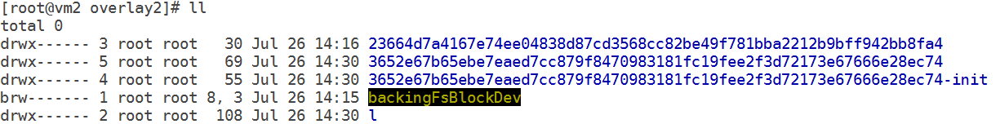


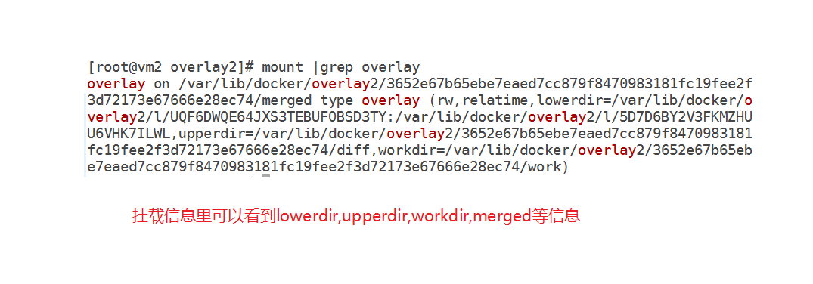

~~~powershell
[root@vm2 overlay2]# ll 3652e67b65ebe7eaed7cc879f8470983181fc19fee2f3d72173e67666e28ec74/
total 8
drwxr-xr-x 2 root root  6 Jul 26 14:30 diff
-rw-r--r-- 1 root root 26 Jul 26 14:30 link
-rw-r--r-- 1 root root 57 Jul 26 14:30 lower
drwxr-xr-x 1 root root  6 Jul 26 14:30 merged
drwx------ 3 root root 18 Jul 26 14:30 work
~~~

* lower指定了下层
* work用来完成如copy-on_write的操作。

~~~powershell
[root@vm2 overlay2]# cat 3652e67b65ebe7eaed7cc879f8470983181fc19fee2f3d72173e67666e28ec74/lower
l/UQF6DWQE64JXS3TEBUFOBSD3TY:l/5D7D6BY2V3FKMZHUU6VHK7ILWL
~~~

~~~powershell
[root@vm2 overlay2]# ls -l l/
total 0
lrwxrwxrwx 1 root root 72 Jul 26 14:16 5D7D6BY2V3FKMZHUU6VHK7ILWL -> ../23664d7a4167e74ee04838d87cd3568cc82be49f781bba2212b9bff942bb8fa4/diff
lrwxrwxrwx 1 root root 72 Jul 26 14:30 KBKN2UECH7JGUJBUGIVHYV4ERX -> ../3652e67b65ebe7eaed7cc879f8470983181fc19fee2f3d72173e67666e28ec74/diff
lrwxrwxrwx 1 root root 77 Jul 26 14:30 UQF6DWQE64JXS3TEBUFOBSD3TY -> ../3652e67b65ebe7eaed7cc879f8470983181fc19fee2f3d72173e67666e28ec74-init/diff
~~~

**通过上面的测试总结:**

* 用户看到的文件系统层为:

~~~powershell
/var/lib/docker/overlay2/3652e67b65ebe7eaed7cc879f8470983181fc19fee2f3d72173e67666e28ec74/merged
~~~

* 它由

~~~powershell
/var/lib/docker/overlay2/3652e67b65ebe7eaed7cc879f8470983181fc19fee2f3d72173e67666e28ec74-init/diff/
和
/var/lib/docker/overlay2/23664d7a4167e74ee04838d87cd3568cc82be49f781bba2212b9bff942bb8fa4/diff/
~~~

联合挂载而成

* 以下目录用于copy-on-write操作

~~~powershell
/var/lib/docker/overlay2/3652e67b65ebe7eaed7cc879f8470983181fc19fee2f3d72173e67666e28ec74/work
~~~

* 如果使用`docker attach 容器名`连接后在容器内创建文件的话,它会存放在

~~~powershell
/var/lib/docker/overlay2/3652e67b65ebe7eaed7cc879f8470983181fc19fee2f3d72173e67666e28ec74/diff
~~~


**小结:**

* docker在centos7目前使用的存储驱动为overlay2
* docker通过写时复制(cow)和用时分配来提高存储的效率
* aufs和ovelay属于联合文件系统
* aufs是多层分层
* overlay主要为2两层: lowerdir和upperdir
* overlay2相比于overlay节省innode


# 九、容器里跑应用

前面我们熟悉了容器的常见操作，但容器中并没有跑过应用程序.而生产环境是要用容器来跑应用程序的。

在**宿主机上打开ip_forward**, 因为我们下面要映射容器的端口到宿主机,只有打开ip_forward才能映射成功

~~~powershell
[root@daniel ~]# vim /etc/sysctl.conf
net.ipv4.ip_forward = 1
[root@daniel ~]# sysctl -p
~~~


## 容器中运行httpd应用

回顾镜像:

* 系统镜像
* 应用镜像

首先我们通过系统镜像来跑httpd


### **案例1**: 端口映射

利用官方centos镜像运行容器跑httpd服务,因为官方centos镜像里默认并没有安装httpd服务,所以需要我们自定义安装

docker内部跑httpd启动80端口,需要与docker_host(宿主机)进行端口映射,才能让客户端通过网络来访问


1, 运行容器httpd1;  -p 8000:80的意思是把容器里的80端口映射为docker_host(宿主机)的8000端口

~~~powershell
[root@daniel ~]# docker run -it -p 8000:80 --name=httpd1 centos:latest /bin/bash
[root@b0a9623d3920 /]# yum install httpd httpd-devel -y
Failed to get D-Bus connection: Operation not permitted
启动服务.这里用systemctl start httpd启动服务会报错，所以直接使用命令启动
[root@b0a9623d3920 /]# httpd -k start
[root@b0a9623d3920 /]# ss -an |grep :80
tcp    LISTEN     0      0        :::80                   :::*
~~~

2, 这里如果exit退出的话,启动的服务也会关闭。同时按下**==ctrl+q+p==**三键，可以实现退出容器并保持容器**后台运行**

~~~powershell
可以查看到容器仍然是UP状态
[root@daniel ~]# docker ps -l
CONTAINER ID        IMAGE               COMMAND             CREATED             STATUS              PORTS                  NAMES
b0a9623d3920        centos:latest       "/bin/bash"         1 minutes ago      Up 1 minutes       0.0.0.0:8000->80/tcp   httpd1
~~~

3, 使用另一台机器浏览器访问 **http://宿主机IP:8000**测试


### **案例2**: 自定义httpd并提交为镜像

cenots镜像里并没有httpd,所以需要安装.但是如果每次启动一个容器都要安装一遍httpd是让人受不了的.所以我们在一个容器里安装一次,把想自定义的全做了,然后将此容器commit成一个新的镜像。

以后就用这个新镜像运行容器就可以不用再重复装环境了。

1, 运行容器httpd2,安装httpd相关软件并自定义配置

~~~powershell
[root@daniel ~]# docker run -it --name=httpd2 centos:latest /bin/bash

[root@82b985aea72c /]# yum install httpd httpd-devel -y

[root@82b985aea72c /]# mkdir /www
[root@82b985aea72c /]# echo "main page" > /www/index.html

修改119行和131行的家目录为/www
[root@82b985aea72c /]# vi /etc/httpd/conf/httpd.conf

[root@82b985aea72c /]# exit
exit
~~~

2, exit退出后此容器就变为了Exited状态

~~~powershell
[root@daniel ~]# docker ps -l
CONTAINER ID        IMAGE               COMMAND             CREATED             STATUS                     PORTS               NAMES
82b985aea72c        centos:latest       "/bin/bash"         5 minutes ago      Exited (0) 6 seconds ago                       httpd2 
~~~

3, 将搭建好的环境commit成新的镜像(**此镜像相当于是自定义的,生产环境中可以按需求push到镜像仓库**)

~~~powershell
[root@daniel ~]# docker commit httpd2 httpd_image
~~~

4, 将commit提交的镜像启动一个新的容器,并将端口80映射到宿主机的8001

~~~powershell
[root@daniel ~]# docker run -d -p 8001:80 --name=httpd3 httpd_image /usr/sbin/httpd -D FOREGROUND
dcaca836b94655364749c064519ad66c8229657262465e7ea8194f2616980b61
[root@daniel ~]# lsof -i:8001
COMMAND     PID USER   FD   TYPE DEVICE SIZE/OFF NODE NAME
docker-pr 23130 root    4u  IPv6 183572      0t0  TCP *:vcom-tunnel (LISTEN)
~~~

5, 使用另一台机器浏览器访问 **http://宿主机IP:8001**测试

问题: `/usr/sbin/httpd -D FOREGROUND`能否做成自动传参?

答案: 可以，在dockerfile构建镜像章节会讨论。


### **案例3**: docker数据卷挂载

问题: 当我有如下需求:

* 容器内配置文件需要修改
* 容器内数据(如: 如httpd家目录内的数据)需要保存
* 不同容器间数据需要共享(如: 两个httpd容器家目录数据共享)

当容器删除时,里面的相关改变的数据也会删除,也就是说数据不能持久化保存。

我们可以将服务的配置文件,数据目录,日志目录等与宿主机的目录映射，把数据保持到宿主机上实现**==数据持久化==**.

宿主机的目录也可以共享给多个容器使用。 

**将宿主机的目录(数据卷)挂载到容器中(配置文件也可以挂载)**

1,先在宿主机创建一个目录，并建立一个内容不同的主页

~~~powershell
[root@daniel ~]# mkdir /docker_www
[root@daniel ~]# echo daniel > /docker_www/index.html
~~~

2,运行容器httpd4, 将宿主机的/docker_www/目录挂载到容器中的/www/目录

~~~powershell
[root@daniel ~]# docker run -d -p 8002:80 -v /docker_www/:/www --name=httpd4 httpd_image /usr/sbin/httpd -D FOREGROUND

[root@daniel ~]# docker ps -l
CONTAINER ID        IMAGE               COMMAND             CREATED             STATUS              PORTS                  NAMES
484d7432d7ef        httpd_image         "/usr/sbin/httpd -..."          21 seconds ago      Up 20 seconds       0.0.0.0:8002->80/tcp   httpd4
~~~

3, 使用另一台机器浏览器访问 **http://宿主机IP:8002**测试

(注意: 如果访问不到主页,请检查是否关闭了selinux)

4, 尝试修改宿主机/docker_www/index.html的内容, 访问的结果也会随着修改而改变


**拓展:**

默认的centos镜像时间与我们差8小时, 所以这是时区的差异，可以用如下方式解决

~~~powershell
# docker run -it -v /etc/localtime:/etc/localtime --name c2 centos /bin/bash
~~~

说明:

* 因为我们是从docker官方pull下来的centos:latest镜像,它默认为UTC时区
* 我们需要改成自己的时区,可以在启动容器时用`-v /etc/localtime:/etc/localtime`挂载映射
* 如果你觉得每次都要挂载时区文件很麻烦,可以自定义把时区文件改好,保持为新的镜像再使用


~~~powershell
# docker run -d  --name httpd1 -p 8000:80 \
> -v /httpd_www:/www  -v /test/httpd.conf:/etc/httpd/conf/httpd.conf \
> httpd_image /usr/sbin/httpd -DFOREGROUND
~~~

说明: 

* /httpd_www/目录可以不用提前创建,它会自动帮我们创建
* /test/httpd.conf此文件需要提前准备(配置文件里的家目录要改为/www)

* 挂载后,通过修改宿主机的数据来达到修改容器内部数据的目地


### 案例4: 官方httpd镜像运行容器

参考: https://hub.docker.com/_/httpd

1, pull官方httpd镜像

~~~powershell
[root@daniel ~]# docker search httpd
[root@daniel ~]# docker pull httpd
~~~

2, 运行容器

~~~powershell
/data/www目录可以提前创建，也可以不用创建(它会帮我们自动创建)
[root@daniel ~]# docker run -d -p 8003:80 --name=httpd4 -v /data/www/:/usr/local/apache2/htdocs/ httpd:latest

[root@daniel ~]# echo "new page" > /data/www/index.html
~~~

3, 使用另一台机器浏览器访问 **http://宿主机IP:8003**测试


## 容器中运行mysql或mariadb应用

### 案例1:官方mysql镜像运行容器

1, 先拉取mysql镜像

~~~powershell
[root@daniel ~]# docker pull mysql:5.6
~~~

2, 启动容器

更多参数和详细说明请参考: https://hub.docker.com/_/mysql

~~~powershell
--restart=always表示重启docker服务后会自动重启
-e MYSQL_ROOT_PASSWORD=123 指定mysql的root用户密码
[root@daniel ~]# docker run -d -p 3306:3306 --name=mysql1 -v /data/mysql:/var/lib/mysql --restart=always -e MYSQL_ROOT_PASSWORD=123 mysql:5.6
 
启动后查看宿主机的/data/mysql/目录,发现已经初始化数据了
[root@daniel ~]# ls /data/mysql/
auto.cnf  ibdata1  ib_logfile0  ib_logfile1  mysql  performance_schema
~~~

3,  连接上去，按需求自由使用

~~~powershell
[root@daniel ~]# mysql -h 127.0.0.1 -u root -p123
~~~


### 案例2:centos镜像自定义mariadb环境

~~~powershell
[root@daniel ~]# docker run -it -d -p 3307:3306 -v /data/mysql2:/var/lib/mysql --restart=always --name=mariadb2 centos:latest /bin/bash

[root@daniel ~]# docker attach mariadb2

[root@7dccf1c72315 /]# yum install mariadb-server -y
[root@7dccf1c72315 /]# mysql_install_db --datadir=/var/lib/mysql/ --user=mysql
[root@7dccf1c72315 /]# mysqld_safe --defaults-file=/etc/my.cnf &
[root@7dccf1c72315 /]# mysql
MariaDB [(none)]> grant all on *.* to 'abc'@'%' identified by '123';
MariaDB [(none)]> flush privileges;
MariaDB [(none)]> quit
[root@7dccf1c72315 /]#
最后按ctrl+p+q退出并保持容器后台运行
~~~

2, 找另一台远程连接测试OK

~~~powershell
# mysql -h docker宿主机IP -u abc -p123 -P 3307
~~~


## 容器中运行nginx应用

参考: https://hub.docker.com/_/nginx

### 案例1: 官方nginx镜像运行容器

1, pull拉取镜像

~~~powershell
[root@daniel ~]# docker pull nginx
~~~

2, 准备一个nginx.conf配置文件

~~~powershell
[root@daniel ~]# mkdir /data/nginx/etc -p
准备下面的配置文件(自己写一个，或者拷贝一个都可以)
[root@daniel ~]# ls /data/nginx/etc/nginx.conf
~~~

3, 运行容器,并准备一个主页文件

~~~powershell
[root@daniel ~]# docker run -d -p 8004:80 --restart=always --name=nginx1 -v /data/nginx/html:/usr/share/nginx/html -v /data/nginx/etc/nginx.conf:/etc/nginx/nginx.conf -v /data/nginx/log:/var/log/nginx nginx:latest

[root@daniel ~]# echo "nginx main page" > /data/nginx/html/index.html
~~~

4,  使用另一台机器浏览器访问 **http://宿主机IP:8003**测试

5，如果想要修改nginx配置文件,可以按下面步骤来实现

~~~powershell
按需求先修改配置文件
[root@daniel ~]# vim /data/nginx/etc/nginx.conf
再重启容器
[root@daniel ~]# docker stop nginx1
[root@daniel ~]# docker start nginx1
~~~


**练习:** 请使用centos镜像自定义nginx环境


## 容器中运行tomcat应用

参考: https://hub.docker.com/_/tomcat

### 案例1: 官方tomcat镜像运行容器

~~~powershell
[root@daniel ~]# docker run -d -p 8080:8080 --name=tomcat1 tomcat:latest
~~~

访问http://`docker宿主机IP`:8080验证


**课后兴趣练习: 搜索官方各种应用镜像,并应用**


# 十、使用Dockerfile构建镜像

除了使用docker commit把自定义容器提交成镜像外，还可以使用Dockerfile来构建自定义镜像。

> 什么是Dockerfile?
>
> 答:  Dockerfile把构建镜像的步骤都写出来,然后按顺序执行实现自动构建镜像。就类似于脚本文件,ansible的playbook,saltstack的sls文件等。

## dockerfile指令

通过`man dockerfile`可以查看到详细的说明,我这里简单的翻译并列出常用的指令

1, **FROM**

FROM指令用于指定其后构建新镜像所使用的基础镜像。

FROM指令必是Dockerfile文件中的首条命令。

FROM指令指定的基础image可以是官方远程仓库中的，也可以位于本地仓库，优先本地仓库。

```powershell
格式:FROM <image>:<tag>
例:FROM centos:latest
```

2, **RUN**

RUN指令用于在**构建**镜像中执行命令，有以下两种格式:

* shell格式

~~~powershell
格式:RUN <命令>
例:RUN echo daniel > /var/www/html/index.html
~~~

* exec格式

~~~powershell
格式:RUN ["可执行文件", "参数1", "参数2"]
例:RUN ["/bin/bash", "-c", "echo daniel > /var/www/html/index.html"]
~~~

**注意:** 按优化的角度来讲:当有多条要执行的命令,不要使用多条RUN,尽量使用&&符号与\符号连接成一行。因为多条RUN命令会让镜像建立多层(总之就是会变得臃肿了:smiley:)。

~~~powershell
RUN yum install httpd httpd-devel -y
RUN echo daniel > /var/www/html/index.html
可以改成
RUN yum install httpd httpd-devel -y && echo daniel > /var/www/html/index.html
或者改成
RUN yum install httpd httpd-devel -y  \
    && echo daniel > /var/www/html/index.html
~~~

3, **CMD**

CMD不同于RUN,CMD用于指定在容器启动时所要执行的命令,而RUN用于指定镜像构建时所要执行的命令。

~~~powershell
格式有三种:
CMD ["executable","param1","param2"]
CMD ["param1","param2"]
CMD command param1 param2
~~~

每个Dockerfile只能有一条CMD命令。如果指定了多条命令，只有最后一条会被执行。

如果用户启动容器时候指定了运行的命令，则会覆盖掉CMD指定的命令。

~~~powershell
什么是启动容器时指定运行的命令?
# docker run -d -p 80:80 镜像名 运行的命令
~~~


4, **EXPOSE**

EXPOSE指令用于指定容器在运行时监听的端口

~~~powershell
格式:EXPOSE <port> [<port>...]
例:EXPOSE 80 3306 8080
~~~

上述运行的端口还需要使用docker run运行容器时通过-p参数映射到宿主机的端口.

5, **ENV**

ENV指令用于指定一个环境变量.

~~~powershell
格式:ENV <key> <value> 或者 ENV <key>=<value>
例:ENV JAVA_HOME /usr/local/jdkxxxx/
~~~

6, **ADD**

ADD指令用于把宿主机上的文件拷贝到镜像中

~~~powershell
格式:ADD <src> <dest>
<src>可以是一个本地文件或本地压缩文件，还可以是一个url,
如果把<src>写成一个url，那么ADD就类似于wget命令
<dest>路径的填写可以是容器内的绝对路径，也可以是相对于工作目录的相对路径
~~~

7, **COPY**

COPY指令与ADD指令类似,但COPY的源文件只能是本地文件

~~~powershell
格式:COPY <src> <dest>
~~~

8, **ENTRYPOINT**

ENTRYPOINT与CMD非常类似

相同点：
一个Dockerfile只写一条，如果写了多条，那么只有最后一条生效
都是容器启动时才运行

不同点：
如果用户启动容器时候指定了运行的命令，ENTRYPOINT不会被运行的命令覆盖，而CMD则会被覆盖

~~~powershell
格式有两种:
ENTRYPOINT ["executable", "param1", "param2"]
ENTRYPOINT command param1 param2
~~~

9,  **VOLUME**

VOLUME指令用于把宿主机里的目录与容器里的目录映射. 

只指定挂载点,docker宿主机映射的目录为自动生成的。

~~~powershell
格式:VOLUME ["<mountpoint>"]
~~~

10, **USER**

USER指令设置启动容器的用户(像hadoop需要hadoop用户操作，oracle需要oracle用户操作),可以是用户名或UID

~~~powershell
USER daemon
USER 1001
~~~

**注意**：如果设置了容器以daemon用户去运行，那么RUN,CMD和ENTRYPOINT都会以这个用户去运行
镜像构建完成后，通过docker run运行容器时，可以通过-u参数来覆盖所指定的用户

11, **WORKDIR**

WORKDIR指令设置工作目录,类似于cd命令。不建议使用`RUN cd /root` ,建议使用WORKDIR

~~~powershell
WORKDIR /root
~~~


**步骤：**

1、创建一个文件夹（目录）

2、在文件夹（目录）中创建Dockerfile文件(并编写)及其它文件

3、使用`docker build`命令构建镜像

4、使用构建的镜像启动容器


## 案例1:Dockerfile构建httpd镜像v1

1, 准备一个目录(自定义)

~~~powershell
[root@daniel ~]# mkdir /dockerfile
~~~

2, 编写dockerfile

~~~powershell
[root@daniel ~]# cd /dockerfile
[root@daniel dockerfile]# vim dockerfile_httpd 
FROM     centos:7.6.1810

MAINTAINER daniel

RUN yum install httpd httpd-devel -y \
	&& echo "container main page" > /var/www/html/index.html

EXPOSE  80
CMD ["/usr/sbin/httpd","-D","FOREGROUND"]
~~~

3, 使用`docker build`构建镜像,注意最后有一个点(代表当前目录)

~~~powershell
[root@daniel dockerfile]# docker build -f dockerfile_httpd -t my_httpd:v1 .
~~~

4, 验证镜像

~~~powershell
[root@daniel dockerfile]# docker images |grep my_httpd
my_httpd            v1                  e316739796ae        1 minutes ago       348 MB
~~~

5, 使用构建好的镜像创建容器

~~~powershell
[root@daniel dockerfile]# docker run -d -p 8005:80 my_httpd:v1

[root@daniel dockerfile]# docker ps -a |grep my_httpd
c539e6161463        my_httpd:v1         "/usr/sbin/httpd -..."   1 minutes ago       Up 8 minutes        0.0.0.0:8005->80/tcp   boring_goldstine
~~~

6, 客户端访问http://`docker宿主机IP`:8005测试


**拓展:**如果公网源速度特别慢,可以尝试自建httpd的yum源

1, 将iso镜像挂载,并使用http或ftp共享,并在本地创建yum配置

~~~powershell
[root@daniel dockerfile]# mkdir /share/yum -p
[root@daniel dockerfile]# mount /share/iso/CentOS-7-x86_64-DVD-1810.iso /share/yum/

[root@daniel dockerfile]# vim /etc/httpd/conf/httpd.conf	
加上下面一段配置
Alias /yum /share/yum

<Directory "/share/yum">
    Options Indexes
    AllowOverride None
    Require all granted
</Directory>

# systemctl restart httpd
~~~

~~~powershell
[root@daniel dockerfile]# vim local.repo
[local]
name=local
baseurl=http://172.17.0.1/yum			# IP为宿主机docker0网桥的IP
gpgcheck=0
enabled=1
~~~

2, 编写dockerfile文件

~~~powershell
[root@daniel dockerfile]# vim dockerfile_httpd
FROM centos:7.6.1810

MAINTAINER daniel

RUN rm -rf /etc/yum.repos.d/*
ADD local.repo /etc/yum.repos.d/local.repo	# 表示把与dockerfile同目录的local.repo拷贝到容器
RUN yum install httpd  -y && echo dockerfile_web1 > /var/www/html/index.html

EXPOSE 80
CMD /usr/sbin/httpd -D FOREGROUND
~~~

3, 使用`docker build`构建镜像

~~~powershell
[root@daniel dockerfile]# docker build -f dockerfile_httpd -t my_httpd:v1 .
~~~


## 案例2:Dockerfile构建httpd镜像v2

1, 编写dockerfile

~~~powershell
[root@daniel dockerfile]# vim dockerfile_httpd2 
FROM     centos:7.6.1810

MAINTAINER daniel

RUN yum install httpd httpd-devel -y

VOLUME ["/var/www/html/"]

EXPOSE  80
CMD ["/usr/sbin/httpd","-D","FOREGROUND"]
~~~

2, 使用`docker build`构建镜像

~~~powershell
[root@daniel dockerfile]# docker build -f dockerfile_httpd2 -t my_httpd:v2 .
~~~

3, 验证镜像

~~~powershell
[root@daniel dockerfile]# docker images |grep my_httpd |grep v2
my_httpd            v2                  3146d5503f39        1 minutes ago         382MB
~~~

4, 使用构建好的镜像创建容器

~~~powershell
将宿主机上的/data/www2/挂载到容器里的/var/www/html/
[root@daniel dockerfile]# docker run -d -p 8006:80 -v /data/www2:/var/www/html my_httpd:v2

[root@daniel dockerfile]# echo haha > /data/www2/index.html
~~~

思考: 我们使用了`-v /data/www2:/var/www/html`挂载了数据卷,那么`VOLUME ["/var/www/html/"]`的作用体现在哪里?

~~~powershell
没有手动-v指定数据卷挂载,则docker会在宿主机/var/lib/docker/volumes/产生一个卷目录挂载到你指定的目录
~~~


5, 客户端访问http://`docker宿主机IP`:8006测试


## 案例3: Dockerfile构建tomcat镜像v1

1, 准备好tomcat需要的jdk,tomcat等软件包, 还有配置好环境变量的startup.sh和shutdown.sh文件

~~~powershell
[root@daniel dockerfile]# ls /dockerfile
apache-tomcat-9.0.14.tar.gz  jdk-8u191-linux-x64.tar.gz  shutdown.sh  startup.sh  dockerfile_tomcat

在startup.sh和shutdown.sh文件最前面加上下面一段环境变量配置
export JAVA_HOME=/usr/local/jdk1.8.0_191
export TOMCAT_HOME=/usr/local/tomcat
export PATH=$JAVA_HOME/bin:$TOMCAT_HOME/bin:$PATH
~~~

2, 编写dockerfile

~~~powershell
[root@daniel dockerfile]# vim dockerfile_tomcat 
FROM centos:7.6.1810

MAINTAINER daniel

WORKDIR /usr/local/
COPY jdk-8u191-linux-x64.tar.gz .
COPY apache-tomcat-9.0.14.tar.gz .

RUN tar xf jdk-8u191-linux-x64.tar.gz -C /usr/local/ && tar xf apache-tomcat-9.0.14.tar.gz -C /usr/local/ && mv /usr/local/apache-tomcat-9.0.14/ /usr/local/tomcat

COPY startup.sh /usr/local/tomcat/bin/startup.sh 
COPY shutdown.sh /usr/local/tomcat/bin/shutdown.sh 

RUN chmod 755 /usr/local/tomcat/bin/startup.sh && chmod 755 /usr/local/tomcat/bin/shutdown.sh

EXPOSE  8080
CMD ["/usr/local/tomcat/bin/startup.sh"]
~~~

3, 使用`docker build`构建镜像

~~~powershell
[root@daniel dockerfile]# docker build -f dockerfile_tomcat -t my_tomcat:v1 .
~~~

4, 验证镜像

~~~powershell
[root@daniel dockerfile]# docker images |grep my_tomcat
my_tomcat           v1                  d4e628380b39        41 seconds ago      815MB
~~~

5, 使用构建好的镜像创建容器

~~~powershell
[root@daniel dockerfile]# docker run -itd -p 8081:8080 --name=tomcat2 my_tomcat:v1 /bin/bash

使用startup.sh启不来,只能再交互将它启动(下个案例改进)

[root@daniel dockerfile]# docker exec tomcat2 /usr/local/tomcat/bin/startup.sh
Tomcat started.
~~~

6, 客户端访问http://`docker宿主机IP`:8081测试


## 案例4: Dockerfile构建tomcat镜像v2

**改进案例3**

1, 编写新的dockerfile

~~~powershell
[root@daniel dockerfile]# vim dockerfile_tomcat2

FROM centos:7.6.1810

MAINTAINER daniel

COPY jdk-8u191-linux-x64.tar.gz .
COPY apache-tomcat-9.0.14.tar.gz .

RUN tar xf jdk-8u191-linux-x64.tar.gz -C /usr/local &&  \
    tar xf apache-tomcat-9.0.14.tar.gz -C /usr/local && \
    mv /usr/local/apache-tomcat-9.0.14 /usr/local/tomcat && \
    rm -rf jdk-8u191-linux-x64.tar.gz && \
    rm -rf apache-tomcat-9.0.14.tar.gz && \
    sed -i 1a"export JAVA_HOME=/usr/local/jdk1.8.0_191" /usr/local/tomcat/bin/catalina.sh

EXPOSE  8080
CMD /usr/local/tomcat/bin/catalina.sh run
~~~

2, 使用`docker build`构建镜像

~~~powershell
[root@daniel dockerfile]# docker build -f dockerfile_tomcat2 -t my_tomcat:v2 .
~~~

3, 验证镜像

~~~powershell
[root@daniel dockerfile]# docker images |grep tomcat |grep v2
my_tomcat              v2                  b9b1aae7a02f        5 minutes ago       815MB
~~~

4, 使用构建好的镜像创建容器

~~~powershell
[root@daniel dockerfile]# docker run -d -p 8082:8080 --name=tomcat3 my_tomcat:v2
或者
[root@daniel dockerfile]# docker run -d --name tomcat3 -v /data/tomcat_data:/usr/local/tomcat/webapps/ROOT -p 8082:8080 my_tomcat:v2
~~~

5, 客户端访问http://`docker宿主机IP`:8082测试


**再次改进**

解压后的jdk与tomcat软件包删除也不会使镜像大小变小(因为overlay文件系统的特性),所以这里就不再删除了

环境变量可以使用ENV来指定

~~~powershell
[root@daniel dockerfile]# vim dockerfile_tomcat2

FROM centos:7.6.1810

MAINTAINER daniel

ENV JAVA_HOME=/usr/local/jdk1.8.0_191

COPY jdk-8u191-linux-x64.tar.gz .
COPY apache-tomcat-9.0.14.tar.gz .

RUN tar xf jdk-8u191-linux-x64.tar.gz -C /usr/local &&  \
    tar xf apache-tomcat-9.0.14.tar.gz -C /usr/local && \
    mv /usr/local/apache-tomcat-9.0.14 /usr/local/tomcat

EXPOSE  8080
CMD /usr/local/tomcat/bin/catalina.sh run
~~~

**再次改进**

需要提前在docker_host上解压jdk和tomcat

~~~powershell
FROM centos:7.6.1810

MAINTAINER daniel

ENV JAVA_HOME=/usr/local/jdk1.8.0_191

ADD jdk1.8.0_191 /usr/local/jdk1.8.0_191
ADD tomcat /usr/local/tomcat

EXPOSE 8080
CMD /usr/local/tomcat/bin/catalina.sh run
~~~


## 案例5: Dockerfile构建mariadb镜像

1, 准备1个脚本执行mysql的初始化与启动

~~~powershell
[root@daniel dockerfile]# vim mariadb.sh

#!/bin/bash

mysql_install_db --force --datadir=/var/lib/mysql/ --user=mysql
sleep 3
mysqld_safe --defaults-file=/etc/my.cnf &
sleep 3

mysql -e "grant all privileges on *.* to 'root'@'%' identified by '123';"
mysql -e "grant all privileges on *.* to 'abc'@'%' identified by '123';"
mysql -e "flush privileges;"
~~~

说明: 

* 使用脚本而不直接使用dockerfile里的RUN指令的原因是: 启动mysql服务需要使用`&`放到后台,但把后台符号放在RUN里会造成RUN命令有问题,所以单独使用脚本来做
* sleep 3秒是因为初始化和启动服务需要一定的时间,等待3秒缓冲一下
* 在某些版本初始化报主机名无法解析的问题，加上--force强制初始化就可以解决

2, 创建dockerfile

~~~powershell
[root@daniel dockerfile]# vim dockerfile_mariadb
FROM centos:7.6.1810

MAINTAINER daniel

RUN rm -rf /etc/yum.repos.d/*
ADD local.repo /etc/yum.repos.d/local.repo
RUN yum install mariadb-server mariadb -y

COPY mariadb.sh .
RUN sh mariadb.sh

EXPOSE 3306
CMD mysqld_safe --defaults-file=/etc/my.cnf
~~~

3, `docker build`

~~~powershell
[root@daniel dockerfile]# docker build -f dockerfile_mariadb -t my_mariadb:v1 .
~~~

4, 使用build的镜像启动容器

~~~powershell
[root@daniel dockerfile]# docker run -d -p 3306:3306 --name mariadb2 my_mariadb:v1
~~~


# 十一、单宿主机容器互联方式

有些时候我们希望容器与容器之间也要能通迅,而实现服务的连接(如nginx连远程mysql等)。

## 通过link连接

使用link方式可以实现两个容器的连接,但是方向是**单向**的。

**在docker宿主机上准备2个终端**

**终端一**

~~~powershell
[root@daniel ~]# docker run -it --name c1 centos /bin/bash
[root@551b2985d420 /]# ip a |grep inet
    inet 127.0.0.1/8 scope host lo
    inet 172.17.0.4/16 brd 172.17.255.255 scope global eth0
    
可以看到c1容器的IP为172.17.0.4/16
~~~

**终端二**

使用`--link c1:alias1`来连接c1容器;**haha为c1容器的别名**

~~~powershell
[root@daniel ~]# docker run -it --link c1:haha --name c2 centos /bin/bash

[root@1e8cd36da3af /]# tail -1 /etc/hosts
172.17.0.4      haha d64d657b4e1f c1 
可以看到c2容器把c1容器的IP与别名haha进行了绑定

[root@1e8cd36da3af /]# ping haha
PING haha (172.17.0.4) 56(84) bytes of data.
64 bytes from haha (172.17.0.4): icmp_seq=1 ttl=64 time=0.280 ms
64 bytes from haha (172.17.0.4): icmp_seq=2 ttl=64 time=0.137 ms
64 bytes from haha (172.17.0.4): icmp_seq=3 ttl=64 time=0.130 ms
~~~

**小结:** 

* c2容器使用`--link c1:haha`创建,其实就是在c2容器内的`/etc/hosts`文件里增加了c1的主机名别名绑定
* link实现单向通讯


## 通过网络连接

默认创建的容器都在同一个网络上,宿主机的docker0网卡也连接在此网络。

再开一个终端

**终端三**

~~~powershell
查看容器c1和c2的IP地址，发现这两个容器默认就在一个网络,所以直接用这两个IP就可以直接互相通迅了
[root@daniel ~]# docker inspect c1 |grep IPAddress |tail -1
                    "IPAddress": "172.17.0.4",
[root@daniel ~]# docker inspect c2 |grep IPAddress |tail -1
                    "IPAddress": "172.17.0.5",
[root@daniel ~]# ifconfig docker0 |head -2
docker0: flags=4163<UP,BROADCAST,RUNNING,MULTICAST>  mtu 1500
        inet 172.17.0.1  netmask 255.255.0.0  broadcast 0.0.0.0
~~~

**终端一**

~~~powershell
容器c1里ping容器c2的IP,可以通
[root@551b2985d420 /]# ping -c 4 172.17.0.5
PING 172.17.0.5 (172.17.0.5) 56(84) bytes of data.
64 bytes from 172.17.0.5: icmp_seq=1 ttl=64 time=0.237 ms
64 bytes from 172.17.0.5: icmp_seq=2 ttl=64 time=0.394 ms
64 bytes from 172.17.0.5: icmp_seq=3 ttl=64 time=0.118 ms
64 bytes from 172.17.0.5: icmp_seq=4 ttl=64 time=0.081 ms
~~~

**终端二**

~~~powershell
容器c2里ping容器c1的IP,可以通
[root@1e8cd36da3af /]# ping -c 4 172.17.0.4
PING 172.17.0.4 (172.17.0.4) 56(84) bytes of data.
64 bytes from 172.17.0.4: icmp_seq=1 ttl=64 time=0.340 ms
64 bytes from 172.17.0.4: icmp_seq=2 ttl=64 time=0.077 ms
64 bytes from 172.17.0.4: icmp_seq=3 ttl=64 time=0.054 ms
64 bytes from 172.17.0.4: icmp_seq=4 ttl=64 time=0.100 ms
~~~


# 十二、docker网络

## 本地网络

docker本地有4种类型的网络:

1. bridge   	

   这里的bridge和虚拟机里的桥接网络类型不太一样。你可以把这个看作与虚拟机里的NAT类型相似。

   宿主机能上公网,那么连接此网络的容器也可以上公网。

   此为**默认网络类型**(也就是说运行容器时不指定网络，默认都属于这种类型)。

   宿主机上的docker0网卡就是属于此网络.

2. host      和宿主机共享网络。

   连接此网络的容器使用ifconfig查看的信息和宿主机一致,没有做NAT转换，类似跑在宿主机上一样。

3. none    连接此网络的容器没有IP地址等信息，只有lo本地回环网卡。无法连接公网网络。

4. container  多个容器连接到此网络，那么容器间可以互相通讯，不和宿主机共享。

   


~~~powershell
[root@daniel ~]# docker network ls
NETWORK ID          NAME                DRIVER              SCOPE
6f92ca98b6e7        bridge              bridge              local
658477d11b2c        host                host                local
411dc19aef37        none                null                local


[root@daniel ~]# docker inspect bridge
查看bridge网络相关的信息
~~~

### bridge模式

1, 创建一个名为bridge0的bridge类型的网络,指定网段为10.3.3.0/24(**此网段不能和宿主机已有的网段冲突**),网关为10.3.3.1

~~~powershell
[root@daniel ~]# docker network create -d bridge -o com.docker.network.bridge.name=docker1 --subnet "10.3.3.0/24" --gateway "10.3.3.1" bridge0


可以查看到bridge0这个网络,要删除的话使用docker network rm bridge0命令
[root@daniel ~]# docker network ls
NETWORK ID          NAME                DRIVER              SCOPE
6f92ca98b6e7        bridge              bridge              local
39fe88f034d6        bridge0             bridge              local
658477d11b2c        host                host                local
411dc19aef37        none                null                local
~~~

2, 运行容器，指定使用刚创建的网络

~~~powershell
[root@daniel ~]# docker run -it -d  --name c4 --network bridge0 centos:latest 
~~~

3, 验证并测试此容器的网络

~~~powershell
[root@daniel ~]# docker inspect c4 |grep IPAddress |tail -1
                    "IPAddress": "10.3.3.2",

可以ping通网关
[root@daniel ~]# docker exec c4 ping -c1 10.3.3.1
PING 10.3.3.1 (10.3.3.1) 56(84) bytes of data.
64 bytes from 10.3.3.1: icmp_seq=1 ttl=64 time=0.319 ms

可以上网
[root@daniel ~]# docker exec c4 ping -c1 www.baidu.cn
PING www.a.shifen.com (14.215.177.39) 56(84) bytes of data.
64 bytes from 14.215.177.39 (14.215.177.39): icmp_seq=1 ttl=55 time=7.51 ms
~~~


   

### host模式

1, **宿主机只能拥有一个host模式网络**(和docker-host共享网络),再创建会报错

~~~powershell
[root@daniel ~]# docker network create -d host host0
Error response from daemon: only one instance of "host" network is allowed
~~~

2，运行容器, 指定使用host网络

~~~powershell
[root@daniel ~]# docker run -it -d  --name c5 --network host centos:latest 
~~~

3,  验证并测试此容器的网络

~~~powershell
可以上公网
[root@daniel ~]# docker exec c5 ping -c1 www.baidu.com
PING www.a.shifen.com (14.215.177.39) 56(84) bytes of data.
64 bytes from 14.215.177.39 (14.215.177.39): icmp_seq=1 ttl=55 time=7.51 ms

[root@daniel ~]# docker exec c5 yum install net-tools -y
容器里ifconfig得到的信息和宿主机上ifconfig得到的信息一致
[root@daniel ~]# docker exec c5 ifconfig 
~~~


### none模式

不能与外网通讯，只有lo本地通迅

~~~powershell
[root@daniel ~]# docker run -itd --name c7 --network=none centos:latest /bin/bash
~~~


### container模式

~~~powershell
[root@daniel ~]# docker run -itd --name c8 --network=container:c1 centos:latest /bin/bash
~~~

说明: 

* c8容器与c1容器的网络一致(包括IP)


## 跨docker host网络

不同的宿主机上的容器通过映射端口，然后通过两台宿主机的IP和映射的端口来通迅。但这样做是利用了宿主机的网络，在某些场景并不方便。

能不能建立跨宿主机之间的网络,让容器使用自己的IP就可以通迅呢? 答案是肯定的，而且方案也有很多种: 有docker原生的overlay、macvlan和第三方方案flannel、weave、calico 等.

这里我们重点介绍flannel[ˈflænəl],参考:https://coreos.com/blog/introducing-rudder.html


### flannel介绍

flannel是kubernetes[kubə’netis]默认提供网络插件,由CoreOS团队设计 

flannel实质上是一种“覆盖网络(overlay network)”, 也就是将TCP数据包装在另一种网络包里面进行路由转发和通信，目前已经支持UDP、VxLAN、AWS VPC和GCE路由等数据转发方式。

默认的节点间数据通信方式是UDP转发，在Flannel的GitHub页面有如下的一张原理图:

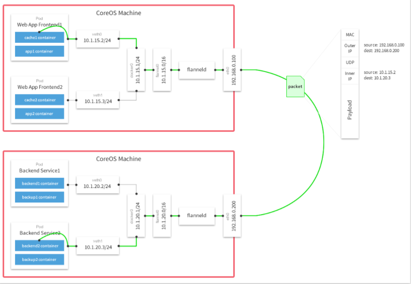

**flannel可使用==etcd==存储,分配,维护子网信息,最终实现一个大网络内的不同子网可以互通**


### flannel实验测试

这里为了避免把前面的环境搞乱，我再准备两台新虚拟机来做实验


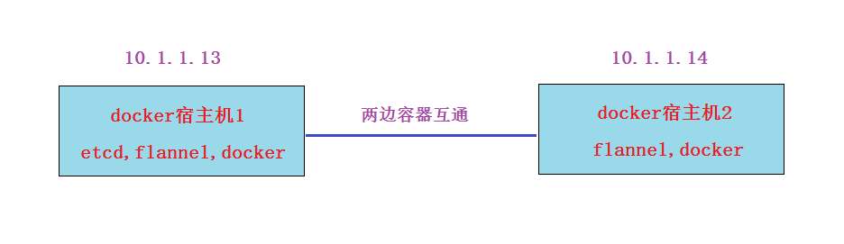

1, IP静态

2, 主机名绑定

~~~powershell
10.1.1.13	vm3.cluster.com
10.1.1.14	vm4.cluster.com
~~~

3, 时间同步

4, 关闭防火墙和selinux

5, yum源(使用centos安装完系统后的默认yum源再加上下面的docker-ce源)

~~~powershell
# wget https://mirrors.aliyun.com/docker-ce/linux/centos/docker-ce.repo -O /etc/yum.repos.d/docker-ce.repo
~~~


**实验过程**:

第1步: 在docker宿主机1上(主机名vm3)安装etcd,flannel,docker

~~~powershell
[root@vm3 ~]# yum install etcd flannel docker-ce -y
~~~

第2步: 在docker宿主机1上配置etcd服务并启动

~~~powershell
[root@vm3 ~]# vim /etc/etcd/etcd.conf
6 ETCD_LISTEN_CLIENT_URLS="http://0.0.0.0:2379"	 这里要监听0.0.0.0,这样flanneld服务才能连接

[root@vm3 ~]# systemctl start etcd
[root@vm3 ~]# systemctl enable etcd
~~~

第3步: 在docker宿主机1上配置flanneld服务,创建网络,并启动服务

~~~powershell
[root@vm3 ~]# vim /etc/sysconfig/flanneld
4 FLANNEL_ETCD_ENDPOINTS="http://10.1.1.13:2379"		注意:这里IP改为etcd服务IP

创建一个虚拟网络(我这里创建172.18.0.0/16)
[root@vm3 ~]# etcdctl mk //atomic.io/network/config '{"Network":"172.18.0.0/16"}'
{"Network":"172.18.0.0/16"}

[root@vm3 ~]# systemctl start flanneld
[root@vm3 ~]# systemctl enable flanneld

验证分配的网络(在172.18.0.0/16里随机的)
[root@vm3 ~]# cat /run/flannel/subnet.env
FLANNEL_NETWORK=172.18.0.0/16
FLANNEL_SUBNET=172.18.86.1/24
FLANNEL_MTU=1472
FLANNEL_IPMASQ=false
~~~

第4步: 在docker宿主机1上关联docker0网络与flannel0网络,启动docker服务,并验证网络

~~~powershell
[root@vm3 ~]# systemctl start docker			# 先启动docker才会产生/etc/docker/目录
[root@vm3 ~]# vim /etc/docker/daemon.json
{
        "bip": "172.18.86.1/24",
        "mtu": 1472
}
~~~

说明: 

* bip    边界IP,和`/run/flannel/subnet.env`配置文件里的对应
* mtu   网络最大传输单元,也和`/run/flannel/subnet.env`配置文件里的对应

~~~powershell
这里必须要重启docker服务;否则上面创建的flannel网络不能生效
[root@vm3 ~]# systemctl restart docker
[root@vm3 ~]# systemctl enable docker


[root@vm3 ~]# ifconfig |grep -E 'docker0|flannel0' -A 1
docker0: flags=4099<UP,BROADCAST,MULTICAST>  mtu 1500
        inet 172.18.86.1  netmask 255.255.255.0  broadcast 172.18.84.255
--
flannel0: flags=4305<UP,POINTOPOINT,RUNNING,NOARP,MULTICAST>  mtu 1472
        inet 172.18.86.0  netmask 255.255.0.0  destination 172.18.84.0

~~~

第5步: 在docker宿主机2上(**主机名vm4**)安装flannel,docker

~~~powershell
[root@vm4 ~]# yum install flannel docker-ce -y
~~~

第6步: 在docker宿主机2上配置flanneld服务,并启动服务

~~~powershell
[root@vm4 ~]# vim /etc/sysconfig/flanneld
4 FLANNEL_ETCD_ENDPOINTS="http://10.1.1.13:2379"		注意:这里IP改为etcd服务IP

[root@vm4 ~]# systemctl start flanneld
[root@vm4 ~]# systemctl enable flanneld

验证分配的网络
[root@vm4 ~]# cat /run/flannel/subnet.env
FLANNEL_NETWORK=172.18.0.0/16
FLANNEL_SUBNET=172.18.42.1/24
FLANNEL_MTU=1472
FLANNEL_IPMASQ=false
~~~

第7步: 在docker宿主机2上启动docker服务,并验证网络

~~~powershell
[root@vm4 ~]# systemctl start docker			# 先启动docker才会产生/etc/docker/目录
[root@vm4 ~]# vim /etc/docker/daemon.json
{
        "bip": "172.18.42.1/24",
        "mtu": 1472
}
~~~

~~~powershell
[root@vm4 ~]# systemctl restart docker
[root@vm4 ~]# systemctl enable docker

[root@vm3 ~]# ifconfig |grep -E 'docker0|flannel0' -A 1
docker0: flags=4099<UP,BROADCAST,MULTICAST>  mtu 1500
        inet 172.18.42.1  netmask 255.255.255.0  broadcast 172.18.84.255
--
flannel0: flags=4305<UP,POINTOPOINT,RUNNING,NOARP,MULTICAST>  mtu 1472
        inet 172.18.42.0  netmask 255.255.0.0  destination 172.18.84.0
~~~

第8步: 在两台docker宿主机上分别运行容器

~~~powershell
两台都下载busybox镜像(此镜像包含了ifconfig命令,镜像也小,下载快)
[root@vm3 ~]# docker pull busybox
[root@vm4 ~]# docker pull busybox

[root@vm3 ~]# docker run -itd --name=c1 busybox /bin/sh
5b4fa3e8e71e53229f75a94ea993f4486f80ac0706678d1f1a214dea44d69b7f
[root@vm3 ~]# docker exec c1 ifconfig |head -2
eth0      Link encap:Ethernet  HWaddr 02:42:AC:12:56:02  
          inet addr:172.18.86.2  Bcast:0.0.0.0  Mask:255.255.255.0

[root@vm4 ~]# docker run -itd --name=c1 busybox /bin/sh
79e5f60ef310721901ac870f88a1475aaef7a8ab45575c02e947dcbee32b4d5a
[root@vm4 ~]# docker exec c1 ifconfig |head -2
eth0      Link encap:Ethernet  HWaddr 02:42:AC:12:2A:02  
          inet addr:172.18.42.2  Bcast:0.0.0.0  Mask:255.255.255.0
~~~

第9步: 在两台docker宿主机上进行容器连通测试

~~~powershell
vm3上的c1容器ping测试vm4上的c1容器,不通
[root@vm3 ~]# docker exec c1 ping -c 2 172.18.42.2

这里是被防火墙给限制了(启动docker服务,会产生iptables的规则),清除规则(注意FORWARD链默认规则要改)
[root@vm3 ~]# iptables -F
[root@vm3 ~]# iptables -P FORWARD ACCEPT
[root@vm4 ~]# iptables -F
[root@vm4 ~]# iptables -P FORWARD ACCEPT

最后终于互通了
[root@vm3 ~]# docker exec c1 ping -c 2 172.18.42.2
PING 172.18.42.2 (172.18.42.2): 56 data bytes
64 bytes from 172.18.42.2: seq=0 ttl=60 time=1.652 ms
64 bytes from 172.18.42.2: seq=1 ttl=60 time=2.491 ms

[root@vm4 ~]# docker exec c1 ping -c2 172.18.86.2
PING 172.18.86.2 (172.18.86.2): 56 data bytes
64 bytes from 172.18.86.2: seq=0 ttl=60 time=1.804 ms
64 bytes from 172.18.86.2: seq=1 ttl=60 time=1.981 ms
~~~


# 十三、docker的web管理平台

我想初学者都被docker的复杂命令搞得晕头转向了,希望有一个图形化的管理平台能轻松管理容器。类似的开源web管理平台主要有: DockerUI,Portainer,Shipyard等。


## DockerUI

1,拉取dockerui的镜像

~~~powershell
[root@daniel ~]# docker pull uifd/ui-for-docker
~~~

2,运行容器

**注意:**需要将docker宿主机的`/var/run/docker.sock`与容器的`/var/run/docker.sock`对应,才能管理

~~~powershell
[root@daniel ~]# docker run -d --name dockerui -p 9000:9000 -v /var/run/docker.sock:/var/run/docker.sock uifd/ui-for-docker
23112ee4132b974af2647762e155592da00ab30def797953cb03b1bcade18434

[root@daniel ~]# lsof -i:9000
COMMAND     PID USER   FD   TYPE DEVICE SIZE/OFF NODE NAME
docker-pr 13154 root    4u  IPv6 178230      0t0  TCP *:cslistener (LISTEN)
~~~

3,使用浏览器访问 http://`docker宿主机IP`:9000

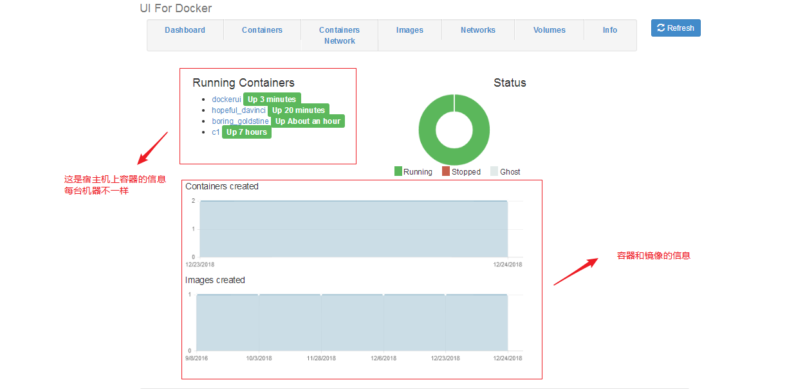


## portainer

1, 拉取portainer镜像

~~~powershell
[root@daniel ~]# docker pull portainer/portainer
~~~

2,  运行容器

**注意:**需要将docker宿主机的`/var/run/docker.sock`与容器的`/var/run/docker.sock`对应,才能管理

~~~powershell
[root@daniel ~]# docker run -d -p 9001:9000 --name=portainer -v /var/run/docker.sock:/var/run/docker.sock  portainer/portainer

[root@daniel ~]# lsof -i:9001
COMMAND     PID USER   FD   TYPE DEVICE SIZE/OFF NODE NAME
docker-pr 70010 root    4u  IPv6 293808      0t0  TCP *:etlservicemgr (LISTEN)
~~~

使用浏览器访问 **http://宿主机IP:9001**

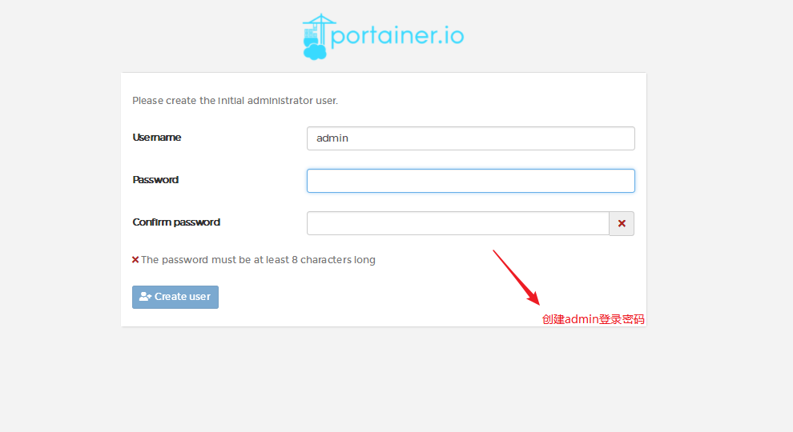

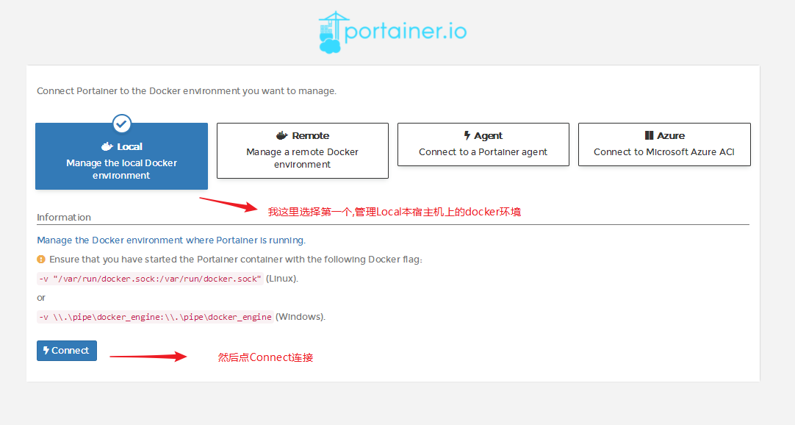

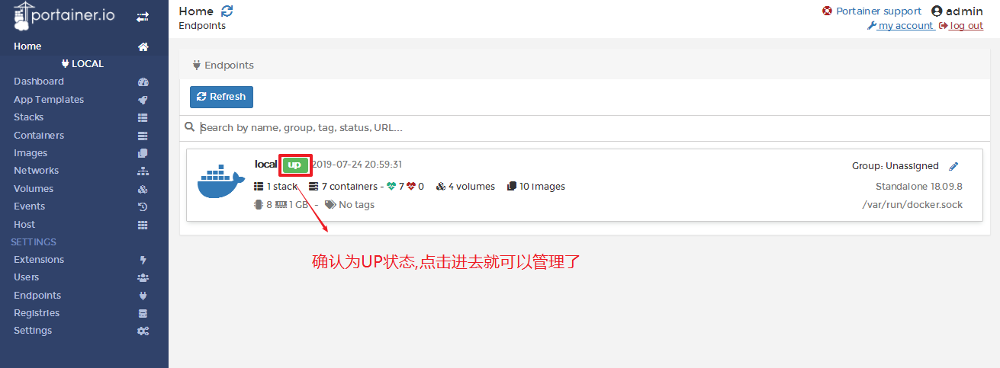


## Shipyard

这个工具也很强大，可惜目前停止维护了。


