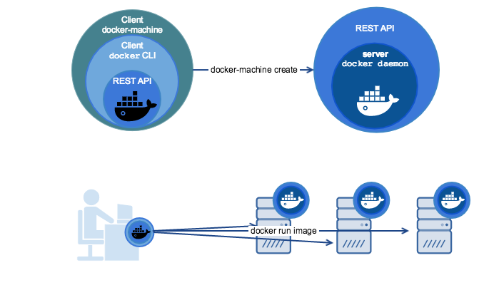
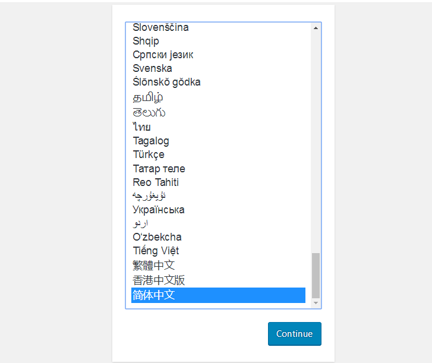
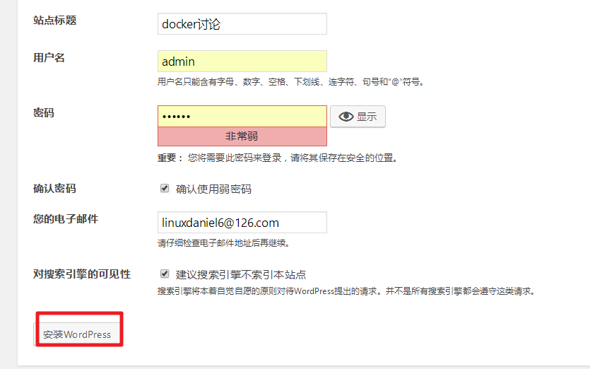
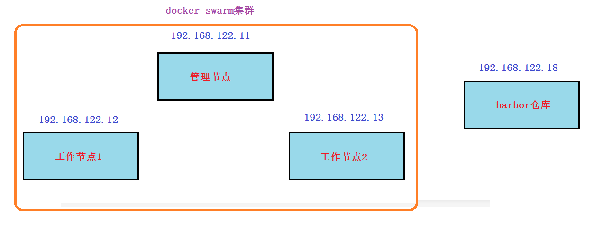
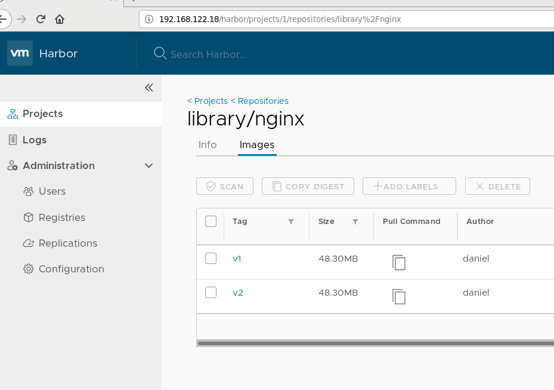

# 学习目标

- [ ] 能够说出docker-compose是什么
- [ ] 能够安装docker-compose
- [ ] 能够说出使用docker-compose的基本三步骤
- [ ] 了解docker-compose的基本语法
- [ ] 能够使用docker-compose实现基础应用案例
- [ ] 能够说出docker swarm是什么
- [ ] 能够部署docker swarm集群
- [ ] 掌握docker swarm的集群基础应用
- [ ] 能够说出docker stack是什么
- [ ] 能够使用docker stack实现基础应用案例


# 一、Docker三剑客介绍

为了把容器化技术的优点发挥得更好，docker公司先后推出了三大技术:

* docker-machine
* docker-compose
* docker-swarm

使用"三剑客"可以帮助我们解决docker host维护,多容器编排部署,多个docker host集群的各个难题。


# 二、Docker machine(了解)

通过前面的章节学习,我们知道docker使用了linux的内核技术(namespace,cgroup等),那么如果我想在windows或Mac系统上运行docker怎么办呢?

答案是借助虚拟机来实现,也就是说我在windows或Mac上运行一个linux虚拟机,再在虚拟机里运行docker。


docker-machine就是docker公司官方提出的,用于在各种平台上快速创建具有docker服务的虚拟机的技术.

参考: https://docs.docker.com/machine/install-machine/#install-machine-directly




# 三、Docker compose

## docker-compose介绍

用容器运行一个服务,需要使用`docker run`命令。但如果我要运行多个服务呢?

假设我要运行一个web服务,还要运行一个db服务,那么是用一个容器运行,还是用多个容器运行呢?

一个容器运行多个服务会造成镜像的复杂度提高,**docker倾向于一个容器运行一个应用(微服务架构)**。

那么复杂的架构就会需要很多的容器,并且需要它们之间有关联(容器之间的依赖和连接)就更复杂了。

这个复杂的问题需要解决,这就涉及到了**==容器编排==**的问题了。


docker-compose就是可以做容器编排的小工具，它可以在一个文件中定义多个容器,只用一行命令就可以让一切就绪并运行。


## docker-compose部署

安装方法(其它安装方法参考前面harbor章节)

~~~powershell
[root@daniel ~]# curl -L https://get.daocloud.io/docker/compose/releases/download/1.24.1/docker-compose-`uname -s`-`uname -m` > /usr/local/bin/docker-compose
[root@daniel ~]# chmod +x /usr/local/bin/docker-compose
~~~

卸载方法:

~~~powershell
# rm /usr/local/bin/docker-compose
~~~


**安装完后验证**

~~~powershell
# docker-compose -v
docker-compose version 1.24.1, build 4667896
~~~


## 使用docker-compose的三个步骤

Docker Compose将所管理的容器分为三层

1. **工程**（project）
2. **服务**（service）
3. **容器**（contaienr）

Docker Compose运行的目录下的所有文件（docker-compose.yml, extends文件或环境变量文件等）组成一个工程，若无特殊指定工程名即为当前目录名。

一个工程当中可包含多个服务，每个服务中定义了容器运行的镜像，参数，依赖。

一个服务当中可包括多个容器实例


使用Compose基本上分为三步：
1. **Dockerfile 定义应用的运行环境（镜像)**
2. **docker-compose.yml 定义组成应用的各服务**
3. **docker-compose up -d构建并启动整个应用**


## docker compose常见语法

docker compose使用**YAML格式**文件来编排

参考: https://docs.docker.com/compose/compose-file/

**build**

指定镜像构建时的dockerfile目录,格式一般为绝对路径目录或相对路径目录(dockerfile需要命名为Dockerfile)

~~~powershell
build: /path/to/build/dir
或者
build: ./dir
~~~

**image**

指定要启动容器的镜像

~~~powershell
image: redis
image: ubuntu:14.04
image: tutum/influxdb
image: example-registry.com:4000/postgresql
image: a4bc65fd
~~~

如果镜像不存在,compose尝试拉它.

如果指定了构建, 可以使用指定的选项构建它,并使用指定的tag进行标记。


**environment**

设置镜像变量，它可以保存变量到镜像里面，也就是说启动的容器也会包含这些变量设置

`environment` 和 Dockerfile 中的 `ENV` 指令一样会把变量一直保存在镜像,容器中

**格式**

~~~powershell
environment:
  RACK_ENV: development
  SHOW: 'true'
或
environment:
  - RACK_ENV=development
  - SHOW=true
~~~

**expose**

这个标签与Dockerfile中的 `EXPOSE` 指令一样，用于指定暴露的端口，但只将端口暴露给连接的服务，而不暴露给主机.

~~~powershell
expose:
 - "3000"
 - "8000"
~~~

**ports**

映射端口，可以使用 `HOST:CONTAINER` 的方式指定端口，也可以指定容器端口（选择临时主机端口），宿主机会随机映射端口

~~~powershell
ports:
 - "3000"
 - "3000-3005"
 - "8000:8000"
 - "9090-9091:8080-8081"
 - "49100:22"
 - "127.0.0.1:8001:8001"
 - "127.0.0.1:5000-5010:5000-5010"
 - "6060:6060/udp"
~~~

**restart**

指定Docker容器的重启策略

默认值为 `no` ，即在任何情况下都不会重新启动容器

当值为 `always` 时，容器退出时总是重新启动,(会随着docker服务启动而启动容器)；

当值为 `on-failure`时，当出现 `on-failure` 报错（非正常退出，退出状态非0）,才会重启容器

当值为`unless-stopped`时, 在容器退出时总是重启容器，但是不考虑在Docker守护进程启动时就已经停止了的容器

~~~powershell
restart: "no"
restart: always
restart: on-failure
restart: on-failure:3
restart: unless-stopped
~~~

**volume**

数据卷挂载，可以直接使用 `HOST:CONTAINER` 这样的格式

或者使用 `HOST:CONTAINER:ro` 这样的格式，ro代表数据卷是只读的

~~~powershell
volumes:
  # 只是指定一个路径，Docker 会自动在创建一个数据卷（这个路径是容器内部的）。
  - /var/lib/mysql

  # 使用绝对路径挂载数据卷
  - /opt/data:/var/lib/mysql

  # 以Compose配置文件为中心的相对路径作为数据卷挂载到容器。
  - ./cache:/tmp/cache

  # 使用用户的相对路径（~/ 表示的目录是 /home/<用户目录>/ 或者 /root/）。
  - ~/configs:/etc/configs/:ro

  # 已经存在的命名的数据卷。
  - datavolume:/var/lib/mysql
~~~

**depends_on**

此标签解决了容器的依赖、启动先后的问题

~~~powershell
version: '3'
services:
  web:
    build: .
    depends_on:
      - db
      - redis
  redis:
    image: redis
  db:
    image: mysql
~~~

使用`docker-compose up web`启动,会先启动redis和db,再启动web

**links**

链接到其它服务的中的容器, 与`link`连接一样效果，会连接到其它服务中的容器

~~~powershell
web:
  links:
   - db
   - db:database
   - redis
~~~


## docker-compose基础应用案例

参考: https://docs.docker.com/compose/gettingstarted/


### **案例1: wordpress应用**

1, 创建一个名为wordpress的project(工程)

```powershell
[root@daniel ~]# mkdir -p /docker-compose/wordpress
[root@daniel ~]# cd /docker-compose/wordpress
```

2, 创建docker-compose.yml

```powershell
[root@daniel wordpress]# vim docker-compose.yml
version: '3'
services:
  db:
    image: mysql:5.7
    volumes:
      - "./data:/var/lib/mysql"
    restart: always
    environment:
      MYSQL_ROOT_PASSWORD: wordpress
      MYSQL_DATABASE: wordpress
      MYSQL_USER: wordpress
      MYSQL_PASSWORD: wordpress
    expose:
      - "3306"

  wordpress:
    depends_on:
      - db
    image: wordpress:latest
    links:
      - db
    ports:
      - "8010:80"
    restart: always
    environment:
      WORDPRESS_DB_HOST: db:3306
      WORDPRESS_DB_PASSWORD: wordpress
```

说明:

这个应用定义了两个容器服务：db, wordpress

db容器通过mysql:5.7镜像启动

* MySQL的数据目录挂载到当前目录./data，此目录不存在会自动创建
* 容器重启策略为always
* 设置了连接mysql的4个变量

wordpress容器通过wordpress:latest启动

* 需要db容器先启动再启动wordpress容器
* wordpress容器要link连接db容器
* wordpress容器将80端口映射到宿主机的8010端口
* 容器重启策略为always
* 设置连接数据库的变量


3, 启动

```powershell
[root@daniel wordpress]# docker-compose up -d
```

如果本地没有镜像,下载的两个镜像比较大

```powershell
[root@daniel wordpress]# docker images
REPOSITORY          TAG                 IMAGE ID            CREATED             SIZE
mysql               5.7                 e9c354083de7        3 days ago          373MB
wordpress           latest              4ba1e63bd20c        8 days ago          501MB
```


4, 访问

访问容器主机的8010端口






5, 不用了可以关闭并删除

~~~powershell
[root@daniel wordpress]# docker-compose stop
Stopping wordpress_wordpress_1 ... done
Stopping wordpress_db_1        ... done

[root@daniel wordpress]# docker-compose rm
Going to remove wordpress_wordpress_1, wordpress_db_1
Are you sure? [yN] y									输入y确认删除容器
Removing wordpress_wordpress_1 ... done
Removing wordpress_db_1        ... done
~~~


### 案例2: python记数小应用

创建一个Python应用， 使用Flask，将数值记入Redis

1、建立工程目录并在工程目录里创建Python脚本

~~~powershell
[root@daniel wordpress]# mkdir -p /docker-compose/python_count
[root@daniel wordpress]# cd /docker-compose/python_count
[root@daniel python_count]#

[root@daniel python_count]# vim app.py
from flask import Flask
from redis import Redis

app = Flask(__name__)
redis = Redis(host='redis', port=6379)

@app.route('/')
def hello():
    redis.incr('hits')
    return 'Hello World! I have been seen %s times.' % redis.get('hits')

if __name__ == "__main__":
    app.run(host="0.0.0.0", debug=True)

~~~


~~~powershell
[root@daniel python_count]# vim requirements.txt
flask
redis
~~~


2、创建 Dockerfile
在同一目录下，创建Dockerfile

~~~powershell
[root@daniel python_count]# vim Dockerfile
FROM python:2.7
ADD . /code
WORKDIR /code
RUN pip install -r requirements.txt
CMD python app.py
~~~

说明: 

* 容器使用Python 2.7的镜像
* 将当前目录下文件拷贝到容器内/code
* 指定工作目录为/code
* 安装python需要的库：flask, redis,flask默认为5000端口
* 容器执行命令 :python app.py


3, 创建编排脚本
在同一目录下，创建 docker-compose.yml

~~~shell
[root@daniel python_count]# vim docker-compose.yml
version: '3'
services:
  web:
    build: .
    ports:
     - "5000:5000"
    volumes:
     - .:/code
    depends_on:
     - redis
     
  redis:
    image: redis:latest
~~~

说明:

* 这个应用定义了两个服务：web, redis
* web容器通过当前路径下的Dockerfile生成
* web容器内的5000端口映射到docker宿主机的5000端口
* 将当前目录挂载到web容器内/code
* web容器依赖于redis容器
* redis容器使用redis:latest镜像启动


4, 启动应用
执行编排脚本，分别制作和拉取web，redis镜像，启动容器

~~~powershell
[root@daniel python_count]# docker-compose up -d
~~~

5, 访问http://`docker宿主机IP`:5000


### 案例3: haproxy应用

1, 创建一个工程目录haproxy

~~~powershell
[root@daniel ~]# mkdir -p /docker-compose/haproxy
[root@daniel haproxy]# cd /docker-compose/haproxy
~~~

2, 准备haproxy.cfg配置文件

~~~powershell
[root@daniel haproxy]# vim haproxy.cfg
global
  log 127.0.0.1 local0
  log 127.0.0.1 local1 notice

defaults
  log global
  mode http
  option httplog
  option dontlognull
  timeout connect 5000ms
  timeout client 50000ms
  timeout server 50000ms
  stats uri /status

frontend balancer
    bind 0.0.0.0:80
    mode http
    default_backend web_backends

backend web_backends
    mode http
    option forwardfor
    balance roundrobin
    server web1 web1:80 check
    server web2 web2:80 check
    server web3 web3:80 check
    option httpchk GET /
    http-check expect status 200
~~~

3, 创建编排脚本

~~~powershell
[root@vm1 haproxy]# vim docker-compose.yml
web1:
  image: httpd:latest
  volumes:
    - ./httpd1:/usr/local/apache2/htdocs/
  expose:
    - 80

web2:
  image: httpd:latest
  volumes:
    - ./httpd2:/usr/local/apache2/htdocs/
  expose:
    - 80

web3:
  image: httpd:latest
  volumes:
    - ./httpd3:/usr/local/apache2/htdocs/
  expose:
    - 80

haproxy:
  image: haproxy:latest
  volumes:
    - ./haproxy.cfg:/usr/local/etc/haproxy/haproxy.cfg:ro
  links:
    - web1
    - web2
    - web3
  ports:
    - "80:80"
  expose:
    - "80"

~~~

4, 启动应用

~~~powershell
[root@daniel haproxy]# docker-compose up -d
~~~

5, 在挂载目录建立不同的主页用于测试

~~~powershell
[root@daniel haproxy]# echo web1 > httpd1/index.html
[root@daniel haproxy]# echo web2 > httpd2/index.html
[root@daniel haproxy]# echo web3 > httpd3/index.html
~~~

6, 访问http://`docker宿主机IP`:80   验证是否负载均衡调度

 访问http://`docker宿主机IP`:80/status  验证是否有状态页面


# 四、Docker swarm

## docker swarm介绍

Docker Swarm是Docker官方提供的一款集群管理工具，其主要作用是把若干台Docker主机抽象为一个整体，并且通过一个入口统一管理这些Docker主机上的各种Docker资源。Swarm和Kubernetes比较类似，但是更加轻，具有的功能也较kubernetes更少一些。

- 是docker host集群管理工具
- docker官方提供的
- docker 1.12版本以后
- 用来统一集群管理的，把整个集群资源做统一调度
- 比kubernetes要轻量化
- 实现scaling 规模扩大或缩小
- 实现rolling update 滚动更新或版本回退
- 实现service discovery 服务发现
- 实现load balance 负载均衡
- 实现route mesh 路由网格，服务治理


## docker swarm概念与架构

**节点 (node):** 就是一台docker host上面运行了docker engine.节点分为两类:

- 管理节点(manager node) 负责管理集群中的节点并向工作节点分配任务
- 工作节点(worker node) 接收管理节点分配的任务，运行任务


**服务(services):** 在工作节点运行的，由多个任务共同组成

**任务(task):** 运行在工作节点上容器或容器中包含应用，是集群中调度最小管理单元


## docker swarm集群部署

### 环境准备



1, 所有节点主机名及主机名绑定

~~~powershell
192.168.122.11  vm1.cluster.com
192.168.122.12  vm2.cluster.com
192.168.122.13  vm3.cluster.com
~~~

2, 所有节点关闭防火墙和selinux

3, 所有节点时间同步

4, 所有节点都安装docker-ce并启动服务

~~~powershell
# wget https://mirrors.aliyun.com/docker-ce/linux/centos/docker-ce.repo -O /etc/yum.repos.d/docker-ce.repo

# yum install docker-ce -y
# systemctl start docker
# systemctl enable docker
~~~

5, 所有节点配置镜像加速器

~~~powershell
# vim /etc/docker/daemon.json
{
        "registry-mirrors": ["https://42h8kzrh.mirror.aliyuncs.com"],
        "insecure-registries": ["192.168.122.18"]
}

# systemctl daemon-reload
# systemctl restart docker
~~~


### manager节点初始化swarm集群

~~~powershell
[root@vm1 ~]# docker swarm init --listen-addr 192.168.122.11:2377
Swarm initialized: current node (qxxsnib4y7c5j35c8kx758b0g) is now a manager.

To add a worker to this swarm, run the following command:

    docker swarm join --token SWMTKN-1-47kxu5cuecep6y2j5cd33bmy32fvz5npzbzyyjsqw3fie6fgdc-6si9byyfus3wystnjjx99j0ba 192.168.122.11:2377

To add a manager to this swarm, run 'docker swarm join-token manager' and follow the instructions.
~~~


### swarm集群中加入worker节点

分别在另外2个节点join集群

~~~powershell
[root@vm2 ~]# docker swarm join --token SWMTKN-1-47kxu5cuecep6y2j5cd33bmy32fvz5npzbzyyjsqw3fie6fgdc-6si9byyfus3wystnjjx99j0ba 192.168.122.11:2377
This node joined a swarm as a worker.
~~~

~~~powershell
[root@vm3 ~]# docker swarm join --token SWMTKN-1-47kxu5cuecep6y2j5cd33bmy32fvz5npzbzyyjsqw3fie6fgdc-6si9byyfus3wystnjjx99j0ba 192.168.122.11:2377
This node joined a swarm as a worker.
~~~


### 在manager节点验证集群状态

~~~shell
[root@vm1 ~]# docker node ls
ID                            HOSTNAME            STATUS              AVAILABILITY        MANAGER STATUS      ENGINE VERSION
qxxsnib4y7c5j35c8kx758b0g *   vm1.cluster.com     Ready               Active              Leader              19.03.0
rzjzhvvn6ib5roglhkizqeomj     vm2.cluster.com     Ready               Active                                  19.03.0
t3e0e7j6x71u2ggn2c03xtcr3     vm3.cluster.com     Ready               Active                                  19.03.0
~~~


## docker swarm集群基础应用


### 镜像准备

准备两个nginx镜像(版本不同),并push到harbor仓库,在任意节点操作(我这里是在管理节点vm1上操作)

1, 准备主页文件与dockerfile文件

~~~powershell
[root@vm1 ~]# mkdir /dockerfile/nginx -p
[root@vm1 ~]# cd /dockerfile/nginx/
[root@vm1 nginx]# vim index.html
nginx V1								  随意写些内容,模拟V1版本的主页内容

[root@vm1 nginx]# vim Dockerfile
FROM nginx:latest

MAINTAINER  daniel

ADD index.html /usr/share/nginx/html

RUN echo "daemon off;" >> /etc/nginx/nginx.conf

EXPOSE 80

CMD /usr/sbin/nginx
~~~

2, 登录harbor仓库

~~~powershell
[root@vm1 nginx]# docker login 192.168.122.18
Username: admin
Password:
WARNING! Your password will be stored unencrypted in /root/.docker/config.json.
Configure a credential helper to remove this warning. See
https://docs.docker.com/engine/reference/commandline/login/#credentials-store

Login Succeeded
~~~

3, 构建v1版本镜像，并push到harbor仓库

~~~powershell
[root@vm1 nginx]# docker build -t 192.168.122.18/library/nginx:v1 .

[root@vm1 nginx]# docker push 192.168.122.18/library/nginx:v1
~~~

4, 修改主页内容,再次构建v2版本镜像,并push到harbor仓库

~~~powershell
[root@vm1 nginx]# vim index.html
nginx V2									    改为V2,模拟V2版本的主页内容

[root@vm1 nginx]# docker build -t 192.168.122.18/library/nginx:v2 .

[root@vm1 nginx]# docker push 192.168.122.18/library/nginx:v2
~~~





### 发布服务

在docker swarm中,对外暴露的是服务（service)，而不是容器。

为了保持高可用架构，它准许同时启动多个容器共同支撑一个服务，如果一个容器挂了，它会自动使用另一个容器


在管理节点（manager node）上操作

1, 使用`docker service ls`查看没有任何服务

~~~powershell
[root@vm1 ~]# docker service ls
ID       NAME         MODE        REPLICAS       IMAGE         PORTS
~~~

2, 发布服务

~~~shell
[root@vm1 ~]# docker service create --replicas 2 --publish 80:80 --name nginx_service 192.168.122.18/library/nginx:v1
6q00dbum7f92wjnrjtnsab225
overall progress: 2 out of 2 tasks
1/2: running   [==================================================>]
2/2: running   [==================================================>]
verify: Service converged
~~~

说明:

* 创建一个服务,名为nginx_service
* replicas 2指定2个副本
* --publish 80:80  将服务内部的80端口发布到外部网络(在这里就是192.168.122.0/24网络)的80端口
* 使用的镜像为`192.168.122.18/library/nginx:v1`

3, 再次使用`docker service ls`查看就有服务了

~~~powershell
[root@vm1 ~]# docker service ls
ID                  NAME                MODE                REPLICAS            IMAGE                             PORTS
6q00dbum7f92        nginx_service       replicated          2/2                 192.168.122.18/library/nginx:v1   *:80->80/tcp
~~~

4, 查看服务运行在哪些节点

~~~powershell
[root@vm1 ~]# docker service ps nginx_service
ID                  NAME                IMAGE                             NODE                DESIRED STATE       CURRENT STATE           ERROR               PORTS
xxoqft3vp6zm        nginx_service.1     192.168.122.18/library/nginx:v1   vm2.cluster.com     Running             Running 3 minutes ago
fycl30fuvp9i        nginx_service.2     192.168.122.18/library/nginx:v1   vm1.cluster.com     Running             Running 4 minutes ago

可以看到在vm1和vm2节点,可以在vm1和vm2上使用docker ps -a验证
~~~


### 路由网格

使用**集群外**的一台节点做为客户端来访问,我这里以192.168.122.1为例

~~~powershell
# curl 192.168.122.11
# curl 192.168.122.12
# curl 192.168.122.13				
~~~

访问三个节点都可以得到结果,但我们在前面只看到容器只跑在`192.168.122.11`和`192.168.122.12`这2台上,并没有跑到`192.168.122.13`上, 那么这是如何访问到的呢?

答案: route mesh


### 负载均衡

在上面两台跑了容器的节点上修改主页内容

在`192.168.122.11`上

~~~powershell
# docker exec -it  容器名或容器ID  /bin/bash
容器交互>  cd /usr/share/nginx/html
容器交互>  echo web1 > index.html
容器交互>  exit
~~~

在`192.168.122.12`上

~~~powershell
# docker exec -it  容器名或容器ID  /bin/bash
容器交互>  cd /usr/share/nginx/html
容器交互>  echo web2 > index.html
容器交互>  exit
~~~

再以**集群外**的一台节点做为客户端来访问,我这里以192.168.122.1为例

~~~powershell
# curl 192.168.122.11
# curl 192.168.122.12
# curl 192.168.122.13	

重复多次访问,有负载均衡的功能
~~~


### 高可用

1，docker stop 容器名，关闭一个容器，它会自动帮你再启动一个

2，init 0关闭一个跑了容器的节点，这个容器会自动跑到另一个节点上启动


### 扩展服务

使用scale指定副本数来扩展(manage node上操作)

~~~powershell
[root@vm1 ~]# docker service scale nginx_service=3
nginx_service scaled to 3
overall progress: 3 out of 3 tasks
1/3: running   [==================================================>]
2/3: running   [==================================================>]
3/3: running   [==================================================>]
verify: Service converged
~~~

验证

~~~powershell
[root@vm1 ~]# docker service ps nginx_service
ID                  NAME                IMAGE                             NODE                DESIRED STATE       CURRENT STATE            ERROR               PORTS
xxoqft3vp6zm        nginx_service.1     192.168.122.18/library/nginx:v1   vm2.cluster.com     Running             Running 15 minutes ago
fycl30fuvp9i        nginx_service.2     192.168.122.18/library/nginx:v1   vm1.cluster.com     Running             Running 16 minutes ago
0owxm8ykuxcj        nginx_service.3     192.168.122.18/library/nginx:v1   vm3.cluster.com     Running             Running 8 minutes ago

可以看到3个节点,使用docker ps -a去3个节点上验证
~~~

### 裁减服务

使用scale指定副本数来裁减(manage node上操作)

~~~powershell
[root@vm1 ~]# docker service scale nginx_service=1
nginx_service scaled to 1
overall progress: 1 out of 1 tasks
1/1: running   [==================================================>]
verify: Service converged
~~~

验证

~~~powershell
[root@vm1 ~]# docker service ps nginx_service
ID                  NAME                IMAGE                             NODE                DESIRED STATE       CURRENT STATE            ERROR               PORTS
xxoqft3vp6zm        nginx_service.1     192.168.122.18/library/nginx:v1   vm2.cluster.com     Running             Running 18 minutes ago

只有vm2上跑有相关容器了
~~~

### 版本更新或版本回退


~~~powershell
[root@vm1 ~]# docker service update --image 192.168.122.18/library/nginx:v2 nginx_service
nginx_service
overall progress: 1 out of 1 tasks
1/1: running   [==================================================>]
verify: Service converged
~~~

说明:

* update代表更新
* --image指定要更新的镜像
* nginx_service为指定要更新的服务名称


**练习: 请自行回退版本**


### 滚动间隔更新

~~~powershell
[root@vm1 ~]# docker service update --replicas 3 --image 192.168.122.18/library/nginx:v2 --update-parallelism 1 --update-delay 30s nginx_service
~~~

说明:

* --update-parallelism 1指定并行更新数量
* --update-delay 30s指定更新间隔时间


**注意:** docker swarm滚动更新会造成节点上有exit状态的容器,可以考虑清除


### 服务删除

~~~powershell
[root@vm1 ~]# docker service rm nginx_service
nginx_service
~~~

~~~powershell
[root@vm1 ~]# docker service ls
ID       NAME        MODE         REPLICAS       IMAGE       PORTS
~~~


### 本地存储卷

**本地存储卷用于持久化数据**

1, 三台节点需要都先创建挂载的目录

~~~powershell
# mkdir /data/nginxdata -p
~~~

2, 发布服务,使用创建的目录做源挂载到nginx容器里的家目录

~~~powershell
[root@vm1 ~]# docker service create  --replicas 3 --mount "type=bind,source=/data/nginxdata,target=/usr/share/nginx/html" --publish 80:80 --name nginx_service 192.168.122.18/library/nginx:v1

~~~

3, 验证

~~~powershell
[root@vm1 ~]# docker service ps nginx |grep -i runn
93kd58aumuhg        nginx.1             192.168.122.18/library/nginx:v1   worker1             Running             Running 21 seconds ago
f8q9d234963q        nginx.2             192.168.122.18/library/nginx:v1   worker2             Running             Running 21 seconds ago
fdrzf8w8wwhj        nginx.3             192.168.122.18/library/nginx:v1   manager             Running             Running 21 seconds ago

~~~

4, 3台都分别挂载自己宿主机上的`/data/nginxdata`目录,实现了数据持久化


**思考:** 上面实现了数据持久化,但是不能实现数据的一致,如何解决?

~~~powershell
可以使用远程的文件存储或对象存储挂载到这三台的/data/nginxdata目录
比如使用nfs,glusterfs,ceph或云服务的文件存储或对象存储都可以
~~~


### 网络存储卷

* 网络存储卷可以实现跨docker宿主机的数据共享,数据持久保存到网络存储卷中
* 在创建service时添加卷的挂载参数,网络存储卷可以帮助自动挂载(**但需要集群节点都创建该网络存储卷**)


**这里以nfs为案例**

1,在**docker swarm集群中所有节点**都确认安装nfs客户端软件

~~~powershell
# yum install nfs-utils rpcbind -y
~~~

2, 在`192.168.122.1`上搭建nfs,共享目录给docker swarm集群中所有节点挂载

~~~powershell
[root@daniel ~]# mkdir /opt/dockervolume

[root@daniel ~]# vim /etc/exports
/opt/dockervolume       *(rw,no_root_squash,sync)

[root@daniel ~]# systemctl restart rpcbind nfs-server
[root@daniel ~]# systemctl enble rpcbind nfs-server
~~~

3, 在**docker swarm集群中==所有节点==**创建存储卷,并验证

~~~powershell
# docker volume create  --driver local --opt type=nfs --opt o=addr=192.168.122.1,rw --opt device=:/opt/dockervolume nginx_volume

# docker volume ls |grep nginx_volume
local               nginx_volume

# docker volume inspect nginx_volume
[
    {
        "CreatedAt": "2019-06-12T13:24:09+08:00",
        "Driver": "local",
        "Labels": {},
        "Mountpoint": "/var/lib/docker/volumes/nginx_volume/_data",
        "Name": "nginx_volume",
        "Options": {
            "device": ":/opt/dockervolume",
            "o": "addr=192.168.122.1,rw",				一定要注意这里的挂载参数要有
            "type": "nfs"
        },
        "Scope": "local"
    }

~~~

4, 在docker swarm的管理节点上发布nginx服务,使用上面创建的存储卷

~~~powershell
[root@vm1 ~]# docker service create  --replicas 3 --publish 81:80 --mount "type=volume,source=nginx_volume,target=/usr/share/nginx/html" --name nginx_service2 192.168.122.18/library/nginx:v1
zsr5nqfhnfgq7a4x189gafn30
overall progress: 3 out of 3 tasks
1/3: running
2/3: running
3/3: running
verify: Service converged
~~~

5, 验证(在三个集群节点上验证)

~~~powershell
# df -h |tail -1
:/opt/dockervolume  462G  205G  257G  45% /var/lib/docker/volumes/nginx_volume/_data
~~~

~~~powershell
# docker inspect 容器名或容器ID
可以看到以/var/lib/docker/volumes/nginx_volume/_data为源挂载到容器的/usr/share/nginx/html
~~~

6, 数据一致性验证

去nfs服务器`192.168.122.1`的`/opt/dockervolume`目录修改文件,客户端访问的数据都与修改的一致


### 服务互联与服务发现

如果一个nginx服务与一个mysql服务之间需要连接,在docker swarm如何实现呢?

方法1:

把mysql服务也使用 `--publish`参数发布到外网,但这样做的缺点是:mysql这种服务发布到外网不安全

方法2:

将mysql服务等运行在内部网络,只需要nginx服务能够连接mysql就可以了,在docker swarm中可以使用==**overlay**==网络来实现(overlay就类似在openstack里使用vxlan实现的自助网络)

但现在还有个问题,服务副本数发生变化时,容器内部的IP发生变化时,我们希望仍然能够访问到这个服务, 这就是**==服务发现（service discovery)==**.

**通过服务发现, service的使用者都不需要知道service运行在哪里,IP是多少,有多少个副本,就能让service通信**


下面使用`docker network ls`查看到的ingress网络就是一个overlay类型的网络,但它不支持服务发现

~~~powershell
[root@vm1 ~]# docker network ls
NETWORK ID          NAME                DRIVER              SCOPE
f1cd139a3cab        bridge              bridge              local
d65ee76360c1        docker_gwbridge     bridge              local
9cc272e76614        host                host                local
1mgiyesumvf6        ingress             overlay             swarm
4824db275540        none                null                local
~~~

我们**需要自建一个overlay网络来实现服务发现, 需要相互通信的service也必须属于同一个overlay网络**

~~~powershell
[root@vm1 ~]# docker network create --driver overlay --subnet 192.168.100.0/24 self-network
~~~

说明:

* --driver overlay指定为overlay类型
* --subnet 分配网段
* self-network  为自定义的网络名称

~~~powershell
[root@vm1 ~]# docker network ls
NETWORK ID          NAME                DRIVER              SCOPE
f1cd139a3cab        bridge              bridge              local
d65ee76360c1        docker_gwbridge     bridge              local
9cc272e76614        host                host                local
1mgiyesumvf6        ingress             overlay             swarm
4824db275540        none                null                local
d9l9885takmm        self-network        overlay             swarm
~~~


**验证自动发现**

1, 发布nignx_service服务,指定在自建的overlay网络

~~~powershell
[root@vm1 ~]# docker service create --replicas 3 --network self-network --publish 80:80 --name nginx_service 192.168.122.18/library/nginx:v1
~~~

2, 发布一个busybox服务,也指定在自建的overlay网络

~~~powershell
[root@vm1 ~]# docker service create --name test --network self-network  busybox sleep 100000
~~~

说明:

* 服务名为test

* busybox是一个集成了linux常用命令的软件,这里使用它可以比较方便的测试与nginx_service的连通性
* 没有指定副本,默认1个副本
* 因为它并不是长时间运行的daemon守护进程,所以运行一下就会退出.sleep 100000是指定一个长的运行时间,让它有足够的时间给我们测试

3, 查出test服务在哪个节点运行的容器

~~~powershell
[root@vm1 ~]# docker service ps test
ID                  NAME                IMAGE               NODE                DESIRED STATE       CURRENT STATE            ERROR               PORTS
oktddeejbg5w        test.1              busybox:latest      vm1.cluster.com     Running             Running 23 seconds ago

~~~

4, 去运行test服务的容器节点查找容器的名称

~~~powershell
[root@vm1 ~]# docker ps -a |grep busybox
6e3828ef4f65        busybox:latest                    "sleep 100000"           2 minutes ago       Up 2 minutes                            test.1.oktddeejbg5wksmyqyqpd1mhw
~~~

5, 使用查找出来的容器名称,执行命令测试

~~~powershell
[root@vm1 ~]# docker exec test.1.oktddeejbg5wksmyqyqpd1mhw ping -c 2 nginx_service
PING nginx_service (192.168.100.27): 56 data bytes
64 bytes from 192.168.100.27: seq=0 ttl=64 time=0.134 ms
64 bytes from 192.168.100.27: seq=1 ttl=64 time=0.111 ms

--- nginx_service ping statistics ---
2 packets transmitted, 2 packets received, 0% packet loss
round-trip min/avg/max = 0.111/0.122/0.134 ms

~~~

**测试的结果为: test服务可以ping通nginx_service服务,并且返回的IP为自建网络的一个IP(192.168.100.27)**

6, 分别去各个节点查找nginx_service服务的各个容器(3个副本),发现它们的IP与上面ping的IP都不同

~~~powershell
# docker inspect nginx_service.1.ntmeuye1c3xcg8msc7tewabo7 |grep -i ipaddress
            "SecondaryIPAddresses": null,
            "IPAddress": "",
                    "IPAddress": "10.255.0.22",
                    "IPAddress": "192.168.100.29",				这里是29结尾
                    
# docker inspect nginx_service.2.2kieq6vc58nm33rsmhc9piyyv |grep -i ipaddress
            "SecondaryIPAddresses": null,
            "IPAddress": "",
                    "IPAddress": "10.255.0.23",
                    "IPAddress": "192.168.100.30",				这里是30结尾

# docker inspect nginx_service.3.mc5o20k274obzr2qzyieb6d2s |grep -i ipaddress
            "SecondaryIPAddresses": null,
            "IPAddress": "",
                    "IPAddress": "10.255.0.21",
                    "IPAddress": "192.168.100.28",				这里是28结尾

~~~

7, 后续测试, 将nginx_service服务扩展,裁减,更新,回退.都不影响test服务访问nginx_service。


**结论: 在自建的overlay网络内,通过服务发现可以实现服务之间通过服务名(不用知道对方的IP)互联,而且不会受服务内副本个数和容器内IP变化等的影响。**


### docker stack

#### docker stack是什么

早期使用service发布，每次只能发布一个service。

yaml可以发布多个服务，但是使用docker-compose只能在一台主机发布。

一个stack就是一组有关联的服务的组合，可以一起编排，一起发布, 一起管理


* docker stack deploy	   部署新的堆栈或更新现有堆栈
* docker stack ls	            列出现有堆栈
* docker stack ps	          列出堆栈中的任务
* docker stack rm	         删除一个或多个堆栈
* docker stack services	列出堆栈中的服务

#### 案例1: 部署wordpress

1, 编写YAML文件

~~~powershell
[root@vm1 ~]# vim stack1.yml
version: '3'
services:
  db:
    image: mysql:5.7
    environment:
      MYSQL_ROOT_PASSWORD: wordpress
      MYSQL_DATABASE: wordpress
      MYSQL_USER: wordpress
      MYSQL_PASSWORD: wordpress
    deploy:
      replicas: 1

  wordpress:
    depends_on:
      - db
    image: wordpress:latest
    ports:
      - "8010:80"
    environment:
      WORDPRESS_DB_HOST: db:3306
      WORDPRESS_DB_PASSWORD: wordpress
    deploy:
      replicas: 1
      placement:
        constraints: [node.role == manager] 
~~~

说明:

* placement的constraints限制此容器在manager节点


2, 使用docker stack发布

~~~powershell
[root@vm1 ~]# docker stack deploy -c stack1.yml stack1
Creating network stack1_default						创建自建的overlay网络
Creating service stack1_db							创建stack1_db服务
Creating service stack1_wordpress					创建stack1_wordpress服务
~~~

**如果报错,使用`docker stack rm stack1`删除.排完错再启动**

3, 验证


#### 案例2: 部署nginx与web管理服务

1, 编写YAML文件

~~~shell
[root@vm1 ~]# vim stack2.yml
version: "3"
services:
  nginx:
    image: 192.168.122.18/library/nginx:v1
    ports:
      - 80:80
    deploy:
      mode: replicated
      replicas: 3

  visualizer:
    image: dockersamples/visualizer
    ports:
      - "9001:8080"
    volumes:
      - "/var/run/docker.sock:/var/run/docker.sock"
    deploy:
      replicas: 1
      placement:
        constraints: [node.role == manager]

  portainer:
    image: portainer/portainer
    ports:
      - "9000:9000"
    volumes:
      - "/var/run/docker.sock:/var/run/docker.sock"
    deploy:
      replicas: 1
      placement:
        constraints: [node.role == manager]
~~~

说明: stack中共有3个service

* nginx服务,3个副本
* visualizer服务: 图形查看docker swarm集群
* portainer服务: 图形管理docker swarm集群

2,使用docker stack发布

~~~powershell
[root@vm1 ~]# docker stack deploy -c stack2.yml stack2
Creating network stack2_default
Creating service stack2_portainer
Creating service stack2_nginx
Creating service stack2_visualizer

如果报错,使用docker stack rm stack2删除.排完错再启动
~~~

3,验证


#### 案例3: nginx+haproxy+nfs

1,在docker swarm管理节点上准备配置文件

~~~powershell
[root@vm1 ~]# mkdir -p /docker-stack/haproxy
[root@vm1 ~]# cd /docker-stack/haproxy/

[root@vm1 haproxy]# vim haproxy.cfg
global
  log 127.0.0.1 local0
  log 127.0.0.1 local1 notice

defaults
  log global
  mode http
  option httplog
  option dontlognull
  timeout connect 5000ms
  timeout client 50000ms
  timeout server 50000ms
  stats uri /status

frontend balancer
    bind 0.0.0.0:80
    mode http
    default_backend web_backends

backend web_backends
    mode http
    option forwardfor
    balance roundrobin
    server web1 nginx1:80 check
    server web2 nginx2:80 check
    server web3 nginx3:80 check
    option httpchk GET /
    http-check expect status 200
~~~

2, 编写YAML编排文件

~~~powershell
[root@vm1 haproxy]# vim stack3.yml

version: "3"
services:
  nginx1:
    image: 192.168.122.18/library/nginx:v1
    deploy:
      mode: replicated
      replicas: 1
      restart_policy:
        condition: on-failure
    volumes:
    - "nginx_volume:/usr/share/nginx/html"

  nginx2:
    image: 192.168.122.18/library/nginx:v1
    deploy:
      mode: replicated
      replicas: 1
      restart_policy:
        condition: on-failure
    volumes:
    - "nginx_volume:/usr/share/nginx/html"

  nginx3:
    image: 192.168.122.18/library/nginx:v1
    deploy:
      mode: replicated
      replicas: 1
      restart_policy:
        condition: on-failure
    volumes:
    - "nginx_volume:/usr/share/nginx/html"

  haproxy:
    image: haproxy:latest
    volumes:
      - ./haproxy.cfg:/usr/local/etc/haproxy/haproxy.cfg:ro
    ports:
      - "80:80"
    deploy:
      replicas: 1
      placement:
        constraints: [node.role == manager]

volumes:
  nginx_volume:
    driver: local
    driver_opts:
      type: "nfs"
      o: "addr=192.168.122.1,rw"
      device: ":/opt/dockervolume"

~~~

3, 发布

~~~powershell
[root@vm1 haproxy]# docker stack deploy -c stack3.yml stack3
Creating network stack3_default
Creating service stack3_nginx3
Creating service stack3_haproxy
Creating service stack3_nginx1
Creating service stack3_nginx2
~~~

4, 验证


