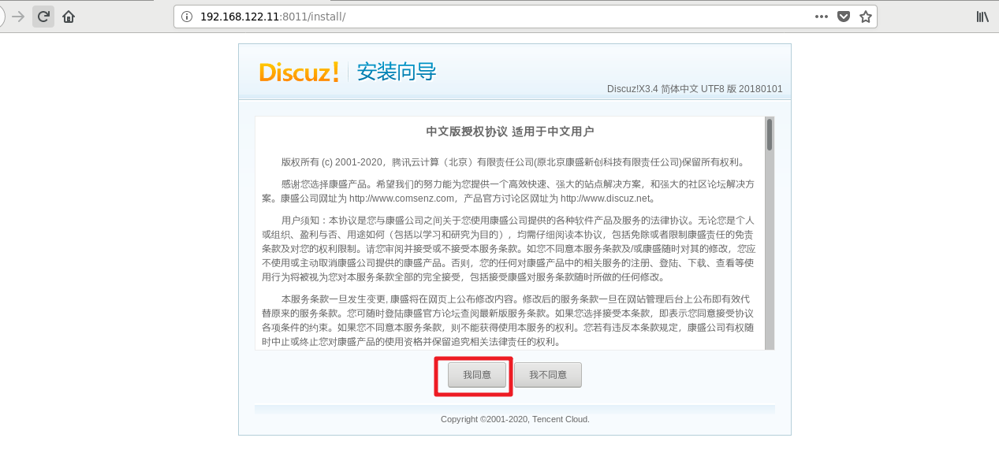
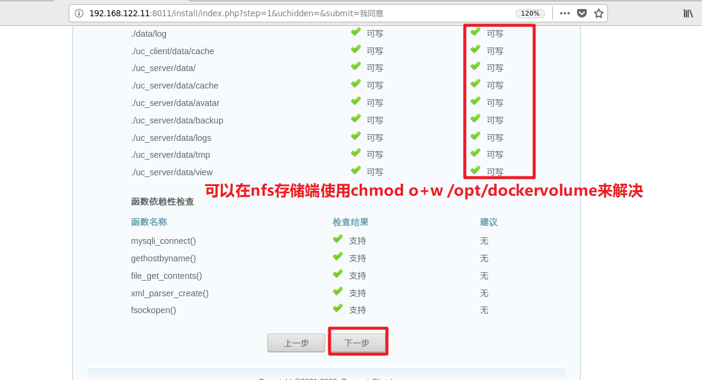
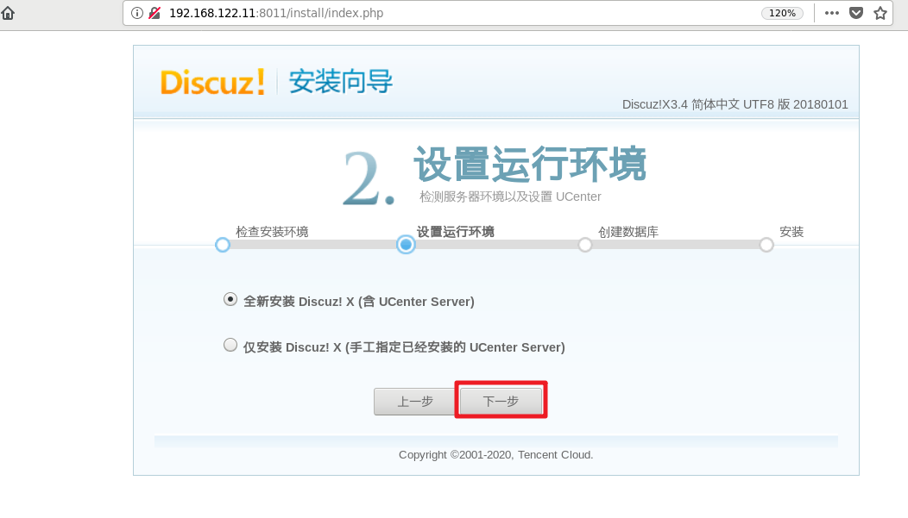
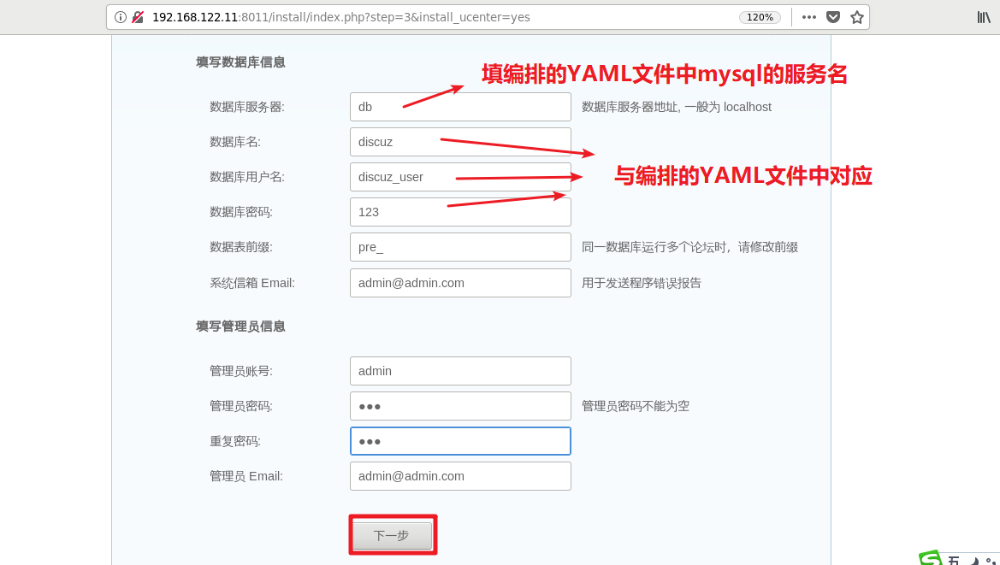

这里将nginx+php做为同一个容器,mysql做为1个容器

# 1, 下载镜像

在linux宿主机上操作

~~~powershell
[root@hostos ~]# docker pull richarvey/nginx-php-fpm
~~~

# 2, 准备是相关配置文件

~~~powershell
[root@hostos ~]# mkdir /root/discuz/dockerfile -p
[root@hostos ~]# cd /root/discuz/dockerfile
~~~

### 准备nginx主配置文件

~~~powershell
[root@hostos dockerfile]# vim nginx.conf
user  nginx;
worker_processes  auto;

error_log  /var/log/nginx/error.log warn;
pid        /var/run/nginx.pid;

events {
    use epoll;
    worker_connections  65535;
}

http {
    include       /etc/nginx/mime.types;
    default_type  application/octet-stream;

    log_format  main  '$remote_addr - $remote_user [$time_local] "$request" '
                      '$status $body_bytes_sent "$http_referer" '
                      '"$http_user_agent" "$http_x_forwarded_for"';
    access_log  /var/log/nginx/access.log  main;
    sendfile        on;
    #tcp_nopush     on;
    keepalive_timeout  65;
    #gzip  on;
    include /etc/nginx/conf.d/*.conf;
}
~~~

### 准备nginx子配置文件

~~~powershell
[root@hostos dockerfile]# vim web.conf
server {
    listen 80;
    server_name _;
    index index.php index.html;
    root /var/www/html;

    location ~ \.php$ {
        fastcgi_pass 127.0.0.1:9000;
        fastcgi_index index.php;
        fastcgi_param SCRIPT_FILENAME $document_root$fastcgi_script_name;
        include fastcgi_params;
    }
}
~~~

### 准备时区文件

~~~powershell
[root@hostos dockerfile]# cp /etc/localtime .
~~~

### 准备php-fpm子配置文件

~~~powershell
[root@hostos dockerfile]# vim php-fpm-www.conf
[www]
user = nginx
group = nginx
listen = 127.0.0.1:9000
pm = dynamic
pm.max_children = 64
pm.start_servers = 20
pm.min_spare_servers = 5
pm.max_spare_servers = 35
pm.max_requests = 500
rlimit_files = 1024
~~~

# 3, 准备镜像

### 编写Dockerfile

~~~powershell
[root@hostos dockerfile]# vim dockerfile
FROM richarvey/nginx-php-fpm

MAINTAINER daniel@itcast.cn

RUN echo 'Asia/Shanghai' > /etc/timezone && rm -f /etc/nginx/nginx.conf && rm -f /usr/local/etc/php-fpm.d/www.conf

COPY localtime /etc/localtime
COPY nginx.conf /etc/nginx/nginx.conf
COPY web.conf /etc/nginx/conf.d/web.conf
COPY php-fpm-www.conf /usr/local/etc/php-fpm.d/www.conf

CMD /usr/sbin/nginx -c /etc/nginx/nginx.conf && /usr/local/sbin/php-fpm -c /usr/local/etc/php-fpm.conf
~~~

### 构建镜像

~~~powershell
[root@hostos dockerfile]# docker build -f dockerfile -t 192.168.122.18/library/nginx-php-fpm:v1 .
~~~

### 上传镜像到harbor

~~~powershell
[root@hostos dockerfile]# docker login 192.168.122.18

[root@hostos dockerfile]# docker push 192.168.122.18/library/nginx-php-fpm:v1
~~~

# 4, 编排docker stack

## 编写YMAL文件

**在docker swarm集群中的管理节点进行操作**

~~~powershell
[root@manager ~]# cat discuz.yml
version: '3'
services:
  db:
    image: 192.168.122.18/library/mysql:5.7
    environment:
      MYSQL_ROOT_PASSWORD: 123
      MYSQL_DATABASE: discuz
      MYSQL_USER: discuz_user
      MYSQL_PASSWORD: 123
    deploy:
      replicas: 1

  nginx-php:
    image: 192.168.122.18/library/nginx-php-fpm:v1
    depends_on:
      - db
    ports:
      - "8011:80"
    volumes:
    - "nginx_volume:/var/www/html"
    deploy:
      replicas: 1

volumes:
  nginx_volume:
    driver: local
    driver_opts:
      type: "nfs"
      o: "addr=192.168.122.1,rw"
      device: ":/opt/dockervolume"
~~~

### 一键发布stack

~~~powershell
[root@manager ~]# docker stack deploy -c discuz2.yml discuz
Creating network discuz_default
Creating service discuz_db
Creating service discuz_nginx-php
~~~

# 5, 拷贝discuz代码到nfs共享

在nfs服务器上操作(linux宿主机)

~~~powershell
[root@hostos dockerfile]# git clone https://gitee.com/ComsenzDiscuz/DiscuzX.git
~~~

~~~powershell
[root@hostos dockerfile]# cp DiscuzX/upload/* /opt/dockervolume/ -rf
cp: overwrite ‘/opt/dockervolume/index.php’? y
~~~

# 6, 通过浏览器安装

~~~powershell
[root@hostos dockerfile]# chmod o+w -R /opt/dockervolume/
上图少了-R参数，请加上
~~~

