# 通过容器实现部署 wordpress

# 一、什么是容器？

- 用于存储物品
- 现在使用的是虚拟机，可以通过虚拟机部署同类型的应用；通过虚拟机隔离应用运行的环境
- 虚拟机优点：隔离环境
- 虚拟机缺点：需要单独安装操作系统；虚拟机磁盘占用物理机磁盘空间；启动过程浪费时间
- 马上要使用的容器：不需要安装操作系统；能够像虚拟机一样可以提供应用运行的隔离环境；启动过程时间较短。

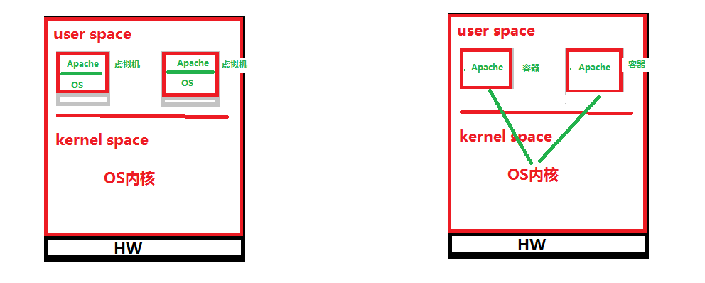

# 二、容器管理工具

- 虚拟机管理工具
  - vmware workstation
  - virtualbox
  - hyper-v
  - kvm

- 容器管理工具
  - Docker
    - docker-ce
    - docker-ee

# 三、容器管理工具部署 Docker

## 3.1 docker官网

www.docker.com

## 3.2 docker部署文档官址

docs.docker.com

## 3.3 通过百度搜索docker部署文档官址

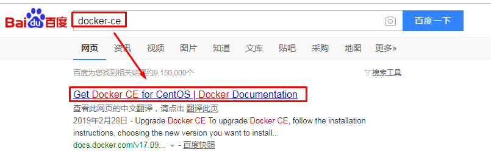

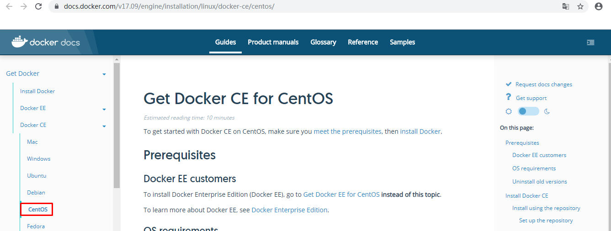

## 3.4 通过清华大学开源软件镜像站实现docker-ce部署

### 3.4.1 获取YUM源

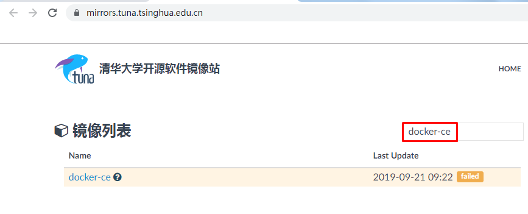

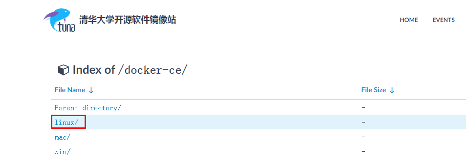

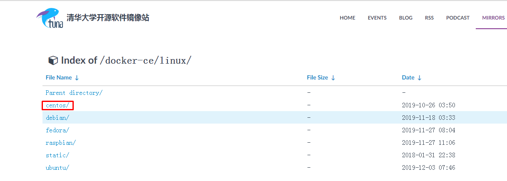

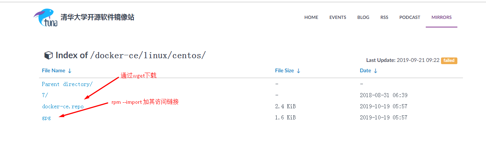

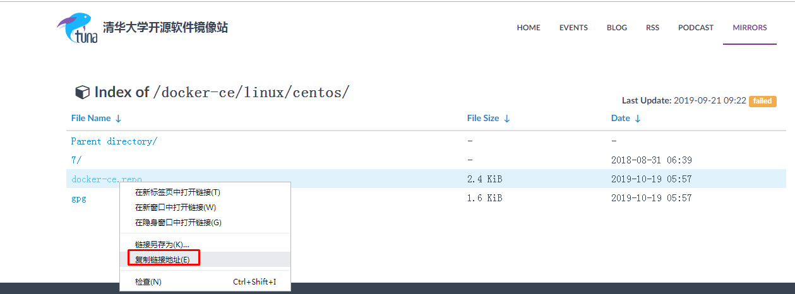

~~~powershell
[root@localhost ~]# wget -O /etc/yum.repos.d/docker-ce.repo https://mirrors.tuna.tsinghua.edu.cn/docker-ce/linux/centos/docker-ce.repo

[root@localhost ~]# ls /etc/yum.repos.d/
CentOS-Base.repo  CentOS-Debuginfo.repo  CentOS-Media.repo    CentOS-Vault.repo
CentOS-CR.repo    CentOS-fasttrack.repo  CentOS-Sources.repo  docker-ce.repo
~~~

~~~powershell
[root@localhost ~]# yum -y install docker-ce
~~~

### 3.4.2 启动docker

~~~powershell
[root@localhost ~]# systemctl enable docker
Created symlink from /etc/systemd/system/multi-user.target.wants/docker.service to /usr/lib/systemd/system/docker.service.
[root@localhost ~]# systemctl start docker
[root@localhost ~]# docker version
Client: Docker Engine - Community
 Version:           19.03.5
 API version:       1.40
 Go version:        go1.12.12
 Git commit:        633a0ea
 Built:             Wed Nov 13 07:25:41 2019
 OS/Arch:           linux/amd64
 Experimental:      false

Server: Docker Engine - Community
 Engine:
  Version:          19.03.5
  API version:      1.40 (minimum version 1.12)
  Go version:       go1.12.12
  Git commit:       633a0ea
  Built:            Wed Nov 13 07:24:18 2019
  OS/Arch:          linux/amd64
  Experimental:     false
 containerd:
  Version:          1.2.10
  GitCommit:        b34a5c8af56e510852c35414db4c1f4fa6172339
 runc:
  Version:          1.0.0-rc8+dev
  GitCommit:        3e425f80a8c931f88e6d94a8c831b9d5aa481657
 docker-init:
  Version:          0.18.0
  GitCommit:        fec3683
~~~

# 四、容器管理工具生态

- 容器镜像
  - 包含对容器文件或目录的组织方式

- docker daemon
  - docker守护进程

- 容器镜像仓库
  - docker官方容器镜像网址:hub.docker.com  简称为“dockerhub”

- docker client
  - 通过docker client访问API给docker daemon下达创建容器的指令

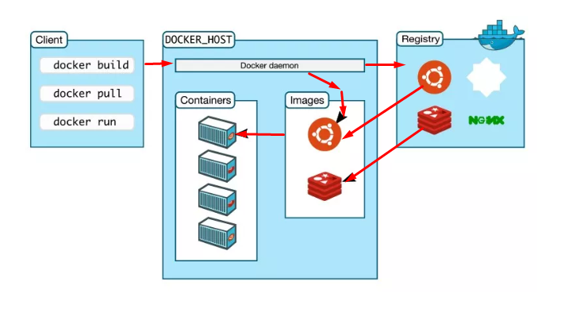

# 五、容器运行

## 5.1 运行一个容器的条件

- docker daemon
- docker client
- 容器镜像
- 容器镜像仓库  dockerhub  hub.docker.com

## 5.2 下载一个容器镜像

### 5.2.1 容器镜像分类

- 系统类容器镜像 CentOS
- 应用类容器镜像 Apache
  - 基础系统类容器镜像，包含文件系统，不包含操作系统。

### 5.2.2 下载一个系统类容器镜像

~~~powershell
搜索dockerhub是否有centos容器镜像
[root@localhost ~]# docker search centos
NAME                               DESCRIPTION                                     STARS               OFFICIAL            AUTOMATED
centos                             The official build of CentOS.                   5711                [OK]

下载centos容器镜像
[root@localhost ~]# docker pull centos

验证centos容器镜像是否下载
[root@localhost ~]# docker images
REPOSITORY          TAG                 IMAGE ID            CREATED             SIZE
centos              latest              0f3e07c0138f        2 months ago        220MB
~~~

## 5.3 运行一个容器

~~~powershell
[root@localhost ~]# docker run -it --name=c1  centos:latest /bin/bash
[root@2bea13ddd178 /]# ls
bin  etc   lib    lost+found  mnt  proc  run   srv  tmp  var
dev  home  lib64  media       opt  root  sbin  sys  usr
[root@2bea13ddd178 /]# ping -c 4 www.baidu.com
PING www.a.shifen.com (180.101.49.12) 56(84) bytes of data.
64 bytes from 180.101.49.12 (180.101.49.12): icmp_seq=1 ttl=127 time=23.7 ms
64 bytes from 180.101.49.12 (180.101.49.12): icmp_seq=2 ttl=127 time=30.1 ms
64 bytes from 180.101.49.12 (180.101.49.12): icmp_seq=3 ttl=127 time=34.3 ms
64 bytes from 180.101.49.12 (180.101.49.12): icmp_seq=4 ttl=127 time=27.8 ms

--- www.a.shifen.com ping statistics ---
4 packets transmitted, 4 received, 0% packet loss, time 15ms
rtt min/avg/max/mdev = 23.677/28.968/34.305/3.848 ms

[root@2bea13ddd178 /]# exit
exit

~~~

# 六、使用容器部署wordpress

## 6.1 准备部署wordpress需要的镜像文件

- wordpress:latest
- mysql:5.7

~~~powershell
[root@localhost ~]# docker pull wordpress:latest

[root@localhost ~]# docker pull mysql:5.7

[root@localhost ~]# docker images
REPOSITORY          TAG                 IMAGE ID            CREATED             SIZE
centos              latest              0f3e07c0138f        2 months ago        220MB
[root@localhost ~]# ls
anaconda-ks.cfg  mysql.tar  wordpress.tar
[root@localhost ~]# docker load -i wordpress.tar
831c5620387f: Loading layer  72.48MB/72.48MB
17fce12edef0: Loading layer  3.584kB/3.584kB
840f3f414cf6: Loading layer  231.4MB/231.4MB
ec64f555d498: Loading layer   5.12kB/5.12kB
e38834ac7561: Loading layer  46.64MB/46.64MB
6a4d393f0795: Loading layer  9.728kB/9.728kB
9691e5d7a4c7: Loading layer   7.68kB/7.68kB
ac313d2d914d: Loading layer   13.4MB/13.4MB
ead3ede9feb1: Loading layer  4.096kB/4.096kB
7b03072dc50c: Loading layer  55.23MB/55.23MB
cdf8c7eed99e: Loading layer  12.29kB/12.29kB
6523762482cc: Loading layer  4.608kB/4.608kB
8a36a30fa3f8: Loading layer  3.584kB/3.584kB
44f3f5a16463: Loading layer  4.608kB/4.608kB
19a99faf1fdd: Loading layer  47.68MB/47.68MB
c27c1201bf20: Loading layer  38.16MB/38.16MB
b33192396211: Loading layer  4.608kB/4.608kB
0e7c4fb948b6: Loading layer  4.608kB/4.608kB
21a3c6e7d195: Loading layer  92.16kB/92.16kB
9fb774257dd2: Loading layer  46.23MB/46.23MB
2fe8f3117584: Loading layer  12.29kB/12.29kB
Loaded image: wordpress:latest
[root@localhost ~]# docker load -i mysql.tar
99b5261d397c: Loading layer  58.51MB/58.51MB
5a8a245abd1c: Loading layer  338.4kB/338.4kB
51734435c93c: Loading layer  10.44MB/10.44MB
6599033b2ab2: Loading layer  4.472MB/4.472MB
414373ffccb4: Loading layer  1.536kB/1.536kB
2a9aab74013a: Loading layer  46.15MB/46.15MB
7055b7f82e4c: Loading layer   34.3kB/34.3kB
398ef8a407f7: Loading layer  3.584kB/3.584kB
fc12e028de3b: Loading layer  321.7MB/321.7MB
934de0c0816e: Loading layer  15.87kB/15.87kB
94a471180601: Loading layer  1.536kB/1.536kB
Loaded image: mysql:5.7
[root@localhost ~]# docker images
REPOSITORY          TAG                 IMAGE ID            CREATED             SIZE
wordpress           latest              ee025cbcbc20        3 days ago          539MB
mysql               5.7                 1e4405fe1ea9        2 weeks ago         437MB
centos              latest              0f3e07c0138f        2 months ago        220MB
~~~

## 6.2 准备docker-compose工具

> 为接下来启动容器进行编排
>
> LAMP 先启动mysql,再启动apache
>
> 部署wordpress应用时，应该先启动mysql容器，再启动wordpress

~~~powershell
准备epel YUM源
[root@localhost ~]# wget -O /etc/yum.repos.d/epel.repo http://mirrors.aliyun.com/repo/epel-7.repo

[root@localhost ~]# ls /etc/yum.repos.d/
CentOS-Base.repo  CentOS-Debuginfo.repo  CentOS-Media.repo    CentOS-Vault.repo  epel.repo
CentOS-CR.repo    CentOS-fasttrack.repo  CentOS-Sources.repo  docker-ce.repo

准备pip工具，用于批量管理python语言开发的工具包

[root@localhost ~]# yum -y install python2-pip

由于有安装依赖，建议把下面所有软件包安装后，再安装docker-compose
[root@localhost ~]# yum update
[root@localhost ~]# yum -y install gcc libffi-devel python-devel openssl-devel openldap-devel

[root@localhost ~]# pip install python-ldap --user -U

[root@localhost ~]# pip install six --user -U

[root@localhost ~]# pip install pyudev --user -U

[root@localhost ~]# pip install dnspython --user -U

[root@localhost ~]# pip install cffi --user -U

安装docker-compose
[root@localhost ~]# pip install docker-compose --ignore-installed requests

验证是否安装成功
[root@localhost ~]# docker-compose version
docker-compose version 1.25.0, build b42d419
docker-py version: 4.1.0
CPython version: 2.7.5
OpenSSL version: OpenSSL 1.0.2k-fips  26 Jan 2017
~~~

## 6.3 准备部署文件

> LAMP或LNMP
>
> L是系统，AP已经生成容器镜像，M是容器镜像。
>
> yaml文件

~~~powershell
准备容器镜像文件
[root@localhost ~]# docker images
REPOSITORY          TAG                 IMAGE ID            CREATED             SIZE
wordpress           latest              ee025cbcbc20        3 days ago          539MB
mysql               5.7                 1e4405fe1ea9        2 weeks ago         437MB
~~~

### 6.3.1 YAML文件介绍

- YAML 也是一种标记语言
- YAML 帮助网址 http://www.yaml.org

### 6.3.2 wordpress部署文件准备

#### 6.3.2.1 工程目录创建

~~~powershell
[root@localhost ~]# mkdir wordpressproject
[root@localhost ~]# cd wordpressproject/
~~~

#### 6.3.2.2 包含工程文件

> 工程文件就是docker-compose.yaml
>
> 工程文件中包含service
>
> 本次工程文件中包含wordpress、db服务
>
> 服务使用容器运行

~~~powershell
[root@localhost wordpressproject]# cat docker-compose.yaml
version: '3'
services:
  db:
    image: mysql:5.7
    volumes:
    - "./data:/var/lib/mysql"
    restart: always
    environment:
      MYSQL_ROOT_PASSWORD: wordpress
      MYSQL_DATABASE: wordpress
      MYSQL_USER: wordpress
      MYSQL_PASSWORD: wordpress
    expose:
    - "3306"
  wordpress:
    depends_on:
    - db
    image: wordpress:latest
    links:
    - db
    ports:
    - "8080:80"
    restart: always
    environment:
      WORDPRESS_DB_HOST: db:3306
      WORDPRESS_DB_PASSWORD: wordpress
~~~

这个应用定义了两个容器服务：db, wordpress

db容器通过mysql:5.7镜像启动

- MySQL的数据目录挂载到当前目录./data，此目录不存在会自动创建
- 容器重启策略为always
- 设置了连接mysql的4个变量

wordpress容器通过wordpress:latest启动

- 需要db容器先启动再启动wordpress容器
- wordpress容器要link连接db容器
- wordpress容器将80端口映射到宿主机的8010端口
- 容器重启策略为always
- 设置连接数据库的变量

#### 6.3.2.3 启动工程

~~~powershell
如何使用docker-compose
[root@localhost wordpressproject]# docker-compose --help

[root@localhost wordpressproject]# docker-compose up 
此命令只能在工程目录中使用，用于启动工程

[root@localhost wordpressproject]# docker-compose down
停止并删除工程已经创建的容器

~~~

~~~powershell
[root@localhost wordpressproject]# docker-compose up
Creating network "wordpressproject_default" with the default driver
Creating wordpressproject_db_1 ... done
Creating wordpressproject_wordpress_1 ... done

[root@localhost ~]# docker ps
CONTAINER ID        IMAGE               COMMAND                  CREATED              STATUS              PORTS                  NAMES
4cf5f4cee330        wordpress:latest    "docker-entrypoint.s…"   About a minute ago   Up About a minute   0.0.0.0:8080->80/tcp   wordpressproject_wordpress_1
4d9cb6aee451        mysql:5.7           "docker-entrypoint.s…"   About a minute ago   Up About a minute   3306/tcp, 33060/tcp    wordpressproject_db_1

[root@localhost ~]# ls
anaconda-ks.cfg  mysql.tar  wordpressproject  wordpress.tar
[root@localhost ~]# cd wordpressproject/
[root@localhost wordpressproject]# ls
data  docker-compose.yaml

[root@localhost wordpressproject]# ls data
auto.cnf         client-key.pem  ib_logfile1         private_key.pem  sys
ca-key.pem       ib_buffer_pool  ibtmp1              public_key.pem   wordpress
ca.pem           ibdata1         mysql               server-cert.pem
client-cert.pem  ib_logfile0     performance_schema  server-key.pem
[root@localhost wordpressproject]# ls data/wordpress/
db.opt

~~~

## 6.4 访问

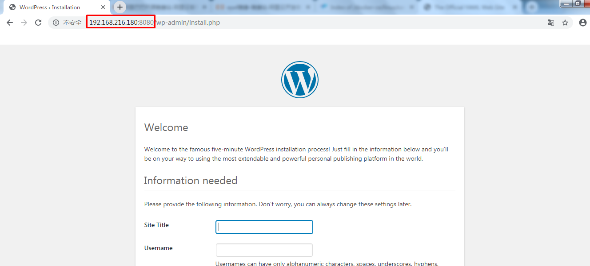

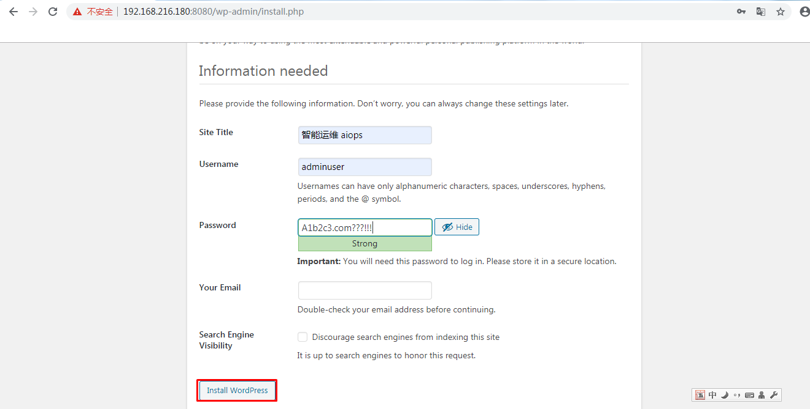

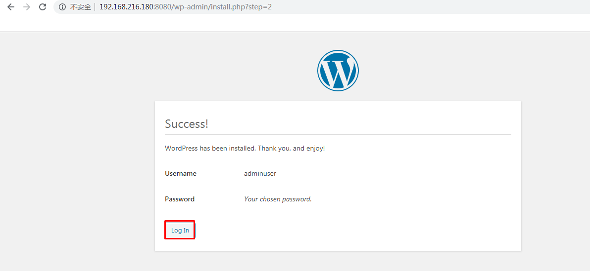

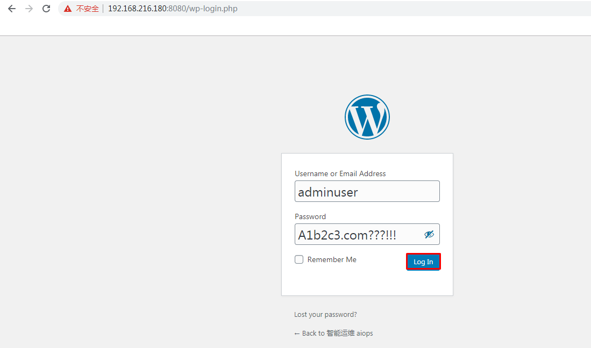

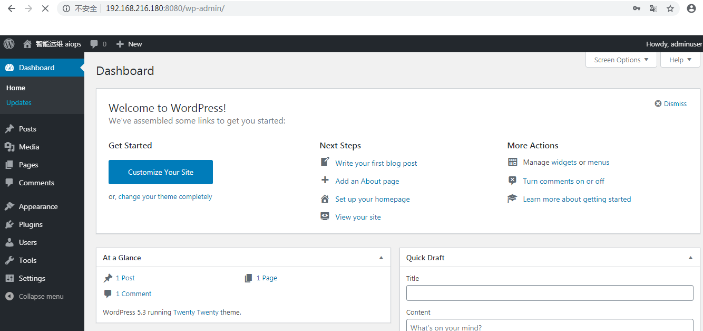

