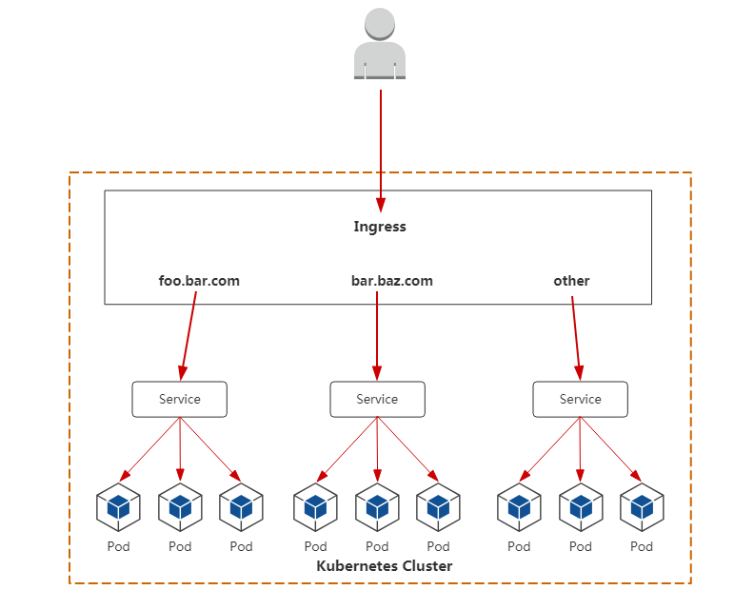
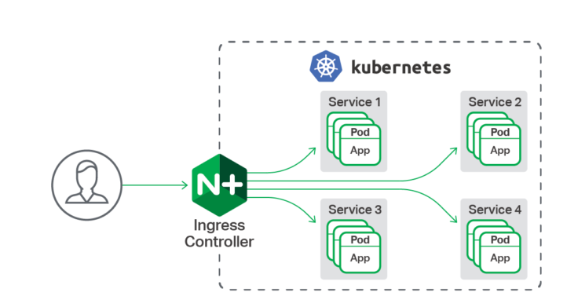
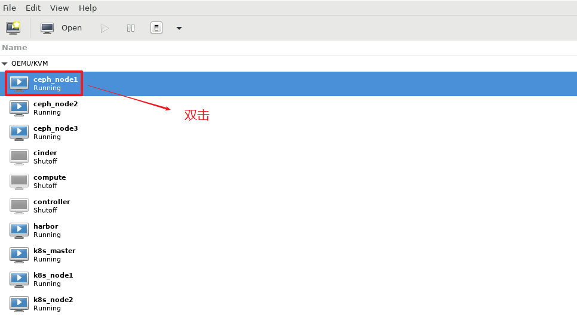
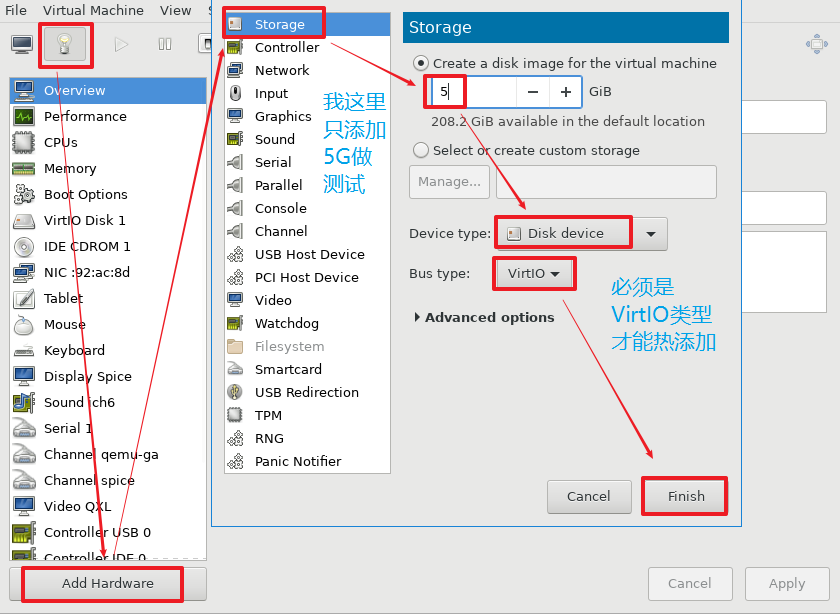
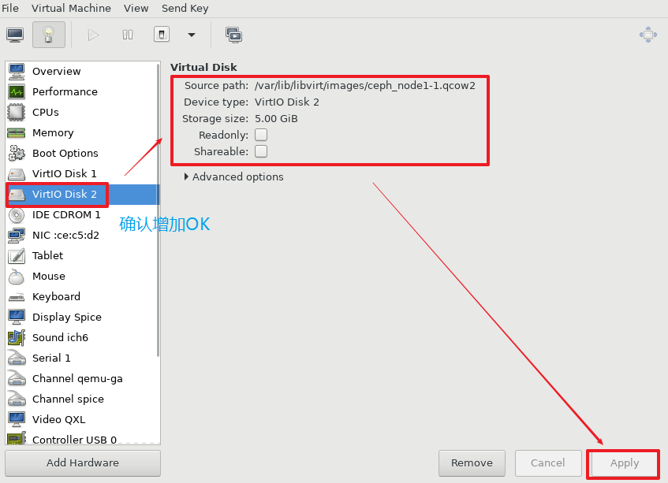

# 一、ingress controller

ingress controller可以为外网用户访问K8S集群内部pod提供代理服务。

- 提供全局访问代理
- 访问流程
  - 用户-->ingress controller-->service-->pod





## nginx ingress controller




参考链接：<https://www.nginx.com/products/nginx/kubernetes-ingress-controller>


## nginx ingress controller部署

项目地址：https://github.com/kubernetes/ingress-nginx


下载并修改配置文件

~~~powershell
# wget https://raw.githubusercontent.com/kubernetes/ingress-nginx/master/deploy/static/mandatory.yaml

#修改
210         prometheus.io/port: "10254"
211         prometheus.io/scrape: "true"
212     spec:
213       hostNetwork: true  		# 需要添加这句，使用网络
214       serviceAccountName: nginx-ingress-serviceaccount
~~~


应用配置文件

~~~powershell
# kubectl apply -f mandatory.yaml
namespace/ingress-nginx created
configmap/nginx-configuration created
configmap/tcp-services created
configmap/udp-services created
serviceaccount/nginx-ingress-serviceaccount created
clusterrole.rbac.authorization.k8s.io/nginx-ingress-clusterrole created
role.rbac.authorization.k8s.io/nginx-ingress-role created
rolebinding.rbac.authorization.k8s.io/nginx-ingress-role-nisa-binding created
clusterrolebinding.rbac.authorization.k8s.io/nginx-ingress-clusterrole-nisa-binding created
deployment.apps/nginx-ingress-controller created
limitrange/ingress-nginx created
~~~

验证部署结果，注意镜像较大，可提前下载至集群node节点中。

~~~powershell
# kubectl get pods -n ingress-nginx
NAME                                       READY   STATUS    RESTARTS   AGE
nginx-ingress-controller-5cb7db844-rf958   1/1     Running   0          89s
~~~


## ingress案例

### 创建deployment

```shell
# vim nginx.yaml
apiVersion: extensions/v1beta1
kind: Deployment
metadata:
  name: nginx
  namespace: default
spec:
  replicas: 2
  selector:
    matchLabels:
      app: nginx
  template:
    metadata:
      labels:
        app: nginx
    spec:
      containers:
      - name: c1
        image: nginx:1.15-alpine
        imagePullPolicy: IfNotPresent
```

应用YAML

~~~powershell
# kubectl apply -f nginx.yaml
deployment.extensions/nginx created
~~~

验证pod

~~~powershell
# kubectl get pods
NAME                    READY   STATUS      RESTARTS   AGE
nginx-8cb649c74-x9w7r   1/1     Running     0          119s
nginx-8cb649c74-z8k5b   1/1     Running     0          119s
~~~


### 创建service

```shell
# vim nginx-service.yaml
apiVersion: v1
kind: Service
metadata:
  name: nginx-service
  labels:
    app: nginx
spec:
  ports:
  - port: 80
    targetPort: 80
  selector:
    app: nginx
```

应用YAML

~~~powershell
# kubectl apply -f nginx-service.yaml
service/nginx-service created
~~~

验证service

~~~powershell
# kubectl get svc
NAME               TYPE        CLUSTER-IP   EXTERNAL-IP   PORT(S)   AGE
kubernetes         ClusterIP   10.2.0.1     <none>        443/TCP   19h
nginx-service      ClusterIP   10.2.2.172   <none>        80/TCP    17s
~~~


### 创建ingress

```shell
# vim ingress-nginx.yaml
apiVersion: extensions/v1beta1
kind: Ingress
metadata:
  name: ingress-nginx                    #自定义ingress名称
spec:
  rules:
  - host: www.haha.com                   # 自定义域名
    http:
      paths:
      - backend:
          serviceName: nginx-service     # 对应上面创建的service名称
          servicePort: 80
```

应用YAML

~~~powershell
# kubectl apply -f ingress-nginx.yaml
ingress.extensions/ingress-nginx created
~~~

验证ingress

~~~powershell
# kubectl get ingress
NAME            HOSTS          ADDRESS   PORTS   AGE
ingress-nginx   www.haha.com             80      18s
~~~

描述查看ingress信息

~~~powershell
# kubectl describe ingress ingress-nginx
Name:             ingress-nginx
Namespace:        default
Address:
Default backend:  default-http-backend:80 (<none>)
Rules:
  Host          Path  Backends
  ----          ----  --------
  www.haha.com
                   nginx-service:80 (10.3.1.59:80,10.3.2.59:80)
Annotations:
  kubectl.kubernetes.io/last-applied-configuration:  {"apiVersion":"extensions/v1beta1","kind":"Ingress","metadata":{"annotations":{},"name":"ingress-nginx","namespace":"default"},"spec":{"rules":[{"host":"www.haha.com","http":{"paths":[{"backend":{"serviceName":"nginx-service","servicePort":80}}]}}]}}

Events:
  Type    Reason  Age   From                      Message
  ----    ------  ----  ----                      -------
  Normal  CREATE  38s   nginx-ingress-controller  Ingress default/ingress-nginx
~~~


## 模拟客户端访问

查询ingress nginx controller所在的主机ip地址

```shell
# kubectl get pods -n ingress-nginx -o wide
NAME                                       READY   STATUS    RESTARTS   AGE   IP               NODE    NOMINATED NODE   READINESS GATES
nginx-ingress-controller-5cb7db844-rf958   1/1     Running   0          58m   192.168.122.13   node2   <none>           <none>
```


在集群之外任一主机中添加上述域名与IP地址解析(模拟公网DNS)

```shell
# vim /etc/hosts

192.168.122.13 www.haha.com
```


准备pod内容器运行的web主页

```shell
# kubectl get pods
NAME                    READY   STATUS      RESTARTS   AGE
nginx-8cb649c74-x9w7r   1/1     Running     0          38m
nginx-8cb649c74-z8k5b   1/1     Running     0          38m

# kubectl exec -it nginx-8cb649c74-x9w7r /bin/sh
/ # echo "ingress web1" > /usr/share/nginx/html/index.html
/ # exit

# kubectl exec -it nginx-8cb649c74-z8k5b /bin/sh
/ # echo "ingress web2" > /usr/share/nginx/html/index.html
/ # exit
```

访问及结果展示

```shell
# curl www.haha.com
ingress web1
# curl www.haha.com
ingress web2
```


## 拓展应用

 **编排ingress--nodeport服务--pod**

自行客户端模拟www.aaa.com访问

~~~powershell
# vim ingress2.yml
apiVersion: extensions/v1beta1
kind: Deployment
metadata:
  name: nginx2
  namespace: default
spec:
  replicas: 2
  selector:
    matchLabels:
      app: nginx2
  template:
    metadata:
      labels:
        app: nginx2
    spec:
      containers:
      - name: c1
        image: nginx:1.15-alpine
        imagePullPolicy: IfNotPresent
---
apiVersion: v1
kind: Service
metadata:
  name: nginx2-svc
  labels:
    app: nginx2
spec:
  type: NodePort
  ports:
  - port: 80
    targetPort: 80
  selector:
    app: nginx2
---
apiVersion: extensions/v1beta1
kind: Ingress
metadata:
  name: ingress2
spec:
  rules:
  - host: www.aaa.com
    http:
      paths:
      - backend:
          serviceName: nginx2-svc
          servicePort: 80

~~~


~~~powershell
apiVersion: extensions/v1beta1
kind: Deployment
metadata:
  name: nginx3
  namespace: default
spec:
  replicas: 2
  selector:
    matchLabels:
      app: nginx3
  template:
    metadata:
      labels:
        app: nginx3
    spec:
      containers:
      - name: c1
        image: nginx:1.15-alpine
        imagePullPolicy: IfNotPresent
---
apiVersion: v1
kind: Service
metadata:
  name: nginx3-svc
  labels:
    app: nginx3
spec:
  clusterIP: None
  type: ClusterIP
  ports:
  - port: 80
    targetPort: 80
  selector:
    app: nginx3
---
apiVersion: extensions/v1beta1
kind: Ingress
metadata:
  name: ingress3
spec:
  rules:
  - host: www.bbb.com
    http:
      paths:
      - backend:
          serviceName: nginx3-svc
          servicePort: 80
~~~


# 二、kubernetes存储卷

## k8s存储卷

- pod有生命周期，生命周期结束后pod里的数据会消失(如配置文件,业务数据等)
- 我们需要将数据与pod分离,将数据放在专门的存储卷上
- pod在k8s集群的节点中是可以调度的, 如果pod挂了被调度到另一个节点,那么数据和pod的联系会中断
- 我们需要与集群节点分离的存储系统才能实现数据持久化

综上所述,我们将存储卷一般分两大类:

- **本地存储卷**
- **外部存储卷(网络存储卷)**


kubernetes支持的存储卷类型非常丰富,使用下面的命令查看:

```powershell
# kubectl explain pod.spec.volumes
```

或者参考: https://kubernetes.io/docs/concepts/storage/

kubernetes支持的存储卷列表如下:

- [awsElasticBlockStore](https://kubernetes.io/docs/concepts/storage/#awselasticblockstore)
- [azureDisk](https://kubernetes.io/docs/concepts/storage/#azuredisk)
- [azureFile](https://kubernetes.io/docs/concepts/storage/#azurefile)
- [cephfs](https://kubernetes.io/docs/concepts/storage/#cephfs)
- [cinder](https://kubernetes.io/docs/concepts/storage/#cinder)
- [configMap](https://kubernetes.io/docs/concepts/storage/#configmap)
- [csi](https://kubernetes.io/docs/concepts/storage/#csi)
- [downwardAPI](https://kubernetes.io/docs/concepts/storage/#downwardapi)
- [emptyDir](https://kubernetes.io/docs/concepts/storage/#emptydir)
- [fc (fibre channel)](https://kubernetes.io/docs/concepts/storage/#fc)
- [flexVolume](https://kubernetes.io/docs/concepts/storage/#flexVolume)
- [flocker](https://kubernetes.io/docs/concepts/storage/#flocker)
- [gcePersistentDisk](https://kubernetes.io/docs/concepts/storage/#gcepersistentdisk)
- [gitRepo (deprecated)](https://kubernetes.io/docs/concepts/storage/#gitrepo)
- [glusterfs](https://kubernetes.io/docs/concepts/storage/#glusterfs)
- [hostPath](https://kubernetes.io/docs/concepts/storage/#hostpath)
- [iscsi](https://kubernetes.io/docs/concepts/storage/#iscsi)
- [local](https://kubernetes.io/docs/concepts/storage/#local)
- [nfs](https://kubernetes.io/docs/concepts/storage/#nfs)
- [persistentVolumeClaim](https://kubernetes.io/docs/concepts/storage/#persistentvolumeclaim)
- [projected](https://kubernetes.io/docs/concepts/storage/#projected)
- [portworxVolume](https://kubernetes.io/docs/concepts/storage/#portworxvolume)
- [quobyte](https://kubernetes.io/docs/concepts/storage/#quobyte)
- [rbd](https://kubernetes.io/docs/concepts/storage/#rbd)
- [scaleIO](https://kubernetes.io/docs/concepts/storage/#scaleio)
- [secret](https://kubernetes.io/docs/concepts/storage/#secret)
- [storageos](https://kubernetes.io/docs/concepts/storage/#storageos)
- [vsphereVolume](https://kubernetes.io/docs/concepts/storage/#vspherevolume)


我们将上面的存储卷列表进行简单的分类: 

- 本地存储卷 
  - emptyDir    pod删除,数据也会被清除, 用于数据的临时存储
  - hostPath     宿主机目录映射(本地存储卷)
- 网络存储卷
  - NAS类           nfs等
  - SAN类           iscsi,FC等
  - 分布式存储   glusterfs,cephfs,rbd,cinder等
  - 云存储           aws,azurefile等


## 存储的选择

市面上的存储产品种类繁多, 但按应用角度主要分为三类:

- 文件存储  如:nfs,glusterfs,cephfs等
  - 优点: 数据共享(多pod挂载可以同读同写)
  - 缺点: 性能较差
- 块存储  如: iscsi,rbd等
  - 优点: 不能实现数据共享
  - 缺点: 性能相对于文件存储好
- 对象存储 如: ceph对象存储
  - 优点: 性能好, 数据共享
  - 缺点: 使用方式特殊,支持较少

面对kubernetes支持的形形色色的存储卷,如何选择成了难题。在选择存储时,我们要抓住核心需求:

- 数据是否需要持久性   
- 数据可靠性  如存储集群节点是否有单点故障,数据是否有副本等
- 性能  
- 扩展性  如是否能方便扩容,应对数据增长的需求
- 运维难度  存储的运维难度是比较高的,尽量选择稳定的开源方案或商业产品
- 成本

总之, 存储的选择是需要考虑很多因素的, 熟悉各类存储产品, 了解它们的优缺点，结合自身需求才能选择合适自己的。


在这里我们需要先部署ceph集群,使用ceph来做网络存储卷。


# 三、ceph集群部署

## 1, 环境准备

准备3台部署ceph集群

~~~powershell
192.168.122.21  ceph_node1
192.168.122.22  ceph_node2
192.168.122.23  ceph_node3
~~~

加上harbor与k8s集群，目前一共7台虚拟机

1, 主机名与主机名绑定

~~~powershell
192.168.122.11  master
192.168.122.12  node1
192.168.122.13  node2
192.168.122.18  harbor					   
192.168.122.21  ceph_node1
192.168.122.22  ceph_node2
192.168.122.23  ceph_node3
~~~

2, 关闭iptables与selinux

3, 时间同步

4, 添加ceph的yum源(将软件包拷贝到所有ceph集群节点，假设为/root/ceph_soft/,再添加以下配置)

**k8s集群的node节点也要添加此源，因为k8s集群是ceph的客户端,需要安装客户端包**

~~~powershell
# vim /etc/yum.repos.d/ceph.repo
[local_ceph]
name=local_ceph
baseurl=file:///root/ceph_soft
gpgcheck=0
enabled=1
~~~


## 2, 配置ceph集群ssh免密

**以ceph_node1为部署节点**,在ceph_node1上配置到所有其它节点的**==ssh免密==**

**目的:** 因为ceph集群会经常同步配置文件到其它节点,有免密会方便很多

**==注意: k8s集群所有节点都为ceph集群的客户端==**

~~~powershell
[root@ceph_node1 ~]# ssh-keygen							# 三次回车做成空密码密钥驿
[root@ceph_node1 ~]# ssh-copy-id ceph_node1
[root@ceph_node1 ~]# ssh-copy-id ceph_node2
[root@ceph_node1 ~]# ssh-copy-id ceph_node3
[root@ceph_node1 ~]# ssh-copy-id master
[root@ceph_node1 ~]# ssh-copy-id node1
[root@ceph_node1 ~]# ssh-copy-id node2
~~~


## 3, 在ceph_node1上安装部署工具

**注意: 只在ceph_node1上安装,因为它是部署节点，其它节点不用安装**

~~~powershell
[root@ceph_node1 ~]# yum install ceph-deploy -y
~~~


## 4, 在ceph_node1上创建集群

**建立一个集群配置目录**

**==注意: 后面的大部分操作都必须要cd到此目录内操作==**

```powershell
[root@ceph_node1 ~]# mkdir /etc/ceph
[root@ceph_node1 ~]# cd /etc/ceph
```

**创建一个ceph集群**

```powershell
[root@ceph_node1 ceph]# ceph-deploy new ceph_node1

[root@ceph_node1 ceph]# ls
ceph.conf  ceph-deploy-ceph.log  ceph.mon.keyring
```


## 5,  安装ceph软件

在**所有ceph集群节点**(`ceph_node1`,`ceph_node2`,`ceph_node3`)上安装ceph与ceph-radosgw软件包

```powershell
# yum install ceph ceph-radosgw -y

# ceph -v
ceph version 13.2.6 (02899bfda814146b021136e9d8e80eba494e1126) mimic (stable)
```


**在ceph客户端节点(k8s集群节点上)安装ceph-common**

```powershell
# yum install ceph-common -y
```


## 6, 创建mon监控组件

1, 增加监控网络, 网段为实验环境的集群物理网络

```powershell
[root@ceph_node1 ceph]# vim /etc/ceph/ceph.conf
......
public network = 192.168.122.0/24							# 添加监控网络
```

2, 监控节点初始化

```powershell
[root@ceph_node1 ceph]# ceph-deploy mon create-initial
[root@ceph_node1 ceph]# ceph health			
HEALTH_OK													# 状态health（健康）
```

3, 将配置文件信息同步到所有节点(**==包括k8s集群节点,后面k8s集群节点上创建存储需要用到==**)

```powershell
[root@ceph_node1 ceph]# ceph-deploy admin ceph_node1 ceph_node2 ceph_node3 master node1 node2
```

4, 验证ceph集群状态

```powershell
[root@ceph_node1 ceph]# ceph -s
  cluster:
    id:     b5bb5919-89fe-42ae-820b-8fc47db8ea03
    health: HEALTH_OK										健康状态为OK

  services:
    mon: 1 daemons, quorum ceph_node1						1个监控
    mgr: no daemons active
    osd: 0 osds: 0 up, 0 in

  data:
    pools:   0 pools, 0 pgs
    objects: 0  objects, 0 B
    usage:   0 B used, 0 B / 0 B avail
    pgs:
```

5, 为了防止mon单点故障, 你可以加多个mon节点(**非必要步骤**)

```powershell
[root@ceph_node1 ceph]# ceph-deploy mon add ceph_node2	
[root@ceph_node1 ceph]# ceph-deploy mon add ceph_node3

[root@ceph_node1 ceph]# ceph -s
  cluster:
    id:     b5bb5919-89fe-42ae-820b-8fc47db8ea03
    health: HEALTH_OK												健康状态为OK
 
  services:
    mon: 3 daemons, quorum ceph_node1,ceph_node2,ceph_node3			3个监控
    mgr: no daemons active							
    osd: 0 osds: 0 up, 0 in
 
  data:
    pools:   0 pools, 0 pgs
    objects: 0  objects, 0 B
    usage:   0 B used, 0 B / 0 B avail
    pgs:     
```

## 7, 调大时间警告的阈值

```powershell
[root@ceph_node1 ceph]# vim ceph.conf
[global]								在global参数组里添加以下两行						
......
mon clock drift allowed = 2	
mon clock drift warn backoff = 30
```

 **同步到所有节点**(**==包括k8s集群节点,后面k8s集群节点上创建存储需要用到==**)

```powershell
[root@ceph_node1 ceph]# ceph-deploy --overwrite-conf admin ceph_node1 ceph_node2 ceph_node3 master node1 node2
```

**所有ceph集群节点(不包括k8s集群节点，k8s在这里是ceph客户端,没有此服务)**上重启ceph-mon.target服务

```powershell
# systemctl restart ceph-mon.target
```


## 8, 创建mgr管理组件

ceph luminous版本之后新增加了一个组件: Ceph Manager Daemon，简称ceph-mgr

该组件的主要作用是分担和扩展monitor的部分功能, 减轻monitor的负担,让更好地管理ceph存储系统

`ceph dashboard`图形管理就需要用到mgr


**1, 创建一个mgr**

```powershell
[root@ceph_node1 ceph]# ceph-deploy mgr create ceph_node1

[root@ceph_node1 ceph]# ceph -s
  cluster:
    id:     b5bb5919-89fe-42ae-820b-8fc47db8ea03
    health: HEALTH_OK

  services:
    mon: 3 daemons, quorum ceph_node1,ceph_node2,ceph_node3
    mgr: ceph_node1(active)							ceph_node1为mgr
    osd: 0 osds: 0 up, 0 in

  data:
    pools:   0 pools, 0 pgs
    objects: 0  objects, 0 B
    usage:   0 B used, 0 B / 0 B avail
    pgs:

```

**2, 添加多个mgr可以实现HA**

```powershell
[root@ceph_node1 ceph]# ceph-deploy mgr create ceph_node2
[root@ceph_node1 ceph]# ceph-deploy mgr create ceph_node3

[root@ceph_node1 ceph]# ceph -s
  cluster:
    id:     b5bb5919-89fe-42ae-820b-8fc47db8ea03
    health: HEALTH_OK											健康状态为OK
 
  services:
    mon: 3 daemons, quorum ceph_node1,ceph_node2,ceph_node3		3个监控
    mgr: ceph_node1(active), standbys: ceph_node2, ceph_node3	ceph_node1为主mgr
    osd: 0 osds: 0 up, 0 in										看到为0个磁盘
 
  data:
    pools:   0 pools, 0 pgs
    objects: 0  objects, 0 B
    usage:   0 B used, 0 B / 0 B avail
    pgs:     
```

至此,ceph集群基本搭建完成. 但还需要增加osd磁盘。


## 9, ceph集群磁盘管理

**物理上添加磁盘**

1, 在ceph集群所有节点上(`ceph_node1`,`ceph_node2`,`ceph_node3`)增加磁盘

(生产环境中可以直连高端存储,在这里我们使用kvm虚拟机来模拟每个增加1个5G的硬盘就好)

kvm在线热添加硬盘









`ceph_node1`,`ceph_node2`,`ceph_node3`三个节点都重复以上动作后验证

```powershell
# lsblk
NAME   MAJ:MIN RM  SIZE RO TYPE MOUNTPOINT
sr0     11:0    1 1024M  0 rom
vda    253:0    0   50G  0 disk
├─vda1 253:1    0  300M  0 part /boot
├─vda2 253:2    0    2G  0 part
└─vda3 253:3    0 47.7G  0 part /
vdb    253:16   0    5G  0 disk								确认添加磁盘成功
```


## 10, 创建osd磁盘

1, 列表所有节点的磁盘, 并使用`zap`命令清除磁盘信息准备创建osd

```powershell
[root@ceph_node1 ceph]# ceph-deploy disk list ceph_node1
[root@ceph_node1 ceph]# ceph-deploy disk list ceph_node2
[root@ceph_node1 ceph]# ceph-deploy disk list ceph_node3

[root@ceph_node1 ceph]# ceph-deploy disk zap ceph_node1 /dev/vdb
[root@ceph_node1 ceph]# ceph-deploy disk zap ceph_node2 /dev/vdb
[root@ceph_node1 ceph]# ceph-deploy disk zap ceph_node3 /dev/vdb
```

2, 创建osd磁盘

```powershell
[root@ceph_node1 ceph]# ceph-deploy osd create --data /dev/vdb ceph_node1
[root@ceph_node1 ceph]# ceph-deploy osd create --data /dev/vdb ceph_node2
[root@ceph_node1 ceph]# ceph-deploy osd create --data /dev/vdb ceph_node3
```

3, 验证

```powershell
[root@ceph_node1 ceph]# ceph -s
  cluster:
    id:     b5bb5919-89fe-42ae-820b-8fc47db8ea03
    health: HEALTH_OK
 
  services:
    mon: 3 daemons, quorum ceph_node1,ceph_node2,ceph_node3
    mgr: ceph_node1(active), standbys: ceph_node2, ceph_node3
    osd: 3 osds: 3 up, 3 in									看到这里有3个osd
 
  data:
    pools:   0 pools, 0 pgs
    objects: 0  objects, 0 B
    usage:   28 MiB used, 15 GiB / 15 GiB avail		大小一共15G（3个5G合成了一个大磁盘)
    pgs:  
```


## 11, 创建cephfs

第1步: 在ceph_node1部署节点上同步配置文件,并创建mds(也可以做多个mds实现HA)

```powershell
[root@ceph_node1 ceph]# ceph-deploy mds create ceph_node1 ceph_node2 ceph_node3
我这里做三个mds
```

第2步:  一个Ceph文件系统需要至少两个RADOS存储池，一个用于数据，一个用于元数据。

```powershell
[root@ceph_node1 ceph]# ceph osd pool create cephfs_pool 128
pool 'cephfs_pool' created
[root@ceph_node1 ceph]# ceph osd pool create cephfs_metadata 64
pool 'cephfs_metadata' created

[root@ceph_node1 ceph]# ceph osd pool ls |grep cephfs
cephfs_pool
cephfs_metadata
```

第3步: 创建Ceph文件系统,并确认客户端访问的节点

```powershell
[root@ceph_node1 ceph]# ceph fs new cephfs cephfs_metadata cephfs_pool
[root@ceph_node1 ceph]# ceph fs ls
name: cephfs, metadata pool: cephfs_metadata, data pools: [cephfs_pool ]

[root@ceph_node1 ceph]# ceph mds stat
cephfs-1/1/1 up  {0=ceph_node3=up:active}, 2 up:standby		这里看到ceph_node3为up状态
```

第4步: 客户端(**==任意一台k8s的node节点来模拟==**)准备验证key文件 

- 说明: ceph默认启用了cephx认证, 所以客户端的挂载必须要验证

```powershell
ceph客户端# cat /etc/ceph/ceph.client.admin.keyring
[client.admin]
        key = AQDEKlJdiLlKAxAARx/PXR3glQqtvFFMhlhPmw==		后面的字符串就是验证需要的
        caps mds = "allow *"
        caps mgr = "allow *"
        caps mon = "allow *"
        caps osd = "allow *"
```

```powershell
ceph客户端# vim admin.key					# 创建一个密钥文件,复制粘贴上面得到的字符串
AQDEKlJdiLlKAxAARx/PXR3glQqtvFFMhlhPmw==
```

第5步:  客户端安装ceph-fuse(使用ceph文件存储的客户端需要fuse)

```powershell
ceph客户端# yum install ceph-fuse
```

第6步:  客户端挂载(**挂载ceph集群中跑了mon监控的节点, mon监控为6789端口**)

```powershell
ceph客户端# mount -t ceph ceph_node1:6789:/ /mnt -o name=admin,secretfile=/root/admin.key
```

第7步: 验证

```powershell
ceph客户端# df -h |tail -1
192.168.122.21:6789:/  3.8G     0  3.8G   0% /mnt
```

第8步: 卸载

~~~powershell
ceph客户端# umount /mnt
~~~


## 12, 创建Ceph块存储

第1步:建立存储池,并初始化

```powershell
ceph客户端# ceph osd pool create rbd_pool 8		
pool 'rbd_pool' created

ceph客户端# rbd pool init rbd_pool
```

第2步:创建一个存储卷

```powershell
ceph客户端# rbd create volume1 --pool rbd_pool --size 5000

ceph客户端# rbd ls rbd_pool
volume1

ceph客户端# rbd info volume1 -p rbd_pool
rbd image 'volume1':						
        size 4.9 GiB in 1250 objects
        order 22 (4 MiB objects)
        id: 149256b8b4567
        block_name_prefix: rbd_data.149256b8b4567
        format: 2							
        features: layering, exclusive-lock, object-map, fast-diff, deep-flatten 
        op_features:
        flags:
        create_timestamp: Sat Aug 17 19:47:51 2019
```

第4步: 将创建的卷映射成块设备

- 因为rbd镜像的一些特性，OS kernel并不支持，所以映射报错

```powershell
ceph客户端# rbd map rbd_pool/volume1
rbd: sysfs write failed
RBD image feature set mismatch. You can disable features unsupported by the kernel with "rbd feature disable rbd_pool/volume1 object-map fast-diff deep-flatten".
In some cases useful info is found in syslog - try "dmesg | tail".
rbd: map failed: (6) No such device or address
```

- 解决方法: disable掉相关特性

```powershell
ceph客户端# rbd feature disable rbd_pool/volume1 exclusive-lock object-map fast-diff deep-flatten
```

- 再次映射

```powershell
ceph客户端# rbd map rbd_pool/volume1
/dev/rbd0
```

第5步: 查看映射(如果要取消映射, 可以使用`rbd unmap /dev/rbd0`)

```powershell
ceph客户端# rbd showmapped
id pool     image   snap device    
0  rbd_pool volume1 -    /dev/rbd0
```


# 四、ConfigMap

## 什么是configmap

在维护docker容器时,有一个传统运维简单但容器化后却很头疼的事,那就是修改配置文件。比如我现在想要修改容器中`/etc/nginx/nginx.conf`配置文件中的一个参数,有如下方法:

- 在构建镜像时,就修改好对应的参数. 但不利于后期有修改需求的情况
- 构建多个不同的配置镜像,如果要修改镜像则直接升级或更新对应的镜像版本
- 使用`docker exec`或`kubectl exec`交互再去进行修改, 这种做法也太麻烦,而且有些镜像没有bash环境,命令也很少,修改起来很痛苦
- 在`docker run`时传递`-v 宿主机上配置文件路径:/etc/nginx/nginx.conf`将宿主机的配置文件与容器内的配置文件映射,能过修改宿主机的配置文件就可以修改到容器内部

在kubernetes集群中也有类似`docker run -v 宿主机上配置文件路径:/etc/nginx/nginx.conf  `的方式:  ConfigMap, 也就是说:

- **kubernetes集群可以使用ConfigMap来实现对容器中应用的配置管理**。
- **可以把ConfigMap看作是一个挂载到pod中的存储卷**


## 创建ConfigMap的4种方式

创建ConfigMap的方式有4种：

1. 通过直接在命令行中指定configmap参数创建，即`--from-literal=key=value`；

```powershell
[root@master ~]# kubectl create configmap cm1 --from-literal=host=127.0.0.1 --from-literal=port=3306
configmap/cm1 created
```

2. 通过指定文件创建，即将一个配置文件创建为一个ConfigMap，`--from-file=文件路径`；

```powershell
[root@master ~]# echo -n 127.0.0.1 > host
[root@master ~]# echo -n 3306 > port				

[root@master ~]# kubectl create configmap cm2 --from-file=./host --from-file=./port
configmap/cm2 created

[root@master ~]# kubectl get cm cm2 -o yaml
apiVersion: v1
data:
  host: 127.0.0.1								# 这里对应OK,如果前面文件里换行了,这里也会有换行
  port: "3306"
kind: ConfigMap
metadata:
  creationTimestamp: "2019-08-11T07:34:16Z"
  name: cm2
  namespace: default
  resourceVersion: "106868"
  selfLink: /api/v1/namespaces/default/configmaps/cm2
  uid: df5fce28-fe7b-4e4d-9acc-9cb1d7cfe26f
```

3. 通过一个文件内多个键值对，`--from-env-file=文件路径`;

```powershell
[root@master ~]# vim env.txt
host=127.0.0.1
port=3306

[root@master ~]# kubectl create configmap cm3 --from-env-file=env.txt
configmap/cm3 created
```

4. 通过`kubectl create/apply -f YMAL文件` 创建

```powershell
[root@master ~]# vim cm4.yml
apiVersion: v1
kind: ConfigMap
metadata:
  name: cm4
data:
  host: 127.0.0.1
  port: "3306"
```

```powershell
[root@master ~]# kubectl apply -f cm4.yml
configmap/cm4 created
```


验证上面创建的4个configmap

```powershell
[root@master ~]# kubectl get cm
NAME   DATA   AGE
cm1    2      16m
cm2    2      14m
cm3    2      7m24s
cm4    2      92s
```


## ConfigMap的使用

使用ConfigMap有2种方式：

- 通过环境变量的方式传递给pod

```powershell
[root@master ~]# vim pod-cm1.yml
apiVersion: v1
kind: Pod
metadata:
  name: pod-cm1
spec:
  containers:
  - name: busybox
    image: busybox
    args: [ "/bin/sh", "-c", "sleep 10000" ]
    envFrom:							# env方式
    - configMapRef:
        name: cm1						# configmap名称
```

```powershell
[root@master ~]# kubectl apply -f pod-cm1.yml
pod/pod-cm1 created
```

```powershell
[root@master ~]# kubectl get pods
NAME               READY   STATUS    RESTARTS   AGE
pod-cm1            1/1     Running   0          9s
```

```powershell
[root@master ~]# kubectl exec pod-cm1 -- env
PATH=/usr/local/sbin:/usr/local/bin:/usr/sbin:/usr/bin:/sbin:/bin
HOSTNAME=pod-cm1
host=127.0.0.1								 # 我们创建的configmap传进去的env
port=3306									 # 我们创建的configmap传进去的env
KUBERNETES_PORT=tcp://10.2.0.1:443
KUBERNETES_PORT_443_TCP=tcp://10.2.0.1:443
KUBERNETES_PORT_443_TCP_PROTO=tcp
KUBERNETES_PORT_443_TCP_PORT=443
KUBERNETES_PORT_443_TCP_ADDR=10.2.0.1
KUBERNETES_SERVICE_HOST=10.2.0.1
KUBERNETES_SERVICE_PORT=443
KUBERNETES_SERVICE_PORT_HTTPS=443
HOME=/root
```


- 通过volume的方式挂载到pod内

```powershell
[root@master ~]# vim pod-cm2.yml
apiVersion: v1
kind: Pod
metadata:
  name: pod-cm2
spec:
  containers:
  - name: busybox
    image: busybox
    args: [ "/bin/sh", "-c", "sleep 10000" ]
    volumeMounts:                               # 用volume挂载方式
    - name: vol-cm                              # 对应下面的volume名
      mountPath: "/etc/mysql"                   # 挂载到容器内部的路径
      readOnly: true                            # 只读

  volumes:
  - name: vol-cm                                # 卷名称
    configMap:
      name: cm2                                 # configmap的名称
```

```powershell
[root@master ~]# kubectl apply -f pod-cm2.yml
pod/pod-cm2 created
```

```powershell
[root@master ~]# kubectl get pod
NAME               READY   STATUS    RESTARTS   AGE
pod-cm2            1/1     Running   0          5s
```

```powershell
[root@master ~]# kubectl exec pod-cm2 -- ls /etc/mysql
host
port
[root@master ~]# kubectl exec pod-cm2 -- cat /etc/mysql/host
127.0.0.1

[root@master ~]# kubectl exec pod-cm2 -- cat /etc/mysql/port
3306
```

## ConfigMap的热更新

如果我在宿主机上修改了value, 那么容器内部会不会更新?

- **通过环境变量的方式传递给pod。这种方式不会热更新**
- **通过volume的方式挂载到pod内。这种方式会热更新,大概需要半分钟左右。**


**验证第1种方式**

1,  编辑修改对应的configmap

```powershell
[root@master ~]# kubectl edit cm cm1
apiVersion: v1
data:
  host: 127.0.0.1
  port: "3307"								3306修改成3307
kind: ConfigMap
metadata:
  creationTimestamp: "2019-08-11T07:31:19Z"
  name: cm1
  namespace: default
  resourceVersion: "106610"
  selfLink: /api/v1/namespaces/default/configmaps/cm1
  uid: 8bb862a5-915f-4b96-9d84-95d2f3fd9f23
```

2, 验证对应的pod里的变化,发现很久都不会改变(**环境变量方式**)

```powershell
[root@master ~]# kubectl exec pod-cm1 -- env |grep port
port=3306									仍然为3306
```


**验证第2种方式**

1, 编辑修改对应的configmap

```powershell
[root@master ~]# kubectl edit cm cm2
apiVersion: v1
data:
  host: 127.0.0.1
  port: "3308"							 		 修改成3308
kind: ConfigMap
metadata:
  creationTimestamp: "2019-08-11T07:34:16Z"
  name: cm2
  namespace: default
  resourceVersion: "106868"
  selfLink: /api/v1/namespaces/default/configmaps/cm2
  uid: df5fce28-fe7b-4e4d-9acc-9cb1d7cfe26f
```

2, 验证对应的pod里的变化,一段时间后会改变(**卷挂载方式**)

```powershell
[root@master ~]# kubectl exec pod-cm2 -- cat /etc/mysql/port
3308										     大概半分钟后更新
```


## 创建用于nginx配置的ConfigMap

**准备nginx子配置文件**

在master节点上实现

```powershell
[root@master ~]# vim web.conf
server {
    listen 80;
    server_name _;
    index index.php index.html;
    root /var/www/html;

    location ~ \.php$ {
        fastcgi_pass 127.0.0.1:9000;
        fastcgi_index index.php;
        fastcgi_param SCRIPT_FILENAME $document_root$fastcgi_script_name;
        include fastcgi_params;
    }
}
```

**创建configmap**

对应刚创建的nginx子配置文件

```powershell
[root@master ~]# kubectl create cm nginx-cm --from-file=./web.conf
configmap/nginx-cm created
```

**验证**

```powershell
[root@master ~]# kubectl get cm
NAME       DATA   AGE
nginx-cm   1      25s
```


# 五、Secret

## 什么是secret

Secret与ConfigMap类似,主要的区别是Secret存储的是密文,而ConfigMap存储的是明文。

所以ConfigMap可以用配置文件管理,而Secret可用于密码,密钥,token等敏感数据的配置管理。


```powershell
[root@master ~]# kubectl create secret -h
Create a secret using specified subcommand.

Available Commands:
  docker-registry Create a secret for use with a Docker registry
  generic         Create a secret from a local file, directory or literal value
  tls             Create a TLS secret

Usage:
  kubectl create secret [flags] [options]

Use "kubectl <command> --help" for more information about a given command.
Use "kubectl options" for a list of global command-line options (applies to all commands).
```

Secret有4种类型:

- Opaque: base64编码格式的Secret，用来存储密码、密钥、信息、证书等，类型标识符为generic

- Service Account: 用来访问Kubernetes API，由Kubernetes自动创建，并且会自动挂载到Pod的/run/secrets/kubernetes.io/serviceaccount目录中
- kubernetes.io/dockerconfigjson: 用来存储私有docker registry的认证信息，类型标识为docker-registry。
- kubernetes.io/tls: 用于为SSL通信模式存储证书和私钥文件，命令式创建类型标识为tls。


## 创建mysql管理员密码Secret

我们使用Opaque类型来创建mysql密码Secret

**第1步: 将明文密码进行base64编码**

Opaque类型密码需要进行base64编码

```powershell
[root@master ~]# echo -n 123 |base64
MTIz
假设密码为123,得到的编码为MTIz
```

**第2步: 编写创建secret的YAML文件**

```powershell
[root@master ~]# vim secret-mysql.yml
apiVersion: v1
kind: Secret
metadata:
  name: secret-mysql
data:
  password: MTIz
```

**第3步: 创建secret并确认**

```powershell
[root@master ~]# kubectl apply -f secret-mysql.yml
secret/secret-mysql created
```

```powershell
[root@master ~]# kubectl get secret |grep secret-mysql
secret-mysql          Opaque                                1      40s
```


## Secret的使用

使用ConfigMap有2种方式：

- 通过环境变量的方式传递给pod

1, 编写pod的YAML文件使用Secret

```powershell
[root@master ~]# vim pod-mysql-secret.yml
apiVersion: v1
kind: Pod
metadata:
  name: pod-mysql-secret1
spec:
  containers:
  - name: mysql
    image: mysql:5.7
    env:
      - name: MYSQL_ROOT_PASSWORD
        valueFrom:
          secretKeyRef:
            name: secret-mysql
            key: password
```

2, 创建pod

```powershell
[root@master ~]# kubectl apply -f pod-mysql-secret.yml
pod/pod-mysql-secret1 created
```

3, 验证pod

```powershell
[root@master ~]# kubectl get pods
NAME                                READY   STATUS    RESTARTS   AGE
pod-mysql-secret1                   1/1     Running   0          1m46s
```

4, 验证传入pod的变量效果

```powershell
[root@master ~]# kubectl exec -it pod-mysql-secret1 -- /bin/bash
root@pod-mysql-secret1:/# env |grep MYSQL_ROOT_PASSWORD
MYSQL_ROOT_PASSWORD=123

root@pod-mysql-secret1:/# mysql -p123
```


- 通过volume的方式挂载到pod内

1, 编写pod的YAML文件使用Secret

```powershell
[root@master ~]# vim pod-mysql-secret2.yml

apiVersion: v1
kind: Pod
metadata:
  name: pod-mysql-secret2
spec:
  containers:
  - name: busybox
    image: busybox
    args:
    - /bin/sh
    - -c
    - sleep 100000
    volumeMounts:
    - name: vol-secret                  # 定义挂载的卷,对应下面定义的卷名
      mountPath: "/opt/passwd"    # 挂载目录(支持热更新),也可以使用subPath挂载文件(但不支持热更新)
      readOnly: true                    # 只读
  volumes:
  - name: vol-secret                    # 定义卷名
    secret:                             # 使用secret
      secretName: secret-mysql              # 对应创建好的secret名
```

2, 创建pod

```powershell
[root@master ~]# kubectl apply -f pod-mysql-secret2.yml
pod/pod-mysql-secret2 created
```

3, 验证pod

```powershell
[root@master ~]# kubectl get pods
NAME                                READY   STATUS    RESTARTS   AGE
pod-mysql-secret2                   1/1     Running   0          15m
```

4, 验证

```powershell
[root@master ~]# kubectl exec  pod-mysql-secret2 -- cat /opt/passwd/password
123												 在容器内都被解码了
```

5, 热更新测试

```powershell
[root@master ~]# echo -n haha123 |base64
aGFoYTEyMw==

[root@master ~]# kubectl edit secret secret-mysql
apiVersion: v1
data:
  password: aGFoYTEyMw==					    密码改成haha123的base64编码
kind: Secret
metadata:
```

```powershell
[root@master ~]# kubectl exec  pod-mysql-secret2 -- cat /opt/passwd/password
haha123										   过一会儿,确认密码确实更新了
```


## 创建访问harbor私有仓库的secret

1, 创建docker-registry类型secret

```powershell
[root@master ~]# kubectl create secret docker-registry registry-harbor --docker-server=192.168.122.18 --docker-username=admin --docker-password=123
```

说明: 

- 类型为docker-registry
- --docker-server指定harbor仓库的IP
- --docker-username指定harbor仓库的登录用户名
- --docker-password指定harbor仓库的登录密码

2, 验证查看

```powershell
[root@master ~]# kubectl get secret |grep registry-harbor
registry-harbor       kubernetes.io/dockerconfigjson        1      7s
```


## 创建访问ceph存储卷secret

因为ceph存储的访问需要cephx认证,所以我们需要将其做成secret方式

**第1步: 再次确认安装ceph客户端**

**在k8s集群所有节点(master,node1,node2)**上安装ceph客户端软件包

**如果已经安装过跳过此步**

```powershell
# yum install ceph-common common-fuse -y
```

**第2步: 同步ceph集群配置文件**

在ceph的部署节点node1上把配置文件同步到所有节点(ceph集群与k8s集群所有节点)

```powershell
[root@ceph_node1 ~]# cd /etc/ceph
[root@ceph_node1 ceph]# ceph-deploy --overwrite-conf admin ceph_node1 ceph_node2 ceph_node3 master node1 node2
```

**第3步: 查看访问ceph集群的key**

上一步同步过配置文件的节点都可以查看

```powershell
[root@master ~]# cat /etc/ceph/ceph.client.admin.keyring
[client.admin]
        key = AQDEKlJdiLlKAxAARx/PXR3glQqtvFFMhlhPmw==			key对应的值用于验证
        caps mds = "allow *"
        caps mgr = "allow *"
        caps mon = "allow *"
        caps osd = "allow *"
```

**第4步: 对key进行base64编码**

```powershell
[root@master ~]# echo AQDEKlJdiLlKAxAARx/PXR3glQqtvFFMhlhPmw== |base64
QVFERUtsSmRpTGxLQXhBQVJ4L1BYUjNnbFFxdHZGRk1obGhQbXc9PQo=
```

**第5步: 编写创建secret的YAML文件**

```powershell
[root@master ~]# vim ceph-secret.yml
apiVersion: v1
kind: Secret
metadata:
  name: ceph-secret
data:
  key: QVFERUtsSmRpTGxLQXhBQVJ4L1BYUjNnbFFxdHZGRk1obGhQbXc9PQo=
```

**第6步: 创建secret并验证**

```powershell
[root@master ~]# kubectl apply -f ceph-secret.yml
secret/ceph-secret created
```

```powershell
[root@master ~]# kubectl get secret  |grep ceph
ceph-secret           Opaque                                1      29s
```


# 六、PV与PVC

## 认识pv与pvc

kubernetes存储卷的分类太丰富了,每种类型都要写相应的接口与参数才行，这就让维护与管理难度加大。


persistenvolume(**PV**) 是配置好的一段存储(可以是任意类型的存储卷)

- 也就是说将网络存储共享出来,配置定义成PV。


PersistentVolumeClaim(**PVC**)是用户pod使用PV的申请请求。

- 用户不需要关心具体的volume实现细节,只需要关心使用需求。


## pv与pvc之间的关系

- pv提供存储资源(生产者)
- pvc使用存储资源(消费者)
- 使用pvc绑定pv


## 实现cephfs类型pv与pvc

**第1步: 确认已创建好的cephfs**

前面章节我们已经创建过cephfs文件存储,在这里再确认一下，确认OK后才能继续创建pv与pvc

```powershell
[root@ceph_node1 ~]# ceph mds stat			
cephfs-1/1/1 up  {0=ceph_node3=up:active}, 2 up:standby
```

如果创建过又删除的,请再次创建(参考: `创建ceph文件存储`章节)

**第2步: 确认k8s集群node节点安装ceph-fuse**

因为cephfs的客户端需要ceph-fuse来挂载, 所以请确认k8s集群node节点已经安装

k8s集群master节点不用安装, 因为我们不在master节点上使用cephfs挂载

```powershell
[root@node1 ~]# yum install ceph-fuse -y

[root@node2 ~]# yum install ceph-fuse -y
```

**第3步: 编写创建pv的YAML文件**

在k8s集群的master节点上操作

```powershell
[root@master ~]# vim pv-cephfs.yml
apiVersion: v1
kind: PersistentVolume								# 类型为PersistentVolume(pv)
metadata:
  name: pv-cephfs									# pv的名称
spec:
  capacity:
    storage: 1Gi									# 大小
  accessModes:
    - ReadWriteMany									# 访问模式
  cephfs:											# 存储卷类型为cephfs
    monitors:
      - 192.168.122.21:6789
      - 192.168.122.22:6789
      - 192.168.122.23:6789		 # 这3个为ceph集群三个节点的地址和mon的端口（写其中1个也OK)
    user: admin					 # ceph客户端挂载时的用户
    path: /						 # 挂载的cephfs的源路径
    secretRef:
      name: ceph-secret			 # 对应的ceph的secret
```

* 参考下面的cephfs客户端挂载命令

```powershell
# mount -t ceph 192.168.122.23:6789:/ /mnt -o name=admin,secretfile='/root/admin.key'
其中/root/admin.key里包含了key的值(没有base64编码的)
```

访问模式有3种       参考: https://kubernetes.io/docs/concepts/storage/persistent-volumes/#access-modes

- ReadWriteOnce 单节点读写挂载
- ReadOnlyMany  多节点只读挂载
- ReadWriteMany  多节点读写挂载

cephfs存储卷3种类型都支持, 我们要实现多个nginx跨节点之间的数据共享,所以选择ReadWriteMany模式。

**第4步: 创建pv并验证**

```powershell
[root@master ~]# kubectl apply -f pv-cephfs.yml
persistentvolume/pv-cephfs created
```

```powershell
[root@master ~]# kubectl get pv
NAME        CAPACITY   ACCESS MODES   RECLAIM POLICY   STATUS      CLAIM   STORAGECLASS   REASON   AGE
pv-cephfs   1Gi        RWX            Retain           Available                      3s
```

说明: 

- RWX为ReadWriteMany的简写
- Retain是回收策略  
  - Retain表示需要不使用了需要手动回收
  - 参考: https://kubernetes.io/docs/concepts/storage/persistent-volumes/#reclaim-policy

**第5步: 编写创建pvc的YAML文件**

```powershell
[root@master ~]# vim pvc-cephfs.yml
apiVersion: v1
kind: PersistentVolumeClaim					# 类型为PersistentVolumeClaim(pvc)
metadata:
  name: pvc-cephfs							# pvc的名字
spec:
  accessModes:
    - ReadWriteMany							# 多节点读写挂载模式
  resources:
    requests:
      storage: 1Gi							# 大小要与pv的大小保持一致
```

**第6步: 创建pvc并验证**

```powershell
[root@master ~]# kubectl apply -f pvc-cephfs.yml
persistentvolumeclaim/pvc-cephfs created
```

```powershell
[root@master ~]# kubectl get pvc
NAME         STATUS   VOLUME      CAPACITY   ACCESS MODES   STORAGECLASS   AGE
pvc-cephfs   Bound    pv-cephfs   1Gi        RWX                           5s
```

**注意:** STATUS必须为Bound状态(Bound状态表示pvc与pv绑定OK)


## 实现ceph块存储pv与pvc

**第1步: 在k8s集群node节点上创建ceph块存储**

ceph rbd块存储与cephfs文件系统方式不一样:

- cephfs是在cephfs集群上创建好, 客户端挂载就好
- ceph rbd块存储是需要在客户端创建map映射挂载,k8s集群多个node节点都需要挂载

**如果在前面`创建Ceph块存储`已经创建过, 则跳过这一步, 否则请创建**

先把ceph配置文件同步到k8s的node1与node2节点，这样才能在node1与node2上创建rbd

~~~powershell
[root@ceph_node1 ceph]# ceph-deploy --overwrite-conf admin ceph_node1 ceph_node2 ceph_node3 node1 node2
~~~


```powershell
[root@node1 ~]# ceph osd pool create rbd_pool 8

[root@node1 ~]# rbd pool init rbd_pool
[root@node1 ~]# rbd create volume1 --pool rbd_pool --size 5000
[root@node1 ~]# rbd feature disable rbd_pool/volume1 exclusive-lock object-map fast-diff deep-flatten

[root@node1 ~]# rbd map rbd_pool/volume1
/dev/rbd0

[root@node1 ~]# rbd showmapped
id pool     image   snap device
0  rbd_pool volume1 -    /dev/rbd0

注意这里的pool名:rbd_pool, image名:volume1,这两个名字都要在kubernetes集群创建pv时对应
```

在k8s集中的node2节点只需要做如下操作

```powershell
[root@node2 ~]# rbd map rbd_pool/volume1
/dev/rbd0
[root@node2 ~]# rbd showmapped
id pool     image   snap device
0  rbd_pool volume1 -    /dev/rbd0
```

**第2步: 编写创建pv的YAML文件**

```powershell
[root@master ~]# vim pv-cephrbd.yml
apiVersion: v1
kind: PersistentVolume
metadata:
  name: pv-cephrbd
spec:
  capacity:
    storage: 2Gi						# 大小
  accessModes:
    - ReadWriteOnce           # rbd块存储是不支持多节点同时读写的,所以这里使用ReadWriteOnce
  rbd:                               	# ceph rbd类型
    monitors:
      - 192.168.122.21:6789
      - 192.168.122.22:6789
      - 192.168.122.23:6789        # 这3个为ceph集群三个节点的地址和mon的端口（写1个也可以)
    pool: rbd_pool                      # 对应ceph创建的pool名
    image: volume1                      # 对应ceph创建的image名
    user: admin                         # 访问用户名
    fsType: xfs                   # 块存储挂载后格式化的xfs(不用自己格式化,它会帮我们格式化)
    secretRef:
      name: ceph-secret                 # 对应的secret
```

**第3步: 创建pv并验证**

```powershell
[root@master ~]# kubectl apply -f pv-cephrbd.yml
persistentvolume/pv-cephrbd created
```

```powershell
[root@master ~]# kubectl get pv
NAME         CAPACITY   ACCESS MODES   RECLAIM POLICY   STATUS      CLAIM                STORAGECLASS   REASON   AGE
pv-cephfs    1Gi        RWX    Retain    Bound  default/pvc-cephfs        93m
pv-cephrbd   2Gi        RWO    Retain    Available                        22s
```

说明: 

- RWO为ReadWriteOnce访问模式

**第4步: 编写创建pvc的YAML文件**

```powershell
[root@master ~]# vim pvc-cephrbd.yml
apiVersion: v1
kind: PersistentVolumeClaim
metadata:
  name: pvc-cephrbd
spec:
  accessModes:
    - ReadWriteOnce
  resources:
    requests:
      storage: 2Gi							# 大小要对应
```

**第5步: 创建pvc并验证**

```powershell
[root@master test]# kubectl apply -f pvc-cephrbd.yml
persistentvolumeclaim/pvc-cephrbd created


[root@master ~]# kubectl get pvc
NAME          STATUS   VOLUME       CAPACITY   ACCESS MODES   STORAGECLASS   AGE
pvc-cephfs    Bound    pv-cephfs    1Gi        RWX                           90m
pvc-cephrbd   Bound    pv-cephrbd   2Gi        RWO                           5s
```


