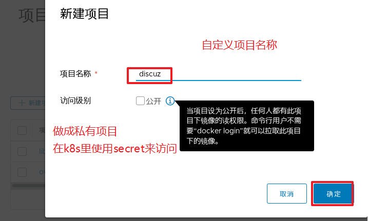
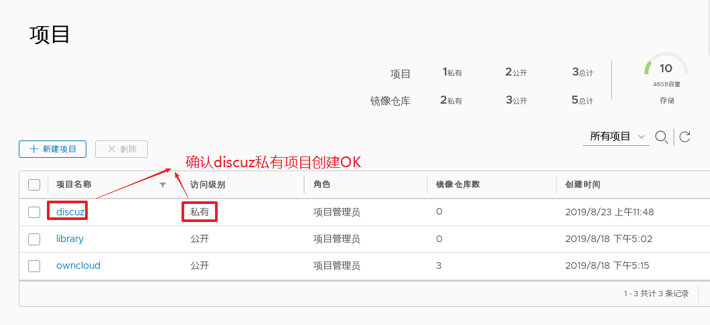
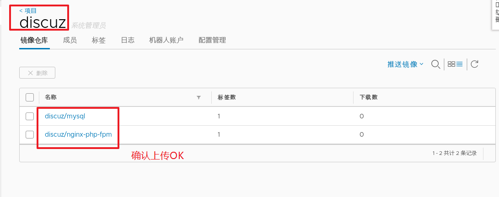
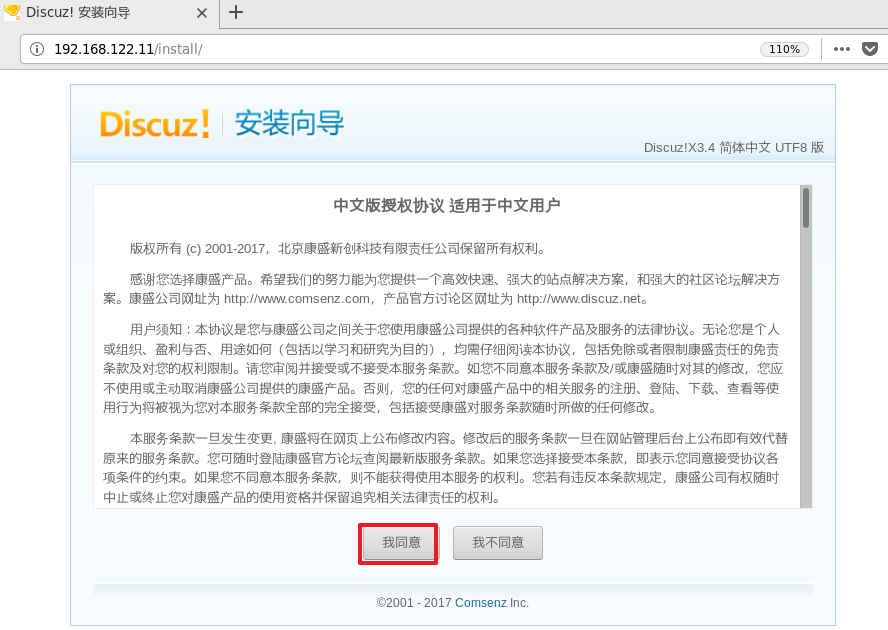
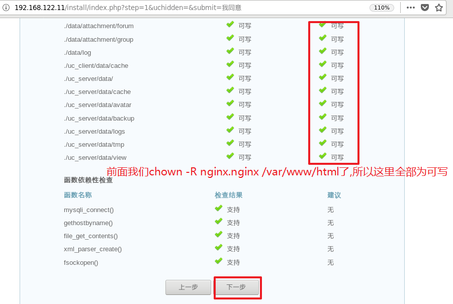
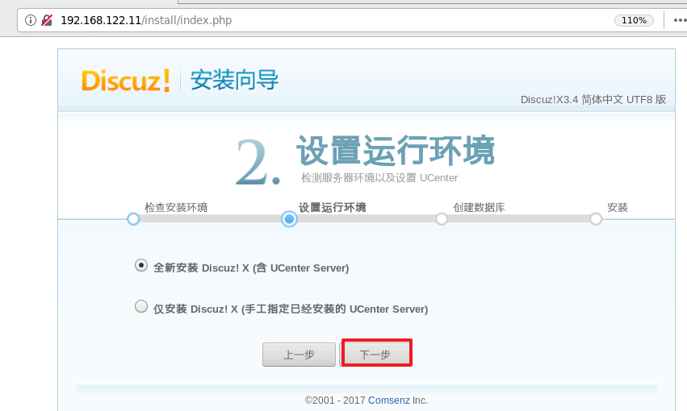
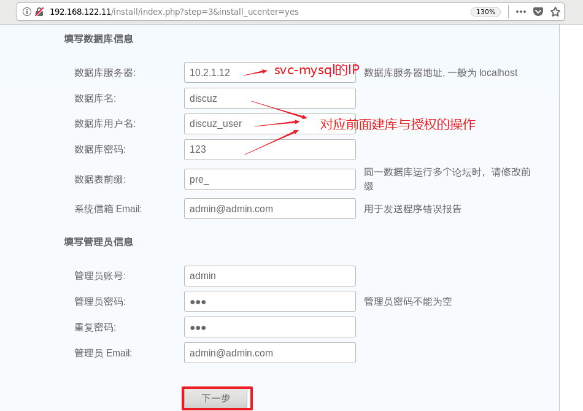
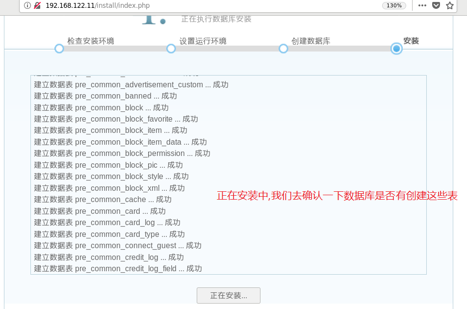
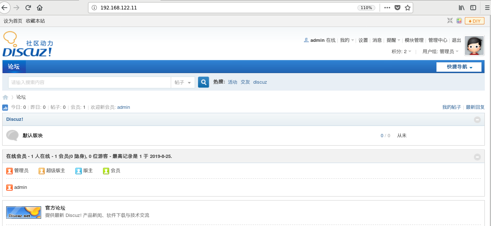
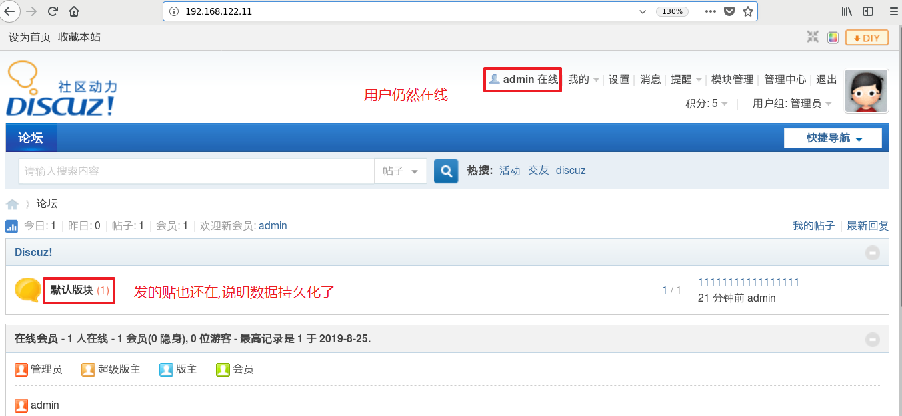

# 一、了解statefulset

StatefulSet表示有状态的集合，用于控制有状态的服务pod，如mysql。

在Deployment中, 与之对应的服务是service; 而在StatefulSet中与之对应的headless service.

StatefulSet还需要用到volumeClaimTemplates语法来定义存储。


**为什么需要 headless service 无头服务？**

* 因为Deployment中每一个Pod名称是没有顺序的，是无序的。
* statefulset中pod是有序的 ，每一个pod不能被随意取代，pod重建后pod名称还是一样的。
* 而pod IP是变化的，所以是以Pod名称来识别。pod名称是pod唯一性的标识符，必须持久稳定有效。
* 这时候要用到无头服务，它可以给每个Pod一个唯一的名称。

**为什么StatefulSet需要用到volumeClaimTemplates?**

对于有状态的副本集都会用到持久存储,statefulset中每个Pod都要自已的专有存储卷.

* volumeClaimTemplates需要实现存储的动态供给，使用动态存储卷


示例:

~~~powershell
apiVersion: v1
kind: Service
metadata:
  name: phpmysql
  namespace: phpproject
spec:
  ports:
  - port: 3306
    name: mysql
  clusterIP: None
  selector:
    app: mysql-php

---

apiVersion: apps/v1
kind: StatefulSet
metadata:
  name: db
  namespace: phpproject
spec:
  selector:
    matchLabels:
      app: mysql-php
  serviceName: "phpmysql"
  template:
    metadata:
      labels:
        app: mysql-php
    spec:
      containers:
      - name: mysql
        image: mysql:5.7
        env:
        - name: MYSQL_ROOT_PASSWORD
          value: "123456"
        - name: MYSQL_DATABASE
          value: wordpress
        ports:
        - containerPort: 3306
        volumeMounts:
        - mountPath: "/var/lib/mysql"
          name: mysql-data
  volumeClaimTemplates:
  - metadata:
      name: mysql-data
    spec:
      accessModes: ["ReadWriteMany"]
      storageClassName: "managed-storage"		
      resources:
        requests:
          storage: 3Gi
~~~


# 二、制作lnmp镜像上传到harbor

因为discuz需要lamp或lnmp环境, 我们在这里自建lamp环境的容器镜像。

在这里主要使用2个镜像

- nginx+php-fpm    也可以将nginx与php-fpm分离做成2个镜像,但我们在这里为了方便还是做到1个镜像中
- mysql

## **第1步: 下载nginx-php-fpm镜像**

找一台任意可上外网的安装docker的服务器进行镜像下载, 我这里使用`192.168.122.1`这台服务器进行操作

```powershell
[root@docker ~]# docker search nginx-php |head -5
NAME           DESCRIPTION             STARS                        OFFICIAL    AUTOMATED
richarvey/nginx-php-fpm   Container running Nginx + PHP-FPM capable of…   735       [OK]
skiychan/nginx-php7       nginx-php7.2 for docker                         89        [OK]
million12/nginx-php       Nginx + PHP-FPM 5.5, 5.6, 7.0 (NG), CentOS-7…   85        [OK]
maxexcloo/nginx-php       Framework container with nginx and PHP-FPM i…   59        [OK]
```

第1个镜像星级最多(735个), 虽然不是官方镜像,但我们就选它了(不满意我们还可以自定义)

```powershell
[root@docker ~]# docker pull richarvey/nginx-php-fpm
```

## **第2步: 编写dockerfile进行镜像自定义**

经测试,下载后的`richarvey/nginx-php-fpm`可以实现需求, 但我们仍然进行自定义,主要自定义的方面如下:

- 替换nginx主配置文件为自定义  (但子配置文件保留给ConfigMap挂载过来,方便热更新)
- 替换php-fpm配置文件为自定义
- 时区替换为亚洲上海时区

准备目录

```powershell
[root@docker ~]# mkdir /root/discuz/dockerfile -p
[root@docker ~]# cd /root/discuz/dockerfile
```

准备自定义nginx主配置文件

```powershell
[root@docker dockerfile]# vim nginx.conf
user  nginx;
worker_processes  auto;

error_log  /var/log/nginx/error.log warn;
pid        /var/run/nginx.pid;

events {
    use epoll;
    worker_connections  65535;
}

http {
    include       /etc/nginx/mime.types;
    default_type  application/octet-stream;

    log_format  main  '$remote_addr - $remote_user [$time_local] "$request" '
                      '$status $body_bytes_sent "$http_referer" '
                      '"$http_user_agent" "$http_x_forwarded_for"';
    access_log  /var/log/nginx/access.log  main;
    sendfile        on;
    #tcp_nopush     on;
    keepalive_timeout  65;
    #gzip  on;
    include /etc/nginx/conf.d/*.conf;
}
```

准备自定义php-fpm的子配置文件

```powershell
[root@docker dockerfile]# vim php-fpm-www.conf
[www]
user = nginx
group = nginx
listen = 127.0.0.1:9000
pm = dynamic
pm.max_children = 64
pm.start_servers = 20
pm.min_spare_servers = 5
pm.max_spare_servers = 35
pm.max_requests = 500
rlimit_files = 1024
```

拷贝本地的localtime文件

```powershell
[root@docker dockerfile]# cp /etc/localtime .
```

编写dockerfile

```powershell
[root@docker dockerfile]# vim dockerfile
FROM richarvey/nginx-php-fpm

MAINTAINER daniel@itcast.cn

RUN echo 'Asia/Shanghai' > /etc/timezone && rm -f /etc/nginx/nginx.conf && rm -f /usr/local/etc/php-fpm.d/www.conf

COPY localtime /etc/localtime
COPY nginx.conf /etc/nginx/nginx.conf
COPY php-fpm-www.conf /usr/local/etc/php-fpm.d/www.conf

CMD /usr/sbin/nginx -c /etc/nginx/nginx.conf && /usr/local/sbin/php-fpm -c /usr/local/etc/php-fpm.conf
```

## **第3步: build并打标nginx-php-fpm镜像**

build时直接TAG标记成discuz项目的镜像

```powershell
[root@docker dockerfile]# docker build -f dockerfile -t 192.168.122.18/discuz/nginx-php-fpm .
Sending build context to Docker daemon  5.632kB
Step 1/6 : FROM richarvey/nginx-php-fpm
 ---> 0ca466b9d3cd
Step 2/6 : RUN echo 'Asia/Shanghai' > /etc/timezone && rm -f /etc/nginx/nginx.conf && rm -f /usr/local/etc/php-fpm.d/www.conf
 ---> Running in de67eb378112
Removing intermediate container de67eb378112
 ---> df3bf2fd81e1
Step 3/6 : COPY localtime /etc/localtime
 ---> 1601d7872945
Step 4/6 : COPY nginx.conf /etc/nginx/nginx.conf
 ---> 705c5405c831
Step 5/6 : COPY php-fpm-www.conf /usr/local/etc/php-fpm.d/www.conf
 ---> 797467f3e4cb
Step 6/6 : CMD /usr/sbin/nginx -c /etc/nginx/nginx.conf && /usr/local/sbin/php-fpm -c /usr/local/etc/php-fpm.conf
 ---> Running in 82b66e011021
Removing intermediate container 82b66e011021
 ---> ff70a1b3b266
Successfully built ff70a1b3b266
Successfully tagged 192.168.122.18/discuz/nginx-php-fpm:latest
```

## **第4步: 下载mysql镜像并打标**

```powershell
[root@docker ~]# docker pull mysql:5.7
[root@docker ~]# docker tag mysql:5.7 192.168.122.18/discuz/mysql:5.7
```


## **第5步: 在harbor上再新建个discuz项目**






## **第6步: 上传镜像到harbor私有仓库**

```powershell
[root@docker ~]# docker login 192.168.122.18

[root@docker ~]# docker push 192.168.122.18/discuz/nginx-php-fpm:latest
[root@docker ~]# docker push 192.168.122.18/discuz/mysql:5.7
```



## 第7步: k8s所有节点配置harbor的http访问

因为harbor下载镜像默认是https的方式，我们这里使用http方式。

k8s集群所有节点都可能为ceph的客户端,所以在k8s所有节点上配置


~~~powershell
# vim /etc/docker/daemon.json
{
   "registry-mirrors": ["https://42h8kzrh.mirror.aliyuncs.com"],
   "exec-opts": ["native.cgroupdriver=systemd"],
   "insecure-registries": ["192.168.122.18"]
}
~~~

~~~powershell
# systemctl restart docker
~~~

说明:

* 主要是加了`"insecure-registries": ["192.168.122.18"]`实现http访问harbor


# 三、在k8s集群master节点编排discuz

## **第1步: 准备编排目录**

```powershell
[root@master ~]# mkdir -p /root/discuz/
[root@master ~]# cd /root/discuz/
```

## **第2步: 编写YAML创建mysql的deployment**

```powershell
[root@master discuz]# vim deploy-discuz-mysql.yml
apiVersion: extensions/v1beta1
kind: Deployment
metadata:
  name: deploy-discuz-mysql
spec:
  selector:
    matchLabels:
      app: discuz-mysql
  template:
    metadata:
      labels:
        app: discuz-mysql
    spec:
      imagePullSecrets:                  # 指定从harbor私有仓库拉镜像的secret
      - name: registry-harbor                   # 对应前面创建好的secret名称
      containers:
      - name: mysql
        image: 192.168.122.18/discuz/mysql:5.7
        imagePullPolicy: IfNotPresent
        env:
        - name: MYSQL_ROOT_PASSWORD
          valueFrom:
            secretKeyRef:
              name: secret-mysql
              key: password
        ports:
        - containerPort: 3306
          name: mysql
        volumeMounts:
        - name: mysql-discuz
          mountPath: /var/lib/mysql
      volumes:
      - name: mysql-discuz
        persistentVolumeClaim:
          claimName: pvc-cephrbd
```

## **第3步: 创建mysql的deployment并验证**

```powershell
[root@master discuz]# kubectl apply -f deploy-discuz-mysql.yml
deployment.apps/deploy-discuz-mysql created
```

```powershell
[root@master discuz]# kubectl get deploy
NAME                  READY   UP-TO-DATE   AVAILABLE   AGE
deploy-discuz-mysql   1/1     1            1           29s
```

```powershell
[root@master discuz]# kubectl get pod
NAME                                   READY   STATUS    RESTARTS   AGE
deploy-discuz-mysql-5fc4ccdd49-qg9xd   1/1     Running   0          33s
```

```powershell
[root@master discuz]# kubectl get pod -o wide
NAME     READY   STATUS    RESTARTS   AGE   IP   NODE    NOMINATED NODE   READINESS GATES
deploy-discuz-mysql-5fc4ccdd49-qg9xd 1/1 Running  1  39s  10.3.2.134  node2 <none> <none>
```


## **第4步: 编写YAML创建mysql的service**

```powershell
[root@master discuz]# vim svc-discuz-mysql.yml
apiVersion: v1
kind: Service
metadata:
  name: svc-mysql
  labels:
    app: discuz-mysql
spec:
  clusterIP: 10.2.1.12	# 不写IP则为自动分配,我这里将其定义死(必须要在service网段内)，就不会乱变了
  type: ClusterIP		# ClusterIP类型,也为默认类型
  ports:
    - port: 3306
  selector:
    app: discuz-mysql
```

## **第5步: 创建mysql的service并验证**

创建

```powershell
[root@master discuz]# kubectl apply -f svc-discuz-mysql.yml
service/svc-mysql created
```

验证svc

```powershell
[root@master discuz]# kubectl get svc
NAME         TYPE        CLUSTER-IP   EXTERNAL-IP   PORT(S)    AGE
kubernetes   ClusterIP   10.2.0.1     <none>        443/TCP    21d
svc-mysql    ClusterIP   10.2.1.12    <none>        3306/TCP   4s

可以看到服务IP为10.2.1.12,并且端口为3306
```

验证endpoints

```powershell
[root@master discuz]# kubectl get ep
NAME         ENDPOINTS             AGE
kubernetes   192.168.122.11:6443   21d
svc-mysql    10.3.2.134:3306       2m23s

服务创建了一个endpoint,指向10.3.2.134:3306(10.3.2.134为POD的IP)
```

## **第6步: 连接mysql数据库并建库授权**

连接IP为service的IP,密码为我们挂载到mysql的sercet里指定的(我这里的例子为haha123)

```powershell
[root@master discuz]# yum install mariadb -y
[root@master discuz]# mysql -h 10.2.1.12 -phaha123

MySQL [(none)]> create database discuz;

MySQL [(none)]> grant all on discuz.* to 'discuz_user'@'%' identified by '123';

MySQL [(none)]> flush privileges;

MySQL [(none)]> quit
```

## **第7步: 编写YMAL创建nginx-php-fpm的deployment**

```powershell
[root@master discuz]# vim deploy-discuz-nginx-php-fpm.yml
apiVersion: apps/v1
kind: Deployment
metadata:
  name: deploy-discuz-web
spec:
  replicas: 2
  selector:
    matchLabels:
      app: discuz-web
  template:
    metadata:
      labels:
        app: discuz-web
    spec:
      imagePullSecrets:                         # 指定从harbor私有仓库拉镜像的secret
      - name: registry-harbor                   # 对应前面创建好的secret名称
      containers:
      - name: nginx-php-fpm
        image: 192.168.122.18/discuz/nginx-php-fpm
        imagePullPolicy: IfNotPresent
        ports:
        - containerPort: 80
          name: web
        volumeMounts:
        - name: nginx-documentroot
          mountPath: /var/www/html/
        - name: nginx-config
          mountPath: /etc/nginx/conf.d/
      volumes:
      - name: nginx-documentroot
        persistentVolumeClaim:
          claimName: pvc-cephfs
      - name: nginx-config
        configMap:
          name: nginx-cm
```

## **第8步: 创建nginx-php-fpm的deployment并验证**

创建

```powershell
[root@master discuz]# kubectl apply -f deploy-discuz-nginx-php-fpm.yml
deployment.apps/deploy-discuz-web created
```

验证deployment

```powershell
[root@master discuz]# kubectl get deploy
NAME                  READY   UP-TO-DATE   AVAILABLE   AGE
deploy-discuz-mysql   1/1     1            1           1h
deploy-discuz-web     2/2     2            2           106s
```

验证pod

```powershell
[root@master discuz]# kubectl get pods
NAME                                   READY   STATUS    RESTARTS   AGE
deploy-discuz-mysql-5fc4ccdd49-qg9xd   1/1     Running   1          1h
deploy-discuz-web-df4f76fcb-72gh5      1/1     Running   0          111s
deploy-discuz-web-df4f76fcb-jjzz6      1/1     Running   0          111s
```

验证pod的挂载

```powershell
[root@master discuz]# kubectl describe pod deploy-discuz-web-df4f76fcb-72gh5
......
    Mounts:
      /etc/nginx/conf.d/ from nginx-config (rw)
      /var/run/secrets/kubernetes.io/serviceaccount from default-token-msdf6 (ro)
      /var/www/html/ from nginx-documentroot (rw)
......
Volumes:
  nginx-documentroot:
    Type:       PersistentVolumeClaim (a reference to a PersistentVolumeClaim in the same namespace)
    ClaimName:  pvc-cephfs
    ReadOnly:   false
  nginx-config:
    Type:      ConfigMap (a volume populated by a ConfigMap)
    Name:      nginx-cm
    Optional:  false
......
```

## **第9步: 编写YMAL创建nginx-php-fpm的service**

```powershell
[root@master discuz]# vim svc-discuz-nginx-php-fpm.yml
apiVersion: v1
kind: Service
metadata:
  name: svc-web
  labels:
    app: discuz-web
spec:
  clusterIP: 10.2.1.11
  type: ClusterIP
  ports:
    - port: 80
  selector:
    app: discuz-web
```

## **第10步: 创建nginx-php-fpm的service并验证**

创建

```powershell
[root@master discuz]# kubectl apply -f svc-discuz-nginx-php-fpm.yml
service/svc-web created
```

验证service

```powershell
[root@master discuz]# kubectl get svc
NAME         TYPE        CLUSTER-IP   EXTERNAL-IP   PORT(S)    AGE
kubernetes   ClusterIP   10.2.0.1     <none>        443/TCP    21d
svc-mysql    ClusterIP   10.2.1.12    <none>        3306/TCP   35m
svc-web      ClusterIP   10.2.1.11    <none>        80/TCP     13s

可以看到服务IP为10.2.1.11,并且端口为80
```

验证endpoints

```powershell
[root@master discuz]# kubectl get ep
NAME         ENDPOINTS                     AGE
kubernetes   192.168.122.11:6443           21d
svc-mysql    10.3.2.134:3306               37m
svc-web      10.3.1.127:80,10.3.2.135:80   113s

服务创建了一个endpoint,指向2个pod的80端口
```

## **第11步: 下载discuz**

discuz3.4版本后只在官方git发布, 所以需要使用`git clone`命令将其下载

```powershell
[root@master discuz]# git clone https://gitee.com/ComsenzDiscuz/DiscuzX.git
Cloning into 'DiscuzX'...
remote: Enumerating objects: 7596, done.
remote: Counting objects: 100% (7596/7596), done.
remote: Compressing objects: 100% (4845/4845), done.
remote: Total 7596 (delta 2782), reused 7332 (delta 2702)
Receiving objects: 100% (7596/7596), 12.20 MiB | 1.35 MiB/s, done.
Resolving deltas: 100% (2782/2782), done.
```

## **第12步: 将upload目录内容上传到nginx家目录**

使用`kubect cp`命令将DiscuzX/upload目录上传到其中1个pod的家目录

```powershell
[root@master discuz]# kubectl cp DiscuzX/upload/ deploy-discuz-web-df4f76fcb-72gh5:/var/www/html/
```

调整路径并修改owner,group

```powershell
[root@master discuz]# kubectl exec -it deploy-discuz-web-df4f76fcb-72gh5 -- /bin/bash

bash-4.4# mv /var/www/html/upload/* /var/www/html/
bash-4.4# rm /var/www/html/upload/ -rf
bash-4.4# chown nginx.nginx -R /var/www/html/			# 全部改成nginx用户的owner与group
bash-4.4# exit
exit
```

另1个pod不用再上传了,因为2个pod使用的cephfs有数据共享功能

## **第13步: 在k8s集群master节点搭建nginx反向代理**

现在我们可以通过serviceIP`10.2.1.11` 访问discuz了,但是仍然只能在集群内部访问。我需要集群外部客户端能够访问, 可以有如下方案:

- NodePort类型Service
- 使用nginx代理来访问ClusterIP类型Service

 这里我们选用第2种方案

1, 在k8s集群master节点上安装nginx

```powershell
[root@master ~]# yum install epel-release -y
[root@master ~]# yum install nginx -y
```

2, 配置nginx

```powershell
[root@master ~]# vim /etc/nginx/nginx.conf
user nginx;
worker_processes auto;
error_log /var/log/nginx/error.log;
pid /run/nginx.pid;

include /usr/share/nginx/modules/*.conf;

events {
    worker_connections 1024;
}

http {
    log_format  main  '$remote_addr - $remote_user [$time_local] "$request" '
                      '$status $body_bytes_sent "$http_referer" '
                      '"$http_user_agent" "$http_x_forwarded_for"';

    access_log  /var/log/nginx/access.log  main;

    sendfile            on;
    tcp_nopush          on;
    tcp_nodelay         on;
    keepalive_timeout   65;
    types_hash_max_size 2048;

    include             /etc/nginx/mime.types;
    default_type        application/octet-stream;

    include /etc/nginx/conf.d/*.conf;

    server {
        listen       80 default_server;
        listen       [::]:80 default_server;
        server_name  _;
        root         /usr/share/nginx/html;

        include /etc/nginx/default.d/*.conf;

        location / {
              proxy_pass      http://10.2.1.11:80;			# ip为svc-nginx的ip
              proxy_set_header Host   $host;
              proxy_set_header X-Real-IP      $remote_addr;
              proxy_set_header X-Forwarded-For $proxy_add_x_forwarded_for;
        }

        error_page 404 /404.html;
            location = /40x.html {
        }

        error_page 500 502 503 504 /50x.html;
            location = /50x.html {
        }
    }

}
```

3, 启动nginx服务并设置开机自启动

```powershell
[root@master ~]# systemctl restart nginx
[root@master ~]# systemctl enable nginx
```

4, 确认80端口

```powershell
[root@master ~]# lsof -i:80
COMMAND   PID  USER   FD   TYPE  DEVICE SIZE/OFF NODE NAME
nginx   21209  root    6u  IPv4 3009455      0t0  TCP *:http (LISTEN)
nginx   21209  root    7u  IPv6 3009456      0t0  TCP *:http (LISTEN)
nginx   21210 nginx    6u  IPv4 3009455      0t0  TCP *:http (LISTEN)
nginx   21210 nginx    7u  IPv6 3009456      0t0  TCP *:http (LISTEN)
nginx   21211 nginx    6u  IPv4 3009455      0t0  TCP *:http (LISTEN)
nginx   21211 nginx    7u  IPv6 3009456      0t0  TCP *:http (LISTEN)
nginx   21212 nginx    6u  IPv4 3009455      0t0  TCP *:http (LISTEN)
nginx   21212 nginx    7u  IPv6 3009456      0t0  TCP *:http (LISTEN)
nginx   21213 nginx    6u  IPv4 3009455      0t0  TCP *:http (LISTEN)
nginx   21213 nginx    7u  IPv6 3009456      0t0  TCP *:http (LISTEN)
```

## **第14步: 安装discuz**

使用集群外部节点(我这里为192.168.122.1)的浏览器来访问nginx反向代理

```powershell
[root@docker discuz]# firefox 192.168.122.11 &
```
















```powershell
[root@master ~]# mysql -h 10.2.1.12 -p123 -e 'use discuz; show tables' |wc -l
293						 				一共有292张表,这里标题也占了1行所以显示293行
```

## **第15步: 测试访问**




# 四、打包编排discuz

## **第1步: 删除deployment**

```powershell
[root@master ~]# kubectl delete deploy deploy-discuz-mysql
[root@master ~]# kubectl delete deploy deploy-discuz-web
```

## **第2步: 删除service**

```powershell
[root@master ~]# kubectl delete svc svc-mysql
[root@master ~]# kubectl delete svc svc-web
```

## **第3步: 删除pvc**

```powershell
[root@master ~]# kubectl delete pvc pvc-cephfs
[root@master ~]# kubectl delete pvc pvc-cephrbd
```

## **第4步: 删除pv**

```powershell
[root@master ~]# kubectl delete pv pv-cephfs
[root@master ~]# kubectl delete pv pv-cephrbd
```

## **第5步: 打包YAML文件**

将创建pv,pvc,nginx-php-fpm,mysql的YAML打包成一个YAML,如下:

**==注意: configmap,secret没有打包在这里, 需要先创建好==**

```powershell
[root@master ~]# vim discuz.yml
apiVersion: v1
kind: PersistentVolume
metadata:
  name: pv-cephfs
spec:
  capacity:
    storage: 1Gi
  accessModes:
    - ReadWriteMany
  cephfs:
    monitors:
      - 192.168.122.21:6789
      - 192.168.122.22:6789
      - 192.168.122.23:6789
    user: admin
    path: /
    secretRef:
      name: ceph-secret
---
kind: PersistentVolumeClaim
apiVersion: v1
metadata:
  name: pvc-cephfs
spec:
  accessModes:
    - ReadWriteMany
  resources:
    requests:
      storage: 1Gi
---
apiVersion: v1
kind: PersistentVolume
metadata:
  name: pv-cephrbd
spec:
  capacity:
    storage: 2Gi
  accessModes:
    - ReadWriteMany
  rbd:
    monitors:
      - 192.168.122.21:6789
      - 192.168.122.22:6789
      - 192.168.122.23:6789
    pool: rbd_pool
    image: volume1
    user: admin
    fsType: xfs
    secretRef:
      name: ceph-secret
---
kind: PersistentVolumeClaim
apiVersion: v1
metadata:
  name: pvc-cephrbd
spec:
  accessModes:
    - ReadWriteMany
  resources:
    requests:
      storage: 2Gi
---
apiVersion: apps/v1
kind: Deployment
metadata:
  name: deploy-discuz-mysql
  labels:
    app: discuz-mysql
spec:
  selector:
    matchLabels:
      app: discuz-mysql
  template:
    metadata:
      labels:
        app: discuz-mysql
    spec:
      imagePullSecrets:     
      - name: registry-harbor 
      containers:
      - name: mysql
        image: 192.168.122.18/discuz/mysql:5.7
        imagePullPolicy: IfNotPresent
        env:
        - name: MYSQL_ROOT_PASSWORD
          valueFrom:
            secretKeyRef:
              name: secret-mysql
              key: password
        ports:
        - containerPort: 3306
          name: mysql
        volumeMounts:
        - name: mysql-discuz
          mountPath: /var/lib/mysql
      volumes:
      - name: mysql-discuz
        persistentVolumeClaim:
          claimName: pvc-cephrbd
---
apiVersion: v1
kind: Service
metadata:
  name: svc-mysql
  labels:
    app: discuz-mysql
spec:
  clusterIP: 10.2.1.12
  type: ClusterIP
  ports:
    - port: 3306
  selector:
    app: discuz-mysql
---
apiVersion: apps/v1
kind: Deployment
metadata:
  name: deploy-discuz-web
  labels:
    app: discuz-web
spec:
  replicas: 2
  selector:
    matchLabels:
      app: discuz-web
  template:
    metadata:
      labels:
        app: discuz-web
    spec:
      imagePullSecrets:
      - name: registry-harbor
      containers:
      - name: nginx-php-fpm
        image: 192.168.122.18/discuz/nginx-php-fpm
        imagePullPolicy: IfNotPresent
        ports:
        - containerPort: 80
          name: web
        volumeMounts:
        - name: nginx-documentroot
          mountPath: /var/www/html/
        - name: nginx-config
          mountPath: /etc/nginx/conf.d/
      volumes:
      - name: nginx-documentroot
        persistentVolumeClaim:
          claimName: pvc-cephfs
      - name: nginx-config
        configMap:
          name: nginx-cm
---
apiVersion: v1
kind: Service
metadata:
  name: svc-web
  labels:
    app: discuz-web
spec:
  clusterIP: 10.2.1.11
  type: ClusterIP
  ports:
    - port: 80
  selector:
    app: discuz-web
```

## **第6步: apply应用YAML一键秒级搭建项目**

```powershell
[root@master ~]# kubectl apply -f discuz/discuz.yml
persistentvolume/pv-cephfs created
persistentvolumeclaim/pvc-cephfs created
persistentvolume/pv-cephrbd created
persistentvolumeclaim/pvc-cephrbd created
deployment.apps/deploy-discuz-mysql created
service/svc-mysql created
deployment.apps/deploy-discuz-web created
service/svc-web created
```

**第7步: 验证**

