# 单节点rancher快速部署

我们知道kubernetes学习成本非常高,如果想要快速体验Paas云平台的话，连部署搭建对于新手来说都是难以下手。

rancher是一个`kubernetes-as-a-service`解决方案,也就是说rancher将kubernetes集群搭建与应用编排实现了打包一体化,可以通过图形界面的操作就可以来部署kubernetes集群与应用了。

参考官网: https://rancher.com/

下面我们来使用容器方式快速部署单节点rancher

## 环境准备

| 系统      | docker版本 | rancher版本 | IP             |
| --------- | ---------- | ----------- | -------------- |
| centos7.6 | 19.03.1    | 2.X         | 192.168.122.12 |

准备工作: 

1, 配置静态IP地址(要求能上公网,因为要拉取镜像)

~~~powershell
# vim /etc/sysconfig/network-scripts/ifcfg-eth0
BOOTPROTO="static"
NAME="eth0"
DEVICE="eth0"
ONBOOT="yes"
IPADDR=192.168.122.12							
NETMASK=255.255.255.0
GATEWAY=192.168.122.1
DNS1=192.168.122.1

# systemctl stop NetworkManager
# systemctl disable NetworkManager
# systemctl restart network
# systemctl enable network
~~~

2, 主机名和主机名绑定

~~~powershell
# hostnamectl set-hostname --static rancher
~~~

~~~powershell
# vim /etc/hosts
127.0.0.1   localhost localhost.localdomain localhost4 localhost4.localdomain4
::1         localhost localhost.localdomain localhost6 localhost6.localdomain6
192.168.122.12  rancher
~~~

3, **所有节点**关闭centos7的firewalld防火墙,打开iptables并保存为空规则

~~~powershell
# systemctl stop firewalld
# systemctl disable firewalld

# yum install iptables-services -y
# systemctl restart iptables
# systemctl enable iptables

# iptables -F
# iptables -F -t nat
# iptables -F -t mangle
# iptables -F -t raw

# service iptables save
iptables: Saving firewall rules to /etc/sysconfig/iptables:[  OK  ]
~~~

4, **所有节点**关闭selinux

~~~powershell
# vim /etc/selinux/config

# This file controls the state of SELinux on the system.
# SELINUX= can take one of these three values:
#     enforcing - SELinux security policy is enforced.
#     permissive - SELinux prints warnings instead of enforcing.
#     disabled - No SELinux policy is loaded.
SELINUX=disabled				  确认为disabled,如果不是请改成disabled(需要reboot重启生效)
# SELINUXTYPE= can take one of three values:
#     targeted - Targeted processes are protected,
#     minimum - Modification of targeted policy. Only selected processes are protected.
#     mls - Multi Level Security protection.
SELINUXTYPE=targeted
~~~

5, **所有节点** 时间同步

~~~powershell
# systemctl restart ntpd
# systemctl enabled ntpd
~~~

## 需要保证安装docker,并启动服务

~~~powershell
# wget https://download.docker.com/linux/centos/docker-ce.repo -O /etc/yum.repos.d/docker-ce.repo
# yum install docker-ce -y
# systemctl restart docker 
# systemctl enable docker 
~~~

## 配置镜像加速器

~~~powershell
# vim /etc/docker/daemon.json
{
	"registry-mirrors": ["https://42h8kzrh.mirror.aliyuncs.com"]
}
# systemctl daemon-reload
# systemctl restart docker
~~~

## 启动rancher

~~~powershell
[root@rancher ~]# docker run -d --restart=unless-stopped -p 80:80 -p 443:443 --name rancher -v /var/lib/rancher/:/var/lib/rancher/ rancher/rancher:stable
Unable to find image 'rancher/rancher:stable' locally
stable: Pulling from rancher/rancher
35c102085707: Pull complete
251f5509d51d: Pull complete
8e829fe70a46: Pull complete
6001e1789921: Pull complete
190724123869: Pull complete
f144ec07b677: Pull complete
eb837ce35a44: Pull complete
71ab38270b07: Pull complete
d69cad2e554a: Pull complete
33d6cdb7458b: Pull complete
f5a0fc4d0fec: Pull complete
2bd480581d18: Pull complete
d81d5f05f9e8: Pull complete
Digest: sha256:b85f1dd239d2555ef438f46790642334e0c75f314a35047b93acb1b457b4cd09
Status: Downloaded newer image for rancher/rancher:stable
3ff8ca28cede2b119eccecb27337748631ebc2659846d20671fbfdda456ec433

~~~

## 通过浏览器访问配置

直接访问节点IP即可: https://192.168.122.12

注意: 因为我们没有配置SSL证书, 所以浏览器会报不安全的连接,如果要对公网使用，建议使用CA认证的证书。

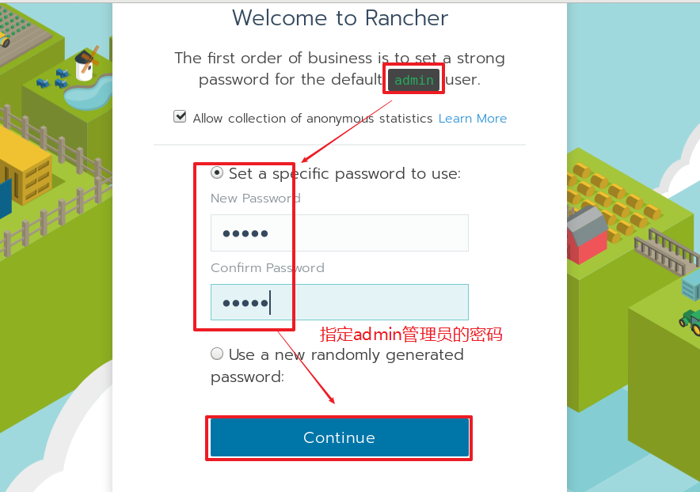

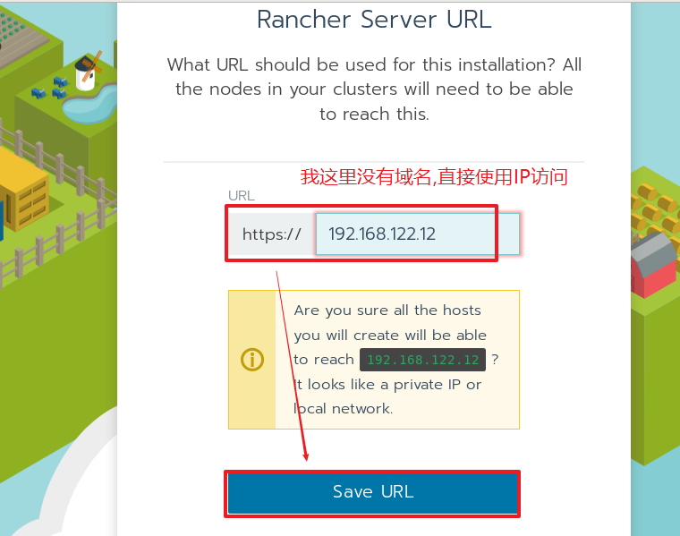

## 添加kubernetes集群

直接在主页面添加集群

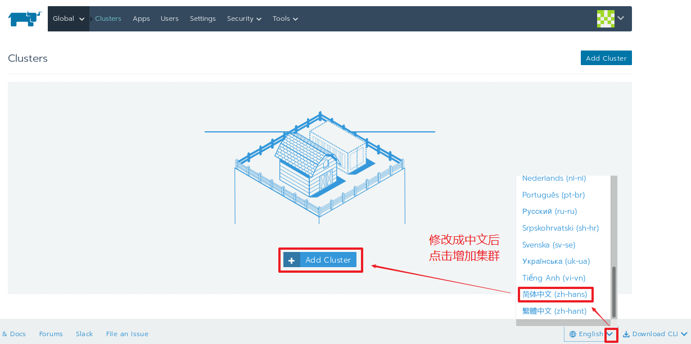

### 选择集群类型

### 集群名称与选项自定义

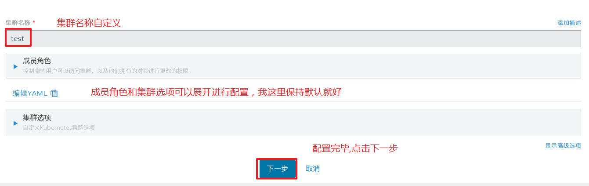

### 定义集群主机选项

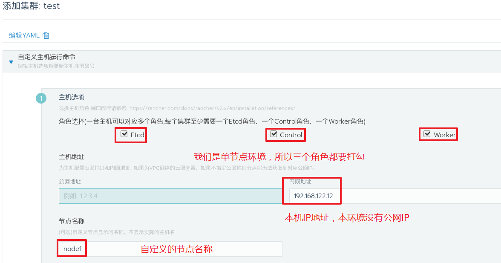

### 安装rancher-agent

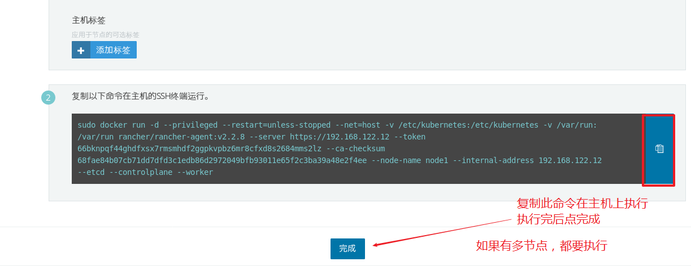

**通过下面命令安装rancher-agent后点完成**

~~~powershell
[root@rancher ~]# sudo docker run -d --privileged --restart=unless-stopped --net=host -v /etc/kubernetes:/etc/kubernetes -v /var/run:/var/run rancher/rancher-agent:v2.2.8 --server https://192.168.122.12 --token 66bknpqf44ghdfxsx7rmsmhdf2ggpkvpbz6mr8cfxd8s2684mms2lz --ca-checksum 68fae84b07cb71dd7dfd3c1edb86d2972049bfb93011e65f2c3ba39a48e2f4ee --node-name node1 --internal-address 192.168.122.12 --etcd --controlplane --worker
Unable to find image 'rancher/rancher-agent:v2.2.8' locally
v2.2.8: Pulling from rancher/rancher-agent
35c102085707: Already exists
251f5509d51d: Already exists
8e829fe70a46: Already exists
6001e1789921: Already exists
357cc14e23eb: Pull complete
1a45097802d6: Pull complete
767c96a0eb35: Pull complete
2d7f44528c06: Pull complete
03c89d0b79d9: Pull complete
9cf93329bea9: Pull complete
Digest: sha256:6c1e84e208b87912683d1c68c80476d48150480a7f8819e8931c063492621d70
Status: Downloaded newer image for rancher/rancher-agent:v2.2.8
2a6d16e36a5fc735df0e0a03089ecbdab9e464750ef6a638ce9b470466328372
~~~

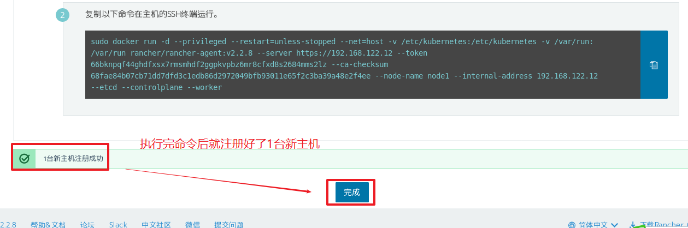

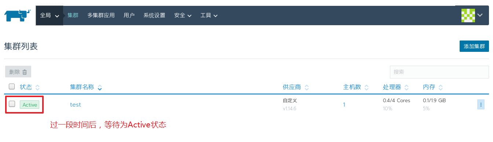

我们在rancher中分别部署一个nginx与mariadb应用来体验一下容器时代的快速部署

# rancher部署nginx示例应用

## 集群中部署服务

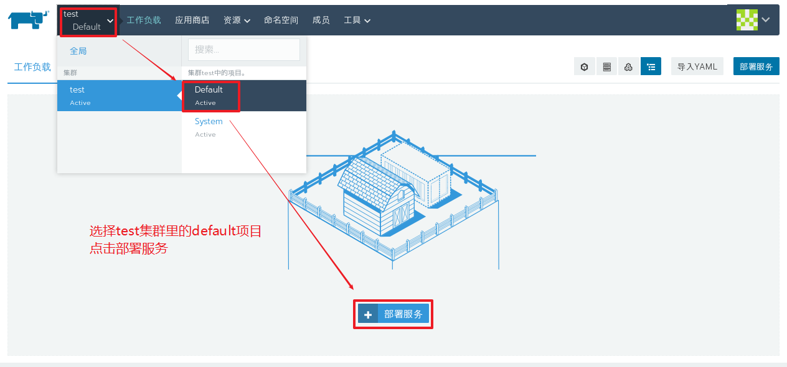

## 自定义deployment部署

启动

## 状态验证

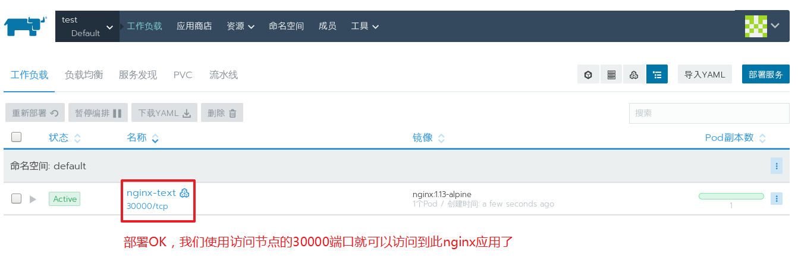

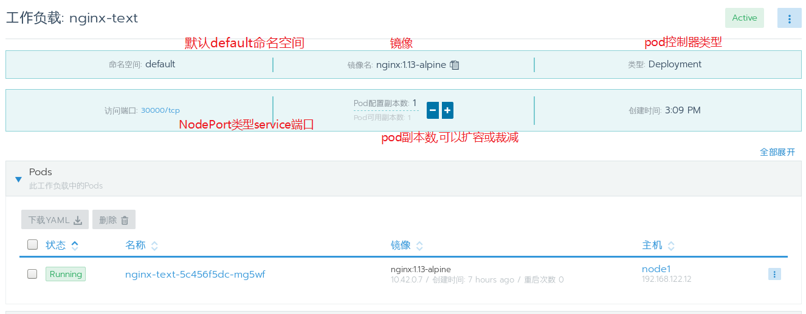

## 客户端浏览器验证

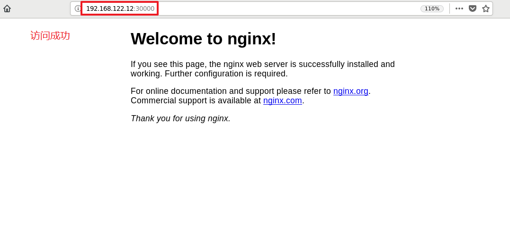

# rancher应用商店部署mariadb示例

## 启动应用商店

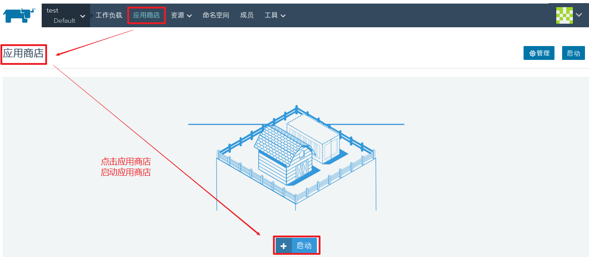

## 查找mariadb应用

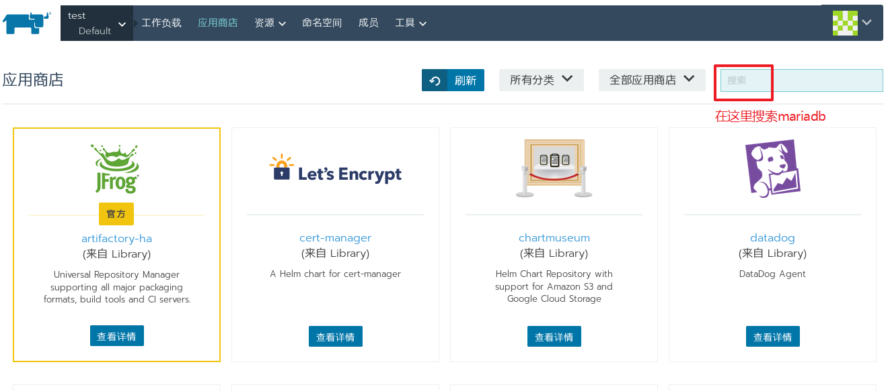

## 配置应用参数

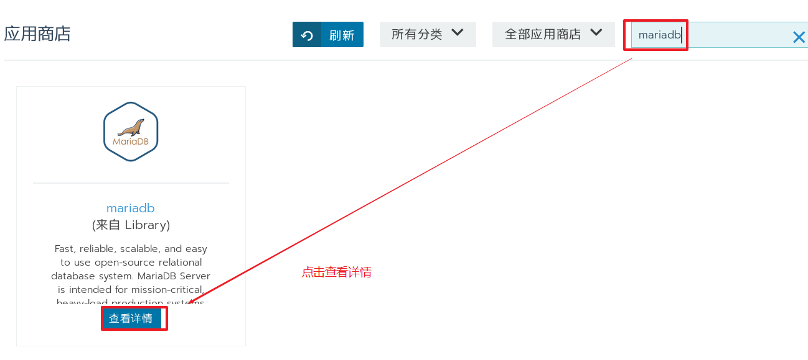

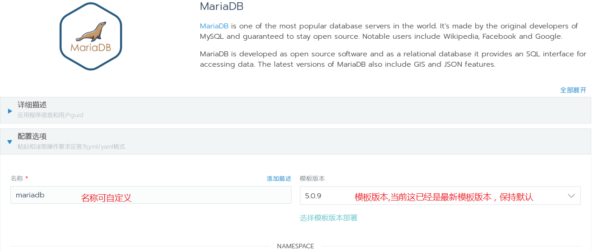

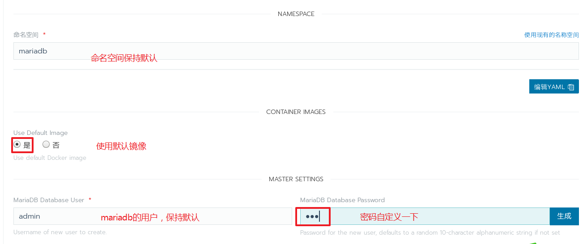

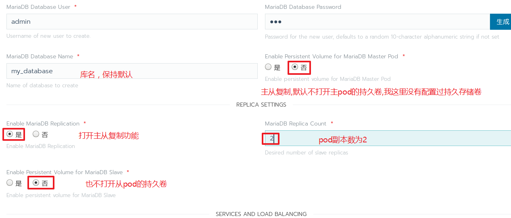

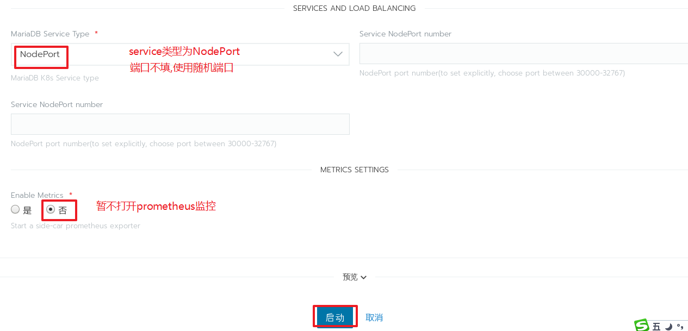

## 启动部署

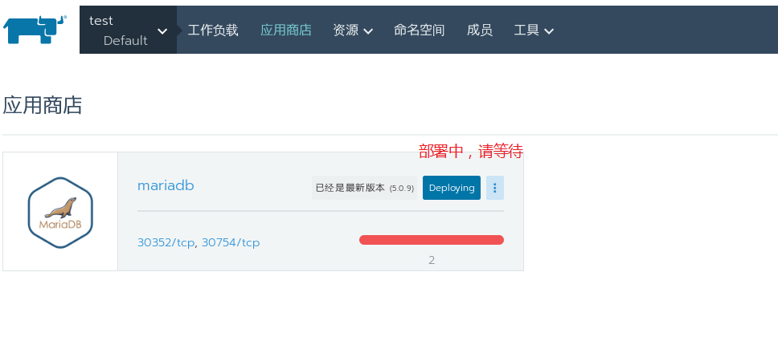

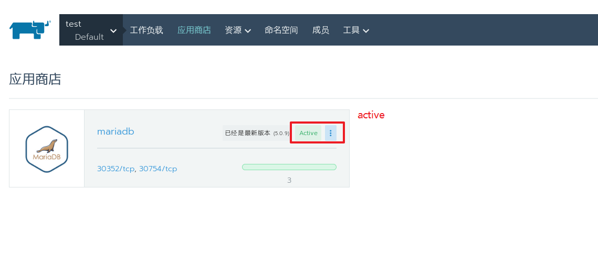

## 简单验证

使用下面命令访问OK

~~~powershell
[root@rancher ~]# mysql -h 192.168.122.12 -u admin -p123 -P 30352

[root@rancher ~]# mysql -h 192.168.122.12 -u admin -p123 -P 30754
~~~

