# 任务背景

前面的架构,安全,优化都是基于**物理服务器**讨论的，而很多公司会将自己的业务都运行在**虚拟机**上或**云主机**或**容器**中。跑在虚拟机，云主机，容器中各有自己的优势，但它们都是以**==虚拟化==**技术为基础的。


# 学习目标

- [ ] 能够说出虚拟化实现方式的三种分类
- [ ] 了解qemu,kvm,qemu-kvm,libvirt之间的关系
- [ ] 能够安装kvm软件
- [ ] 能够在kvm上安装虚拟机
- [ ] 能够使用命令对虚拟机做启停,连接操作  
- [ ] 能够克隆kvm虚拟机
- [ ] 能够对kvm网络进行管理
- [ ] 能够对kvm虚拟机做快照管理
- [ ] 能够对kvm虚拟机做设备管理
- [ ] 能够对kvm虚拟机做存储池管理
- [ ] 能够对kvm虚拟机做镜像管理


# Linux系统整体结构

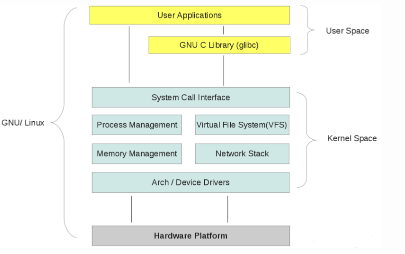


## 硬件

* 硬件是计算机组成基础，硬件主要包括大家熟悉的CPU,内存,硬盘等.


## 操作系统

* 用户无法直接操作硬件。
* 把硬件功能抽象成直观的,比较易于调用的高层次接口,我们称之为**操作系统**。
* 用户通过**命令行**或**图形**这样的接口操作应用程序, 进行达到操作硬件。
* 操作系统主要分为**内核**与**应用程序**，分别对应**内核空间(kernel space)**和**用户空间(user space)。**
* 当程序进程运行在内核空间时就处于**内核态**
* 当程序进程运行在用户空间时则处于**用户态**


## 内核空间和用户空间

 CPU的指令中有些指令非常危险，用错了会导致系统崩溃，如清除内存。

以前的DOS操作系统，没有内核空间和用户空间的概念。可认为所有的程序都运行在内核态，那么开发的应用程序不小心就会让操作系统崩溃。

Linux通过区分内核空间和用户空间，隔离了内核与应用程序代码。这样单个应用程序出现错误，不会影响到操作系统底层的稳定性。

用户态程序通过系统调用,软硬中断等方式调用内核态程序。(具体如何调中用在这里不做讨论)

所以，**区分内核空间和用户空间本质上是要提高操作系统的稳定性及可用性。**


## CPU特权与非特权指令

普通应用程序只能使用那些不会造成灾难的指令,而那些危险的指令,只允许内核态程序使用。


Intel的CPU将X86架构的指令特权级分为四个级别：Ring0、Ring1、Ring2、Ring3

Linux与windows只使用了Ring0和Ring3。

* ring0, 即特权指令，所谓的特权指令是指操作硬件、控制总线等指令，运行在内核态。

* ring3, 非特权指令，运行在用户态


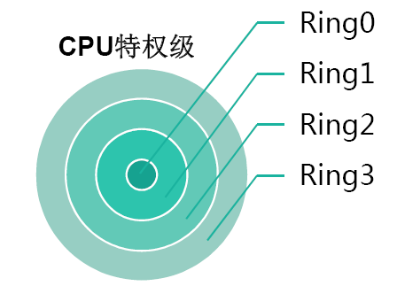


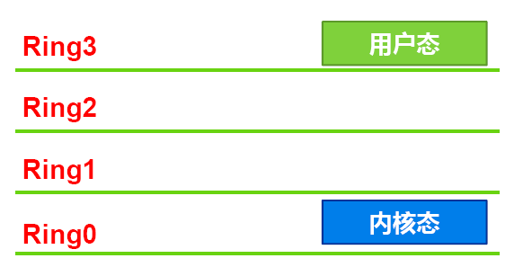

有些应用程序是需要调用内核才能完成其功能，而有些应用程序则不需要调用内核接口完成其功能

比如: 计算1+1这个需要在内核态执行还是在用户态执行？

答案是只要将这个计算请求直接给CPU执行就可以了，不需要内核态做任何具体的行为，即不需要发起系统调用，不需要执行特权指令。

又比如: cp拷贝xfs文件系统上的文件到ext4文件系统上。

需要使用内核里的VFS功能，达到操作硬盘上的不同文件系统进行数据拷贝。


# 虚拟化技术

虚拟化技术简单来说就是对**==资源(资源包括cpu,mem,io,network等)的模拟==**。

电脑上使用的手机模拟器，我们使用的vmware虚拟机等都是虚拟化技术的体现。

虚拟化技术常见的应用是将完整的资源切分为多份，给多个应用使用，以提高资源利用率，节省成本。


## 虚拟化分类

虚拟化技术主要分为以下几个大类:

* **==平台虚拟化==**	      这也是我们通常所说的虚拟化技术，虚拟整个计算机。
* 资源虚拟化          虚拟特定的资源，如网卡，内存，存储等。
* 应用程序虚拟化  虚拟特定的程序，如游戏模拟器，JVM(java虚拟机)等。

我们要学习的主要是平台化技术。


## 虚拟化常见概念名词

* VMM  (Virtual Machine Monitor)虚拟机监控器，也称为Hypervisor。
* Guest OS 客户机操作系统
* Host OS 主机(或称为宿主机,物理机)操作系统

vm(虚拟机)由vmm产生并运行的。我们平时使用的vmware workstation这款软件就是vmm，使用它安装的linux系统就是vm,也称为Guest OS.而安装vmware workstation的物理服务器则为Host OS.


## 平台虚拟化分类

### 完全虚拟化

完全虚拟化指的是VMM为虚拟机模拟了完整的底层硬件。

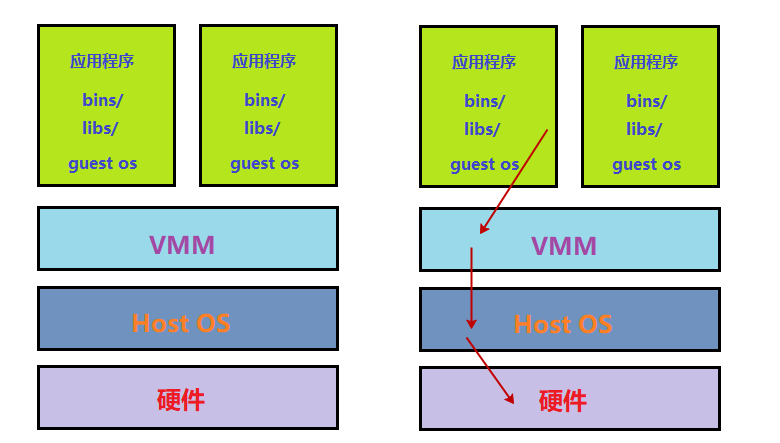


**步骤:**

1. 当guest os中的应用程序进程要调用cpu时, 将指令请求给guest os的虚拟CPU。
2. guest os的虚拟CPU无法执行Ring 0特权指令，所以要再转给Host OS
3. Host OS按照再通过内核对物理上的CPU执行指令


**完全虚拟化优点:**  原来运行在物理硬件上的操作系统和软件，完全不用修改就可以直接运行在虚拟机中。

**完全虚拟化缺点:**  性能较差。


完全虚拟化还可分为: 

* 软件辅助的全虚拟化  由软件将所有在guest os中执行的系统内核特权指令进行捕获、翻译, 使之成为只能对guest os生效的虚拟特权指令。
* 硬件辅助的全虚拟化  通过硬件CPU可以明确的分辨出来自GuestOS的特权指令，并针对GuestOS进行特权操作，而不会影响到Host OS。在X86体系结构上主要为Intel-V和AMD-V两种技术。


完全虚拟化代表软件: `vmware workstation`, `kvm`


使用完全虚拟化的Host OS需要打开intel-V技术。如下图所示:

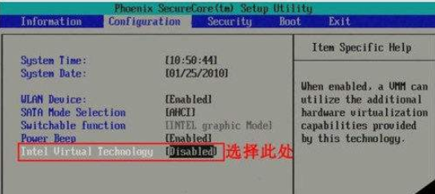

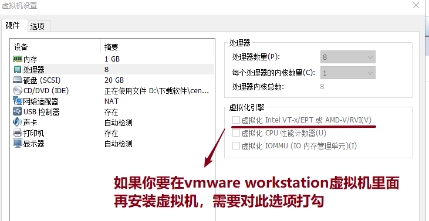


### 半虚拟化

半虚拟化是一种修改Guest OS部分访问特权状态的代码以便直接与VMM交互的技术。

guest os不能直接运行Ring 0, **==需要对内核进行修改==**，将运行在Ring 0的指令转用调用VMM。


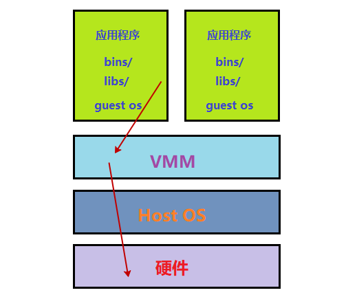

**步骤:**

1. 当guest os中的应用程序进程要调用cpu时, 将指令请求给guest os的虚拟CPU。
2. 因为修改过内核，使guest os的虚拟CPU也能执行Ring 0特权指令。
3. guet os的虚拟CPU直接调用物理硬件CPU。


**半虚拟化优点:**  性能较好

**半虚拟化缺点:**  需要修改内核


半虚拟化代表软件: `Xen`.


### 操作系统虚拟化

在传统操作系统中，所有用户的进程本质上是在同一个操作系统的实例中运行，因此内核或应用程序的缺陷可能影响到其它进程。

操作系统虚拟化是一种轻量级的虚拟化技术，让内核通过创建多个虚拟的操作系统实例来隔离不同的进程，不同实例中的进程完全不了解对方的存在。这些实例也被称之为**==容器==**。

**优点:**  多个容器与Host OS共享内核空间,这种方法**性能最好**。

**缺点:** Host OS与容器必须要使用同一种类型操作系统, 如Linux上可以运行同发行版或其它发行版的linux，但不能直接运行windows. 容器的学习也会带来额外的学习成本。


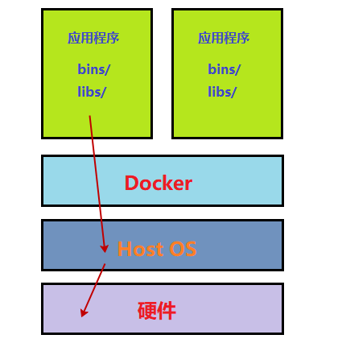


**总结图**

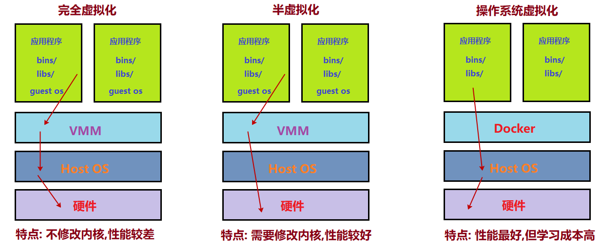


# KVM虚拟机相关名词

通过前面的讲解，我们知道**kvm(kernel-based virtual machine)**属于完全虚拟化。

但kvm准确来说只是一个linux内核提供的功能, 并不代表kvm虚拟机全部,它的全称应该是qemu-kvm。


## qemu

* QEMU是一套由Fabrice Bellard)所编写的开源模拟处理器。

* QEMU其实就是是一种VMM,它提供一系列的硬件模拟设备(CPU，网卡，磁盘等)
* 它属于软件辅助的全虚拟化

## kvm

* KVM是linux内核提供的虚拟化模块,可以用来进行vCPU的创建与运行,虚拟内存的地址空间分配。
* 它指令执行效率较高，但缺少IO设备的虚拟化。
* 属于硬件辅助的全虚拟化，需要intel-V或AMD-V技术支持。

## qemu-kvm

* QEMU-KVM就是KVM与QEMU的结合。
* KVM负责CPU虚拟化+内存虚拟化,QEMU模拟其它IO设备和对各种虚拟设备的创建与调用。


## libvirt

* RedHat公司开始支持KVM后,觉得QEMU+KVM方案中的用户空间虚拟机管理工具不太好用且通用性不强，所以开发了libvirt做为虚拟机管理工具.

* libvirt是一套免费、开源的支持Linux下主流虚拟化管理程序的C函数库，其旨在为包括KVM在内的各种虚拟化管理程序提供一套方便、可靠的编程接口。

* 当前主流Linux平台上默认的虚拟化管理工具virt-manager,virsh等都是基于libvirt开发。

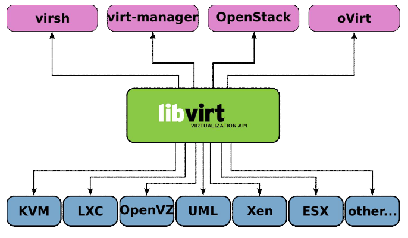


**QEMU,KVM,Libvirt三者关系总结：**

* QEMU是一个独立的虚拟化解决方案, 并不依赖KVM（它自己可以做CPU和内存的模拟,但效率较低）
* KVM是另一套虚拟化解决方案，对CPU进行虚拟效率较高（采用了硬件辅助虚拟化）
* KVM本身不提供其他设备的虚拟化借用了QEMU的代码进行了定制，所以KVM方案一定要依赖QEMU 

* libvirt是一个虚拟机管理工具。


# kvm环境准备与安装

## 宿主机环境要求

1. yum源（本地镜像的yum源或centos7装完系统后的默认yum源）
2. 保证/var目录的空间比较大
3. 使用`cat /proc/cpuinfo |grep -E "vmx|svm"`命令查看CPU是否支持intel-V或AMD-V技术,只要cpu的指令集里有vmx或svm指令集就OK
4. 使用`lsmod |grep kvm`查看是否装载kvm模块

~~~powershell
# lsmod |grep kvm
kvm_intel             170181  0 
kvm                   554609  1 kvm_intel
irqbypass              13503  1 kvm
~~~

5. 需要准备centos7的iso镜像文件放在宿主机, 用于给虚拟机安装linux系统。


## kvm安装

在宿主机上安装kvm相关软件包,并启动相关服务

~~~powershell
# yum install qemu-kvm libvirt virt-install libvirt-python virt-manager libvirt-client virt-viewer -y

# systemctl start libvirtd
# systemctl enable libvirtd
# systemctl status libvirtd
~~~


# 使用kvm安装虚拟机

## 图形安装方式

要求宿主机linux在图形模式,使用下面命令打开图形管理界面

~~~powershell
# virt-manager
~~~

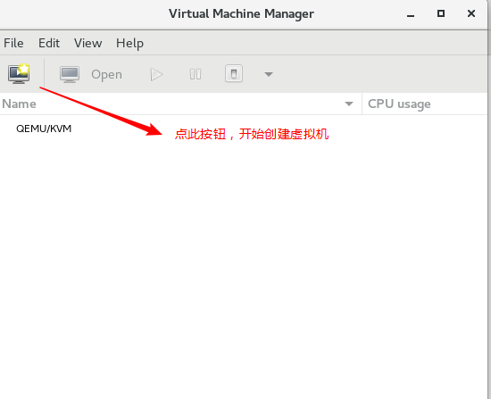

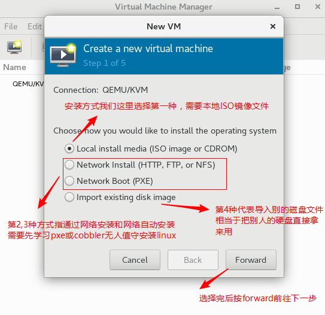

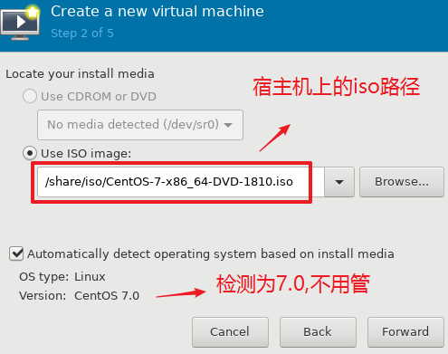

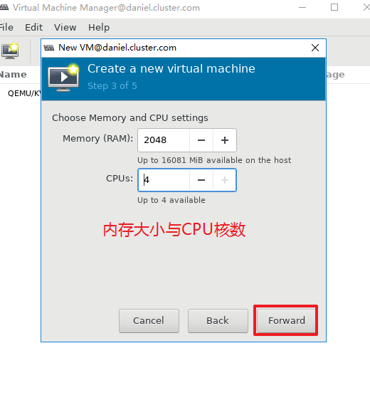

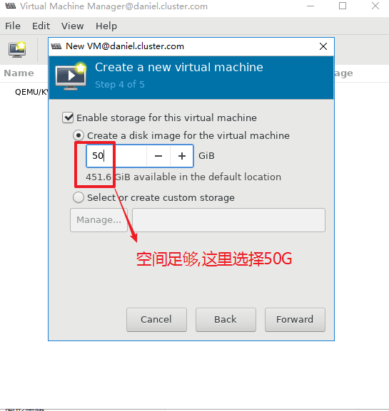

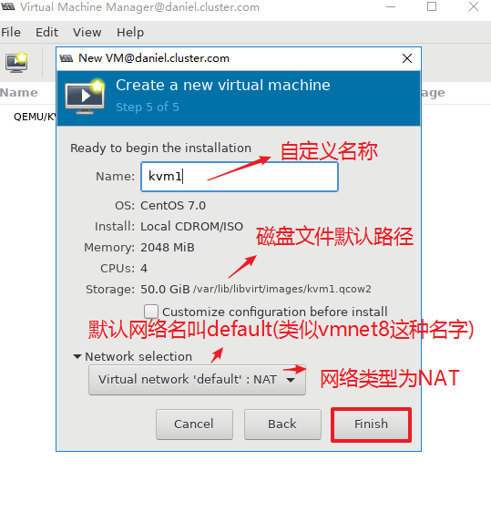

点了Finish后，就是装系统的界面了。怎么安装系统就在这里不再说明了。

## 命令安装方式

安装命令为virt-install,可以通过--help查看参数帮助

~~~powershell
# virt-install --help
~~~

如果你的物理机是默认分区，它会使用lvm，根分区比较小，但/home目录很大，在这里我们就在/home目录建立一个目录,然后指定kvm虚拟机安装到此目录

~~~powershell
# mkdir /home/kvm_images/
~~~

~~~powershell
# virt-install  --name "kvm2" --memory 2048,maxmemory=4096 --vcpus 2,maxvcpus=4 --disk=/home/kvm_images/kvm2.qcow2,size=50 -l /share/iso/CentOS-7-x86_64-DVD-1810.iso --network bridge=virbr0
~~~

说明: 

* --name指定安装的虚拟机名称
* --memory指定安装的虚拟机内存大小,单位为MB。maxmemory指定可以在线调整的最大内存值。
* --vcpus指定安装的虚拟机CPU核数。maxvcpus=4指定可以在线调整的最大cpu核数。
* --disk指定创建的磁盘路径,qcow2是一种磁盘格式,后面章节有说明
* --size指定创建的磁盘大小，单位为GB
* -l指定安装ISO路径
* --network指定网络(virbr0其实就是名称为default类型为NAT的网络，想了解更多请参考后面网络章节)


**问题:**上面两种方式装系统时都是需要手动安装 ,如何自动安装?

虚拟机一般不需要经常手动安装系统。

可以考虑使用物理服务器的cobbler实现自动安装。

后面学习云计算就直接套用镜像即可。


## 图形删除虚拟机

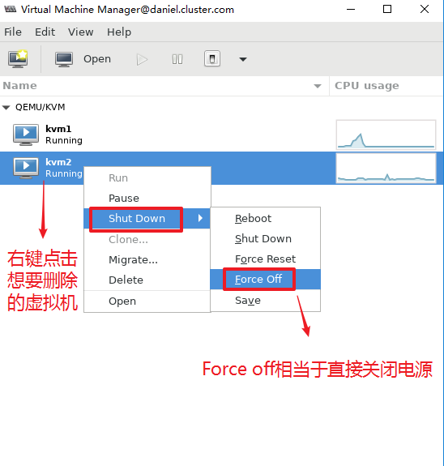


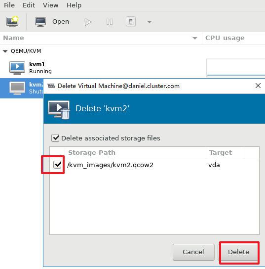


**练习:** 请安装1到2台centos7的虚拟机实验环境,并做基本优化(关闭防火墙,selinux,配置IP和主机名等)


# kvm基础管理命令

命令帮助

```powershell
# virsh help
因为参数很多，可以用像domain,network,monitor这种关键字，只查看与关键字有关的参数帮助

# virsh help domain					一个虚拟机就称为一个domain
# virsh help network
# virsh help monitor
......
```

## 查看虚拟机列表

只查看运行中的虚拟机

~~~powershell
# virsh  list
 Id    Name                           State
----------------------------------------------------
 1     kvm1                           running
~~~

查看所有状态的虚拟机

~~~powershell
# virsh list --all
 Id    Name                           State
----------------------------------------------------
 1     kvm1                           running
 -     kvm2                           shut off
~~~

## 启动,关闭,重启

启动一个虚拟机

~~~powershell
# virsh  start kvm1
~~~

正常关闭一个虚拟机(把服务都停掉，再关电源)

~~~powershell
# virsh shutdown kvm1
~~~

正常重启一个虚拟机,先shutdown再start

~~~powershell
# virsh reboot kvm1
~~~

强制关闭一个虚拟机,类似断电,可以瞬间关闭虚拟机 

~~~powershell
# virsh destroy kvm1
~~~

reset相当于是先destroy,再start

~~~powershell
# virsh  reset kvm1
~~~

## 保存,暂停

把kvm1关闭，并把当前状态保存为一个文件

~~~powershell
# virsh save kvm1 /etc/libvirt/qemu/kvm1.save
~~~

通过保存的文件，恢复当时save时的状态

~~~powershell
# virsh restore /etc/libvirt/qemu/kvm1.save
~~~

暂停kvm1的状态

~~~powershell
# virsh suspend kvm1
~~~

由暂停切换为继续的状态

~~~powershell
# virsh resume kvm1
~~~

## 连接

方法一:宿主机打开管理器，双击你要连接的虚拟机(需要宿主机图形环境)

~~~powershell
# virt-manager
~~~

方法二:宿主机连接一个已经启动的虚拟机，并使用图形查看(需要宿主机图形环境)

~~~powershell
# virt-viewer kvm1
~~~

方法三:非图形环境就可以连接，只要网络OK

~~~powershell
# ssh x.x.x.x
~~~

方法四:在宿主机上直接console连接（此方法不需要虚拟机配置ip都行,但需要配置授权)

~~~powershell
# virsh console kvm1
~~~

**配置授权的方法**

1,在kvm1虚拟机里操作（**==注意==**: **不是在宿主机上操作.整篇文档只有这两条命令是在虚拟机里操作的**)

```powershell
# grubby --update-kernel=ALL --args="console=ttyS0"
# reboot
```

2,在宿主机`virsh console kvm1`连接使用 

3, 退出的方式
exit只是退出登录的用户而已
要完全退出这个console连接,需要使用的是**==ctrl+ ]==** (也就是右中框号的这个键）


**远程连接(了解)**

可以通过ssh协议实现远程KVM虚拟机的图形访问


下面命令表示图形远程连接192.168.2.105的kvm1虚拟机(**需要远程root的ssh密码,可以做免密**)

~~~powershell
# virt-viewer -c qemu+ssh://root@192.168.2.105/system kvm1
~~~


图形远程连接管理

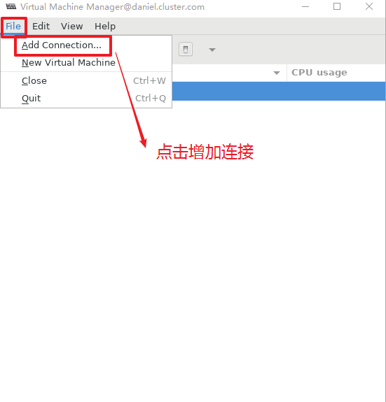


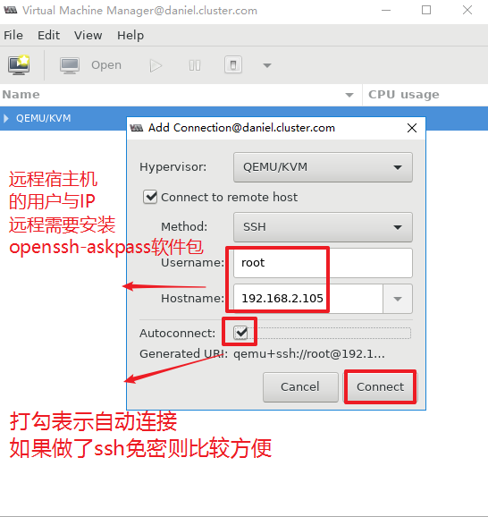


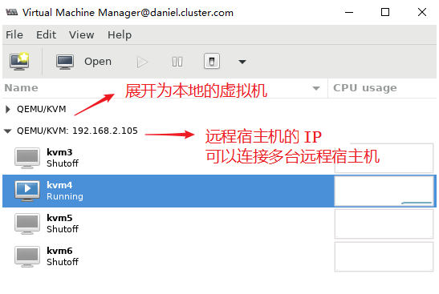


# kvm虚拟机相关文件

以kvm1为例，最主要的文件有两个

1. 配置文件: **/etc/libvirt/qemu/kvm1.xml** (xml格式)
2. 磁盘文件默认路径: **/var/lib/libvirt/images/kvm1.qcow2** (如果修改了路径，则在你修改的地方)


## 查看配置文件

方法一:

~~~powershell
# vim /etc/libvirt/qemu/kvm1.xml
~~~

方法二:

~~~powershell
# virsh edit kvm1
~~~

说明: 此方法默认是调用vi，如果喜欢使用vim的可以做个软链接,让访问vi实际链接到vim就可以了

~~~powershell
# which vi
/usr/bin/vi
# which vim
/usr/bin/vim
# mv /usr/bin/vi /usr/bin/vi.bak
# ln -s /usr/bin/vim /usr/bin/vi
~~~

**配置文件里的内容主要关注以下几段**

~~~powershell
<domain type='kvm'>
  <name>kvm1</name>												虚拟机名称
  <uuid>904d629d-964e-4a5d-b103-1934c579db27</uuid>				
  <memory unit='KiB'>1048576</memory>							内存大小
  <currentMemory unit='KiB'>1048576</currentMemory>
  <vcpu placement='static'>2</vcpu>								cpu核数


下面这一段代表磁盘文件
    <disk type='file' device='disk'>
      <driver name='qemu' type='qcow2'/>					  	qcow2为磁盘格式
      <source file='/var/lib/libvirt/images/kvm1.qcow2'/>		磁盘文件路径
      <target dev='vda' bus='virtio'/>			磁盘名称(kvm默认使用virtio总线,磁盘名以v开头)
      <address type='pci' domain='0x0000' bus='0x00' slot='0x07' function='0x0'/>
    </disk>					
    
    
下面这一段代表光驱    
    <disk type='file' device='cdrom'>
      <driver name='qemu' type='raw'/>
      <target dev='hda' bus='ide'/>
      <readonly/>
      <address type='drive' controller='0' bus='0' target='0' unit='0'/>
    </disk>
    
    
下面这一段代表网卡 
    <interface type='bridge'>
      <mac address='52:54:00:b3:cf:3a'/>
      <source bridge='virbr0'/>
      <model type='virtio'/>
      <address type='pci' domain='0x0000' bus='0x00' slot='0x03' function='0x0'/>
    </interface>
 
~~~

## 命令删除虚拟机

(假设删除kvm3)

1, 先关闭虚拟机

~~~powershell
# virsh destroy kvm3
~~~

2, undefine就是取消定义的意思，但此命令只会删除配置文件,不会删除磁盘文件

~~~powershell
# virsh undefine kvm3
~~~

3, 使用rm -rf删除磁盘文件

```powershell
# rm -rf /var/lib/libvirt/images/kvm3.qcow2
```

# kvm快照

kvm需要磁盘格式为qcow2才能实现快照(centos7已经默认就是qcow2格式了,centos6磁盘格式需要转换)


## 图形管理快照

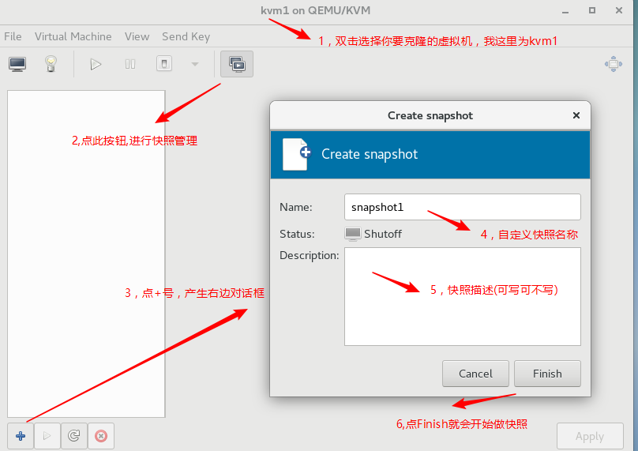

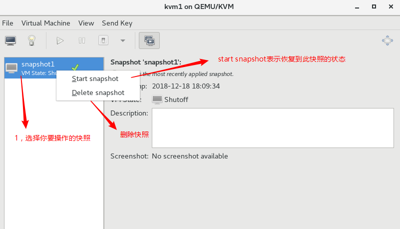

## 命令管理快照

查看相关帮助

~~~powershell
# virsh help snapshot
~~~

**主要管理命令:**

查看kvm1这个虚拟机的快照 

~~~powershell
# virsh snapshot-list kvm1
~~~

为kvm1当前状态创建一个快照，名称为snap1;后面的描述信息自定义

~~~powershell
# virsh snapshot-create-as --domain kvm1 snap1 --description "my first test snapshot"
~~~

恢复kvm1的快照snap1

~~~powershell
# virsh snapshot-revert kvm1 snap1
~~~

删除kvm1的快照snap1

~~~powershell
# virsh snapshot-delete kvm1 snap1
~~~


作业: 准备1台或以上虚拟机,要求:

* 网络用default网络(NAT类型)
* 主机名绑定
* IP地址静态
* 关闭防火墙,selinux
* init 3调为3级别
* 时间同步
* yum源保持默认
* console连接


**最后做一个快照**


# kvm克隆

**==注意==**：克隆都需要源虚拟机器是**关闭**或**暂停**状态, 所以请先关闭或暂停你的虚拟机，再做克隆

## 图形克隆

假设以kvm1为源虚拟机

1, 先`virsh destory kvm1`关闭kvm1或 `virsh suspend kvm1`暂停kvm1

2, virt-manager－－》右键点kvm1－－》选择clone－－》修改克隆后的名字或其它参数－－》点clone

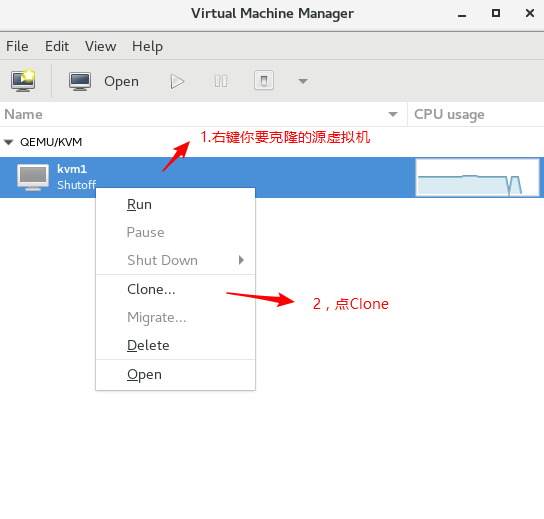

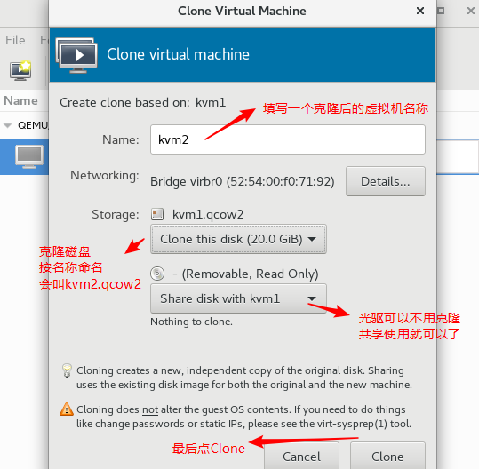

## 命令克隆

~~~powershell
把kvm1克隆成kvm3,指定磁盘路径为/var/lib/libvirt/images/kvm3.qcow2
# virt-clone -o kvm1 -n kvm3 -f /var/lib/libvirt/images/kvm3.qcow2 
Allocating kvm3.qcow2  7% [-          ]  34 MB/s | 957 MB     05:29 ETA
~~~

## 手动克隆(了解)

手动克隆的方式比较麻烦，这里演示一下，主要是让大家能对克隆能更深入的理解

1, 拷贝配置文件和磁盘文件

~~~powershell
# cp /etc/libvirt/qemu/kvm1.xml /etc/libvirt/qemu/kvm4.xml
# cp /var/lib/libvirt/images/kvm1.qcow2 /var/lib/libvirt/images/kvm4.qcow2
~~~

2, 修改拷贝后的配置文件

~~~powershell
# vim /etc/libvirt/qemu/kvm4.xml

主要改以下几个地方,其它地方都不变（没有标注行号,自己找一下)

<domain type='kvm'>
  <name>kvm4</name>										虚拟机名称改为克隆后的名称kvm4
  <uuid>904d629d-964e-4a5d-b103-1934c579db88</uuid>	  uuid随便改几个字符,和以前不一样就行	
  <memory unit='KiB'>1048576</memory>						
  <currentMemory unit='KiB'>1048576</currentMemory>
  <vcpu placement='static'>2</vcpu>	


    <disk type='file' device='disk'>
      <driver name='qemu' type='qcow2'/>				
      <source file='/var/lib/libvirt/images/kvm4.qcow2'/>	磁盘文件路径要改
      <target dev='vda' bus='virtio'/>
      <address type='pci' domain='0x0000' bus='0x00' slot='0x07' function='0x0'/>
    </disk>					
        
   
    <interface type='bridge'>
      <mac address='52:54:00:b3:cf:4a'/>   MAC地址后三位改1个字符就行(但不要改成f之后的字符)
      <source bridge='virbr0'/>
      <model type='virtio'/>
      <address type='pci' domain='0x0000' bus='0x00' slot='0x03' function='0x0'/>
    </interface>
~~~

3，保存后,使用virsh list --all查看不到的,需要define一下

```powershell
# virsh define /etc/libvirt/qemu/kvm4.xml

# virsh list --all		--再查就可以查看到kvm4
 Id    Name                           State
----------------------------------------------------
 -     kvm1                           shut off
 -     kvm2                    		  shut off
 -     kvm3                           shut off
 -     kvm4                           shut off
```

4, 可以启动验证使用了

```powershell
# virsh start kvm4
```

# kvm网络管理

我们先简单回顾和总结一下网络里的几个重要知识点:

1. 连接到同一个交换机(这里不讨论三层交换机)的两张网卡，给他们配置同网段的不同IP，就可以直接通迅。
2. 跨网络访问才会用到路由,网关,NAT等技术(这里我们不讨论这些技术)。

## 查看网络

只查看与网络有关的帮助参数

~~~powershell
# virsh help network
~~~

查看所有的网络,默认只有一个网络(这个名叫default的网络是一个NAT类型的私有网络)

~~~powershell
# virsh net-list --all
Name                 State      Autostart
-----------------------------------------
default              active     yes 	
~~~

~~~powershell
# virsh net-info default
Name            default
UUID            704eb1b7-3feb-4a38-8642-9c3fe2f023bb
Active:         yes
Persistent:     yes
Autostart:      yes
Bridge:         virbr0

virbr0是在宿主机上产生的一张网卡名,这张网卡就是连接到default网络上。如果虚拟机的网卡也连接到default网络,则与宿主机的virbr0属于同一个物理网络上
~~~

说明: 

* virbr0是在宿主机上产生的一张网卡名,这张网卡就是连接到default网络上。

* 如果虚拟机的网卡也连接到default网络,则与宿主机的virbr0属于同一个物理网络上

| 名词    | 说明                                               |
| ------- | -------------------------------------------------- |
| default | 网络名称                                           |
| virbr0  | 宿主机连接default网络的网卡名                      |
| NAT     | 网络类型,可以通过宿主上外网(和vmware的NAT类型一样) |

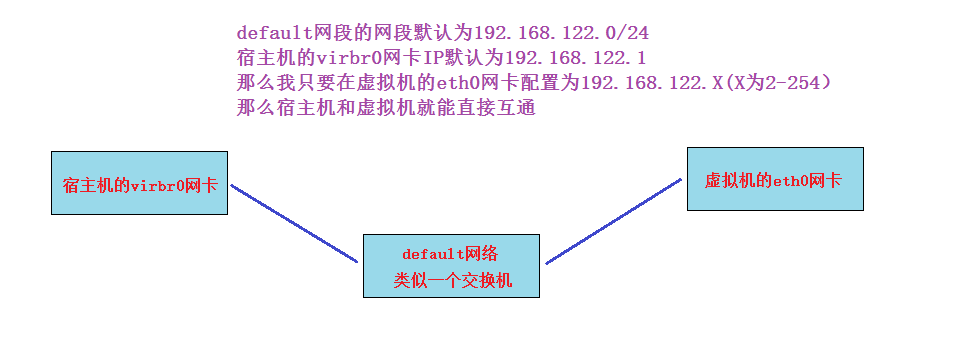

## 网络配置文件

以名为default的网络为例

配置文件路径: **/etc/libvirt/qemu/networks/default.xml**

查看方法

~~~powershell
# vim /etc/libvirt/qemu/networks/default.xml
或者
# virsh net-edit default
~~~

~~~powershell
<network>
  <name>default</name>
  <uuid>8b175966-55b2-469d-8685-5820050e9d86</uuid>
  <forward mode='nat'/>										类型
  <bridge name='virbr0' stp='on' delay='0'/>				宿主机上的网卡名
  <mac address='52:54:00:af:b2:fd'/>
  <ip address='192.168.122.1' netmask='255.255.255.0'>		宿主机上virbr0网卡的IP
    <dhcp>
      <range start='192.168.122.2' end='192.168.122.254'/>	此网络分配的网段
    </dhcp>
  </ip>
</network>
~~~

## 网络的停止与启动

停掉default网络，用`virsh net-list --all`去查看，状态变为inactive

~~~powershell
# virsh net-destroy default
~~~

启动default网络，状态变为active

~~~powershell
# virsh net-start default
~~~


## 增加网络

### 网络类型

| 网络类型           | 说明                                                         |
| ------------------ | ------------------------------------------------------------ |
| isolated(私有网络) | 没有NAT,也没有网关(和vmware的hostonly类型类似)               |
| NAT(私有网络)      | 有网关,有NAT,可以通过宿主机上外网(和vmware的NAT类型类似)     |
| routed(私有网络)   | 在isolated的基础上加了一个网关(和vmware的hostonly类型类似，但多了一个网关) |
| bridge(非私有网络) | 桥接到宿主机的物理网卡上,虚拟机网卡和宿主机的物理网卡通过此网络可连接在一起 |

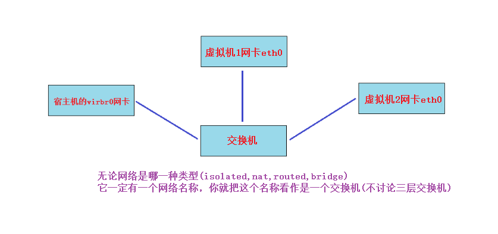

> **问题**: 一台宿主机能创建几个bridge网络,几个私有网络?
>
> 答: bridge网络创建的个数与宿主机的物理网卡一致，也就是说: 宿主机有几个物理网络,就能创建几个bridge网络。
>
> 私有网络的创建个数不受限制(但也有例外:vmware新版本里NAT类型创建个数也与宿主机物理网卡一致)
>
> **问题**: 如果一个教室，每一个人都需要独立的账号拨号上网,请问你的虚拟机如何上网?
>
> 答: 宿主机拨号上网，然后虚拟机使用NAT网络类型就可以上网。
>
> **问题**: 如果一个教室，电脑直接连教室的路由器,由路由器dhcp分配IP上网,请问你的虚拟机如何上网?
>
> 答: 直接bridge网络就可以上网。因为虚拟机连bridge网络就和宿主机的物理网卡在一个物理网络上，教室路由器平等分配IP给虚拟机的网卡。但bridge网络的问题是: **如果张三和李四的虚拟机都连bridge网络，那么他们配置的IP不能相同，否则冲突。所以==在教学环境,大家都使用多台虚拟机连bridge网络做实验,IP很容易就冲突了。私有网络就没有此顾虑==**。


**总结**: 用什么类型的网络也是视具体情况而定。

在教学环境中,我为了防止IP冲突,一般会选择私有类型的网络。

但如果有上公网的需求(比如需要连接公网的yum源安装软件)，我这里就倾向于选择**==NAT类型==**的私有网络(**它既不用担心与其它同学的IP冲突，又可以通过宿主机上公网**)

如果有上公网的需求，又有多网络的实验，我这里就倾向于选择**==1个为NAT类型，其它为isolated类型==**(isolated类型相当于是纯净版的私有网络)


### 图形增加网络

virt-manager－－》edit －－》connections details －－》 virtual networks－－》点左下角的+号增加一个私有网络（选择名字，分配网段，网络类型和dhcp的分配范围）

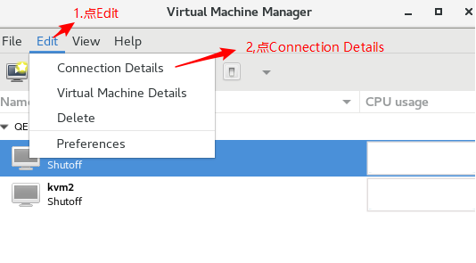

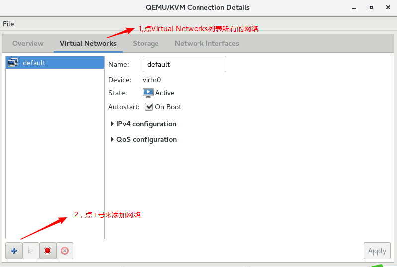

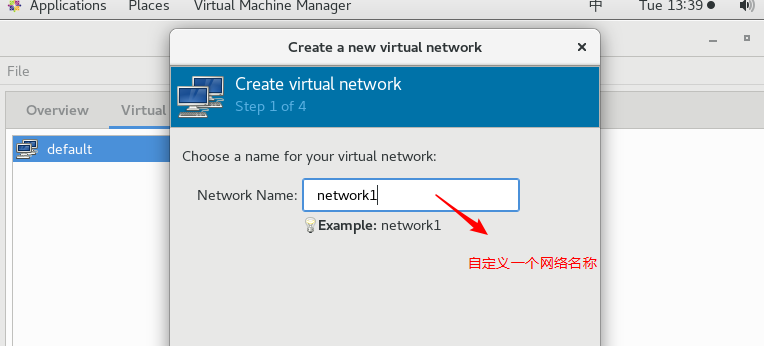

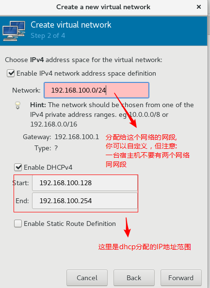

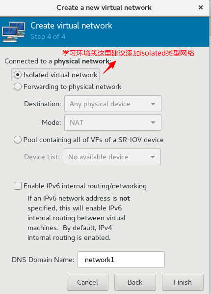

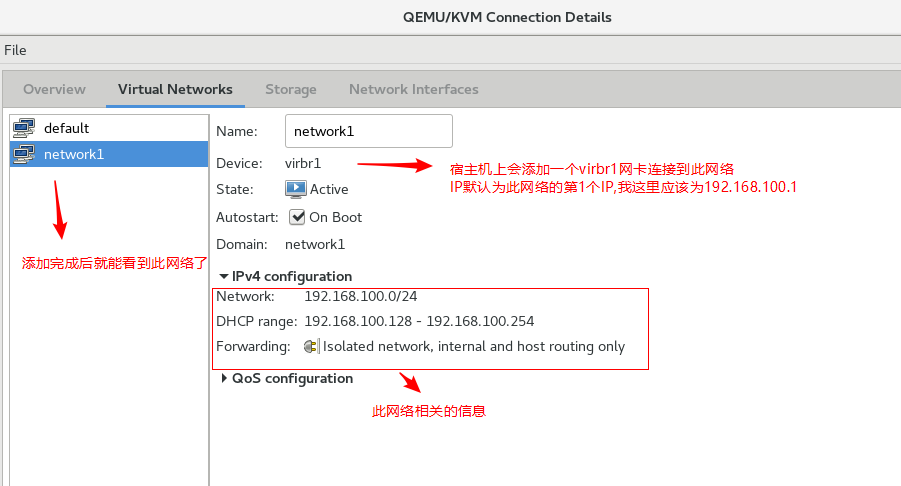

### 命令增加网络(了解)

1,拷贝配置文件并修改

~~~powershell
# cp /etc/libvirt/qemu/networks/network1.xml /etc/libvirt/qemu/networks/network2.xml

# vim /etc/libvirt/qemu/networks/network2.xml
<network>
  <name>network2</name>									名称由network1改为network2
  <uuid>d1203347-bc49-40dc-bd26-d25dfb47647a</uuid>   	uuid随便改几个字符
  <bridge name='virbr2' stp='on' delay='0'/>			由virbr1改为virbr2
  <mac address='52:54:00:53:59:df'/>					MAC后三位随便改1个字符就OK了
  <domain name='network2'/>								由network1改为network2
  <ip address='192.168.101.1' netmask='255.255.255.0'>	换一个没用过的网段192.168.101.0/24
    <dhcp>
      <range start='192.168.101.128' end='192.168.101.254'/>  dhcp范围也要改成对应网段
    </dhcp>
  </ip>
</network>

~~~

2, 定义修改好的网络配置文件

~~~powershell
net-define后,可以查看到网络,但是状态是inactive状态，也没有设置自动启动
# virsh net-define /etc/libvirt/qemu/networks/network2.xml
# virsh net-list --all
 Name                 State      Autostart     Persistent
----------------------------------------------------------
 default              active     yes           yes
 network1             active     yes           yes
 network2             inactive   no            yes
~~~

3，启动网络

~~~powershell
# virsh net-start network2
Network network2 started

# virsh net-list --all
 Name                 State      Autostart     Persistent
----------------------------------------------------------
 default              active     yes           yes
 network1             active     yes           yes
 network2             active     no            yes

# ifconfig virbr2 |head -3
virbr2: flags=4099<UP,BROADCAST,MULTICAST>  mtu 1500
        inet 192.168.101.1  netmask 255.255.255.0  broadcast 192.168.101.255
        ether 52:54:00:53:59:df  txqueuelen 1000  (Ethernet)

~~~

4, 设置网络为开机自动启动

~~~powershell
# virsh net-autostart network2
Network network2 marked as autostarted

# virsh net-list --all
 Name                 State      Autostart     Persistent
----------------------------------------------------------
 default              active     yes           yes
 network1             active     yes           yes
 network2             active     yes           yes

下面目录里就会多了network2.xml
# ls /etc/libvirt/qemu/networks/autostart/
default.xml  network1.xml  network2.xml

~~~

### 修改私有网络

我这里把default网络的192.168.122.0/24网段修改成10.1.1.0/24网段(**再次强调修改的网段在宿主机上不能被其它网段占用，否则冲突**)

1, 打开网络配置文件并修改网段

~~~powershell
# virsh net-edit default
~~~

~~~powershell
<network>
  <name>default</name>
  <uuid>ad878490-5da7-44a7-8e27-1979a3802024</uuid>
  <forward mode='nat'/>
  <bridge name='virbr0' stp='on' delay='0'/>
  <mac address='52:54:00:06:18:19'/>
  <ip address='10.1.1.1' netmask='255.255.255.0'>	修改
    <dhcp>
      <range start='10.1.1.2' end='10.1.1.254'/>	修改
    </dhcp>
  </ip>
</network>
~~~

2, 停止网络

~~~powershell
# virsh net-destroy default
Network default destroyed
~~~

3, 启动网络

~~~powershell
# virsh net-start default
error: Failed to start network default
error: internal error: Network is already in use by interface enp2s0
报错: 网络已经被宿主机的网卡enp2s0占用
解决方法:
# ifconfig enp2s0 down
# virsh net-start default
Network default started
# ifconfig enp2s0 up
~~~

4, 验证成功

~~~powershell
# ifconfig virbr0
virbr0: flags=4099<UP,BROADCAST,MULTICAST>  mtu 1500
        inet 10.1.1.1  netmask 255.255.255.0  broadcast 10.1.1.255
~~~

## 删除网络

### 图形删除网络

virt-manager－－》edit －－》connections details －－》 virtual networks－－》选择你要删除的网络，然后左下角，先停，再删除就可以了

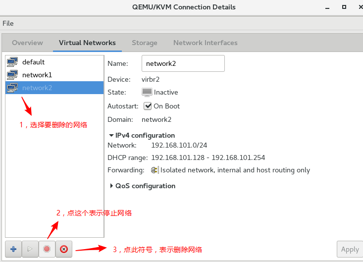

### 命令删除网络

1, 先停掉要删除的网络

~~~powershell
# virsh net-destroy default2
~~~

2, 用net-undefine删除网络,网络配置文件也会被删除

~~~powershell
# virsh net-undefine default2
~~~


## 增加bridge网络

假设宿主机的物理网卡名为enp2s0,这里我们增加一个bridge网卡br0(此名字自定义)桥接到enp2s0

1, 在宿主机上确认NetworkManager服务关闭

~~~powershell
# systemctl stop NetworkManager
# systemctl disable NetworkManager
# systemctl status NetworkManager
~~~

2, 配置网卡配置文件

~~~powershell
原物理网卡enp2s0里的配置只留下这三句就可以了
# vim /etc/sysconfig/network-scripts/ifcfg-enp0s25
DEVICE="enp0s25"
ONBOOT="yes"
BRIDGE=br0

新建一个br0网卡的配置文件
# vim /etc/sysconfig/network-scripts/ifcfg-br0
DEVICE=br0					--名字对应好
TYPE=Bridge					--这里的Birdge,B要大写,后面的irdge要小写
BOOTPROTO=static
IPADDR=192.168.X.X			--把原来enp2s0物理网卡的IP写在这里
NETMASK=255.255.255.0
GATEWAY=192.168.X.X			--把原来enp2s0物理网卡的网关写在这里
DNS1=114.114.114.114
ONBOOT=yes
~~~

3, 重启网络

~~~powershell
# systemctl restart network

下面命令查看相应的IP
# ifconfig br0         --有IP
# ifconfig enp2s0	   --没有IP了，这是正常的	
~~~


## 修改网卡连接网络

**图形修改**

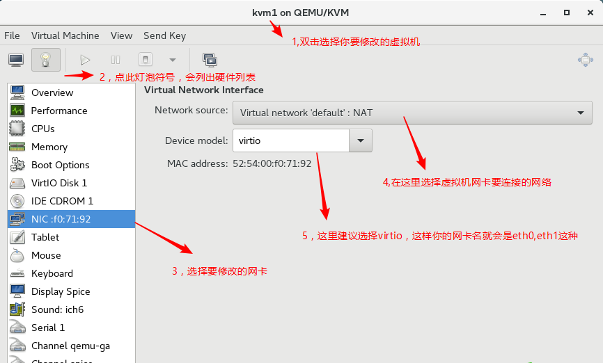

**命令修改**

比如把kvm1的网卡由default改成br0桥接网络

~~~powershell
# virsh edit kvm1

    <interface type='network'>
      <mac address='52:54:00:f0:71:92'/>
      <source network='default'/>
      <model type='virtio'/>
      <address type='pci' domain='0x0000' bus='0x00' slot='0x03' function='0x0'/>
    </interface>

改成下面的样子

    <interface type='bridge'>		--network改成了bridge
      <mac address='52:54:00:f0:71:92'/>
      <source bridge='br0'/>		--network改成了bridge;default改成了br0
      <model type='virtio'/>
      <address type='pci' domain='0x0000' bus='0x00' slot='0x03' function='0x0'/>
    </interface>

# virsh shutdown kvm1
# virsh start kvm1
~~~


**测试完后,请保留default这个nat类型的网络,其它网络可以删除掉。**


# 设备管理

## **图形添加磁盘**

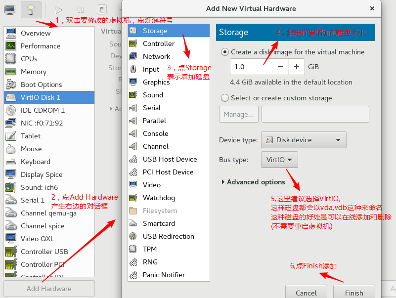

## **图形删除磁盘**

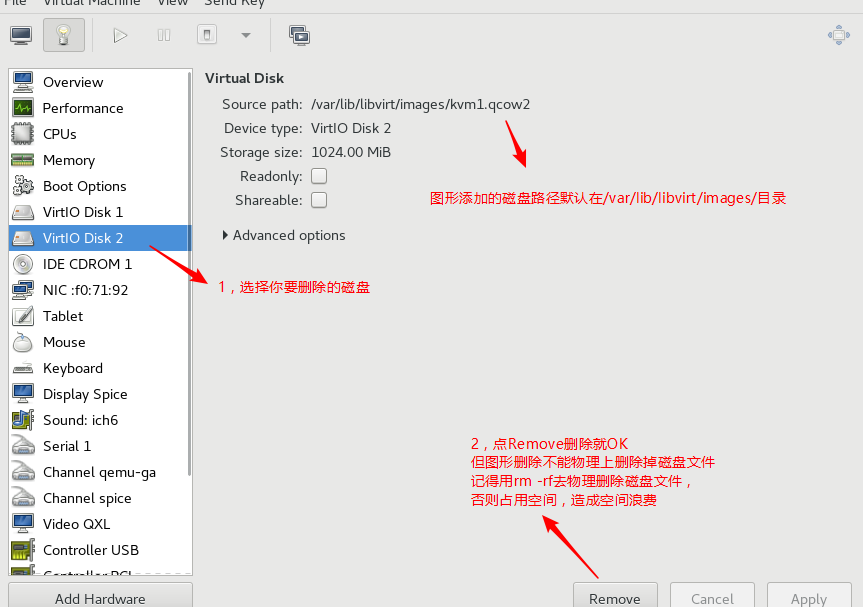


**练习: 同样的方法也可以添加或删除网卡**


# 磁盘镜像管理

镜像: 一般指用来做为模板的样本。如iso镜像用来安装系统，raid1镜像数据。

在这里我们所说的镜像指的是**磁盘镜像**。

也就是说用一个安装好了linux系统的磁盘文件进行克隆批量操作，这个源磁盘文件就是镜像。


kvm的磁盘管理由qemu负责, qemu支持的镜像格式主要为:

* **raw**	     简单的二进制镜像文件，一次性占用分配的磁盘空间。

* **qcow2**     全称为: qemu copy on write 写时复制技术(**第二代的QEMU写时复制技术**)

  

推荐使用qcow2镜像格式，它支持稀疏文件，支持快照，支持后备镜像等。


**什么是稀疏文件?**

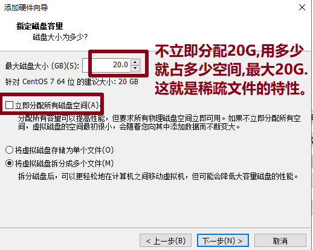


## 创建磁盘镜像

**创建raw格式磁盘镜像**

(或者使用`dd if=/dev/zero of=disk1.raw bs=1M count=1024`创建的文件也为raw格式)

~~~powershell
# qemu-img create disk1.raw 1G

# qemu-img info disk1.raw
image: disk1.raw
file format: raw
virtual size: 1.0G (1073741824 bytes)
disk size: 0
~~~

**创建qcow2格式磁盘镜像**

~~~powershell
# qemu-img create disk2.qcow2 -f qcow2 1G

# qemu-img info disk2.qcow2
image: disk2.qcow2
file format: qcow2
virtual size: 1.0G (1073741824 bytes)
disk size: 196K
cluster_size: 65536
Format specific information:
    compat: 1.1
    lazy refcounts: false
~~~

~~~powershell
# ll disk*
-rw-r--r-- 1 root root 1073741824 Jul 10 23:27 disk1.raw
-rw-r--r-- 1 root root     197120 Jul 10 23:29 disk2.qcow2
~~~


## 磁盘镜像格式转换

**raw转qcow2格式**

~~~powershell
# qemu-img convert -p -f raw -O qcow2 disk1.raw disknew1.qcow2
~~~

**qcow2格式转raw格式**

~~~powershell
# qemu-img convert -p -f qcow2 -O raw disk2.qcow2 disknew2.raw
~~~


## 后备镜像转差量镜像


在`vmware workstation`中我们认识过完全克隆与链接克隆。

完全克隆:  因为要完整拷贝一份源磁盘文件, 所以有如下特点:

* 速度较慢
* 占用磁盘空间翻倍
* 但克隆后的磁盘完全独立与原磁盘镜像

链接克隆: 使用cow(写时复制技术)并不用完整拷贝源磁盘文件，所以有如下特点:

* 速度快
* 占用磁盘空间少
* 但克隆后的磁盘仍然需要使用原磁盘镜像


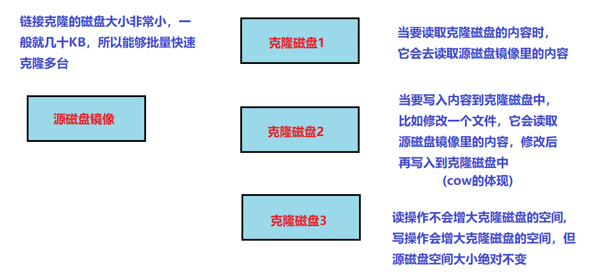


* 后备镜像其实就是源磁盘镜像，差量镜像也就是克隆磁盘。

* 后备镜像可以是raw或qcow2，差量镜像只能是qcow2

**格式为:**

```shell
# qemu-img create -f qcow2 -b 后备镜像路径 差量镜像路径
```

**实例:**

~~~powershell
# qemu-img create -f qcow2 -b /var/lib/libvirt/images/kvm2.qcow2 kvm2.bak.qcow2
~~~


# 编写虚拟机快速创建脚本

首先准备一个安装并优化OK的虚拟机,将配置文件与磁盘文件做成模板

使用差量镜像与sed修改配置文件里的**名称**,**uuid**,**disk路径**,**mac**,再使用


1,准备模板配置和虚拟机磁盘文件(这里以安装并优化OK的kvm1虚拟机为拷贝模板)

~~~powershell
# mkdir /share/kvm -p
# cp /etc/libvirt/qemu/kvm1.xml /share/kvm/centos7.6.xml
# cp /var/lib/libvirt/images/kvm1.qcow2 /share/kvm/centos7.6.qcow2
~~~

2,修改配置文件里的**名称,uuid,disk路径,mac分别为vmname,vmuuid,vmdisk,vmmac**这4个名称

~~~powershell
# vim /share/kvm/centos7.6.xml

<domain type='kvm'>
  <name>vmname</name>											修改为vmname
  <uuid>vmuuid</uuid>											修改为vmuuid
......
......
......
    <disk type='file' device='disk'>
      <driver name='qemu' type='qcow2'/>
      <source file='vmdisk'/>									修改为vmdisk
      <target dev='vda' bus='virtio'/>
      <address type='pci' domain='0x0000' bus='0x00' slot='0x07' function='0x0'/>
    </disk>
......
......
......
    <interface type='network'>
      <mac address='vmmac'/>									修改为vmmac
      <source network='default'/>
      <model type='virtio'/>
      <address type='pci' domain='0x0000' bus='0x00' slot='0x03' function='0x0'/>
    </interface>
......
......
......
~~~

3，编写脚本(可以自由修改)

~~~powershell
# vim /share/kvm/create_kvm.sh

#!/bin/bash

# 使用下面命令产生符合格式的uuid和MAC地址
vmuuid=$(uuidgen)
vmmac="52:54:$(dd if=/dev/urandom count=1 2>/dev/null | md5sum | sed -r 's/^(..)(..)(..)(..).*$/\1:\2:\3:\4/')"


read -p "请输入要创建的kvm虚拟机名称:" name
vmname=/etc/libvirt/qemu/$name
vmdisk=/var/lib/libvirt/images/$name.qcow2

# 拷贝模板到对应的路径位置,磁盘文件使用的是差量镜像
cp /share/kvm/centos7.6.xml $vmname.xml
qemu-img create -f qcow2 -b /share/kvm/centos7.6.qcow2 $vmdisk &> /dev/null


# 将上面产生好的变量值使用sed修改配置文件,并define使之生效(sed使用#,因为路径为/,用#替换不用转义)
sed -ri "s#vmname#$name#"   $vmname.xml
sed -ri "s#vmuuid#$vmuuid#" $vmname.xml
sed -ri "s#vmdisk#$vmdisk#" $vmname.xml
sed -ri "s#vmmac#$vmmac#"   $vmname.xml

virsh define $vmname.xml

echo "$name创建完成"
virsh list --all
~~~

4，执行测试

~~~powershell
# sh /share/kvm/create_kvm.sh
~~~


参考另外一种产生mac地址后4位的脚本

~~~powershell
#!/bin/bash

array=(0 1 2 3 4 5 6 7 8 9 a b c d e f)

for i in `seq 8`
do
        if [ $[$i%2] -eq 1 ];then
                echo -n ":"${array[$[$RANDOM%16]]}
        else
                echo -n ${array[$[$RANDOM%16]]}
        fi
done

~~~


脚本另一种写法参考

~~~powershell
#!/bin/bash

uuid=$(uuidgen)
vmmac="52:54:$(dd if=/dev/urandom count=1 2>/dev/null | md5sum | sed -r 's/^(..)(..)(..)(..).*$/\1:\2:\3:\4/')"
read -p "输入你要创建的虚拟机名称:" name

configname=/etc/libvirt/qemu/${name}.xml
diskpath=/var/lib/libvirt/images/${name}.qcow2

cp /share/kvm/centos7.6.xml  $configname

qemu-img create -f qcow2 -b /share/kvm/centos7.6.qcow2 $diskpath


sed -i 's/vmname/'$name'/' $configname
sed -i 's/vmuuid/'$uuid'/' $configname
sed -ri 's#vmdisk#'$diskpath'#' $configname
sed -ri 's#vmmac#'$vmmac'#' $configname

virsh define $configname
echo "$name创建成功"
virsh list --all

~~~

