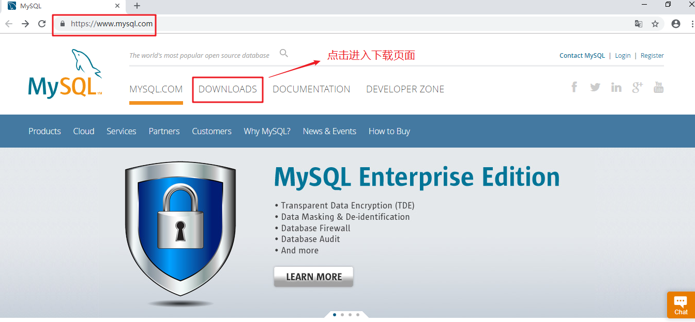
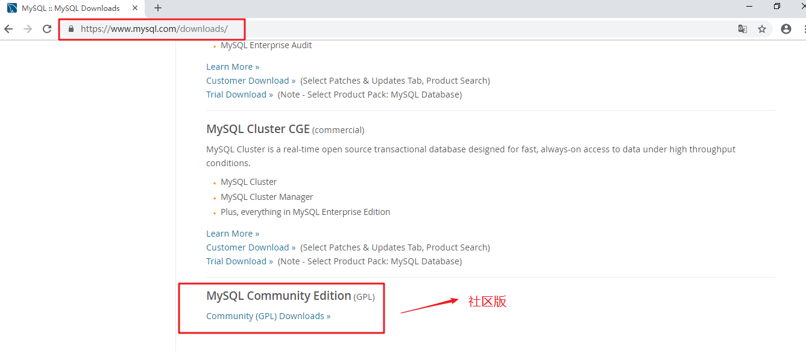
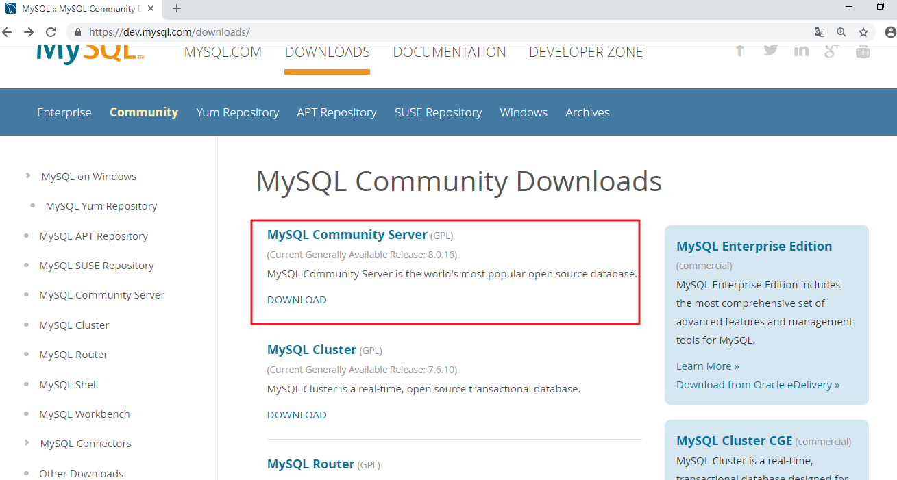
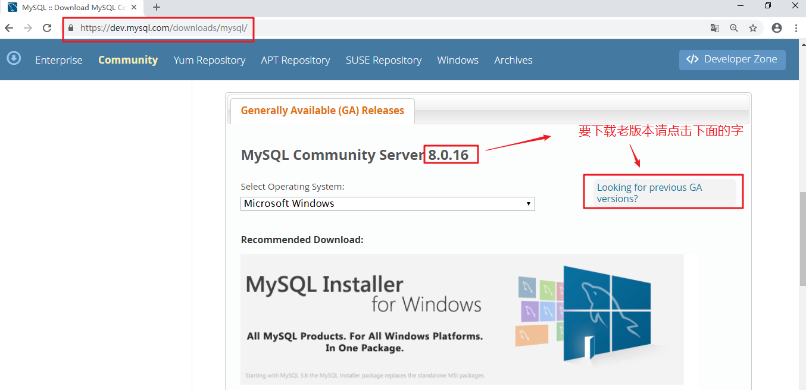
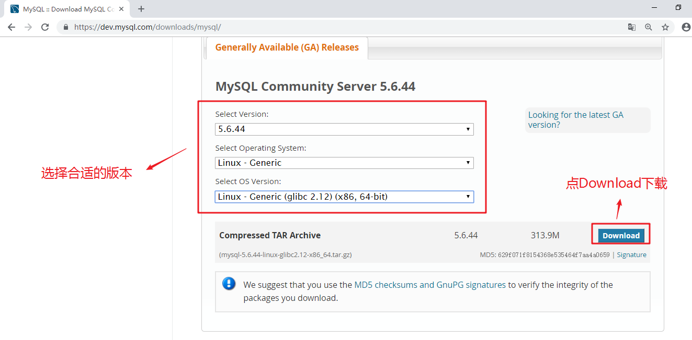
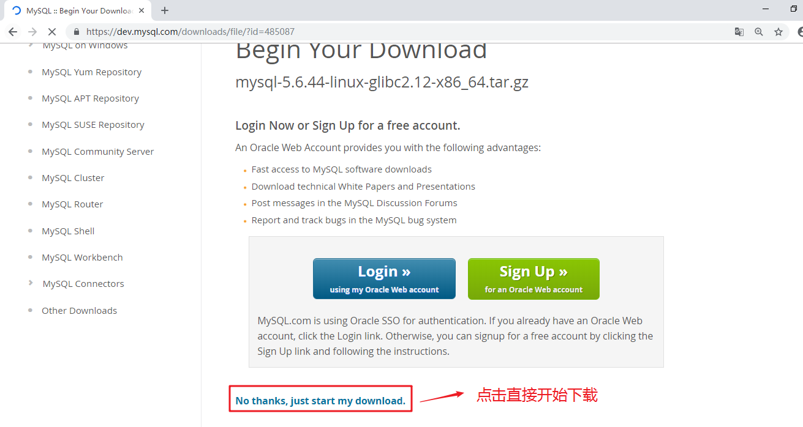
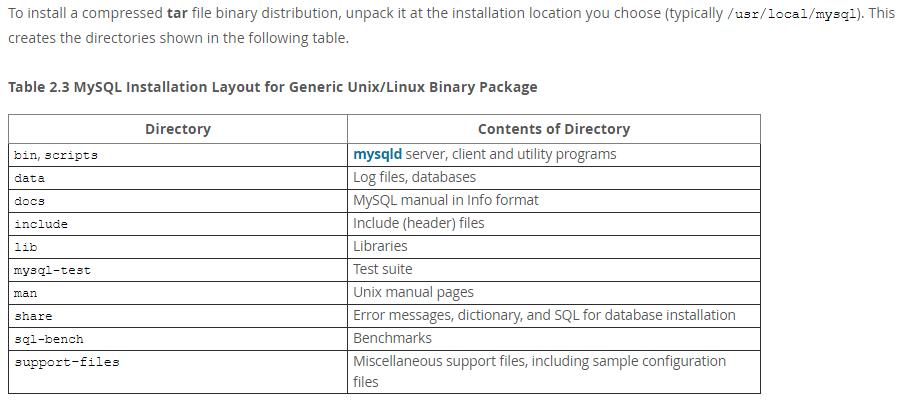
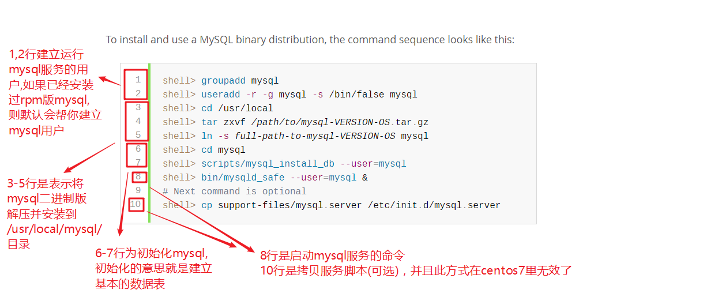
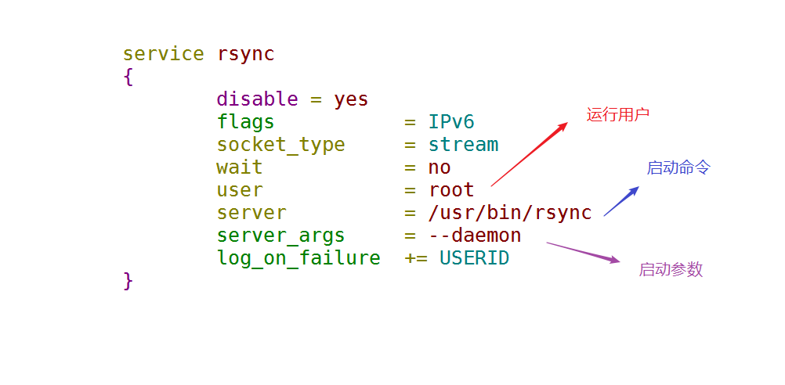
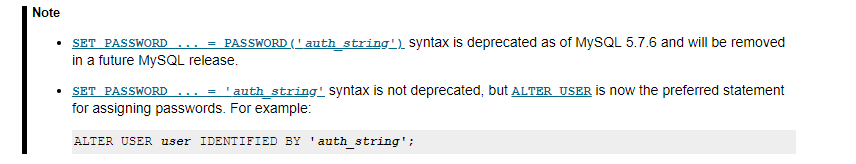

# 1任务背景

公司原来的业务跑在**单机LAMP**环境下,业务发展后, 单台服务器已经不能顶住压力与负载, 所以我们需要将**==LAMP分离==**实现多机服务器的架构。而且原服务器为centos6系统, 我们也希望升级为centos7,并将mysql跑在centos7平台上。最后实现mysql的**==管理==**,**==备份==**,**==迁移==**,**==架构==**。


目前lamp分为: apache+php(php是apache的一个模块),   mysql

后面lnmp分为: nginx,  php(为一个单独的服务),  mysql


# 任务要求

1, 能够按需求灵活的安装与管理数据库,并将单机LAMP环境中的mysql拆分出来

2, 制定备份策略实现自动备份


# 任务拆解

1. 新服务器安装Centos7, 学会mysql数据库的多种安装方式
2. 了解mysql体系结构
3. 学会mysql数据库的基本管理命令
4. 实现mysql的备份，并制定备份策略
5. 将原单机LAMP的mysql数据迁移到新的数据库上


# 今日学习目标

- [ ] 能够通过官方网站获取相应的MySQL软件包及相关手册

- [ ] 能够使用glibc方式安装MySQL数据库

- [ ] 能够使用源码包的MySQL数据库

- [ ] 能够使用客户端工具mysqladmin管理数据库

- [ ] 熟练使用客户端工具mysql连接数据库


# 一、数据记录的演变(了解)

古代记录数据的方式有甲骨文(将字写在龟甲,兽骨上等),


又演变成出了竹简, 


造纸术发明后有纸张,

计算机出现后，有电子文档(如WORD或EXECL等)。


1. **但是如果是大量的数据怎么办?**

建个图书馆当然可以，但我要查一条数据要先找到是哪个书架上的哪本书，再找第几页。等你找到需要的数据时,时间可能已经过去10分钟了.

所以不光需要存放大量数据，但要快速有效的管理(查询与修改等)。比如大型网站，微信，银行的用户数据与用户行为。

最终答案很简单,使用**==数据库==**来存放,组织,管理数据。


# 二、数据库类型简介(了解)

数据库就是指存放，组织，管理数据的一类软件。此类型的软件非常多，但主要分为:

* 关系型数据库(relational database,简称RDB), 一般通过SQL(Structured Query Language)语句来进行增，删，改，查等操作。
* 非关系型数据库(Not Only SQL,简称NoSQL)
  * 列式数据库(如HBase)
  * key-value键值对数据库(如**Redis**,**Memcache**, etcd)
  * 文档型数据库(如**MongoDB**)
  * 全文搜索引擎(如**Elasticsearch**)
  * 等等

  除了上述介绍的数据库外，还有图形数据库，时间序列数据库等。


# 三、关系型数据库介绍

RDBMS（relational database management system）, 既关系型数据库管理系统. 我们常说MySQL数据库，其实是指MySQL数据库管理系统。

简单来说，关系型数据库，是指采用了==二维表格==来存放,组织,管理数据的数据库。


**常见的关系型数据库**

* Oracle 
* MySQL
* DB2(IBM)       
* Sybase
* SQL Server  （mssql)
* Access
* 等等


# 四、MySQL数据库介绍

MySQL是一种关系型数据库管理系统，由瑞典MySQL AB 公司开发，目前属于Oracle旗下。

MySQL三个流行的分支版本:

* 官方版本
* Percona Server
* MariaDB


##MySQL官方版本说明

**开源的类型:**

* 完全开源

* 商业开源

  

**mysql官方版本:**

- **社区版：MySQL Community Edition  (==GPL==) **
  1. 可以看做是企业版的“广泛体验版（小白鼠版）”，未经各个专有系统平台的压力测试和性能测试
  2. 基于GPL协议发布，可以随意下载使用 
  3. 没有任何官方技术支持服务 

- **企业版：MySQL Enterprise Edition(==commercial==) **
  1. 提供了比较全面的高级功能、管理工具及技术支持 
  2. 安全性、稳定性、可扩展性比较好

- **集群版：MySQL Cluster CGE(==commercial==) **

**扩展：关于版本的命名方式如何定义？**

| 版本                       | 说明                                                         |
| -------------------------- | ------------------------------------------------------------ |
| α（Alpha）版               | 内测版，内部交流或者专业测试人员测试用。Bug较多，普通用户最好不要安装。 |
| β（Beta）版                | 公测版，专业爱好者大规模测试用，存在一些缺陷，该版本也不适合一般用户安装。 |
| γ ( Gamma )版              | 相当成熟的测试版，与即将发行的正式版相差无几。               |
| Final                      | 正式版本                                                     |
| Free                       | 自由版本                                                     |
| Release                    | 发行版本                                                     |
| Standard                   | 标准版本                                                     |
| Mini                       | 迷你精简版本,只有最基本的功能                                |
| Upgrade                    | 升级版本                                                     |
| ==GA(GenerallyAvailable)== | 开发团队认为该版本是稳定版,可以在较为关键的场合使用。        |
| Retail                     | 零售版                                                       |


以后下载软件建议下载带有GA,stable,LTS(长期维护)等标签的版本


## MySQL的下载

官网：www.mysql.com














源码版的下载在官网比较难找，下面附一个下载链接，如果版本不一样，只需要修改版本即可

http://dev.mysql.com/get/Downloads/MySQL-5.6/mysql-5.6.44.tar.gz/from/http://mysql.mirror.rafal.ca/


##MySQL的安装方式

* rpm包安装

MySQL-server-5.6.44-1.el7.x86_64.rpm, **需要对应特定的linux系统版本**

* 基于glibc版本安装

或者叫二进制版本,mysql-5.6.44-linux-glibc2.12-x86_64.tar.gz

依赖[^glibc]库，**可以安装在通用的Linux系统下**

* 源码编译安装

mysql-5.6.44.tar.gz，**通用的Linux下都可以编译安装**

**三种安装方式比较**

| 安装方式        | 优点                                 | 缺点                                      |
| --------------- | ------------------------------------ | ----------------------------------------- |
| rpm             | 安装卸载简单                         | 可定制性差                                |
| glibc(二进制版) | 可定制性相比rpm包灵活些              | 安装相比rpm包复杂些，需要手动初始化数据库 |
| 源码安装        | **可定制性最强，根据需求和功能定制** | 安装麻烦，需要手动初始化数据库            |


#五、MySQL数据库的安装

## 1, 基于glibc版本安装

也可以称为二进制版本

### 安装须知

- 软件包介绍

~~~powershell
mysql-5.6.44-linux-glibc2.12-x86_64.tar.gz
说明：通用linux下的二进制包，已编译好，只需放到相应的安装目录里即可
~~~




### 安装步骤

参考官档：[MySQL-glibc安装手册](https://dev.mysql.com/doc/refman/5.6/en/binary-installation.html)

下图为官方文档里的安装过程说明




**规划**

运行服务的用户: mysql

MySQL的安装目录为：/usr/local/mysql/

MySQL的数据目录为:  /usr/local/mysql/data/

端口：3306

socket文件存放路径：/tmp/mysql.sock

**PS: 以上全为默认值，熟悉后全部可以按需求来修改**

#### ① 创建用户

```powershell
[root@vm1 ~]# groupadd -g 27 mysql
[root@vm1 ~]# useradd -u 27 -g mysql -s /sbin/nologin mysql
[root@vm1 ~]# id mysql
uid=27(mysql) gid=27(mysql) groups=27(mysql)
```

#### ② 解压,改名,修改权限

```powershell
将下载好的mysql软件包拷贝到服务器上(步骤省略)
解压(注意:我下面的命令中软件包路径为相对路径,请自行修改成对应的路径即可)
[root@vm1 ~]# tar xf mysql-5.6.44-linux-glibc2.12-x86_64.tar.gz -C /usr/local/

解压后目录名较长,建议改名一下
[root@vm1 ~]# mv /usr/local/mysql-5.6.44-linux-glibc2.12-x86_64/ /usr/local/mysql

确认目录安装OK
[root@vm1 ~]# ls /usr/local/mysql/
bin      data  include  man         README   share      support-files
COPYING  docs  lib      mysql-test  scripts  sql-bench
```

#### ③ 初始化数据库(重点)

~~~powershell
方法1:
[root@vm1 ~]# /usr/local/mysql/scripts/mysql_install_db --basedir=/usr/local/mysql/ --datadir=/usr/local/mysql/data --user=mysql

方法2:
[root@vm1 ~]# cd /usr/local/mysql/
[root@vm1 mysql]# scripts/mysql_install_db  --datadir=/usr/local/mysql/data --user=mysql
~~~

**参数说明:**

--datadir指定初始化数据的目录

--user指定初始化数据的用户

--basedir指定安装目录,如果不指定,则要先cd到安装目录再初始化

```powershell
确认初始化后的数据和相应的owner,group
[root@vm1 ~]# ls /usr/local/mysql/data/ -l
total 110600
-rw-rw---- 1 mysql mysql 12582912 May  6 11:27 ibdata1
-rw-rw---- 1 mysql mysql 50331648 May  6 11:27 ib_logfile0
-rw-rw---- 1 mysql mysql 50331648 May  6 11:27 ib_logfile1
drwx------ 2 mysql mysql     4096 May  6 11:27 mysql
drwx------ 2 mysql mysql     4096 May  6 11:27 performance_schema
drwxr-xr-x 2 mysql mysql       20 May  6 10:26 test
```

#### ④ 启动数据库(重点)

```powershell
[root@vm1 ~]# /usr/local/mysql/bin/mysqld_safe --basedir=/usr/local/mysql/ --datadir=/usr/local/mysql/data/ --log-error=/usr/local/mysql/data/mysql56-glibc.err --pid-file=/usr/local/mysql/data/mysql56-glibc.pid --socket=/tmp/mysql.sock --user=mysql &


[root@vm1 ~]# netstat -ntlup |grep :3306
tcp6       0      0 :::3306           :::*              LISTEN      8476/mysqld
```

用以上启动命令可以启动, 但是这么长的参数让很多新手望而却步。不用着急，在这里我们需要升级一下，**不要做一个只会用服务脚本启动服务的运维工程师。**

**==特别强调: 如果启动不成功，请学会查看错误日志来解决问题==**

如: `cat /usr/local/mysql/data/mysql56-glibc.err`主要查看里面有error的信息


服务启动有三个要素:

以在centos6平台上学习的rsync服务托管到xinetd服务下为例



* 启动命令

~~~powershell
如sshd服务启动命令就是/usr/sbin/sshd
httpd服务启动命令就是/usr/sbin/httpd
这里mysql服务的启动命令就是/usr/local/mysql/bin/mysqld_safe
~~~

* 运行用户

~~~powershell
如httpd服务运行用户为apache
这里mysql服务运行用户为mysql
有些服务不指定的话运行用户一般为root
~~~

* 启动参数

~~~powershell
有些服务可以不加启动参数，如直接使用/usr/sbin/sshd就可以启动sshd服务
这里mysql服务的参数有点多
--basedir=/usr/local/mysql/								指定安装目录
--datadir=/usr/local/mysql/data/						指定datadir
--log-error=/usr/local/mysql/data/mysql56-glibc.err		指定错误日志路径
--pid-file=/usr/local/mysql/data/mysql56-glibc.pid		指定pid文件路径
--socket=/tmp/mysql.sock								指定socket文件路径
--user=mysql											指定运行用户
~~~


1, 为了避免每次启动服务都需要使用这么长的参数，我们可以将参数写到配置文件里，使用一个参数来调用此配置文件即可。

~~~powershell
配置文件路径可以自定义
[root@vm1 ~]# mkdir /usr/local/mysql/etc
[root@vm1 ~]# vim /usr/local/mysql/etc/my.cnf		打开一个新文件，写上下面一段

[mysqld]						
basedir=/usr/local/mysql/
datadir=/usr/local/mysql/data
pid-file=/usr/local/mysql/data/mysql56-glibc.pid
socket=/tmp/mysql.sock
log-error=/usr/local/mysql/data/mysql56-glibc.err
user=mysql


[mysqld]是代表一个参数组，启动服务会读取这组参数
~~~

2, 先关闭mysql服务, (在讲解mysql关闭的方法之前)可以找到进程pid,然后kill杀掉进程

~~~powershell
[root@vm1 ~]# netstat -ntlup |grep :3306
tcp6       0      0 :::3306           :::*               LISTEN      8476/mysqld
[root@vm1 ~]# kill -15 8476
~~~

3, 重新启动mysql服务

~~~powershell
[root@vm1 ~]# /usr/local/mysql/bin/mysqld_safe --defaults-file=/usr/local/mysql/etc/my.cnf &

[root@vm1 ~]# netstat -ntlup |grep :3306
tcp6       0      0 :::3306            :::*           LISTEN      9133/mysqld
~~~


简单的服务脚本参考(有兴趣可以课后完善)

~~~powershell
# vim /etc/init.d/mysql

#!/bin/bash

# chkconfig: 35 70 36

basedir=/usr/local/mysql/
datadir=/usr/local/mysql/data
pidfile=/usr/local/mysql/data/mysql56-glibc.pid
socket=/tmp/mysql.sock
logerror=/usr/local/mysql/data/mysql56-glibc.err
user=mysql

start() {
        cd $basedir
        ./bin/mysqld_safe --datadir=$datadir --log-error=$logerror --pid-file=$pidfile --socket=$socket --user=$user &
}

stop() {
        kill -15 $(cat $pidfile)
}

reload() {
        kill -HUP $(cat $pidfile)

}


case "$1" in
    start|START )
                start
                ;;
   stop |STOP )
                stop
                ;;
   restart )
                stop
                start
                ;;
   * )
        echo "只支持start|stop|restart"
esac

~~~

~~~powershell
# chmod 755 /etc/init.d/mysql

# chkconfig --add mysql
~~~


#### ⑤ 后续配置

mysql数据库安装完后还有很多不安全的地方(默认密码为空,允许匿名登录，多余的test测试库等),通过`mysql_secure_installation`命令可以进行配置

```powershell
安全初始化数据库
[root@vm1 ~]# cd /usr/local/mysql/
[root@vm1 mysql]# ./bin/mysql_secure_installation
......
Enter current password for root (enter for none): 		当前为空密码，直接回车

......
Set root password? [Y/n] y
New password:
Re-enter new password:					设置密码,需要输入两次
Password updated successfully!
Reloading privilege tables..
 ... Success!

......
Change the root password? [Y/n] n	是否更改管理员root密码
...
Remove anonymous users? [Y/n] y		是否移除匿名用户
 ... Success!
......
Disallow root login remotely? [Y/n] n 	是否禁止root从远程登录;生产禁止，测试允许
......
Remove test database and access to it? [Y/n] y 是否移除test库
......
Reload privilege tables now? [Y/n] y	是否刷新权限表
 ... Success!
```

####⑥ 测试登录

~~~powershell
[root@vm1 mysql]# /usr/local/mysql/bin/mysql -p
Enter password:									输入前面设置的密码

mysql> quit									   退出登录
Bye
~~~

**注意:** **密码明文登录在生产环境里不建议**, 但教学或测试环境为了方便可以这么做

~~~powershell
123为明文密码,-p与密码之间不能有空格
[root@vm1 ~]# /usr/local/mysql/bin/mysql -p123
Warning: Using a password on the command line interface can be insecure.
~~~


## 2, 源码安装

参考官方文档：[MySQL-Source安装配置手册](https://dev.mysql.com/doc/refman/5.6/en/source-configuration-options.html)

**源码安装三步:**

1. **配置./configure(使用gcc编译器),mysql5.5之后的版本使用cmake**
2. **编译(make)**
3. **安装(make install)**


### 安装准备

|                 |                                                              |
| --------------- | ------------------------------------------------------------ |
| 软件包          | mysql-5.6.44.tar.gz                                          |
| 端口            | 3307          (如果要和安装的基于glibc版本共存,则不能和3306冲突) |
| 安装目录basedir | /mysql56                                                     |
| 数据目录datadir | /mysql56/data                                                |
| socket文件路径  | /tmp/mysql56.sock                                            |


### 了解配置选项

- 常用配置选项

| 配置选项             | 说明                   | 默认值            | 建议值             |
| -------------------- | ---------------------- | ----------------- | ------------------ |
| CMAKE_INSTALL_PREFIX | 安装目录(basedir)      | /usr/local/mysql  | 根据需求           |
| MYSQL_DATADIR        | 数据目录(datadir)      |                   | 根据需求           |
| SYSCONFDIR           | 默认配置文件my.cnf路径 |                   | 根据需求           |
| MYSQL_TCP_PORT       | TCP/IP端口             | 3306              | 非默认端口         |
| MYSQL_UNIX_ADDR      | 套接字socket文件路径   | /tmp/mysql.sock   | $basedir/          |
| DEFAULT_CHARSET      | 默认字符集             | latin1            | **utf8mb4**        |
| DEFAULT_COLLATION    | 默认校验规则           | latin1_swedish_ci | utf8mb4_general_ci |
| WITH_EXTRA_CHARSETS  | 扩展字符集             | all               | all                |

- 存储引擎相关配置项

说明：
以下选项值均为布尔值(0或1), 0代表不支持,1代表支持。

| 配置选项                       | 说明                     |
| ------------------------------ | ------------------------ |
| WITH_INNOBASE_STORAGE_ENGINE=1 | 支持InnoDB存储引擎       |
| ENABLED_LOCAL_INFILE=1         | 启用装载外部数据文件功能 |

###安装步骤

####① 安装依赖包

~~~powershell
# yum install ncurses-devel cmake -y
说明：环境不一样，可能还需要安装其他依赖包，比如perl相关的包，自行解决。
~~~

####② 解压mysql源码

~~~powershell
拷由软件包到服务器上(自行操作)，以下命令软件包路径为相对路径(请自行对应)，我这里解压到/usr/src/目录下
[root@vm1 ~]# tar xf mysql-5.6.44.tar.gz -C /usr/src/
~~~

#### ③ 根据需求进行配置

**注意：**==进入到解压目录里配置==

~~~powershell
[root@vm1 ~]# cd /usr/src/mysql-5.6.44/
[root@vm1 mysql-5.6.44]# cmake . -DCMAKE_INSTALL_PREFIX=/mysql56 -DMYSQL_DATADIR=/mysql56/data -DMYSQL_TCP_PORT=3307 -DMYSQL_UNIX_ADDR=/tmp/mysql56.sock -DWITH_INNOBASE_STORAGE_ENGINE=1 -DENABLED_LOCAL_INFILE=1 -DDEFAULT_CHARSET=utf8mb4 -DDEFAULT_COLLATION=utf8mb4_general_ci -DEXTRA_CHARSETS=all
~~~

####④ 编译并安装

==注意: 仍然要在解压目录里操作，make install不要忘了==

~~~powershell
[root@vm1 mysql-5.6.44]# make
[root@vm1 mysql-5.6.44]# make install
~~~

安装完后确认安装目录

~~~powershell
[root@vm1 mysql-5.6.44]# ls /mysql56/
bin      data  include  man         README   share      support-files
COPYING  docs  lib      mysql-test  scripts  sql-bench
~~~


**编译小结:**

* 配置(这一步出错，十有八九缺少依赖包)
* 编译(前面配置OK后，这一句几乎不会出错。但如果出错，一般是兼容性问题，可能要换版本或换平台再或者换配置参数重新测试)
*  安装(几乎不会出错, 如果出错可能是你的空间不够了)


### 后续配置

####① 编辑配置文件

~~~powershell
[root@vm1 mysql-5.6.44]# mkdir /mysql56/etc
[root@vm1 mysql-5.6.44]# cd /mysql56/
[root@vm1 mysql56]# vim /mysql56/etc/my.cnf

[mysqld]
port=3307
basedir=/mysql56/
datadir=/mysql56/data
pid-file=/mysql56/data/mysql56.pid
socket=/tmp/mysql56.sock
log-error=/mysql56/data/mysql56.err
user=mysql
~~~


####②初始化数据库

修改目录权限，仍然使用mysql用户运行

~~~powershell
[root@vm1 mysql56]# chown mysql.mysql -R /mysql56/
~~~

初始化数据库并确认数据目录

~~~powershell
[root@vm1 mysql56]# scripts/mysql_install_db --datadir=/mysql56/data --user=mysql

[root@vm1 mysql56]# ls data/
ibdata1  ib_logfile0  ib_logfile1  mysql  performance_schema  test
~~~

####③ 启动数据库

~~~powershell
[root@vm1 mysql56]# bin/mysqld_safe --defaults-file=/mysql56/etc/my.cnf &
~~~

####④ 安装配置后并连接

~~~powershell
下面命令过程省略
[root@vm1 mysql56]# bin/mysql_secure_installation --user=mysql

使用源码版本的mysql命令登录
[root@vm1 mysql56]# /mysql56/bin/mysql -p			
Enter password:										输入密码

mysql> quit										    quit退出登录
Bye

~~~

目前两个mysql都已经安装OK, 如果为了方便不混淆，可以设置不同的连接别名即可(**有需求的同学请自行设置**)。

**PS:** 我为了教学需要，尽量不使用别名，直接用绝对路径来启动与连接


### socket文件解析

socket文件是一种连接文件，也就是说**==mysql本地连接使用的就是socket文件,远程连接才需要IP与port.==**

socket文件是**==启动服务后产生的==**,关闭服务则消失。

示例: 

~~~powershell
[root@vm1 ~]# /mysql56/bin/mysql -p123

ERROR 2002 (HY000): Can't connect to local MySQL server through socket '/tmp/mysql.sock' (2)
~~~

有以上的错误表明:

1, mysql可能根本就没有启动OK

2, 路径有问题

socket的默认路径为编译时参数所指定的路径, 如: `-DMYSQL_UNIX_ADDR=/tmp/mysql56.sock`

如果我配置文件指定的和编译参数指定的不一致, 那么启动服务时socket和配置文件指定的一致，但是客户端连接时仍然找编译参数所指定的路径，怎么解决?

方法1: 连接时指定你socket产生的文件路径

~~~powershell
# /mysql56/bin/mysql -p123 --socket=/mysql56/data/mysql56.sock
~~~

方法2: 在配置文件里加一个[client]参数指定socket产生的路径

~~~powershell
[mysqld]
port=3307
datadir=/mysql56/data
log-error=/mysql56/data/mysql56-err.log
pid-file=/mysql56/data/mysql56.pid
socket=/mysql56/data/mysql56.sock
user=mysql

[client]
socket=/mysql56/data/mysql56.sock
~~~


如果一台服务器上安装了两个或以上的mysql，我怎么确定连接的是哪一个?

~~~powershell
由socket文件决定,连接哪个mysql的socket，就是登录哪个数据库
~~~


# 六、MySQL基本操作与概念

##客户端工具mysql

mysql命令行工具，用来连接访问mysql数据库

~~~powershell
用法格式：
# mysql [options] [db_name]

参数：
-u, --user=name:指定登录用户名
-p, --password:指定登录密码(注意是小写p),一定要放到最后面
-h, --host=name:指定数据库的主机地址
-P, --port=xxx:指定数据库的端口号(大写P)
-S, --socket=name:指定socket文件
-e, --execute=name:使用非交互式操作(在shell终端执行sql语句)
~~~


## 默认库介绍

~~~powershell
[root@vm1 ~]# /mysql56/bin/mysql -p123


mysql> show databases;			或者show schemas;查看库(库可以看作就是一个目录,里面存放表)
+--------------------+
| Database           |
+--------------------+
| information_schema |
| mysql              |
| performance_schema |
+--------------------+
3 rows in set (0.00 sec)

mysql> use information_schema;		    相当于cd进去

mysql> select database();			    查看当前进入了哪个库,类似pwd命令
+--------------------+
| database()         |
+--------------------+
| information_schema |
+--------------------+
1 row in set (0.00 sec)

mysql> show tables;					    查看当前库里有哪些表
......(内容省略)

mysql> desc CHARACTER_SETS;			    描述名为CHARACTER_SETS表的结构(可以看到此表有4列)
+----------------------+-------------+------+-----+---------+-------+
| Field                | Type        | Null | Key | Default | Extra |
+----------------------+-------------+------+-----+---------+-------+
| CHARACTER_SET_NAME   | varchar(32) | NO   |     |         |       |
| DEFAULT_COLLATE_NAME | varchar(32) | NO   |     |         |       |
| DESCRIPTION          | varchar(60) | NO   |     |         |       |
| MAXLEN               | bigint(3)   | NO   |     | 0       |       |
+----------------------+-------------+------+-----+---------+-------+
4 rows in set (0.00 sec)

mysql> select * from CHARACTER_SETS;	查看表里所有的记录行
......(内容省略)

mysql> quit								quit退出
Bye

~~~

| 库名               | 说明                                                         |
| ------------------ | ------------------------------------------------------------ |
| information_schema | 对象信息数据库，提供对数据库元数据的访问 ,有关MySQL服务器的信息，例如数据库或表的名称，列的数据类型或访问权限等。 |
| mysql              | 该mysql数据库是系统数据库。它MySQL服务器运行时所需的信息的表。比如用户权限表、对象信息表、日志系统表、时区系统表、优化器系统表、杂项系统表等。 |
| performance_schema | MySQL5.5开始新增一个数据库，主要用于收集数据库服务器性能     |

**小结:** 这三个库(由初始化数据库而来)并不是真正存放的业务数据,只是包含运行mysql相关的数据. **不要随意删除它们, 否则可能要重新初始化数据库。**


## 客户端工具mysqladmin

mysqladmin工具用于管理mysql(改密码,查看状态,停服务等)

**使用mysqladmin改密码**

~~~powershell
[root@vm1 ~]# /mysql56/bin/mysqladmin password 456 -p123
~~~

**使用mysqladmin查看mysql状态**

~~~powershell
[root@vm1 ~]# /mysql56/bin/mysqladmin -p456 status      			查看简单状态信息

[root@vm1 ~]# /mysql56/bin/mysqladmin -p456 extended-status			查看扩展详细信息
~~~

**使用mysqladmin关闭mysql数据库**

~~~powershell
[root@vm1 ~]# /mysql56/bin/mysqladmin shutdown -p456
~~~

**再次启动mysql数据库**

~~~powershell
[root@vm1 ~]# /mysql56/bin/mysqld_safe --defaults-file='/mysql56/etc/my.cnf' &
~~~


# 七、设置管理员root密码

## 设置密码或修改新密码

① mysqladmin工具

② 安全初始化脚本 

~~~powershell
[root@vm1 ~]# mysql_secure_installation
~~~

③ SQL语句修改密码(了解)

```powershell
mysql> select user,host,password from mysql.user;
+------+-----------+-------------------------------------------+
| user | host      | password                                  |
+------+-----------+-------------------------------------------+
| root | localhost | *531E182E2F72080AB0740FE2F2D689DBE0146E04 |
| root | 127.0.0.1 | *23AE809DDACAF96AF0FD78ED04B6A265E05AA257 |
| root | ::1       | *23AE809DDACAF96AF0FD78ED04B6A265E05AA257 |
+------+-----------+-------------------------------------------+
```

~~~powershell
方法1:
进入mysql数据库通过修改权限表来更新密码
mysql> update mysql.user set password=password('123') where user='root' and host='localhost';
mysql> flush privileges;		需要刷新权限表

方法2:
mysql> set password for 'root'@'localhost'=password('123');		此语句不需要刷新权限表
~~~


## 忘记密码后重置密码

**思路:** 跳过授权表，直接登录数据库，然后通过sql语句修改密码

1, 停止数据库

~~~powershell
[root@vm1 ~]# /mysql56/bin/mysqladmin shutdown -p
Enter password:
~~~

2,  配置文件里加入skip-grant-tables参数(此参数可以无密码登录)

~~~powershell
[root@vm1 ~]# vim /mysql56/etc/my.cnf
[mysqld]                                              
port=3307
basedir=/mysql56/
datadir=/mysql56/data
pid-file=/mysql56/data/mysql56.pid
socket=/tmp/mysql56.sock
log-error=/mysql56/data/mysql56.err
user=mysql
skip-grant-tables					加上这个参数表示跳过授权表,可实现无密码登陆
~~~

3,  启动数据库

~~~powershell
[root@vm1 ~]# /mysql56/bin/mysqld_safe --defaults-file='/mysql56/etc/my.cnf' &
~~~

4,  再次登录不用密码, 使用SQL语句修改新密码

~~~powershell
[root@vm1 ~]# /mysql56/bin/mysql

mysql> update mysql.user set password=password('123') where user='root' and host='localhost';

mysql> flush privileges;

mysql> quit
~~~

5,  再次去掉配置文件里的skip-grant-tables参数(某些版本还需要重启,在此环境下不用重启)


**MySQL5.7版本修改密码的区别(拓展)**

~~~powershell
1) 修改密码的语句有变化
5.6版本：
mysql> update mysql.user set password=password('456') where user='root' and host='localhost';
mysql> flush privileges;
或者
mysql> set password for root@localhost=password('444');

5.7版本：
1）mysql库的user表中已经没有password这个字段，所以不能使用update命令更新。
2）mysql> set password for root@localhost=password('444');该语句虽然可以但是在更新版本中会被丢弃，变成如下：
mysql> set password for 'root'@'localhost'='haha123@';
3）推荐使用alter user语句，如下：
ALTER USER user IDENTIFIED BY 'auth_string';
~~~




#八、拓展

## 1. 事务概述

关系型数据库的**最大特点就是==事务的一致性==**：所以也在对事物一致性的维护中有很大的开销.

**什么是事务？**

事务由一条或者多条sql语句组成(主要为DML语句)，在事务中的操作，这些sql语句要么都成功执行，要么都不执行，这就是一个事务。 

举例说明:

1. 登陆ATM机，输入密码； 
2. 连接数据库，验证密码； 
3. 验证成功，获得用户信息，比如存款余额等； 
4. 用户输入需要转账的金额，按下确认键；
5. 从后台数据库中减掉用户账户上的对应金额（update语句）;
6. 从后台数据库中给对方账户增加相应的金额（update语句）;
7. 确认，退卡，走人；

**事务特点（ACID）：** 

| 缩写 |        名称         |                             说明                             |
| ---- | :-----------------: | :----------------------------------------------------------: |
| A    |  原子性(Atomicity)  | 一个事务中的所有操作，要么全部完成，要么全部不完成，不会在中间某个环节结束。 |
| C    | 一致性(Consistency) | 一个事务执行之前和执行之后都必须处于一致性状态，不能破坏关系数据的完整性以及业务逻辑上的一致性。 |
| I    |  隔离性(Isolation)  | 数据库允许多个并发事务同时对数据进行读写和修改的能力。隔离性可以防止多个事务并发执行时由于交叉执行而导致数据的不一致。 |
| D    | 持久性(Durability)  | 事务处理结束后，对数据的修改就是永久的，即便系统故障也不会丢失。 |


## 2. 字符集与字符编码

**==字符：==**字符是各种**文字**和**符号**的总称，包括各个国家文字、标点符号、图形符号、数字等。

**==字符集：==**字符集是多个**字符的集合**，字符集种类较多，每个字符集包含的字符个数不同,计算机要准确的处理各种字符集文字，需要进行字符编码，以便计算机能够识别和存储各种文字。也就是说***字符编码是字符集的实现方式。***

*需要注意的是：有的字符编码和字符集的名称是一致的。*

- **常见的字符集：**

| 字符集名称 | 说明                                                         |
| ---------- | :----------------------------------------------------------- |
| Unicode    | 也叫统一字符集，它包含了几乎世界上所有的已经发现且需要使用的字符如:中文、日文、英文、德文等。 |
| ASCII      | 早期的计算机系统只能处理英文，所以ASCII也就成为了计算机的缺省字符集，包含了英文所需要的所有字符。 |
| GB2312     | 中文字符集，包含ASCII字符集。                                |
| GBK        | 是GB2312的扩展，但完整包含了GB2312的所有内容。               |
| GB18030    | 是GBK字符集的超集，常叫大汉字字符集，也叫CJK（Chinese，Japanese，Korea）字符集，包含了中、日、韩三国语言中的所有字符。 |


- **常见的字符编码：**

**ASCII:** 在 ASCII 编码中，一个英文字母（不分大小写）占一个字节的空间，一个中文汉字占两个字节的空间。

**UTF-8(Unicode):** UTF-8编码是在互联网上使用最广的一种Unicode字符集的实现方式。其他实现方式还包括UTF-16和UTF-32，不过在互联网上基本不用。它是一种变长的编码方式。它可以使用1~4个字节表示一个符号，根据不同的符号而变化字节长度。一个英文字符等于一个字节，一个中文（含繁体）等于三个字节。中文标点占三个字节，英文标点占一个字节。

**GBK/GB2312(中文)和GB18030(CJK):** 通用型不如UTF-8，每个字符均占2个字节。


- **MySQL中字符集的建议**

1. 非常肯定只有中文终端用户时，可选择gbk/gb2312字符集,否则选用utf8mb4字符集。
2. 为了方便数据迁移、以及多种终端展示，最好使用utf8mb4。
3. 在mysql中utf8最多存放3个字节，而非实际的1-4个字节，为了不必要的麻烦建议utf8mb4。
4. 字符无需区分大小写时，采用默认的==xxx_general_ci==校验集，否则选择==xxx_bin==校验集(生产环境中,尽量不要修改校验集).

- **根据字符集查看校验集**

```powershell
mysql> show collation where charset = 'utf8mb4';
```


