# 学习目标

- [ ] 掌握mysql变量的修改方法与状态查看
- [ ] 了解MySQL常见的日志文件及作用
- [ ] 了解MySQL常见的数据文件

# 一、MySQL概念名词

* 一台mysql服务器(物理服务器)可以跑一个或多个mysql实例(instance)
* 一个mysql实例里可以创建多个database(schema)；
* 一个database(schema)里可以有多张table
* 一个table可以有多个field和多行record

- 数据库：database（**或者叫schema，简单来看就是一个存放有表的目录**)

- 数据表：table

- 字段(列)：field

- 记录(行)：record

通过以上信息，我们可以得出，数据记录是如何保存和存储在数据库里的，即：

- ==数据(记录record) —> 数据表(table) —> 数据库(database)==

那么由此可知，想要存放一条记录，那么必须得先有==数据库—>数据表—>数据记录==

# 二、mysql查看变量和状态

## mysql变量修改

**mysql变量查看(**变量其实就可以认为是配置文件里的参数)

~~~powershell
mysql> show variables;							  	查询所有变量及其相应的值

mysql> show variables like '%max_connections%';		通过查询得到mysql最大连接数的值
+-----------------+-------+
| Variable_name   | Value |
+-----------------+-------+
| max_connections | 151   |
+-----------------+-------+

mysql> show processlist;  							查看当前有哪些连接
+----+------+-----------+------+---------+------+-------+------------------+
| Id | User | Host      | db   | Command | Time | State | Info             |
+----+------+-----------+------+---------+------+-------+------------------+
| 36 | root | localhost | NULL | Query   |    0 | init  | show processlist |
+----+------+-----------+------+---------+------+-------+------------------+
~~~

**公司业务发展快, mysql数据库连接数不够用,需要调大**

直接`set 变量=新的值`来进行修改,如果是GLOBAL变量需要使用`set global 变量=新的值`

~~~powershell
mysql> set max_connections=200;			报错说是一个GLOBAL变量
ERROR 1229 (HY000): Variable 'max_connections' is a GLOBAL variable and should be set with SET GLOBAL

mysql> set global max_connections=200;

mysql> show variables like 'max_connections';
+-----------------+-------+
| Variable_name   | Value |
+-----------------+-------+
| max_connections | 200   |
+-----------------+-------+
~~~

**==注意:上面的修改方法可以立刻生效, 但mysql服务重启后就不能生效了==**（可以自行重启测试)

**==要永久生效,还需要将参数写到配置文件里==**

~~~powershell
[root@vm1 ~]# vim /mysql56/etc/my.cnf
[mysqld]
port=3307
basedir=/mysql56/
datadir=/mysql56/data
pid-file=/mysql56/data/mysql56.pid
socket=/tmp/mysql56.sock
log-error=/mysql56/data/mysql56.err
user=mysql
max_connections=200							写在[mysqld]参数组下
~~~

重启mysql服务验证

## mysql状态查看

查看mysql的状态(**注意: 不是参数, 不能修改**)

**状态可以看作就是mysql运行的信息, 以后学习监控系统来监控mysql的话会用到此知识点**

~~~powershell
mysql> show status;
~~~

~~~powershell
# /mysql56/bin/mysqladmin extend status -p
~~~

# 三、MySQL的体系结构

 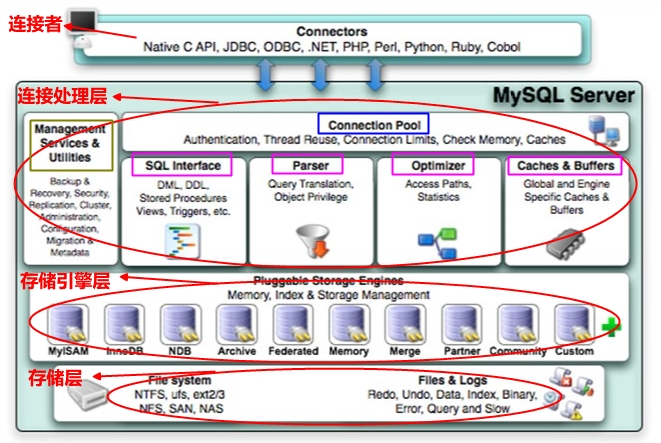

**简化图:**

 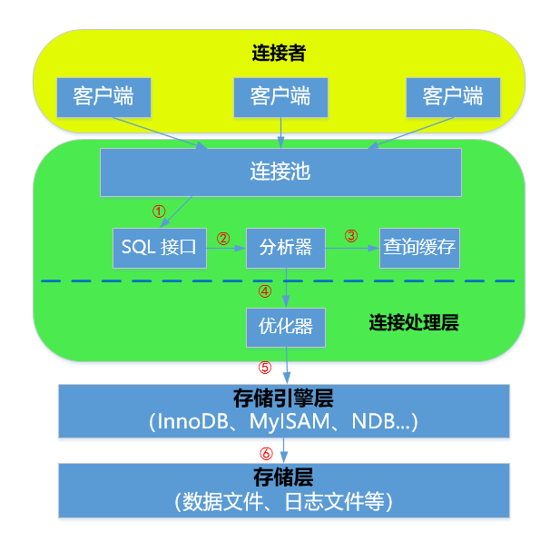

## 客户端

- MySQL的客户端并不单纯的指==某个客户端软件==
- MySQL的客户端可以是不同的编程语言(PHP/Python等)编写的==应用程序==
- MySQL的客户端还可以是一些==API的接口==

## 连接处理层

- **服务层(连接池)**

​       **作用：**管理和缓冲用户连接，为客户端请求做连接处理。

  

- **核心处理层（SQL处理）**

**作用:**接受用户的SQL请求，查询分析，权限处理，优化，结果缓存等。

 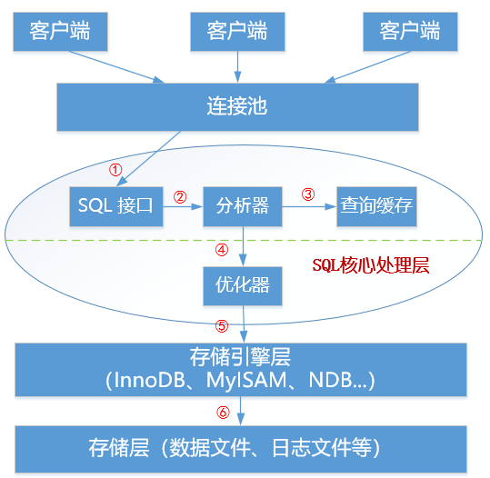

## 存储引擎层

**什么是存储引擎？**

1. 存储引擎简单来说就是一种底层存放,管理数据的模式。
2. 在MySql数据库中提供了==多种存储引擎==，各个存储引擎的各有优劣。
3. 用户可以根据不同的需求为==数据表==选择不同的存储引擎。可以在一个库中不同的表使用不同的存储引擎。

**常用的存储引擎有哪些？**

最常用的存储引擎是MyISAM和==InnoDB==。

MySQL**5.5版本之前**默认使用MyISAM引擎，它查询速度快，有较好的索引优化和数据压缩技术。但它不支持事务。适用于读多写少的应用场景。

MySQL**5.5版本开始**默认使用InnoDB引擎，它是第一个支持拥有**ACID**特性事务的存储引擎，并且提供行级的锁定，应用相当广泛。为处理巨大数据量时的最大性能设计。

**其他存储引擎(了解)**

| 名称        | 说明                                       |
| --------- | ---------------------------------------- |
| NDB       | 用于MySQL Cluster的集群存储引擎，提供数据层面的高可用性。      |
| MEMORY    | MEMORY存储引擎存储数据的位置是内存，因此访问速度最快，但是安全上没有保障。适合于需要快速的访问或临时表。 |
| BLACKHOLE | 黑洞存储引擎，写入的任何数据都会消失，应用于主备复制中的分发主库（中继slave） |

**存储引擎相关操作**

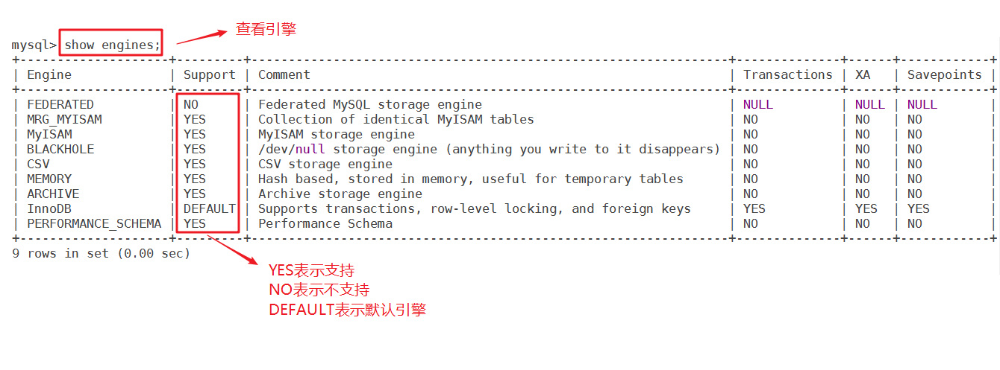

**示例: 引擎支持与不支持状态的切换,默认引擎的修改**

~~~powershell
[root@vm1 ~]# vim /mysql56/etc/my.cnf

[mysqld]
port=3307
datadir=/mysql56/data
log-error=/mysql56/data/mysql56.err
pid-file=/mysql56/data/mysql56.pid
socket=/tmp/mysql56.sock
user=mysql

federated						直接写引擎名可以把引擎由NO变为YES(但必须编译时要支持此引擎)
skip-blackhole					skip-引擎名, 可以把引擎由YES变为NO
default_storage_engine=myisam	此参数可以修改默认引擎
~~~

改完配置文件后,重启mysql服务,再`mysql > show engines` 来验证。

**验证完后,记得还原**。

~~~powershell
[root@vm1 ~]# /mysql56/bin/mysql -p123

查询数据库里所有的表及其对应的engine(大小写结果相同)
mysql> select table_name,engine from information_schema.tables;
mysql> SELECT TABLE_NAME,ENGINE FROM INFORMATION_SCHEMA.TABLES;

查询名为mysql库里的user表的信息
mysql> select TABLE_SCHEMA,TABLE_NAME,ENGINE from information_schema.TABLES where TABLE_SCHEMA='mysql' and TABLE_NAME='user';
+--------------+------------+--------+
| TABLE_SCHEMA | TABLE_NAME | ENGINE |
+--------------+------------+--------+
| mysql        | user       | MyISAM |
+--------------+------------+--------+
~~~

~~~powershell
查看创建表的信息(里面也能看到存储引擎信息)
mysql> show create table aaa.dept;
+-------+--------------------------------------------------------------------------------------------------------------------------------------------------------------------------------+
| Table | Create Table                                                                                                                                                                   |
+-------+--------------------------------------------------------------------------------------------------------------------------------------------------------------------------------+
| dept  | CREATE TABLE `dept` (
  `deptno` tinyint(1) DEFAULT NULL,
  `deptname` varchar(30) DEFAULT NULL,
  `location` varchar(50) DEFAULT NULL
) ENGINE=InnoDB DEFAULT CHARSET=utf8mb4 |
+-------+--------------------------------------------------------------------------------------------------------------------------------------------------------------------------------+
1 row in set (0.00 sec)
~~~

**验证memory存储引擎的功能**

1, 创建一个memory引擎的表, 并插入数据

~~~powershell
mysql> use aaa;										

创建一张名为aaa的表,默认只有一个列(列名为id,数据类型为int整数)
指定memory引擎,如果不指定engine=memory则使用默认引擎
mysql> create table aaa (id int) engine=memory;	  	

mysql> show create table aaa;						查看创建这个表的相关信息

mysql> insert into aaa values(1);					插入数据(整数1)
mysql> insert into aaa values(2);					插入数据(整数2)
mysql> select * from aaa;						    查看表内的数据
+------+
| id   |
+------+
|    1 | 
|    2 | 
+------+
~~~

2, 创建一个非memory引擎(mysql5.6默认为innodb引擎)的表, 并插入数据

~~~powershell
mysql> create table bbb (id int); 					不指定引擎,则使用默认引擎
mysql> show create table bbb;					

mysql> insert into bbb values(1);
mysql> insert into bbb values(2);
mysql> select * from bbb;
+------+
| id   |
+------+
|    1 | 
|    2 | 
+------+
~~~

3, 重启mysql服务

~~~powershell
[root@vm1 ~]# /mysql56/bin/mysqladmin shutdown -p
Enter password:

[root@vm1 ~]# /mysql56/bin/mysqld_safe --defaults-file='/mysql56/etc/my.cnf' &
~~~

4, 再次登录并查询数据

~~~powershell
[root@vm1 ~]# /mysql56/bin/mysql -p
Enter password:

mysql> select * from aaa.aaa;			发现没有数据了(重启服务后,memory引擎表里的数据没了)

mysql> select * from aaa.bbb;			发现数据还在
+------+
| id   |
+------+
|    1 | 
|    2 | 
+------+
~~~

5, 测试完后删除库(可选)

~~~powershell
[root@vm1 ~]# /mysql56/bin/mysql -p
Enter password:

mysql> drop database aaa;
~~~

## 存储层

**作用：**

主要用来存储MySQL的一些数据文件，各种日志文件等物理文件。支持各种文件系统，如ext2~ext4，xfs，nfs等。

**小结:**

**客户端:** 不一定是像`mysql`这种命令,也可能是程序远程连接

**连接处理层:** 接收客户端请求, 进行处理(权限判断, SQL分析与优化，缓存等)

**存储引擎层:** 

管理数据的模式: myisam,innodb,memory

表是指定引擎的最小单位，不同的表可以使用不同的引擎。

# 四、MySQL数据库物理文件

## 常见的日志文件

在前期课程我们学习过rsyslog服务, 用于管理日志。日志的目的就是为了记录服务的各种行为, 信息, 

 

### ① 错误日志(重点)

**作用：**存放数据库的启动、停止或运行时的错误信息，用于排错。

默认是**==开启==**的, 在datadir目录下以`主机名.err`来命名, 比如你的datadir为`/mysql56/data/`, 主机名为`vm1.cluster.com`.则默认错误日志路径为`/mysql56/data/vm1.cluster.com.err`

可以通过修改my.cnf文件里的**log-error**进行自定义

通过下面的命令可以查看错误日志的路径

~~~powershell
mysql> show variables like 'log_error';				 变量中间不是横杠,而是下划线,注意一下
+---------------+---------------------------+
| Variable_name | Value                     |
+---------------+---------------------------+
| log_error     | /mysql56/data/mysql56.err |
+---------------+---------------------------+
~~~

**实例:** 模拟一个错误

1, 关闭mysql

~~~powershell
[root@vm1 ~]# /mysql56/bin/mysqladmin shutdown -p
Enter password:
~~~

2, 故意将配置文件里的socket参数单词写错(模拟错误)

~~~powershell
[root@vm1 ~]# vim /mysql56/etc/my.cnf
[mysqld]
port=3307
basedir=/mysql56/
datadir=/mysql56/data
pid-file=/mysql56/data/mysql56.pid
soket=/tmp/mysql56.sock							我这里故意把socket写成了soket
log-error=/mysql56/data/mysql56.err
user=mysql
~~~

3, 再次启动mysql服务, 不能启动成功

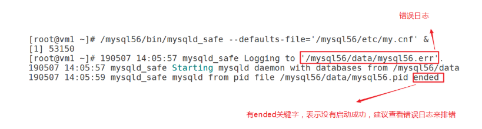

4, 查看错误日志

~~~powershell
[root@vm1 ~]# cat /mysql56/data/mysql56.err
~~~

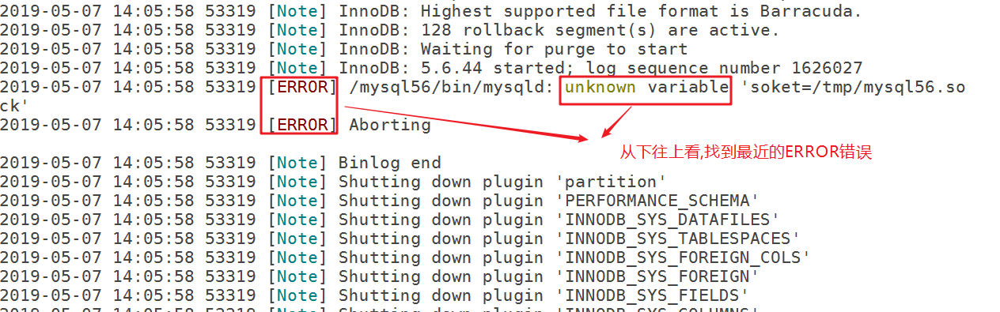

5, 自行解决问题，并启动mysql

### ② 一般查询日志

**作用:**

**记录所有的SQL语句操作和客户端的连接与断开操作。**

当您怀疑客户端的错误并想知道客户端发送给mysqld的确切信息时，一般查询日志可能非常有用。 

默认情况下是==被禁用==的。 

~~~powershell
mysql> show variables like 'general_log';
+---------------+-------+
| Variable_name | Value |
+---------------+-------+
| general_log   | OFF   |
+---------------+-------+
~~~

**打开一般查询日志方法**

~~~powershell
[root@vm1 ~]# vim /mysql56/etc/my.cnf
[mysqld]
port=3307
basedir=/mysql56/
datadir=/mysql56/data
pid-file=/mysql56/data/mysql56.pid
socket=/tmp/mysql56.sock
log-error=/mysql56/data/mysql56.err
user=mysql
general_log												加上这句表示打开
general_log_file=/mysql56/data/query.log				加上这句自定义一般查询日志的路径
~~~

保存退出后,请**重启mysql服务**

然后登陆mysql后, 做一些操作, 再查看`/mysql56/data/query.log`(请自行完成)

### ③ 慢查询日志(了解)

**作用：**

此日志中记录的是执行时间较长的query, 也就是slow query，为数据库优化提供依据。

mysql还提供了专门用来分析慢查询日志的工具程序`mysqlslowdump`,以帮助数据库管理人员解决可能存在的性能问题。

~~~powershell
mysql> show variables like '%slow_query%';				这里%相当于通配符
+---------------------+----------------------------+
| Variable_name       | Value                      |
+---------------------+----------------------------+
| slow_query_log      | OFF                        |	这两个参数类似一般查询日志
| slow_query_log_file | /mysql56/data/vm1-slow.log |	要打开的话，参考一般查询日志的方法
+---------------------+----------------------------+

mysql> show variables like 'long_query_time';
+-----------------+-----------+
| Variable_name   | Value     |
+-----------------+-----------+
| long_query_time | 10.000000 |		设置查询语句超过几秒被记录到慢查询日志里,默认为10秒
+-----------------+-----------+
~~~

**慢查询示例:**

1, 准备一张数据比较多的表

~~~powershell
mysql> use aaa;
mysql> create table bbb(id int);
mysql> insert into bbb values(1);
mysql> insert into bbb select * from bbb;     不断重复此命令,让表的行数达到百万级甚至千万级
~~~

2, 修改变量打开慢查询日志

~~~powershell
这次做成立即生效,想做成永久生效的,请自行将相关参数加到配置文件并重启

mysql> set global slow_query_log=ON;		打开慢查询日志
mysql> set long_query_time=1;				设置查询时间超过1秒的才记录
~~~

3, 做一个慢查询

~~~powershell
mysql> select * from aaa.emp;		此表数据少,不需要1秒就能查询完成,慢查询日志不会记录

mysql> select * from aaa.bbb;		此表数据多，超过1秒才能查询完成，慢查询日志会记录	
~~~

4, `cat /mysql56/data/vm1-slow.log`验证确认记录了查询时间超过1秒的SQL语句

### ④ 二进制日志(重点)

**作用:**

二进制日志记录数据库的所有**==更改==**操作。

- 用于==主从复制==(后面会讲)中, master主服务器将二进制日志中的更改操作发送给slave从服务器，从服务器执行这些更改操作是的和主服务器的更改相同。
- 用于==数据的恢复==操作
- 默认二进制日志是==关闭==的，可以使用`log-bin`参数开启
- 不能直接使用`cat`命令查看,使用==mysqlbinlog==工具查看

**实例:** 

1, 在配置文件里添加`log-bin`参数打开二进制日志

~~~powershell
[root@vm1 ~]# vim /mysql56/etc/my.cnf
[mysqld]
port=3307
basedir=/mysql56/
datadir=/mysql56/data
pid-file=/mysql56/data/mysql56.pid
socket=/tmp/mysql56.sock
log-error=/mysql56/data/mysql56.err
user=mysql
general_log
general_log_file=/mysql56/data/query.log

log-bin=binlog					二进制日志名称可以自定义,没指定路径默认会在datadir目录下产生
~~~

2,  重启mysql服务

~~~powershell
[root@vm1 ~]# /mysql56/bin/mysqladmin shutdown -p
Enter password:

[root@vm1 ~]# /mysql56/bin/mysqld_safe --defaults-file='/mysql56/etc/my.cnf' &
~~~

3, 登录mysql，创建abc库的abc表，并插入几条基本数据用于测试

~~~powershell
[root@vm1 ~]# /mysql56/bin/mysql -p
Enter password:

mysql> create database abc;
mysql> use abc;
mysql> create table abc(id int);
mysql> insert into abc values(1);
mysql> insert into abc values(2);
mysql> insert into abc values(3);

mysql> select * from abc;
+------+
| id   |
+------+
|    1 |
|    2 |
|    3 |
+------+
~~~

4,  使用`mysqlbinlog`命令查看二进制日志

~~~powershell
[root@vm1 ~]# /mysql56/bin/mysqlbinlog /mysql56/data/binlog.000001
~~~

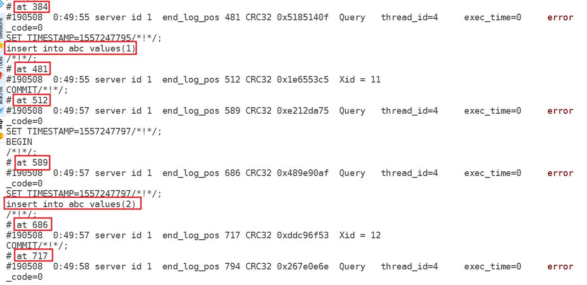

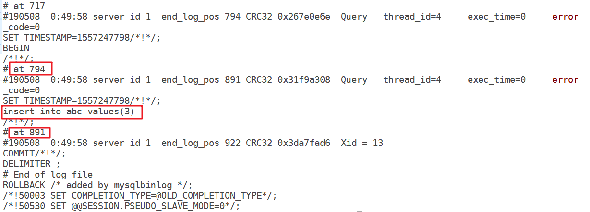

**说明:** 二进制日志里面的主要内容我已经圈起来了, at后面的数据是**==position==**位置编号.而且可以发现select操作并没有在二进制日志中记录。

5,  模拟一个误操作, 删除abc库

~~~powershell
[root@vm1 ~]# /mysql56/bin/mysql -p
Enter password:

mysql> drop database abc;				删除abc库(库里的所有表数据都会被删除)

mysql> show databases;					查看发现没有abc库了
+--------------------+
| Database           |
+--------------------+
| information_schema |
| mysql              |
| performance_schema |
+--------------------+

mysql> quit
~~~

6, 使用二进制日志恢复

~~~powershell
指定要恢复的position范围,通过管道传给登录命令mysql即可
[root@vm1 ~]# /mysql56/bin/mysqlbinlog --start-position=120 --stop-position=892 /mysql56/data/binlog.000001 |/mysql56/bin/mysql -p
Enter password:
~~~

**特别注意:** 此版本中stop-position的位置编号要大于最后看到的891,否则最后一条数据不能恢复,因为有事务控制。(不同版本有少许不同,建议先测试验证一下再操作)

7, 验证恢复OK

~~~powershell
[root@vm1 ~]# /mysql56/bin/mysql -p
Enter password:

mysql> select * from abc.abc;
+------+
| id   |
+------+
|    1 |
|    2 |
|    3 |
+------+
~~~

随着日志不断地写入, 二进制日志会有多个(有点类似日志轮转), 可以通过对应的.index文件查看

~~~powershell
[root@vm1 ~]# cat /mysql56/data/binlog.index
./binlog.000001
~~~

## 常见的数据文件

mysql表格里的数据在物理上都是存放在相应的数据文件里的。我们要对数据文件有个基本的了解。 

1.  **.frm文件:**   不论是什么存储引擎，每一个表都会有一个以表名命名的.frm文件，与表相关的==元数据（meta)信息==都存放在此文件中，包括==表结构的定义==信息等。
2.  **.MYD文件:**   myisam存储引擎专用，存放myisam表的数据（data)。每一个myisam表都会有一个.MYD文件与之呼应，同样存放在所属数据库的目录下 .
3.  **.MYI文件:**    也是myisam存储引擎专用，存放myisam表的索引相关信息。对于myisam存储引擎来说，可以被缓存(cache)的内容主要就是来源于.MYI文件中。 每一个myisam表对应一个.MYI文件.

​      索引(index): 加快查询速度,减慢写的速度。(优化有关,在这里仅了解一下)

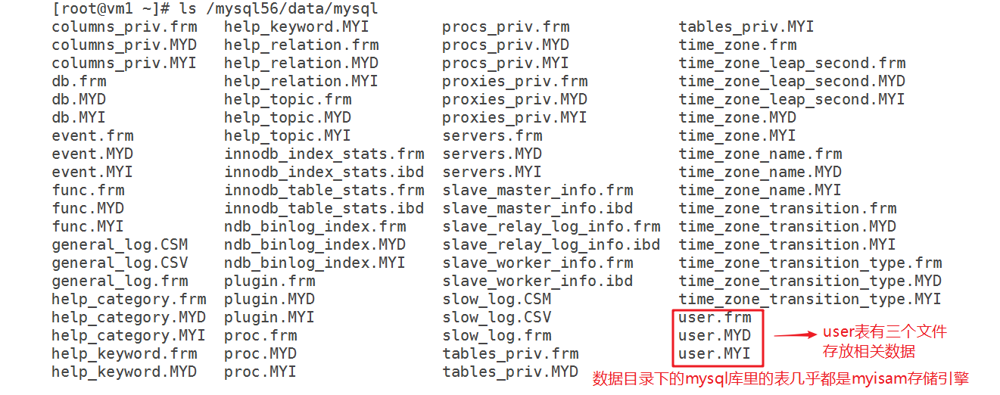

4. **.ibd文件和ibdata文件:** 存放innoDB的数据文件（包括索引）。innoDB存储引擎有两种表空间方式：独享表空间和共享表空间。 

**注意:** 表空间是一个逻辑概念, 一个表空间包含了1个或多个数据文件(物理上的文件)。此概念最早也是由oracle提出的,在这里仅了解一下。

- 独享表空间：使用.ibd文件来存放数据，且每个表一个.ibd文件。
- 共享表空间(默认)：使用.ibdata文件，所有表共同使用一个（或多个,自行配置）.ibdata文件。

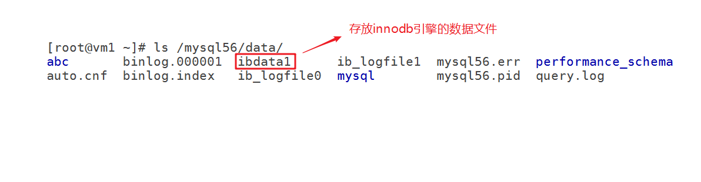

**拓展:** 把`innodb_file_per_table=1`参数加到配置文件里重启mysql服务,就由共享表空间变为独享表空间。

5. **db.opt文件:**    此文件在每一个==自建的库==里都会有，记录这个库的默认使用的==字符集和校验规则==。

~~~powershell
[root@vm1 ~]# cat /mysql56/data/abc/db.opt
default-character-set=utf8mb4
default-collation=utf8mb4_general_ci
~~~

**实例: 验证myisam引擎的.MYD**

第1个终端

~~~powershell
[root@vm1 ~]# /mysql56/bin/mysql -p
Enter password:

mysql> use abc;

mysql> create table a(id int) engine=myisam;		指定为myisam引擎

mysql> insert into a values(1);
mysql> insert into a select * from a;				将a表里的所有数据再插入到a表中
不断的重复上面一句,数据会翻倍增长
......
~~~

第2个终端

~~~powershell
使用下面命令查看验证abc库的a表的数据不断增大
[root@vm1 ~]# ls /mysql56/data/abc/a.MYD -l
~~~

  

**实例: 验证innodb引擎的.ibdata文件**

注: 当前mysql5.6.44版本默认是独享表空间

第1个终端

~~~powershell
[root@vm1 ~]# /mysql56/bin/mysql -p
Enter password:

mysql> show variables like 'innodb_file_per_table';
+--------------------------+----------+
| Variable_name            | Value    |
+--------------------------+----------+
| innodb_file_per_table    | ON       |
+--------------------------+----------+

mysql> use abc;

mysql> create table ddd(id int) engine=innodb;		指定为innodb引擎

mysql> insert into ddd values(1);
mysql> insert into ddd select * from ddd;
......
~~~

第2个终端

~~~powershell
使用下面命令查看验证,会增大,但不是每次插入数据都增大,增大到一定的量时会增大
并且增大到一定程度时/mysql56/data/ibdata1也会增大
[root@vm1 ~]# ls /mysql56/data/ddd.ibd -l
~~~

测试: 把`innodb_file_per_table=0`加到配置文件里,重启mysql服务。然后再创建新的innodb引擎表进行验证.

~~~powershell
结论: 所有的innodb引擎表的数据都会往/mysql56/data/ibdata1文件里存放
~~~

## 其它文件(了解)

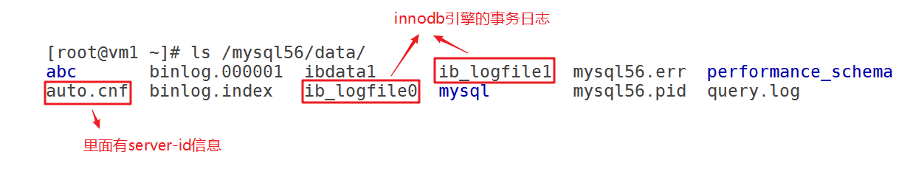

除此之外还会有做了AB复制架构才会产生的master.info,relay-log中继日志,relay-log.info等文件。

**小结:**

日志文件: 

* 错误日志  log_error
* 一般查询日志   general_log,general_log_file        所有连接和操作都会记录(生产环境不建议一直开)

* 慢查询日志   slow_query_log  slow_query_log_file  long_query_time
* **==二进制日志==**   log_bin     记录所有改变数据的操作

数据文件:

* .frm      所有引擎的表都有，存放结构信息(元数据)
* .MYD    存放myisam引擎表的数据

* .MYI      存放myisam引擎表的索引
* .ibd和ibdata   存放innodb引擎表的数据和索引   innodb_file_per_table

