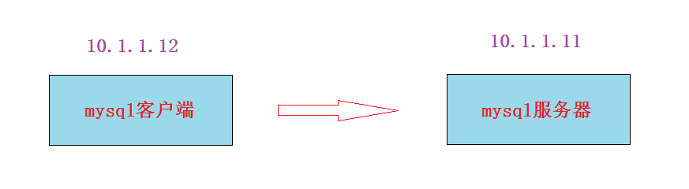

# 学习目标

- [ ] 能够使用SQL语句创建、删除库和表

- [ ] 能够对表里的==数据记录==进行==增加、删除、修改==
- [ ] 了解mysql的事务控制语句
- [ ] 了解delete,truncate,drop语句的区别
- [ ] 能够使用SQL语句==创建、删除用户==
- [ ] 能够使用SQL语句给==用户授权和回收权限==


# 一、SQL语句

## SQL简介

SQL 是 Structure Query Language(==结构化查询语言==)的缩写,它是使用关系模型的数据库应用语言,由 IBM 在 20 世纪 70 年代开发出来,作为 IBM 关系数据库原型 System R 的原型关系语言,实现了关系数据库中的信息检索。

20 世纪 80 年代初,美国国家标准局(ANSI)开始着手制定 SQL 标准,最早的 ANSI 标准于1986 年完成,就被叫作 SQL-86。标准的出台使 SQL 作为标准关系数据库语言的地位得到了加强。SQL 标准目前经多次修改更趋完善。

正是由于 SQL 语言的标准化,所以大多数关系型数据库系统都支持 SQL 语言,它已经发展成为多种平台进行交互操作的底层会话语言。

简单来说: **SQL语句就是操作mysql数据的基本命令,并且在其它关系数据库中也可以使用(区别很小)**


## SQL语句的分类

- ==DDL==(Data Definition Languages)语句:

  数据定义语言,这些语句定义了不同的数据段、数据库、表、列、索引等数据库对象的定义。常用的语句关键字主要包括 **create、drop、alter、rename、truncate**。

- ==DML==(Data Manipulation Language)语句:

  数据操纵语句,用于添加、删除、更新和查询数据库记录,并检查数据完整性,常用的语句关键字主要包括 **insert、delete、update**等。

- ==DCL==(Data Control Language)语句:

  数据控制语句,用于控制不同数据段直接的许可和访问级别的语句。这些语句定义了数据库、表、字段、用户的访问权限和安全级别。主要的语句关键字包括 **grant、revoke** 等。

- ==DQL==(Data Query Language)语句:

  数据查询语句，用于从一个或多个表中检索信息。主要的语句关键字包括 **select**


SQL语句对于初学者来说,也是很难记忆的, 如果记不住的话, 可以查看帮助

- 官档

  [MySQL5.6官方文档](https://dev.mysql.com/doc/refman/5.6/en/sql-syntax.html)

- MySQL的命令行求帮助

  ~~~powershell
  mysql> help;
  mysql> ?
  mysql> help create table;

  根据内容进行查找帮助
  mysql> ? contents
     Account Management
     Administration
     Data Definition
     Data Manipulation
     Data Types
     Functions
     Functions and Modifiers for Use with GROUP BY
     Geographic Features
     Language Structure
     Storage Engines
     Stored Routines
     Table Maintenance
     Transactions
     Triggers
     
  寻求账户管理的帮助（一级一级的向内部查）
  mysql> ? Account Management
  mysql> ? CREATE USER
  ~~~


## 库相关操作(建库,删库,改库等)

~~~powershell
mysql> create database aaa;							创建库(可以把database改为schema)
Query OK, 1 row affected (0.00 sec)

mysql> show create database aaa;					查看库的属性,主要就是字符集这1个属性
+----------+-----------------------------------------------------------------+
| Database | Create Database                                                 |
+----------+-----------------------------------------------------------------+
| aaa      | CREATE DATABASE `aaa` /*!40100 DEFAULT CHARACTER SET utf8mb4 */ |
+----------+-----------------------------------------------------------------+

mysql> drop database aaa;				    		删除库

mysql> create database default character set=gbk;	创建库并指定字符集

mysql> alter database aaa character set=utf8mb4;	修改字符集
~~~


## 表有关的操作

表相关的操作主要包括建表，删表，改表，加列，删列，改列的数据类型，列或表重命名等

### **建表**

1, 登录

```powershell
[root@vm1 ~]# /mysql56/bin/mysql -p
Enter password:

mysql> use aaa;								use进入aaa库
```

2, 创建一张员工表,表名为emp,主要有ename,sex,hiredate,sal,decimal,deptno等几个列

```powershell
方法1:
mysql> create table emp (ename varchar(20),sex char(1),hiredate date,sal decimal(8,2),deptno tinyint(1)); 

方法2:分行写,适用于表列比较多的情况,写1行太长了
mysql> create table emp
    -> (ename varchar(20),
    -> sex char(1),
    -> hiredate date,
    -> sal decimal(8,2),
    -> deptno tinyint(1));
    
mysql> desc emp;
+----------+--------------+------+-----+---------+-------+
| Field    | Type         | Null | Key | Default | Extra |
+----------+--------------+------+-----+---------+-------+
| ename    | varchar(20)  | YES  |     | NULL    |       |
| sex      | char(1)      | YES  |     | NULL    |       |
| hiredate | date         | YES  |     | NULL    |       |
| sal      | decimal(8,2) | YES  |     | NULL    |       |
| deptno   | tinyint(1)   | YES  |     | NULL    |       |
+----------+--------------+------+-----+---------+-------+
```

3, 再创建一个部门表(dept)，注意deptno这一列和emp表的deptno列是对应的

```powershell
mysql> create table dept (deptno tinyint(1),deptname varchar(30),location varchar(50));

mysql> desc dept;
+----------+-------------+------+-----+---------+-------+
| Field    | Type        | Null | Key | Default | Extra |
+----------+-------------+------+-----+---------+-------+
| deptno   | tinyint(1)  | YES  |     | NULL    |       |
| deptname | varchar(30) | YES  |     | NULL    |       |
| location | varchar(50) | YES  |     | NULL    |       |
+----------+-------------+------+-----+---------+-------+
```

### 表的其它操作 

```powershell
mysql> show create table emp;  						查看创建表的参数，引擎和默认的字符集

mysql> alter table emp engine=memory;				修改表的引擎
mysql> alter table emp default charset=utf8;  		修改表的字符集

mysql> rename table emp to emp1;					表改名
mysql> drop table emp;								删除表

mysql> create table emp ename varchar(20), sex char(1), hiredate date, sal decimal(8,2), deptno tinyint(1)) engine=innodb default charset=utf8;	
也可以在创建表时直接指定非默认的引擎或字符集
```


### **表与列相关的操作(了解)**

```powershell
mysql> alter table emp add empno int;					增加一个列，默认增加到最后
mysql> alter table emp add empno int after hiredate;	在hiredate这列后面增加一列
mysql> alter table emp add empno int first; 			把一列加到最前面，使用first关键字

mysql> alter table emp drop empno;  					删除一列

mysql> alter table emp modify ename varchar(40);		使用modify修改一列的数据类型

mysql> alter table emp change ename ename varchar(30);  使用change修改一列的数据类型
mysql> alter table emp change ename name varchar(30);   修改列名要使用change去修改

modify和change的区别，都可以修改数据类型，但change要写原列名;只有change可以修改列名，modify不可以
```

通过上面的命令, 把emp表多加三列, 成为下面的格式

```mysql
+-----------+---------------+------+-----+---------+-------+
| Field     | Type          | Null | Key | Default | Extra |
+-----------+---------------+------+-----+---------+-------+
| empno     | int(11)       | YES  |     | NULL    |       | 
| ename     | varchar(20)   | YES  |     | NULL    |       | 
| sex       | char(1)       | YES  |     | NULL    |       | 
| birthday  | date          | YES  |     | NULL    |       | 
| hiredate  | date          | YES  |     | NULL    |       | 
| sal       | decimal(10,2) | YES  |     | NULL    |       | 
| deptno    | tinyint(1)    | YES  |     | NULL    |       | 
| managerno | int(11)       | YES  |     | NULL    |       | 
+-----------+---------------+------+-----+---------+-------+

mysql> alter table emp add empno int first;
mysql> alter table emp add birthday date after sex;
mysql> alter table emp add managerno int;
```


# 二、DML语句

## insert插入数据

**使用insert插入1条数据**

~~~powershell
[root@vm1 ~]# /mysql56/bin/mysql -p
Enter password:

mysql> use aaa;

注意:列数要对应,除了数字类型不加引号,其它的都要加引号(单双引都行)
mysql> insert into aaa.emp values (1,'boss','m','1964-08-08','1995-01-01','20000','1','1');
~~~

**插入多条数据**

~~~powershell
mysql> insert into emp values 
    -> (1,'boss','m','1964-08-08','1995-01-01','20000','1','1'),
    ->(2,'zhangsan','m','1967-04-05','1995-04-11','15000','2','1');    
~~~

**指定列来插入数据**

~~~powershell
还可以插入特定的列（非所有列），那么没有插入的就成了空值（空值不是0，它做任何运算结果还是空值)
mysql> insert into emp (ename,sex) values ('lisi','m');
~~~


使用`select * from emp`来验证插入的数据


## 事务控制语句

==只有DML语句才需要事务控制==，事务控制主要是`commit`提交操作和`rollback`回滚操作  ; 

但是MySQL的DML语句是自动提交(也就是说mysql是自动commit的), 由一个变量`autocommit`来控制

```powershell
mysql> show variables like 'autocommit';
+---------------+-------+
| Variable_name | Value |
+---------------+-------+
| autocommit    | ON    |					值为ON表示自动提交	
+---------------+-------+
```

- 临时关闭自动提交

```powershell
mysql> set autocommit=OFF;
Query OK, 0 rows affected (0.00 sec)
```

- 永久关闭自动提交

在my.cnf配置文件里的[mysqld]参数组里加上`autocommit=0`或者`autocommit=OFF`, 然后重启服务即可


**示例: 手动事务控制**

1, 临时关闭自动提交

~~~powershell
mysql> set autocommit=OFF;
~~~

2, 插入1条数据(属于DML操作),select验证也能看到此数据

~~~powershell
mysql> insert into aaa.emp values (1,'boss','m','1964-08-08','1995-01-01','20000','1','1');	
~~~

3, rollback回滚后，就查看不到此数据了

~~~powershell
mysql> rollback;
~~~

**测试方法: 可以再另开一个终端连接数据库验证事务.验证结果为:**

* 当终端1没有提交事务,则终端2查看不到
* 当终端1使用commit提交了事务，则终端2就可以查看了


测试完后，请`mysql> set autocommit=ON;`再改回成默认情况


**小结:**

把一个DML操作就可以看作是一个事务。需要`commit`提交确认,如果有问题可以`rollback`回滚。


## 删除表数据

**删除表里所有数据**

~~~powershell
mysql> delete from emp;
~~~

**或者**

~~~powershell
mysql> truncate table emp;

注意: truncate是DDL语句,不是DML语句
~~~


## delete/truncate/drop区别

- delete：删除==数据记录==
  - 属于数据操作语言（DML）

  - 在事务控制里，DML语句要么commit，要么rollback

  - 删除==大量==记录速度慢，==只删除数据==不回收高水位线

  - 可以==带条件==删除

- truncate：删除==所有数据记录==

  - 属于数据定义语言（DDL）

  - ==不在==事务控制里，DDL语句执行前会提交前面所有未提交的事务

  - 清除大量数据==速度快==，回收高水位线（high water mark）

  - ==不能带条件删除==
- drop：删除==数据库对象==
  - 属于数据定义语言（DDL）
  - 数据库对象包括库、表、用户等


## 导入数据

一条一条的插入数据太麻烦了,我们还可以一次性导入多条语句。(有些软件的数据就是提供相应的SQL语句让用户自行导入)

1, 准备1个SQL语句脚本

以下是我准备的9条测试记录, **请复制**

~~~powershell
[root@vm1 ~]# vim /tmp/emp.sql

insert into aaa.emp values (1,'boss','m','1964-08-08','1995-01-01','20000','1','1'),(2,'zhangsan','m','1967-04-05','1995-04-11','15000','2','1'),(3,'lisi','f','1973-01-28','1998-11-21','13000','3','1'),(4,'wangwu','f','1975-06-03','1999-12-12','12000','4','1'),(5,'maliu','m','1982-08-18','2001-07-03','8000','2','2'),(6,'tianqi','f','1983-02-15','2002-11-01','7000','2','2'),(7,'mark','m','1984-08-12','2003-10-02','6500','3','3'),(8,'john','m','1985-09-14','2005-04-03','6000','3','3'),(9,'mm','f','1990-06-08','2008-09-13','4000','4','4');
~~~

2, 导入准备好的数据,方法有3种:

方法1:

~~~powershell
[root@vm1 ~]# /mysql56/bin/mysql -p  < /tmp/emp.sql
Enter password:
~~~

方法2:

~~~powershell
[root@vm1 ~]# cat /tmp/emp.sql | /mysql56/bin/mysql -p
Enter password:
~~~

方法3:

~~~powershell
[root@vm1 ~]# /mysql56/bin/mysql -p
Enter password:

mysql> source /tmp/emp.sql
~~~

任选其中一种方法导入,结果如下

~~~powershell
mysql> select * from aaa.emp;
+-------+----------+------+------------+------------+----------+--------+-----------+
| empno | ename    | sex  | birthday   | hiredate   | sal      | deptno | managerno |
+-------+----------+------+------------+------------+----------+--------+-----------+
|     1 | boss     | m    | 1964-08-08 | 1995-01-01 | 20000.00 |      1 |         1 | 
|     2 | zhangsan | m    | 1967-04-05 | 1995-04-11 | 15000.00 |      2 |         1 | 
|     3 | lisi     | f    | 1973-01-28 | 1998-11-21 | 13000.00 |      3 |         1 | 
|     4 | wangwu   | f    | 1975-06-03 | 1999-12-12 | 12000.00 |      4 |         1 | 
|     5 | maliu    | m    | 1982-08-18 | 2001-07-03 |  8000.00 |      2 |         2 | 
|     6 | tianqi   | f    | 1983-02-15 | 2002-11-01 |  7000.00 |      2 |         2 | 
|     7 | mark     | m    | 1984-08-12 | 2003-10-02 |  6500.00 |      3 |         3 | 
|     8 | john     | m    | 1985-09-14 | 2005-04-03 |  6000.00 |      3 |         3 | 
|     9 | mm       | f    | 1990-06-08 | 2008-09-13 |  4000.00 |      4 |         4 | 
+-------+----------+------+------------+------------+----------+--------+-----------+
9 rows in set (0.00 sec)
~~~


**练习:** 请自行往dept表中插入或导入数据,要求结果如下

~~~powershell
mysql> select * from aaa.dept;
+--------+----------+-----------+
| deptno | deptname | location  |
+--------+----------+-----------+
|      1 | manager  | beijing   | 
|      2 | it       | shenzhen  | 
|      3 | sale     | shanghai  | 
|      4 | services | guangzhou | 
+--------+----------+-----------+
4 rows in set (0.00 sec)
~~~


## update更新数据

SQL语句中使用update来进行数据的更新(修改),update属于DML语句。基本格式如下:

`update 表名 set 列名="新值" where 条件;`

**where条件常见符号**

| 符号                | 说明          |
| ----------------- | ----------- |
| %                 | 匹配0个或任意多个字符 |
| _(下划线)            | 匹配单个字符      |
| like              | 模糊匹配        |
| =                 | 等于,精确匹配     |
| >                 | 大于          |
| <                 | 小于          |
| \>=               | 大于等于        |
| <=                | 小于等于        |
| !=和<>             | 不等于         |
| ! 和 not           | 逻辑非         |
| \|\| 和 or         | 逻辑或         |
| && 和 and          | 逻辑与         |
| between...and.... | 两者之间        |
| in (....)         | 在...        |
| not in (....)     | 不在          |


**把wangwu性别改成m**

~~~powershell
mysql> update emp set sex='m' where ename='wangwu';
~~~

**wangwu的工资加500**

~~~powershell
mysql> update emp set sal=sal+500 where ename='wangwu';
~~~

**mark由3号部门换成2号部门，同时工资加1000,上级管理者也改为2号部门的管理者**

~~~powershell
mysql> update emp set deptno=2 and sal=sal+1000 and managerno=2 where ename='mark';		错误写法

mysql> update emp set deptno=2,sal=sal+1000,managerno=2 where ename='mark';			      正确写法 
~~~

**2号部门的工资涨10%**

~~~powershell
mysql> update emp set sal=sal*1.1 where deptno=2;
~~~

**工资就john和mark涨10%,其它人不涨**

~~~powershell
mysql> update emp set sal=sal*1.1 where ename='john' or ename='mark';

mysql> update emp set sal=sal*1.1 where ename in ('john','mark');
~~~

**工资都涨10%，john和mark犯错误，就他们不涨**

~~~powershell
方法1:
mysql> update emp set sal=sal*1.1 where ename!='john' and ename<>'mark';
方法2:
mysql> update emp set sal=sal*1.1 where ename not in ('john','mark');
~~~

**小结:**

思路: 先判断需要是什么类型的操作(增,删,改);再确定条件与动作(1条件1动作,1条件多动作,多条件多动作)


# 三、DQL语句

## 基本查询

~~~powershell
mysql> select * from emp;									*代表查看所有列

mysql> select ename,sal from emp;							只查看其中几列

mysql> select ename,sal*2 as "double sal" from emp;			把工资两倍做一个别名

mysql> select distinct deptno from emp;  					distinct去除重复行
~~~

~~~powershell
mysql> select * from mysql.user\G    \G可以应用于列非常多的情况(实现行与列的转换),格式更容易阅读
~~~


##  带where条件查询

| 符号       | 说明      |
| -------- | ------- |
| regexp   | 使用正则来匹配 |
| order by | 排序      |
| asc      | 升序排列    |
| desc     | 降序排列    |
| group by | 聚合      |
| having   | 筛选      |
| distinct | 去除重复的行  |


**查询所有男员工的姓名和工资**

~~~powershell
mysql> select ename,sal from emp where sex='m';
~~~

**查询工资大于8000的员工的所有信息**

~~~powershell
mysql> select * from emp where sal>8000;
~~~

**查询工资在4000到8000之间的员工的所有信息（包含4000和8000的)**

~~~powershell
mysql> select * from emp where sal>=4000 and sal<=8000;

mysql> select * from emp where sal between 4000 and 8000;
~~~

**查询2002年之后(包括2002年)入职的，并且工资大于8000的员工姓名**

```sql
mysql> select ename from emp where year(hiredate)>=2002 and sal>8000;
```

**查询入职时间在2001那年的员工的姓名和工资**

~~~powershell
mysql> select ename,sal from emp where year(hiredate)=2001;

mysql> select ename,sal from emp where substr(hiredate,1,4)=2001;

mysql> select ename,sal from emp where hiredate>'2000-12-31' and  hiredate<'2002-01-01';

mysql> select ename,sal from emp where hiredate>='2001-01-01' and hiredate <= '2001-12-31';

mysql> select ename,sal from emp where hiredate like '2001%';

mysql> select ename,sal from emp where hiredate between '2001-01-01' and '2001-12-31';

mysql> select ename,sal from emp where hiredate regexp '^2001';
~~~

==**小结:** **能带where条件进行操作的有delete,update,select语句。**==


## 排序操作

**以工资排序，默认升序(ascend)排序**

~~~powershell
mysql> select * from emp order by sal;

mysql> select * from emp order by sal asc;			加不加asc都是升序
~~~

**以工资排序,降序(descend)排序**

~~~powershell
mysql> select * from emp order by sal desc;
~~~

**先按性别排，再按工资排**

```powershell
结果是女的都在一起，以工资从小到大排。男的都在一起，以工资从小到大排。
mysql> select * from emp order by sex,sal;  

结果是女的都在一起，以工资从大到小排。男的都在一起，以工资从大到小排。
mysql> select * from emp order by sex desc,sal desc;
```

**找出工资最低的三个人的姓名和工资**

~~~powershell
mysql> select * from emp order by sal limit 3;
~~~

**找出工资最高的三个人的姓名和工资**

~~~powershell
mysql> select * from emp order by sal desc limit 3;
~~~

**找出工资最低的女员工的姓名和工资**

~~~powershell
mysql> select ename,sal from emp where sex='f' order by sal limit 1;
~~~

**找出工资从高到低第三到第五的人的姓名和工资**

~~~powershell
mysql> select * from emp order by sal desc limit 2,3;
~~~

## 分组

语法关键字: **group by**

根据给定数据列的查询结果进行分组统计，最终得到一个分组汇总表

注: 一般情况下group by需与**统计函数**一起使用才有意义

| 常见统计函数  | 说明   |
| ------- | ---- |
| max()   | 求最大值 |
| min()   | 求最小值 |
| sum()   | 求和   |
| avg()   | 求平均值 |
| count() | 求总行数 |

分组后的条件语句不能使用where, 而要使用**having**


**统计每个部门的人数**(部门分组)

~~~powershell
mysql> select deptno,count(*) from emp group by deptno;
~~~

**统计男，女员工各有多少人**(性别分组)

~~~powershell
mysql> select sex,count(*) from emp group by sex;
~~~

**统计每个部门里男女员工各有多少个**(先部门分组,再性别分组;或者先性别分组，再部门分组)

~~~powershell
mysql> select deptno,sex,count(*) from emp group by deptno,sex;
mysql> select sex,deptno,count(*) from emp group by sex,deptno;
~~~

**求每个部门的工资总额，最大工资，最小工资，平均工资**（部门分组)

~~~powershell
mysql> select deptno,sum(sal),max(sal),min(sal),avg(sal) from emp group by deptno;
~~~

**查找部门人数大于2的部门号和人数**(部门分组后,使用条件比较，需要使用**having**)

~~~powershell
mysql> select deptno,count(*) from emp group by deptno having count(*)>2;
~~~


## 表链接(拓展)

表链接简单来说就是多表查询

**查出员工姓名和其对应的工资，部门名，部门所在地，并显示**

~~~powershell
mysql> select ename,sal,deptname,location from emp,dept where emp.deptno=dept.deptno;
~~~


## 子查询(拓展)

查询语句中包含另一个查询语句

**查出比wangwu工资高的人的姓名和工资**

~~~powershell
mysql> select ename,sal from emp where sal > (select sal from emp where ename='wangwu');
~~~


## 课后SQL题目(不做要求)

查询比2号部门里最高工资还高的人的姓名与工资

~~~powershell

~~~

查询比女员工平均工资高的男员工的姓名与工资

~~~powershell

~~~

将女员工里工资最低的2个员工加薪500

~~~powershell

~~~

查找比自己领导工资高的人

~~~powershell

~~~


# 四、用户管理

像linux操作系统一样, mysql数据库也可以同时多个用户登录进行操作,并且不同的用户可以有不同的权限。

## **用户主机表示方式**

注意: MySQL中不能单纯通过用户名来说明用户, 必须要加上IP或主机名(要能解析)。如**tom@localhost**表示tom从本地localhost登录,  **john@10.1.1.1**表示john从10.1.1.1这个远程IP登录

| 格式                   | 说明                                       |
| -------------------- | ---------------------------------------- |
| 'user'@'localhost'   | 表示user可以在本地登录数据库                         |
| 'user'@'10.1.1.1'    | 表示user用户可以在10.1.1.1登录数据库                 |
| 'user'@'10.1.1.0/24' | 表示user用户可以在10.1.1.0/24网段登录数据库            |
| 'user'@'%'           | 表示user用户可以在所有的远程机器上登录数据库(**==注意:%不包含localhost，但当前5.6.44版本里面%包括localhost了==**) |


~~~powershell
mysql> select user();		   查询当前登录的用户
+----------------+
| user()         |
+----------------+
| root@localhost |
+----------------+


mysql> select user,host,password from mysql.user;		查询mysql里所有的用户
+------+-----------------+-------------------------------------------+
| user | host            | password                                  |
+------+-----------------+-------------------------------------------+
| root | localhost       | *23AE809DDACAF96AF0FD78ED04B6A265E05AA257 |
| root | vm1.cluster.com |                                           |
| root | 127.0.0.1       |                                           |
| root | ::1             |                                           |
|      | localhost       |                                           |
|      | vm1.cluster.com |                                           |
+------+-----------------+-------------------------------------------+
~~~


## 用户权限管理

**权限说明**

```powershell
USAGE	登录数据库权限
ALL		所有权限

以下权限为指定权限
select/update/delete/super/slave/reload...
```

 **授权并创建用户**

`grant 权限1,权限2 on 库.表 to 用户@主机;`

`grant 权限1,权限2 on 库.表 to 用户@主机 identified 'password';`

**==注: grant授权的用户如果不存在,相当于是创建用户并授权==**

### **本地授权**

指定john从localhost本地登陆,密码为123; 对aaa库里所有的表拥有select的权限

~~~powershell
mysql> grant select on aaa.* to 'john'@'localhost' identified by '123';
~~~

授权完后记得要刷新权限表,这样才能让授权生效

~~~powershell
mysql> flush privileges;
~~~

测试

~~~powershell
[root@vm1 ~]# /mysql56/bin/mysql -u john -p123

mysql> select user();
+----------------+
| user()         |
+----------------+
| john@localhost |
+----------------+

mysql> show grants;						查看当前用户的权限

mysql> select * from aaa.emp;			select查看可以(数据省略)

mysql> delete from aaa.emp;				除select外的其它操作报权限错误
ERROR 1142 (42000): DELETE command denied to user 'john'@'localhost' for table 'emp'
~~~

### **远程授权(重点)**

==mysql服务器对客户端授权后==，客户端连接服务器



**服务器对客户端授权**

~~~powershell
[root@vm1 ~]# /mysql56/bin/mysql -p
Enter password:

mysql> grant all on aaa.* to 'mark'@'10.1.1.12' identified by '123';

mysql> flush privileges;
~~~

**客户端连接服务器**

再次强调客户端可以是一个mysql命令,也可以是开发的程序等各种形式。我们这里使用mysql命令来模拟客户端

如果没有mysql命令,则安装rpm版的即可(centos7上自带的rpm版mysql为mariadb分支版)

~~~powershell
[root@vm2 ~]# yum install mariadb -y
~~~

远程连接(这里mysql服务器的端口为3307)

~~~powershell
[root@vm2 ~]# mysql -h 10.1.1.11 -u mark -P 3307 -p
Enter password:

MySQL [(none)]> show grants;
+--------------------------------------------------------------------------+
| Grants for mark@10.1.1.12                                                |
+--------------------------------------------------------------------------+
| GRANT USAGE ON *.* TO 'mark'@'10.1.1.12' IDENTIFIED BY PASSWORD <secret> |
| GRANT ALL PRIVILEGES ON `aaa`.* TO 'mark'@'10.1.1.12'                    |
+--------------------------------------------------------------------------+
~~~


### 回收用户权限

格式: `revoke 权限 on 库.表 from 用户;`

**在服务器上回收对aaa库所有表的select权限**

```powershell
mysql> revoke select on aaa.* from 'mark'@'10.1.1.12';

mysql> flush privileges;
```

**远程客户端连接测试**

~~~powershell
[root@vm2 ~]# mysql -h 10.1.1.11 -u mark -P 3307 -p
Enter password:

MySQL [(none)]> select * from aaa.emp;					select查询aaa库的emp表没有权限了
ERROR 1142 (42000): SELECT command denied to user 'mark'@'vm2.cluster.com' for table 'emp'
~~~


## 删除用户(drop user）

**语法**

```powershell
drop user 用户;
```

**示例**

~~~powershell
mysql> drop user 'user01'@'localhost';

mysql> drop user 'user01'@'%';
~~~

**重命名用户(拓展)**

~~~powershell
mysql> rename user 'mark'@'10.1.1.12' to 'mark'@'10.1.1.13';
~~~

**直接对mysql.user表使用delete删除**

~~~powershell
mysql> select user,host,password from mysql.user;
+------+-----------+-------------------------------------------+
| user | host      | password                                  |
+------+-----------+-------------------------------------------+
| root | localhost | *23AE809DDACAF96AF0FD78ED04B6A265E05AA257 |
| root | 127.0.0.1 | *23AE809DDACAF96AF0FD78ED04B6A265E05AA257 |
| root | ::1       | *23AE809DDACAF96AF0FD78ED04B6A265E05AA257 |
| john | localhost | *23AE809DDACAF96AF0FD78ED04B6A265E05AA257 |
| mark | 10.1.1.13 | *23AE809DDACAF96AF0FD78ED04B6A265E05AA257 |
+------+-----------+-------------------------------------------+

mysql> delete from mysql.user where host='::1';

mysql> flush privileges;

mysql> select user,host,password from mysql.user;
+------+-----------+-------------------------------------------+
| user | host      | password                                  |
+------+-----------+-------------------------------------------+
| root | localhost | *23AE809DDACAF96AF0FD78ED04B6A265E05AA257 |
| root | 127.0.0.1 | *23AE809DDACAF96AF0FD78ED04B6A265E05AA257 |
| john | localhost | *23AE809DDACAF96AF0FD78ED04B6A265E05AA257 |
| mark | 10.1.1.13 | *23AE809DDACAF96AF0FD78ED04B6A265E05AA257 |
+------+-----------+-------------------------------------------+
~~~


# 五、mysql常见函数

在shell,awk,python甚至任何的编程语言里都有函数。

再次通俗的回顾一下函数的作用: 将多行代码作为一个整体,将其定义为一个函数, 方便调用。

mysql也提供了一些函数供用户直接方便地调用。


**查看登录用户,mysql版本等基本信息**

```powershell
mysql> select user();							查询当前登录用户

mysql> select database();						查询当前use了哪个库

mysql> select version();						查询当前数据库的版本
```

**加密函数**

```powershell
mysql> select password('123');		
mysql> select md5('123');
mysql> select sha1('123');
```

**数学函数**

```powershell
mysql> select mod(10,3);  						取余
mysql> select round(4.444444);					四舍
mysql> select round(4.544444);					五入
```

**日期函数**

```powershell
mysql> select now();							得到当前时间
+---------------------+
| now()               |
+---------------------+
| 2019-05-08 15:18:38 |
+---------------------+

mysql> select current_timestamp();				得到当前时间
+---------------------+
| current_timestamp() |
+---------------------+
| 2019-05-08 15:18:45 |
+---------------------+


mysql> select current_time();					得到时分秒
mysql> select current_date();					得到年月日

mysql> select year(now());						得到年份信息,函数的嵌套
mysql> select month(now());
mysql> select day(now());
mysql> select hour(now());
mysql> select minute(now());
mysql> select second(now());
```

**字符函数**

```powershell
mysql> select left(user,2) from mysql.user;				取mysql库user表user列的左2个字符

mysql> select right(user,2) from mysql.user;  			

mysql> select length(user) from mysql.user;  			长度函数

mysql> select substr(user,1,2) from mysql.user;  		从第1个字符开始截取，截取2个字符

mysql> select upper(user) from mysql.user;  		

mysql> select lower(user) from mysql.user;	

mysql> select upper(lower(user)) from mysql.user;
```

**建议:** 这些函数不用特意记忆, 有要记住查看用户和版本就OK. 其它的函数和以前学习过的函数几乎都差不多的。