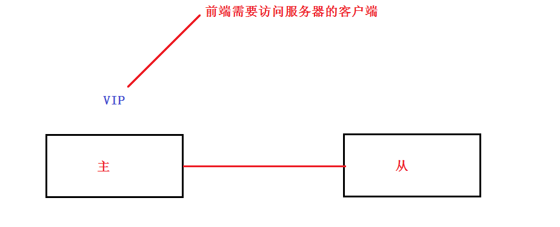
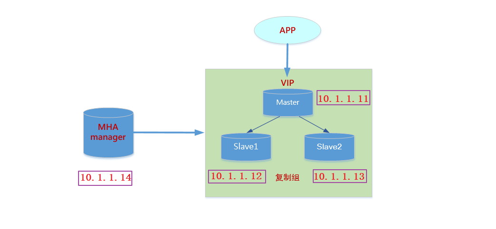

# 任务背景

实现了AB复制后, mysql数据库架构虽然可以保障数据的可靠性, 但仍然存在隐患, 它不能保证**==服务的高可用性==**。如果mysql主服务器挂掉, 需要有一个slave立刻接管主服务器的工作。

所以，需要在现有架构的基础上扩展和升级，进而在保障数据的可靠性的同时能够保障服务的可用性。

# 任务要求

1. 使用三台服务器搭建mysql的复制组（一主多从）
2. 使用==MHA==管理复制组，当master挂掉后，会立马提升一台slave作为新的master

# 任务拆解

1. 搭建MySQL的复制组（一主多从）

2. 安装MHA相关软件来管理复制组

# 学习目标

- [ ] 了解MHA的工作原理

- [ ] 能够使用MHA实现mysql的高可用架构

- [ ] 能够使用mycat实现读写分离

# 一、高可用概述

**高可用(HA):** 就是一个(机器,服务,硬盘,网卡,网线等任何有单点故障的情况)挂了,另一个自动顶上

无论是什么类型的高可用软件,一般有如下几点要考虑

* ==**高可用什么**==:  机器,服务,硬盘,网卡,网线等
* ==**主怎么个挂法**==: 主是宕机了,还是网络不能被访问了, 还是服务停了等等。**==一切只要让主不能正常工作的都需要备(或从)的切换==**。如mysql服务的高可用,只要mysql不能访问了,就是挂了

* ==**备(或者叫从)对主的健康检查**==:   主挂了，备得立刻知道才能接管主的工作
* ==**资源**==: 资源是会随着主的切换而切换, VIP就是资源其中的一种

robust 

| 可用性级别(指标) | 年度宕机时间   | 描述     | 叫法   |
| --------- | -------- | ------ | ---- |
| 99%       | 3.65天/年  | 基本可用系统 | 2个9  |
| 99.9%     | 8.76小时/年 | 可用系统   | 3个9  |
| 99.99%    | 52.6分钟/年 | 高可用系统  | 4个9  |
| 99.999%   | 5.3分钟/年  | 抗故障系统  | 5个9  |
| 99.9999%  | 32秒/年    | 容错系统   | 6个9  |

#二、认识MHA

MHA（Master High Availability）目前在MySQL高可用方面是一个相对成熟的解决方案，它由日本DeNA公司youshimaton（现就职于Facebook公司）开发，是一套优秀的作为MySQL高可用性环境下==故障切换和主从提升==的高可用软件。在MySQL故障切换过程中，MHA能做到在0~30秒之内自动完成数据库的故障切换操作，并且在进行故障切换的过程中，MHA能在==较大程度==上保证数据的一致性，以达到真正意义上的高可用。

## MHA工作原理

1. 当master出现故障时，通过对比slave之间I/O线程读取master上binlog的位置，选取最接近的slave做为最新的slave（latest slave）。 
2. 其它slave通过与latest slave对比生成差异中继日志，并应用。
3. 在latest slave上应用从master保存的binlog，同时将latest slave提升为master。
4. 最后在其它slave上应用相应的差异中继日志并开始从新的master开始复制.

小结:

* ==**当master挂掉, MHA可以将其中一个slave提升为新的master**==  (类似领导走了,自动选一个员工做新领导)

* **==MHA可以帮我们自动比对master与slave的日志差异,并协调好新的复制集群的日志位置==**（类似新领导和原领导自动交接工作)

##MHA组件

**MHA组件部署说明**

**MHA Manager**(管理节点)

MHA Manager可以单独部署在一台独立的机器上管理多个==master-slave集群==，也可以部署在一台slave节点上。

**MHA Node**(数据节点)

MHA Node运行在==每台MySQL服务器==上，MHA Manager会定时探测集群中的master节点，当master出现故障时，它可以自动将指定的slave==提升==为新的master，然后将所有其他的slave重新指向新的master。整个故障转移过程对应用程序完全透明。

**MHA组件介绍**

MHA Manager

 运行一些工具，比如masterha_manager工具实现==自动监控MySQL Master==和实现==master故障切换==，其它工具手动实现master故障切换、在线mater转移、连接检查等等。一个Manager可以管理多 个master-slave集群

MHA Node

 部署在所有运行MySQL的服务器上，无论是master还是slave。主要有三个作用：

1）保存二进制日志

 	如果能够访问故障master，会拷贝master的二进制日志

 2）应用差异中继日志

​	从拥有最新数据的slave上生成差异中继日志，然后应用差异日志。

 3）清除中继日志

 	在不停止SQL线程的情况下删除中继日志

# 三、MHA部署

##环境准备

| 角色               | IP        | 主机名             | server-id | 功能   | 备注   |
| ---------------- | --------- | --------------- | --------- | ---- | ---- |
| MHA-Manager      | 10.1.1.14 | vm4.cluster.com | —         | 管理节点 |      |
| MHA-Node（Master） | 10.1.1.11 | vm1.cluster.com | 100       | 数据节点 | 写    |
| MHA-Node（Slave1） | 10.1.1.12 | vm2.cluster.com | 200       | 数据节点 | 读    |
| MHA-Node（Slave2） | 10.1.1.13 | vm3.cluster.com | 300       | 数据节点 | 读    |

1, **所有服务器**确认主机名和`/etc/hosts`文件(可自行修改)

**笔记说明:** 我这里主机名使用vm1-vm4开头,但后面的笔记我是以mgr,master,slave1,slave2来区分不同机器的

~~~powershell
# cat /etc/hosts
127.0.0.1   localhost localhost.localdomain localhost4 localhost4.localdomain4
::1         localhost localhost.localdomain localhost6 localhost6.localdomain6
10.1.1.11    vm1.cluster.com  master
10.1.1.12    vm2.cluster.com  slave1
10.1.1.13    vm3.cluster.com  slave2
10.1.1.14    vm4.cluster.com  mgr
~~~

2, **所有服务器**关闭防火墙和selinux

~~~powershell
# systemctl stop firewalld
# systemctl disable firewalld
# iptables -F

# setenforce 0
~~~

3,  **所有服务器**同步系统时间

~~~powershell
# systemctl restart ntpd
# systemctl enable ntpd
~~~

4, **所有服务器**配置yum源

在centos7安装后的默认源基础上,再加上拷贝给大家的mha的源(假设拷贝到/root/mha-yum/)

~~~powershell
# vim /etc/yum.repos.d/mha.repo
[mha]
name=mha soft
baseurl=file:///root/mha-yum
enabled=1
gpgcheck=0
~~~

5, **所有服务器**安装依赖包

注意：所有服务器均需要安装

~~~powershell
yum install perl-DBD-MySQL \
perl-Config-Tiny \
perl-Time-HiRes \
perl-Mail-Sender \
perl-Mail-Sendmail \
perl-MIME-Base32 \
perl-MIME-Charset \
perl-MIME-EncWords \
perl-Params-Classify \
perl-Params-Validate.x86_64 \
perl-Log-Dispatch \
perl-Parallel-ForkManager \
net-tools -y
~~~

## 部署MySQL复制环境

MHA集群至少需要2个slave, 所以我们搭建一主两从的复制架构。

可以使用上次搭建好的一主两从架构, 也可以重新搭建(过程省略, 参考上一次课文档即可)

请使用基于GTIDs的AB复制架构

## 创建mha监控用户

在master,slave1,slave2**三台mysql服务器**上创建mha监控用户, 需要对管理节点授权(**==授权时IP为管理节点IP==**)

~~~powershell
# /mysql56/bin/mysql -p123
Enter password:

mysql> grant all on *.* to mha@'10.1.1.14' identified by '123';
mysql> flush privileges;
~~~

## MHA软件安装

在所有节点安装 ==mha-node== 软件包，在 ==mha管理节点==上再安装 mha-manager 软件包

~~~powershell
[root@mgr ~]# rpm -ivh /root/mha4mysql-node-0.57-0.el7.noarch.rpm
[root@master ~]# rpm -ivh /root/mha4mysql-node-0.57-0.el7.noarch.rpm
[root@slave1 ~]# rpm -ivh /root/mha4mysql-node-0.57-0.el7.noarch.rpm
[root@slave2 ~]# rpm -ivh /root/mha4mysql-node-0.57-0.el7.noarch.rpm

[root@mgr ~]# rpm -ivh /root/mha4mysql-manager-0.57-0.el7.noarch.rpm
~~~

## 配置ssh互信

1,所有服务器上都使用root产生空密码密钥对

~~~powershell
[root@mgr ~]# ssh-keygen -P "" -f /root/.ssh/id_rsa
[root@master ~]# ssh-keygen -P "" -f /root/.ssh/id_rsa
[root@slave1 ~]# ssh-keygen -P "" -f /root/.ssh/id_rsa
[root@slave2 ~]# ssh-keygen -P "" -f /root/.ssh/id_rsa
~~~

2, 将master,slave1,slave2上产生的公钥拷给mgr管理节点上对应的路径

~~~powershell
[root@master ~]# scp /root/.ssh/id_rsa.pub 10.1.1.14:/root/.ssh/master_id_pub
[root@slave1 ~]# scp /root/.ssh/id_rsa.pub 10.1.1.14:/root/.ssh/slave1_id_pub
[root@slave2 ~]# scp /root/.ssh/id_rsa.pub 10.1.1.14:/root/.ssh/slave2_id_pub
~~~

3, 在mgr管理节点将所有的公钥(包括自己的)都追加到同一个authorized_keys文件里

~~~powershell
[root@mgr ~]# cd /root/.ssh/

[root@mgr.ssh]# cat master_id_pub slave1_id_pub slave2_id_pub id_rsa.pub >> authorized_keys
~~~

4,在mgr管理节点上将authorized_keys文件分发给master,slave1,slave2上

~~~powershell
[root@mgr.ssh]# for i in 11 12 13; do scp authorized_keys 10.1.1.$i:/root/.ssh/; done
~~~

5, 自行验证是否互相ssh不需要密码了(如果这里不验证,后面会有命令帮我们验证)

## 挂载VIP

在master上虚拟出VIP,(**==VIP为前面程序访问mysql的IP,随着master切换的==**)

~~~powershell
[root@master ~]# ifconfig ens33:0 10.1.1.100/24
~~~

## 创建mha相关配置文件

- 创建 mha 相关的工作目录

~~~powershell
[root@mgr ~]# mkdir /etc/mha/
[root@mgr ~]# mkdir -p /data/mha/app1
~~~

- 创建mha局部配置文件

~~~powershell
[root@mgr ~]# vim /etc/mha/app1.conf
[server default]
# 设置监控用户和密码
user=mha
password=123
# 设置复制环境中的复制用户和密码
repl_user=slave
repl_password=123
# 设置ssh的登录用户名
ssh_user=root
# 设置监控主库,发送ping包的时间间隔,默认是 3 秒,尝试三次没有回应的时候自动进行failover
ping_interval=3
# 设置mgr的工作目录
manager_workdir=/data/mha/app1
# 设置mysql master 保存 binlog 的目录,以便 MHA 可以找到 master 的二进制日志
master_binlog_dir=/mysql56/data
# 设置 master 的 pid 文件
master_pid_file=/mysql56/data/mysql56.pid
# 设置 mysql master 在发生切换时保存 binlog 的目录（在mysql master上创建这个目录）
remote_workdir=/mysql56/data
# 设置 mgr 日志文件
manager_log=/data/mha/app1/app1-3307.log
# MHA 到 master 的监控之间出现问题,MHA Manager 将会尝试从slave1和slave2登录到master上
secondary_check_script=/usr/bin/masterha_secondary_check -s 10.1.1.12 -s 10.1.1.13 --user=root --port=22 --master_host=10.1.1.11 --master_port=3307
# 设置自动 failover 时候的切换脚本,10.1.1.100为VIP,0为VIP产生在网卡上的子接口
master_ip_failover_script="/etc/mha/master_ip_failover.sh 10.1.1.100 0"

[server1]
hostname=10.1.1.11			
port=3307
candidate_master=1		
[server2]
hostname=10.1.1.12
port=3307
candidate_master=1
[server3]
hostname=10.1.1.13
port=3307
no_master=1
~~~

## 上传相关脚本并改权限

~~~powershell
[root@mgr ~]# ls /etc/mha/
app1.conf  master_ip_failover.sh

[root@mgr ~]# chmod +x /etc/mha/master_ip_failover.sh
~~~

## 检查ssh互信和集群状态

- 检查ssh互信

~~~powershell
[root@mgr ~]# masterha_check_ssh --conf=/etc/mha/app1.conf
......
Wed May 25 10:40:41 2019 - [info] All SSH connection tests passed successfully.  
~~~

- 检查集群状态

~~~powershell
[root@mgr ~]# masterha_check_repl --conf=/etc/mha/app1.conf
......
MySQL Replication Health is OK.
~~~

## 启动MHA-Mgr状态监控

**先检查状态, 为`NOT_RUNNING`状态**

~~~powershell
[root@mgr ~]# masterha_check_status --conf=/etc/mha/app1.conf
app1 is stopped(2:NOT_RUNNING).
~~~

**开启MHA Manager监控**

~~~powershell
[root@mgr ~]# nohup masterha_manager --conf=/etc/mha/app1.conf --ignore_last_failover &
~~~

说明: 

* 此监控命令需要放在后台执行,而且关闭终端后进程会关闭，所以需要nohup命令挂起

* 因为MHA不允许多次failover切换的间隔时间太短,所以我们需要加--ignore_last_failover参数实现多次切换验证

**再次查看监控状态,为`running`状态**

~~~powershell
[root@mgr ~]# masterha_check_status --conf=/etc/mha/app1.conf
app1 (pid:10121) is running(0:PING_OK), master:10.1.1.11
~~~

**PS: 手动停止监控命令:`masterha_stop --conf=/etc/mha/app1.conf`**

# 四、自动Failover测试

## **在MHA管理节点上先监控日志变化**

~~~~powershell
[root@mgr ~]# tail -f /data/mha/app1/app1-3307.log
~~~~

##模拟故障

在master上关闭服务(或者关闭机器)

~~~powershell
[root@master ~]# /mysql56/bin/mysqladmin shutdown -p
~~~

## 查看切换过程

~~~powershell
[root@mgr ~]# tail -f /data/mha/app1/app1-3307.log
......
......
......
Check MHA Manager logs at vm4.cluster.com:/data/mha/app1/app1-3307.log for details.

Started automated(non-interactive) failover.
Invalidated master IP address on 10.1.1.11(10.1.1.11:3307)
Selected 10.1.1.12(10.1.1.12:3307) as a new master.
10.1.1.12(10.1.1.12:3307): OK: Applying all logs succeeded.
10.1.1.12(10.1.1.12:3307): OK: Activated master IP address.
10.1.1.13(10.1.1.13:3307): OK: Slave started, replicating from 10.1.1.12(10.1.1.12:3307)
10.1.1.12(10.1.1.12:3307): Resetting slave info succeeded.
Master failover to 10.1.1.12(10.1.1.12:3307) completed successfully.
~~~

#### 

# 五、后续讨论

切换成功后, 原来的slave1变为新的master,原来的master要变为slave1,也就是两个人要**==互换角色==**了

但是MHA只帮我们把原来的slave1变为新的master,而原来的master要变为slave1则需要我们现在手动再做了

**1, 在原slave1(新master)对原master(新slave1)授权**

==**PS:如果之前在slave1(新master)授权使用了%代表所有客户端,那么这一步可以跳过**==

~~~powershell
[root@slave1 ~]# /mysql56/bin/mysql -p
Enter password:

mysql> grant replication slave on *.* to 'slave'@'10.1.1.11' identified by '123';
mysql> flush privileges;
注意: IP为原master(新slave1)的IP
~~~

**2, 启动原master(新slave1)的mysql服务(前面模拟故障把它停掉了),并配置为新的slave1**

~~~powershell
[root@master ~]# /mysql56/bin/mysqld_safe --defaults-file='/mysql56/etc/my.cnf' &

[root@master ~]# /mysql56/bin/mysql -p
Enter password:

注意:下面是连接原slave1(新master)
mysql> change master to master_host='10.1.1.12', master_user='slave',master_password='123',master_port=3307, master_auto_position=1;

mysql> start slave;

mysql> show slave status\G

               Slave_IO_State: Waiting for master to send event
                  Master_Host: 10.1.1.12	确认此IP为slave1的IP(也就是现在的master的IP)
                  Master_User: slave
                  Master_Port: 3307
				  ......
				  ......
             Slave_IO_Running: Yes
            Slave_SQL_Running: Yes
~~~

**3, 重新开启MHA**

~~~powershell
[root@mgr ~]# masterha_check_repl --conf=/etc/mha/app1.conf
......
......
MySQL Replication Health is OK.

[root@mgr ~]# masterha_check_status --conf=/etc/mha/app1.conf
app1 is stopped(2:NOT_RUNNING).

[root@mgr ~]# nohup masterha_manager --conf=/etc/mha/app1.conf --ignore_last_failover &
~~~

**5, 测试验证**

