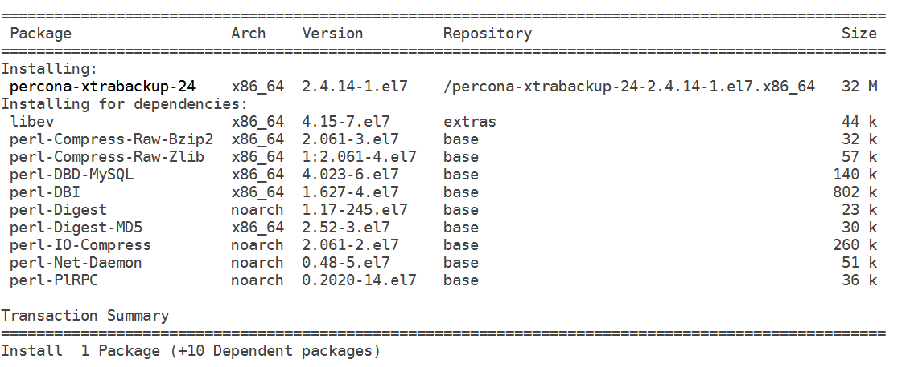
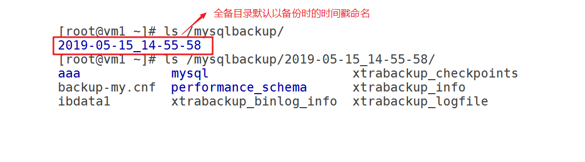

# 任务背景

再熟练的运维人员或DBA都会有误操作的时候，所以对于数据库的管理都还需要做一个事:**==备份==**。备份只是一种手段，我们最终目的是当数据出现问题时能够及时的通过备份==进行恢复==,保障数据的安全。


# 任务要求

1. 选择==合适的工具==和==方法==对mysql数据库进行备份
2. 编写脚本实现自动化备份


# 课程目标

- [ ] 了解MySQL常见的备份方式和类型
- [ ] 能够使用mysqldump进行数据库的备份与恢复
- [ ] 能够实现mysql数据的导入导出
- [ ] 能够使用xtrabackup对数据库进行全备和增备


#一、MySQL备份概述

## 了解备份

**备份什么？**

备份==物理文件的集合==, 日志文件(二进制日志)+数据文件+配置文件等


**备份过程须考虑的因素**

- 必须制定==详细的备份计划(策略)==（备份频率、时间点、周期）
- 备份数据应该放在==非数据库本地==，并建议==有多份副本==
- 必须做好==**数据恢复的演练**==（每隔一段时间，对备份的数据在测试环境中进行模拟恢复，保证当出现数据灾难的时候能够及时恢复数据。）
- 根据数据应用的场合、特点==选择正确的备份工具==。
- 数据的一致性
- 服务的可用性


##备份类型

可以按是否能关闭数据库分为:

* **冷备**(offline)   (关闭数据库后,直接cp或rsync命令备份)
* **热备**(online)    (不用关闭数据库,在线就能备份)


按备份方式分为:

* ==**逻辑备份**==

备份**改变数据库操作的SQL语句**（DDL, DML 等）或者**通过SQL语句导出数据**。

适用于**中小型数据库，效率相对较低**。 一般在数据库**正常提供服务**的前提下进行，如：**mysqldump**、数据的导出导入等。

* ==**物理备份**==

**备份物理文件**

适用于**大型数据库**环境，不受存储引擎的限制，但不能恢复到不同的MySQL版本。 如: xtrabackup, mysqlbackup等工具


## 备份方法

- 完全备份（全备）
- 增量备份/差异备份（增量备份基于全量备份）
- 累计增量  (多个增量备份的和)


##备份工具

**社区版安装包中的备份工具：**

**mysqldump**   （逻辑备份，只能==全量备份==）  

* 企业版和社区版都包含

* 本质上使用==SQL语句描述数据库==及数据并导出

* 在MYISAM引擎上锁表，Innodb引擎上锁行

* 数据量很大时不推荐使用

**mysqlhotcopy**（物理备份工具）

* 企业版和社区版都包含

* perl写的一个脚本，本质上是使用锁表语句后再拷贝数据

* **==只支持MYISAM数据引擎==**


**企业版安装包中的备份工具：**

**mysqlbackup**

* 在线备份

* 全量增量备份


**第三方备份工具：**

**XtraBackup和innobackupex**（物理备份）

* Xtrabackup是一个对**InnoDB**做数据备份的工具，支持==在线热备份==（备份时不影响数据读写），是商业备份工具**InnoDB Hotbackup**的一个很好的替代品。

* Xtrabackup有两个主要的工具：xtrabackup、innobackupex

* xtrabackup只能备份==InnoDB和XtraDB==两种数据表，不能备份myisam类型的表。

* innobackupex是将Xtrabackup进行封装的perl脚本，所以能同时备份处理innodb和myisam的存储引擎，但在处理myisam时需要加一个读锁。


# 二、MySQL逻辑备份

**备份前准备**

建立一个备份目录.owner,group改为mysql服务运行用户,否则会报权限问题

**==注意: 实际环境中,备份的目录不应该和数据库在同一个硬盘上,应该是一个远程的存储。(后期存储课程会讲)==**

~~~powershell
[root@vm1 ~]# mkdir /mysqlbackup
[root@vm1 ~]# chown mysql.mysql /mysqlbackup
~~~


## 1. mysqldump备份

**本质**：导出的是sql语句文件

**优点**：无论是什么存储引擎，都可以用mysqldump备成sql语句

**缺点**：速度较慢,导入时可能会出现格式不兼容的突发状况.==无法直接做增量备份==.

**提供三种级别的备份，表级，库级和全库级** 

###① 语法

~~~powershell
表级别备份
mysqldump [OPTIONS] database [tables]
库级别备份
mysqldump [OPTIONS] --databases [OPTIONS] DB1 [DB2 DB3...]
全库级别备份
mysqldump [OPTIONS] --all-databases [OPTIONS]
~~~


###② 表级备份与恢复

**表级备份**

~~~powershell
备份单个表
[root@vm1 ~]# /mysql56/bin/mysqldump aaa emp -p > /mysqlbackup/emp.sql
Enter password:

备份多个表
[root@vm1 ~]# /mysql56/bin/mysqldump aaa emp dept -p > /mysqlbackup/emp_dept.sql
Enter password:
~~~

**删除emp表模拟数据丢失**

(使用drop删除,因为mysqldump备份了表的结构和数据)

~~~powershell
[root@vm1 ~]# /mysql56/bin/mysql -p
Enter password:

mysql> drop table aaa.emp;
~~~

**表级恢复**

（前面学过导入的3种方法,在这里任选一种都OK)

~~~powershell
mysql> use aaa;					
要先use进aaa库,因为备份的sql语句里没有指定库,当然你也可以在备份的sql语句里加上use aaa;这一句

mysql> source /mysqlbackup/emp.sql
~~~

~~~powershell
[root@vm1 ~]# cat /mysqlbackup/emp.sql | /mysql56/bin/mysql aaa -p
Enter password:
~~~

~~~powershell

[root@vm1 ~]#  /mysql56/bin/mysql aaa -p  < /mysqlbackup/emp.sql
Enter password:
~~~


### ③ 库级备份与恢复

**库级备份**

~~~powershell
备份单个库
[root@vm1 ~]# /mysql56/bin/mysqldump --databases aaa -p > /mysqlbackup/aaa.sql
Enter password:

备份多个库
[root@vm1 ~]# /mysql56/bin/mysqldump --databases aaa bbb -p > /mysqlbackup/aaa_bbb.sql
Enter password:
~~~

**删除aaa库模拟数据丢失**

~~~powershell
[root@vm1 ~]# /mysql56/bin/mysql -p                                                      Enter password:

mysql> drop database aaa;
~~~

**库级恢复**

（前面学过导入的3种方法,在这里任选一种都OK)

~~~powershell
[root@vm1 ~]# /mysql56/bin/mysql -p < /mysqlbackup/aaa.sql
Enter password:
~~~


### ④ 全库级备份

* **使用mysqldump做全库级备份只能备份==自建的库==与==初始化的名为mysql的那个库==**
* **不能备份物理上的二进制日志等文件**
* **如果rm删除了datadir目录的数据,则只能先初始化，再恢复mysqldump的全备**
* **恢复之后要flush privileges; 刷新权限表，才能使用原来的密码**

**==所以要实现真正意义上所有文件的全库备份还是建议使用物理备份方式==**


**全库级备份**

~~~powershell
[root@vm1 ~]# /mysql56/bin/mysqldump --all-databases -p > /mysqlbackup/all.sql
Enter password:
~~~

**全库级恢复**

~~~powershell
[root@vm1 ~]# /mysql56/bin/mysql -p < /mysqlbackup/all.sql
Enter password:
~~~


**小结：**

1. mysqldump工具备份的是==SQL语句==,==任何存储引擎==都可以使用
2. 使用备份文件恢复时，要保证==数据库处于运行状态==
3. 只能实现全库，指定库，表级别的==某一时刻的备份==，本身==不能增量备份==
4. 适用于==中小型==数据库,数据量大速度慢


## 2. 逻辑导入导出

无论是什么存储引擎，以下方式本身是一种数据导出的方法，同时可以用来辅助备份，它可以对一个表的其中一列或者某几列做备份。备份的是==数据记录。==

特点:

* 备出来的是文本数据(不是SQL语句)

* 可以备一张表的部分数据, 简单来说，能通过select查询出来的就可以备出来

### ① 语法

**导出数据:**

```powershell
mysql> select 字段 into outfile '/path/file' from table_name; 
mysql> select * into outfile '/path/file' from table_name;
说明: 在当前版本对此方法有安全限制。(后面例子会有说明)
```

**恢复数据：**

方法1

需要编译时加`-DENABLED_LOCAL_INFILE=1`参数。

~~~powershell
mysql> load data local infile '/path/file' into table table_name;
~~~

方法2

~~~powershell
# mysqlimport  dbname /path/file
~~~


### ② 实例

把aaa库的emp表导出成文本，然后误删掉数据后进行恢复

1, 登录导出(但5.6后的版本对此有安全限制)

~~~powershell
[root@vm1 ~]# /mysql56/bin/mysql -p
Enter password:

mysql> select * into outfile '/mysqlbackup/emp.txt' from aaa.emp;
ERROR 1290 (HY000): The MySQL server is running with the --secure-file-priv option so it cannot execute this statement							   5.6版报错

mysql> show variables like '%secure%';
+------------------+-------+
| Variable_name    | Value |
+------------------+-------+
| secure_auth      | ON    |
| secure_file_priv | NULL  |				需要修改此参数
~~~

2, 修改配置文件,重启mysql服务

~~~powershell
[root@vm1 ~]# vim /mysql56/etc/my.cnf
secure_file_priv=/mysqlbackup/				在[mysqld]参数组里加一个参数,指定备份目录

[root@vm1 ~]# /mysql56/bin/mysqladmin shutdown -p
Enter password:

[root@vm1 ~]# /mysql56/bin/mysqld_safe --defaults-file='/mysql56/etc/my.cnf' &
~~~

3, 重新登录导出

~~~powershell
[root@vm1 ~]# /mysql56/bin/mysql -p
Enter password:

mysql> select * into outfile '/mysqlbackup/emp.txt' from aaa.emp;
~~~

导出的文件`/mysqlbackup/emp.txt`此文件默认以`\t`制表符为分隔符

4, 删除emp里的内容(**注意: 不要drop删除表,因为只备份了表内的内容,没有备份表结构**),用于模拟数据丢失

~~~powershell
[root@vm1 ~]# /mysql56/bin/mysql -p
Enter password:

mysql> truncate table aaa.emp;
~~~

5, 恢复

方法1

~~~powershell
mysql> load data local infile '/mysqlbackup/emp.txt' into table aaa.emp;
~~~

方法2

~~~powershell
[root@vm1 ~]# /mysql56/bin/mysqlimport aaa /mysqlbackup/emp.txt -p
Enter password:
这条命令aaa是库(schema)名，但没有指定表名，是由文件名来决定的(emp.txt决定了是aaa.emp表)
~~~


小结: 

* 导出的是**==文本类型==**,格式通用
* 一般用于辅助备份


**课后练习: 创建一个表，把你系统里的/etc/passwd导入到数据库**


#三、MySQL物理备份

## 1. xtrabackup备份介绍

### xtrabackup优缺点

**优点：** 

1. 备份过程==快速、可靠(==因为是物理备份)；
2. 支持==增量备份==，更为灵活; 
3. 备份过程**不会打断正在执行的事务**；
4. 能够基于压缩等功能节约磁盘空间；
5. 自动实现备份检验；
6. ==还原速度快==； 

**缺点：**

1.  只能对==innodb表增量备份==，myisam表增量备份时是全备
2.  innobackupex备份MyISAM表之前要对全库进行加READ LOCK,阻塞写操作,对InnoDB表备份不会阻塞读写。


### xtrabackup备份原理

1. innobackupex首先会==启动==一个==xtrabackup_log==后台检测的进程，实时检测mysql的==redo log(事务日志)==的变化，一旦发现redo有新的日志写入，立刻将日志写入到日志文件==xtrabackup_log==中。
2. ==物理==拷贝i==nnodb的数据文件和系统表空间文件idbdata1==到对应的以默认时间戳为备份目录的地方
3. 复制结束后，执行==flush table with read lock==操作进行全库锁表准备备份非InnoDB文件
4. 物理复制.frm .myd .myi等非InnoDB引擎文件到备份目录
5. 查看二进制日志的位置
6. 解锁表unlock tables
7. ==停止==xtrabackup_log进程


​										PS: 此图片来自网络

### xtrabackup备份恢复原理


## 2. xtrabackup全备及恢复

**思路：**

1. innobackupex工具安装
2. innobackupex进行全备，备份集==不能直接用于恢复==
3. ==预备阶段==，备份过程中产生的xtrabackup_log==应用到全量备份集==
4. 模拟故障（删除数据）
5. 进行全库恢复
6. 测试验证

### ① 安装工具

1, 直接使用`yum install`接软件包绝对路径,会自动在默认的yum源里找依赖包(提示: 需要centos7安装后的默认源和公网网络)

~~~powershell
[root@vm1 ~]# yum install /root/percona-xtrabackup-24-2.4.14-1.el7.x86_64.rpm
~~~




2, 安装完后, 主要验证以下两个命令

~~~powershell
[root@vm1 ~]# which xtrabackup
/usr/bin/xtrabackup					一个由C编译而来的二进制文件，只能备份InnoDB和XtraDB数据
~~~

~~~powershell
[root@vm1 ~]# which innobackupex
/usr/bin/innobackupex

是xtrabackup命令与其它工具的一个perl脚本封装, 可以备份MyISAM, InnoDB, XtraDB表。
(在最新的xtrabackup8版本已经去掉了此命令,因为mysql8不支持Myisam引擎了)
~~~


### ② 全库备份

```mysql
[root@vm1 ~]# innobackupex --defaults-file='/mysql56/etc/my.cnf' --user=root --password=123 --socket='/tmp/mysql56.sock'  /mysqlbackup/
```




**==补充:==** 备份目录指定`/mysqlbackup/$(date +%F)`,再加上`--no-timestamp`参数，就不是以时间戳来命名,而是`/mysqlbackup/2019-05-15`了

~~~powershell
[root@vm1 ~]# innobackupex --defaults-file='/mysql56/etc/my.cnf' --user=root --password=123 --socket='/tmp/mysql56.sock'  /mysqlbackup/$(date +%F)  --no-timestamp
~~~


| 文件                     | 说明                          |
| ---------------------- | --------------------------- |
| xtrabackup_checkpoints | 备份类型,备份状态和LSN(日志序列号)范围信息    |
| xtrabackup_binlog_info | 备份完这个时间点的二进制日志position      |
| xtrabackup_info        | 备份的工具,命令行,二进制日志, 数据库等相关很多信息 |
| xtrabackup_logfile     | xtrabackup记录innodb事物日志的信息   |
| backup-my.cnf          | 备份命令的配置参数信息                 |


### ③ 模拟数据丢失

(**说明:** 我这里mv移除datadir里的数据,并没有使用rm删除, 是因为尽量不要删除二进制日志和`/mysql56/etc/my.cnf`配置文件)

问题: 如果生产环境里真的全删除干净了,怎么办?

答: 配置文件只能手动再写, 二进制日志丢了，就只能恢复到备份的那个时间点。

~~~powershell
[root@vm1 ~]# mkdir /mysql56/databak/
[root@vm1 ~]# mv /mysql56/data/* /mysql56/databak/

模拟数据丢失后,再关闭数据库,或直接干掉mysql进程
[root@vm1 ~]# pkill mysql
~~~

### ④ 应用日志到备份集(预备)

重点参数: `--apply-log`，  **应用xtrabackup_logfile 事务日志文件**

一般情况下，在备份完成后，数据尚且不能用于恢复操作，因为备份的数据中可能会包含尚未提交的事务或已经提交但尚未同步至数据文件中的事务。因此，此时数据文件仍处于不一致状态, 所以需要**应用事务日志使之一致**。

~~~powershell
[root@vm1 ~]# innobackupex --defaults-file='/mysql56/etc/my.cnf' --user=root --password=123 --socket='/tmp/mysql56.sock' --apply-log /mysqlbackup/2019-05-15_14-55-58/
~~~

### ⑤ 数据恢复

重点参数: `--copy-back`

~~~powershell
[root@vm1 ~]# innobackupex --defaults-file='/mysql56/etc/my.cnf' --user=root --password=123 --socket='/tmp/mysql56.sock' --copy-back /mysqlbackup/2019-05-15_14-55-58/


[root@vm1 ~]# ls /mysql56/data/
aaa            ibdata1      mysql               query.log
auto.cnf       ib_logfile0  mysql56.err         xtrabackup_binlog_pos_innodb
binlog.000001  ib_logfile1  mysql56.pid         xtrabackup_info
binlog.index   ibtmp1       performance_schema  xtrabackup_master_key_id

~~~

⑥ 修改数据目录权限, 启动数据库

因为前面一直使用root用户操作,所以`copy-back`到原来数据目录里的数据owner,group都为root，需要改回成mysql服务的运行用户才能启动

~~~powershell
[root@vm1 ~]# chown -R mysql.mysql /mysql56/data/

[root@vm1 ~]# /mysql56/bin/mysqld_safe --defaults-file='/mysql56/etc/my.cnf' &

~~~

全库恢复完毕


**==PS: 如果备份时间后还有数据修改的话,则继续使用二进制日志恢复(参考mysql二进制日志章节)==**


小结:

* 全备（没有备份二进制日志,query日志,错误日志等)

* 恢复过程  先apply-log再copy-back,最后应用二进制（前提是二进制没有丢失)进行恢复


## 3. xtrabackup增量备份集恢复

### 增备恢复原理


**思路：**

1. 全量备份（==增量基于全备==,也就是说没有全备无法实现增量备份）
2. 应用日志到全量备份集中（预备）
3. 更改数据
4. 增量备份
5. 应用==增备的备份集到全量备份集中==
6. 模拟故障
7. 数据恢复
8. 测试验证

### ① xtrabackup全量备份

```powershell
清空环境先
[root@vm1 ~]# rm -rf /mysqlbackup/*

[root@vm1 ~]# innobackupex --defaults-file='/mysql56/etc/my.cnf' --user=root --password=123 --socket='/tmp/mysql56.sock'  /mysqlbackup/
```

### ② 应用日志到全量备份集

```powershell
--apply-log	表示应用日志
--redo-only	表示只应用已经提交的事务，不回滚未提交的事务，只针对增量备份有效。
注意：如果已经回滚了未提交事务，那么就无法再应用增量备份。
也就是说中间的增备如果rollback，那增备之间就无法衔接起来。

[root@vm1 ~]# innobackupex --defaults-file='/mysql56/etc/my.cnf' --user=root --password=123 --socket='/tmp/mysql56.sock' --apply-log --redo-only /mysqlbackup/2019-05-15_16-32-26/
```

###③ 改变数据库数据

对数据库做修改操作(增加,删除或修改数据都可以),我这里加了一个aaa.haha表来模拟

**目的: 模拟全备与增量备份之间的数据改变**

```powershell
[root@vm1 ~]# /mysql56/bin/mysql -p
Enter password:

mysql> use aaa;

mysql> create table haha(id int);
mysql> insert into haha values(1);
mysql> select * from haha;
+------+
| id   |
+------+
|    1 |
+------+

```

### ④ xtrabackup增量备份

语法: `innobackupex --incremental /incre_backup --incremental-basedir=BASEDIR`

说明: 

* --incremental-basedir指的是完全备份所在的目录; ;/incre_backup为即将产生的增量备份目录(不用提前mkdir此目录,默认还是以时间戳来命名)
* 如果是第2次增量备份,那么--incremental-basedir就是指向上一次增量备份目录了.

```powershell
[root@vm1 ~]# innobackupex --defaults-file='/mysql56/etc/my.cnf' --user=root --password=123 --socket='/tmp/mysql56.sock' --incremental /mysqlbackup_incre --incremental-basedir=/mysqlbackup/2019-05-15_16-32-26/

[root@vm1 ~]# ls /mysqlbackup_incre/
2019-05-15_16-45-36
```

### ⑤ 应用增备备份集到全量备份集

语法: `innobackupex --apply-log /全量备份集目录 --incremental-dir=/增量备份集`

**注意: 如果有多次增量备份,则按照全备—>增备1—>增备2...的顺序来应用日志**

```powershell
[root@vm1 ~]# innobackupex --defaults-file='/mysql56/etc/my.cnf' --user=root --password=123 --socket='/tmp/mysql56.sock' --apply-log /mysqlbackup/2019-05-15_16-32-26/ --incremental-dir=/mysqlbackup_incre/2019-05-15_16-45-36
```

### ⑥ 模拟故障

```powershell
[root@vm1 ~]# rm -rf /mysql56/databak/
[root@vm1 ~]# mkdir /mysql56/databak/

[root@vm1 ~]# mv /mysql56/data/* /mysql56/databak/
```

### ⑦ 数据恢复

```powershell
[root@vm1 ~]# innobackupex --defaults-file='/mysql56/etc/my.cnf' --user=root --password=123 --socket='/tmp/mysql56.sock' --copy-back /mysqlbackup/2019-05-15_16-32-26/
```

### ⑧ 修改权限,启动服务并测试

```powershell
[root@vm1 ~]# chown -R mysql.mysql /mysql56/data

[root@vm1 ~]# /mysql56/bin/mysqld_safe --defaults-file='/mysql56/etc/my.cnf' &


[root@vm1 ~]# /mysql56/bin/mysql -p
Enter password:

mysql> use aaa;
mysql> show tables;
+---------------+
| Tables_in_aaa |
+---------------+
| dept          |
| emp           |
| haha          |
+---------------+
```


**==PS: 如果备份时间后还有数据修改的话,则继续使用二进制日志恢复(参考mysql第2天二进制日志章节)==**


## 4. xtrabackup总结

- 如果数据库在第1次增量备份后发生故障，那么数据恢复时只能够使用xtrabackup全量备份加xtrabackup增量备份的时间点，即==恢复到第1次增量备份结束的点==

- 如果要将数据库恢复到最新状态，需要==结合binlog日志恢复==

- 以上全量和增量的备份集是不能用的，需要将xtrabackup_log(事务日志，在备份过程中数据库的更改)应用到全量的备份集中才有效（应用日志==必须按照顺序去应用==：全备—>增备1—>增备2...）

- 应用所有日志到全量备份集中时，需注意

  - 除了==最后一次增量备份==应用日志可以不加--redo-only外,其他都要加;

    只应用已经提交的事务，不回滚未提交的事务!!!

  - 应用日志到全量备份集中时一定要==严格按照时间顺序执行，否则无效==！

- 在恢复数据时，确保数据目录为空;


#课后拓展实战

## 实战一

**自动mysql备份**

1. 备份策略制定（了解业务|运营）|备份周期（1周）、备份时间点（避开业务高峰）
2. 备份工具选择（mysqldump |xtrabackup）
3. 脚本编写
4. 计划任务执行


**例:**  以1个星期为周期设计了一个备份周期,如下

**累计增量备份:** 指多次增量备份合到一起，这样做的目的是为了在恢复时节省恢复增量备份的次数。

| 星期   | 一    | 二    | 三    | 四          | 五    | 六    | 天          |
| ---- | ---- | ---- | ---- | ---------- | ---- | ---- | ---------- |
| 备份方式 | 全    | 增    | 增    | 累(1-4天的增量) | 增    | 增    | 累(4-7天的增量) |


参考脚本

~~~powershell
[root@vm1 ~]# vim /tmp/mysqlbackup.sh

#!/bin/bash

day=$(date +%A)

case "$day" in
        Monday )
                innobackupex --defaults-file='/mysql56/etc/my.cnf' --user=root --password=123 --socket='/tmp/mysql56.sock'  /mysqlbackup/$(date +%F) --no-timestamp &> /dev/null
                ;;
        Tuesday|Wednesday|Friday|Saturday )
                innobackupex --defaults-file='/mysql56/etc/my.cnf' --user=root --password=123 --socket='/tmp/mysql56.sock' --incremental /mysqlbackup/$(date +%F) --incremental-basedir=/mysqlbackup/$(date -d "-1 days" +%F) --no-timestamp &> /dev/null

                ;;
        Thursday|Sunday )
                innobackupex --defaults-file='/mysql56/etc/my.cnf' --user=root --password=123 --socket='/tmp/mysql56.sock' --incremental /mysqlbackup/$(date +%F) --incremental-basedir=/mysqlbackup/$(date -d "-3 days" +%F) --no-timestamp &> /dev/null
                ;;
                * )
                echo "日期有误"
esac


rm -rf /mysqlbackup/$(date -d "-1 months" +%F)
~~~

放到crond时间任务里

~~~powershell
30 02 * * *  sh  /tmp/mysqlbackup.sh
~~~


## 实战二

思考: 如何把原来单机的LAMP里的mysql数据给**==迁移==**到新服务器上的mysql数据库里

1, 安装新服务器，安装新mysql

2, 在老mysql那全备

3, 恢复到新mysql

4, 把请求转到新mysql

5,关闭老mysql


