# **学习目标**

- [x] 了解python的起源,优缺点,应用场景

- [x] 能够在linux平台上安装python3.X版本

- [x] 能够在linux平台上安装pycharm集成开发环境

- [x] 能够使用print进行换行打印和不换行打印

- [x] 能够对python代码进行注释

- [x] 能够用python创建变量和变量赋值

- [x] 能够说出python的六种基本数据类型


# 一、认识python

人生苦短，我用python ----- life is short ,you need python


python的哲学: **明确,优雅,简单 **  

问题: 我都学了shell，为什么还要学python ?

* python更强大，执行效率比shell高。
* python可以跨平台，可移植性好，标准统一，在不同平台程序结果一致。但shell在不同平台还可能不一样(比如centos6,centos7)
* python模块（模块可以通俗的先理解为插件 ) 丰富，应用场景更丰富。
* 还有就是顺应开发型运维的趋势，更高薪:smiley:。  DEVOPS

但是，所以对于新时代的运维工程师来说，两种技能都要掌握。


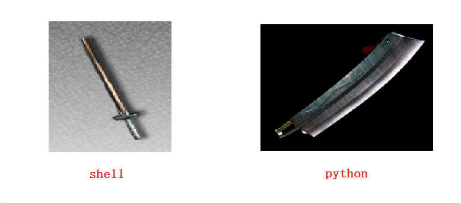

## python起源

python的创始人为Guido von Rossum（吉多·范·罗苏姆），俗称”龟叔“，荷兰人。1989年圣诞节期间，在阿姆斯特丹，Guido为了打发圣诞节的无趣，决心开发一个新的脚本解释程序，做为ABC 语言的一种继承。之所以选中Python（大蟒蛇的意思）作为该编程语言的名字，是因为他是一个叫Monty Python的喜剧团体的爱好者。


ABC是由Guido参加设计的一种教学语言。是专门为非专业程序员设计的。但是ABC语言并没有成功，究其原因，Guido 认为是其非开放(**封闭,不开源**)造成的。Guido决心在Python中避免这一错误。同时他还想实现在ABC 中闪现过但未曾实现的东西。就这样，Python在Guido手中诞生了。


## python的优缺点

**胶水语言**

**python优点:**

1. **==简单,易学,易懂,开发效率高==**：Python容易上手,语法较简单。在linux上和写shell一样，拿着vi都可以写，直接就可以运行。
2. **==免费、开源==**：我们运维用的大部分软件都是开源啊,亲！
3. **==可移植性,跨平台==**：Python已经被移植在许多不同的平台上,Python程序无需修改就可以在Linux,Windows,mac等平台上运行。
4. **==可扩展性==**：如果你需要你的一段关键代码运行得更快或者希望某些算法不公开，你可以把你的部分程序用C或C++编写，然后在你的Python程序中使用它们（讲完编译型语言和解释型语言区别就容易理解了)。
5. **==丰富的库==**： 想产生个随机数? 调库啊。想操作os? 调库啊。想操作mysql? 调库啊调库君。。。。。。Python的库太丰富宠大了，它可以帮助你处理及应对各种场景应用。
6. ==**规范的代码**==：Python采用强制缩进的方式使得代码具有极佳的可读性。


**python缺点：**

1. ==**执行效率较慢**== : 这是解释型语言(下面的解释器会讲解说明)所通有的，同时这个缺点也被计算机越来越强性能所弥补。有些场景慢个几微秒几毫秒,一般也感觉不到。

课后查询名词: 代码混淆


## Python应用场景

1. **操作系统管理、服务器运维的自动化脚本**

一般说来，Python编写的系统管理脚本在可读性、性能、代码重用度、扩展性几方面都优于普通的shell脚本。

2. **Web开发**

Python经常被用于Web开发。比如，通过mod_wsgi模块，Apache可以运行用Python编写的Web程序。Python定义了WSGI标准应用接口来协调Http服务器与基于Python的Web程序之间的通信。一些Web框架，如Django,TurboGears,web2py,Zope等，可以让程序员轻松地开发和管理复杂的Web程序。

3. **服务器软件（网络软件）**

Python对于各种网络协议的支持很完善，因此经常被用于编写服务器软件、网络爬虫。第三方库Twisted支持异步网络编程和多数标准的网络协议(包含客户端和服务器)，并且提供了多种工具，被广泛用于编写高性能的服务器软件。

4. **游戏**

很多游戏使用C++编写图形显示等高性能模块，而使用Python或者Lua编写游戏的逻辑、服务器。相较于Python，Lua的功能更简单、体积更小；而Python则支持更多的特性和数据类型。

5. **科学计算**

NumPy,SciPy,Matplotlib可以让Python程序员编写科学计算程序。

6. **其它领域**

无人驾驶，人工智能等。


## 解释型语言与编译型语言 

计算机只能识别机器语言（如:01010101001这种）, 程序员不能直接去写01这种代码，所以要程序员所编写的程序语言翻译成机器语言。将其他语言翻译成机器语言的工具，称之为**==编译器或解释器==**。

 如：中国人 ---（翻译）----外国人

编译器翻译的方式有两种，一种是**编译**，一种是**解释**。区别如下:


正因为这样的区别，所以解释型语言开发效率高,但执行慢。


redhat family

rhel(企业版)

centos(社区版)

fedora(桌面版)


## python版本

在centos7上默认自带的python版本为2.7.X

~~~python
# python --version
Python 2.7.5
~~~

python2.x      2020年终止维护

python3.x	目前主流版本

python官网下载地址:

<https://www.python.org/getit/> 

## 第一个python程序

1. 使用vi或vim直接写

```python
# vim 1.py						

#!/usr/bin/python				# 声明类型,指明解释器命令路径
#-*- coding: utf-8 -*-			# 指定字符格式为utf-8（可以打印中文）,python3不用再指定了

print "hellow world"			# python2的写法,python3执行会报错
print("hello world")			# python3的写法,python2也可以执行
print("哈哈")				   	   # python2指定了utf-8字符，那么这里就可以使用中文

执行方法一:
# python 1.py

执行方法二:
# chmod 755 1.py
# ./1.py						# 需要有执行权限和声明类型才能这样执行
```

2. 使用python命令(默认版本)交互写

~~~powershell
# python

>>> print ("hello world")
hello world
>>> exit()					--使用exit()或quit()或ctrl+d键来退出
~~~


# 二、python相关软件安装与使用

## python3.x安装

在linux上(如果是虚拟机上安装，请把内存调大，建议内存调整为3G或以上)安装python3.x(我这里为3.6.6版本)

第1步: 安装编译需要的依赖包

```powershell
cenots7系统如果gnome图形界面和开发工具都安装了,那么就还需要安装zlib-devel,openssl,openssl-devel这几个依赖包
# yum install zlib-devel openssl openssl-devel
```

第2步: 将下载的安装包拷贝到centos7系统上(此步骤请自行完成)，然后解压安装

~~~powershell
# tar xf Python-3.6.6.tar.xz -C /usr/src/
# cd /usr/src/Python-3.6.6/
~~~

第3步: 编译安装

~~~powershell
# ./configure  --enable-optimizations
关于--enable-optimizations参数的说明:可能因不同的同学电脑的兼容问题，有些同学会在make步骤卡住，可以尝试去掉此参数重新编译
# make					
这一步时间较长(20-30分钟，视机器速度而定)
# make install
编译第三步几乎不会报错，除非你的安装路径空间不够了
~~~

第4步: 确认安装后的命令

~~~powershell
# ls /usr/local/bin/python3.6
确认此命令,此为python的主命令(也就是解释器)，并且要与默认的python2区分开
# ls /usr/local/bin/pip3.6			
确认此命令,pip为python安装模块的命令,后面课程会用得到
~~~


**扩展**: 如果觉得源码编译安装太费时间的话,可以使用epel源安装python3.6的rpm版.(**需要centos7默认的外网源，能上外网**)

~~~powershell
# yum install epel-release -y
# yum install python36
~~~


## pycharm安装

PyCharm是一种Python **==IDE==**（Integrated Development Environment, 集成开发环境）。它带有一整套可以帮助用户在使用Python语言开发时提高其效率的工具，比如调试、语法高亮、Project管理、代码跳转、智能提示、自动完成、单元测试、版本控制。

pycharm官网下载地址:

http://www.jetbrains.com/pycharm/download/#section=linux

专业版: 功能全，需要收费，但可以试用30天

社区版: 免费版，学习基础够用了


**linux下安装pycharm**

将下载的pycharm安装包拷贝到centos系统(过程省略，请自行完成)，然后解压，直接启动安装程序

（**==注意: 安装专业版前一定记得要时间同步==**)

~~~powershell
# tar xf pycharm-professional-2018.2.4.tar.gz -C /usr/local/

# sh /usr/local/pycharm-2018.2.4/bin/pycharm.sh &
~~~

按照图形介绍提示一步步安装

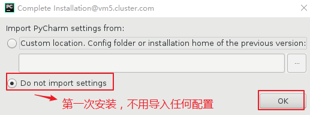

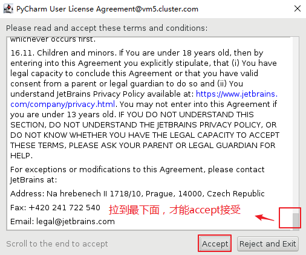

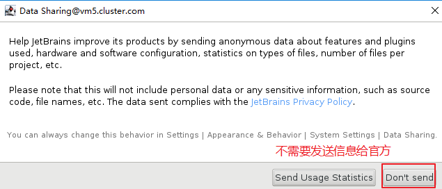

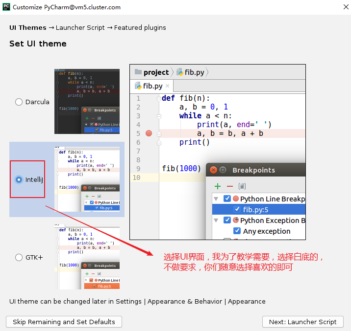


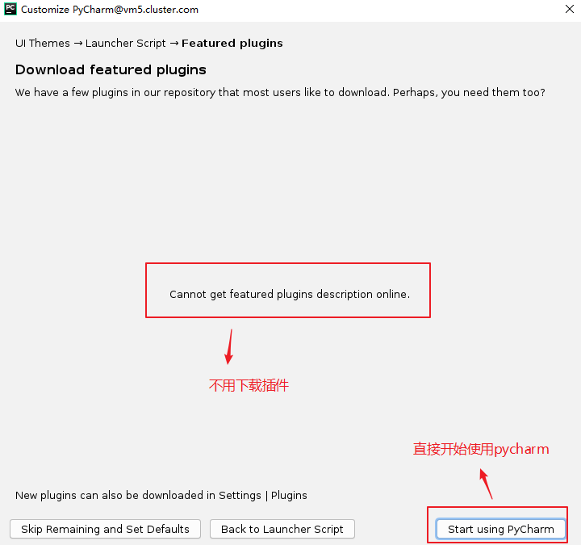

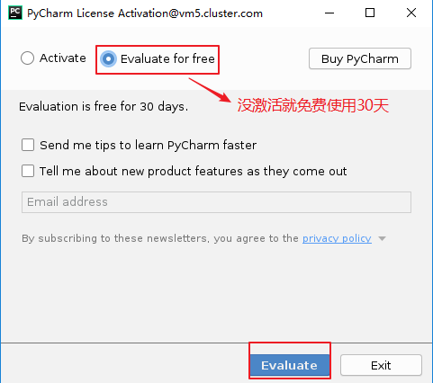

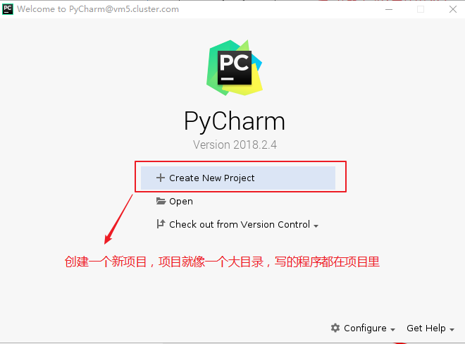

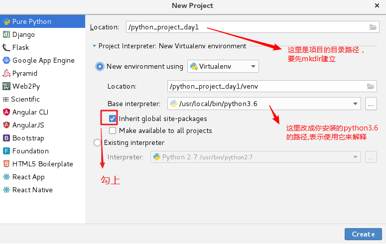

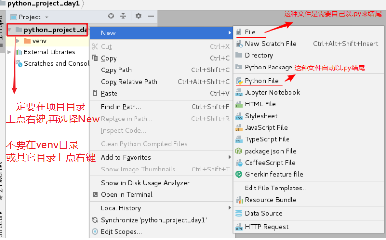


**练习:** 请各位同学在自己的windows或mac电脑上也安装pycharm，记得要先安装对应版本的python(解释器), 再安装pycharm(选择windows的python解释器)


**小结:**

* 实际环境中，程序员一般在个人电脑上(windows或mac等)安装类似pycharm这种IDE工具，然后在IDE工具上进行开发。开发的代码会通过特定的方法上传到服务器整合(以后会学到)。

* 安装过程主要两个部分:1,先安装python解释器 2,安装pycharm这种IDE工具,并且要指定项目的python解释器

* pycharm程序的启动没有服务脚本，是使用` sh /usr/local/pycharm-2018.2.4/bin/pycharm.sh &`命令来启动; 但这样启动会有1个问题,如果关闭终端,那么启动的命令也会出现问题

  解决方法:

  `nohup sh /usr/local/pycharm-2018.2.4/bin/pycharm.sh &`


## pyenv安装(拓展)

**pyenv**是一个**==python多版本管理工具==**，当服务器上存在不同版本的python项目时，使用pyenv可以做到多版本的隔离使用(类似虚拟化)，每个项目使用不同版本互不影响。

pyenv文档及安装地址:

https://github.com/pyenv/pyenv

~~~powershell
1,使用git clone下载安装到家目录的.pyenv目录
# git clone https://github.com/pyenv/pyenv.git ~/.pyenv

2,设置环境变量,并使之生效,这样才能直接使用pyenv命令
# echo 'export PYENV_ROOT="$HOME/.pyenv"' >> /etc/profile
# echo 'export PATH="$PYENV_ROOT/bin:$PATH"' >> /etc/profile
# source ~/.bash_profile

# pyenv help
# pyenv install -l		--或者使用pyenv install --list列出所有的python当前可用版本

3,先解决常见依赖包的问题，否则下一步安装会报错
# yum install zlib-devel bzip2-devel openssl-devel ncurses-devel sqlite-devel readline-devel tk-devel gdbm-devel libpcap-devel xz-devel -y

4,安装3.6.6版本,需要下载并安装,速度较慢。它会安装到~/.pyenv/versions/下对应的版本号
# pyenv install 3.6.6

5,查看当前安装的版本,前面带*号的是默认使用的版本
# pyenv versions		
* system (set by /root/.pyenv/version)
  3.6.6
~~~

**pyenv-virtualenv**是pyenv的插件，为pyenv设置的python版本提供隔离的虚拟环境。不同版本的python在不同的虚拟环境里使用互不影响。

pyenv-virtualenv文档及安装地址:

https://github.com/pyenv/pyenv-virtualenv

~~~powershell
1，将pyenv-virtualenv这个plugin下载安装到pyenv根目录的plugins/下叫pyenv-virtualenv
# git clone https://github.com/pyenv/pyenv-virtualenv.git $(pyenv root)/plugins/pyenv-virtualenv

2，把安装的3.6.6版本做一个隔离的虚拟化环境，取名为python3.6.6(这个取名是自定义的)
# pyenv virtualenv 3.6.6  python3.6.6

3，active激活使用，但报错
# pyenv activate python3.6.6		
Failed to activate virtualenv.

Perhaps pyenv-virtualenv has not been loaded into your shell properly.
Please restart current shell and try again.
解决方法:
# echo 'eval "$(pyenv init -)"' >> /etc/profile
# echo 'eval "$(pyenv virtualenv-init -)"' >> /etc/profile
# source /etc/profile

4,再次激活，成功
# pyenv activate python3.6.6
pyenv-virtualenv: prompt changing will be removed from future release. configure `export PYENV_VIRTUALENV_DISABLE_PROMPT=1' to simulate the behavior.
(python3.6.6) [root@daniel ~]# pip install ipython		--安装一个ipython测试

5,使用ipython测试完后退出虚拟环境
(python3.6.6) [root@daniel ~]# ipython
In [1]: print ("hello word")                                                    
hello word

In [2]: exit          		                                                          
(python3.6.6) [root@daniel ~]# pyenv deactivate	 --这里exit就退出终端了，用此命令退出虚拟环境
[root@daniel ~]# 

这样的话，你可以在linux安装多个版本的python,使用不同的隔离环境来开发不同版本的python程序.

删除隔离环境的方法:
# pyenv uninstall python3.6.6
~~~


# 三、print打印(重点)

## 基本的打印规则

Python程序由多个逻辑行构成，一个逻辑行不一定为一个物理行(人眼看到的行)

显示行连接: \
​        在物理行后跟反斜杠， 代表此行连接下一行代码

隐式行连接: () [] {}
   	在括号里换行会自动行连接

字符串需要用引号引起来，单引双引三引都可以。

**示例: 换行打印**

~~~python
help(print)			# 帮助方法

print("hello world") 			
print("python")		# 这是两句分开的打印，会打印两行

print("hello world\npython")	# 打印的结果会换行

print('''hello world
       python''')  	# 打印的结果会换行
      
print("hello world
       python")   	# 错误写法
~~~

**示例: 不换行打印**

```python
print('hello world', end="") 	# python3里加上end=" "，可以实现不换行打印.类似shell里的echo -n
print("python")

print("hello world \
python")			  # 使用\符号连接行，物理上换了行，逻辑上并没有换行。不建议用\符号来连接行

print("hello world" 
      "python")   	  # (),[],{}里的多行内容不用\连接，但需要每行引起来;打印出来的结果不换行
```

**示例**: 使用VT100控制码(用来在终端扩展显示的代码)实现有颜色的打印

~~~python
print("\033[31;1;31m hello world\033[0m")
print("\033[31;1;32m hello world\033[0m")
print("\033[31;1;33m hello world\033[0m")
print("\033[31;1;34m hello world\033[0m")
print("\033[31;1;35m hello world\033[0m")
print("\033[31;1;36m hello world\033[0m")
结果如下:
~~~


## 打印时的常见异常

1. 打错单词


2. 缩进错误


3. 一行不能打印多次

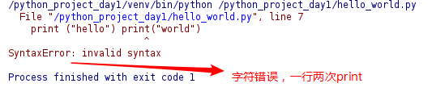


# 四、注释

## 注释(comment)的作用与方法

 注释的作用：在程序中对某些代码进行标注说明 ，增强程序的可读性。

**注释反面教材**:


**1.单行注释**： # 被注释内容

在# 后面建议添加一个空格  ,然后在写注释的内容


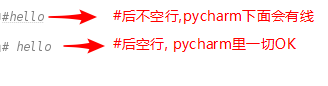

在代码的后面添加注释 ：注释和代码之间要至少有两个空格


**2.多行注释** :   三引号（三个双引或三个单引)里包含注释内容


小技巧:在pycharm里可以用**==ctrl+/==**来给多行加#注释或去掉注释。


## 代码规范PEP

Python 官方提供有一系列 PEP（Python Enhancement Proposals） 文档

其中第 8 篇文档专门针对 Python 的代码格式 给出了建议，也就是俗称的 PEP 8

文档地址：<https://www.python.org/dev/peps/pep-0008/>


谷歌有对应的中文文档：<http://zh-google-styleguide.readthedocs.io/en/latest/google-python-styleguide/python_style_rules/>

**建议:** 开发新手请尽量遵守代码规范，pycharm这样的IDE工具会对不规范的代码进行提示。


# 五、变量 (重点)

## 什么是变量

一栋楼房，用来容纳人和物。我们可以说去202房间找某人或去303房间找某物。

在这里你可以把楼房理解成内存，202房间或303房间理解为变量名，某人或某物理解成变量的值。


变量：在内存中开辟一块空间，临时保存数据。通俗的说**变量名就是存储空间的名字**，通过这个名字来访问和存储空间中的数据。

### 变量的特点

* 可以反复存储数据

* 可以反复取出数据

* 可以反复更改数据

### 变量的命名规则

* 变量名只能是**字母**、**数字**或**下划线**的任意组合

* 变量名的第一个字符不能是数字

* 变量名要有见名知义的效果  

  * 驼峰命名法

  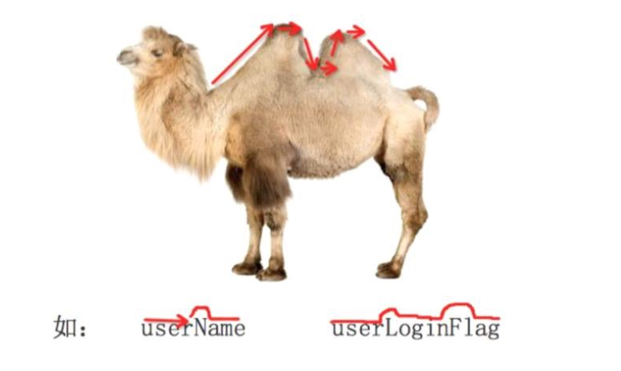

  * 小驼峰式命名法（lower camel case）： 第一个单词以小写字母开始；第二个单词的首字母大写，例如：myName、aDog
  * 大驼峰式命名法（upper camel case）： 每一个单字的首字母都采用大写字母，例如：FirstName、LastName
  * 还有一种命名法是用下划线“_”来连接所有的单词，比如user_name

* 变量名区分大小写

* 以下关键字不能声明为变量名(关键字是python内部使用或有特殊含义的字符)
  ['False', 'None', 'True', 'and', 'as', 'assert', 'break', 'class', 'continue', 'def', 'del', 'elif', 'else', 'except', 'finally', 'for', 'from', 'global', 'if', 'import', 'in', 'is', 'lambda', 'nonlocal', 'not', 'or', 'pass', 'raise', 'return', 'try', 'while', 'with', 'yield']

~~~python
import keyword			# 导入keyword模块
print(keyword.kwlist)  	# 打印上面的关键字列表
~~~


## 变量的创建(定义)

在python中,每一个变量在使用前都必须**赋值**，变量赋值后，变量就创建成功了。

**==变量名 = 值==** 

**示例**:

```python
num = 100     			# num第一次出现是表示创建(定义)这个变量    
num = num - 10		
print(num)
```


**示例**:

```powershell
name1 = "daniel"
print(id(name1))
name2 = "daniel"
print(id(name2))   # id()函数用于获取对象内存地址编号;name1和name2得到的id相同,说明指向同一个内存空间
```

**示例:**

~~~powershell
a = 1
print(id(a))
b = 2
a = 3
print(id(a))
c = 1
print(id(c))

1413311520
1413311584
1413311520
第1次打印和第2次打印的id结果不一样,说明a=3是重新开辟了一个内存空间存放3这个值
第1次打印和第3次打印的id结果一样,说明c=1相当于是把存放1这个值的内存空间名由a换成了c
~~~

**示例:**

```powershell
a = 1
b = 2
c = 1

print(id(a))
print(id(b))
print(id(c))
结果: id(a)与id(c)得到的结果一样，因为它们的值一样。
```

**示例:**

```powershell
a = 1
b = 2
c = 1
a = 2

print(id(a))
print(id(b))
print(id(c))
结果: id(a)与id(b)得到的结果一样，因为它们的值一样。
```

**小结:** 变量名可以不一样，**只要值一样**，通过id()函数得到的内存地址编号就一样。(目前仅限讨论**==数字这种不可变数据类型==**)

这里引出两个概念:**可变数据类型**和**不可变数据类型**（有个印象先,讲数据类型时再细讲)


## 两个变量值的交换

其它语言中可以借助于第三个变量来交换变量 a 和b 的值

python中可以直接交换，两个变量的值

**示例**:

~~~python
a, b = 1, 2				# 可以像这样一次定义多个变量
print(a, b)

a, b = b, a
print(a, b)
~~~


## 变量的类型

在程序中, 为了更好的区分变量的功能和更有效的管理内存，变量也分为不同的类型。

Python是**==强类型==**的**==动态==**解释型语言。

强类型: 不允许不同类型相加。如整型+字符串会报错。

动态：不用显示声明数据类型，确定一个变量的类型是在第一次给它赋值的时候，也就是说: **==变量的数据类型是由值决定的==**。


**示例**:

~~~python
name = "zhangsan"		# str类型
age = 25				# 25没有加引号，则为int类型；加了引号，则为str类型;
height = 1.8			# float类型
marry = True			# bool类型

print(type(name))			# 通过type()内置函数得知变量的类型
print(type(age))
print(type(height))
print(type(marry))
~~~

##    Python基本数据类型分类

1. ==**数字**==
   * int     	     整型(1, 2, -1, -2)
   * float             浮点型(34.678)
   * bool             布尔型(True/False)
   * complex      复数(4+3J, 不应用于常规编程，这种仅了解一下就好
2. **==字符串==**   
   - str		     单引号，双引号和三引号内表示的内容为字符串	“hello world"   "12345"
3. **==列表==**
   - list		     使用中括号表示      [1, 2, 3, 4]
4. **==元组==**
   - tuple	     使用小括号表示	(1, 2, 3, 4)
5. **==字典==**
   - dict		     使用大括号表示，存放key-value键值对	{"a":1, "b":2, "c":3}
6. **==集合==**
   - set		    也使用大括号表示，但与字典有所不同		 {1, 2, 3, 4}


## 类型的转换

| 转换函数   | 说明                           |
| :--------- | :----------------------------- |
| int(xxx)   | 将xxx转换为整数                |
| float(xxx) | 将xxx转换为浮点型              |
| str(xxx)   | 将xxx转换为字符串              |
| list(xxx)  | 将xxx转换为列表                |
| tuple(xxx) | 将xxx转换为元组                |
| dict(xxx)  | 将xxx转换为字典                |
| set(xxx)   | 将xxx转换为集合                |
| chr(xxx)   | 把整数[0-255]转成对应的ASCII码 |
| ord(xxx)   | 把ASCII码转成对应的整数[0-255] |

**示例**:

~~~python
age = 25					
print(type(age))	# int类型
age = str(25)
print(type(age))	# str类型
~~~

**示例**:

~~~python
name = "zhangsan"
age = 25				

print(name, "你" + age + "岁了")    # str+int，字符串拼接报错;age=str(25),这一句就可以成功。
~~~


