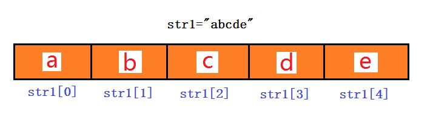

# **学习目标**

- [ ] 能够定义字符串和进行字符串的拼接
- [ ] 掌握字符串的下标,切片,倒序
- [ ] 掌握字符串的常见操作
- [ ] 掌握列表的创建,下标,切片,倒序
- [ ] 掌握列表的增删改查操作
- [ ] 能够创建元组并区分元组与列表

 

回顾:

1. 数字

2. 字符串
3. 列表
4. 元组
5. 字典
6. 集合


# 十、字符串-str(重点)

## **字符串的定义与输入**

在python中,用引号引起来的都是字符串。还有input函数输入的， str()函数转换的等。

~~~python
string1 = "hello"
string2 = 'hello'
string3 = """hello
python"""
string4 = '''hello
world'''
string5 = input("input anything: ")
string6 = str(18)

print(isinstance(string3,str))	# isinstance函数可以用来判断数据是否为某一个数据类型，返回值为True或False
~~~


## 字符串的拼接与格式化输出

~~~python
name = "daniel"

str1 = "===" + name + "==="
str2 = "===%s===" % (name)
str3 = "==={}===".format(name)

print(str1)
print(str2)
print(str3)				# 三种方法结果一样
~~~

~~~powershell
name = "张三"

print("你好,", name)		# 这种打印的结果与后三种稍有不同
print("你好," + name)
print("你好,%s" % (name))
print("你好,{}".format(name))
~~~

**小结:** 变量在引号里得不到值，只能得到变量名，要得到变量的**==值==**，就格式化输出(使用上面三种方法之一即可)


## 字符串的下标(重点)

**字符串，列表，元组都属于==序列==**(sequence)，所以都会有下标。

什么是下标(index)？



**示例: 将字符串遍历打印**

~~~python
str1 = "hello,python"

for i in str1:					# 直接用for循环遍历字符串
    print(i, end=" ")
~~~

**示例: 将字符串遍历打印,并对应打印出下标**

~~~python
str1 = "hello,python"

for i, j in enumerate(str1):	# 枚举
    print(i, j)
~~~

**示例: 将字符串遍历打印,并对应打印出顺序号(从1开始，不是像下标那样从0开始)**

~~~python
str1 = "hello,python"

# 方法一
for i, j in enumerate(str1):	
    print(i+1, j)
# 方法二
num = 1
for i in str1:
    print(num, i)
    num += 1
~~~


## 字符串的切片,倒序

问题: 打印字符串的第3-5个字节

~~~powershell
shell里的方法:
# echo abcdefg  | cut -c3-5
cde

# echo abcdefg  | awk '{print substr($0,3,3)}'		# substr()是awk里的截取函数
cde

# echo abcdefg  | sed -r 's/(..)(...)(.*)/\2/'		# sed的分域操作
cde
~~~

~~~powershell
python里循环的方法(但不建议):
str1 = "abcdefg"

for index, i in enumerate(str1):
    if 5 > index > 1:
        print(i, end="")
~~~

上面的方法仅作拓宽思路用，python里实现字符串的截取操作首先就应该想到**==切片==**的方法。

**字符串，列表，元组都属于序列**，所以都可以**==切片==**(也就是我们shell里所说的**==截取==**)。

~~~python
a = "abcdefg"
print(a[0:3])		# 取第1个到第3个字符（注意，不包含第4个）
print(a[2:5])		# 取第3个到第5个字符（注意，不包含第6个）

print(a[0:-1])		# 取第1个到倒数第2个（注意:不包含最后一个)
print(a[1:])		# 取第2个到最后一个
print(a[:])			# 全取
print(a[0:5:2])		# 取第1个到第5个，但步长为2（结果为ace)
print(a[::-1])		# 字符串的倒序（类似shell里的rev命令)
~~~

扩展比较难理解的切片方法(仅作了解):

~~~python
str1 = "abcdefghijk"

print(str1[2:0:-1])
print(str1[:3:-1])
~~~

**小结:** 

下标: 就类似一个字符串里的字符编号，通过下标可以很轻松找到第N个字符。

循环遍历: 可以把字符串里所有字符都循环操作。

切片: 通过下标得到字符串内一定范围的字符。

格式: `字符串[起始下标:结束下标(但不包含): 步长]`, 里面都可以用负数. 如果步长为负数，表示从右到左来进行切片。

建议: 格式不用记那么详细,主要记忆一个思路。 跟shell里`${}截取`和awk的`substr()函数截取`思路是类似，但具体格式有差别。


## 字符串的常见操作

~~~python
abc = "hello,nice to meet you"

print(len(abc))					# 调用len()函数来算长度						     (常用)
print(abc.__len__())			# 使用字符串的__len__()方法来算字符串的长度

print(abc.capitalize())			# 整个字符串的首字母大写
print(abc.title())			    # 每个单词的首字母大写
print(abc.upper())			    # 全大写
print(abc.lower())			    # 全小写
print("HAHAhehe".swapcase())	# 字符串里大小写互换

print(abc.center(50,"*"))		# 一共50个字符,字符串放中间，不够的两边补*
print(abc.ljust(50,"*"))		# 一共50个字符,字符串放左边，不够的右边补*	      （常用)
print(abc.rjust(50,"*"))		# 一共50个字符,字符串放右边，不够的左边补*

print(" haha\n".strip())		# 删除字符串左边和右边的空格或换行	(常用,处理文件的换行符很有用)
print(" haha\n".lstrip())		# 删除字符串左边的空格或换行
print(" haha\n".rstrip())		# 删除字符串右边的空格或换行

print(abc.endswith("you"))		# 判断字符串是否以you结尾	    类似于正则里的$	(常用)
print(abc.startswith("hello"))	# 判断字符串是否以hello开始	类似于正则里的^	(常用)

print(abc.count("e"))			# 统计字符串里e出现了多少次						 (常用)

print(abc.find("nice"))		# 找出nice在字符串的第1个下标，找不到会返回-1
print(abc.rfind("e"))		# 找出最后一个e字符在字符串的下标，找不到会返回-1
print(abc.index("nice"))	# 与find类似，区别是找不到会有异常（报错）
print(abc.rindex("e"))		# 与rfind类似，区别是找不到会有异常（报错）

print(abc.isalnum())		# 判断是否为数字字母混合(可以有大写字母，小写字母，数字任意混合)
print(abc.isalpha())		# 判断是否全为字母(分为纯大写，纯小写，大小写混合三种情况)
print(abc.isdigit())		# 判断是否为纯数字
print(abc.islower())		# 判断是否为纯小写字母
print(abc.isspace())		# 判断是否为全空格

print(abc.upper().isupper())	# 先把abc字符串全转为大写，再判断是否为全大写字母，结果为True
~~~

**小建议:** 字符串的方法非常多，新手第一次容易晕，但请不要一个一个去记忆，在我们的基础课程里主要会用到后面几个标为常用的方法，可以先记住这几个就好。其它的要用的话再查。


**示例:** 使用input输入字符，判断输入是数字，纯大写字母，纯小写字母，大小写混合字母，还是其它

~~~powershell
char = input("输入: ")

if char.isdigit():
    print("输入的是数字")
elif char.isalpha():
    if char.isupper():
        print("输入的是纯大写字母")
    elif char.islower():
        print("输入的是纯小写字母")
    else:
        print("输入是大小写混合字母")
else:
    print("输入的是其它")
~~~


## 字符串的其它操作(了解)

**数字,字符串,元组是==不可变数据类型==**（**改变值的话是在内存里开辟新的空间来存放新值，原内存地址里的值不变**）.下面的操作可以替换字符串的值，但原字符串没有改变。

**列表,字典,集合**是**==可变数据类型==**(**在内存地址不变的基础上可以改变值**)

~~~python
aaa = "hello world,itcast"
bbb = aaa.replace('l','L',2)	# 从左到右，把小写l替换成大写L，并且最多只替换2个
print(aaa)			# 原值不变
print(bbb)			# 改变的值赋值给了bbb变量，所以这里看到的是替换后的值
~~~

~~~python
print("root:x:0:0".split(":"))			# 以:为分隔号,分隔成列表				(常用)
print("root:x\n:0:0".splitlines())		# 以\n为分隔号，分隔成列表
~~~

字符串的join操作

~~~python
print(" ".join(['df', '-h']))	# 把列表里的元素以前面引号里的分隔符合成字符串
~~~


**小结:** 

* 引号引起来的,input()函数输入的,str()转换的都为字符串类型
* 多个字符串可以做拼接和格式化输出
* 字符串属于**==序列==**,属于序列的数据类型都有**下标**，**可以循环遍历**，**可以切片**，**可以拼接**

* 字符串属于**==不可变数据类型==**,不可变数据类型没有增，删，改这种操作


# 十一、列表-list(重点)

列表是一种基本的**==序列==**数据结构（字符串和元组也属于序列)

列表是一种**==可变数据类型==**（再次强调数字,字符串,元组是不可变类型）


## 列表的创建

使用**==中括号==**括起来，里面的数据称为**==元素==**。可以放同类型数据，也可以放不同类型数据，但通常是同类型。

~~~python
os_list = ["rhel", "centos", "suse", "ubuntu"]

print(os_list)
~~~


## 列表的下标

**和字符串一样**，见字符串的下标章节

**示例:**

~~~python
os_list = ["rhel", "centos", "suse", "ubuntu"]

for i, j in enumerate(os_list):
    print(i, j)
~~~


## 列表的切片,倒序

**和字符串一样**，见字符串的切片,倒序章节

示例:

~~~python
os_list = ["rhel", "centos", "suse", "ubuntu"]

print(os_list[1:3])
print(os_list[1:-1])		
print(os_list[::2])			# 打印第1个和第3个元素
print(os_list[::-1])		# 通过切片来倒序
~~~


**示例: 验证列表为可变数据类型**

~~~python
os_list = ["rhel", "centos", "suse", "ubuntu"]

print(id(os_list))
os_list.reverse()		# 通过reverse操作来倒序，并且是直接改变原数据
print(os_list)			# 列表的元素倒序了
print(id(os_list))		# 在倒序前后id()函数得到的值一样，说明内存地址不变，但值变了(可变数据类型)
~~~


## 列表的常见操作

**列表的增删改查操作**

列表是可变数据类型,可以进行增,删,改操作

~~~python
os_list = ["rhel", "centos", "suse"]
# 增
os_list.append("ubuntu")			# 在列表最后增加一个元素
print(os_list)
os_list.insert(2, "windowsxp")		# 插入到列表，变为第三个
print(os_list)
# 改
os_list[2] = "windows10"			# 修改第三个
print(os_list)
# 删
os_list.remove("windows10")			# 以元素来删除
os_list.pop(2)						# 以下标来删除，还可以del os_list[2]来删除

print(os_list)
# 查
print(os_list[0])				# 通过下标就可以
~~~

~~~python
# 其它操作
print(os_list.count("centos"))	# 统计元素出现的次数
print(os_list.index("centos"))	# 找出centos在os列表里的位置


os_list.reverse()				# 反转列表
print(os_list)
os_list.sort()					# 排序列表，按ASCII编码来排序
print(os_list)
os_list.clear()					# 清除列表所有元素，成为空列表,不是删除列表
print(os_list)
~~~

**小建议: 重点记住列表的增,删,改,查这几种操作.**


## **列表合并,拼接**

~~~python
list1 = ["haha", "hehe", "heihei"]
list2 = ["xixi", "hoho"]

list1.extend(list2)    		# list1 += list2也可以，类似字符串拼接
print(list1)
~~~

**练习:** 下面是四个选修课报名的列表,请问张三报名了几门选修课?

~~~powershell
math = ["张三", "田七", "李四", "马六"]
english = ["李四", "王五", "田七", "陈八"]
art = ["陈八", "张三", "田七", "赵九"]
music = ["李四", "田七", "马六", "赵九"]

print(math.count("张三")+english.count("张三")+art.count("张三")+music.count("张三"))

list1 = math + english + art + music			
print(list1.count("张三"))
~~~


## 双列表(拓展)

~~~python
name_list = ["zhangsan", "lisi", "wangwu", "maliu"]
salary = [18000, 16000, 20000, 15000]

for i in range(len(name_list)):
    print("{}的月收入为{}元".format(name_list[i].ljust(10," "),salary[i]))
    
for index, name in enumerate(name_list):
    print("{}的月薪为{}元".format(name,salary[index]))
~~~

~~~powershell
问题: 请查找lisi的工资
1, 先查找lisi的下标
2, 找下标对应在salary里的元素

print(salary[name_list.index("lisi"))])
~~~


~~~powershell
问题:找出工资最高的人叫啥?
1, 先找最高工资是多少
2, 再最高工资的下标
3, 找下标对应在name_list里的元素
print(name_list[salary.index(max(salary))])
~~~


## 列表嵌套(拓展)

**列表里可以嵌套列表，也可以嵌套其它数据类型**。

~~~powershell
emp = [["zhangsan", 18000], ["lisi", 16000], ["wangwu", 20000], ["maliu", 15000]]


for i in range(len(emp)):
    print("{}的月收入为{}元".format(emp[i][0].ljust(10," "),emp[i][1]))
    
for index, i in enumerate(emp):
    print("%s的月薪为%d元" % (i[0],i[1]))    
~~~

~~~powershell
问题:查找lisi的工资
for i in emp:
    if i[0] == "lisi":
        print(i[1])
~~~

问题:找出最高工资的人叫啥?

方法一:

~~~powershell
emp = [["zhangsan", 18000], ["lisi", 16000], ["wangwu", 20000], ["maliu", 15000]]

emp2 = []
for i in emp:
    emp2.append(i[1])

print(emp[emp2.index((max(emp2)))][0])
~~~

方法二:

~~~powershell
emp = [["zhangsan", 18000], ["lisi", 16000], ["wangwu", 20000], ["maliu", 15000]]

max = 0
name_list = []
for i in emp:									
    if i[1] > max:						# 每次循环得到的工资与max比
        name_list.insert(0, i[0])
        max = i[1]						# 把两个比较结果里大的值赋值给max
        
print("{}的工资最高，为{}元。".format(name_list[0], max))
~~~

方法三:

~~~powershell
emp = [["zhangsan", 18000], ["lisi", 16000], ["wangwu", 20000], ["maliu", 15000]]

num = 0
index = 0
for i in emp:
    if i[1]>num:
        num=i[1]
        index=emp.index(i)

print(emp[index])
~~~


**小结:** 

列表的创建: 由**==中括号==**包含元素

列表属于**==序列==**, 有**下标**，可以**循环遍历**，可以**切片**，可以**拼接**

列表属于==可变数据类型==;  有**增**,**删**,**改**的操作


# 十二、元组-tuple

元组就相当于是**==只读的列表==**;因为只读,所以没有append,remove,修改等操作方法.

它只有两个操作方法:count,index

元组,字符串,列表都属于**==序列==**.所以元组也有**下标**, 也可以**切片**,也可以使用**for来遍历**, 也可以**两个元组拼接**.

## 元组的创建与操作

**列表使用中括号，元组使用小括号。**

示例:

```python
tuple1 = (1, 2, 3, 4, 5, 1, 7)

print(type(tuple1))

print(tuple1.index(3))			# 打印3这个元素在元组里的下标	
print(tuple1.count(1))			# 统计1这个元素在元组里共出现几次
print(tuple1[2:5])				# 切片

tuple1[5] = 6					# 修改元组会报错
```

**元组是只读的，不代表元组里任何数据不可变。如果元组里有列表，那么列表里是可变的。**

~~~python

emp2 = (["zhangsan", 18000], ["lisi", 16000], ["wangwu", 20000], ["maliu", 15000])

emp2[0].append("haha")	# 元组里面的列表可以修改

print(emp2)
~~~


# 课后练习

**练习:（有难度，想挑战的可以尝试）:**

~~~python
tvlist = [
    "戏说西游记:讲述了西游路上的三角恋.",[
        "孙悟空:悟空爱上了白骨精......",
        "唐三藏:唐僧只想取经......",
        "白骨精:她爱上了唐僧......",
        ],
    "穿越三国:王二狗打怪升级修仙史",[
        "王二狗:开局一把刀,一条狗......",
        "吕布:看我方天画鸡......",
        "貂蝉:油腻的师姐,充值998就送!",
        ],
    "金瓶梅:你懂的",[
        "西门大官人:你懂的......",
        "潘金莲:你懂的......",
        "武大郎:你懂的......",
        "武松:你懂的......",
        ],
    "大明湖畔:我编不下去了......",[
        "夏雨荷:xxxxxx",
        "乾隆:xxxxxx",
        "容么么:xxxxxx",
    ],
]
~~~

请写python程序实现类似下面的结果:


~~~python
提示部分代码
import random							# 导入random模块(后面会具体讲模块)
    
tv_name_num = random.randrange(0,len(tvlist),2)   # len(tvlist)长度为8,这是0,2,4,6四个数的随机
tv_role_num = tv_name_num + 1
print("今日的通告: ")
print(tvlist[tv_name_num])
print("可接的角色有: ")
~~~


**练习:（有难度，想挑战的可以尝试）**

小购物车程序
1, 双十一来了，你的卡里有一定金额(自定义)
2, 买东西，会出现一个商品列表(商品名，价格)
3, 选择你要买的商品,卡里的钱够就扣钱成功，并加入到购物车;卡里钱不够则报余额不足
（或者做成把要买的商品都先加入到购物车，最后可以查看购物车，并可以删除购物车里的商品；确定后，一次性付款）
4, 买完后退出，会最后显示你一共买了哪些商品和显示你的余额

```python
提示部分代码:

money=20000

goods_list=[
    ["iphoneX",8000],
    ["laptop",5000],
    ["book",30],
    ["earphone",100],
    ["share_girlfriend",2000],
]

cart_list=[]
```