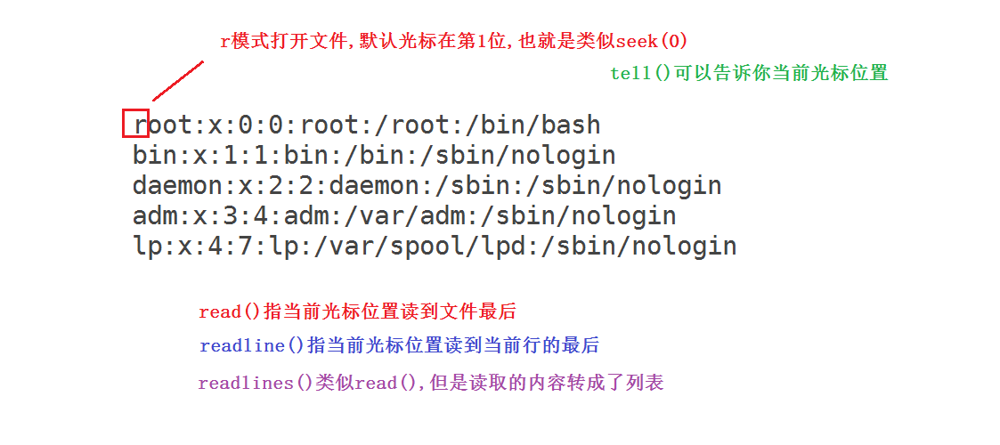

# **学习目标**

- [ ] 能够创建字典并做基本的增删改查操作
- [ ] 掌握集合的创建与基本的交并补操作

- [ ] 能够说出python文件操作的三个步骤

- [ ] 掌握主要的python文件访问模式(r,w,a)


# 十三、字典-dict(重点)

字典:是一种key:value(键值对)类型的数据，它是**==无序的==（没有像列表那样的索引,下标)**.  (**备:**现在也有特殊方法实现的**有序字典**，有兴趣课后可以搜索了解一下)

它是通过key来找value,查找速度快;

如果key相等, 会**==自动去重==**(去掉重复值), 也就是说dict中**==没有重复的key==**。但是**==值是可以相等的==**。

**==字符串,列表,元组属于序列,所以有下标,可以切片. 字典和集合是无序的,没有下标,不能切片==**。

字典属于**==可变数据类型==**

## 字典的创建

~~~python
dict1 = {
    'stu01': "zhangsan",
    'stu02': "lisi",
    'stu03': "wangwu",
    'stu04': "maliu",
}

print(type(dict1))
print(len(dict1))
print(dict1)
~~~

## 字典的常见操作

字典是**==可变数据类型==**，所以可以做增删改操作

~~~python
# 增
dict1["stu05"] = "tianqi"		# 类似修改,如果key值不存在,则就增加
print(dict1)

# 改
dict1["stu04"] = "马六"		   # 类似增加,如果key值存在,则就修改
print(dict1)
# 字典的增加与修改的写法是一样的，区别就在于key是否已经存在

# 查
print(dict1["stu01"])   	# 如果key值不存在,会返回keyerror错误
print(dict1.get("stu01"))  	# 这种取值方法如果key值不存在,会返回none,不会返回错误

# 删
dict1.pop("stu05")  		# 删除这条；也可以del dict1["stu05"]来删除
dict1.popitem()  			# 删除显示的最后一条
dict1.clear()  				# 清空字典
print(dict1)
# del dict1					# 删除整个字典
~~~


## 字典的循环遍历

前面的学习中我们知道可以使用for来遍历字符串,列表,元组.字典虽然不属于序列，但也可以使用for来遍历

~~~powershell
print(dict1.keys())   		# 打印所有的keys
print(dict1.values()) 		# 打印所有的values
print(dict1.items())  		# 字典的行转成元组
# 上面这三种可以使用for来循环遍历

for key in dict1.keys():
    print(key)

for value in dict1.values():
    print(value)

for line in dict1.items():
    print(line)
~~~

**练习:**打印出所有value为2的key

~~~powershell
dict1 = {
    '张三': 2,
    '田七': 4,
    '李四': 3,
    '马六': 2,
    '王五': 1,
    '陈八': 2,
    '赵九': 2,
}
~~~

~~~powershell
答:
for i in dict1.items():
    if i[1] == 2:
        print(i[0])
~~~


**字典练习:**

~~~python
city = {
    "北京": {
        "东城": "景点",
        "朝阳": "娱乐",
        "海淀": "大学",
    },
    "深圳": {
        "罗湖": "老城区",
        "南山": "IT男聚集",
        "福田": "华强北",
    },
    "上海": {
        "黄埔": "xxxx",
        "徐汇": "xxxx",
        "静安": "xxxx",
    },
}
~~~

1. 打印北京东城区的说明（也就是打印出"景点")
2. 修改北京东城区的说明，改为"故宫在这"
3. 增加北京昌平区及其说明
4. 修改北京海淀区的说明，将"大学"改为"清华","北大","北邮"三个学校的列表
5. 在大学列表里再加一个"北影"
6. 循环打印出北京的区名,并在前面显示序号(以1开始)
7. 循环打印出北京海淀区的大学,并在前面显示序号(以1开始)

~~~powershell
print(city["北京"]["东城"])
city["北京"]["东城"]="故宫在这"
print(city["北京"]["东城"])
city["北京"]["昌平"]="我们在这"
print(city)
city["北京"]["海淀"]=["清华","北大","北邮"]
print(city["北京"]["海淀"])
city["北京"]["海淀"].append("北影")
print(city["北京"]["海淀"])

for index, i in enumerate(city["北京"].keys()):
    print(index+1, i)

for index, i in enumerate(city["北京"]["海淀"]):
    print(index+1, i)
~~~

**小结:**

字典是否属于序列?   不属于

字典能否切片? 	不能切

"我要打印字典的第2个到第5个键值对"，这种说法是否正确?   不对

字典是属于可变数据类型还是不可变数据类型?    可变

"字典里面可以嵌套字典，也可以嵌套列表或元组等其它数据类型"，这种说法是否正确?  正确


思考: 以下几种数据你觉得用python的哪种数据类型比较合适?

* 游戏里的所有英雄名称    

~~~powershell
["亚瑟", "后羿"]
~~~

* 游戏里的单个英雄属性

~~~powershell
攻击: 100
防御: 45
血量: 1000
蓝量: 500

物理穿透:
真实伤害:
暴击:
致命一击: 
~~~

* 大公司的部门及其部门的职责说明

~~~powershell
管理部门: 管理
人事:  人事
教学:  负责课程设计与教学
......
~~~

* NBA球员的数据 

~~~powershell
姓名: xxx
身高: xxx
年龄: xxx
~~~


# 十四、集合-set(了解)

集合和字典一样都是使用**==大括号==**。但集合没有value，相当于只有字典的key。

字符串,列表和元组属于序列，是有序的，但集合是**无序的**，所以不能通过下标来查询和修改元素。

再总结一下：

**整数，字符串，元组**是**==不可变==**数据类型(整数和字符串改变值的话是在内存里开辟新的空间来存放新值，原内存地址里的值不变)

**列表，字典，集合**是**==可变==**数据类型(在内存地址不变的基础上可以改变值)

当然还有一种**不可变集合**我们这里不做讨论

集合主要特点:

1. 天生去重（去掉重复值）
2. 可以增，删（准确来说,**集合可以增加删除元素，但不能修改元素的值)**
3. 可以方便的求交集，并集，补集

## 集合的创建

**示例:**

~~~python
set1 = {1, 2, 3, 4, 5, 1, 2}
set2 = {2, 3, 6, 8, 8}

print(type(set1))
print(set1)
print(set2)				# 打印的结果，没有重复值
~~~

## 集合的常见操作(了解)

```python
set1 = {1, 4, 7, 5, 9, 6}
set2 = set([2, 4, 5, 9, 8])

# 交集
print(set1.intersection(set2))
print(set1 & set2)

print(set1.isdisjoint(set2))  			# 判断两个集合是否有交集,类型为bool(有交集为False,没交集为True)
# 并集
print(set1.union(set2))
print(set1 | set2)
# 差集(补集)
print(set1.difference(set2)) 			# set1里有,set2里没有
print(set1-set2)
print(set2.difference(set1)) 			# set2里有,set1里没有
print(set2-set1)
# 对称差集
print(set1.symmetric_difference(set2))  # 我有你没有的  加上 你有我没有的
print(set1^set2)
# 子集
set3=set([4, 5])
print(set3.issubset(set1))              # 判断set3是否为set1的子集
print(set1.issuperset(set3))            # 判断set1是否包含set3

```

~~~python
# 集合的增加操作
set1.add(88)
print(set1)
set1.update([168, 998])                  # 添加多个
print(set1)

# 集合的删除操作
set1.remove(88)                         # 删除一个不存在的元素会报错
print(set1)
set1.discard(666)                       # 删除一个不存在的元素不会报错，存在则删除
print(set1)
~~~


**小建议:** 集合在运维开发中应用不多，我们主要记一下集合的**天生去重特性**与**求交并补集方便**这主要的两点就好。


**练习: 有以下4个选修课名单**

~~~python
math = ["张三", "田七", "李四", "马六"]
english = ["李四", "王五", "田七", "陈八"]
art = ["陈八", "张三", "田七", "赵九"]
music = ["李四", "田七", "马六", "赵九"]
~~~

1. 求同时选修了math和music的人

~~~powershell
方法1:
for i in math:
    if i in music:
        print(i)

方法2:
for i in math:
    for j in music:
		if i == j:
		   print(i)

方法3:
print(set(math).intersection(set(music)))
~~~

2. 求同时选修了math,english和music的人

~~~powershell
print(set(math).intersection(set(english)).intersection(set(music)))
~~~

3. 求同时选修了4种课程的人

~~~powershell
print(set(math).intersection(set(english),set(music),set(art)))
# 或
print(set(math).intersection(set(english).intersection(set(music))).intersection(set(art)))
~~~

4. 求报了math但没报music的人

~~~powershell
print(set(math).difference(set(music)))
~~~

5. 求报了math或music的人数 (同时报的人只算1个)

~~~powershell
print(len(set(math).union(set(music))))
~~~

6. 求报了math或music的人次(同时报的人算2个)

~~~powershell
print(len(math)+len(music))
~~~


**集合小结:**

**集合是只有key的字典(无序的,没有重复值,可以增加和删除), 可以方便地求交并补集。**


**数据类型小结**

序列: 字符串， 列表，元组( 有下标，可切片)

非序列:  数字，字典，集合(没有下标，不能切片)

可变： 列表，字典，集合

不可变: 数字，字符串，元组


(): 定义元组  , 函数   len(),print(),type(),int(),str();    char.upper()      list1.append()

[]: 定义列表   , 取下标和取key

{}: 定义字典,集合. 格式化输出的占位符


**python数据类型总结:**

1, 数字(int,float,bool,complex);  字符串, 列表,元组,字典,集合

2, 字符串，列表，元组属于序列，它们都有下标。字典,集合没有下标

3, 数字,字符串,元组是不可变类型; 列表，字典，集合是可变类型（不可变集合不讨论)

4, 可以做增,删操作的有列表,字典,集合。

5, 列表,字典可以修改里面的元素, 但集合不可以修改里面的元素。

**python里括号使用总结:**

小括号():   用于定义元组;  方法调用;  print打印(其实print()也是一个函数);  函数,如len()，id(),type().

中括号():   用于定义列表;  字符串,列表,元组取下标;  字典取key

大括号():   用于定义字典,集合;  format格式化输出用于取代%s这种的占位符也是大括号

问题:

属于序列的数据类型有哪几种?序列类型有哪些共性?

~~~powershell
字符串，列表，元组      有下标，能切片，能拼接，for遍历
~~~

属于可变数据类型的有哪几种? 可变数据类型有哪些共性?

~~~powershell
列表，集合，字典        可以增，删，改(集合有点特殊)
~~~

天生去重的数据类型有哪几种?

~~~powershell
集合，字典里的key
~~~

可以用for循环遍历打印的数据类型有几种?

~~~powershell
字符串，列表，元组，字典, 集合
~~~

可以做四则运算的数据类型

~~~powershell
数字
~~~


# 十五、python文件IO操作

io(input and output): 磁盘读写

## 回顾下shell里的文件操作

shell里主要就是调用awk,sed命令来处理文件, 特别是sed命令可以使用`sed -i`命令直接操作文件的增,删,改。

## python文件操作的步骤

python文件的操作就**三个**步骤：

1. 先**==open打开==**一个要操作的文件
2. **==操作==**此文件(读，写，追加等) 
3. **==close关闭==**此文件  

## python文件的打开与关闭

~~~python
f = open("文件路径","文件访问模式")		# 打开文件简单格式，需要赋值给一个变量


f.close()							   # 关闭的方法
~~~

~~~python
with open("文件路径", '文件访问模式') as f:	# 此方法打开文件不用后面再使用close关闭了	
~~~

## python文件访问模式

| 访问模式             | 说明                                                         |
| -------------------- | ------------------------------------------------------------ |
| ==r==       (read)   | 只读模式,不能写（文件必须存在，不存在会报错）                |
| ==w==      (write)   | 只写模式,不能读（文件存在则会被覆盖内容（要千万注意），文件不存在则创建） |
| ==a==       (append) | 只追加模式,不能读                                            |
| r+                   | 读写模式                                                     |
| w+                   | 写读模式                                                     |
| a+                   | 追加读模式                                                   |
| rb                   | 二进制读模式                                                 |
| wb                   | 二进制写模式                                                 |
| ab                   | 二进制追加模式                                               |
| rb+                  | 二进制读写模式                                               |
| wb+                  | 二进制写读模式                                               |
| ab+                  | 二进制追加读模式                                             |


## python主要的访问模式示例

### 只读模式(r)

**示例: **

先在linux操作系统上使用`head -5 /etc/passwd > /tmp/1.txt`准备一个文件

~~~python
f = open('/tmp/1.txt", encoding="utf-8")		# 默认就是只读模式
# 如果不同平台,可能会字符集编码不一致,不一致的需要指定;一致的不用指定。

data1 = f.read()
data2 = f.read()				# 读第二遍

f.close()

print(data1)
print("="*50)
print(data2)	# 发现读第二遍没有结果;类似从上往下读了一遍，第二次读从最后开始了，所以就没结果了
~~~


### tell与seek的理解

~~~python
f = open("/tmp/1.txt", "r")
print(f.tell())			# 结果为0 (告诉你光标在哪,刚打开文件，光标在0位置)
f.seek(5)				# 移你的光标到整个文件的第6个字符那(因为0为第一个)
print(f.tell())			# 结果为5
f.seek(2)				# 移你的光标到整个文件的第3个字符那，从0开始算，而不是从上面的位置开始算
print(f.tell())			# 结果为2

f.close()
~~~


### 深入理解只读模式

**示例:**

~~~powershell
f = open("/tmp/1.txt", mode="r")

data1 = f.read()		# 读了第一次后，光标在最后的位置
f.seek(0)				# 通过seek(0)将光标又重置回开始的位置
data2 = f.read()		# 再次读的话，就可以又重头读一遍了,data2变量的内容与data1的内容就一致了

f.close()

print(data1)
print("="*20)
print(data2)
~~~


**示例: **

~~~python
f = open("/tmp/1.txt", "r")

f.seek(5)					# 光标移到第6个字符那里
data1 = f.read()			# read是读整个文件在光标后面的所有字符(包括光标所在的那个字符)，读完后，会把光标移到你读完的位置

f.seek(5)					# 光标重置到第6个字符那里
data2 = f.readline()		# readline是读光标所在这一行的在光标后面的所有字符(包括光标所在的那个字符)，读完后，会把光标移到你读完的位置

f.seek(5)					# 光标重置到第6个字符那里
data3 = f.readlines()		# readlines和read类似，但把读的字符按行来区分做成了列表

f.close()
print(data1)
print("="*30)
print(data2)
print("="*30)
print(data3)
~~~

**示例: 打印文件的第3行**

~~~powershell
f = open("/tmp/1.txt", mode="r")

data = f.readlines()			# 把文件从第1行到最后1行全读取，并转成列表

f.close()
print(data[2].strip())		# 通过列表的下标2取第3行，取出来的行是字符串，使用strip()去掉换行符
~~~





### 文件读的循环方法

**示例: **

~~~python
f = open("/tmp/1.txt", "r")

#循环方法一:
for index, line in enumerate(f.readlines()):
     print(index, line.strip())		# 需要strip处理，否则会有换行
        
# 循环方法二:这样效率较高，相当于是一行一行的读，而不是一次性全读（如果文件很大，那么一次性全读会速度很慢)
for index, line in enumerate(f):
     print(index, line.strip())

f.close()
~~~

**示例: 打印文件的第3行**

~~~powershell
f = open("/tmp/1.txt", mode="r")

for index, line in enumerate(f):		# 边读边循环
    if index == 2:						# 通过enumerate产生的下标来取第3行
        print(line.strip())				# 每一行的内容为字符串类型，使用strip()处理换行符

f.close()
~~~


**示例: 通过/proc/meminfo得到可用内存的值**

~~~python
f = open("/proc/meminfo", "r")

for line in f:
    if line.startswith("MemAvailable"):
        print(line.split()[1])

f.close()
~~~


**文件IO读操作小结:**

seek()

tell()

read()

readlines()

readline()


### 只写模式(w) 

**示例: **

~~~python
f = open("/tmp/1.txt",'w')      # 只写模式(不能读),文件不存在则创建新文件，如果文件存在，则会复盖原内容(千W要小心)
data = f.read()  				# 只写模式,读会报错

f.close()
~~~

**示例: 创建新文件,并写入内容**

~~~python
f = open("/tmp/2.txt", 'w')	# 文件不存在,会帮你创建(类似shell里的 > 符号)

f.write("hello\n")			# 不加\n,默认不换行写
f.write("world\n")
f.truncate()				# 截断，括号里没有数字，那么就是不删除
f.truncate(3)				# 截断，数字为3，就是保留前3个字节
f.truncate(0)				# 截断，数字为0，就是全删除
 
f.close()
~~~

**练习: 配置本地yum**

~~~python
f = open("/etc/yum.repos.d/local.repo", mode="w")

f.write("[local]\n")
f.write("name=local\n")
f.write("baseurl=file:///mnt\n")
f.write("enabled=1\n")
f.write("gpgcheck=0\n")

f.close()
~~~

~~~powershell
f = open("/etc/yum.repos.d/local.repo", mode="w")

f.write('''[local]
name=local
baseurl=file:///mnt
gpgcheck=0
enabled=1
''')

f.close()
~~~

~~~powershell
f = open("/etc/yum.repos.d/local.repo", mode="w")

f.write("[local]\n"
        "name=local\n"
        "baseurl=file:///mnt\n"
        "gpgcheck=0\n"
        "enabled=1\n")

f.close()
~~~

~~~powershell
f = open("/etc/yum.repos.d/local.repo", mode="w")

f.write("[local]\nname=local\nbaseurl=file:///mnt\ngpgcheck=0\nenabled=1\n")

f.close()
~~~


**练习: 把九九乘法表直接写到一个文件里**

~~~powershell
f = open("/tmp/3.txt", mode="w")

for i in range(1, 10):
    for j in range(1, i+1):
        f.write("{}*{}={}\t".format(j, i, i*j))
    f.write("\n")

f.close()
~~~


### 只追加模式(a)

**示例:**

~~~python
f = open("/tmp/2.txt", 'a')	# 类似shell里的>>符

f.write("hello\n")	
f.write("world\n")
f.truncate(0)				# 追加模式也可以使用truncate截取前面的数据

f.close()
~~~

**小结:**

r: 只读模式		 文件必须要存在; 

w: 只写模式		文件存在则会清空原文件内容再写，不存在则会创建文件再写

a: 只追加模式	 与w模式的区别为a模式不清空原文件内容，在最后追加写


   

### 比较r+,w+,a+三种模式(拓展)

~~~powershell
r+文件必须要存在，相当于在只读模式的基础上加了写权限;

w+会清空原文件的数据，相当于在只写模式的基础上加了读权限；(可以在任意位置写，但要用seek定位光标，还要区分读光标和写光标)

a+不会改变原文件的数据，相当于在只追加模式的基础上加了读权限;（写是在最后写，即使用seek把光标移到前面，仍然会写在最后)
~~~


### r+,w+,a+混合读写深入理解(拓展)

**示例: **

~~~python
f = open("/tmp/2.txt", "w+")

f.write("11111\n")
f.write("22222\n")
f.write("33333\n")

print(f.tell())			# 打印结果为18,表示光标在文件最后

f.write("aaa")			# 这样写aaa,相当于在文件最后追加了aaa三个字符

f.seek(0)				# 表示把光标移到0(也就是第1个字符)
f.write("bbb")			# f.seek(0)之后再写bbb,就是把第一行前3个字符替换成了bbb

f.seek(0)				# 把光标再次移到0
f.readline()			# 把光标移到第1行最后
f.seek(f.tell())		# f.seek到第1行最后(如果这里理解为两个光标的话，你可以看作是把写光标同步到读光标的位置)
f.write("ccc")			# 这样写ccc，就会把第二行的前3个字符替换成ccc

f.close()
~~~


**练习: 往一个新文件里写九九乘法表，并直接读出结果**

~~~python
f = open("/tmp/4.txt", "w+")

for i in range(1, 10):
    for j in range(1, i+1):
        f.write("{}*{}={} ".format(i, j, i*j))
    f.write("\n")

f.seek(0)						# 这里需要seek(0),否则读不出来
data1 = f.read()

f.close()
print(data1)
~~~


**总结:**

 r+,w+,a+这三种模式因为涉及到读与写两个操作,你可以使用两个光标来理解,但这样的话读光标与写光标会容易混乱，所以我们总结下面几条:

1. f.seek(0)是将读写光标都移到第1个字符的位置

2. 如果做了f.read()操作,甚至是做了f.readline()操作,写光标都会跑到最后

3. 如果做了f.write()操作,也会影响读光标

**==所以建议在做读写切换时使用类似f.seek(0)和类似f.seek(f.tell())这种来确认一下位置，再做切换操作==**


### 二进制相关模式（拓展）

二进制模式用于网络传输等相关的情况

**示例: 二进制读模式**

~~~python
f = open("/tmp/2.txt", "rb")

print(f.readline())
print(f.readline())

f.close()
~~~

**示例: 二进制写模式**

```python
f = open("/tmp/2.txt", "wb")
f.write("hello word".encode())	# 需要encode才能成功写进去

f.close()
```


# 课后示例与练习

**示例: 文件的字符串全替换(拓展)**  

两个文件, 一个读，另一个替换完后写,最后再覆盖回来

~~~python
import os
f1 = open("/tmp/1.txt", 'r')
f2 = open("/tmp/2.txt", 'w')

oldstr = input('old string:')
newstr = input('new string:')

for i in f1:
	if oldstr in i:
        i = i.replace(oldstr,newstr)
    f2.write(i)

os.remove("/tmp/1.txt")
os.rename("/tmp/2.txt","/tmp/1.txt")

f1.close()
f2.close()
~~~

**练习:（有难度，想挑战的可以尝试) **

以下面字典中的数据，评选最佳group,最佳class和teacher

~~~python
info={
    "group1":{
        "class1":["李老师","班级平均成绩85"],
        "class2":["张老师","班级平均成绩89"],
    },
    "group2": {
        "class3": ["王老师", "班级平均成绩78"],
        "class4": ["赵老师", "班级平均成绩91"],
    },
    "group3": {
        "class5": ["马老师", "班级平均成绩82"],
        "class6": ["陈老师", "班级平均成绩79"],
    },
    "group4": {
        "class7": ["钱老师", "班级平均成绩90"],
        "class8": ["孙老师", "班级平均成绩80"],
    },
}
~~~

~~~python
答案:
~~~


**练习: (有难度，想挑战的可以尝试)** 

 找出同时选修了任意1种课程的人,任意2种课程的人,任意3种课程的人,任意4种课程的人

~~~python
math = ["张三", "田七", "李四", "马六"]
english = ["李四", "王五", "田七", "陈八"]
art = ["陈八", "张三", "田七", "赵九"]
music = ["李四", "田七", "马六", "赵九"]


~~~


**示例: 打印一个文件的前5行，并打印行号（不是下标）**

~~~python
f = open("/tmp/1.txt", "r")

for index, line in enumerate(f):
    if index < 5:
        print(index+1, line.strip())
 
f.close()
~~~


**练习: 打印一个文件的3到7行，并打印行号**

~~~python

~~~

**练习: 打印一个文件的奇数行，并打印行号**

~~~python

~~~

**练习: 打印一个文件所有行,但把第2行内容替换成hello world(不能替换原文件,打印出的结果替换就可以)**


**练习: 通过/proc/cpuinfo得到cpu核数**(**processor 0代表第一个核，processor 1代表第二个核，以此类推**)

~~~python

~~~


