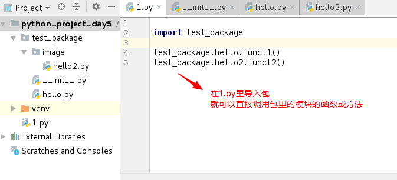
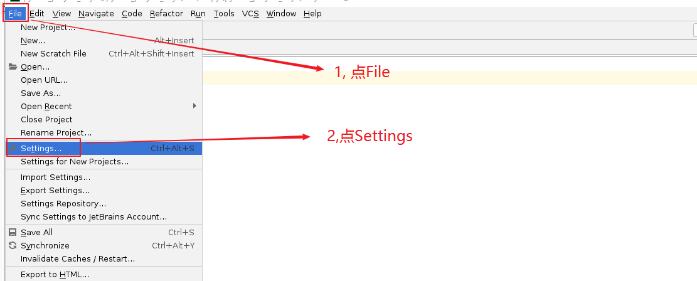
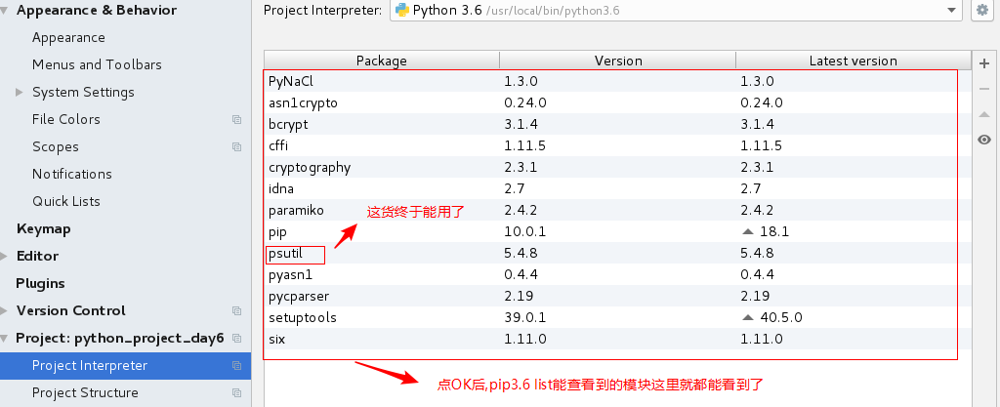
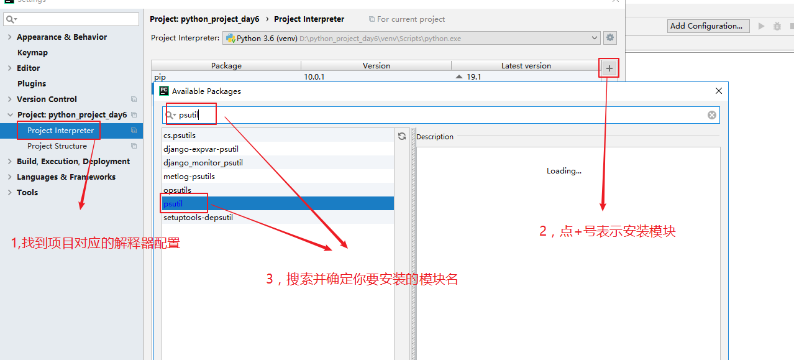
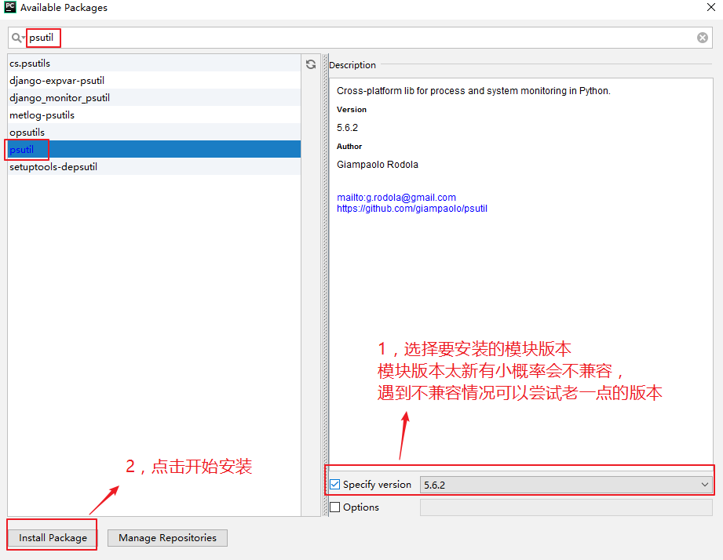
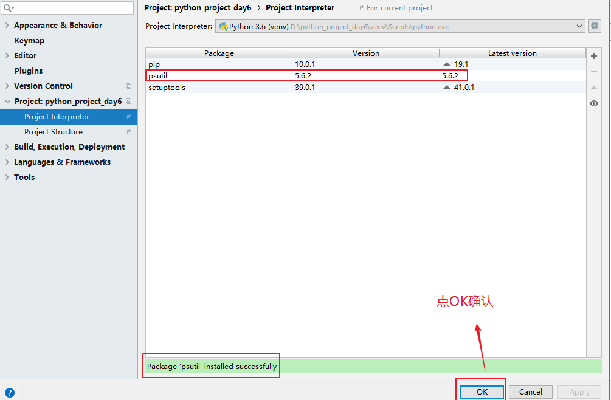
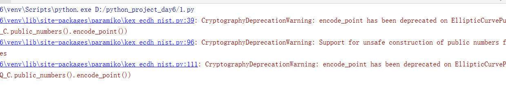
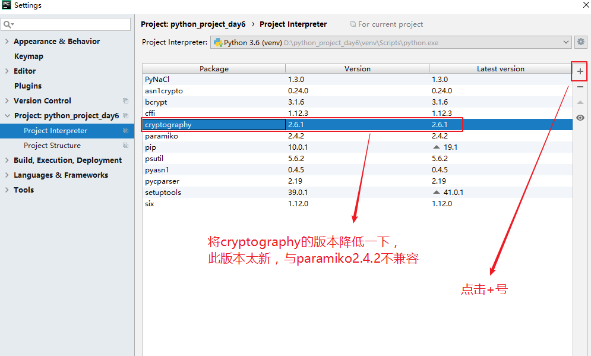
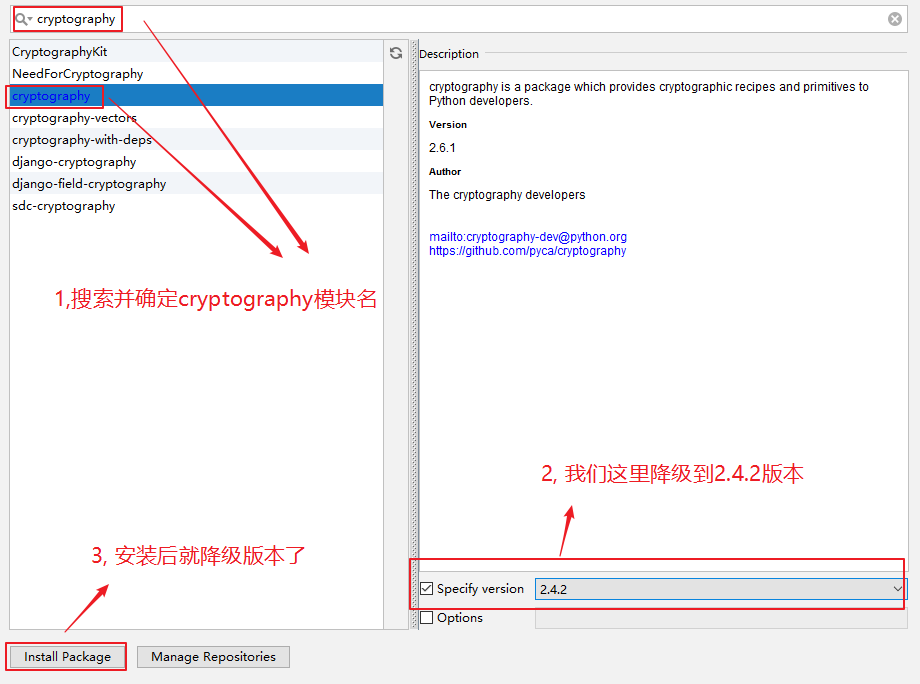
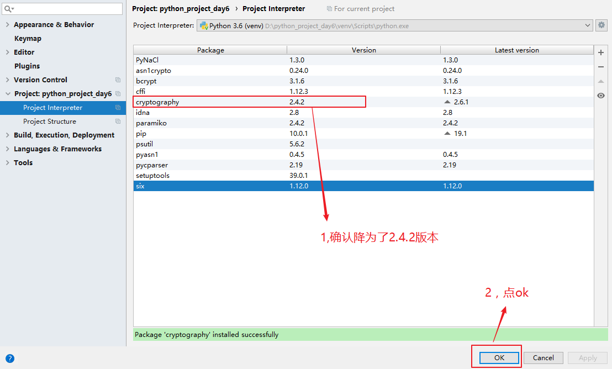

# **学习目标**

- [ ] 掌握re模块的基本使用

- [ ] 能使用pip安装第三方模块

- [ ] 掌握第三方模块psutil基本使用

- [ ] 掌握第三方模块paramiko的基本使用

- [ ] 了解python异常处理的基本方式


# 十七、模块

## 模块的定义

**==模块就是一个.py结尾的python代码文件==**（文件名为hello.py,则模块名为hello), 用于实现一个或多个功能（变量，函数，类等）

**==函数是多行代码的打包(封装), 模块可以看作是类与函数的进一步打包(封装)==**

## 模块的分类

模块分为

1. **标准库**（python自带的模块，可以直接调用）
2. **开源模块**（第三方模块,需要先pip安装,再调用）
3. **自定义模块**（自己定义的模块）

## 模块的存放路径

模块主要存放在/usr/local/lib/python3.6/目录下,还有其它目录下。使用sys.path查看。

```python
# python3.6
>>> import sys
>>> print(sys.path)		# 模块路径列表,第一个值为空代码当前目录
['', '/usr/local/lib/python36.zip', '/usr/local/lib/python3.6', '/usr/local/lib/python3.6/lib-dynload', '/root/.local/lib/python3.6/site-packages', '/usr/local/lib/python3.6/site-packages']
# sys.path和linux上的$PATH很类似，如果两个目录里分别有同名模块，则按顺序来调用目录靠前的。
# sys.path的结果是一个列表，所以你可以使用sys.path.append()或sys.path.insert()增加新的模块目录。
```


**示例: 手动在当前目录下（pycharm当前项目目录）写一个简单模块(名为hello.py）**

**==注意: 模块名不要用纯数字, 如1.py这种==**

**如果你命名为os.py这种就坑了，原因是什么？**

(因为os是一个标准库模块，你自定义的模块会和它冲突)

```python
def funct1():
    print("funct1")
    
def funct2():
    return "funct2"
```

**示例:与上面的hello.py同目录下，再写一个1.py来调用hello.py**

```python
import hello			# 调用同目录的hello模块

hello.funct1()			# 可以调用hello模块里的funct1()函数
print(hello.funct2()) # 调用hello模块里的funct2()函数，因为结果为函数返回值，所以还需要print打印
```


## 模块的基本导入语法

import导入方法相当于是直接解释模块文件

import导入**单模块**

```python
import hello
```

import导入**多模块**

```python
import module1,module2,module3
```

```powershell
import module1
import module2
import module3
```

from导入模块里所有的变量，函数

```python
from hello import *
```

from导入模块文件里的部分函数

```python
from hello import funct1,funct2
```

## 两种模块导入方式的区别

**区别1: import导入模块里的所有函数, 而from可以选择只导入模块里的部分函数**(==为了优化，只导入自己要用的==)


**区别2: 调用import导入模块需要前面接模块名,而from语法不用**

```powershell
import hello
hello.funct1()			# 前面要接模块名

from hello import *
funct1()				# 前面不用模块名了
```

**前面不加模块名会产生一个问题: 如果当前代码文件里的函数名与调用模块的函数的名冲突怎么办呢 ?**

**为了区分本地funct1和导入的hello模块里的funct1，可以导入时做别名**

```
from hello import funct1 as funct1_hello
```


**示例: 利用别名来解决模块与本地函数冲突的问题**

```python
from hello import funct1 as funct1_hello

def funct1():
   print("local funct1")

funct1_hello()		# 用别名来调用hello模块里的funct1
funct1()			# 本地的funct1
```


## 包(拓展)

包(Package)是用来**逻辑上组织多个模块，其实就是一个目录**，目录里必须有一个\_\_init\_\_.py文件（**导入一个包就是执行包下的\_\_init\_\_.py文件**）





## 标准库之os模块

在学此模块前,告诫大家不要去死记硬背,首先能够看懂,然后需要用的时候就查。

**示例: 查看目录与切换目录等**

```powershell
import os

print(os.getcwd())						# 查看当前目录
os.chdir("/tmp")						# 改变当前目录
					
print(os.curdir)						# 打印当前目录.
print(os.pardir)						# 打印上级目录..
os.chdir(os.pardir)						# 切换到上级目录
print(os.listdir("/"))					# 列出目录里的文件,结果是相对路径，并且为list类型
```

**示例: 查看文件状态**

```powershell
import os

print(os.stat("/etc/fstab"))			# 得到文件的状态信息，结果为一个tuple类型
print(os.stat("/etc/fstab")[6])			# 得到状态信息(tuple)的第7个元素,也就是得到大小
print(os.stat("/etc/fstab")[-4])		# 得到状态信息(tuple)的倒数第4个元素,也就是得到大小
print(os.stat("/etc/fstab").st_size)	# 用这个方法也可以得到文件的大小

print(os.path.getsize(__file__))		# 得到文件的大小,__file__是特殊变量，代表程序文件自己
print(os.path.getsize("/etc/fstab"))	# 也可以指定想得到大小的任意文件
```

**示例: 文件路径相关操作**

```python
import os

print(os.path.abspath(__file__))		# 得到文件的绝对路径
print(os.path.dirname("/etc/fstab"))	# 得到文件的绝对路径的目录名，不包括文件
print(os.path.basename("/etc/fstab"))	# 得到文件的文件名，不包括目录
print(os.path.split("/etc/fstab"))		# 把dirname和basename分开，结果为tuple类型
print(os.path.join("/etc","fstab"))		# 把dirname和basename合并
```

**示例: 判断相关操作**

```powershell
import os

print(os.path.isfile("/tmp/1.txt"))		# 判断是否为文件,结果为bool类型
print(os.path.isabs("1.txt"))			# 判断是否为绝对路径,结果为bool类型
print(os.path.exists("/tmp/11.txt"))	# 判断是否存在,结果为bool类型
print(os.path.isdir("/tmp/"))			# 判断是否为目录,结果为bool类型
print(os.path.islink("/etc/rc.local"))	# 判断是否为链接文件,结果为bool类型
```

**示例: 文件改名与删除，目录创建与删除等**

```powershell
import os

os.rename("/tmp/1.txt","/tmp/11.txt")	# 改名
os.remove("/tmp/11.txt")				# 删除

os.mkdir("/tmp/aaa")					# 创建目录
os.rmdir("/tmp/aaa")					# 删除目录　
os.makedirs("/tmp/a/b/c/d")				# 连续创建多级目录
os.removedirs("/tmp/a/b/c/d")			# 从内到外一级一级的删除空目录，目录非空则不删除
```


**os.popen()**和**os.system()**可以直接调用linux里的命令，二者有一点小区别:

```powershell
# 下面这两句执行操作都可以成功
os.popen("touch /tmp/222")
os.system("touch /tmp/333")

print(os.popen("cat /etc/fstab").read())	# 通过read得到命令的内容，可直接打印出内容，也可以赋值给变量
print(os.system("cat /etc/fstab"))	# 除了执行命令外，还会显示返回值(0,非0，类似shell里$?判断用的返回值)


如果执行命令没有结果输出，两个都可以
所以如果是为了得到命令的结果输出，并想对结果赋值进行后续操作的话，就使用os.popen(cmd).read();
如果直接得到命令结果就可以了，那么直接使用os.system(cmd)就OK
```

**问题**: 感觉我就只要会os.popen()和os.system()就够了啊，因为我是搞linux运维的，命令熟悉啊。为啥还去记上面那些方法?

答: os.popen()与os.system()主要用于linux运维，在windows或MAC平台上就不能命令通用了。而os模块的其它方法都是跨平台通用的.


**示例: 判断linux上的文件是否为block类型**

```python
import os

file_path = input("input a file path:")

file_type = os.popen("ls -l {} |cut -c1".format(file_path)).read().strip()

if file_type == "b":
     print("block file")
```


## 标准库之sys模块(拓展)

```python
sys.argv[n]         # sys.argv[0]等同于shell里的$0, sys.argv[1]等同于shell里的$1，以此类推 
```

**示例:**

```python
# vim 1.py

import sys,os

command = " ".join(sys.argv[1:])  	# df -h取出来会变为['df', '-h']，所以需要join成字符串

print(command)

print(os.popen(command).read())		# 这一句加上，就可以直接得到df -h命令的结果

# python3.6 1.py df -h        		# 这样可以把df -h命令取出来（在bash环境这样执行，不要使用pycharm直接执行)
```


## 标准库之random模块(拓展)

```python
import random

print(random.random())  				# 0-1之间的浮点数随机
print(random.uniform(1,3)) 				# 1-3间的浮点数随机

print(random.randint(1,3))  			# 1-3整数随机							(常用)
print(random.randrange(1,3))  			# 1-2整数随机
print(random.randrange(1,9,2))			# 随机1,3,5,7这四个数,后面的2为步长		   (常用)	

print(random.choice("hello,world"))   	# 字符串里随机一位，包含中间的逗号
print(random.sample("hello,world", 3))   # 从前面的字符串中随机取3位,并做成列表

list = [1, 2, 3, 4, 5]
random.shuffle(list)       				# 把上面的列表洗牌，重新随机
print(list)
```

**示例: 随机打印四位小写字母，做一个简单的验证码**

```python
import random
# 方法一:
code = ""
for i in range(4):
     code += random.choice("abcdefghijklmnopqrstuvwxyz")

print(code)

# 方法二:
code = random.sample("abcdefghijklmnopqrstuvwxyz", 4)

code2=""
for i in code:
    code2+=i
print(code2)

# 方法三:
code = ""
for i in range(4):
    for j in chr(random.randint(97,122)):		# chr()在变量的数据类型转换的表格里有写，这里97-122使用chr()转换后对应的就是a-z
        code += j
print(code)
```

**示例: 验证码要求混合大写字母,小写字母,数字**

```python
import random

code = ""
for i in range(4):
    a = random.randint(1,3)
    if a == 1:
        code += chr(random.randrange(65,91))		# 大写的A-Z随机
    elif a == 2:
        code += chr(random.randrange(97,123))		# 小写的a-z随机
    else:
        code += chr(random.randrange(48,58))		# 0-9随机

print(code)
```


## 标准库之re模块(拓展)

### 正则表达式简介

re是regex的缩写,也就是正则表达式

~~~powershell
# grep ^daemon /etc/passwd
daemon:x:2:2:daemon:/sbin:/sbin/nologin

# awk '$0~"^daemon" {print $0}' /etc/passwd
daemon:x:2:2:daemon:/sbin:/sbin/nologin

# sed -n '/^daemon/p' /etc/passwd
daemon:x:2:2:daemon:/sbin:/sbin/nologin
~~~

| 表达式或符号 | 描述                                      |
| ------------ | ----------------------------------------- |
| ^            | 开头                                      |
| $            | 结尾                                      |
| [abc]        | 代表一个字符（a,b,c任取其一）             |
| [^abc]       | 代表一个字符（但不能为a,b,c其一)          |
| [0-9]        | 代表一个字符（0-9任取其一) "[[:digit:]]"  |
| [a-z]        | 代表一个字符（a-z任取其一) "[[:lower:]]"  |
| [A-Z]        | 代表一个字符（A-Z任取其一)  "[[:upper:]]" |
| .            | 一个任意字符                              |
| *            | 0个或多个前字符                           |
| .*           | 代表任意字符                              |
| +            | 1个或多个前字符                           |
| ?            | 代表0个或1个前字符                        |
| \d           | 匹配数字0-9                               |
| \D           | 匹配非数字                                |
| \w           | 匹配[A-Za-z0-9]                           |
| \W           | 匹配非[A-Za-z0-9]                         |
| \s           | 匹配空格,制表符                           |
| \S           | 匹配非空格，非制表符                      |
| {n}          | 匹配n次前字符                             |
| {n,m}        | 匹配n到m次前字符                          |


### re模块常用操作

| 模块+函数（方法） | 描述                                           |
| ----------------- | ---------------------------------------------- |
| re.match()        | 开头匹配,类似shell里的^符号                    |
| re.search()       | 整行匹配，但只匹配第一个                       |
| re.findall()      | 全匹配并把所有匹配的字符串做成列表             |
| re.split()        | 以匹配的字符串做分隔符，并将分隔的转为list类型 |
| re.sub()          | 匹配并替换                                     |

**示例: re.match**

```python
import re

print(re.match("aaa","sdfaaasd"))  	 	# 结果为none，表示匹配未成功
print(re.match("aaa","aaasd"))    	 	# 有结果输出，表示匹配成功

abc = re.match("aaa\d+","aaa234324bbbbccc")
print(abc.group())  					# 结果为aaa234324，表示打印出匹配那部分字符串
```

**示例: re.search**				

```python
import re

print(re.search("aaa","sdfaaasdaaawwsdf"))  # 有结果输出，表示匹配成功;re.search就是全匹配，而不是开头(但只返回一个匹配的结果)；想开头匹配的话可以使用^aaa
print(re.search("aaa\d+","aaa111222bbbbcccaaaa333444").group())  # 验证,确实只返回一个匹配的结果,并使用group方法将其匹配结果打印出来
```

**示例: re.findall**

```python
import re

print(re.findall("aaa\d+","aaa111222bbbbcccaaaa333444")) # 没有group()方法了,结果为['aaa111222', 'aaa333444']
print(re.findall("aaa\d+|ddd[0-9]+","aaa111222bbbbddd333444"))  # 结果为['aaa111222', 'ddd333444']
```

**小结:** re.search()与re.findall()

- 都不是开头匹配
- re.search()只匹配一行里第一个,而re.findall()会把一行内匹配的多个都匹配出来
- re.search()可以通过group()打印匹配的结果, re.findall()没有group()方法，直接把匹配的所有结果以列表的形式展示


**运维的文本处理操作一般就只有三种:** 

1, 行匹配(查找行)

* 按行号来
* 按正则匹配

2, 截取

3, 统计

4, 替换

打印`/etc/passwd`文件里的以daemon开头的行

~~~python
import re

f = open("/etc/passwd", mode="r")

for line in f:
#    if line.startswith("daemon"):
    if re.match("daemon", line):
        print(line.strip())

f.close()
~~~

统计`/etc/passwd`文件里的有root的行

~~~powershell
import re

f = open("/etc/passwd", mode="r")

for line in f:
    if re.findall("root", line):
        print(line.strip())

f.close()
~~~

统计`/etc/passwd`文件里的root关键字一共出现多少次

~~~powershell
import re

f = open("/etc/passwd", mode="r")

sum=0
for line in f:
    sum += len(re.findall("root", line))

print(sum)

f.close()
~~~


**示例: re.split**

```python
import re

print(re.split(":","root:x:0:0:root:/root:/bin/bash"))	  # 以:分隔后面字符串,并转为列表
```


**练习:打印/etc/passwd文件的最后一列**

```python
import re

f = open("/etc/passwd", "r")

for line in f:
    abc = re.split(":",line)
    print(abc[len(abc)-1].strip())			# len()算长度，通过长度-1得到最后一列的下标
#    print(line.strip().split(":")[-1])		# 用字符串的split方法切分，再通过下标-1得到结果
#    print(re.split(":",line.strip())[-1])	

f.close()
```

**练习:** 统计`/etc/passwd`文件里的root关键字一共出现多少次(换成split的写法)

~~~powershell
import re


f = open("/etc/passwd", mode="r")

sum=0
for line in f:
    if re.findall("root", line):
        line_list1 = re.split("root", line)
        sum = sum + len(line_list1) -1

print(sum)

f.close()
~~~

~~~powershell
import re

def count_file_words(keyword, filepath):
    f = open(filepath, mode="r")

    sum=0
    for line in f:
        if re.findall(keyword, line):
            line_list1 = re.split(keyword, line)
            sum = sum + len(line_list1) -1
    print(sum)
	f.close()
	
count_file_words("root", "/etc/passwd")
~~~


**示例: re.sub**

```python
import re

print(re.sub(":","-","root:x:0:0:root:/root:/bin/bash"))			# 全替换:成-
print(re.sub(":","-","root:x:0:0:root:/root:/bin/bash",count=3))	# 只替换3次
```


**练习:使用input输入一个字符串，判断是否为强密码: 长度至少8位,包含大写字母,小写字母,数字和下划线这四类字符则为强密码**

```python
import re

password = input("请输入密码:")

def password_check(password):
    if len(password) < 8 :
        print("密码长度不够8位")
        exit()
    else:
        if ( re.search("[A-Z]",password) and re.search("[a-z]",password)
                and re.search("\d",password) and re.search("_",password) ):
            print("强密码")
        else:
            print("弱密码")

password_check(password)
```


**练习: 对输入的字符串进行关键字屏蔽，如"笨蛋",打印出来后变成两个星号来替代(具体关键字自由发挥)**

```powershell
 

badword_replace(input_str)
```

**课后练习:**

对一个文件进行关键字屏蔽，并做成函数(封装起来)

~~~powershell

~~~


## 第三方模块之psutil

psutil是一个跨平台库，能够轻松实现获取系统运行的进程和系统利用率（包括CPU、内存、磁盘、网络等）信息。它主要应用于系统监控，分析和限制系统资源及进程的管理。

### psutil模块安装

**安装方法1:**

因为是第三方模块,所以需要先使用pip命令安装后再能使用

~~~shell
# pip3.6 install psutil				# 安装需要能上公网网络

# pip3.6 list |grep psutil
psutil       5.4.8  
~~~

这样安装后，直接`# python`进入交互模式可以`import psutil`，但pycharm却导入不了（重启pycharm也不行).，因为pycharm使用的是python虚拟环境，所以并没有修改过系统的解释器,按下面的解决方法修改一下即可。

**解决方法:**

pycharm里点File-->Settings-->再按如下图所示操作--> ok --> ok







**安装方法2:**

**在pycharm图形界面直接操作安装, pycharm会调用pip命令为你安装**

pycharm里点File-->Settings-->再按如下图所示操作










### psutil模块常用操作

**linux下top,vmstat,sar,free,mpstat等命令可以查，而python程序员可以不用关心linux的命令直接使用psutil模块就能得到相应的信息**

~~~python
import psutil
# cpu
print(psutil.cpu_times())			# 查看cpu状态,类型为tuple
print(psutil.cpu_count())			# 查看cpu核数,类型为int

# memory(内存)
print(psutil.virtual_memory())		# 查看内存状态,类型为tuple
print(psutil.swap_memory())			# 查看swap状态,类型为tuple

# partition(分区)
print(psutil.disk_partitions())		# 查看所有分区的信息,类型为list,内部为tuple
print(psutil.disk_usage("/"))		# 查看/分区的信息，类型为tuple
print(psutil.disk_usage("/boot"))	# 查看/boot分区的信息，类型为tuple

# io(磁盘读写)
print(psutil.disk_io_counters())	# 查看所有的io信息（read,write等)，类型为tuple
print(psutil.disk_io_counters(perdisk=True)) # 查看每一个分区的io信息，类型为dict,内部为tuple

# network(网络)
print(psutil.net_io_counters())		# 查看所有网卡的总信息(发包，收包等)，类型为tuple
print(psutil.net_io_counters(pernic=True))	# 查看每一个网卡的信息，类型为dict,内部为tuple

# process(进程)
print(psutil.pids())				# 查看系统上所有进程pid，类型为list
print(psutil.pid_exists(1))			# 判断pid是否存在，类型为bool
print(psutil.Process(1))			# 查看进程的相关信息,类型为tuple

# user(用户)
print(psutil.users())				# 查看当前登录用户相关信息，类型为list
~~~


**示例:监控/分区的磁盘使用率,超过90%(阈值，也就是临界值)就发给微信好友**  

~~~shell
# pip3.6 install itchat	   # 先安装itchat,或者用pycharm图形安装（可以连接微信的一个模块)
~~~

~~~python
import psutil,itchat

itchat.auto_login(hotReload=True)	# 第一次登陆会扫描二维码登陆(hotreload=True会缓存，不用每次都登录)
user_info = itchat.search_friends("Candy")	# Candy为你的好友名，这是一个list类型,里面是dict
user_id = user_info[0]['UserName']	# 通过上面获取的信息得到Candy的好友id

# 下面这句是算出磁盘使用率并赋值给root_disk_use_percent变量
root_disk_use_percent = psutil.disk_usage("/")[1]/psutil.disk_usage("/")[0]

if root_disk_use_percent > 0.9:			# 如果/分区没有使用超过90%，为了方便测试可以把0.9改小
    itchat.send("/ is overload", toUserName=user_id)	# 发送信息给好友id
~~~


## 第三方模块之paramiko

paramiko模块支持以加密和认证的方式连接远程服务器。可以实现远程文件的上传,下载或通过**==ssh==**远程执行命令。

**PS:** 后面课程学习的配置自动化工具ansible底层就是使用paramiko模块。

### paramiko模块安装

python使用paramiko模块来实现远程ssh操作(或者使用pycharm图形安装方式)

~~~shell
# pip3.6 install paramiko
~~~


### 远程上传下载文件

**示例: paramiko模块实现文件的上传下载(要传密码的做法)**

~~~python
import paramiko								# 导入import模块

trans = paramiko.Transport(("10.1.1.12",22))	# 产生连接10.1.1.12的22的传输,赋值给trans

trans.connect(username="root",password="123456") # 指定连接用户名与密码

sftp = paramiko.SFTPClient.from_transport(trans) # 指定为sftp传输方式

sftp.get("/etc/fstab","/tmp/fstab")	    # 把对方机器的/etc/fstab下载到本地为/tmp/fstab(注意不能只写/tmp,必须加文件名)
sftp.put("/etc/inittab","/tmp/inittab") # 本地的上传,也一样要命令

trans.close()
~~~

**问题:**

因为paramiko当前版本为2.4.2，而它的依赖包Cryptography版本过新,造成兼容问题。执行代码时会有如下信息:




**解决方法:**

pycharm里点File-->Settings-->再按如下图所示操作








**示例:paramiko模块实现文件的上传下载(免密登录)**

**先提前做好免密登录**

~~~powershell
# ssh-keygen				# 三次回车在本机产生空密码密钥对
# ssh-copy-id -i 10.1.1.12   # 将公钥传给对方目标机器

# ssh 10.1.1.12				# 验证是否空密码登录OK
~~~


~~~python
import paramiko						# 导入paramiko模块

trans = paramiko.Transport(("10.1.1.12",22))	# 产生连接10.1.1.12的22的传输,赋值给trans

private_key = paramiko.RSAKey.from_private_key_file("/root/.ssh/id_rsa") # 指定本机私钥路径

trans.connect(username="root",pkey=private_key)		# 提前使用ssh-keygen做好免密登录

sftp = paramiko.SFTPClient.from_transport(trans)

sftp.get("/etc/fstab","/tmp/fstab2")
sftp.put("/etc/inittab","/tmp/inittab2") 

trans.close()
~~~


### 远程命令操作

**示例: 使用paramiko传密码远程操作**

**PS:** 前面做过密码登录，测试先可以先删除密钥, 使其登录需要密码(自行操作)

~~~python
import paramiko

ssh = paramiko.SSHClient()			# 创建一个客户端连接实例
ssh.set_missing_host_key_policy(paramiko.AutoAddPolicy)  # 加了这一句,如果第一次ssh连接要你输入yes,也不用输入了
ssh.connect(hostname="10.1.1.12", port=22, username="root", password="123456")  # 指定连接的ip,port,username,password

stdin,stdout,stderr = ssh.exec_command("touch /tmp/123")   # 执行一个命令,有标准输入,输出和错误输出


cor_res = stdout.read()		# 标准输出赋值
err_res = stderr.read()		# 错误输出赋值

print(cor_res.decode())	# 网络传输是二进制需要decode(我们没有讨论socket编程，所以你就直接这样做)
print(err_res.decode())	# 不管正确的还是错误的输出,都打印出来

ssh.close()				# 关闭此连接实例
~~~


**示例: 通过函数封装paramiko的远程操作**

~~~python
import paramiko

def paramiko_ssh(hostname, password, command, port=22, username="root"):
    ssh = paramiko.SSHClient()
    ssh.set_missing_host_key_policy(paramiko.AutoAddPolicy)
    ssh.connect(hostname=hostname, password=password, port=port, username=username)
    stdin, stdout, stderr = ssh.exec_command(command)
    print(stdout.read().decode())
    print(stderr.read().decode())
    ssh.close()


paramiko_ssh("10.1.1.12", "123456", "df -h")
~~~


**示例: 使用paramiko空密码密钥远程登录操作**

~~~shell
# ssh-keygen
# ssh-copy-id -i 10.1.1.12
~~~

~~~python
import paramiko

ssh = paramiko.SSHClient()			# 创建一个客户端连接实例

private_key = paramiko.RSAKey.from_private_key_file("/root/.ssh/id_rsa")  # 指定本机私钥路径

ssh.set_missing_host_key_policy(paramiko.AutoAddPolicy)  # 加了这一句,如果第一次ssh连接要你输入yes,也不用输入了

ssh.connect(hostname="10.1.1.12",port=22,username="root",pkey=private_key)	# 把password=123456换成pkey=private_key

stdin,stdout,stderr = ssh.exec_command("touch /tmp/321")

cor_res = stdout.read()
err_res = stderr.read()

print(cor_res.decode())
print(err_res.decode())

ssh.close()
~~~

**示例: 将上例用函数封装**

~~~powershell
import paramiko

def paramiko_ssh(hostname, command, port=22, username="root"):
    ssh = paramiko.SSHClient()
    private_key = paramiko.RSAKey.from_private_key_file("/root/.ssh/id_rsa")
    ssh.set_missing_host_key_policy(paramiko.AutoAddPolicy)
    ssh.connect(hostname=hostname, port=port, username=username, pkey=private_key)
    stdin, stdout, stderr = ssh.exec_command(command)
    print(stdout.read().decode())
    print(stderr.read().decode())
    ssh.close()


paramiko_ssh("10.1.1.12",  "df -h")
~~~


### **综合项目**

**环境前提:**

* 本机要准备一个文件,记录你所管理的所有机器的IP与端口,如下面这种

~~~powershell
# cat /tmp/1.txt
10.1.1.11:22
10.1.1.12:3333
10.1.1.13:22
10.1.1.14:2222
10.1.1.15:22
~~~

* 本机要产生空密码密钥对，并将公钥都拷贝到所管理的所有机器上，实现本机连接远程机器全免密

~~~powershell
# ssh-keygen				 # 三次回车在本机产生空密码密钥对
# ssh-copy-id -i 10.1.1.11
# ssh-copy-id -i 10.1.1.12
# ssh-copy-id -i 10.1.1.13
# ssh-copy-id -i 10.1.1.14
# ssh-copy-id -i 10.1.1.15
~~~

* 在本机项目目录下创建一个myssh.py文件，自定义做成模块(我这里模块名为myssh)

~~~powershell
import paramiko

def remote_exec_command(ip, command, port):
    ssh = paramiko.SSHClient()
    ssh.set_missing_host_key_policy(paramiko.AutoAddPolicy)
    private_key = paramiko.RSAKey.from_private_key_file("/root/.ssh/id_rsa")
    ssh.connect(hostname=ip, port=port, username="root", pkey=private_key)

    stdin, stdout, stderr = ssh.exec_command(command)

    print(stdout.read().decode())
    print(stderr.read().decode())

    ssh.close()


def read_ip_port(filepath):
    cmd = input("输入你要在所有管理机上执行的命令:")
    
    f = open(filepath, mode="r")
    for line in f:
        read_ip = line.strip().split(":")[0]	# 将文件每行以":"为分隔符的前面部分截取为ip
        read_port = line.strip().split(":")[1]  # 将文件每行以":"为分隔符的后面部分截取为port
        remote_exec_command(read_ip, cmd, read_port) # 调用上面的函数并传参

    f.close()
~~~

**使用方法:**

在项目目录下创建另一个文件,名字自定义,调用上面的自定义模块

~~~powershell
import myssh

myssh.read_ip_port("/tmp/1.txt")
~~~


## 第三模块之pymysql(拓展)

~~~python
# yum install mariadb* 
# systemctl restart mariadb

# pip3.6 install pymysql
~~~

**示例:** 

~~~python
import pymysql

db = pymysql.connect(host="localhost",user="root",password="",port=3306)	# 指定数据的连接host,user,password,port,schema

cursor = db.cursor()				# 创建游标,就类似操作的光标

cursor.execute("show databases;")

print(cursor.fetchone())    	# 显示结果的一行
print(cursor.fetchmany(2))    	# 显示结果的N行(接着前面的显示2行)

print(cursor.fetchall())    	# 显示结果的所有行(接着前面的显示剩余的所有行)

cursor.close()
db.close()
~~~

**示例:**

~~~python
import pymysql

db = pymysql.connect(host="localhost",user="root",password="",port=3306,db="mysql")  # 多指定了db="mysql"，表示登录后会直接use mysql

cursor = db.cursor()
# cursor.execute("use mysql;")	　# 前面连接时指定了连接的库，这里不用再执行use mysql;
cursor.execute("show tables;")

print(cursor.fetchall())

cursor.close()
db.close()
~~~

**示例: 操作数据库(建库，建表等)**

~~~python
import pymysql

db = pymysql.connect(host="localhost",user="root",password="",port=3306)

cursor = db.cursor()

cursor.execute("create database aaa;")
cursor.execute("use aaa;")
cursor.execute("create table emp(ename varchar(20),sex char(1),sal int)")
cursor.execute("desc emp")

print(cursor.fetchall())

cursor.close()
db.close()
~~~

**示例: 远程数据库dba先建一个库，再授权一个普通用户给远程开发的连接**

~~~shell
# 比如在10.1.1.12(测试服务器)上安装数据库，然后对10.1.1.11(开发人员)授权
# mysql
MariaDB [mysql]> create database aaadb;

MariaDB [mysql]> grant all on aaadb.* to 'aaa'@'10.1.1.11' identified by '123';

MariaDB [mysql]> flush privileges;
~~~

~~~python
# 下面开发代码是在10.1.1.11(开发人员)上执行的
import pymysql

db = pymysql.connect(host="10.1.1.12",user="aaa",password="123",port=3306,db="aaadb")

cursor = db.cursor()

cursor.execute("create table hosts(ip varchar(15),password varchar(10),hostgroup tinyint)")
# 插入数据方法一
cursor.execute("insert into hosts(ip,password,hostgroup) values('10.1.1.22','123456',1)")

# 插入数据方法二
insertsql = '''
    insert into hosts
    (ip,password,hostgroup)
    values
    ('10.1.1.23','123456',1),
    ('10.1.1.24','123456',1),
    ('10.1.1.25','123',2),
    ('10.1.1.26','1234',2),
    ('10.1.1.27','12345',2);
'''
cursor.execute(insertsql)

# 插入数据方法三
data = [
    ('10.1.1.28','12345',2),
    ('10.1.1.29','12345',3),
    ('10.1.1.30','12345',3),
    ('10.1.1.31','12345',3),
    ('10.1.1.32','12345',3),
    ('10.1.1.33','12345',3),
    ('10.1.1.34','12345',3),
]
cursor.executemany("insert into hosts(ip,password,hostgroup) values(%s,%s,%s);",data)

db.commit()					# 这里做完DML需要commit提交，否则数据库没有实际插入数据

cursor.execute("select * from hosts;")

print(cursor.fetchall())	# 上面不提交，这里也可以看得到

cursor.close()
db.close()
~~~


## 标准库之时间相关模块(拓展)

**python中有三种时间类型**

| 时间类型                             | 描述                                  |
| ------------------------------------ | ------------------------------------- |
| struct_time(**==时间元组==**)        | 记录时间的年,月,日,时,分等            |
| timestamp**==时间戳==**（epoch时间） | 记录离1970-01-01 00:00:00有多少秒     |
| **==格式化的时间字符串==**           | 如2018-01-01 12:00:00(格式可以自定义) |

**三种类型之间的转换图**:


**示例: 三种基本格式的打印**

~~~python
import time

time.sleep(1)					# 延迟1秒

print(time.localtime())		 	# 打印当前时间的年,月,日,时,分等等，本地时区（时间元组）
print(time.gmtime()) 			# 与localtime类似，但是为格林威治时间（时间元组）

print(time.strftime("%Y-%m-%d %H:%M:%S"))  # 打印当前时间（格式化字符串）
print(time.strftime("%F %T"))			   # 打印当前时间（格式化字符串）
print(time.asctime())					   # 打印当前时间（常规字符串格式）

print(time.time())  			# 打印当前时间，离1970年1月1号0点的秒数(时间戳)
~~~

**示例: 三种格式间的转换**

~~~python
import time

abc = time.localtime()							# 当前时间（本地时区）的时间元组赋值给abc
print(time.mktime(abc))  						# 时间元组转时间戳
print(time.strftime("%Y-%m-%d %H:%M:%S",abc)) 	# 时间元组转格式化字符串（自定义格式)
print(time.asctime(abc)) 						# 时间元组转格式化字符串(常规格式)

print(time.strptime("2018-01-01 10:30:25","%Y-%m-%d %H:%M:%S")) # 格式化字符串转时间元组

print(time.localtime(86400)) 	# 打印离1970年86400秒的时间，本地时区(时间戳转时间元组)
print(time.gmtime(86400)) 		# 打印离1970年86400秒的时间，格林威治时间（时间戳转时间元组）

print(time.ctime(335235))		# 时间戳转格式化字符串
~~~

**示例: datetime,calendar模块**

~~~python
import datetime,calendar

print(datetime.datetime.now())
print(datetime.datetime.now()+datetime.timedelta(+3)) 			# 三天后
# shell里也有类似的用法，如: date '+%F %T' -d "+3 days"
print(datetime.datetime.now()+datetime.timedelta(days=-3)) 		# 三天前
print(datetime.datetime.now()+datetime.timedelta(hours=5)) 		# 五小时后
print(datetime.datetime.now()+datetime.timedelta(minutes=-10)) 	# 十分钟前
print(datetime.datetime.now()+datetime.timedelta(weeks=1)) 		# 一星期后

print(calendar.calendar(2018))
print(calendar.isleap(2016))
~~~

**示例: 打印昨天的时间(格式为YYYY-mm-dd HH:MM:SS)**

~~~powershell
import datetime,time

# 字符串来计算时间
print(str(datetime.datetime.now()+datetime.timedelta(days=-1)).split(".")[0])

# 转成时间戳来计算时间
print(time.strftime("%F %T",time.localtime(time.time()-86400)))
~~~

**练习: 打印一年后的当前时间**

~~~python
import time

# 时间元组转列表再计算时间
aaa = list(time.localtime())
aaa[0] += 1

print(time.strftime("%F %T", tuple(aaa)))
~~~


**示例:写一个2019-01-01的倒计时**

~~~python
import time

goal_seconds=int(time.mktime(time.strptime("2019-01-01 00:00:00","%Y-%m-%d %H:%M:%S")))

while True:
     s = int(goal_seconds-int(time.time()))
     if s == 0:
         break
     else:
        print("离2019年还有{}天{}时{}分{}秒".format(int(s/86400),int(s%86400/3600),int(s%3600/60),int(s%60)))
        time.sleep(1)

print("2019年到了")
~~~

**示例: 每隔1秒循环打印2018年的日期（从2018-01-01至2018-12-31)**

~~~python
import time,datetime

start_time = datetime.datetime.strptime("2018-01-01","%Y-%m-%d")
delta = datetime.timedelta(days=1)

while True:
    print(str(start_time).split()[0])
    start_time = start_time+delta
    time.sleep(1)
~~~

**示例: 简单的定时程序**

~~~python
import time

goal_time = input("输入定时的时间(年-月-日 时:分:秒):")

while True:
    now = time.strftime("%Y-%m-%d %H:%M:%S")
    print(now)
    time.sleep(1)
    if now == goal_time:
        print("时间到了!")
        break
~~~


# 十八、异常处理(了解)

异常处理:
Python程序运行语法出错会有异常抛出
不处理异常会导致程序终止

| 异常种类          | 描述                   |
| ----------------- | ---------------------- |
| IndentationError  | 缩进对齐代码块出现问题 |
| NameError         | 自定义标识符找不到     |
| IndexError        | 下标错误               |
| KeyError          | 键名出错               |
| AssertionError    | 断言异常               |
| SyntaxError       | 语法错误               |
| AttributeError    | 找不到属性             |
| TypeError         | 类型错误               |
| KeyboardInterrupt | ctrl + c 被按下        |
| ImportError       | 导入模块出错           |
| ......            |                        |

**示例: 异常处理的简单应用**

~~~powershell
abc = input("输入一个数字:")

# if not abc.isdigit():
#     print("你到底知不知道什么是数字?")
#     exit()
# else:
#     abc = int(abc)

try:
    abc = int(abc)
    print(abc)
except ValueError:
    print("你到底知不知道什么是数字?")
~~~

**try语句**

1. 首先,执行try子句（在关键字try和关键字except之间的语句）。
2. 如果没有异常发生，忽略except子句，try子句执行后结束。
3. 如果在执行try子句的过程中发生了异常，那么try子句余下的部分将被忽略。
4. 如果异常的类型和 except 之后的名称相符，那么对应的except子句将被执行。最后执行 try 语句之后的代码。
5. 如果一个异常没有与任何的except匹配，那么这个异常将会报错并终止程序。


**示例:**

~~~python
list1 = [1,2,3]

try:
    print(list1[3])			# 执行这一句，正常就直接执行，不用管后面的错误；如果不正常，出现了异常，则要继续往下看
except TypeError:			# 捕捉异常,如果是TypeError错误，则执行print("error1")；如果不是，继续往下看
    print("error1")
except IndexError as err:	# 捕捉异常,如果是IndexError错误，则执行print("error2:",err)
    print("error2:",err)

print("haha")				# 异常都没有被捕捉到，就会报异常，并终止程序运行；如果捕捉到，会报你自定义的错误，并继续可以执行下面的代码
~~~

**示例:**

~~~python
list1 = [1,2,3]

try:
    print(list1[3])			# 这里两句，从上往下执行，只要发现错误就不继续往下try了，而是直接执行后面的except语句
    print(list1[0])
except TypeError as err:
    print("error1",err)
except IndexError as err:
    print("error2:",err)
~~~

**示例:**

~~~python
list1 = [1,2,3]

try:
    print(list1[3])			# 这是一个IndexError
except TypeError as err:	# 这里没有捕捉对错误类型
    print("error1",err)
except SyntaxError as err:	# 这里没有捕捉对错误类型
    print("error2:",err)
except Exception as err:	# Exception代表所有错误异常
    print("error3",err)
~~~

**示例:**

~~~python
list1 = [1,2,3]

try:
    print(list1[3])		

except TypeError as err:
    print("error1",err)
except SyntaxError as err:
    print("error2:",err)
except Exception as err:
    print("error3",err)
else:						# 没有异常，会执行；有异常被捕捉到不会执行；有异常没被捕捉到也不会执行
    print("everything is ok,do it!")
finally:					# 没有异常,有异常被捕捉到，有异常没有被捕捉到,finally里的代码都会执行
    print("no matter what,do it!")	

print("haha")

~~~


**示例: 自定义异常(学了面向对象编程后再来理解)**

~~~python
class Daniel_define_exception(Exception):	# 如果官方的异常类型你还是觉得不够用，还可以自定义异常类型。我这里就自定义了一个异常Daniel_define_exception
    def __init__(self,error_msg):
        self.error_msg = error_msg

class Daniel_define_exception(Exception):
    def __init__(self, error_msg):
        self.error_msg = error_msg

num = int(input("input a num bigger than 10:"))

if num < 11:
    try:
        raise Daniel_define_exception("bigger than 10,you idiot!!")
    except Daniel_define_exception as error:
        print(error)
~~~


# 课后练习

**练习:**  **本机(管理机)准备一个文件,记录你所管理的所有机器的IP与端口,如下面这种**

```powershell
# cat /tmp/1.txt
10.1.1.11:22
10.1.1.12:3333
10.1.1.13:22
10.1.1.14:2222
10.1.1.15:22
```

**要求: 写一个模块(包含2个函数),1个函数如下,另一个函数要求读取`/tmp/1.txt`文件的内容并传参给第1个函数**

```powershell
def ssh(ip, port=22):
    print("ssh {} -p {}".format(ip, port))
```

**写好上述模块后, 再写一个文件来调用上面的模块, 请写出调用的写法**

```powershell

```


**示例: 递归查找指定目录的空文件**

```powershell
shell里一条find命令搞定
find $dir -size 0 -exec rm -rf {} \;
```

```python
# python需要用到函数递归(也就是函数里再调用自己的嵌套函数);对于新手来说非常难理解，先学会看懂就好
import os

dir = input("input a directory: ")

def find_empty_file(dirname):
    file = os.listdir(dirname)
    for basename in file:
        absname = os.path.join(dirname, basename)
        if os.path.getsize(absname) == 0:
            os.remove(absname)
            print("{} is a empty file, delete it".format(absname))
        elif os.path.isdir(absname):
            find_empty_file(absname)


find_empty_file(dir)
```

**练习: 递归查找指定目录的死链接**(**是链接文件但同时不存在的就是死链接文件**)，按上例替代一下条件即可

```python

```

**练习: 递归查找指定目录的特定类型文件（如.avi,.mp4)**，按上例替代一下条件即可

```python

```

