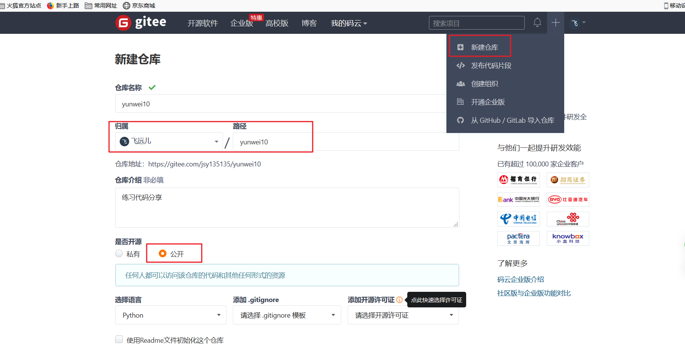
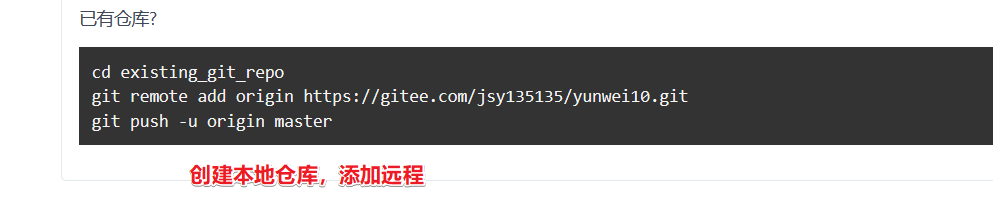

# windows下通过git-bash进行git版本控制

## 1、git安装注意


## 2、创建远处仓库

github,gitlab,

国内gitee



## 3、本地仓库关联上传

**①初始化本地仓库**

```powershell
# 跳入项目目录
git init
# 查看执行之后 生成.git文件夹
# 添加文件 提交到本地仓库
git add ./*
git commit -m "初始化项目"
```

**②本地关联远程仓库**

根据注册的地址，实际操作



## 4、克隆和更新测试

```powershell
# 完整克隆
git clone https://gitee.com/jsy135135/yunwei10.git

# 更新远程到本地仓库
git pull 
```

