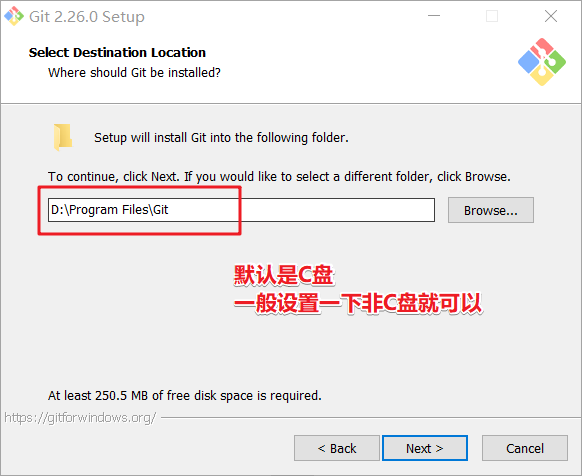
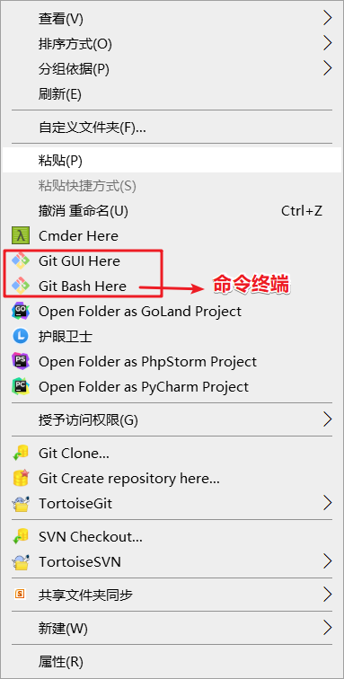
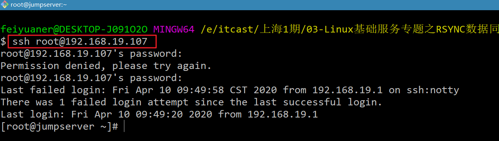
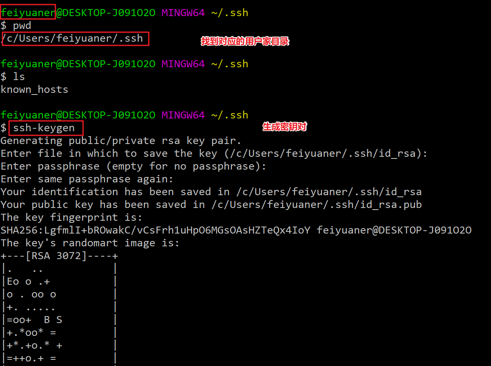
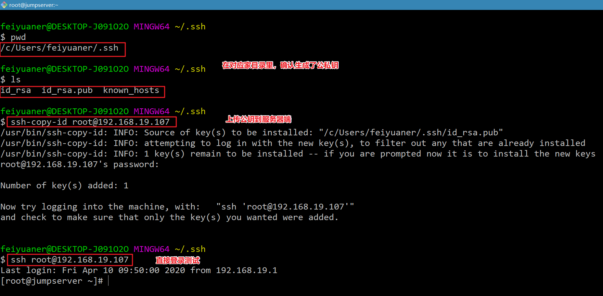

# windows如何使用ssh客户端工具
# 1、常见ssh客户端

基于ssh协议
## 1、第三方厂商开发
mobaxterm、xshell、SecureCRT、finalshell、putty(很小)

## 2、windows默认版本

默认window之前版本没有openssh,新版系统  右键徽标=>运行=>cmd
 在cmd中使用ssh  

## 3、其他一些命令终端

有一些软件带了ssh  git-bash  cmder

免密登录

# 2、gitbash

## 1、安装

安装过程和安装其他软件基本无异。需要注意一下软件安装的位置，其他默认下一步next

## 2、使用

安装好软件之后，鼠标右键会出现以下菜单

## 3、windows连接linux免密登录

**①生成密钥对**

**②添加公钥到服务端**

