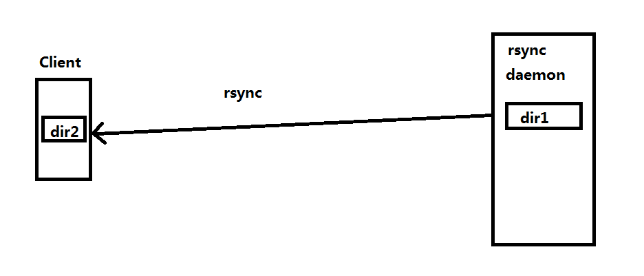

# Linux系统服务-RSYNC

# 一、rsync介绍

rsync 远程同步：remote  synchronous

- rsync的特点
  - 可以镜像保存整个目录树和文件系统
  - 可以==保留原有的权限==(permission,mode)，owner,group,时间(修改时间,modify time)，软硬链接，文件acl,文件属性(attributes)信息等
  - 传输==效率高==，使用同步算法，==只比较变化的==
  - 支持匿名传输，方便网站镜像；也可以做验证，加强安全
  - rsync基于==sshd服务==

# 二、rsync用法

## 2.1 把本地主机文件或目录同步到远程主机

~~~powershell
[root@dnsserver ~]# rsync -av /root/1.txt 192.168.216.178:/home
The authenticity of host '192.168.216.178 (192.168.216.178)' can't be established.
RSA key fingerprint is 13:18:e5:33:0f:9a:50:ef:d5:99:5d:5c:27:a8:01:85.
Are you sure you want to continue connecting (yes/no)? yes
Warning: Permanently added '192.168.216.178' (RSA) to the list of known hosts.
root@192.168.216.178's password:
sending incremental file list
1.txt

sent 89 bytes  received 31 bytes  48.00 bytes/sec
total size is 16  speedup is 0.13

/root/1.txt 是本地主机文件
192.168.216.178:/home 是远程主机目录
~~~

## 2.2 把远程主机文件或目录同到本地主机

~~~powershell
[root@client ~]# rsync -av 192.168.216.179:/root/1.txt /tmp
root@192.168.216.179's password:
receiving incremental file list
1.txt

sent 30 bytes  received 94 bytes  35.43 bytes/sec
total size is 16  speedup is 0.13

192.168.216.179：/root/1.txt 远程主机文件
/tmp是本地主机的目录
~~~

## 2.3 把rsync以服务形式启动同步文件或目录

~~~powershell
rsync 服务器端

准备实验目录及文件
[root@dnsserver ~]# mkdir /dir1
[root@dnsserver ~]# touch /dir1/1.txt
[root@dnsserver ~]# touch /dir1/2.txt
[root@dnsserver ~]# touch /dir1/3.txt

rsync以守护进程方式启动
[root@dnsserver ~]# rsync --daemon
Failed to parse config file: /etc/rsyncd.conf
[root@dnsserver ~]# touch /etc/rsyncd.conf
[root@dnsserver ~]# rsync --daemon
[root@dnsserver ~]# ss -anput | grep rsync
tcp    LISTEN     0      5                     :::873                  :::*      users:(("rsync",5453,5))
tcp    LISTEN     0      5                      *:873                   *:*      users:(("rsync",5453,4))

修改配置文件以方便共享

[root@dnsserver ~]# cat /etc/rsyncd.conf
[sharedir1]
        path = /dir1

Client客户端
服务器端共享后，查看是否有共享目录
[root@client ~]# rsync -a 192.168.216.179::
sharedir1

同步目录
[root@client ~]# rsync -av 192.168.216.179::sharedir1 /dir2
receiving incremental file list
./
1.txt
2.txt
3.txt

sent 91 bytes  received 215 bytes  612.00 bytes/sec
total size is 0  speedup is 0.00
[root@client ~]# ls /dir2/
1.txt  2.txt  3.txt

~~~

## 2.4 使用计划任务实现数据自动同步

~~~powershell
客户端
编写脚本
[root@client ~]# cat rsync.sh
#!/bin/bash

rsync -av 192.168.216.179::sharedir1 /dir2

制定计划任务
[root@client ~]# crontab -l
*/1 * * * * /bin/bash /root/rsync.sh

服务器端添加一个文件
[root@dnsserver ~]# touch /dir1/4.txt

[root@dnsserver ~]# ls /dir1
1.txt  2.txt  3.txt  4.txt

在客户端查看
[root@client ~]# ls /dir2
1.txt  2.txt  3.txt  4.txt

~~~

