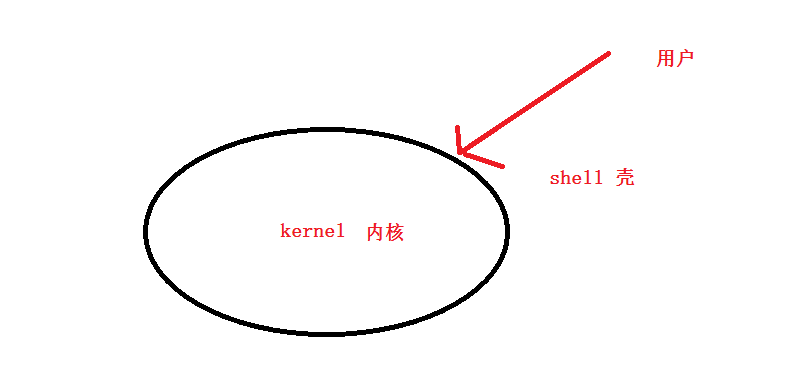

# Linux shell编程一


# 学习目标

- [x] ==熟练掌握shell变量的定义和获取==

- [x] ==能够进行shell简单的四则运算==


# 一、编程语言分类介绍

计算机只能识别机器语言（如:01010101001这种）, 程序员不能直接去写01这种代码，所以要程序员所编写的程序语言翻译成机器语言。将其他语言翻译成机器语言的工具，称之为**==编译器或解释器==**。

 如：中国人 ---（翻译）----外国人

编译器翻译的方式有两种，一种是**编译**，一种是**解释**。区别如下:


- **编译型语言：**

​     程序在执行之前需要一个专门的编译过程，把程序编译成为机器语言文件，运行时不需要重新翻译，直接使用编译的结果就行了。程序执行效率高，依赖编译器，跨平台性差些。如C、C++

- **解释型语言：**

​    程序不需要编译，程序在运行时由**==解释器==**翻译成机器语言，每执行一次都要翻译一次。因此效率比较低。比如Python/JavaScript/ Perl /ruby/Shell等都是解释型语言。


- **总结：**

编译型语言比解释型语言==速度较快==，但是不如解释型语言==跨平台性好==。如果做底层开发或者大型应用程序或者操作系开发一==般都用编译型语言==；如果是一些服务器脚本及一些辅助的接口，对速度要求不高、对各个平台的==兼容性有要求==的话则一般都用==解释型语言==。


# 二、shell介绍





**总结：**

- ==shell就是人机交互的一个桥梁==
- shell的种类

~~~powershell
# cat /etc/shells 
/bin/sh			是bash shell的一个快捷方式
/bin/bash		bash shell是大多数Linux默认的shell，包含的功能几乎可以涵盖shell所有的功能
/sbin/nologin	表示非交互，不能登录操作系统
/bin/dash		小巧，高效，功能相比少一些
~~~

- **==/bin/bash或/bin/sh就是最常用的shell程序的解释器==**


# 三、什么是shell脚本？

解释型语言的编程一般叫script编程,也就是脚本的意思。shell script就是shell脚本。

 ==**若干命令 + 基本格式 + 特定语法 + 思想= shell脚本**==

## 3.1 什么时候用到脚本？

重复化、复杂化的工作，通过把工作的命令写成脚本，以后仅仅需要执行脚本就能完成这些工作。

 ①自动化分析处理

 ②自动化备份

 ③自动化批量部署安装

 ④等等... 


## 3.2 如何学习shell脚本？

1. 尽可能熟悉更多的命令

2. 掌握脚本的标准的格式（声明类型、使用标准的执行方式运行脚本）

3. 熟悉掌握脚本的基本语法

4. 多看（看懂）——>多模仿（多练）——>多思考


# 四、shell脚本

## 4.1 第一个shell脚本

~~~powershell
[root@server ~]# mkdir /shell/shell01 -p
[root@server ~]# vim /shell/shell01/1.sh

#!/bin/bash
解释型语言声明类型，表示/bin/bash为解释器(用/bin/sh也可以)

echo "hello world"
~~~


## 4.2 脚本执行方法：

方法1: （脚本不用执行权限，声明类型没有产生作用，因为是直接指定sh来执行此脚本)

~~~powershell
[root@server ~]# cd /shell/shell01/
[root@server shell01]# sh 1.sh
hello world

补充:sh -x 1.sh这样执行脚本有一定的排错功能，可以查看脚本执行过程
~~~

方法2:（脚本不用执行权限，声明类型没有产生作用，因为是直接指定bash来执行此脚本)

~~~powershell
[root@server shell01]# bash 1.sh
hello world
~~~

方法3: （脚本需要执行权限，声明类型产生作用)

~~~powershell
[root@server shell01]# ./1.sh
-bash: ./1.sh: Permission denied
[root@server shell01]# chmod a+x 1.sh
[root@server shell01]# ./1.sh
hello world
~~~


## 4.3 纯命令shell脚本

也就是不需要学习任何其它的编程语法（但需要对命令掌握熟练)，把要多个命令按照顺序从上往下排列。执行的时候会按从上往下的顺序来执行.

**示例:** 打印1,2,3

~~~powershell
#!/bin/bash

echo 1
echo 2
echo 3
~~~

**示例:** 删除其它的yum配置文件，配置本地yum(假设镜像挂载到/mnt目录)

~~~powershell
#!/bin/bash

rm /etc/yum.repos.d/* -rf
cat > /etc/yum.repos.d/local.repo <<EOF
[local]
name=local
baseurl=file:///mnt
enabled=1
gpgcheck=0
EOF
~~~

**回顾**

~~~powershell
#注意下面这两种区别
cat > /tmp/abc <<EOF				# >符号，表示把原内容覆盖
你好
EOF

cat >> /tmp/abc <<EOF				# >>符号，表示在原内容上追加
哈哈
EOF
~~~

**关键词:** 编程代码   翻译(解释器/bin/bash或/bin/sh)    把多条命令按顺序写到程序里，可以帮我们一次性批量执行，提高效率。


**练习:** 用shell实现httpd访问日志每天轮转(**/var/log/httpd/access_log**)

要求:

1. 将/var/log/httpd/access_log轮转到/backup/年/月/年-月-日期.access_log
2. 轮转后再创建新的/var/log/httpd/access_log
3. 每次日志轮转后，都在/var/log/message里记录一条日志已经轮转的信息(信息自定义)
4. 将写好的脚本放到crond服务里执行

准备工作:

~~~powershell
# yum install httpd httpd-devel elinks -y
# /etc/init.d/httpd restart
# elinks -dump 127.0.0.1

# cat /var/log/httpd/access_log
127.0.0.1 - - [12/Apr/2019:14:55:15 +0800] "GET / HTTP/1.1" 403 4961 "-" "ELinks/0.12pre5 (textmode; Linux; -)"
~~~

~~~powershell
#!/bin/bash
mkdir /backup/$(date +%Y)/$(date +%m)/   -p

mv /var/log/httpd/access_log /backup/$(date +%Y)/$(date +%m)/$(date +%F).access_log
touch /var/log/httpd/access_log
/etc/init.d/httpd reload  &> /dev/null
logger -t "日志轮转" "$(date +%F)成功"
~~~


~~~powershell
59  23  * * *  sh /path/xxx.sh
~~~


# 五、变量

## 5.1 变量介绍

### 5.1.1 什么是变量?

通俗的说, 变量就是用来临时保存数据的。(注: 学python时会将变量讲得更深入)


### 5.1.2 变量定义的格式

**==变量名=变量值==**

想要得到变量的值，在变量前加$符号

~~~powershell
# a=1
# echo $a
1
~~~


### 5.1.3 什么时候需要定义变量？

- 如果某个内容需要多次使用，并且在代码中**重复出现**，那么可以用变量代表该内容。这样在修改内容的时候，仅仅需要修改变量的值。
- 在代码运作的过程中，可能会把某些命令的执行结果保存起来，后续代码需要使用这些结果，就可以直接使用这个变量。

~~~powershell
#!/bin/bash

year=$(date +%Y)
month=$(date +%m)

mkdir /backup/$year/$month/   -p

mv /var/log/httpd/access_log /backup/$year/$month/$(date +%F).access_log
touch /var/log/httpd/access_log
/etc/init.d/httpd reload  &> /dev/null
logger -t "日志轮转" "$(date +%F)成功"
~~~


## 5.2 变量的定义规则与方式(重点)

### 5.2.1 变量定义的基本规则

1. 区分大小写，同名称但大小写不同的变量名是不同的变量 

~~~powershell
# a=2
# A=3
# echo $a
2
# echo $A
3
~~~

2.  定义时的格式要注意，等号两边不能有空格，对于有空格的字符串做为赋值时，要用引号引起来

~~~powershell
 B="hello world"
 B='hello world haha'	
 单引号和双引号在这里都可以，后赋值的会覆盖前面的赋值
~~~

3.  单引号与双引号的区别: 单引号内的变量或者特殊字符仅为一般字符，但双引号内的变量或者特殊字符可以保持它的变量特性

~~~powershell
# echo '$B'
$B
# echo "$B"
hello world haha
~~~

4. 变量名可以是字母或数字或下划线的组合，但是不能以数字开头

~~~powershell
# c123=aaa
# echo $c123
aaa											正确

# 123c=aaa
bash: 123c=aaa: command not found			错误

# _abc11122=aaa
# echo $_abc11122
aaa											正确
~~~

5. 变量名尽量做到见名知意(不要一个脚本里的变量全是a,b,c,d之类的,不容易阅读)


### 5.2.2 变量定义的基本方式

1. 直接把值赋值给变量

~~~powershell
a=1
~~~

2. 命令的执行结果可以做为变量的值赋值给变量

| 符号                                                    | 说明                                     |
| ------------------------------------------------------- | ---------------------------------------- |
| \` \`    反撇号  (在键盘ESC键下面，TAB键上面的那个按键) | 执行符号，用于执行符号内的命令           |
| $( )                                                    | 执行符号，用于执行符号内的命令(**建议**) |

~~~powershell
一条命令中可以用多次$()，但用多次``执行符会报错
# a=`rpm -qf `which mount``			报错

# a=$(rpm -qf `which mount`)		正确
# a=$(rpm -qf $(which mount))		正确
~~~

3. 通过read交互式定义变量

~~~powershell
# read -p "输入你的名字:" name
输入你的名字:张三
# echo $name
张三
~~~

| read命令常用参数 | 说明                         |
| ---------------- | ---------------------------- |
| -p               | 交互对话提示信息             |
| -s               | 隐藏输入                     |
| -n接数字         | 指定交互最多只能输入几位字符 |
| -t接数字         | 批定交互的时间最多只能几秒   |

示例: 

~~~powershell
#!/bin/bash

read -p "输入你的名字:" name

echo "你好,$name"

read -s -p "输入你的手机号:" num
echo											# 直接echo表示换行
echo "你的手机号为$num" 

read -n 2 -p "输入你的年龄:" age
echo
echo "你$age岁了"

read -t 3 -p "214546+23446＋46645-126456=?" result
echo
echo "心算速度不够快啊"
~~~


## 5.3 变量的获取

通过`$变量名`或`${变量名}`来获取变量的值

~~~powershell
# num=12345
# echo $num
12345
# echo ${num}
12345
~~~

加大括号与不加大括号有什么区别?

答: 加大括号可以实现截取(切片)或其它操作。

~~~powershell
第1个数字代表从第几位开始，0代表第1位，1代表第二位，以此类推
第2个数字代表截取几位
# echo ${num:0:3}
123
# echo ${num:1:2}	
23
# echo ${num:2:2}
34
# echo ${num:2:3}
345
~~~

示例: 

~~~powershell
read -s -p "输入你的手机号:" num
echo										
echo "你的手机号尾数为${num:7:4}" 
~~~


**课后拓展**(了解即可, 不用记忆,后面学习**awk**,**sed**有更好的方法)

~~~powershell
file=/dir1/dir2/dir3/my.file.txt
我们可以用 ${ } 分别替换获得不同的值：
${file#*/}：拿掉第一条 / 及其左边的字符串：dir1/dir2/dir3/my.file.txt
${file#*1/}：拿掉第二条 / 及其左边的字符串：dir2/dir3/my.file.txt
${file##*/}：拿掉最后一条 / 及其左边的字符串：my.file.txt
${file#*.}：拿掉第一个 .  及其左边的字符串：file.txt
${file##*.}：拿掉最后一个 .  及其左边的字符串：txt
${file%/*}：拿掉最后条 / 及其右边的字符串：/dir1/dir2/dir3
${file%%/*}：拿掉第一条 / 及其右边的字符串：(空值)
${file%.*}：拿掉最后一个 . 及其右边的字符串：/dir1/dir2/dir3/my.file
${file%%.*}：拿掉第一个 . 及其右边的字符串：/dir1/dir2/dir3/my

我们也可以对变量值里的字符串作替换：
${file/dir/path}：将第一个dir替换为 path：/path1/dir2/dir3/my.file.txt
${file//dir/path}：将全部dir替换为 path：/path1/path2/path3/my.file.txt
~~~

## 5.4 变量的取消

使用`unset 变量名`可以取消变量(**注意:**一个脚本执行完后，变量自动释放，不用每个变量都unset取消)

~~~powershell
# aaa=haha
# echo $aaa
haha
# unset aaa
# echo $aaa
~~~


## 5.5 linux变量的分类

- **本地临时变量**：当前用户临时自定义的变量。当前进程中有效，在其他进程及子进程无效。
- **环境变量**：当前进程有效，并且能够被子进程调用。
  - 查看当前用户的环境变量							**env**
  - 查询当前用户的所有变量(本地临时变量与环境变量)         **set **
  - **export**命令可将当前本地临时变量变成环境变量 

示例: 本地临时变量

~~~powershell
# bbb=haha

# env |grep bbb						env里查不到，因为不是环境变量
# set |grep bbb						set里查得到
bbb=haha

# echo $bbb			
haha
# bash								进入子bash(子进程)
# echo $bbb							在子bash(子进程)中无效

# exit								退出子bash(子进程)
exit
# echo $bbb
haha
~~~

示例: 环境变量

~~~powershell
# export ccc=haha

# env |grep ccc						env里查得到
ccc=haha
# set |grep ccc
ccc=haha

# echo $ccc
haha
# bash								进入子bash(子进程)
# echo $ccc							在子bash(子进程)中有效
haha
# exit
exit
~~~

* **全局环境变量**：所有的用户和程序都能调用，且继承，新建的用户也默认能调用. 如`$HOME`,`$PATH`,`$USER`等

| 文件路径            | 说明                                                         |
| ------------------- | ------------------------------------------------------------ |
| $HOME/.bashrc       | 当前用户的bash信息（alias、umask等）,用户**登录**时读取      |
| $HOME/.bash_profile | 当前用户的环境变量,用户**登录**时读取                        |
| $HOME/.bash_logout  | 用户**退出**时最后读取的文件(可做用户退出时触发型的动作)     |
| /etc/bashrc         | 全局的bash信息，对所有用户生效，修改它后需要使用**source**命令生效 |
| /etc/profile        | 全局环境变量信息，对所有用户生效,修改它后需要使用**source**命令生效 |

示例: 自定义全局环境变量

~~~powershell
# vim /etc/profile
export abc=haha					在文件最后空白地方追加这一句,并保存退出

# source /etc/profile
或者
# .  /etc/profile

使用source或.让其生效后，操作系统任何终端及子bash都可以调用此变量(已经打开过的其它终端需要重登录一下)
~~~


- 系统变量(内置bash中变量)： shell本身已经固定好了它的名字和作用,可以直接在shell脚本中调用。

| 内置变量                  | 说明                                                         |
| ------------------------- | ------------------------------------------------------------ |
| $?  (**==重点==**)        | 上一条命令执行后返回的状态，当返回0时表示执行正常，非0表示执行异常或出错 |
| $$                        | 当前所在进程的进程号(pid)   如: `# kill -9 $$`会退出当前会话 |
| $0                        | 当前执行的程序名称      如:  在脚本里`sh $0`代表重新执行此脚本(会产生子进程) |
| `$1` -`$9` (**==重点==**) | 位置参数变量。如: `/etc/init.d/sshd restart `这个restart就是对应$1 |
| `${10}`-`${n}`            | 扩展位置参数变量, 第10个位置变量必须用{}大括号括起来(了解即可,几乎用不到) |
| $#                        | 脚本后面接的参数的个数                                       |
| `$*`或`$@`                | 脚本后面所有参数                                             |

示例: 

~~~powershell
[root@server shell01]# vim 5.sh
#!/bin/bash

echo '$0'是"$0"
echo '$1'是"$1"
echo '$2'是"$2"
echo '$3'是"$3"
echo '$$'是"$$"
echo '$#'是"$#"
echo '$*'是"$*"
echo '$@'是"$@"


[root@server shell01]# sh 5.sh a b c
$0是5.sh
$1是a
$2是b
$3是c
$$是2183
$#是3
$*是a b c
$@是a b c
~~~


# 六、简单的四则运算

算术运算：默认情况下，shell就只能支持简单的==整数==运算

| 四则运算符 | 说明         |
| ---------- | ------------ |
| +          | 加           |
| -          | 减           |
| *          | 乘           |
| /          | 除           |
| %          | 取模，求余数 |
| **         | 幂           |

Bash shell 算术运算的方式:

1. 使用$[ ]   (**==建议主用这种就可以了，其它可以看懂即可==**)
2. 使用 $(( ))   
3. 使用expr外部程式
4. 使用let命令
5. 借助bc命令

~~~powershell
#!/bin/bash

a=1
let a++                         # 使用let执行运算,后面变量前不用加$
b=$[$a-1]
c=$(($a**3))
d=`expr $a + 3`                 # +号两边要有空格

echo $a
echo $b
echo $c
echo $d
~~~

借助bc命令实现小数运算

~~~powershell
# echo 1.1+2.2 | bc
3.3

# echo "sqrt(100)" | bc				
10							求平方根
~~~

示例: 实现一个普通用户登出时，显示登录了多久

如abc用户登出时，会自动显示"你好,abc,你一共登录了xx时xx分xx秒,bye bye"

~~~powershell
# vim /home/abc/.bash_profile 
export logintime=$(date +%s)

# vim /home/abc/.bash_logout

clear
logouttime=$(date +%s)
alltime=$[$logouttime-$logintime]
hours=$[$alltime/3600]
minutes=$[$alltime%3600/60]
seconds=$[$alltime%60]
echo "你好,$USER,你一登录$hours时$minutes分$seconds秒,bye bye"
~~~


# 七、命令补充

## wc

**统计命令**

| 参数 | 说明                                                         |
| ---- | ------------------------------------------------------------ |
| -l   | 统计行数                                                     |
| -c   | 查文件所有行有多少字符(换行符也算一个字符)                   |
| -m   | 查文件所有行有多少字符(换行符也算一个字符)                   |
| -L   | 查文件最长的行有多少字符(换行符不算字符)   **==可用于计算单行长度==** |


~~~powershell
# echo 1234 |wc -c
5
# echo 1234 |wc -L
4
# cat /etc/passwd |wc -l
算有多少个用户
~~~

## cut

截取命令，特点:只能以单个字符为分隔符。后面讲awk和sed在截取的很多方面比cut更有优势.

| 参数 | 说明           |
| ---- | -------------- |
| -d   | 指定分隔符     |
| -f   | 指定第几列     |
| -c   | 截取第几个字符 |

~~~powershell
# head -1 /etc/passwd | cut -d: -f7
/bin/bash
# head -1 /etc/passwd | cut -d: -f2
x

# echo 12345 |cut -c2-4
234
# echo 12345 |cut -c2-
2345

~~~

## sort

**排序命令**

| 参数 | 说明             |
| ---- | ---------------- |
| -r   | 反向排序         |
| -n   | 以数字来排       |
| -f   | 大小写不敏感     |
| -t   | 分隔符           |
| -k   | 接数字代表第几列 |

~~~powershell
# cat /etc/passwd |sort -t: -k3 -n

# cat /etc/passwd |sort -t: -k3 -n -r

~~~

## uniq

**去重命令**

| 参数 | 说明       |
| ---- | ---------- |
| -c   | 去重后统计 |

~~~powershell
# cut -d: -f7 /etc/passwd |sort |uniq -c
~~~

## grep

行查找命令(后面讲正则表达式会重点使用)

| 参数      | 说明                                           |
| --------- | ---------------------------------------------- |
| -n        | 显示行号                                       |
| -v        | 反向查找                                       |
| -i        | 大小写不敏感                                   |
| -E或egrep | 扩展模式                                       |
| -o        | 把查出的关键字全显示出来，方便统计次数         |
| -f        | 适合查找两个文件重复的行                       |
| -A        | 后接数字n，表示可以查找的那行还会显示下面的n行 |


~~~powershell
显示查出的行在原文件的行号加n参数	grep -n root /etc/passwd		
反向查找加v参数  grep -v bin /etc/passwd
大小写不敏感加i参数  grep -ni root grep.txt 

查找有root和ftp关键字的行
# grep root /etc/passwd | grep ftp

查找有root或ftp关键字的行
# egrep  "root|ftp" /etc/passwd
# grep -E  "root|ftp" /etc/passwd


统计root在/etc/passwd里出现了几次
grep -o root /etc/passwd |wc -l


[root@li shell03]# cat 1.txt
111
222
333
444
555
666
[root@li shell03]# cat 2.txt
aaa
bbb
333
ccc
ddd
555

方法一：
# grep -f 1.txt 2.txt	--找出两个文件里重复的行
333
555

方法二:
# sort 1.txt 2.txt -o 3.txt
cat 3.txt | uniq -c |awk '$1>1 {print $2}'

方法三:
把一个文件里的行，一行一行的取出来，在另一个文件里去循环比较，如果有，则表示两个文件都有。


# ifconfig |grep -A 1 vmnet 
vmnet1    Link encap:Ethernet  HWaddr 00:50:56:C0:00:01  
          inet addr:1.1.1.1  Bcast:1.1.1.255  Mask:255.255.255.0
--
vmnet8    Link encap:Ethernet  HWaddr 00:50:56:C0:00:08  
          inet addr:192.168.56.1  Bcast:192.168.56.255  Mask:255.255.255.0
~~~


练习题:

```powershell
对有下面内容的文件进行操作
# cat 1.txt
http://a.domain.com/1.html
http://b.domain.com/1.html
http://c.domain.com/1.html
http://a.domain.com/2.html
http://a.domain.com/3.html
http://b.domain.com/3.html
http://c.domain.com/2.html
http://c.domain.com/3.html
http://a.domain.com/1.html
得到下面的结果

	4 a.domain.com
	3 c.domain.com
	2 b.domain.com
```


