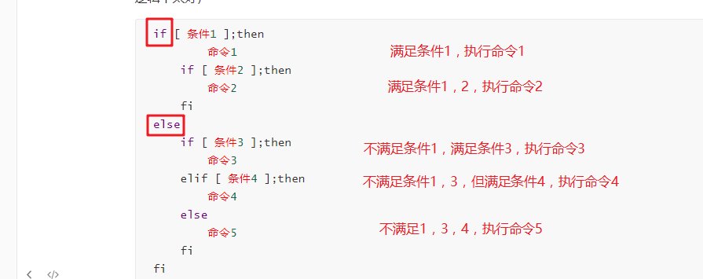

# Linux shell编程二

# 学习目标

- [x] 熟悉条件判断语句,如判断整数，判断字符串等

- [x] 熟悉流程控制语句基本语法，如if…else…

#一、条件判断

## 1.1 应用场景

**判断一个条件是为真(true)还是为假(false)**

**判断场景**

##1.2 语法格式

- 格式1： ==**test**==  条件表达式
- 格式2： **[** 条件表达式 ]
- 格式3： **[[** 条件表达式 ]]  支持正则 =~

##1.3 条件判断相关参数

**说明: man test去查看，很多的参数都用来进行条件判断**

### 1.3.1 与文件有关的判断

| 判断参数               | 说明                            |
| ---------------------- | ------------------------------- |
| -e （常用)  exist      | 判断文件(任何类型文件)是否存在  |
| -f    (常用)  file     | 判断是否为普通文件              |
| -d   (常用)  directory | 判断是否为目录                  |
| -S                     | 判断是否为socket文件            |
| -p                     | 判断是否为pipe管道文件          |
| -c                     | 判断是否为character字符设备文件 |
| -b                     | 判断是否为block块设备           |
| -L        link         | 判断是否为软链接                |
| -s                     | 判断文件是否存在并且为非空文件  |

判断语法格式:

~~~powershell
test -e /etc/fstab				判断文件是否存在
[ -d /etc ]		 				判断目录是否存在，存在条件为真   （中括号里面左边两边有空格)
[ ! -d /etc ]					判断目录是否存在,不存在条件为真  （中括号里面左边两边有空格)
[[ -f /etc/fstab ]]				判断文件是否存在，并且是普通文件 （中括号里面左边两边有空格)
~~~

示例:

~~~powershell
# test -e /etc/fstab
# echo $?
0									返回值为0表示判断的文件存在

# test -e /etc/sdfsfsf
# echo $?
1									返回值为非0表示判断的文件不存在
~~~

示例: 

~~~powershell
# [ -d /etc/ ]					
# echo $?
0

# [ ! -d /etc/ ]
# echo $?
1
~~~

示例:

~~~powershell
# aaa=aaa123
# [[ $aaa =~ ^aaa ]]
# echo $?
0								返回值为0表示上面判断的aaa变量是以aaa开头

# [[ $aaa =~ ^bbb ]]
# echo $?
1								返回值为非0表示上面判断的aaa变量不是以bbb开头
~~~

### 1.3.2 文件权限相关的判断

| 判断参数 | 说明                                  |
| -------- | ------------------------------------- |
| -r       | 当前用户对其是否可读                  |
| -w       | 当前用户对其是否可写                  |
| -x       | 当前用户对其是否可执行                |
| -u       | 是否有suid(权限9位的前3位里是否有s位) |
| -g       | 是否sgid(权限9位的中间3位里是否有s位) |
| -k       | 是否有t位(权限9位的后3位里是否有t位)  |

### 1.3.3 两个文件的比较判断

| 判断表达式       | 说明                                                         |
| ---------------- | ------------------------------------------------------------ |
| file1 -nt  file2 | 比较file1是否比file2新                                       |
| file1 -ot  file2 | 比较file1是否比file2旧                                       |
| file1 -ef  file2 | 比较是否为同一个文件，或者用于判断硬连接，是否指向同一个inode |

### 1.3.4 整数之间的判断

| 判断参数 | 说明     |
| -------- | -------- |
| -eq      | 相等     |
| -ne      | 不等     |
| -gt      | 大于     |
| -lt      | 小于     |
| -ge      | 大于等于 |
| -le      | 小于等于 |

### 1.3.5 字符串之间的判断

| 判断参数或表达式   | 说明                                  |
| ------------------ | ------------------------------------- |
| -z                 | 是否为空字符串,字符串长度为0则为真    |
| -n                 | 是否为非空字符串,只要字符串非空则为真 |
| string1 = string2  | 两个字符串是否相等                    |
| string1 != string2 | 两个字符串是否不等                    |

### 1.3.6 多重条件判断

高 -a 富 -a 帅        高 -a 富 -o 帅

白 -o 富 -o 美

| 判断参数                                        |                                      |
| ----------------------------------------------- | ------------------------------------ |
| 条件1 -a 条件2   (and)       条件1 && 条件2     | 两个条件同时满足，整个大条件为真     |
| 条件1 -o 条件2    (or)         条件1 \|\| 条件2 | 两个条件满足任意一个，整个大条件为真 |

示例:

~~~powershell
[ 1 -eq 1 -a 1 -ne 0 ]				整个表达式为真
[ 1 -eq 1 ] && [ 1 -ne 0 ]	
~~~

~~~powershell
[ 1 -eq 1 -o 1 -ne 1 ]				整个表达式为真
[ 1 -eq 1 ] || [ 1 -ne 1 ]
~~~

~~~powershell
# [ 1 -eq 1 -a 0 -ne 0 -o 1 -eq 0 ]
# echo $?
1
~~~

## 1.4 使用&&与||符号实现判断语句

| 符号 | 说明                               |
| ---- | ---------------------------------- |
| ;    | 不管前面执行是否正确，都会执行后面 |
| &&   | 前面执行正确，才会执行后面         |
| \|\| | 前面执行失败，才会执行后面         |

~~~powershell
条件 && 动作			 # 前面条件满足则执行动作
条件 || 动作        	 # 前面条件失败则执行动作
条件 && 动作1 || 动作2    # 如果条件满足，则执行动作1，否则则执行动作2
~~~

**示例:** 

~~~powershell
# [ -e /etc/fstab ] && echo "文件存在" || echo "文件不存在"
文件存在
# [ -e /etc/sdfdsfdsa ] && echo "文件存在" || echo "文件不存在"
文件不存在
~~~

~~~powershell
#!/bin/bash

read -p "输入你的性别(man/woman):" sex

[ $sex != man -a $sex != woman ] && echo "性别输入有误"
~~~

~~~powershell
#!/bin/bash

read -p "输入你的性别:(man/woman)" sex

[ $sex != man -a  $sex != woman ]  && echo "性别输入有误" && exit
[ $sex = man ] && echo "帅哥" || echo "美女"
说明: exit会退出脚本
~~~

# 二、寻找判断点

shell脚本里判断参数并不需要去特意地记忆，多写几次就会记住常用的了。**==最重要的是判断的时候能找准判断点==**,这就需要看你对需要判断的事物的熟悉程度。

**练习:**

判断一个IP是否能通

~~~powershell
#!/bin/bash

read -p "输入一个ip:" ip

ping -c 2 $ip &> /dev/null

[ $? -eq 0 ] && echo "ping通" || echo "ping不通"
~~~

判断一个用户是否存在

思路:

~~~powershell
id 用户名
~~~

判断一个进程是否存在

思路:

~~~powershell
1,只知道进程名的情况
ps -ef |grep httpd |grep -v grep
pgrep httpd

2,只知道进程pid的情况
[ -d /proc/9062 ]
~~~

判断一个服务是否运行正常(如httpd服务)

思路与方法:

~~~powershell
常规方法:用下列命令都可以查看服务相关的状态，进程，端口等
/etc/init.d/httpd status
ps -ef |grep httpd |grep -v grep
netstat -ntlup |grep :80

最好的方式是客户去连接一下
elinks -dump http://x.x.x.x/
curl http://x.x.x.x/
~~~

~~~powershell

#!/bin/bash

read -p "输入网站的ip:" ip

elinks -dump http://$ip &> /dev/null

[ $? -eq 0 ] && echo "httpd可用" || echo "httpd不可用
~~~

判断一个文件是否是死链接(指软链接文件被删除了源文件)

~~~powershell
read -p "输入一个文件:" file

[ ! -e $file -a -L $file ] && echo "$file是死链接文件"
~~~

判断密码的长度是否大于8位

~~~powershell
#!/bin/bash
read -s -p "输入密码:" password

length=$(echo $password |wc -L)

[ $length -gt 8 ] && echo "长度OK" || echo "长度不够"
~~~

#三、流程控制语句(判断)

##3.1 基本语法结构

### 3.1.1 单分支结构

~~~powershell
if [ 条件 ];then
	命令
fi

[ 条件 ] && 命令
~~~

**==F==**: false 假

**==T==**: true 真

### 3.1.2 双分支结构

~~~powershell
if [ 条件 ];then
	命令1
else
	命令2
fi

[ 条件 ] && 命令1 || 命令2
~~~

### 3.1.3 多分支结构

~~~powershell
if [ 条件1 ];then
	命令1
elif [ 条件2 ];then					# 可以有多个elif
	命令2  
else
	命令3
fi

如果条件1满足，执行命令1后结束；
如果条件1不满足，再看条件2，如果条件2满足执行命令2后结束；
如果条件1和条件2都不满足执行命令3结束.
~~~

~~~powershell
#!/bin/bash

read -p "输入你的性别(man/woman):" sex

if [ $sex = man ];then
        echo "帅哥"
elif [ $sex = woman ];then
        echo "美女"
elif [ $sex = boy ];then
        echo "小帅哥"
elif [ $sex = girl ];then
        echo "小美女"
else
        echo "性别输入有误"
fi
~~~

### 3.1.4 if嵌套

上面的三种分支结构可以互相嵌套,嵌套后的逻辑会比较复杂，实际写程序不宜嵌套过多(如果嵌套过多则说明你的逻辑不太好)

~~~powershell
if [ 条件1 ];then
		命令1		
	if [ 条件2 ];then
		命令2
	fi
else
	if [ 条件3 ];then
		命令3
	elif [ 条件4 ];then
		命令4
	else
		命令5
	fi
fi

如果条件1满足，执行命令1；如果条件2也满足执行命令2，如果不满足就只执行命令1结束；
如果条件1不满足，不看条件2；直接看条件3，如果条件3满足执行命令3；如果不满足则看条件4，如果条件4满足执行命令4；否则执行命令5
~~~

## 3.2 实例

1：输入一个ip,判断是否ping通

~~~powershell

~~~

2：判断一个进程是否存在

~~~powershell

~~~

3：判断一个服务是否正常(以httpd为例)

~~~powershell

~~~

4：read输入一个文件路径,判断属于哪种文件类型

~~~powershell
#!/bin/bash

read -p "输入一个文件:" file

if [ -L $file ];then
        echo "$file是软链接文件"
elif [ -d $file ];then
        echo "$file是目录"
elif [ -S $file ];then
        echo "$file是socket文件"
elif [ -p $file ];then
        echo "$file是pipe管道文件"
elif [ -c $file ];then
        echo "$file是character字符设备"
elif [ -b $file ];then
        echo "$file是block设备"
elif [ -f $file ];then
        echo "$file是普通文件"
else
        echo "$file不存在"
fi
~~~

##3.3  练习

1、输入一个用户，用脚本判断该用户是否存在

~~~powershell

~~~

2、判断vsftpd软件包是否安装，如果没有则自动安装（yum源已配好）

~~~powershell
#!/bin/bash

rpm -q vsftpd &> /dev/null

if [ $? -ne 0 ];then
        yum install vsftpd -y &> /dev/null
fi

~~~

3、判断当前内核主版本是否为2，且次版本是否大于等于6；如果都满足则输出当前内核版本

~~~powershell
cut命令回顾
-c:	以字符为单位进行分割。
-d:	自定义分隔符，默认为制表符。\t
-f:	与-d一起使用，指定显示哪个区域。

# head -1 /etc/passwd|cut -d: -f7
/bin/bash
# echo 12345 | cut -c2-4
234
# echo 12345 | cut -c2-
2345
~~~

~~~powershell
#!/bin/bash

a=$(uname -r |cut -d"." -f1)
b=$(uname -r |cut -d"." -f2)

if [ $a -eq 2 -a $b -ge 6 ];then
        echo $(uname -r)
fi

~~~

4、判断sshd服务是否已启动，如果已启动输出以下信息，如果没启动则启动后再输出以下信息：

   sshd服务器已启动...
   sshd监听的port是:
   sshd的进程pid是:

~~~powershell
回顾查看port或pid的方法:
方法1:请自行截取
# netstat -ntlup |grep sshd
tcp        0      0 0.0.0.0:22      0.0.0.0:*                   LISTEN      1271/sshd
tcp        0      0 :::22           :::*                        LISTEN      1271/sshd

方法2:请自行截取
# ps -ef |grep sshd
root       1271      1  0 04:10 ?        00:00:00 /usr/sbin/sshd
root       2315   1271  0 11:21 ?        00:00:01 sshd: root@pts/1
root       2317   1271  0 11:21 ?        00:00:00 sshd: root@notty
root       2478   1271  0 14:10 ?        00:00:00 sshd: root@pts/0
root       2480   1271  0 14:10 ?        00:00:00 sshd: root@notty
root       2512   2487  0 14:18 pts/0    00:00:00 grep sshd

方法3:
# pgrep  sshd
1271
2315
2317
2478
2480

方法4:
# cat /var/run/sshd.pid
1271
~~~

~~~powershell

~~~

# 课后练习

1,read输入一个普通文件，判断当前用户对它是否可读，可写，可执行(最好用一个普通用户来做测试,用root用户测试会有一定问题)

~~~powershell

~~~

2,使用read让用户输入它的名字，性别（对性别进行判断），年龄（判断是否有18岁成年)

~~~powershell
如：李四  男   15   , 则最后echo出 "李四小子，你好！"
   李四  男   20   ，则最后echo出 "李四先生，你好！"

   王五  女   15   ，则最后echo出 "王五小姐，你好!"
   王五  女   20   ，则最后echo出 "王五女士，你好!"
~~~

3,用read输入一个年份，判断是否为闰年  (能被4整除，但不能被100整除就是闰年，能被400整除也是闰年）

~~~powershell

~~~

