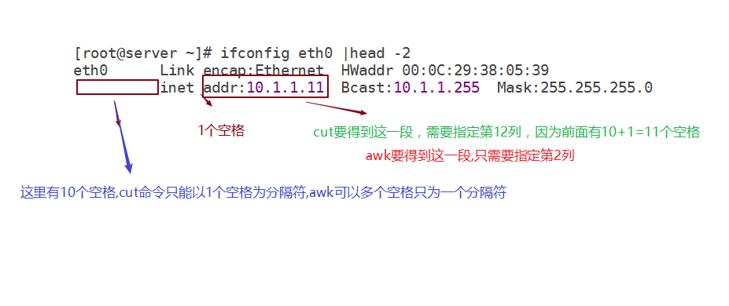
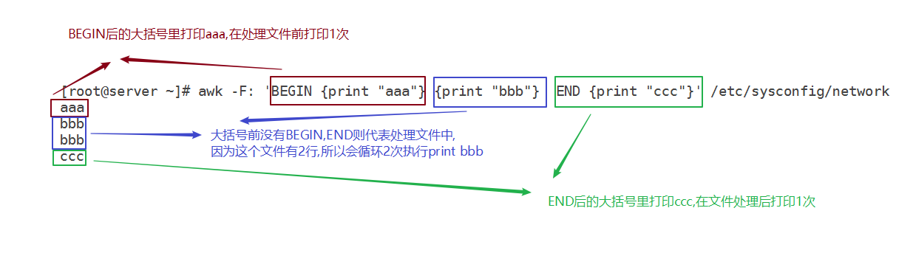
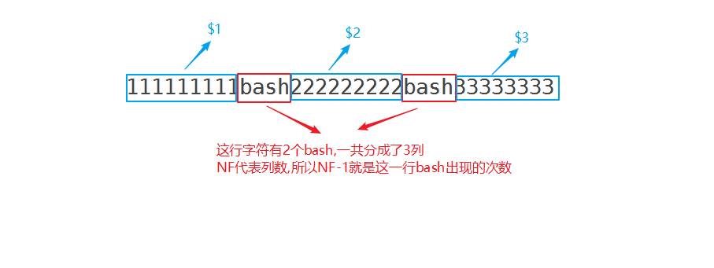
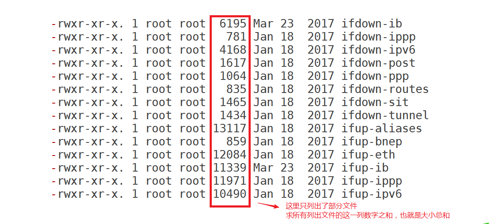

# Linux shell编程六

#  学习目标

- [ ] 能够使用awk做截取操作
- [ ] 能够使用awk做匹配操作
- [ ] 理解awk中BEGIN...END结构
- [ ] 能够在awk操作中应用运算符


# 一、awk介绍

grep,sed,awk为linux的**文件处理“三剑客”**，各有特长。

grep:更适合单纯的**==查找==(通过要查找的关键字)或匹配(通过正则)==行==**

sed:更适合**==编辑==**文本(行删除,行打印,行增加,替换与修改等)

awk:更适合**==格式化文本，对文本进行较复杂格式处理==**

今天主要讨论awk,格式化文本是很专业的说法，通俗来说就是可以**把文本变成你想要的样子**

**比如:** 将/etc/passwd文件的前三行处理成下面的样子(先不要管它是怎么得到的，我们慢慢来讲解)

~~~powershell
# head -3 /etc/passwd
root:x:0:0:root:/root:/bin/bash
bin:x:1:1:bin:/bin:/sbin/nologin
daemon:x:2:2:daemon:/sbin:/sbin/nologin
~~~

~~~powershell
# head -3 /etc/passwd |awk -F: 'BEGIN{print"用户名\tUID"}{print $1"\t"$3}'
用户名  UID
root    0
bin     1
daemon  2
~~~

有的同学会说, 我可以用cut截取这三行的用户名和UID,然后echo打印出来也可以啊。那么如果不是3行，而是300行呢?

又有的同学会说,我可以循环300行截取每行的用户名和UID,然后循环打印出来啊。

能想到这点非常好，因为awk就是逐行扫描文件，默认从第一行到最后一行来循环处理文件的，比以前学的`cat /etc/passwd |while read line`这种结构会方便很多。

**小结:** awk是一个能对文本进行较复杂格式处理的工具，能对文本做**截取**，**匹配**，**运算统计**等操作。


**awk小知识**

- awk分别代表其作者姓氏的第一个字母。因为它的作者是三个人，分别是Alfred Aho、Peter Weinberger, Brian Kernighan。 
- gawk是awk的GNU版本，它提供了Bell实验室和GNU的一些扩展。


- 下面介绍的awk是以GNU的gawk为例的，在linux系统中已把awk链接到gawk，所以下面全部以awk进行介绍。

# 二、awk使用格式


~~~powershell
# awk -F"分隔符" "命令动作" 被处理的文件
# awk -F : '{print $1,$3}' /etc/passwd
也可以通过管道传给awk处理
# cat 被处理的文件 | awk -F"分隔符" "命令动作"
~~~

# 三、awk做截取

**我们知道cut命令专门用来做截取操作的,但awk截取操作比cut这种命令有很多优势**


在学习awk做截取前,先来了解几个常用的awk内部变量(**既然是内部变量，也就是说可以直接拿来用，不用再定义**)

## awk内部相关变量

| 常用变量          | 说明                           |
| ----------------- | ---------------------------------- |
| $0                       (**==常用==**) | 当前处理行的所有记录(所有列数之和，包括分隔符) |
| $1  到     \$n       (**==常用==**) | 文件中每行以间隔符号分割的不同字段($1代表第1列。。。。。。以此类推) |
| NF                      (**==常用==**) | 当前记录的字段数（列数）           |
| $NF                    (**==常用==**) | 最后一列                           |
| NR                      (**==常用==**) | 行号                               |
| FS                      (**==常用==**) | 定义间隔符,等同于-F参数             |


**注意:** awk里的打印不是echo,是**==print==**

~~~powershell
# head -3 /etc/passwd |awk -F: '{print $1}'
root
bin
daemon
~~~

~~~powershell
# head -3 /etc/passwd |awk -F: '{print $3}'
0
1
2
~~~


## cut与awk截取比较

### **比较1**

cut默认以**1个空格**为分隔符,awk默认**以1个或多个空格**为分隔符

从下面的信息中截取到IP

~~~powershell
# ifconfig eth0 |sed -n 2p
          inet addr:10.1.1.11  Bcast:10.1.1.255  Mask:255.255.255.0
~~~

使用cut截取,有多个空格的话，每个空格都算一个分隔符，所以-f12(第12列)才找到有ip地址的那部分

~~~powershell
centos6
# ifconfig eth0 |sed -n 2p |cut -d" " -f12 |cut -d":" -f2
10.1.1.11

centos7u6
[root@node1 shell06]# ifconfig eth0 | sed -n 2p | cut -d ' ' -f 10
192.168.122.10
~~~

使用awk截取,多个空格也只算一个分隔符(并且是默认的，不用-F指定分隔符),所以$2(第2列)就找到了额ip地址的那部分

~~~powershell
centos6
# ifconfig eth0 |sed -n 2p |awk '{print $2}' |awk -F: '{print $2}'
10.1.1.11

centos7u6
[root@node1 shell06]# ifconfig eth0 | sed -n 2p | awk '{print $2}'
192.168.122.10
~~~




### **比较2 **

cut只能以**单个字符**为分隔符,而awk可以以**多个字符**为分隔符

cut以"ab"这两个字符为分隔符会报错

~~~powershell
# echo 123ab456ab789 |cut -d"ab" -f2
cut: the delimiter must be a single character	# 报错信息,告诉我们分隔符必须为单个字符
Try `cut --help' for more information.
~~~

awk以"ab"这两个字符为分隔符OK

~~~powershell
# echo 123ab456ab789 |awk -F"ab" '{print $2}'
456
~~~

### **比较3**

 awk可以将文本截取多段后自由拼接,并可以额外加字符进行粘合，而cut会比较麻烦

 ~~~powershell
# head -3 /etc/passwd |awk -F":" '{print $1"用户的uid是"$3}'
root用户的uid是0
bin用户的uid是1
daemon用户的uid是2
 ~~~

而cut要实现同类效果会比较麻烦，cut命令无法在截取的两列中间直接加字符进行粘合

~~~powershell
# head -3 /etc/passwd | cut -d: -f1"用户的uid是"3
cut: invalid byte, character or field list
Try `cut --help' for more information.
~~~

cut需要使用下面的脚本来实现

~~~powershell
#!/bin/bash

head -3 /etc/passwd | cut -d: -f1,3 | while read a
do
        head=`echo $a|cut -d: -f1`
        tail=`echo $a|cut -d: -f2`
        echo  "$head的uid是$tail"
done
~~~


**示例:**

~~~powershell
# df -h | sed -n /sda/p |awk '{print $1"的挂载点是"$NF}'
/dev/sda3的挂载点是/
/dev/sda1的挂载点是/boot
~~~


### **比较4**

awk还可以**使用正则表达式为分隔符**,而cut就不行

以逗号或点号为分隔符(再次回顾正则表达式里中括号里的字符任选其一),截取第2列

~~~powershell
# echo hello,world.sed |awk -F[,.] '{print $2}'
world
~~~

以逗号或点号为分隔符,将三列重新排序

~~~powershell
# echo hello,world.sed |awk -F[,.] '{print $2","$3"."$1}'
world,sed.hello
~~~

下面这样的字符串,以点为分隔符可以做,但是点号太多,不好数.所以可以用正则表达式,以连续的多个点来为分隔符

```powershell
# echo "haha,hehe..............................heihei......" |awk -F"[.]*" '{print $2}'
heihei
```


## awk截取练习

1. 截取/etc/passwd文件的最后一列

~~~powershell
# awk -F: '{print $NF}' /etc/passwd
~~~

2. 截取/etc/passwd文件的倒数第二列

~~~powershell
# awk -F: '{print $(NF-1)}' /etc/passwd
~~~

3. 截取下面输出里的pid

~~~powershell
基于端口号杀死进程
[root@node1 shell06]# kill -9 $(lsof -i TCP:22)


# netstat -ntlup |grep :22
tcp        0      0 0.0.0.0:22       0.0.0.0:*                   LISTEN      10004/sshd
tcp        0      0 :::22            :::*                        LISTEN      10004/sshd
~~~

~~~powershell
# netstat -ntlup |grep :22 | awk -F"[ /]+" '{print $(NF-2)}' |uniq
10004
~~~

截取监听的端口

~~~powershell
# netstat -ntlup | grep :22  | awk  '{print $4}' |awk -F":" '{print $NF}' |uniq
22
~~~

找出/etc/以.conf结尾的文件的名字(如：kernelcap-2.6.18-164.el5.conf，只需要得到kernelcap-2.6.18-164.el5就可以了）

~~~powershell
# find /etc/ -name "*.conf" |awk -F/ '{print $NF}' |awk -F“.conf” '{print $1}'
~~~


# 四、awk做匹配

**我们知道grep命令可以用来做行匹配(通过关键字或正则查找行),awk也可以做行匹配,相对于grep也有优势**

先看一个比较:

下面三条命令结果一样

~~~powershell
# grep root /etc/passwd
root:x:0:0:root:/root:/bin/bash
operator:x:11:0:operator:/root:/sbin/nologin
~~~

~~~powershell
# sed -n /root/p /etc/passwd
root:x:0:0:root:/root:/bin/bash
operator:x:11:0:operator:/root:/sbin/nologin
~~~

~~~powershell
以下命令如果添加了-F :的话，只输出一行
不添加-F ： 输出两行
# awk  '$0~"root" {print $0}' /etc/passwd
root:x:0:0:root:/root:/bin/bash
operator:x:11:0:operator:/root:/sbin/nologin

查找以root开头的行
# awk '$0~"^root" {print $0}' passwd
~~~

| awk行匹配符 | 说明              |
| ----------- | ----------------- |
| ==          | 等于,完全匹配     |
| ~           | 匹配              |
| !=          | 不等于,不完全匹配 |
| !~          | 不匹配            |

## 完全匹配

查找/etc/passwd文件里用户名为root的行

~~~powershell
# awk -F: '$1=="root" {print $0}' /etc/passwd
root:x:0:0:root:/root:/bin/bash
~~~

## 匹配

查找/etc/passwd文件里用户名里有oo这两个字符的行

~~~powershell
# awk -F: '$1~"oo" {print $0}' /etc/passwd
~~~

## 不完全匹配

查找/etc/passwd文件里用户名不为root的行

~~~powershell
# awk -F: '$1!="root" {print $0}' /etc/passwd
~~~

## 不匹配

查找/etc/passwd文件里用户名里不包含oo这两个字符的行

~~~powershell
# awk -F: '$1!~"oo" {print $0}' /etc/passwd
~~~

## awk行匹配练习

1. 从/etc/passwd里查找出daemon用户的uid

~~~powershell
# awk -F":" '$1=="daemon" {print $3}' /etc/passwd
~~~

2. 使用awk命令截取/dev/sda1的挂载点(提示: `df -h`)

~~~powershell
查看/dev/sda1挂载点及使用情况
# df -h |awk '$1=="/dev/sda1" {print $NF}'
# df -h |awk '$1=="/dev/sda1" {print $(NF-1)}'

查看/分区的空间使用情况
# df -h | awk '$NF=="/" {print $(NF-1)}'
9%

~~~


~~~powershell
# df -h
Filesystem      Size  Used Avail Use% Mounted on
/dev/sda3        18G  918M   16G   6% /
tmpfs           491M     0  491M   0% /dev/shm
/dev/sda1       190M   32M  149M  18% /boot
/dev/sr0        3.7G  3.7G     0 100% /yum


# df -h |awk '$1~"^/dev/sda" {print $1"的磁盘使用率为"$5",挂载点是"$NF}'
/dev/sda3的磁盘使用率为6%,挂载点是/
/dev/sda1的磁盘使用率为18%,挂载点是/boot
~~~


# 五、awk中BEGIN...END结构

在前面我们有提过awk在处理文件时是逐行处理的,那么有可能要在处理第一行前做一些事情(比如定义变量),在处理完最后一行后做一些事情(比如打印统计信息等)。这就要用到BEGIN...END结构了。

## 语法结构

| 结构关键字 |                                                              |
| ---------- | ------------------------------------------------------------ |
| BEGIN { }  | 在awk处理文件第一行之**==前==**,大括号里写处理前的代码       |
| { }        | 前面没有BEGIN或END的大括号，都表示逐行处理文件过程**==中==**要做的事,**==会根据行数来循环==** |
| END { }    | 在awk处理完了后一行之**==后==**,大括号里写处理前的代码       |


## 理解BEGIN

先猜一下,下面的命令答案是多少?

提示:`one=1;two=2`是在程序开始前定义两个变量，$(one+two)括号里就是两个变量相加(**注意:awk也是一个编程语言,有自己的四则语法,所以不需要使用shell里的运算符,这里的小括号只是单纯的四则运算里的小括号**)

~~~powershell
# echo a b c |awk 'BEGIN {one=1;two=2} {print $(one+two)}'
~~~


**问题:** 比较这两句, 结果有什么区别?（请先根据理解在脑海里想一个答案的样子,再执行命令比较一下)

~~~powershell
# head -3 /etc/passwd | awk -F: '{print "用户名\tUID"}{print $1"\t"$3}'

# head -3 /etc/passwd | awk -F: 'BEGIN {print "用户名\tUID"}{print $1"\t"$3}'
~~~


## 理解END

前,中,后的理解中"后"会有一点特殊的地方,如:

下面两行都是打印最后一行,所以可以使用awk里的END实现最后一行打印

~~~powershell
# awk 'END {print $0}' /etc/passwd
apache:x:48:48:Apache:/var/www:/sbin/nologin
# tail -1 /etc/passwd
apache:x:48:48:Apache:/var/www:/sbin/nologin
~~~

但BEGIN不能打印第一行,如下面这句就没有结果

~~~powershell
# awk 'BEGIN {print $0}' /etc/passwd
~~~


## 总体结构理解

~~~powershell
# cat /etc/sysconfig/network |wc -l
2									此文件有2行

# awk -F: 'BEGIN {print "aaa"} {print "bbb"} END {print "ccc"}' /etc/sysconfig/network
aaa
bbb
bbb
ccc
~~~



**问题:** 下面的命令是什么样的结果? （请先根据理解在脑海里想一个答案的样子,再执行命令比较一下)

~~~powershell
# awk -F: 'BEGIN {print "aaa"} {print $0} END {print "ccc"}' /etc/sysconfig/network
~~~


**示例:** 请计算下面文件以":"号为分隔符的总列数

~~~powershell
# cat 1.txt
aaa:bbb:ccc:111
aaa:bbb
aaa:bbb:ccc
111:222:333:444:555
~~~

思路:

* 一定要牢记awk是会逐行处理文件,所以直接看作是按行数来处理的循环
* 在循环前定义一个变量表示要计算的总列数,如sum=0
* 每行循环处理时,sum=sum+每行的列数(再次强调,awk里的运算不需要运算符)
* 循环处理完文件后，打印出sum的值就是想要求的总列数了
* 也就是说awk的处理方式就是类似下面的这个循环结构

~~~powershell
sum=0
for i in 行数
do
	sum=sum+每一行的列数
done
echo sum
~~~


**答案:**

~~~powershell
# awk -F: 'BEGIN {sum=0} {sum=sum+NF} END {print sum}' 1.txt
14
~~~


## **练习**

统计/etc/passwd一共出现了多少次bash字符 (要求用awk使用上面的结构来实现)

**提示:**使用bash为分隔符,有2列就代表有1个分隔符,有3列就代表有2个分隔符。。。。。。有N列就有N-1个分隔符



```powershell
# awk -F"bash" 'BEGIN {sum=0} {sum=sum+NF-1} END {print sum}' /etc/passwd
```


# 六、awk的运算符 

再次强调,awk是一门语言,所以有自己的运算符(**注意:有些地方与shell不一样**)

| 运算符 | 说明                                                         |
| ------ | ------------------------------------------------------------ |
| ==     | 等于                   和shell里不一样,shell里字符串比较是=    ;数字比较是-eq |
| !=     | 不等于               shell里数字比较是-ne代表不等于          |
| >      | 大于                   shell里数字比较是(-gt)代表大于        |
| <      | 小于                   shell里数字比较是(-lt)代表小于        |
| >=     | 大于等于           shell里数字比较是(-ge)代表大于等于        |
| <=     | 小于等于           shell里数字比较是(-le)代表小于等于        |
| &&     | 逻辑与(和)                                                   |
| \|\|   | 逻辑或                                                       |
| +      | 加法                                                         |
| -      | 减法                                                         |
| *      | 乘法                                                         |
| /      | 除法                                                         |
| %      | 求余数                                                       |

**通过运算符和NR内部变量的结合可以控制处理文本的行**

打印/etc/passwd第五行（**可以把NR==5看作是一个判断的条件,满足此条件才执行print $0**)

~~~powershell
# awk 'NR==5 {print $0}' /etc/passwd
~~~

打印/etc/passwd第五到十行，并在前面加上行号

~~~powershell
# awk 'NR>=5 && NR<=10 {print NR,$0}' /etc/passwd
~~~

打印第五行和第六行

~~~powershell
# awk -F: 'NR==5 || NR==6 {print $0}' /etc/passwd
~~~

打印/etc/passwd奇数行 (删除偶数行)

~~~powershell
# awk 'NR%2==1 {print NR,$0}' /etc/passwd
~~~

打印/etc/passwd偶数行 (删除奇数行)

~~~powershell
# awk 'NR%2==0 {print NR,$0}' /etc/passwd
~~~

对/etc/passwd里的用户做分类，分成管理员，系统用户，普通用户

~~~powershell
# awk -F: '$3==0 {print $1}' /etc/passwd

# awk -F: '$3<500 && $3>0 || $3==65534  {print $1}' /etc/passwd

# awk -F: '$3>499 && $3!=65534 {print $1}' /etc/passwd
~~~


**练习:** 

打印/etc/passwd前五行

~~~powershell

~~~

找出磁盘使用率高于80%的找出来（提示: df -P)

~~~powershell

~~~


# 课后练习

1,找出18：30之前下班的打卡记录

```powershell
# cat 1.txt
张三  2013-7-01 18:19:28
张三  2013-7-02 17:58:45
张三  2013-7-03 22:41:47
张三  2013-7-04 22:15:23
张三  2013-7-05 19:12:27
张三  2013-7-06 19:03:09
张三  2013-7-07 19:09:44
张三  2013-7-08 19:04:45
张三  2013-7-09 18:39:28
张三  2013-7-10 18:24:48
张三  2013-7-11 18:58:21
张三  2013-7-12 18:36:22
张三  2013-7-13 19:23:46
张三  2013-7-14 19:02:41
张三  2013-7-15 19:00:09
张三  2013-7-16 18:36:13
张三  2013-7-17 18:36:40
张三  2013-7-18 19:00:00
张三  2013-7-19 18:31:18
张三  2013-7-20 18:44:01
张三  2013-7-21 18:37:12
张三  2013-7-22 18:29:33
```

 **提示: 时间直接比较是可以的，但是如果你小时为个位数（比如9:00:00，你应该要写成09:00:00才可以直接比较)**

~~~powershell

~~~


2, 假设9点整上班，算出下面这几天这几个人分别迟到多少次，和扣多少钱（一次扣10块)

~~~powershell
张三 2013-8-25 09:19:28
李四 2013-8-25 08:58:45
王五 2013-8-25 08:41:47
马六 2013-8-25 09:12:52
田七 2013-8-25 09:01:47
张三 2013-8-24 08:49:28
李四 2013-8-24 08:54:45
王五 2013-8-24 09:11:47
马六 2013-8-24 09:02:52
田七 2013-8-24 09:04:47
张三 2013-8-23 09:29:28
李四 2013-8-23 08:57:45
王五 2013-8-23 08:41:47
马六 2013-8-23 09:08:52
田七 2013-8-23 09:09:47
张三 2013-8-22 09:24:28
李四 2013-8-22 09:16:45
王五 2013-8-22 09:11:47
马六 2013-8-22 08:52:52
田七 2013-8-22 08:44:47
~~~

~~~powershell

~~~

3, `ls -lR /etc |grep ^-`能找出/etc/目录下的所有文件,请统计出这些文件的大小总和



~~~powershell
# ls -lR /etc |grep ^- | awk 'BEGIN{sum=0} {sum=sum+$5} END {print sum}'
~~~


~~~powershell
#!/bin/bash

read -p "输入你要精确计算普通文件大小之和的目录:" dir

if [ ! -d $dir ];then
        echo "你输入的不是目录,退出"
        exit
fi


ls -lR $dir |grep ^- | awk 'BEGIN{sum=0} {sum=sum+$5} END {print sum}'

~~~


