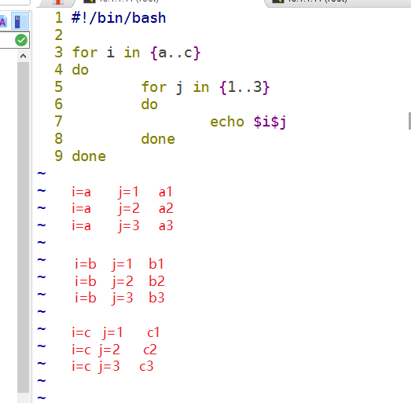

# Linux shell编程四

#课程目标

- [ ] 能使用RANDOM变量产生随机数
- [ ] 理解嵌套循环
- [ ] 掌握case语句的基本语法结构
- [ ] 掌握函数的定义及调用

- [ ] 掌握常用的正则表达式元字符含义


# 随机数

bash默认有一个$RANDOM的变量, 默认范围是0~32767.

使用`set |grep RANDOM`查看上一次产生的随机数

~~~powershell
# echo $RANDOM
19862
# set |grep RANDOM
RANDOM=19862
~~~

## **除法与余数**

~~~powershell
7除以3，商为2,余数为1
6除以2，商为3,余数为0

可通过除以2，判断余数是否为1来判断是否为奇数(单数)，如1,3,5,7,9
可通过除以2，判断余数是否为0来判断是否为偶数(双数)，如2,4,6,8,10
~~~

**示例:**

~~~powershell
#!/bin/bash

read -p "输入一个数字:" num

if [ $[$num%2] -eq 1 ];then			# if双分支判断$num除以2的余数是否为1来确认是奇数还是偶数
	echo "$num是奇数"
else
	echo "$num是偶数"
fi
~~~

## 产生自定义范围的随机数

产生0~1之间的随机数

~~~powershell
# echo $[$RANDOM%2]				  # 除以2，余数只可能是0或1
~~~

产生0~2之间的随机数

~~~powershell
# echo $[$RANDOM%3]				  # 除以3，余数只可能是0或1或2
~~~

产生1-2之内的随机数

~~~powershell
# echo $[$RANDOM%2+1]			  # 除以2，余数只可能是0或1，但都加1后，就只可能是1或2
~~~

产生50-100之内的随机数

~~~powershell
# echo $[$RANDOM%51+50]			  # 除以51，余数只可能是0到50，但都加50后，就只可能是50到100
~~~

产生三位数的随机数(100-999)

~~~powershell
# echo $[$RANDOM%900+100]		  # 除以900,余数只可能是0到899,但都加100后，就只可能是100到999

# echo $[$RANDOM%9+1]$[$RANDOM%10]$[$RANDOM%10]
~~~


**示例:** **写一个猜数字的小游戏**

```powershell
#!/bin/bash

echo "猜一个1-100的整数,猜对砸蛋:" 		# 通过echo输出游戏规则

num=$[$RANDOM%100+1]		# 产生1-100的随机数,赋值给num变量(余数为0-99，加1后余数为1-100)

while true								# 死循环，条件true表示永远为真
do										# 循环体开始
	read -p "请猜:" gnum				   # 交互模式让用户猜一个数字,将此数字赋值给gnum变量
    if [ $gnum -gt $num ];then			# 多分支判断开始
		echo "大了"					   # 如果猜的数字大于随机数则报大了
	elif [ $gnum -lt $num ];then	
		echo "小了"					   # 如果猜的数字小于随机数则报小了
	else	
		echo "对了"					   # 如果猜的数字不大也不小，那么肯定就对了
		break							# 猜对了就不要继续猜了,跳出循环
	fi									# 多分支判断结束
done									# 循环体结束(do与done之间的代码会循环)

echo "砸蛋"							  # 猜对了，跳出循环后则执行循环体外的代码
```

示例: 在上面的基础上加上一个条件，如果5次没猜对就退出游戏

~~~powershell
#!/bin/bash

echo "猜1-100内的一个整数,猜对有奖"

num=$[$RANDOM%100+1]

for i in {1..5}
do
        read -p "你猜:" gnum
        if [ $gnum -gt $num ];then
                echo "大了"
        elif [ $gnum -lt $num ];then
                echo "小了"
        else
                echo "对了"
                break
        fi

        if [ $i -eq 5 ];then
                echo "5次机会用完了,退出"
                exit
        fi
done

echo "发奖"
~~~


# 嵌套循环

一个==循环体==内又包含另一个**完整**的循环结构，称为循环的嵌套。

在外部循环的每次执行过程中都会触发内部循环，直至内部完成一次循环，才接着执行下一次的外部循环。

for循环、while循环和until循环可以**相互**嵌套。

如: 我们一天中上午，下午，晚上都在学习，然后连续学习三天

|       | 上午 | 下午 | 晚上 |
| ----- | ---- | ---- | ---- |
| 第1天 | 学习 | 学习 | 学习 |
| 第2天 | 学习 | 学习 | 学习 |
| 第3天 | 学习 | 学习 | 学习 |

1天上午

1天下午

1天晚上


2天上午

2天下午

2天晚上


3天上午

3天下午

3天晚上


**示例:**

~~~powershell
for i in {a..c}						# 外层循环a,b,c三个字母
do									# 外循环体开始
        for j in {1..3}				# 内存循环1,2,3三个字母
        do							# 内循环体开始
                echo $i$j			# 一共循环3*3=9次，分别打印a1,a2,a3,b1,b2,b3,c1,c2,c3
        done						# 内循环体结束
done								# 外循环体结束
~~~




## 示例

~~~powershell
先回顾echo命令:
echo默认打印会换行
echo -n打印不换行
echo -e会让/n为换行号,\t为制表符(tab键)

# echo -e "你\n好\t吗"
你
好      吗
~~~

**示例:** 打印出如下结果

~~~powershell
*
**
***
****
*****


分析: 
1,一共5行，所以可以外部循环5次
2,每行不换行打印与行数相等次数的*号(第1行循环1次，第2行循环2次......第5行循环5次)
  内部循环次数与行数一致
3,每行打印完*号会换行
~~~

~~~powershell
#!/bin/bash

for i in $(seq 5)					# 外循环1-5，代表5行
do
        for j in $(seq $i)	# 内循环，每行循环次数和行数保持一致(第1行循环1次，第2行循环2次...)
        do
                echo -n "*"		# 内循环每次不换行打印*
        done					
        echo		# 每次打完一行的*号后使用echo换行(比如第3行，循环打完3个*号后换行)
done
~~~

**示例:**打印出如下结果

~~~powershell
1
12
123
1234
12345
~~~

~~~powershell
#!/bin/bash

for i in $(seq 5)					# 执行seq 5这个命令产生1-5的序列，也一样实现1-5的循环
do
       	for j in $(seq $i)			# seq命令后可接变量,{1..$i}这种就不行
        do
                echo -n $j
        done
        echo
done
~~~


## 练习

1, 建立a1, a2, a3, a4, a5, b1, b2, b3, b4, b5。。。。。。。以此类推,一直到e1,e2, e3, e4, e5一共25个用户, 每个用户密码为随机三位数字(100-999), 并将用户名与密码保存到/root/.passwd文件中

~~~powershell
#!/bin/bash

rm -rf /root/.passwd

for i in {a..e}							# 外循环a-e
do
        for j in {1..5}					# 内循环1-4，结合外循环实现a1-e5共25种组合
        do
                username=$i$j			# 将a1-e5循环赋值给username这个变量
                password=$[$RANDOM%900+100]		# 产生100-999的随机数赋值给password变量
                useradd $username
                echo $password | passwd --stdin $username &> /dev/null
                echo "$username:$password" >> /root/.passwd
        done
done
~~~


# 一、case语句

case语句为多选择语句(**==其实就是类似if多分支结构==**), 主要用于centos6的服务脚本里用于判断服务是start还是stop还是status等。 

**说明:** **python里没有case语句,python里用if多分支来实现**. 但case语句也需要看懂结构, 不仅是shell里用，在数据库的SQL语句里也有case语句。

## **case语法结构**

~~~powershell
case var in            			# 定义变量;var代表是变量名
	pattern 1)              	# 模式1;用 | 分割多个模式，相当于or
    		command1            # 需要执行的语句
    		;;                  # 两个分号代表命令结束
	pattern 2)
   			command2
    		;;
	pattern 3)
    		command3
    		;;
	*)              			# 不满足以上模式，默认执行*)下面的语句
    		command4			# 这里可以不加;;符号
esac							# esac表示case语句结束
~~~

## **case与if多分支对比**

~~~powershell
case $sex in								if [ $sex = 男 -o $sex = man ];then
	男|man )										echo "帅哥"
		echo "帅哥"						   elif [ $sex = 女 -o $sex = woman];then
		;;										 echo "美女"
	女|woman )								else 
		echo "美女"								echo "性别有误"
		;;									 fi
	* )
		echo "性别有误"
esac
~~~

# 二、函数

通俗地说，将**一组命令集合**或**语句**形成一个整体, 给这段代码起个名字称为函数名。可以通过函数名来调用函数内的代码，达到代码重复利用的目的。

## 函数的定义

~~~powershell
函数名() {
  函数体（一堆命令的集合，来实现某个功能）   
}

function 函数名() {
   函数体（一堆命令的集合，来实现某个功能）  
}
~~~

~~~powershell
function_name() {
		代码
		代码
}

function function_name() {
		代码
		代码
}

建议用第一种,不用写function，简单方便
~~~

## 函数的调用

**直接用函数名来调用函数**

~~~powershell
funct1() {				# 函数名加()来定义函数，小括号是固定写法，大括号里面为函数体
    echo 1
    echo 2
    echo 3				# 大括号里的三条命令就是函数主体
}

funct1					# 直接使用函数名字调用函数，将会执行函数主体内的内容
~~~

## **函数的嵌套**

**函数里可以调函数**

~~~powershell
funct1() {				
    echo 1
    echo 2
    echo 3
}

funct2() {
    funct1				# funct2里调用funct1,相当于是把funct1函数主体内的内容放到这个位置
    echo 4
    echo 5
}

funct2				    # 调用funct2
~~~

等同于下面的代码

~~~powershell
funct2() {
    echo 1
    echo 2
    echo 3
    echo 4
    echo 5
}

funct2
~~~


# **case与函数综合实例**

**要求:**

无视系统上已有的/etc/init.d/sshd服务脚本，自己写一个服务脚本/etc/init.d/new_sshd,也能实现ssh服务的start,stop,restart,reload等功能.

## **知识准备与回顾**

* 服务脚本写在哪里?

~~~powershell
需要放在/etc/init.d/目录下，并给执行权限，才能被service命令调用
~~~

* 服务怎么启动?

~~~powershell
大家初期太依赖于service xxx restart这样的命令
服务启动三要素:
1.启动命令 (如sshd服务的启动命令就是/usr/sbin/sshd;vsftpd服务的启动命令就是/usr/sbin/vsftpd)
2,启动用户 (没特定指定一般就是root用户)
3,启动参数 (有些服务没有启动参数,如/usr/sbin/sshd直接可启动;有些服务有启动参数,如mysqld_safe --defaults-file=/usr/local/mysql/etc/my.cnf &)
~~~

* 服务怎么关闭?

~~~powershell
找到pid，然后kill -15 pid关闭即可
如kill -15 $(cat /var/run/sshd.pid)
~~~

* 服务怎么reload刷新

~~~powershell
找到pid，然后kill -1 pid即可
如kill -1 $(cat /var/run/sshd.pid)
~~~

* 服务怎么支持chkconfig开机自启动

~~~powershell
两个条件:
1, 服务脚本里要有以下这句

# chkconfig: 2345 55 25
第1个数字2345代表2345级别
第2个数字55代表启动的顺序编号(不能超过99)
第3个数字25代表关闭的顺序编号(不能超过99)

2, chkconfig --add 服务名
~~~


## 脚本实例

~~~powershell
[root@server ~]# vim /etc/init.d/new_sshd		# 要创建到/etc/init.d/目录下

#!/bin/bash

# chkconfig: 2345 64 36

start() {										# start函数
	/usr/sbin/sshd								# 调用/usr/sbin/sshd命令启动sshd服务
}
stop () {										# stop函数
	kill -15 $(cat /var/run/sshd.pid)			# 通过pid文件查找pid，然后kill -15停进程
}
reload() {										# reload函数
	kill -1 $(cat /var/run/sshd.pid)			# 通过pid文件查找pid,然后kill -1刷新
}

restart() {								# restart函数里面调用stop和start的函数(函数的嵌套)
    stop
    start
}
status() {										# status函数
	if [ -e /var/run/sshd.pid ];then		# 通过判断pid文件是否存在，从而得知服务是否启动
		echo "sshd正在运行"
	else
		echo "sshd是停止状态"
	fi
}

case "$1" in			# $1变量回顾(shell第1天有讲)，指执行脚本接的第一个参数
	start )				# 如果$1的值为start，则调用start函数主体内的代码
		start
		;;
	stop  )
		stop
		;;
	restart )			# 如果$1的值为restart
		restart
		;;
	reload )
		reload
		;;
	status )
		status
		;;
	* )		   # 如果$1的值不为start,stop,restart,reload,status其中之一，则执行下面的echo语句
		echo "只支持(start|stop|restart|reload|status)"
esac
~~~

给执行权限，并加入chkconfig管理

~~~powershell
# chmod 755 /etc/init.d/new_sshd					# 给执行权限
# chkconfig --add new_sshd							# 加入chkconfig管理
~~~

测试

~~~powershell
先停止系统自带的sshd服务
# /etc/init.d/sshd stop								# 把系统自带的sshd服务停止
# chkconfig sshd off								# 把系统自带的sshd服务做成开机不自启

再测试自己写的new_sshd服务脚本
# /etc/init.d/new_sshd start						# start就是对应$1
# chkconfig new_sshd on								# 做成开机自动启动
~~~


# 三、正则表达式

## 正则表达式介绍

**正则表达式**（Regular Expression、regex或regexp，缩写为RE），也译为正规表示法、常规表示法，是一种字符模式，用于在查找过程中匹配指定的字符。

几乎所有开发语言都支持正则表达式，后面学习的python语言里也有正则表达式.

linux里主要支持正则表达式的命令有 **grep**, **sed**, **awk**

## 正则一

| 表达式 | 说明                                                 | 示例                            |
| ------ | ---------------------------------------------------- | ------------------------------- |
| []     | 括号里的字符任选其一                                 | [abc]\[0-9]\[a-z]               |
| [^]    | 不匹配括号里的任意字符(括号里面的^号为"非",不是开头) | [^abc]表示不为a开头,b开头,c开头 |
| ^[]    | 以括号里的任意单个字符开头(这里的^是开头的意思)      | ^[abc]:以a或b或c开头            |
| ^[^]   | 不以括号里的任意单个字符开头                         |                                 |
| ^      | 行的开头                                             | ^root                           |
| $      | 行的结尾                                             | bash$                           |
| ^$     | 空行                                                 |                                 |

**示例: 准备一个文件**

~~~powershell
# vim 1.txt
boot
boat
rat
rot
root
Root
brot.
~~~

~~~powershell
查找有rat或rot字符的行
# grep r[oa]t 1.txt						
rat
rot
brot.

~~~

~~~powershell
查看非r字符开头，但2-4个字符为oot的行
# grep [^r]oot 1.txt
boot
Root
~~~

~~~powershell
查找有非大写字母与一个o字符连接的行
# grep '[^A-Z]o' 1.txt
boot
boat
rot
root				
Root			# 这个也可以查出来，因为第2-3个字符符合要求
brot.
~~~

~~~powershell
查找不以r和b开头的行
# grep ^[^rb] 1.txt
Root
~~~

~~~powershell
查找以rot开头以rot结尾的行(也就是这一行只有rot三个字符)
# grep ^rot$ 1.txt
rot
~~~


~~~powershell
查找.号结尾的字符，需要转义并引号引起来(比较特殊，因为下面就要讲到.号是特殊的元字符)
# grep "\."$  1.txt
brot.
~~~

问题: 使用grep输出`/etc/vsftpd/vsftpd.conf`配置文件里的配置(去掉注释与空行)

~~~powershell
提示: grep -v取反
别忘了grep -E扩展模式可以实现或
如: grep -E "root|ftp" /etc/passwd

答:
~~~


## 正则二

| 表达式                                         | 功能                             |
| ---------------------------------------------- | -------------------------------- |
| [[:alnum:]]                                    | 字母与数字字符                   |
| [[:alpha:]]                                    | 字母字符(包括大小写字母)         |
| [[:blank:]]                                    | 空格与制表符                     |
| **[[:digit:]]或[0-9]**          (**==常用==**) | 数字                             |
| **[[:lower:]]或[a-z]**        (**==常用==**)   | 小写字母                         |
| **[[:upper:]]或[A-Z] **      (**==常用==**)    | 大写字母                         |
| [[:punct:]]                                    | 标点符号                         |
| [[:space:]]                                    | 包括换行符，回车等在内的所有空白 |

~~~powershell
查找不以大写字母开头
# grep '^[^[:upper:]]' 1.txt 			# 这个取反的写法很特殊,^符在两个中括号中间(了解即可)
# grep  '^[^A-Z]' 1.txt 
# grep -v '^[A-Z]' 1.txt 
~~~

~~~powershell
查找有数字的行
# grep '[0-9]' 1.txt
# grep [[:digit:]] 1.txt
~~~

~~~powershell
查找一个数字和一个字母连起来的行
# grep -E '[0-9][a-Z]|[a-Z][0-9]' grep.txt 			# grep -E是扩展模式，中间|符号代表"或者"
~~~


**问题:** 请问汉语描述`grep [^a-z] 1.txt`是查找什么?

~~~powershell

~~~


## 正则三

名词解释：

**元字符**: 指那些在正则表达式中具有**特殊意义的专用字符**,如:点(.) 星(*) 问号(?)等 

**前导字符**：即位于元字符前面的字符		ab**==c==***   aoo**==o==.**

**==注意:==** 元字符如果想表达字符本身需要转义，如.号就想匹配"."号本身则需要使用\\.

| 字符  | 字符说明                                                     | 示例           |
| ----- | ------------------------------------------------------------ | -------------- |
| *     | 前导字符出现0次或者连续多次                                  | ab*  abbbb     |
| .     | 除了换行符以外，任意单个字符                                 | ab.   ab8 abu  |
| .*    | 任意长度的字符                                               | ab.*  abdfdfdf |
| {n}   | 前导字符连续出现n次             （**需要配合grep -E或egrep使用**) | [0-9]{3}       |
| {n,}  | 前导字符至少出现n次             （**需要配合grep -E或egrep使用**) | [a-z]{4,}      |
| {n,m} | 前导字符连续出现n到m次      （**需要配合grep -E或egrep使用**) | o{2,4}         |
| +     | 前导字符出现1次或者多次    （**需要配合grep -E或egrep使用**) | [0-9]+         |
| ?     | 前导字符出现0次或者1次      （**需要配合grep -E或egrep使用**) | go?            |
| ( )   | 组字符                                                       |                |

示例文本：

~~~powershell
# vim 2.txt
ggle
gogle
google
gooogle
gagle
gaagle
gaaagle
abcgef
abcdef
goagle
aagoog
wrqsg
~~~

问题:一起来看看下面能查出哪些字符,通过结果理解记忆

~~~powershell
# grep g.  2.txt
# grep g*  2.txt  				# 结果比较怪
# grep g.g 2.txt
# grep g*g 2.txt
# grep go.g 2.txt
# grep go.*g 2.txt
# grep -E go{2}g 2.txt
# grep -E 'go{1,2}g' 2.txt		# 需要引号引起来，单引双引都可以
# grep -E 'go{1,}g' 2.txt		# 需要引号引起来，单引双引都可以
# grep -E go+g 2.txt
# grep -E go?g 2.txt
~~~


**示例:** 查出eth0网卡的IP,广播地址,子网掩码


~~~powershell
# ifconfig eth0|grep Bcast| grep -E -o '([0-9]{1,3}.){3}[0-9]{1,3}'
10.1.1.11
10.1.1.255
255.255.255.0
解析:
[0-9]{1,3}\.  	  代表3个数字接一个.号
([0-9]{1,3}\.){3}  前面用小括号做成一个组，后面{3}代表重重复3次
[0-9]{1,3}		  最后一个数字后不需要.号
~~~


**示例:** 匹配邮箱地址

~~~powershell
# echo "daniel@126.com" | grep -E '^[0-9a-zA-Z]+@[a-z0-9]+\.[a-z]+$'
解析:
^[0-9a-zA-Z]+@      	代表@符号前面有1个或多个字符开头(大小写字母或数字)
@[a-z0-9]+\.[a-z]+$	 	代表@符号和.号(注意.号要转义)中间有1个或多个字符(小写字母或数字)
						.号后面有1个或多个字符(小写字母)结尾
~~~


# 拓展与课后示例

**perl内置正则(拓展)**

Perl内置正则(需要使用grep -P来匹配),这种匹配方式在python也有。但不建议都记住，上面所学的就完全够用了.

~~~powershell
\d      匹配数字  [0-9]
\w      匹配字母数字下划线[a-zA-Z0-9_]
\s      匹配空格、制表符、换页符[\t\r\n]
~~~


**课后示例:** 输入一个字符，判断输入的是大写字母还是小写字母还是数字，还是其它

~~~powershell
方法一:
#!/bin/bash

read -n 1 -p "input a char:" char			# -n 1代表输入1个字符后就自动回车了
echo										# echo代表换行

case "$char" in							# 使用case语句对$char进程多分支判断
	[[:upper:]] )						# 正则表达式匹配大写字母，(注意:这里用[A-Z]匹配不了)
		echo "大写字母"
		;;
	[[:lower:]] )						# 正则表达式匹配小写字母，(注意:这里用[a-z]匹配不了)
		echo "小写字母"
		;;
	[[:digit:]] )					# 正则表达式匹配数字
		echo "数字"
		;;
	* )
		echo "其它"
esac
~~~


~~~powershell
方法二:
#!/bin/bash

read -n 1 -p "input a char:" char			# -n 1代表输入1个字符后就自动回车了
echo										# echo代表换行

# 使用if多分支进行判断
if [[ $char =~ [A-Z] ]];then			# [[ ]]两个中括号里写判断条件，里面使用=~匹配正则表达式
	echo "大写字母"
elif [[ $char =~ [a-z] ]];then
	echo "小写字母"
elif [[ $char =~ [0-9] ]];then
	echo "数字"
else
	echo "其它"
fi
~~~

