# web应用服务器

WEB服务器也称为WWW服务器,HTTP服务器。我们已经学习过apache和nginx。

参考: http://survey.netcraft.net

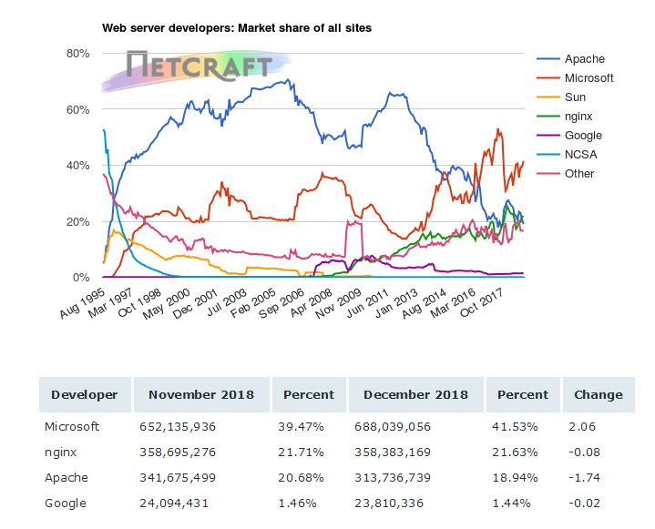


动态网站开发语言主要有: 

* ASP.NET

* PHP

* JSP

php开发的应用可以使用lamp,lnmp来跑,那么JSP开发的应用能用lamp,lnmp跑吗? 答案是否定的。

跑JAVA的web应用服务器软件有:

* Tomcat (apahce软件基金会)
* WebLogic (Oracle公司)
* WebSphere (IBM公司)
* Resin  (CHUCHO公司)
* JBOSS wildfly(redhat)
* Jetty(基于apache开源协议)


# 认识Tomcat

Tomcat是Apache软件基金会（Apache Software Foundation）的Jakarta 项目中的一个核心项目，由Apache,Sun和其他一些公司及个人共同开发而成。

Tomcat是一个免费,开源的Web应用服务器, 相对于其它服务器比较轻量,在中小型系统和并发访问用户不是很多的场合下被普遍使用，是开发和调试JSP程序的首选。

官方网址: http://tomcat.apache.org/

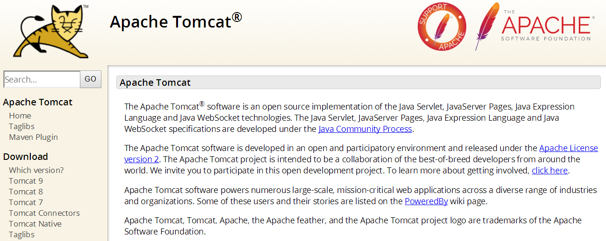


# tomcat安装

tomcat的安装方式分为以下几种:

1. `yum install tomcat`直接安装(centos7默认安装系统后的yum源里就有),目前版本为7.X版本
2. 官方下载源码版编译安装. 这种安装方式复杂,时间长,易出错
3. 官方下载二进制版. 直接解压到linux服务器,设置jdk环境就可以运行了(**==推荐==**)


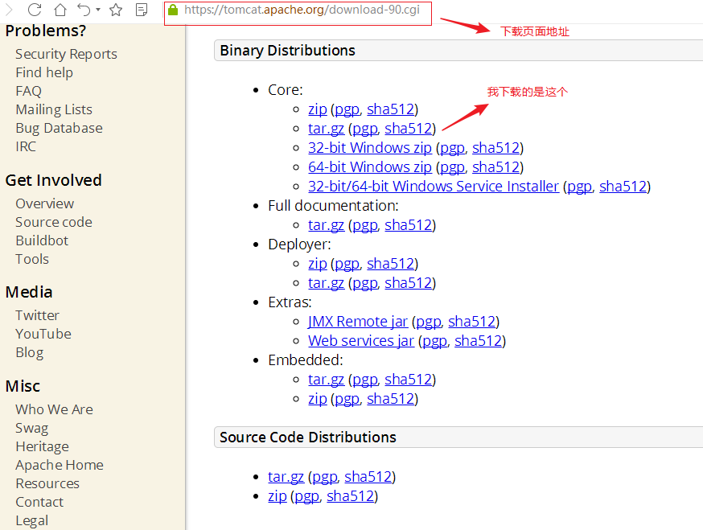


JAVA开发的软件运行前都有一件重要的事件要做: 就是安装**==JDK==**(**java development kit**); 就像运行shell脚本需要bash环境,运行php程序需要安装php才能支持,跑java开发的程序当然就需要JDK的支持了。后面课程我们还会学习python程序和接触到go语言写的程序等，都需要相应的环境支持。

对于运维工程师来说,只要是JAVA开发的软件,我们的步骤都可以简化为这么几步:

1. 安装JDK
2. 安装JAVA应用软件(如mycat,tomcat,jenkins,hadoop,pycharm,elk等)
3. 配置JAVA应用软件里的JDK环境变量,以便能使用你安装好的JDK
4. 运行JAVA应用软件

JDK分为两种:

1. openjdk(yum直接安装就OK)

~~~powershell
# rpm -qa |grep jdk
java-1.8.0-openjdk-headless-1.8.0.161-2.b14.el7.x86_64
java-1.8.0-openjdk-1.8.0.161-2.b14.el7.x86_64
# java -version
openjdk version "1.8.0_161"
OpenJDK Runtime Environment (build 1.8.0_161-b14)
OpenJDK 64-Bit Server VM (build 25.161-b14, mixed mode)
~~~

2. oracle jdk(oracle官方下载)

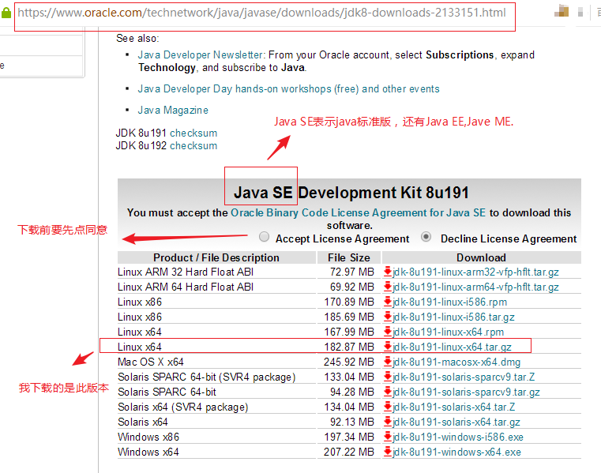


**安装过程**:

1, 将下载好的tomcat,oraclejdk拷贝到服务器上

~~~powershell
[root@vm1 ~]# ls /root/Desktop/
apache-tomcat-9.0.14.tar.gz  jdk-8u191-linux-x64.tar.gz
~~~

2, 解压oraclejdk,我这里解压到/usr/local目录

~~~powershell
[root@vm1 ~]# tar xf /root/Desktop/jdk-8u191-linux-x64.tar.gz -C /usr/local/
[root@vm1 ~]# ls /usr/local/jdk1.8.0_191/
bin             lib          src.zip
COPYRIGHT       LICENSE      THIRDPARTYLICENSEREADME-JAVAFX.txt
include         man          THIRDPARTYLICENSEREADME.txt
javafx-src.zip  README.html
jre             release
~~~

3, 解压tomcat,我这里解压到/usr/local目录

~~~powershell
[root@vm1 ~]# tar xf /root/Desktop/apache-tomcat-9.0.14.tar.gz -C /usr/local/
[root@vm1 ~]# mv /usr/local/apache-tomcat-9.0.14/ /usr/local/tomcat
[root@vm1 ~]# ls /usr/local/tomcat/
bin           CONTRIBUTING.md  logs       RELEASE-NOTES  webapps
BUILDING.txt  lib              NOTICE     RUNNING.txt    work
conf          LICENSE          README.md  temp
~~~

**==注意==**: 现在直接启动tomcat也有可能成功，有可能是使用了linux已经安装的openjdk。但我们现在要使用自己安装的oraclejdk,所以要设置环境变量指定oraclejdk路径。

设置jdk路径的环境变量也有两种方式:

* 设置到/etc/profile这种全局环境变量配置文件里

* 直接配置到tomcat的配置文件里,这样配置的好处是不影响系统上其它的java程序(**==推荐==**)

4, 配置环境变量

~~~powershell
[root@vm1 ~]# vim /usr/local/tomcat/bin/startup.sh 
[root@vm1 ~]# vim /usr/local/tomcat/bin/shutdown.sh 

把startup.sh和shutdown.sh这两个脚本里的最前面(但要在#!/bin/bash下面)加上下面一段

export JAVA_HOME=/usr/local/jdk1.8.0_191/
export TOMCAT_HOME=/usr/local/tomcat
export PATH=$JAVA_HOME/bin:$TOMCAT_HOME/bin:$PATH
~~~

5, 启动tomcat

~~~powershell
[root@vm1 ~]# /usr/local/tomcat/bin/startup.sh 
Using CATALINA_BASE:   /usr/local/tomcat
Using CATALINA_HOME:   /usr/local/tomcat
Using CATALINA_TMPDIR: /usr/local/tomcat/temp	
Using JRE_HOME:        /usr/local/jdk1.8.0_191/		重点注意一下这一行,看jdk路径是否正确
Using CLASSPATH:       /usr/local/tomcat/bin/bootstrap.jar:/usr/local/tomcat/bin/tomcat-juli.jar
Tomcat started.
 
确认启动端口
[root@vm1 ~]# lsof -i:8080
COMMAND  PID USER   FD   TYPE DEVICE SIZE/OFF NODE NAME
java    5548 root   53u  IPv6  63076      0t0  TCP *:webcache (LISTEN)

启动和关闭时，通过查看这个日志来确认是否OK
[root@vm1 ~]# tail -f /usr/local/tomcat/logs/catalina.out
~~~

6, 使用浏览器访问 **http://服务器IP:8080** 验证

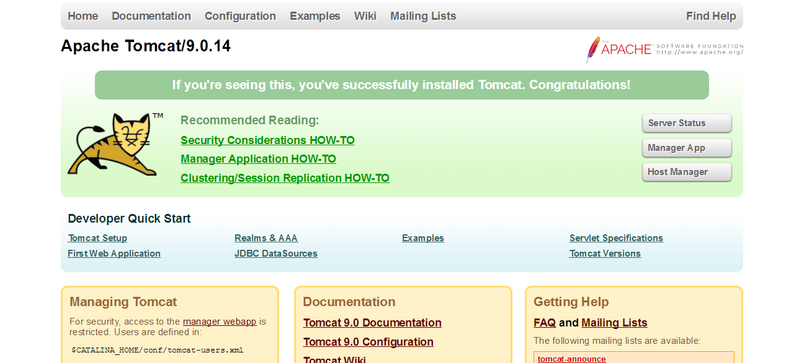


**思考**: 如果设置tomcat开机自动启动?

无论什么语言开发的,无论什么类型的包(rpm包,二进制包,源码包等)，它们的启动方式可能不一样(**在centos6和centos7里服务的启动脚本也不一样了**)。如果我是centos7系统,那么你没有必要去按centos7的服务管理方式去写systemd服务脚本,你只要抓住下面三要素,就能搞定它们的启动。

服务启动三要素:

1. **启动命令**
2. **启动用户**
3. **启动参数**

把tomcat的启动命令/usr/local/tomcat/bin/startup.sh自己写一个服务脚本，或者加到/etc/rc.d/rc.local里。


扩展:

~~~powershell
netstat,lsof -i,ss这几个命令都可以查看是否监听端口
# netstat -ntlup |grep :8080
tcp6       0      0 :::8080                 :::*                    LISTEN      4209/java

# lsof -i:8080
COMMAND  PID USER   FD   TYPE DEVICE SIZE/OFF NODE NAME
java    4209 root   53u  IPv6  48276      0t0  TCP *:webcache (LISTEN)

# ss -anp |grep :8080
tcp    LISTEN     0      100      :::8080                 :::*                   users:(("java",pid=4209,fd=53))
~~~


**tomcat启动方法扩展:**

在以后的docker课程里,自定义tomcat容器,使用/usr/local/tomcat/bin/startup.sh启动不了，需要使用下面的方法才能启动

1,添加jdk

~~~powershell
# vim /usr/local/tomcat/bin/catalina.sh
export JAVA_HOME=/usr/local/jdk1.8.0_191/
export TOMCAT_HOME=/usr/local/tomcat
export PATH=$JAVA_HOME/bin:$TOMCAT_HOME/bin:$PATH

使用上面的方法添加jdk环境变量，或者直接加到/etc/profile里做全局环境变量
~~~

2,启动

~~~powershell
# /usr/local/tomcat/bin/catalina.sh run
~~~


# tomcat配置

## tomcat目录说明

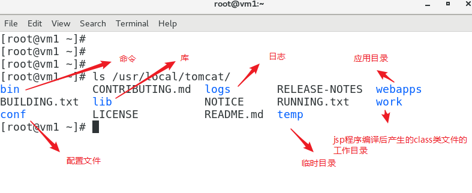

| tomcat下目录名 | 描述                                                   |
| -------------- | ------------------------------------------------------ |
| bin            | 存放启动和关闭Tomcat的脚本文件                         |
| lib            | 存放Tomcat服务器所需的各种jar文件,也就是库文件         |
| conf           | 配置文件目录                                           |
| logs           | 日志文件目录                                           |
| webapps        | tomcat默认存放应用程序的目录，类似apache,nginx的家目录 |
| work           | jsp程序编译后产生的class类文件的工作目录               |
| temp           | 程序临时目录                                           |


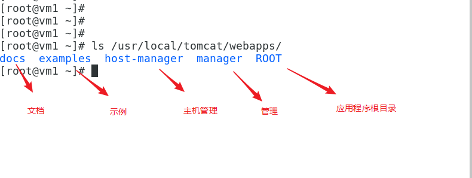

| webapps下子目录名称 | 说明                     |
| ------------------- | ------------------------ |
| docs                | tomcat自带的文档文件     |
| examples            | tomcat自带的一些程序示例 |
| host-manager        | tomcat主机管理应用程序   |
| manager             | tomcat管理应用程序       |
| ROOT                | tomcat应用程序的根目录   |


## 测试jsp程序

### tomcat自带示例测试

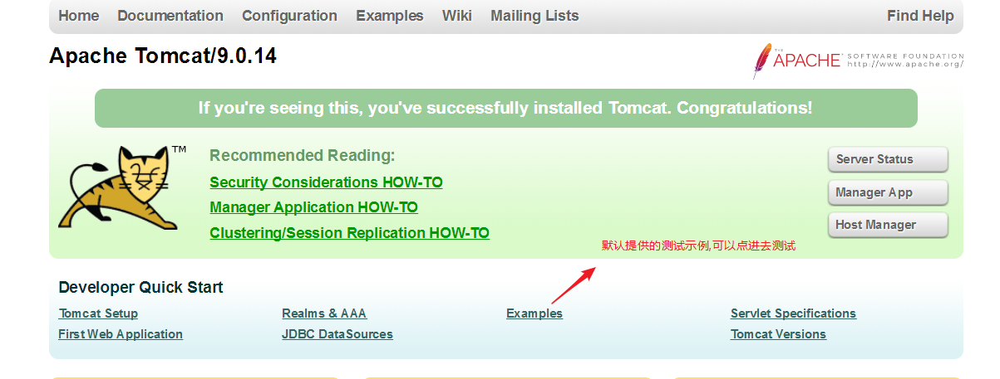

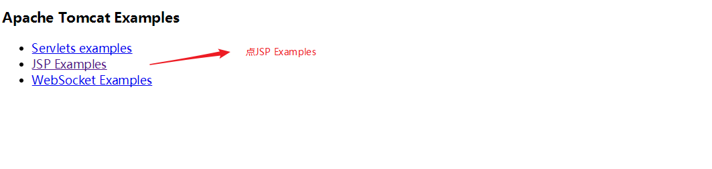

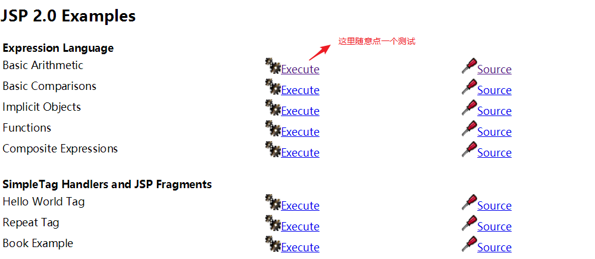

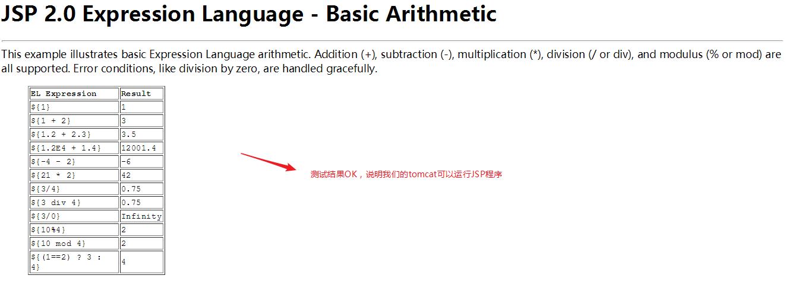

### 自定义程序测试

写一个非常简单的jsp示例,放到tomcat家目录里测试

**==注意==**: 将jsp示例放到/usr/local/tomcat/webapps/下或者/usr/local/tomcat/webapps/ROOT/下都是可行的

~~~powershell
[root@vm1 ~]# mkdir /usr/local/tomcat/webapps/aaa
[root@vm1 ~]# vim /usr/local/tomcat/webapps/aaa/time.jsp
<html>
<body>
<center>
<H1><%=new java.util.Date()%></H1>
</center>
</body>
</html>
[root@vm1 ~]# cp /usr/local/tomcat/webapps/aaa /usr/local/tomcat/webapps/ROOT/bbb -rf
~~~

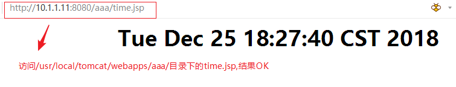

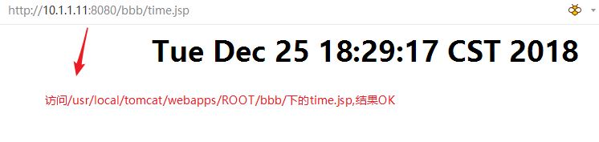

## 服务器状态查看

1, **主页面点server status查看,发现被拒绝**

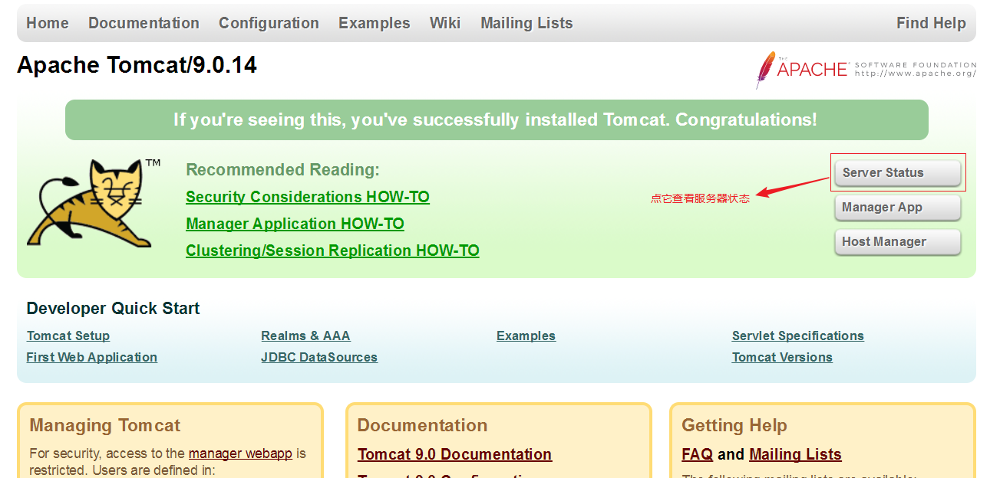

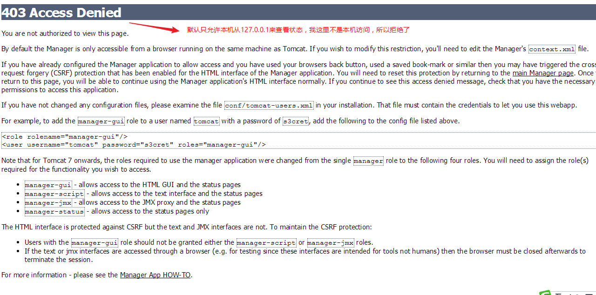

2,**配置去掉只允许本地IP访问的限制**

~~~powershell
将此文件里的19,20行注释,xml的注释格式是  <!--  注释  -->
[root@vm1 ~]# vim /usr/local/tomcat/webapps/manager/META-INF/context.xml 

19   <!--<Valve className="org.apache.catalina.valves.RemoteAddrValve"
20          allow="127\.\d+\.\d+\.\d+|::1|0:0:0:0:0:0:0:1" /> -->
~~~

3,**配置用户名与密码验证**

~~~powershell
在下面配置文件里加上用户名与密码验证(注意:是加到最后一行</tomcat-users>的上面)
[root@vm1 ~]# vim /usr/local/tomcat/conf/tomcat-users.xml 
    <role rolename="manager-gui"/>
    <user username="tomcat" password="123" roles="manager-gui"/>
~~~

4,**回到主页面刷新,然后使用配置的用户名与密码登录**

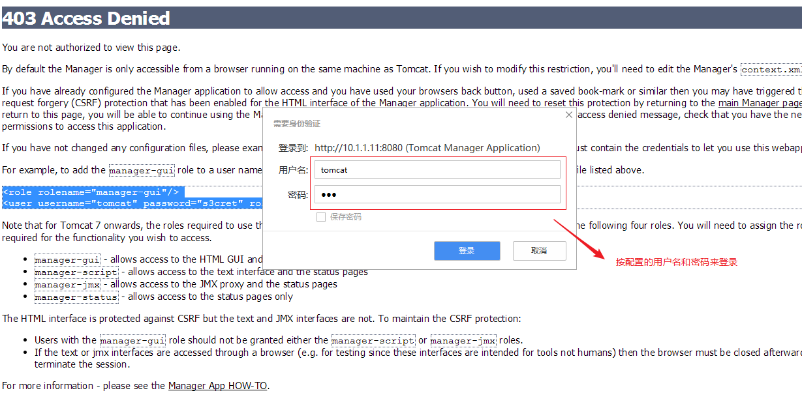

5,**最终得到状态页面**


## 应用管理(了解)

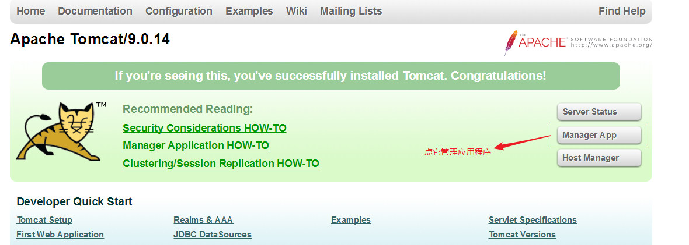

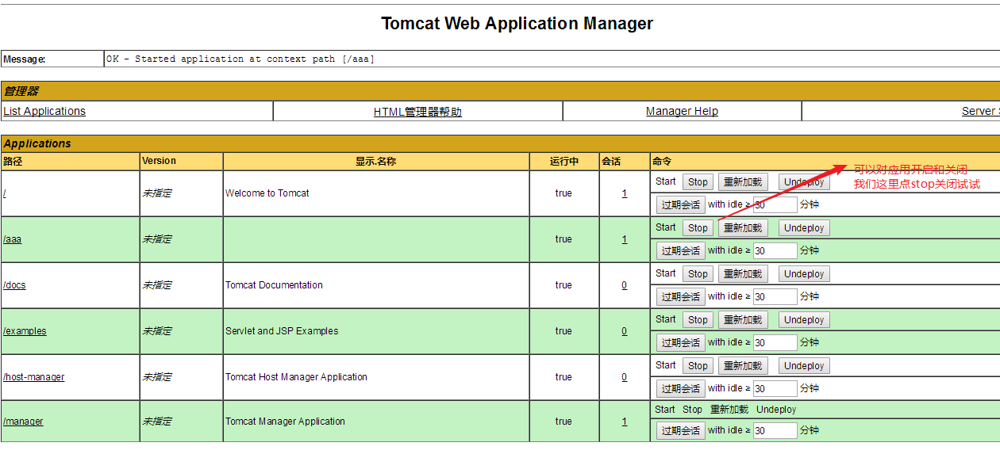

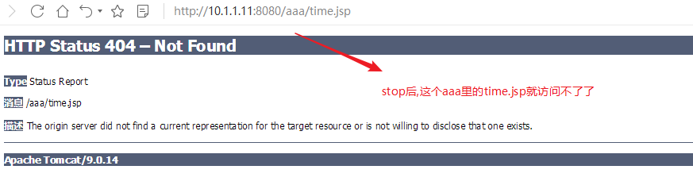

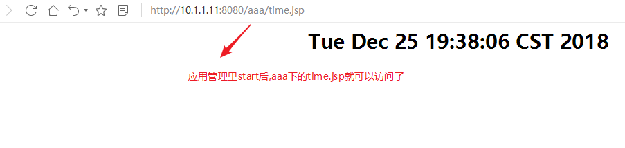

## 修改监听端口方法

~~~powershell
[root@vm1 ~]# vim /usr/local/tomcat/conf/server.xml 
 69     <Connector port="80" protocol="HTTP/1.1"			这里把8080改为你想要改的端口
 70                connectionTimeout="20000"
 71                redirectPort="8443" />
[root@vm1 ~]# /usr/local/tomcat/bin/shutdown.sh
[root@vm1 ~]# /usr/local/tomcat/bin/startup.sh
[root@vm1 ~]# lsof -i:80
COMMAND  PID USER   FD   TYPE DEVICE SIZE/OFF NODE NAME
java    8482 root   53u  IPv6  94283      0t0  TCP *:http (LISTEN)
~~~


# tomcat部署应用

## 部署开源应用

开源分为:

1. 完全开源
2. 商业开源(就是有开源的版本,但功能不全.付费可以使用商业版本,功能更强大)

完全开源的Java应用太少了,一些老的开源应用也不再更新了。这里我是用一个商业开源软件的开源版本来演示一下应用部署(大家以此来举一反三)

1, 解压jspxcms

```powershell
解压之前先删除原来家目录里的文件
[root@vm1 ~]# rm /usr/local/tomcat/webapps/ROOT/*  -rf
[root@vm1 ~]# unzip jspxcms-5.2.4-release.zip -d /usr/local/tomcat/webapps/
```

2, 安装mariadb,建库并进行授权


```powershell
# yum install mariadb-server -y
# systemctl restart mariadb.service
# systemctl status mariadb.service
# systemctl enable mariadb.service

# mysql
MariaDB [(none)]> create database jspxcms;
Query OK, 1 row affected (0.00 sec)

MariaDB [(none)]> grant all on jspxcms.* to 'daniel'@'localhost' identified by '123';
Query OK, 0 rows affected (0.00 sec)

MariaDB [(none)]> flush privileges;
```

3, 浏览器访问 **http://服务器IP/** 进行安装(这里我前面改端口为80了,所以后面不用加8080)

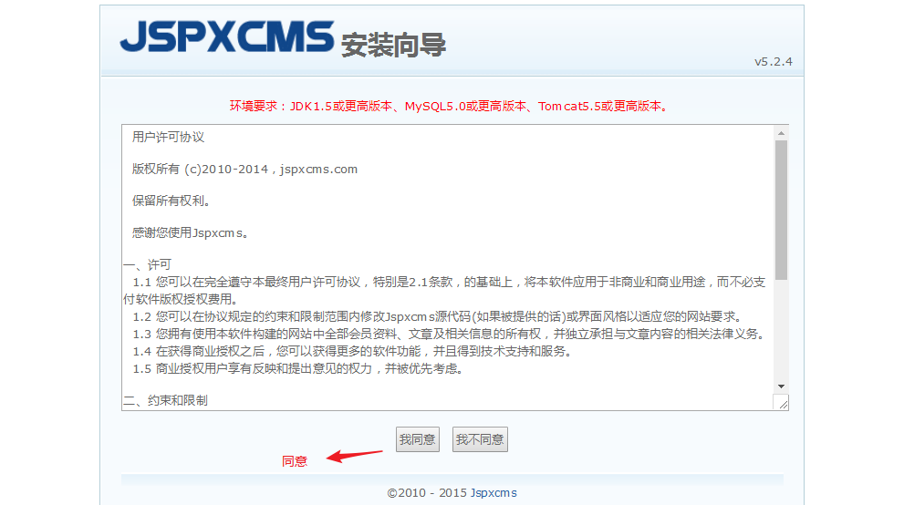

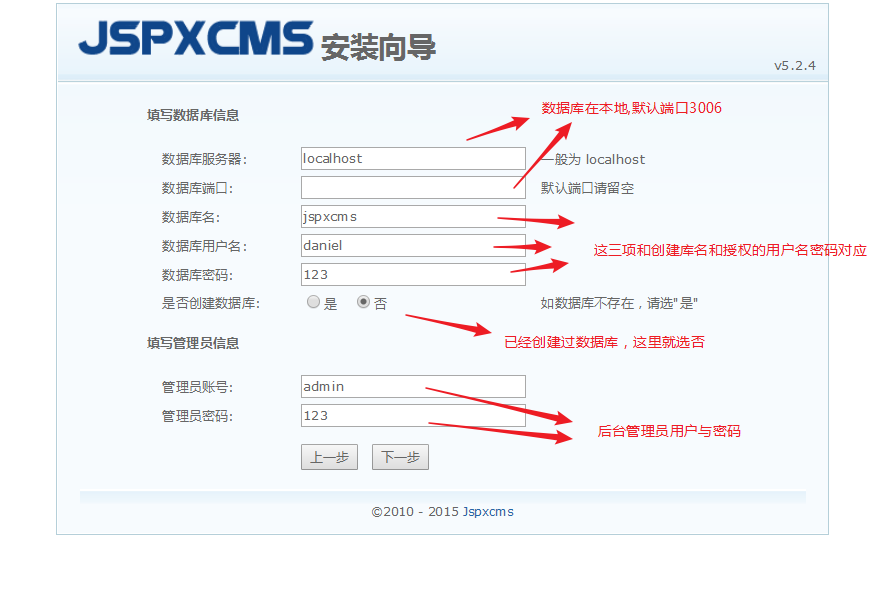

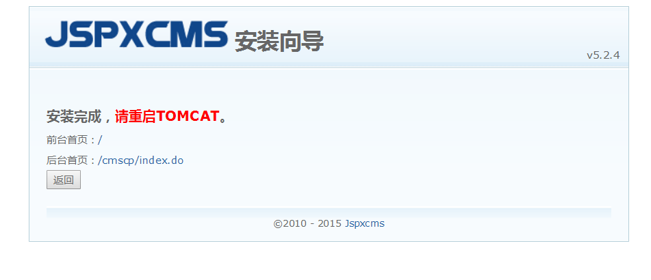

4, 重启tomcat服务

~~~powershell
[root@vm1 ~]# /usr/local/tomcat/bin/shutdown.sh 
[root@vm1 ~]# /usr/local/tomcat/bin/startup.sh 
~~~

5, 使用浏览器访问 **http://服务器IP/** 访问前台或 **http://服务器IP/cmscp/index.do**访问后台测试


## 部署公司开发的应用

公司的开发人员开发好应用后,有时候会打包成**==.war==**结尾的包.

只要tomcat启动状态,把war包直接拷贝到/usr/local/tomcat/webapps/下就可以自动解压


# tomcat架构介绍

上面讨论的都是单台tomcat服务器。如果单实例tomcat顶不住压力,怎么办?

1. 优化(内存,cpu,io,网络,内核参数等)或换更好的硬件服务器,但提升有限。

2. 用更适合于大型环境的软件,如weblogic,websphere等.(这不是我们本课程所讨论的)

3. **==使用多台tomcat服务器做负载均衡集群==**

下面我们讨论多台tomcat的架构

负载均衡集群主要要关注5个方面:

1. **调度软件**		apache也可以用于调度tomcat(apache+tomcat+mod_jk架构),只不过现在更流行使用nginx
2. **调度算法**         nginx算法不多(rr,wrr,fair,url_hash,ip_hash),不考虑使用算法来做会话保持的话,rr或wrr就足够
3. **健康检查**         nginx默认就会检查后端tomcat健康情况.( 后端一台tomcat挂掉,nginx会调整算法不调度它)
4. **数据一致**        通过rsync实时同步或nfs共享(存储课程会继续讨论其它方法来实现数据一致)
5. **会话保持**        nginx的ip_hash算法就可以(简单方便),当然也有其它方法来实现(下面会拓展)


tomcat对静态文件和高并发的处理比较弱,所以会使用**==动静分离==**加**==负载均衡==**结合的架构方式。

nginx+tomcat架构中nginx处理静态资源,动态的.jsp程序则通过调度算法调给后端多台tomcat. 使用ip_hash算法实现会话保持

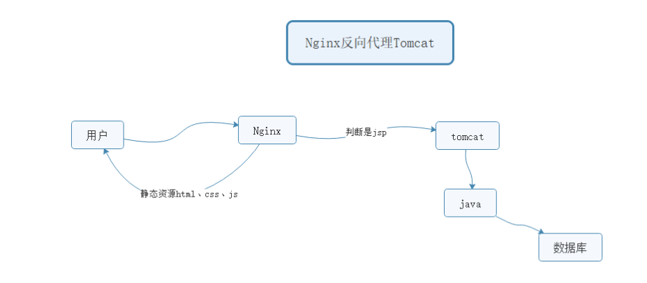


# nginx+tomcat架构

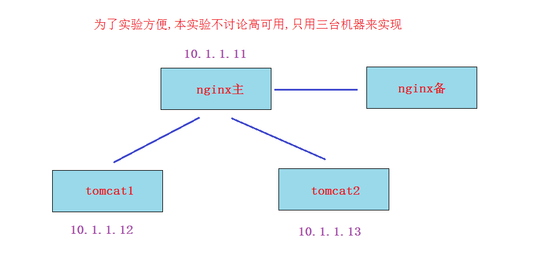

**实验准备**:

三台虚拟机恢复快照(**也就是说我这里完全三台崭新的centos7**)

1, 静态ip

~~~powershell
10.1.1.11       vm1.cluster.com		nginx
10.1.1.12       vm2.cluster.com		tomcat1
10.1.1.13       vm3.cluster.com		tomcat2
~~~

2, 主机名绑定

3, 关闭防火墙和selinux

4, 时间同步

5, yum源(centos安装完系统后的默认yum源就OK)


**实验过程**:

**第1步: 在所有tomcat节点(tomcat1和tomcat2)上安装tomcat,配置环境变量,并启动服务**

~~~powershell
过程省略,参考前面笔记
~~~

**第2步: 在nginx服务器上安装nginx**

~~~powershell
[root@vm1 ~]# yum install epel-release -y
[root@vm1 ~]# yum install nginx  -y
~~~

**第3步: 在nginx服务器上配置nginx**

~~~powershell
[root@vm1 ~]# vim /etc/nginx/nginx.conf
将下面一段加到http {}配置段里但是不要在server {}配置段里
upstream tomcat {
	server 10.1.1.12:8080 weight=1;
	server 10.1.1.13:8080 weight=1;
}

把server {}配置段里下面一段修改
    location / {
        }
修改成
	location ~ .*\.jsp$ {
	    proxy_pass   http://tomcat;
        proxy_set_header Host $host;
        proxy_set_header X-Forwarded-For $remote_addr;
	}
~~~

最终结果如图所示:

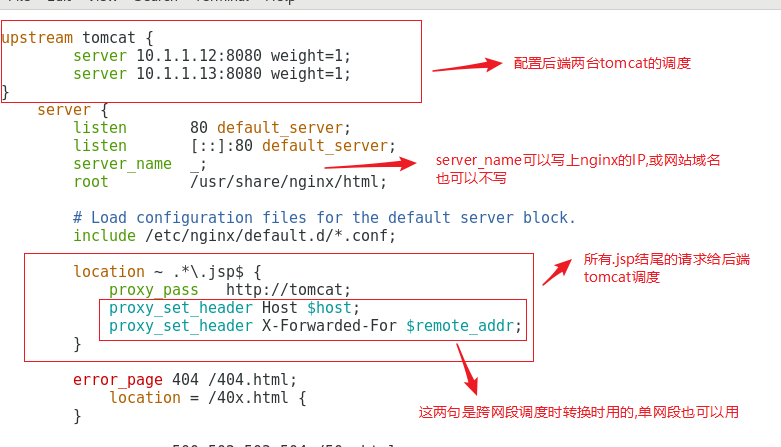

**第4步: 启动nginx服务**

~~~powershell
[root@vm1 ~]# systemctl restart nginx
[root@vm1 ~]# systemctl enable nginx
~~~

**第5步: 在各自家目录里创建测试文件**

**==注意==**: 生产环境中,nginx和所有tomcat节点的家目录数据应该一致(因为它们合起来是做一个web应用)。

我这里手动创建文件测试

~~~powershell
[root@vm1 ~]# echo nginx > /usr/share/nginx/html/1.html
[root@vm1 ~]# echo nginx > /usr/share/nginx/html/1.jsp

[root@vm2 ~]# echo tomcat1 > /usr/local/tomcat/webapps/ROOT/1.html
[root@vm2 ~]# echo tomcat1 > /usr/local/tomcat/webapps/ROOT/1.jsp

[root@vm3 ~]# echo tomcat2 > /usr/local/tomcat/webapps/ROOT/1.html
[root@vm3 ~]# echo tomcat2 > /usr/local/tomcat/webapps/ROOT/1.jsp
~~~

**第6步: 使用浏览器访问测试**

访问http://10.1.1.11/1.html得到的结果只会是nginx

访问http://10.1.1.11/1.jsp得到的结果会是tomcat1和tomcat2的轮循

说明:nginx+tomcat的动静分离与负载均衡就成功了

**第7步:使用ip_hash算法实现会话保持**

~~~powershell
[root@vm1 ~]# vim /etc/nginx/nginx.conf
upstream tomcat {
        ip_hash;					在这段配置里加上这一句
        server 10.1.1.12:8080 weight=1;
        server 10.1.1.13:8080 weight=1;
}
[root@vm1 ~]# systemctl restart nginx
~~~

**第8步: 再次使用浏览器访问测试**

访问http://10.1.1.11/1.html得到的结果仍然是nginx

访问http://10.1.1.11/1.jsp得到的结果如果第一次访问的是tomcat1, 那么同一个网段的客户端的后续访问都会是tomcat1


# nginx+tomcat+MSM(拓展)

nginx+tomcat会话保持解决方案:

* **nginx的ip_hash算法**(其它的负载均衡软件也有类似算法:如**LVS的sh算法**;**haproxy的source算法**)

~~~powershell
优点:配置最简单
缺点:后端tomcat宕机,用户session会丢失
~~~

* **tomcat的session复制集群**   参考: https://tomcat.apache.org/tomcat-9.0-doc/cluster-howto.html

~~~powershell
优点:后端tomcat宕机,用户session不丢失
缺点:使用组播将信息复制到多个tomcat节点，网络开销大
~~~

* **缓存集中式管理session,利用memcache或redis将session信息缓存**

~~~powershell
优点:只要缓存服务器没问题,用户session不会丢.也没有额外的网络开销
缺点:太依赖缓存服务器;需要额外的缓存服务器,成本也高;当然要求维护人员技术水平也较高。
适合于性能要求高的大型环境.
~~~

实现MSM(memcached-session-manager) ,简单来说就是把负载均衡给多台tomcat的会话信息保存在缓存服务器memcache中实现在负载均衡调度时还能保持会话一致。

参考: https://github.com/magro/memcached-session-manager/wiki/SetupAndConfiguration

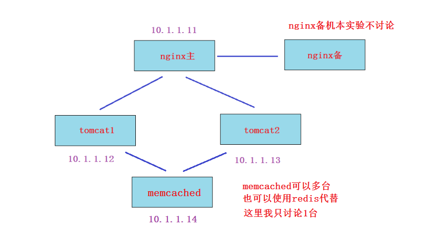

**实验准备**:

在上面实验的基础上再加一台机器做memcached服务器

1, 静态ip

~~~powershell
10.1.1.11       vm1.cluster.com		nginx
10.1.1.12       vm2.cluster.com		tomcat1
10.1.1.13       vm3.cluster.com		tomcat2
10.1.1.14		vm4.cluster.com		memcached
~~~

2, 主机名绑定

3, 关闭防火墙和selinux

4, 时间同步

5, yum源(centos安装完系统后的默认yum源就OK)


**实验过程**:

**第1步: 在所有tomcat节点(tomcat1和tomcat2)上安装tomcat,配置环境变量,并启动服务**

~~~powershell
过程省略,参考前面笔记
~~~

**第2步: 在nginx服务器上安装nginx**

~~~powershell
[root@vm1 ~]# yum install epel-release -y
[root@vm1 ~]# yum install nginx  -y
~~~

**第3步: 在nginx服务器上配置nginx**

~~~powershell
将下面一段加到http {}配置段里但是不要在server {}配置段里
upstream tomcat {
	server 10.1.1.12:8080 weight=1;
	server 10.1.1.13:8080 weight=1;
}

把server {}配置段里下面一段修改
    location / {
        }
修改成
	location ~ .*\.jsp$ {
	    proxy_pass   http://tomcat;
            proxy_set_header Host $host;
            proxy_set_header X-Forwarded-For $remote_addr;
	}
~~~

最终结果如图所示:


**第4步: 启动nginx服务**

~~~powershell
[root@vm1 ~]# systemctl restart nginx
[root@vm1 ~]# systemctl enable nginx
~~~

**第5步: 在各自家目录里创建测试文件**

**==注意==**: 生产环境中,nginx和所有tomcat节点的家目录数据应该一致(因为它们合起来是做一个web应用)。

我这里手动创建文件测试

~~~powershell
[root@vm1 ~]# echo nginx > /usr/share/nginx/html/1.html
[root@vm1 ~]# echo nginx > /usr/share/nginx/html/1.jsp

[root@vm2 ~]# echo tomcat1 > /usr/local/tomcat/webapps/ROOT/1.html
[root@vm2 ~]# echo tomcat1 > /usr/local/tomcat/webapps/ROOT/1.jsp

[root@vm3 ~]# echo tomcat2 > /usr/local/tomcat/webapps/ROOT/1.html
[root@vm3 ~]# echo tomcat2 > /usr/local/tomcat/webapps/ROOT/1.jsp
~~~

**第6步: 使用浏览器访问测试**

访问http://10.1.1.11/1.html得到的结果只会是nginx

访问http://10.1.1.11/1.jsp得到的结果会是tomcat1和tomcat2的轮循

说明:nginx+tomcat的动静分离与负载均衡就成功了

**实验过程**:

第1步: 在**所有tomcat节点**(tomcat1和tomcat2)的家目录里创建一个显示session信息的代码文件

~~~powershell
文件内容一模一样
[root@vm2 ~]# vim /usr/local/tomcat/webapps/ROOT/session.jsp
SessionID:<%=session.getId()%> <BR>
SessionIP:<%=request.getServerName()%> <BR>
SessionPort:<%=request.getServerPort()%>
[root@vm3 ~]# vim /usr/local/tomcat/webapps/ROOT/session.jsp
SessionID:<%=session.getId()%> <BR>
SessionIP:<%=request.getServerName()%> <BR>
SessionPort:<%=request.getServerPort()%>
~~~

第2步: 去掉nginx里的ip_hash算法,然后重启服务并测试

~~~powershell
注释或删除ip_hash这一句
[root@vm1 ~]# vim /etc/nginx/nginx.conf
upstream tomcat {
#       ip_hash;				
        server 10.1.1.12:8080 weight=1;
        server 10.1.1.13:8080 weight=1;
}
[root@vm1 ~]# systemctl restart nginx
~~~

使用浏览器访问http://10.1.1.11/session.jsp测试

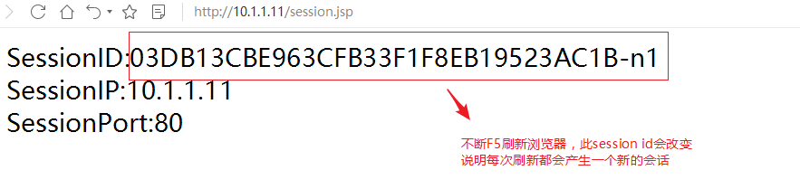

第3步: 下载MSM相关的jar包,并拷贝到**所有tomcat节点**的/usr/local/tomcat/lib/目录下

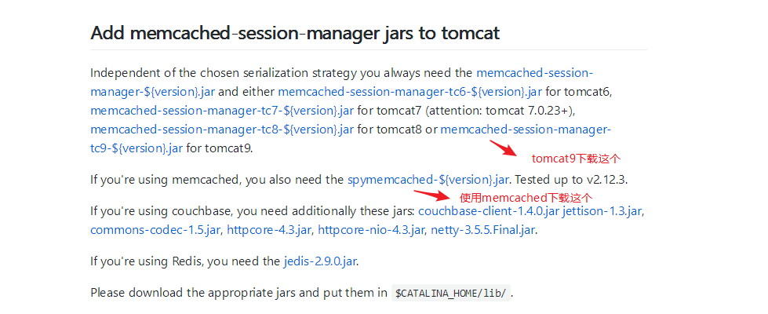

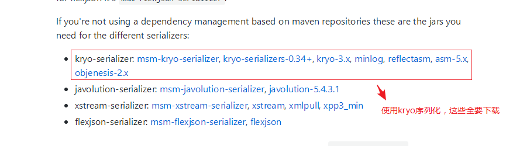

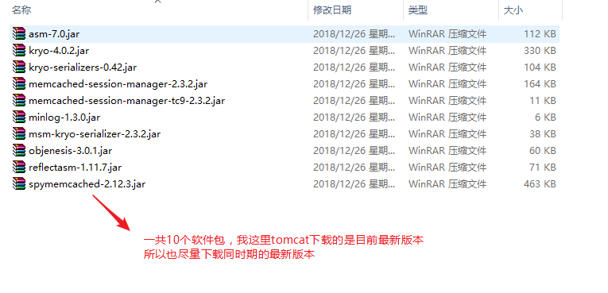

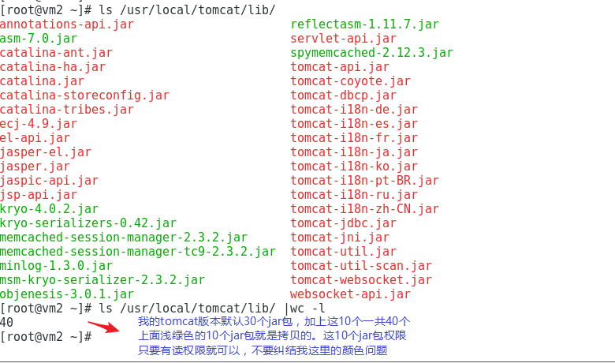

第4步: 确认jar包都拷贝完成后,配置**所有tomcat节点**(tomcat1和tomcat2都一样配置)

~~~xml
把下面一段加到context.xml配置文件最后一行前面; 也就是<Context>  </Context>标签中间

# vim /usr/local/tomcat/conf/context.xml

<Manager className="de.javakaffee.web.msm.MemcachedBackupSessionManager"
  memcachedNodes="n1:10.1.1.14:11211"					把ip替换成你自己的memcached服务器ip
  lockingMode="auto"
  sticky="false"
  requestUriIgnorePattern= ".*\.(png|gif|jpg|css|js)$"  
  sessionBackupAsync= "false"  
  sessionBackupTimeout= "100"  
  copyCollectionsForSerialization="true"  
  transcoderFactoryClass="de.javakaffee.web.msm.serializer.kryo.KryoTranscoderFactory" />
~~~


第5步: **所有tomcat节点**重启tomcat服务

~~~powershell
# /usr/local/tomcat/bin/shutdown.sh 
# /usr/local/tomcat/bin/startup.sh 
~~~

第6步: 在memcached服务器上安装,并启动服务

~~~powershell
[root@vm4 ~]# yum install memcached -y
[root@vm4 ~]# systemctl restart memcached
[root@vm4 ~]# systemctl enable memcached

[root@vm4 ~]# lsof -i:11211
COMMAND    PID      USER   FD   TYPE DEVICE SIZE/OFF NODE NAME
memcached 4224 memcached   26u  IPv4  44869      0t0  TCP *:memcache (LISTEN)
memcached 4224 memcached   27u  IPv6  44870      0t0  TCP *:memcache (LISTEN)
memcached 4224 memcached   28u  IPv4  44873      0t0  UDP *:memcache 
memcached 4224 memcached   29u  IPv6  44874      0t0  UDP *:memcache 
~~~

第7步: 使用浏览器访问测试

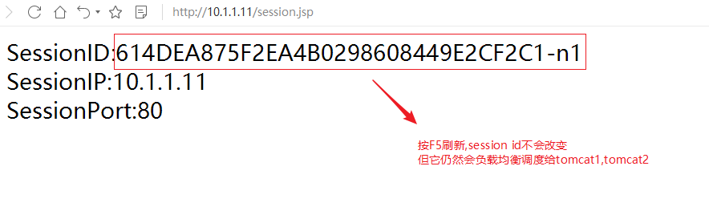

~~~powershell
memcached服务器上也可以dump帮忙相应的session信息
[root@vm4 ~]# echo "stats cachedump 3 0" | nc 10.1.1.14 11211 > /tmp/session.txt
[root@vm4 ~]# cat /tmp/session.txt 
ITEM validity:614DEA875F2EA4B0298608449E2CF2C1-n1 [20 b; 1545821714 s]
END
~~~

**注意**: 不要使用elinks客户端测试,elinks访问的话session id是会变的

~~~powershell
# yum install elinks -y
# elinks -dump 10.1.1.11/session.jsp
   SessionID:CE19FEBEE90CBF4E00F8D5D17ED005E5-n1
   SessionIP:10.1.1.11
   SessionPort:80
# elinks -dump 10.1.1.11/session.jsp
   SessionID:072C34F057FDCCD077D5F7193A5193D8-n1
   SessionIP:10.1.1.11
   SessionPort:80
elinks访问的话session id是会变的
~~~

