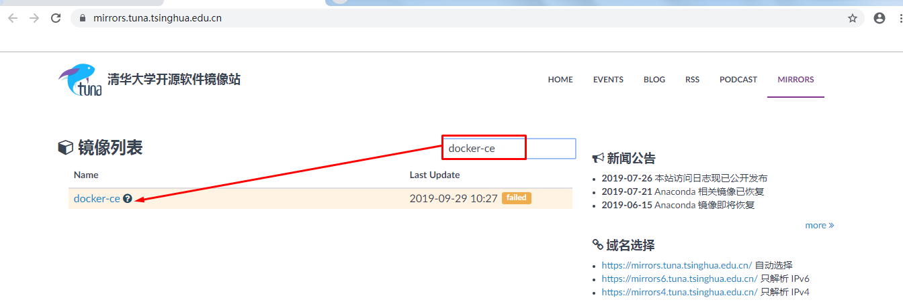
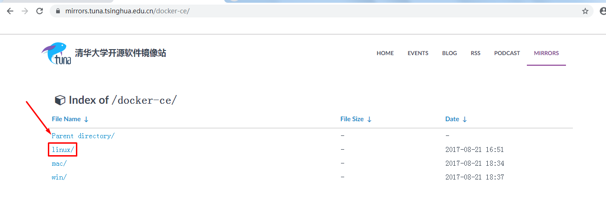
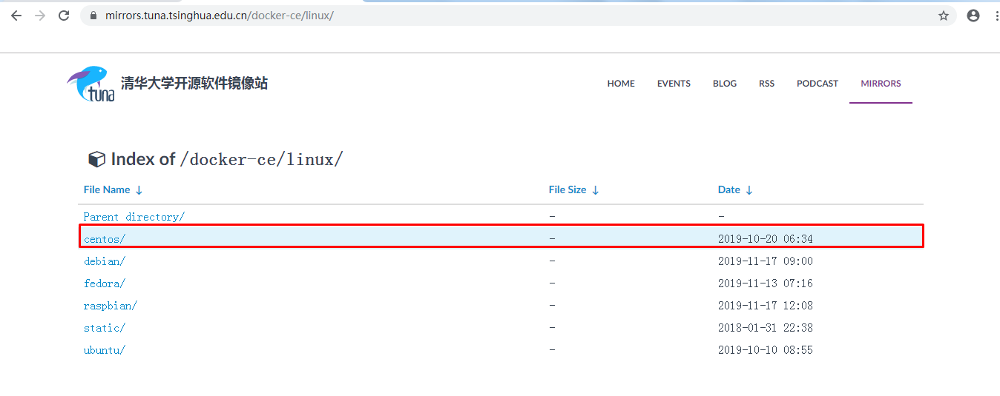
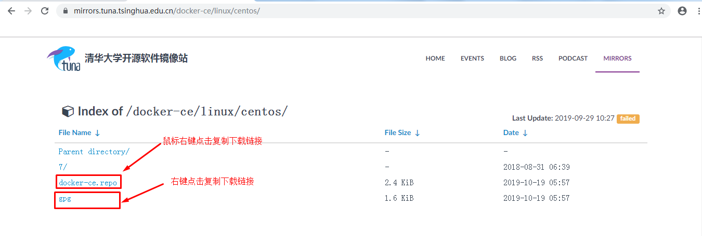

# Linux系统YUM源配置-网络YUM源

## 一、完成docker-ce YUM配置

~~~powershell
下载docker-ce.repo
[root@localhost ~]# wget -O /etc/yum.repos.d/docker-ce.repo https://mirrors.tuna.tsinghua.edu.cn/docker-ce/linux/centos/docker-ce.repo

验证方法一：
[root@localhost ~]# ls /etc/yum.repos.d/
Centos-7.repo  docker-ce.repo

验证方法二：
[root@localhost ~]# yum repolist
Loaded plugins: aliases, changelog, fastestmirror, kabi, ovl, presto, refresh-
              : packagekit, security, tmprepo, verify, versionlock
Loading support for CentOS kernel ABI
Loading mirror speeds from cached hostfile
 * base: mirrors.aliyun.com
 * extras: mirrors.aliyun.com
 * updates: mirrors.aliyun.com
repo id                  repo name                                        status
base                     CentOS-6 - Base - mirrors.aliyun.com             6,713
docker-ce-stable         Docker CE Stable - x86_64                           63
extras                   CentOS-6 - Extras - mirrors.aliyun.com              46
updates                  CentOS-6 - Updates - mirrors.aliyun.com            770
repolist: 7,592

导入gpp
[root@localhost ~]# rpm --import https://mirrors.tuna.tsinghua.edu.cn/docker-ce/linux/centos/gpg
~~~

# 二、把系统自带的YUM源修改为163YUM源

~~~powershell
备份原有的YUM源
方法一：
[root@localhost ~]# cd /etc/yum.repos.d/
[root@localhost yum.repos.d]# ls
Centos-7.repo  docker-ce.repo
[root@localhost yum.repos.d]# mv Centos-7.repo Centos-7.repo.bak
[root@localhost yum.repos.d]# ls
Centos-7.repo.bak  docker-ce.repo

方法二：
[root@localhost yum.repos.d]# pwd
/etc/yum.repos.d
[root@localhost yum.repos.d]# ls
Centos-7.repo  docker-ce.repo
[root@localhost yum.repos.d]# mkdir /root/reposbak
[root@localhost yum.repos.d]# mv *.repo /root/reposbak/
[root@localhost yum.repos.d]# ls
[root@localhost yum.repos.d]# ls /root/reposbak/
Centos-7.repo  docker-ce.repo

~~~

~~~powershell
获取163YUM
[root@localhost ~]# wget -O /etc/yum.repos.d/CentOS6-Base-163.repo http://mirrors.163.com/.help/CentOS6-Base-163.repo
--2019-11-21 06:10:21--  http://mirrors.163.com/.help/CentOS6-Base-163.repo
Resolving mirrors.163.com... 59.111.0.251
Connecting to mirrors.163.com|59.111.0.251|:80... connected.
HTTP request sent, awaiting response... 200 OK
Length: 2006 (2.0K) [application/octet-stream]
Saving to: “/etc/yum.repos.d/CentOS6-Base-163.repo”

100%[======================================>] 2,006       --.-K/s   in 0.001s

2019-11-21 06:10:21 (3.17 MB/s) - “/etc/yum.repos.d/CentOS6-Base-163.repo” saved [2006/2006]

[root@localhost ~]# ls /etc/yum.repos.d/
CentOS6-Base-163.repo
[root@localhost ~]# yum repolist
Loaded plugins: aliases, changelog, fastestmirror, kabi, ovl, presto, refresh-
              : packagekit, security, tmprepo, verify, versionlock
Loading support for CentOS kernel ABI
Loading mirror speeds from cached hostfile
repo id                   repo name                                       status
base                      CentOS-6 - Base - 163.com                       6,713
extras                    CentOS-6 - Extras - 163.com                        46
updates                   CentOS-6 - Updates - 163.com                      770
repolist: 7,529

~~~

~~~powershell
[root@localhost ~]# yum clean all
Loaded plugins: aliases, changelog, fastestmirror, kabi, ovl, presto, refresh-
              : packagekit, security, tmprepo, verify, versionlock
Loading support for CentOS kernel ABI
Cleaning repos: base extras updates
Cleaning up Everything
Cleaning up list of fastest mirrors
0 delta-package files removed, by presto
[root@localhost ~]# yum makecache
Loaded plugins: aliases, changelog, fastestmirror, kabi, ovl, presto, refresh-
              : packagekit, security, tmprepo, verify, versionlock
Loading support for CentOS kernel ABI
Determining fastest mirrors
base                                                     | 3.7 kB     00:00
base/group_gz                                            | 242 kB     00:00
base/filelists_db                                        | 6.4 MB     00:06
base/primary_db                                          | 4.7 MB     00:04
base/other_db                                            | 2.8 MB     00:03
extras                                                   | 3.4 kB     00:00
extras/filelists_db                                      |  24 kB     00:00
extras/prestodelta                                       | 2.2 kB     00:00
extras/primary_db                                        |  29 kB     00:00
extras/other_db                                          |  14 kB     00:00
updates                                                  | 3.4 kB     00:00
updates/filelists_db                                     | 5.2 MB     00:04
updates/prestodelta                                      | 258 kB     00:00
updates/primary_db                                       | 7.5 MB     00:07
updates/other_db                                         | 330 kB     00:00
Metadata Cache Created

~~~

