# 学习目标

- [ ] 能够说出hdfs的核心项目
- [ ] 能够实现hadoop的单机部署
- [ ] 能够实现hadoop伪分布式部署
- [ ] 能够实现hadoop完全分布式+HA部署
- [ ] 能够通过ambari实现hadoop自动部署

# 大数据介绍

**什么是大数据?**

答: 通俗点说就是对大量的数据进行分析(不是抽样调查)，得到有用的信息结果。比如: 要统计国内大学生都喜欢玩哪些游戏，不能只是随便跑几所大学然后抽样调查问几个大学生就得到最终结论，而是要采集**==所有数据==**进行分析处理(当然也不是真的让你把全国所有大学的所有大学生都去问一遍)。

定义: 大数据是收集、整理、处理大容量数据集，并从中获得结果的技术总称。

**为什么使用大数据技术？**

- 数据量越来越大
- 数据分析的实时性越来越强
- 数据结果的应用越来越广泛

**数据的来源?**

答: 数据的来源很多种. 比如:通过用户访问网站与应用程序的行为(如你用wechat或支付宝的消费数据).

**大数据应用领域**

广告
- 广告投放
- 广告策略

电信
- 深度包检测
- 网络质量

金融
- 风险识别
- 预测

能源生物
- 基因组分析
- 地质分析

安全
- 入侵检测
- 图像识别

社交游戏
- 流失分析
- 社交推荐
- 使用分析

电商零售
- 推荐系统
- 交易分析

大数据职业:

* 大数据运维
* 大数据开发
* 大数据分析

# hadoop生态圈

##Hadoop历史

​	雏形开始于2002年的Apache的Nutch，Nutch是一个开源Java 实现的搜索引擎。它提供了我们运行自己的搜索引擎所需的全部工具。包括全文搜索和Web爬虫。

​	随后在2003年Google发表了一篇技术学术论文谷歌文件系统（GFS）。GFS也就是google File System，google公司为了存储海量搜索数据而设计的专用文件系统。

​	2004年Nutch创始人Doug Cutting基于Google的GFS论文实现了分布式文件存储系统名为NDFS。

​	2004年Google又发表了一篇技术学术论文MapReduce。MapReduce是一种编程模型，用于大规模数据集（大于1TB）的并行分析运算。

​	2005年Doug Cutting又基于MapReduce，在Nutch搜索引擎实现了该功能。

​	2006年，Yahoo雇用了Doug Cutting，Doug Cutting将NDFS和MapReduce升级命名为Hadoop, Yahoo开建了一个独立的团队给Goug Cutting专门研究发展Hadoop。

Google和Yahoo对Hadoop的贡献功不可没。

## 项目定义

- Apache™Hadoop®项目用于可靠，可扩展的分布式计算的开源软件。

- Apache Hadoop是一个大数据处理框架，允许使用简单的编程模型跨计算机集群分布式处理大型数据集。

- Apache Hadoop可以从单个服务器扩展到数千台计算机
- Apache Hadoop集群中每台计算机都提供本地计算和存储。
- Apache Hadoop集群不是依靠硬件来提供高可用性，而是设计了用于检测和处理应用程序层的故障，从而在计算机集群之上提供高可用性服务。

总结：

- 开源软件
- 大数据处理架构
- 单台服务可以，数千台服务器也可以
- 每台服务器都存自己的数据及运算自己的数据
- 集群支持高可用

## 核心项目

- Hadoop分布式文件系统（HDFS™）：一种分布式文件系统，可提供对应用程序数据的高吞吐量访问。
- Hadoop YARN：作业调度和集群资源管理的框架。
- Hadoop MapReduce：基于YARN的系统，用于并行处理大型数据集。

## 相关项目

​	Apache的其他Hadoop相关项目包括：

- Hadoop Common：支持其他Hadoop模块的常用实用程序。
- Hadoop Ozone： Hadoop集群所提供的对象存储。

- Ambari™

  - 基于Web的工具，用于配置，管理和监控Apache Hadoop集群，包括对Hadoop HDFS，Hadoop MapReduce，Hive，HCatalog，HBase，ZooKeeper，Oozie，Pig和Sqoop的支持。

  - Ambari还提供了一个用于查看集群运行状况的仪表板，例如热图，以及可视化查看MapReduce，Pig和Hive应用程序的功能，以及以用户友好的方式诊断其性能特征的功能。

- Avro™

  ​	数据序列化系统。

- Cassandra™

  ​	可扩展的多主数据库，没有单点故障。

- Chukwa™

  ​	用于管理大型分布式系统的数据收集系统。

- HBase™

  ​	可扩展的分布式数据库，支持大型表的结构化数据存储。

- Hive™

  ​	一种数据仓库基础架构，提供数据汇总和即时查询。

- Mahout™

  ​	可扩展的机器学习和数据挖掘库。

- Pig™

  ​	用于并行计算的高级数据流语言和执行框架。

- Spark™：

  ​	用于Hadoop数据的快速通用计算引擎。Spark提供了一种简单而富有表现力的编程模型，支持广泛的应用程序，包括ETL，机器学习，流处理和图形计算。

- Tez™

  ​	基于Hadoop YARN构建的通用数据流编程框架，它提供了一个功能强大且灵活的引擎，可以执行任意DAG任务来处理批量和交互式用例的数据。Tez正在被Hadoop生态系统中的Hive™，Pig™和其他框架以及其他商业软件（例如ETL工具）采用，以取代Hadoop™MapReduce作为底层执行引擎。

- ZooKeeper™

  ​	用于分布式应用程序的高性能协调服务。

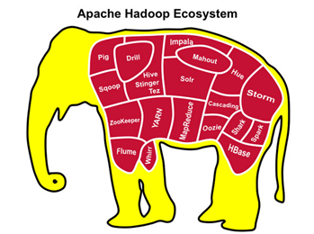

总结：

- 核心项目  hdfs mapreduce yarn

  

# HDFS介绍

- Hadoop的基础核心就是HDFS和MapReduce
- Hadoop旗下有很多经典子项目，比如HBase、Hive等，这些都是基于HDFS和MapReduce发展出来的。要想了解Hadoop，就必须知道HDFS和MapReduce是什么。

## hdfs定义与特点

- HDFS（Hadoop Distributed File System，Hadoop分布式文件系统）
- 它是一个高度容错性的系统
- 它适合部署在廉价的机器上
- 它能提供高吞吐量的数据访问
- 它适合那些有着超大数据集（large data set）的应用程序

> 超大数据集指的是：海量数据分析、机器学习等

**主要特点有:**

支持大数据文件

​	   非常适合上TB级别的大文件或者一堆大数据文件的存储，如果文件只有几个G甚至更小就没啥意思了。

支持文件分块存储

​	    HDFS会将一个完整的大文件平均分块存储到不同**计算节点**上，它的意义在于读取文件时可以同时从多个计算节点上读取不同区块的文件，多主机读取比单主机读取效率要高得多。

支持一次写入，多次读取，顺序读取（流式数据访问）

​        这种模式跟传统文件不同，它不支持动态改变文件内容，而是要求让文件一次写入就不做变化，要变化也只能在文件末添加内容。

支持廉价硬件

​	    HDFS可以部署在普通PC机上，这种机制能够让给一些公司用几十台廉价的计算机就可以撑起一个大数据集群。

支持硬件故障数据保护

​	    HDFS认为所有计算机都可能会出问题，为了防止某个主机失效读取不到该主机的块文件，它将同一个文件块副本分配到其它某几个主机上，如果其中一台主机失效，可以迅速找另一块副本取文件。

总结：

- 支持大文件
- 分块
- 廉价设备
- 支持硬件故障后的数据保护

## hdfs关键词

**Block**

最基本的存储单位；将文件进行分块处理，通常是128M/块，例如: 256M文件会被分为2个Block。

**PS:** Hadoop 1.x版本，Block默认大小为64M; Hadoop 2.x，Block默认大小为128M。

**Hadoop集群架构(主从架构)**

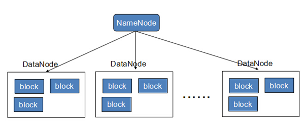

**NameNode**

用于保存整个文件系统的目录信息、文件信息及分块信息，这是由唯一一台主机专门保存，当然这台主机如果出错，NameNode就失效了。

- 接收用户的操作请求
- 维护文件系统的目录结构 
- 管理文件和Block之间的映射管理
- 管理 block  和 DataNode 之间的映射

**==注意:==**  在Hadoop2.*开始支持activity-standy模式,如果主NameNode失效，启动备用主机运行NameNode。

**DataNode**

分布在廉价的计算机上，用于存储Block块文件。

- 文件被分成块存储到DataNode 的磁盘上
- 每个Block(块)可以设置多副本

总结:

- block 文件块  128M/块
- namenode 目录 文件 分块 接收用户访问  文件与block block与datanode
- datanode 存block 副本存储

## hdfs写数据流程(了解)

总结：

- 客户端向namenode发起请求
- 客户端向dn发起建立连接请求
- 客户端向dn存储数据

##hdfs读数据流程(了解)

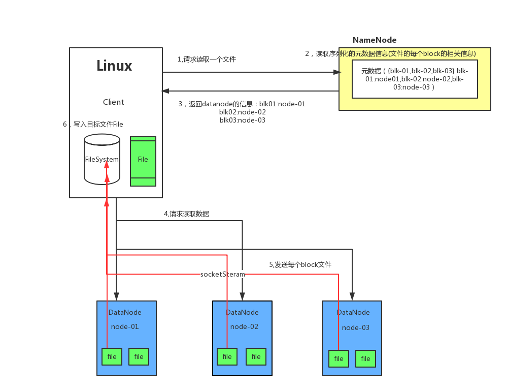

# MapReduce介绍

mapreduce是Hadoop核心项目,它是一种编程模型

MapReduce 框架的核心步骤主要分两部分: Map和Reduce。

当向MapReduce 框架提交一个计算作业时，它会首先把计算作业拆分成若干个Map 任务，然后分配到不同的节点(DataNode)上去执行，每一个Map 任务处理输入数据中的一部分，当Map 任务完成后，它会生成一些中间文件，这些中间文件将会作为Reduce 任务的输入数据。Reduce 任务的主要目标就是把前面若干个Map 的输出汇总到一起并输出。

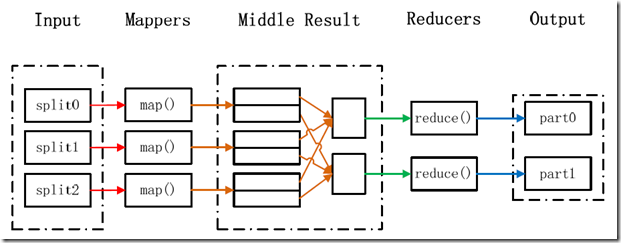

​	通过对HDFS分布式文件系统的了解，我们已经可以把海量数据存储在集群中DataNode之上了，但这仅是Hadoop工作的第一步，那么如何从海量的数据中找到我们所需要的数据呢，这就是MapReduce要做的事情了。下面通过2个例子给予说明：

案例1:

**问题**：

​	求和：1+5+7+3+4+9+3+5+6=？

**答案**：

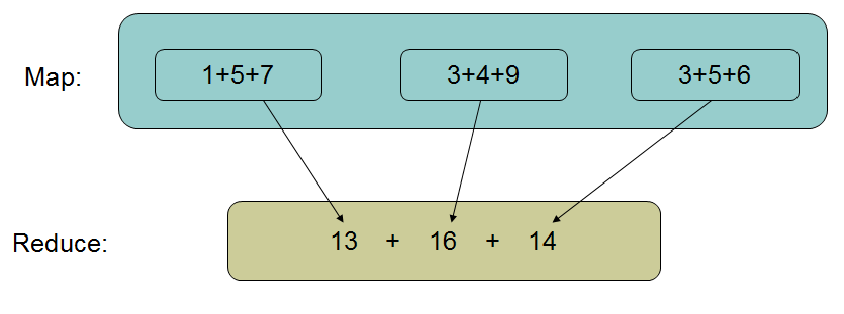

**案例2**

**问题**

​	一个银行有上亿储户，银行希望找到存储金额最高的金额是多少？

**答案**

​	方法1：按照传统的计算方式，我们会这样(java代码)：

~~~java
 Long moneys[] ...  
 Long max = 0L;  
for(int i=0;i<moneys.length;i++){  
if(moneys[i]>max){  
     max = moneys[i];  
   }  
 }  
~~~

​	此种方法存在问题：如果数组元素比较少的话，完全可以胜任，但是如果数组中的元素数量是海量的话，那么这个方法就会浪费非常多的时间。

​	方法2：

​	首先数字是分布存储在不同块中的，以某几个块为一个Map，计算出Map中最大的值，然后将每个Map中的最大值做Reduce操作，Reduce再取最大值给用户。

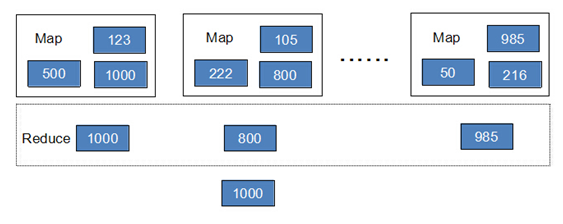

​	

**小结**：

​	将大的数据分析分成小块逐个分析，最后再将提取出来的数据汇总分析，最终获得我们想要的内容。

​	通俗说MapReduce是一套从海量源数据提取、分析元素，最后返回结果集的方法。

​	当然怎么分块分析，怎么做Reduce操作非常复杂，Hadoop已经提供了数据分析的实现，我们只需要编写简单的需求命令即可达成我们想要的数据。

# yarn介绍

**Yarn介绍**

YARN (Yet An other Resouce Negotiator)另一种资源协调者

A framework for job scheduling and cluster resource management.

功能：任务调度和集群资源管理

**使用Yarn好处**

在某些时间，有些计算框架的集群资源紧张,而另外一些集群资源空闲。 那么这框架共享使用一个则可以大大提高利用率防止集群资源空闲。 

维护成本低。

数据共享。 避免了集群之间移动数据。 

**YARN组件**

ResourceManager  资源管理

负责对各个NodeManager上的资源进行统一管理和任务调度

NodeManager 节点管理

在各个计算节点运行，用于接收RM中ApplicationsManager 的计算任务、启动/停止任务、和RM中Scheduler 汇报并协商资源、监控并汇报本节点的情况

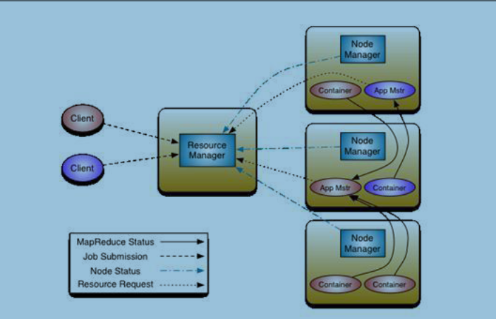

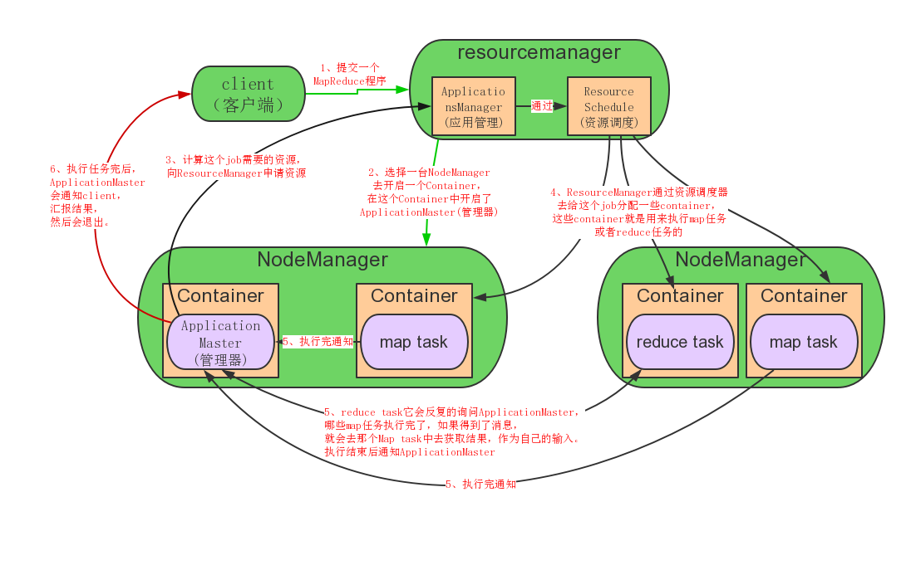

​								  

# Hadoop部署

## 各种部署方式与比较

部署方法主要的区分依据是NameNode、DataNode、ResourceManager、NodeManager等模块运行在几个JVM进程、几个机器。如下表所示：

| 模式名称      | 各个模块占用JVM进程数 | 各个模块运行在几台机器上 |
| ------------- | --------------------- | ------------------------ |
| 单机          | 1                     | 1                        |
| 伪分布式      | N                     | 1                        |
| 完全分布式    | N                     | N                        |
| HA+完全分布式 | N                     | N                        |

##单机(本地模式)部署

### 单机部署模式介绍

- 单机(本地模式)是Hadoop的默认部署模式。
- 当配置文件为空时，Hadoop完全运行在本地。
- 不需要与其他节点交互，单机(本地模式)就不使用HDFS，也不加载任何Hadoop的守护进程。
- 该模式主要用于开发调试MapReduce程序的应用逻辑。

**准备一台虚拟机,内存尽量大点(我这里主机名为hadoopmaster)**

### 部署过程

**第1步: 下载相关软件包**

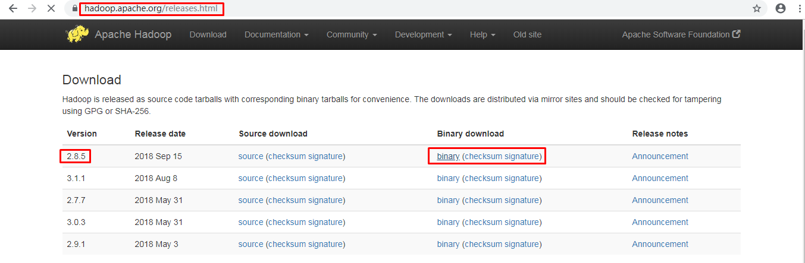

~~~shell
[root@hadoopmaster ~]# wget http://mirrors.tuna.tsinghua.edu.cn/apache/hadoop/common/hadoop-2.8.5/hadoop-2.8.5.tar.gz
~~~

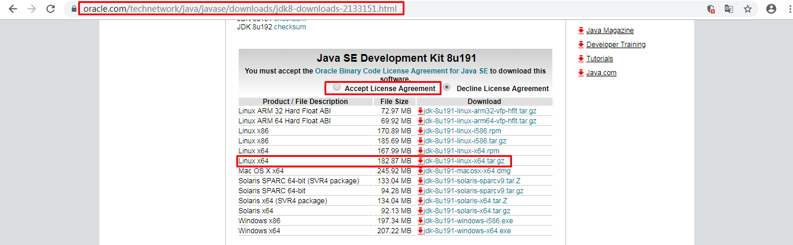

将下载好的jdk与hadoop程序包拷贝到服务器上(这里我拷贝到/root/目录下)

**第2步: 安装JDK**

解压到指定目录后

~~~shell
[root@hadoopmaster ~]# tar xf /root/jdk-8u191-linux-x64.tar.gz -C /usr/local
~~~

**第3步: 安装hadoop**

解压到指定目录后，为了方便，我这里修改了目录名称 (**非必要操作**)

~~~shell
[root@hadoopmaster ~]# tar xf /root/hadoop-2.8.5.tar.gz -C /usr/local
[root@hadoopmaster ~]# mv /usr/local/hadoop-2.8.5 /usr/local/hadoop
~~~

**第4步: 配置环境变量**

~~~powershell
在全局环境变量文件最后加上三句

[root@hadoopmaster ~]# vim /etc/profile			
export JAVA_HOME=/usr/local/jdk1.8.0_191
export HADOOP_HOME=/usr/local/hadoop
export PATH=$JAVA_HOME/bin:$HADOOP_HOME/bin:$HADOOP_HOME/sbin:$PATH
~~~

~~~shell
[root@hadoopmaster ~]# source /etc/profile

[root@hadoopmaster ~]# java -version
java version "1.8.0_191"
Java(TM) SE Runtime Environment (build 1.8.0_191-b12)
Java HotSpot(TM) 64-Bit Server VM (build 25.191-b12, mixed mode)
~~~

###  测试hadoop可用性

在Hadoop的share目录里，自带了一些jar包，里面带有一些mapreduce实例小例子，位置在share/hadoop/mapreduce/hadoop-mapreduce-examples-2.8.5.jar

可以运行这些例子进行体验，我们这里来运行最经典的WordCount实例。

1, 准备一个目录, 目录里准备一个或多个文本文件(任意写些字符,某些字符有些重复,方便统计)

~~~shell
[root@hadoopmaster ~]# mkdir /home/input
[root@hadoopmaster ~]# vim /home/input/test1.txt
[root@hadoopmaster ~]# vim /home/input/test2.txt
~~~

2, 使用hadoop里自带的jar包里的wordcount函数进行统计

~~~powershell
[root@hadoopmaster ~]# hadoop jar /usr/local/hadoop/share/hadoop/mapreduce/hadoop-mapreduce-examples-2.8.5.jar wordcount /home/input/ /home/output/00

wordcount后接文件或目录都可以,接文件就统计文件,接目录则统计整个目录里的文件

[root@hadoopmaster ~]# ls /home/output/00
part-r-00000  _SUCCESS

[root@hadoopmaster ~]# cat /home/output/00/part-r-00000
~~~

PS: 输出目录中有_SUCCESS文件说明JOB运行成功，part-r-00000是输出结果文件。

**词频统计练习**

**要求**：

1. 制作一个文件，里面包含10-20不同的或部分相同的单词。
2. 使用wordcount方法实现单词出现频率统计。

#伪分布式部署

## **伪分布式部署模式介绍**

- Hadoop守护进程运行在本地机器上，模拟一个小规模的集群。

- 该模式在单机模式之上增加了代码调试功能，允许你检查内存使用情况，HDFS输入/输出，以及其他的守护进程交互。

  

## 伪分布式部署过程

**接着前面的单机部署继续操作**, 修改几个配置文件

主要涉及的配置文件有：hadoop-env.sh、mapred-env.sh、yarn-env.sh、core-site.xml

### 配置HDFS

**第1步: 修改hadoop-env.sh、mapred-env.sh、yarn-env.sh文件中JAVA_HOME参数**

~~~shell
[root@hadoopmaster ~]# vim /usr/local/hadoop/etc/hadoop/hadoop-env.sh
[root@hadoopmaster ~]# vim /usr/local/hadoop/etc/hadoop/mapred-env.sh
[root@hadoopmaster ~]# vim /usr/local/hadoop/etc/hadoop/yarn-env.sh
~~~

~~~powershell
都添加下面一句
export JAVA_HOME=/usr/local/jdk1.8.0_191
~~~

**第2步: 修改core-site.xml**

~~~shell
[root@hadoopmaster ~]# vim /usr/local/hadoop/etc/hadoop/core-site.xml
~~~

在配置文件里面的<configuration>和</configuration>中间加上下面的配置

~~~powershell
<property>
        <name>hadoop.tmp.dir</name>			
        <value>/opt/data/tmp</value>
</property>

<property>
        <name>fs.default.name</name>
        <value>hdfs://hadoopmaster:8020</value>		注意:这里的hadoopmaster对应你的主机名
</property>
~~~

> 配置临时目录前，请先创建此目录,不创建也可以。
>
> HDFS的NameNode数据默认都存放这个目录下，查看`*-default.xml`等默认配置文件，就可以看到很多依赖`${hadoop.tmp.dir}`的配置。
>
> 默认的`hadoop.tmp.dir`是`/tmp/hadoop-${user.name}`, 此时有个问题就是NameNode会将HDFS的元数据存储在这个/tmp目录下，如果操作系统重启了，系统会清空/tmp目录下的东西，导致NameNode元数据丢失，是个非常严重的问题，所有我们应该修改这个路径。

**第3步: 配置hdfs-site.xml**

~~~shell
[root@hadoopmaster ~]# vim /usr/local/hadoop/etc/hadoop/hdfs-site.xml
~~~

~~~shell
<property>
       <name>dfs.replication</name>
       <value>1</value>
</property>
~~~

>dfs.replication配置的是HDFS存储时的备份数量，因为这里是伪分布式环境只有一个节点，所以这里设置为1。

**第4步: 格式化hdfs**

~~~shell
[root@hadoopmaster ~]# hdfs namenode -format
~~~

>格式化是对HDFS这个分布式文件系统中的DataNode进行分块，统计所有分块后的初始元数据的存储在NameNode中。

> 格式化后，查看core-site.xml里hadoop.tmp.dir（本例是/opt/data/tmp目录）指定的目录下是否有了dfs目录，如果有，说明格式化成功。

**第5步: 查看hdfs临时目录**

~~~shell
[root@hadoopmaster ~]# ls /opt/data/tmp/dfs/name/current
~~~

>fsimage是NameNode元数据持久化保存的文件。

> `fsimage*.md5` 是校验文件，用于校验fsimage的完整性。

> `seen_txid` 是hadoop的版本

> **vession文件里保存：**

- namespaceID：NameNode的唯一ID。

- clusterID:集群ID，NameNode和DataNode的集群ID应该一致，表明是一个集群。

**第6步: 启动**

确认前面将hadoop安装目录中的sbin目录中添加到/etc/profile环境变量中,不然无法使用hadoop-daemon.sh

启动namenode

~~~powershell
[root@hadoopmaster ~]# hadoop-daemon.sh start namenode
~~~

启动datanode

~~~powershell
[root@hadoopmaster ~]# hadoop-daemon.sh start datanode
~~~

**PS:** 上述命令将`start`替换为`stop`就是关闭的操作

**第7步: 验证**

 JPS命令查看是否已经启动成功, **最好验证一下端口,否则太急做hdfs操作测试会有问题(启动端口有点慢)**。

~~~shell
[root@hadoopmaster ~]# jps
7652 NameNode
7719 DataNode
8315 Jps

[root@hadoopmaster ~]# netstat -ntlup |grep :8020
tcp        0      0 10.1.1.11:8020          0.0.0.0:*               LISTEN      57074/java
~~~

### HDFS操作测试

创建目录

~~~shell
[root@hadoopmaster ~]# hdfs dfs -mkdir /test

[root@hadoopmaster ~]# hdfs dfs -ls /
Found 1 items
drwxr-xr-x   - root supergroup          0 2019-06-06 16:52 /test
~~~

上传文件

~~~shell
[root@hadoopmaster ~]# hdfs dfs -put /etc/fstab /test
~~~

读文件内容

~~~shell
[root@hadoopmaster ~]# hdfs dfs -cat /test/fstab
~~~

下载文件到本地当前目录

~~~shell
[root@hadoopmaster ~]# hdfs dfs -get /test/fstab
~~~

### 配置yarn

**第1步: 配置mapred-site.xml**

在配置文件里面的<configuration>和</configuration>中间加上下面的配置

~~~powershell
[root@hadoopmaster ~]# cp /usr/local/hadoop/etc/hadoop/mapred-site.xml.template /usr/local/hadoop/etc/hadoop/mapred-site.xml

[root@hadoopmaster ~]# vim /usr/local/hadoop/etc/hadoop/mapred-site.xml

<property>
        <name>mapreduce.framework.name</name>
        <value>yarn</value>
</property>

指定mapreduce运行在yarn框架上
~~~

**第2步: 配置yarn-site.xml**

在配置文件里面的<configuration>和</configuration>中间加上下面的配置

~~~powershell
[root@hadoopmaster ~]# vim /usr/local/hadoop/etc/hadoop/yarn-site.xml

<property>
	<name>yarn.resourcemanager.hostname</name>
	<value>hadoopmaster</value>
</property>

<property>
	<name>yarn.nodemanager.aux-services</name>
	<value>mapreduce_shuffle</value>
</property>

yarn.resourcemanager.hostname指定了Resourcemanager运行在哪个节点上
yarn.nodemanager.aux-services配置了yarn的默认混洗方式，选择为mapreduce的默认混洗算法
~~~

### 启动与测试

**启动yarn**

~~~powershell
[root@hadoopmaster ~]# yarn-daemon.sh start resourcemanager
~~~

~~~powershell
[root@hadoopmaster ~]# yarn-daemon.sh start nodemanager
~~~

~~~shell
[root@hadoopmaster ~]# jps
8226 ResourceManager
7652 NameNode
8278 NodeManager
7719 DataNode
8315 Jps
~~~

~~~powershell
[root@hadoopmaster ~]# netstat -ntlup |grep :8088
tcp6       0      0 :::8088                 :::*                    LISTEN      57634/java

确认端口启动
~~~

**访问YARN的Web页面**

YARN的Web客户端端口号是8088，通过<http://hadoopmaster:8088/>可以查看。

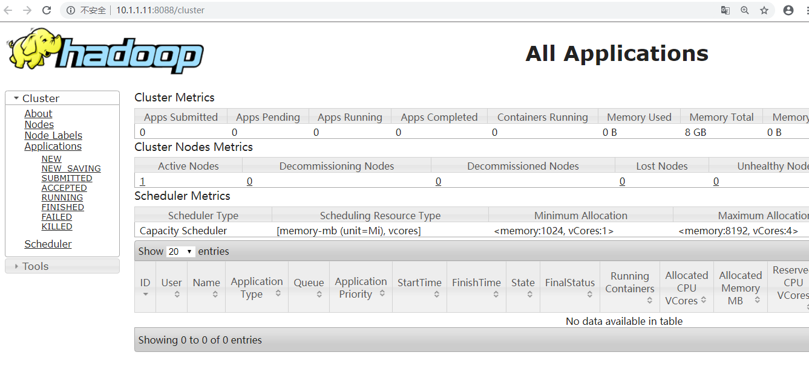

**测试**

创建目录

~~~shell
[root@hadoopmaster ~]# hdfs dfs -mkdir -p /test/input
~~~

上传文件

把前面本地模式部署实验过程中在/home/input目录下测试准备的文件上传到HDFS的/test/input目录中:

~~~shell
[root@hadoopmaster ~]# hdfs dfs -put  /home/input/* /test/input
~~~

运行实例

~~~shell
[root@hadoopmaster ~]# yarn jar /usr/local/hadoop/share/hadoop/mapreduce/hadoop-mapreduce-examples-2.8.5.jar wordcount /test/input /test/output
~~~

查看输出结果

~~~shell
[root@hadoopmaster ~]# hdfs dfs -ls /test/output
Found 2 items
-rw-r--r--   1 root supergroup          0 2019-06-07 01:46 /test/output/_SUCCESS
-rw-r--r--   1 root supergroup         32 2019-06-07 01:46 /test/output/part-r-00000

[root@hadoopmaster ~]# hdfs dfs -cat /test/output/part-r-00000
~~~

> output目录中有两个文件，_SUCCESS文件是空文件，有这个文件说明Job执行成功。
>
> part-r-00000文件是结果文件，其中-r-说明这个文件是Reduce阶段产生的结果，mapreduce程序执行时，可以没有reduce阶段，但是肯定会有map阶段，如果没有reduce阶段这个地方有是-m-。
>
> 一个reduce会产生一个part-r-开头的文件。

**停止hadoop**

~~~shell
[root@hadoopmaster ~]# hadoop-daemon.sh stop namenode
[root@hadoopmaster ~]# hadoop-daemon.sh stop datanode
[root@hadoopmaster ~]# yarn-daemon.sh stop resourcemanager
[root@hadoopmaster ~]# yarn-daemon.sh stop nodemanager
~~~

