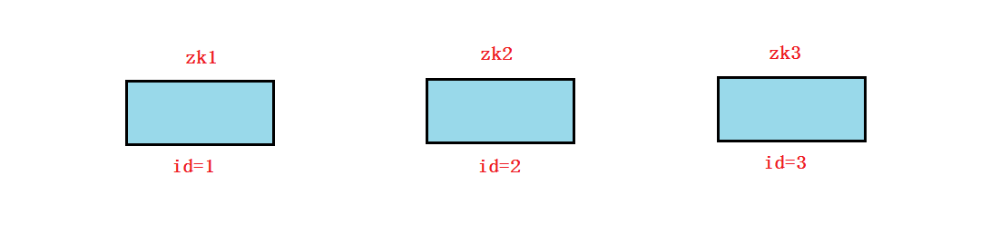
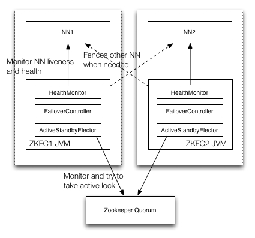
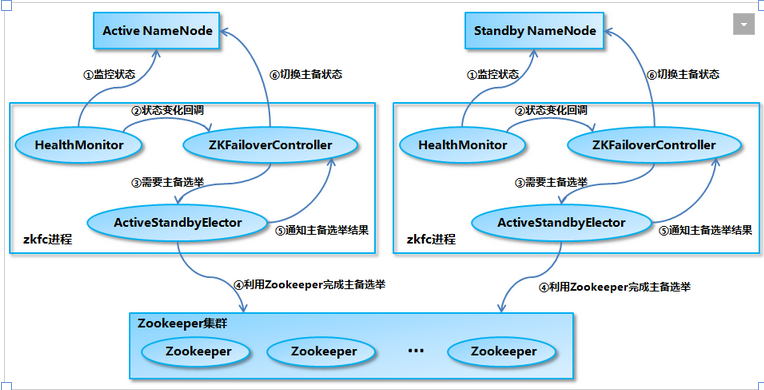
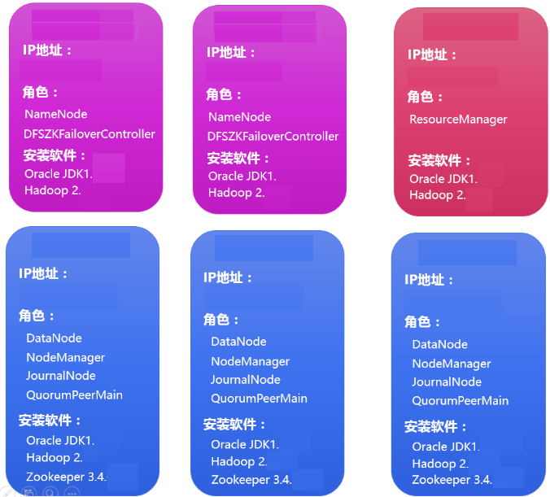
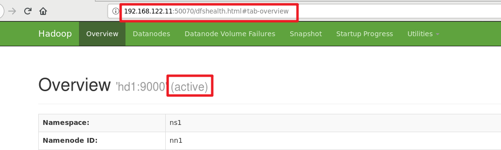
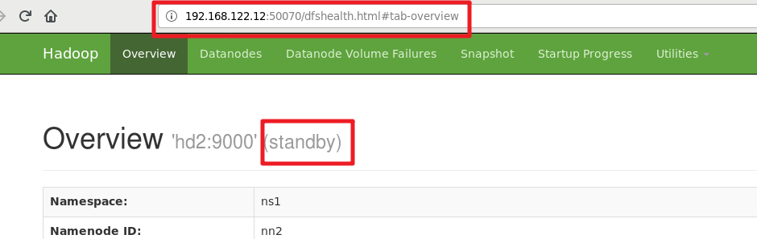
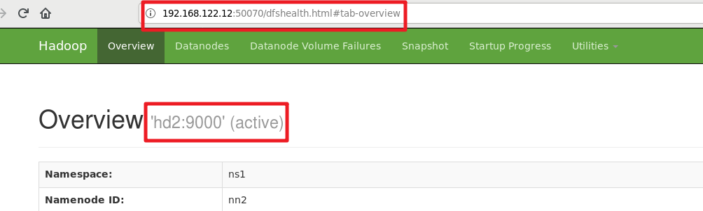

# 完全分布式部署介绍

​	完全分布式是真正利用多台Linux主机来进行部署Hadoop，对Linux机器集群进行规划，使得Hadoop各个模块分别部署在不同的多台机器上。

##HA+完全分布式架构

HA(High Availability):高可用

Hadoop HA是Hadoop 2.x中新添加的特性，包括NameNode HA 和 ResourceManager HA。因为DataNode和NodeManager本身就是被设计为高可用的，所以不用对他们进行特殊的高可用处理。

## NameNode HA切换实现方法

Hadoop2.X对NameNode进行一个抽象: NameService  

一个NameService下面有两个NameNode,分别处于Active和Standby状态。

以前我们学到的HA软件是通过心跳的方式来实现HA的。

在hadoop集群中通过zookeeper进行协调选举，确保只有一个活跃的NameNode。

### zookeeper介绍

ZooKeeper 是为分布式应用程序提供高性能协调服务的工具集合，译名为“动物园管理员”。

它主要用来解决分布式应用中经常遇到的数据管理问题，如集群管理、统一命名服务、分布式配置管理、分布式消息队列、分布式锁、分布式协调等。

zookeeper也需要配置集群,最少3个节点(用于投票选举)

在ZooKeeper集群当中,zookeeper角色有两种:Leader和Learner.Learner角色又分为Observer和Follower

| 角色             | 描述                                                         |
| ---------------- | ------------------------------------------------------------ |
| 领导者(leader)   | leader负责投票的发起和决议,更新状态等                        |
| 跟随者(follower) | 用于接收请求并向客户端返回结果,选举过程中参与投票            |
| 观察者(observer) | 可以接收客户端请求,但写请求转给leader.不参与投票。observer主要是为了扩展与提高读取速度 |
| client           | 发起请求给zookeeper集群                                      |

### zookeeper选举

zookeeper选举leader与follower的三个核心原则:

1. 超过半数票数的集群节点OK,集群才正常
2. 集群正常工作之前,id小的给id大的投票,直接选举出leader
3. 选出leader后,其它节点都会变为follower,id更大的节点再启动也是follower

**问题:** 下图三个如果按照zk1,zk2,zk3的顺序启动后, 谁会是leader?

### zookeeper实现HA切换原理

在hadoop集群中通过zookeeper进行协调选举，确保只有一个活跃的NameNode。

一旦主(Active)宕掉，standby会切换成Active。

作为一个ZK集群的客户端，用来监控NN的状态信息。每个运行NN的节点必须要运行一个zkfc。

zkfc提供以下功能：

**Health monitoring**

zkfc定期对本地的NN发起health-check的命令，如果NN正确返回，那么这个NN被认为是OK的。否则被认为是失效节点。

**ZooKeeper session management**

当本地NN是健康的时候，zkfc将会在zk中持有一个session。如果本地NN又正好是active的，那么zkfc还有持有一个独占锁，一旦本地NN失效了，那么这个节点将会被自动删除。

**ZooKeeper-based election**

如果本地NN是健康的，并且zkfc发现没有其他的NN持有那个独占锁。那么他将试图去获取该锁，一旦成功，那么它就需要执行Failover，然后成为active的NN节点。

Failover的过程是：

* 第一步，如果需要的话,对之前的NN执行fence。
* 第二步，将本地NN转换到active状态。

## NameNode HA数据共享方法

Namenode主要维护两个文件，一个是fsimage，一个是editlog。

fsimage保存了最新的元数据检查点(存档，快照)，包含了整个HDFS文件系统的所有目录和文件的信息。对于文件来说包括了数据块描述信息、修改时间、访问时间等；对于目录来说包括修改时间、访问权限控制信息(目录所属用户，所在组)等。

editlog主要是在NameNode已经启动情况下对HDFS进行的各种更新操作进行记录，HDFS客户端执行所有的写操作都会被记录到editlog中。

上面在Active Namenode与StandBy Namenode之间的绿色区域就是JournalNode，当然数量不一定只有1个,作用相当于NFS共享文件系统，Active Namenode往里写editlog数据，StandBy再从里面读取数据进行同步。

两个NameNode为了数据同步，会通过一组称作JournalNodes的独立进程进行相互通信。当active状态的NameNode的命名空间有任何修改时，会告知大部分的JournalNodes进程。standby状态的NameNode有能力读取JNs中的变更信息，并且一直监控edit log的变化，把变化应用于自己的命名空间。standby可以确保在集群出错时，命名空间状态已经完全同步了。

集群启动时，可以同时启动2个NameNode。这些NameNode只有一个是active的，另一个属于standby状态。active状态意味着提供服务，standby状态意味着处于休眠状态，只进行数据同步，时刻准备着提供服务

# 部署过程

## 1, 环境准备

==**注意: 此文档在上图基础上升级了(在第2个节点上也安装resourcemanager,实现两个rm高可用)**==

1, **所有节点**都修改主机名(手动配置,还是改个简单主机名方便)并绑定主机名

~~~powershell
# hostnamectl set-hostname --static hdX

# vim /etc/hosts
192.168.122.11 hd1   
192.168.122.12 hd2
192.168.122.13 hd3
192.168.122.14 hd4
192.168.122.15 hd5
192.168.122.16 hd6
~~~

2, **所有节点**关闭防火墙及Selinux

3, **所有节点**时间同步

## 2, 所有节点SSH免密

(需要配置所有节点之间的**两两互信**), 下面只在hd1上操作

~~~powershell
[root@hd1 ~]# ssh-keygen

[root@hd1 ~]# cd /root/.ssh
[root@hd1 .ssh]# cp id_rsa.pub authorized_keys

[root@hd1 .ssh]# for i in {1..6};do scp -r /root/.ssh hd$i:/root;done
[root@hd1 .ssh]# for i in {1..6};do scp -r /root/.ssh hd$i:/root/;done
注意:把hd1-hd6都循环,如果不加hd1，到时候其它节点ssh hd1还要再输yes
循环操作2两次,因为第1次要输yes,known_hosts还没有所有节点的记录,所以第2次再传一遍就OK了
~~~

> 以前学过多种配置两两互信的方式,这里直接把/root/.ssh目录拷贝过去，方便快捷
>
> 当然,如果用普通用户配置两两免密互信,也是可以的

## **3, 所有节点**安装JDK

~~~powershell
将jdk软件包拷贝到hd1
然后循环scp给hd2到hd6
[root@hd1 ~]# for i in {2..6}; do scp /root/jdk-8u191-linux-x64.tar.gz hd$i:/root/; done

hd1到hd6全部解压
[root@hd1 ~]# for i in {1..6}; do ssh hd$i tar xf /root/jdk-8u191-linux-x64.tar.gz -C /usr/local; done
~~~

## **4, 所有节点**配置环境变量

~~~powershell
# vim /etc/profile										配置文件最后加上下面一段

export JAVA_HOME=/usr/local/jdk1.8.0_191
export ZOOKEEPER_HOME=/usr/local/zookeeper
export HADOOP_HOME=/usr/local/hadoop
export PATH=$JAVA_HOME/bin:$ZOOKEEPER_HOME/bin:$HADOOP_HOME/bin:$HADOOP_HOME/sbin:$PATH

# source /etc/profile
注意:source /etc/profile不要用上面的循环方式来做,因为远程ssh操作的终端与已经连接的终端不一定是同一个终端
~~~

## 5, zookeeper部署

zookeeper部署至hdfs集群的datanode节点

**==安装zookeeper,下面步骤在datanode这3台(hd4-hd6)上都要做== **

下载地址为: https://www-eu.apache.org/dist/zookeeper/zookeeper-3.4.14/zookeeper-3.4.14.tar.gz

~~~powershell
# tar xf zookeeper-3.4.14.tar.gz -C /usr/local
# mv /usr/local/zookeeper-3.4.14 /usr/local/zookeeper
# cp /usr/local/zookeeper/conf/zoo_sample.cfg /usr/local/zookeeper/conf/zoo.cfg
# vim /usr/local/zookeeper/conf/zoo.cfg
dataDir=/opt/data											  修改

server.1=hd4:2888:3888
server.2=hd5:2888:3888
server.3=hd6:2888:3888							   			空白地方加上这三句

# mkdir /opt/data	
~~~

> 每台服务器myid不同，需要分别修改，例如server.1对应的myid内容为1，server.2对应的myid内容为2，server.3对应的myid为3。
>
> 2888端口：follower连接到leader机器的端口
>
> 3888端口：leader选举端口

在三台datanode上分别创建不同id

~~~powershell
[root@hd4 ~]# echo 1 > /opt/data/myid
[root@hd5 ~]# echo 2 > /opt/data/myid
[root@hd6 ~]# echo 3 > /opt/data/myid
~~~

**验证zookeeper**

三台都启动,并验证状态(leader与follower)

~~~shell
# zkServer.sh start
# zkServer.sh status
~~~

验证OK后,三台都关闭（后面统一启动)

~~~shell
# zkServer.sh stop
~~~

##6, hadoop安装与配置

六台都要安装,**==但我这里先只在hd1上做,配置完后,再拷到hd2到h6==**

~~~powershell
[root@hd1 ~]# tar xf /root/hadoop-2.8.5.tar.gz -C /usr/local/
[root@hd1 ~]# mv /usr/local/hadoop-2.8.5 /usr/local/hadoop
~~~

### hadoop-env.sh

~~~powershell
[root@hd1 ~]# cd /usr/local/hadoop/etc/hadoop/
[root@hd1 hadoop]# vim hadoop-env.sh
25 export JAVA_HOME=/usr/local/jdk1.8.0_191
~~~

### mapred-env.sh

~~~powershell
[root@hd1 hadoop]# vim mapred-env.sh
16 export JAVA_HOME=/usr/local/jdk1.8.0_191
~~~

### yarn-env.sh

~~~powershell
[root@hd1 hadoop]# vim yarn-env.sh
23 export JAVA_HOME=/usr/local/jdk1.8.0_191
~~~

### core-site.xml

在<configuration>与</configuration>中间加上配置

~~~xml
[root@hd1 hadoop]# vim core-site.xml

<!-- 指定hdfs的nameservice为ns1 -->
<property>
    <name>fs.defaultFS</name>
    <value>hdfs://ns1</value>
</property>

<!-- 指定hadoop临时目录 -->
<property>
    <name>hadoop.tmp.dir</name>
    <value>/opt/data/tmp</value>
</property>

<!-- 指定zookeeper地址 -->
<property>
    <name>ha.zookeeper.quorum</name>
    <value>hd4:2181,hd5:2181,hd6:2181</value>
</property>
~~~

### hdfs-site.xml

在<configuration>与</configuration>中间加上配置

~~~xml
[root@hd1 hadoop]# vim hdfs-site.xml

<!--指定hdfs的nameservice为ns1，需要和core-site.xml中的保持一致 -->
<property>
    <name>dfs.nameservices</name>
    <value>ns1</value>
 </property>

<!-- ns1下面有两个NameNode，分别是nn1，nn2 -->
<property>
    <name>dfs.ha.namenodes.ns1</name>
    <value>nn1,nn2</value>
</property>

<!-- nn1的RPC通信地址,nn1与nn2通信用 -->
<property>
    <name>dfs.namenode.rpc-address.ns1.nn1</name>
    <value>hd1:9000</value>
</property>

<!-- nn1的http通信地址,给管理人员访问用 -->
<property>
    <name>dfs.namenode.http-address.ns1.nn1</name>
    <value>hd1:50070</value>
</property>

<!-- nn2的RPC通信地址,nn1与nn2通信用 -->
<property>
    <name>dfs.namenode.rpc-address.ns1.nn2</name>
    <value>hd2:9000</value>
</property>

<!-- nn2的http通信地址,给管理人员访问用 -->
<property>
    <name>dfs.namenode.http-address.ns1.nn2</name>
    <value>hd2:50070</value>
</property>

<!-- 指定NameNode的元数据在JournalNode上的存放位置 -->
<property>
    <name>dfs.namenode.shared.edits.dir</name>
    <value>qjournal://hd4:8485;hd5:8485;hd6:8485/ns1</value>
</property>

<!-- 指定JournalNode在本地磁盘存放数据的位置 -->
<property>
    <name>dfs.journalnode.edits.dir</name>
    <value>/opt/data/journal</value>
</property>

<!-- 开启NameNode失败自动切换 -->
<property>
    <name>dfs.ha.automatic-failover.enabled</name>
    <value>true</value>
</property>

<!-- 配置失败自动切换实现方式,调用了一个java的功能(就是value里名字很长的那个) -->
<property>
<name>dfs.client.failover.proxy.provider.ns1</name>
<value>org.apache.hadoop.hdfs.server.namenode.ha.ConfiguredFailoverProxyProvider</value>
</property>

<!-- 配置隔离机制,sshfence简单来说就是当一台namenode有问题,ssh连上去将其fence掉 -->
<property>
	<name>dfs.ha.fencing.methods</name>
	<value>sshfence</value>
</property>

<!-- 使用隔离机制时需要ssh免登陆 -->
<property>
    <name>dfs.ha.fencing.ssh.private-key-files</name>
    <value>/root/.ssh/id_rsa</value>
</property>
~~~

### slaves

**slaves用于记录datanode节点**

~~~powershell
[root@hd1 hadoop]# vim slaves					
hd4
hd5
hd6									去掉原来的localhost,写上三台datanode的主机名
~~~

### mapred-site.xml

在<configuration>与</configuration>中间加上配置

~~~xml
[root@hd1 hadoop]# cp mapred-site.xml.template mapred-site.xml

[root@hd1 hadoop]# vim mapred-site.xml
<!-- 指定mr框架为yarn方式 -->
<property>
    <name>mapreduce.framework.name</name>
    <value>yarn</value>
</property>
~~~

### yarn-site.xml

在<configuration>与</configuration>中间加上配置

~~~xml
[root@hd1 hadoop]# vim yarn-site.xml
<!-- 打开resourcemanager的HA特性 -->
<property>
        <name>yarn.resourcemanager.ha.enabled</name>
        <value>true</value>
</property>

<!-- 设置resourcemanager的集群名 -->
<property>
        <name>yarn.resourcemanager.cluster-id</name>
        <value>yarncluster</value>
</property>

<!-- 设置resourcemanager集群由rm1和rm2组成 -->
<property>
        <name>yarn.resourcemanager.ha.rm-ids</name>
        <value>rm1,rm2</value>
</property>

<!-- 设置rm1主机名为hd3 -->
<property>
        <name>yarn.resourcemanager.hostname.rm1</name>
        <value>hd3</value>
</property>

<!-- 设置rm1主机名为hd2 -->
<property>
        <name>yarn.resourcemanager.hostname.rm2</name>
        <value>hd2</value>
</property>

<!-- 设置rm1的web访问地址 -->
<property>
        <name>yarn.resourcemanager.webapp.address.rm1</name>
        <value>hd3:8088</value>
</property>

<!-- 设置rm2的web访问地址 -->
<property>
        <name>yarn.resourcemanager.webapp.address.rm2</name>
        <value>hd2:8088</value>
</property>

<!-- 设置管理rm集群的zk地址 -->
<property>
        <name>yarn.resourcemanager.zk-address</name>
        <value>hd4:2181,hd5:2181,hd6:2181</value>
</property>

<!-- 指定nodemanager启动时加载server的方式为shuffle server -->
<property>
        <name>yarn.nodemanager.aux-services</name>
        <value>mapreduce_shuffle</value>
</property>
~~~

## 7, 拷贝配置好的hadoop到所有节点

~~~powershell
[root@hd1 hadoop]# for i in {2..6}; do scp -r /usr/local/hadoop/ hd$i:/usr/local/; done
~~~

## 8, 启动服务

### 启动zookeeper

在3台datanode节点上启动(前面验证过,这里再统一启动)

~~~powershell
[root@hd4 ~]# zkServer.sh start
[root@hd5 ~]# zkServer.sh start
[root@hd6 ~]# zkServer.sh start
~~~

3台上都验证有QuorumPeerMain进程

~~~powershell
# jps
25509 Jps
25431 QuorumPeerMain
~~~

### 启动hdfs

namenode上操作，例如hd1

因为配置了journal node,所以需要先启动才能`hdfs namenode -format`格式化成功

~~~powershell
[root@hd1 hadoop]# start-dfs.sh
Starting namenodes on [hd1 hd2]
hd1: starting namenode, logging to /usr/local/hadoop/logs/hadoop-root-namenode-hd1.out
hd2: starting namenode, logging to /usr/local/hadoop/logs/hadoop-root-namenode-hd2.out
hd5: starting datanode, logging to /usr/local/hadoop/logs/hadoop-root-datanode-hd5.out
hd4: starting datanode, logging to /usr/local/hadoop/logs/hadoop-root-datanode-hd4.out
hd6: starting datanode, logging to /usr/local/hadoop/logs/hadoop-root-datanode-hd6.out
Starting journal nodes [hd4 hd5 hd6]
hd4: starting journalnode, logging to /usr/local/hadoop/logs/hadoop-root-journalnode-hd4.out
hd6: starting journalnode, logging to /usr/local/hadoop/logs/hadoop-root-journalnode-hd6.out
hd5: starting journalnode, logging to /usr/local/hadoop/logs/hadoop-root-journalnode-hd5.out
Starting ZK Failover Controllers on NN hosts [hd1 hd2]
hd2: starting zkfc, logging to /usr/local/hadoop/logs/hadoop-root-zkfc-hd2.out
hd1: starting zkfc, logging to /usr/local/hadoop/logs/hadoop-root-zkfc-hd1.out

在hd1和hd2上没有namenode和zkfs进程,需要格式化后再次启动
~~~

###格式化hdfs文件系统

在namenode上操作，例如hd1

~~~powershell
[root@hd1 ~]# hdfs namenode -format

[root@hd2 ~]# mkdir /opt/data
[root@hd1 ~]# scp -r /opt/data/tmp/  hd2:/opt/data/
格式化完成后，把/opt/data/tmp目录拷贝至hd2相应的位置，hd2将不再需要格式化，可以直接使用。
~~~

### 格式化zk

namenode上操作，例如hd1(不需要在hd2上操作)

~~~powershell
[root@hd1 ~]# hdfs zkfc -formatZK
~~~

### 再次启动hdfs文件系统

~~~powershell
[root@hd1 hadoop]# start-dfs.sh
Starting namenodes on [hd1 hd2]
hd1: starting namenode, logging to /usr/local/hadoop/logs/hadoop-root-namenode-hd1.out
hd2: starting namenode, logging to /usr/local/hadoop/logs/hadoop-root-namenode-hd2.out
hd5: starting datanode, logging to /usr/local/hadoop/logs/hadoop-root-datanode-hd5.out
hd4: starting datanode, logging to /usr/local/hadoop/logs/hadoop-root-datanode-hd4.out
hd6: starting datanode, logging to /usr/local/hadoop/logs/hadoop-root-datanode-hd6.out
Starting journal nodes [hd4 hd5 hd6]
hd4: starting journalnode, logging to /usr/local/hadoop/logs/hadoop-root-journalnode-hd4.out
hd6: starting journalnode, logging to /usr/local/hadoop/logs/hadoop-root-journalnode-hd6.out
hd5: starting journalnode, logging to /usr/local/hadoop/logs/hadoop-root-journalnode-hd5.out
Starting ZK Failover Controllers on NN hosts [hd1 hd2]
hd2: starting zkfc, logging to /usr/local/hadoop/logs/hadoop-root-zkfc-hd2.out
hd1: starting zkfc, logging to /usr/local/hadoop/logs/hadoop-root-zkfc-hd1.out

可以看到namenode,datanode,journalnode,zkfc全部启动到对应的节点
~~~

### 启动yarn

在hd3和hd2上操作(因为前面配置resourcemanager启动在hd3和hd2)

~~~powershell
[root@hd3 ~]# start-yarn.sh
starting yarn daemons
starting resourcemanager, logging to /usr/local/hadoop/logs/yarn-root-resourcemanager-hd3.out
hd5: starting nodemanager, logging to /usr/local/hadoop/logs/yarn-root-nodemanager-hd5.out
hd6: starting nodemanager, logging to /usr/local/hadoop/logs/yarn-root-nodemanager-hd6.out
hd4: starting nodemanager, logging to /usr/local/hadoop/logs/yarn-root-nodemanager-hd4.out
会在hd3产生resourcemanager,在hd4-hd6上产生nodemanager
~~~

~~~powershell
[root@hd2 ~]# start-yarn.sh
starting yarn daemons
starting resourcemanager, logging to /usr/local/hadoop/logs/yarn-root-resourcemanager-hd2.out
hd6: nodemanager running as process 28499. Stop it first.
hd4: nodemanager running as process 28606. Stop it first.
hd5: nodemanager running as process 28547. Stop it first.
~~~

## 9, 验证进程

hd1

~~~powershell
# jps
27953 Jps
27784 DFSZKFailoverController
27468 NameNode
~~~

hd2

~~~powershell
29687 NameNode
29802 DFSZKFailoverController
29947 ResourceManager
30079 Jps
~~~

hd3

~~~powershell
# jps
6897 Jps
6611 ResourceManager
~~~

datanode(hd4,hd5,hd6)上

~~~powershell
# jps
25796 DataNode
26213 Jps
25431 QuorumPeerMain
25577 JournalNode
26058 NodeManager
~~~

## 10,测试

http://hd1:50070 查看NameNode状态

http://hd2:50070 查看NameNode状态

http://hd3:8088 查看yarn状态

### **hdfs与mapreduce验证**

~~~powershell
[root@hd1 ~]# vim test
aaa
bbb
ccc
aaa
aaa
10.1.1.11
10.1.1.12
10.1.1.11

[root@hd1 ~]# hdfs dfs -mkdir /input
[root@hd1 ~]# hdfs dfs -put test /input

[root@hd1 ~]# yarn jar /usr/local/hadoop/share/hadoop/mapreduce/hadoop-mapreduce-examples-2.8.5.jar wordcount /input /output/00
~~~

~~~powershell
[root@hd1 ~]# hdfs dfs -cat /output/00/part-r-00000
10.1.1.11       2
10.1.1.12       1
aaa     3
bbb     1
ccc     1
~~~

 

### namenode高可用讨论

通过下面命令查看到nn1为active,nn2为standby

~~~powershell
[root@hd1 ~]# hdfs haadmin -getServiceState nn1
active
[root@hd1 ~]# hdfs haadmin -getServiceState nn2
standby
~~~

或者

将nn1(hd1)重启

~~~powershell
[root@hd1 ~]# reboot
~~~

nn2(hd2)会由standby变为active

nn1(hd1)重启后,**需要手动再次使用`start-dfs.sh`才能启动进程,但启动后不再为active,而是standby了**

~~~powershell
[root@hd1 ~]# start-dfs.sh
Starting namenodes on [hd1 hd2]
hd2: namenode running as process 26886. Stop it first.
hd1: starting namenode, logging to /usr/local/hadoop/logs/hadoop-root-namenode-hd1.out
hd6: datanode running as process 26796. Stop it first.
hd5: datanode running as process 26712. Stop it first.
hd4: datanode running as process 25796. Stop it first.
Starting journal nodes [hd4 hd5 hd6]
hd5: journalnode running as process 26563. Stop it first.
hd4: journalnode running as process 25577. Stop it first.
hd6: journalnode running as process 26647. Stop it first.
Starting ZK Failover Controllers on NN hosts [hd1 hd2]
hd2: zkfc running as process 26990. Stop it first.
hd1: starting zkfc, logging to /usr/local/hadoop/logs/hadoop-root-zkfc-hd1.out
~~~

~~~powershell
[root@hd1 ~]# hdfs haadmin -getServiceState nn1
standby
[root@hd1 ~]# hdfs haadmin -getServiceState nn2
active
~~~

### resourcemanager高可用讨论

如下命令查看

~~~powershell
[root@hd1 ~]# yarn rmadmin -getServiceState rm1
active													rm1(hd3)为active
[root@hd1 ~]# yarn rmadmin -getServiceState rm2
standby													rm2(hd2)为standby
~~~

去rm2(hd3)上重启系统,或者杀掉rm进程来模拟

~~~powershell
[root@hd3 ~]# jps
8617 Jps
8203 ResourceManager
[root@hd3 ~]# kill -9 8203
~~~

rm2(hd2)由standy变为active

~~~powershell
[root@hd1 ~]# yarn rmadmin -getServiceState rm2
active
~~~

rm1(hd3)再次启动回来,为standby状态了

~~~powershell
[root@hd3 ~]# start-yarn.sh
starting yarn daemons
starting resourcemanager, logging to /usr/local/hadoop/logs/yarn-root-resourcemanager-hd3.out
hd4: nodemanager running as process 28606. Stop it first.
hd5: nodemanager running as process 28547. Stop it first.
hd6: nodemanager running as process 28499. Stop it first.
~~~

~~~powershell
[root@hd1 ~]# yarn rmadmin -getServiceState rm1
standby
[root@hd1 ~]# yarn rmadmin -getServiceState rm2
active
~~~

### 服务关闭过程

在其中一个namenode上

~~~powershell
# stop-dfs.sh
~~~

在所有rm节点

~~~powershell
# stop-yarn.sh
~~~

在所有zk节点

~~~powershell
# zkServer.sh stop
~~~

排错思路: 把所有服务都停了,解决相关错误(一般就是主机名,防火墙,环境变量,配置错误等),再重新启动服务即可.

