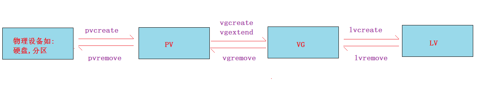

# **学习目标**

- [ ] 理解物理卷、卷组、逻辑卷的概念
- [ ] ==能够根据需求创建逻辑卷（重点）==
- [ ] ==能够根据需求动态扩容逻辑卷（重点）==
- [ ] 熟练使用逻辑卷相关命令（pvcreate/vgcreate/lvcreate等）

- [ ] 了解RAID基本概念
- [ ] 了解常见的RAID类型


# ==逻辑卷管理（重点）==

## 1. 逻辑卷介绍

**逻辑卷：**(logical  volume management)
逻辑卷(LVM):  它是Linux环境下对**物理磁盘设备（硬盘或分区)**进行管理的一种机制，优点在于**灵活**管理。
**特点：**
  1、**==动态在线扩容(重点)==**
  2、离线裁剪(拓展)
  3、数据条带化(拓展)
  4、数据镜像(拓展)

## 2. 逻辑卷基本概念


- 物理卷（Physical Volume，PV）

物理卷是底层真正提供容量，存放数据的设备,它可以是整个硬盘、硬盘上的分区等。

- 卷组（Volume Group, VG）

卷组建立在物理卷之上，它由==一个或多个物理卷==组成。即把物理卷整合起来提供容量分配。
一个LVM系统中可以只有一个卷组，也可以包含多个卷组。

- 逻辑卷（Logical Volume, LV）

逻辑卷建立在卷组之上，它是从卷组中“切出”的一块空间。它是==最终用户使用的逻辑设==备。逻辑卷创建之后，其大小可以伸缩。

- 物理区域 PE（physical extent）

每一个物理卷被划分为称为PE(Physical Extents)的基本单元，具有唯一编号的PE是能被LVM寻址的最小单元。PE的大小可指定，默认为4 MB。 PE的大小一旦确定将不能改变，同一个卷组中的所有物理卷的PE的大小是一致的。
4MB=4096kb=4096kb/4kb=1024个block

说明：

1. 硬盘读取数据最小单位1个扇区512字节
2. 操作读取数据最小单位1个数据块=8*512字节=4096字节=4KB
3. lvm寻址最小单位1个PE=4MB

- 逻辑区域 LE（logical extent）

逻辑卷也被划分为被称为LE(Logical Extents) 的可被寻址的基本单位。在同一个卷组中，LE的大小和PE是相同的，并且一一对应。

真实的物理设备——>逻辑上——>物理卷（pv）——>卷组（vg）——>逻辑卷（lv）——>逻辑卷格式化——>挂载使用

## 3. 逻辑卷LVM应用

### 3.1 逻辑卷创建

需求: 创建一个2.5G大小的逻辑卷

1. 准备物理的设备	
2. 将物理设备做成物理卷PV (pvcreate)
3. 一个或多个物理卷合成一个卷组VG   (vgcreate/vgextend)
4. 在卷组中划分逻辑卷LV  (lvcreate)
5. 格式化逻辑卷
6. 挂载使用

第1步: 准备好物理设备，直接用前面学过的分区来测试

~~~powershell
Disk /dev/sdb: 10.7 GB, 10737418240 bytes
/dev/sdb1               1         132     1060258+  83  Linux
/dev/sdb2             133         264     1060290   83  Linux
/dev/sdb3             265         396     1060290   83  Linux
/dev/sdb4             397        1305     7301542+   5  Extended
/dev/sdb5             397         528     1060258+  83  Linux
/dev/sdb6             529        1305     6241221   83  Linux
~~~

第2步: 安装lvm相关软件包

~~~powershell
# yum install lvm2 lvm2-libs -y
~~~

第3步: 创建物理卷(PV)

~~~powershell
我这里选择sdb5和sdb6这两个分区来测试(你可以自由选择,但extended分区不可以)
# pvcreate /dev/sdb5 /dev/sdb6

# pvs
  PV         VG   Fmt  Attr PSize PFree
  /dev/sdb5       lvm2 ---- 1.01g 1.01g
  /dev/sdb6       lvm2 ---- 5.95g 5.95g
除了pvs还可以使用pvdisplay和pvscan等命令查看
~~~

第4步: 创建卷组(VG)使用vgcreate命令,还可以使用vgextend命令扩展

~~~powershell
创建卷组，组名vg01(可以自定义); 假设还有其它PV要加入vg01卷组，可以使用vgextend 卷组名 物理卷名
# vgcreate vg01 /dev/sdb5 /dev/sdb6

# vgs
  VG   #PV #LV #SN Attr   VSize VFree
  vg01   2   0   0 wz--n- 6.96g 6.96g		大小为所有PV的大小之和,也可以使用vgdisplay查看
~~~

第5步: 将卷组划分为逻辑卷(LV)

```powershell
-n：指定逻辑卷的名字
-L：指定逻辑卷的大小
-l：指定逻辑卷的大小
举例：
-l 100			100个PE，每个PE大小默认4M，故逻辑卷大小为400M
-l 50%free		卷组剩余空间的50%

# lvcreate -n lv01 -L 2.5G vg01
  Logical volume "lv01" created
  
# lvcreate -n lv02 -l 100 vg01
  Logical volume "lv02" created.
    
# lvcreate -n lv03 -l 50%free vg01
  Logical volume "lv03" created.

# lvs
  LV   VG   Attr       LSize   Pool Origin Data%  Meta%  Move Log Cpy%Sync Convert
  lv01 vg01 -wi-a-----   2.50g                                                  
  lv02 vg01 -wi-a----- 400.00m                                                  
  lv03 vg01 -wi-a-----   2.03g 

# ls /dev/vg01/
lv01  lv02  lv03
# ls /dev/mapper/vg01*
/dev/mapper/vg01-lv01 /dev/mapper/vg01-lv02 /dev/mapper/vg01-lv03
```

第6步: 格式化并挂载(这里以lv01为例)

~~~powershell
# mkfs.ext4 /dev/vg01/lv01

# mount /dev/vg01/lv01  /u01/
~~~


**拓展:** 如果要删除逻辑卷,逆向操作步骤为:

~~~powershell
# umount /dev/vg01/lv01

# lvremove vg01
Do you really want to remove active logical volume lv01? [y/n]: y
  Logical volume "lv01" successfully removed
Do you really want to remove active logical volume lv02? [y/n]: y
  Logical volume "lv02" successfully removed
Do you really want to remove active logical volume lv03? [y/n]: y
  Logical volume "lv03" successfully removed
lvremove /dev/vg01/lv02此命令代表只删除一个lv

# vgremove vg01
  Volume group "vg01" successfully removed
  
# pvremove /dev/sdb5 /dev/sdb6
  Labels on physical volume "/dev/sdb5" successfully wiped
  Labels on physical volume "/dev/sdb6" successfully wiped
~~~





### 3.2 逻辑卷动态扩容

需求：将/u01目录动态扩容到3G

思路：
1. 查看/u01目录所对应的逻辑卷是哪一个  /dev/vg01/lv01
2. 查看当前逻辑卷所在的卷组vg01剩余空间是否足够
3. 如果vg01空间不够，得先扩容卷组，再扩容逻辑卷
4. 如果vg01空间足够，直接扩容逻辑卷

**步骤:**

第1步: 查看/u01目录所对应的逻辑卷是哪一个

~~~powershell
# df -h
Filesystem            Size  Used Avail Use% Mounted on
/dev/sda3              18G  797M   16G   5% /
tmpfs                 491M     0  491M   0% /dev/shm
/dev/sda1             190M   32M  149M  18% /boot
/dev/sr0              3.7G  3.7G     0 100% /yum
/dev/mapper/vg01-lv01
                      2.4G  3.8M  2.3G   1% /u01
~~~

第2步: 查看当前逻辑卷所在的卷组vg01剩余空间是否足够

~~~powershell
# vgs
  VG   #PV #LV #SN Attr   VSize VFree
  vg01   2   3   0 wz--n- 6.96g 2.04g		
  空闲空间还有2G，足够(如果不够,再创建新的PV，使用“vgextend vg01 物理卷名”来扩容卷组)
~~~

第3步: 在线扩容逻辑卷

```powershell
# lvextend -L 3G /dev/vg01/lv01		-L 3G最终的大小
或者
# lvextend -L +1.5G /dev/vg01/lv01 	 -L +1.5G 扩容1.5G

# lvs |grep lv01
  lv01 vg01 -wi-ao----   3.00g   
```

第4步: 同步文件系统

~~~powershell
# resize2fs /dev/vg01/lv01
~~~

第5步: 验证在线扩容成功

~~~powershell
# df -h
Filesystem            Size  Used Avail Use% Mounted on
/dev/sda3              18G  797M   16G   5% /
tmpfs                 491M     0  491M   0% /dev/shm
/dev/sda1             190M   32M  149M  18% /boot
/dev/sr0              3.7G  3.7G     0 100% /yum
/dev/mapper/vg01-lv01
                      2.9G  3.8M  2.8G   1% /u01
~~~


离线裁剪逻辑卷（拓展）

```powershell
# umount /u01/
# e2fsck -f /dev/vg01/lv01			检验文件系统
# resize2fs /dev/vg01/lv01 2G		裁剪文件系统到2G
# lvreduce /dev/vg01/lv01 -L 2G		裁剪逻辑卷
# mount /dev/vg01/lv01 /u01			挂载使用
```


# RAID介绍

RAID(Redundant Array of Independent Disk ==独立冗余磁盘阵列==)技术是加州大学伯克利分校1987年提出，最初是为了组合小的廉价磁盘来代替大的昂贵磁盘，同时希望磁盘失效时不会使对数据的访问受损失而开发出一定水平的数据保护技术。RAID就是一种由==多块廉价磁盘构成==的冗余阵列，在操作系统下是作为一个独立的==大型存储设备==出现。RAID可以充分发挥出多块硬盘的优势，可以==提升硬盘速度==，==增大容量==，提供==容错功能==，能够==确保数据安全性==，==易于管理==的优点，在任何一块硬盘出现问题的情况下都可以继续工作，不会受到损坏硬盘的影响。

一句话总结: 多个硬盘组成一个团队工作，可以实现高可用(HA,high availability)，负载均衡(LB, load balance)等功能。


# 软硬RAID

## 1. 软RAID

软RAID运行于操作系统底层，将SCSI或者IDE控制器提交上来的物理磁盘，虚拟成虚拟磁盘，再提交给管理程序来进行管理。软RAID有以下特点：

- 占用内存空间
- 占用CPU资源
- 如果程序或者操作系统故障就无法运行
- 使用方便,成本低

## 2. 硬RAID

通过用硬件来实现RAID功能的就是硬RAID，独立的RAID卡，主板集成的RAID芯片都是硬RAID。RAID卡就是用来实现RAID功能的板卡，通常是由I/O处理器、硬盘控制器、硬盘连接器和缓存等一系列零组件构成的。不同的RAID卡支持的RAID功能不同。支持RAlD0、RAID1、RAID4、RAID5、RAID10不等。 

 

 

 


# 常见的RAID级别(重点)

## 1. RAID0

 

**RAID0特点：**

- 至少需要两块磁盘
- 数据==条带化==分布到磁盘，==高的读写性能==，100%==高存储空间利用率==
- 数据==没有冗余策略==，一块磁盘故障，数据将无法恢复
- 应用场景：
  - 对性能要求高但对数据安全性和可靠性要求不高的场景，比如音频、视频等的存储。

## 2. RAID1

 

**RAID1特点：**

- 至少需要2块磁盘
- 数据==镜像备份==写到磁盘上(工作盘和镜像盘)，==可靠性高==，磁盘利用率为50%
- 读性能可以，但写性能不佳
- 一块磁盘故障，不会影响数据的读写
- 应用场景：
  - 对数据安全可靠要求较高的场景，比如邮件系统、交易系统等。

## 3. RAID5

  

**RAID5特点：**

- 至少需要3块磁盘
- 数据==条带化==存储在磁盘，==读写性能好==，磁盘利用率为(n-1)/n
- 以奇偶校验(分散)做==数据冗余==
- 一块磁盘故障，可根据其他数据块和对应的校验数据重构损坏数据（消耗性能）
- 是目前综合==性能最佳==的==数据保护==解决方案
- 兼顾了存储性能、数据安全和存储成本等各方面因素（==性价比高==）
- 适用于大部分的应用场景

## 4. RAID6

 

**RAID6特点：**

- 至少需要**4**块磁盘
- 数据==条带化==存储在磁盘，读取性能好，容错能力强
- 采用==双重校验==方式保证数据的安全性
- 如果==2块磁盘同时故障==，可以通过两个校验数据来重建两个磁盘的数据
- 成本要比其他等级高，并且更复杂
- 一般用于对数据安全性要求==非常高==的场合

## 5. RAID10

  

**RAID10特点：**

- RAID10是raid1+raid0的组合
- 至少需要4块磁盘
- 两块硬盘为一组先做raid1，再将做好raid1的两组做raid0
- 兼顾==数据的冗余==（raid1镜像）和==读写性能==（raid0数据条带化）
- 磁盘利用率为50%，成本较高

## 6. 总结

| 类型   | 读写性能                           | 可靠性            | 磁盘利用率  | 成本              |
| ------ | ---------------------------------- | ----------------- | ----------- | ----------------- |
| RAID0  | 最好                               | 最低              | 100%        | 较低              |
| RAID1  | 读正常；写两份数据                 | 高                | 50%         | 高                |
| RAID5  | 读:近似RAID0  写:多了校验          | RAID0<RAID5<RAID1 | (n-1)/n     | RAID0<RAID5<RAID1 |
| RAID6  | 读:近似RAID0  写:多了双重校验      | RAID6>RAID5       | RAID6<RAID5 | RAID6>RAID1       |
| RAID10 | 读：RAID10=RAID0  写：RAID10=RAID1 | 高                | 50%         | 最高              |

假设4块盘，做raid5和raid10的比较

3d+1d		2d+2d

1. 成本

raid5占优

2. 可靠性

raid10占优

3. 读写性能

raid10对小文件读写性能好，raid5对大文件读写性能好


# linux下软raid的实现

**强调:** 以下软raid命令不用记忆，通过操作去理解RAID的级别概念才是重点

## **1. 环境准备**

一台虚拟机加9个大小都为1G的硬盘

~~~powershell
确认并安装相关软件
# yum -y install mdadm
~~~


## 2. RAID的创建

### **创建RAID0**

```powershell
# mdadm --create /dev/md0 --level=0 --raid-devices=2 /dev/sdb /dev/sdc
mdadm: array /dev/md0 started.

# cat /proc/mdstat
Personalities : [raid0]
md0 : active raid0 sdc[1] sdb[0]
      2095104 blocks super 1.2 512k chunks

unused devices: <none>

# mkfs.ext4 /dev/md0
# mount /dev/md0 /mnt/
```

验证条带化

~~~powershell
安装sysstat软件包产生iostat命令
# yum install sysstat

然后用两个终端来验证
终端1# dd if=/dev/zero of=/mnt/file1 bs=1M count=1000
终端2# iostat 2
~~~


### **创建RAID1**

```powershell
# mdadm --create /dev/md1 --level=1 --raid-devices=2 /dev/sdd /dev/sde
mdadm: array /dev/md1 started

# mkfs.ext4 /dev/md1
# mount /dev/md1 /media/
```


### **创建RAID5**

```powershell
# mdadm --create /dev/md5 --level=5 --raid-devices=4 /dev/sdf /dev/sdg /dev/sdh /dev/sdi
mdadm: array /dev/md5 started.

# watch cat /proc/mdstat  --这里监控一下它们盘之间的数据同步；等它们同步完毕再进行下面的格式化

# mkfs.ext4 /dev/md5
# mount /dev/md5 /misc/
```

### **验证raid磁盘利用率**

```powershell
# df -h |grep md
/dev/md0              2.0G   36M  1.9G   2% /mnt 		raid0利用率为100%
/dev/md1             1008M   18M  940M   2% /media 		raid1利用率为50%
/dev/md5              3.0G   69M  2.8G   3% /misc 		raid5利用率为n-1/n,在这里就是3/4
```


## 3. 保存创建的RAID信息

> 为什么要保存RAID信息?
>
> 答: 如果你不做信息的保存，重启系统后raid会不能自动被认到（在rhel6里测试为重启后名字会变）

第1步: 手动编写raid的配置文件，此文件不存在，要手动建立，并写上与raid相关的所有设备

~~~powershell
# vim /etc/mdadm.conf
DEVICES /dev/sdb /dev/sdc /dev/sdd /dev/sde /dev/sdf /dev/
sdg /dev/sdh /dev/sdi	
把做了raid的分区写上来。或者写成DEVICES /dev/sd[bcdefghi]
~~~

第2步: 扫描当前raid的信息，并追加到配置文件里

~~~powershell
# mdadm --detail --scan >> /etc/mdadm.conf 
~~~

第3步:  查看信息

~~~powershell
# cat /etc/mdadm.conf
DEVICES /dev/sd[bcdefghi]
ARRAY /dev/md0 metadata=1.2 name=server.cluster.com:0 UUID=e6f0a968:a5a199a1:eb0815d3:f75a908c
ARRAY /dev/md1 metadata=1.2 name=server.cluster.com:1 UUID=5cef747f:40a49b53:9a81e6bf:362f2f82
ARRAY /dev/md5 metadata=1.2 name=server.cluster.com:5 UUID=3da2750a:3675ab0d:aababf2b:71805b5a
~~~


### RAID的停止与启动

**停止raid设备（这里以其中的raid5为例)**

```powershell
先umount 已经挂载的raid设备
# umount /misc/

然后使用命令停止
# mdadm --stop /dev/md5
mdadm: stopped /dev/md5
```

**启动raid设备**

1, 有/etc/mdadm.conf配置文件的情况下

~~~powershell
# mdadm -A /dev/md5
mdadm: /dev/md5 has been started with 4 drives.
# cat /proc/mdstat  --再查看，就有信息了，并且raid里的数据还在
~~~

2, 没有配置文件的情况下，手动把设备名写上就可以了

~~~powershell
# mdadm -A /dev/md5  /dev/sd{f,g,h,i}
mdadm: /dev/md5 has been started with 4 drives.
~~~

3, 如果连设备名都不知道，可以去查看每个设备的raid信息，使用uuid把raid设备重新组合

~~~powershell
# mdadm -E /dev/sdf
/dev/sdf:
          Magic : a92b4efc
        Version : 0.90.00
           UUID : b091e16b:f8df9671:465755db:c640595b 	--UUID,同一个raid里每个磁盘查看的都是这个值
  Creation Time : Sat May  7 11:23:52 2011
     Raid Level : raid5
  Used Dev Size : 1048512 (1024.11 MiB 1073.68 MB)
     Array Size : 3145536 (3.00 GiB 3.22 GB)
   Raid Devices : 4
  Total Devices : 4
Preferred Minor : 5

    Update Time : Sat May  7 11:42:09 2011
          State : clean
 Active Devices : 4
Working Devices : 4
 Failed Devices : 0
  Spare Devices : 0
       Checksum : facef367 - correct
         Events : 2

         Layout : left-symmetric
     Chunk Size : 64K

      Number   Major   Minor   RaidDevice State
this     0       8       80        0      active sync   /dev/sdf

   0     0       8       80        0      active sync   /dev/sdf
   1     1       8       96        1      active sync   /dev/sdg
   2     2       8      112        2      active sync   /dev/sdh
   3     3       8      128        3      active sync   /dev/sdi
   
# mdadm -A --uuid=b091e16b:f8df9671:465755db:c640595b /dev/md5	
mdadm: /dev/md5 has been started with 4 drives.

上面组合后的名字可以随意写(不一定为/dev/md5)，可以是不存在的一个名字，相当于是重新组合
~~~


### RAID的热插拔

> 什么是热插拔？
>
> 答: 就是一块盘坏了，直接可以在线就拔掉，再换一块新盘。

**热插拔测试**

第1步: 以/dev/md5为例

~~~powershell
# df -h |grep md5
/dev/md5              3.0G   69M  2.8G   3% /misc
~~~

第2步: 模拟raid中其中一块盘故障，使用--fail对raid中其中一块盘打一个fail标记

~~~powershell
# mdadm /dev/md5 --fail /dev/sdf
mdadm: set /dev/sdf faulty in /dev/md5
~~~

第3步: 查看状态

~~~powershell
# cat /proc/mdstat 
Personalities : [raid0] [raid1] [raid6] [raid5] [raid4] 
md5 : active raid5 sdf[4](F) sdi[3] sdh[2] sdg[1]			--有个F标记
      3145536 blocks level 5, 64k chunk, algorithm 2 [4/3] [_UUU]
      
md1 : active raid1 sdd[0] sde[1]
      1048512 blocks [2/2] [UU]
      
md0 : active raid0 sdb[0] sdc[1]
      2097024 blocks 64k chunks
~~~

第4步: 在线移除故障磁盘，仍然可以读写

~~~powershell
# mdadm /dev/md5 --remove /dev/sdf
mdadm: hot removed /dev/sdf

raid5少了一个盘，仍然可以读写
# echo 111 > /misc/111
# cat /misc/111
~~~

第5步: 在线增加一块新的磁盘（我们准备了9个盘，还有一个/dev/sdj终于派上用场了)

~~~powershell
# mdadm /dev/md5 --add /dev/sdj
mdadm: re-added /dev/sdj
~~~

第6步: 刚增加完后，机器负载较高，因为现在它在对新盘同步数据

~~~powershell
# cat /proc/mdstat 
Personalities : [raid0] [raid1] [raid6] [raid5] [raid4] 
md5 : active raid5 sdj[4] sdi[3] sdh[2] sdg[1]
      3145536 blocks level 5, 64k chunk, algorithm 2 [4/3] [_UUU]
      [=====>...............]  recovery = 29.2% (307840/1048512) finish=0.0min speed=153920K/sec		--这里可以看到在同步中
      
md1 : active raid1 sdd[0] sde[1]
      1048512 blocks [2/2] [UU]
      
md0 : active raid0 sdb[0] sdc[1]
      2097024 blocks 64k chunks
      
同步完后，一切正常
~~~

**练习:请测试raid5如果坏2块盘的情况**


### RAID的删除

第1步: umount卸载

~~~powershell
# umount /dev/md5
~~~

第2步: 移除所有磁盘

~~~powershell
# mdadm /dev/md5 --fail /dev/sdf --remove /dev/sdf
mdadm: set /dev/sdf faulty in /dev/md5
mdadm: hot removed /dev/sdf
# mdadm /dev/md5 --fail /dev/sdg --remove /dev/sdg
mdadm: set /dev/sdg faulty in /dev/md5
mdadm: hot removed /dev/sdg
# mdadm /dev/md5 --fail /dev/sdh --remove /dev/sdh
mdadm: set /dev/sdh faulty in /dev/md5
mdadm: hot removed /dev/sdh
# mdadm /dev/md5 --fail /dev/sdi --remove /dev/sdi
mdadm: set /dev/sdi faulty in /dev/md5
mdadm: hot removed /dev/sdi
~~~

第3步: 停止raid

~~~powershell
# mdadm --stop /dev/md5
mdadm: stopped /dev/md5
~~~

第4步: 用下面命令擦除superblock（也就是清除相关信息)

~~~powershell
# mdadm --misc --zero-superblock /dev/sd[fghi]
~~~


# 练习

1. raid10练习与验证

~~~powershell
# mdadm --create /dev/md10 --level=10 --raid-devices=4 /dev/sd[fghi]

做完raid10后把配置文件/etc/mdadm.conf里的raid信息的那几行删除，再重新用下面的命令扫描一下
# mdadm --detail --scan >> /etc/mdadm.conf
~~~

2. raid6练习与验证(请自行完成)


