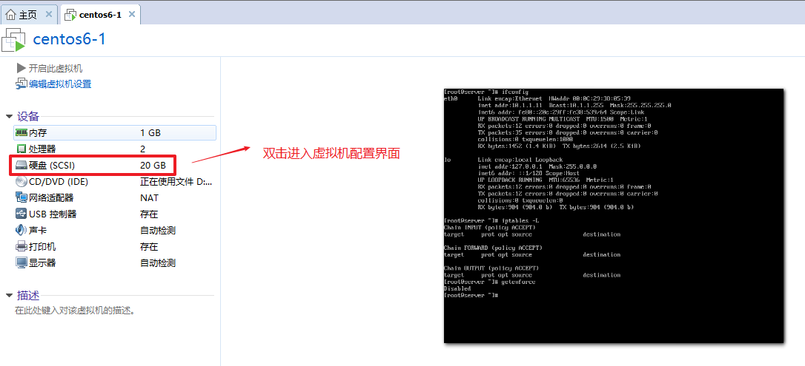
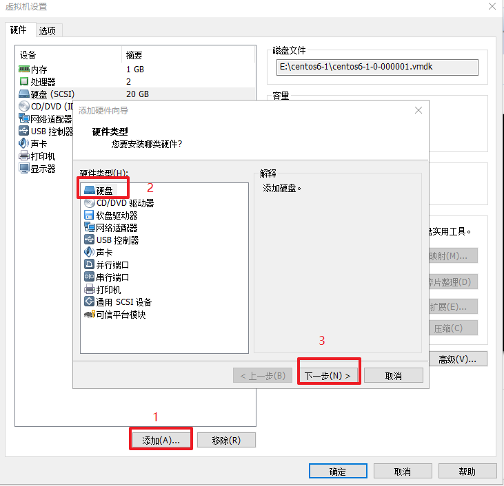
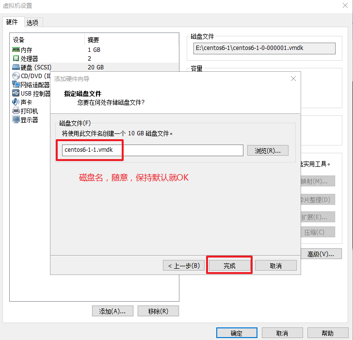
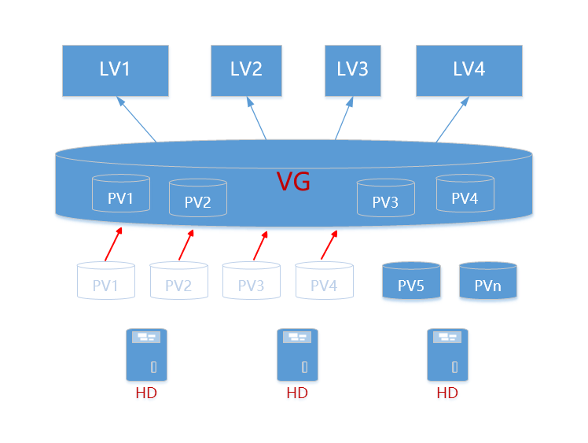

# 任务背景

某天接到短信报警提示，显示某主机的根分区空间使用率超过85%，该主机用于影评(mysql)和报表数据库(oracle)。经查看发现其中MySQL数据库的数据文件存放在/usr/local/mysql/中，占用根文件系统空间导致。由于前期规划不合理，没有将业务数据和系统数据分开。经研究决定，要将影评的数据库单独放到另一块磁盘上，并且实现==逻辑卷管理==。

关键字: disk  硬盘  磁盘  存储  

# 任务要求

1. 保证数据库完整的情况下将影评数据库迁移到另外一块新添加的磁盘上
2. 考虑到数据增长情况，新磁盘使用lvm逻辑卷管理，方便日后动态扩容

# 任务拆解

1. 需要有一块可用硬盘（需要在虚拟机里增加一块硬盘）
2. ==使用lvm方式管理磁盘（学习lvm相关的知识点）==


# 涉及知识点

- 磁盘分区相关概念和工具(fdisk)
- ==LVM逻辑卷相关概念和工具使用（重点）==

# 学习目标

- [ ] 能够使用fdisk命令对磁盘进行分区

- [ ] 熟悉设备的挂载方式（手动、开机自动、autofs自动）

- [ ] 理解物理卷、卷组、逻辑卷的概念

- [ ] ==能够根据需求创建逻辑卷（重点）==

- [ ] ==能够根据需求动态扩容逻辑卷（重点）==
- [ ] 熟练使用逻辑卷相关命令（pvcreate/vgcreate/lvcreate等）

# 理论储备

# 一、硬盘的基本知识

## 1.了解硬盘的接口类型

1.1 硬盘的分类

- 机械式硬盘
- 固态硬盘

1.2 硬盘接口类型

IDE    ——>  SATA I/II/III		个人pc机


SCSI   ——>  SAS 				服务器上

硬件服务器及硬盘参考: https://www.dell.com/zh-cn/work/shop/cty/sc/servers

## 2. 硬盘命名方式

| OS    | IDE(并口) | SATA(串口) | SCSI(并口) | SAS(串口) |
| ----- | --------- | ---------- | ---------- | --------- |
| RHEL5 | /dev/hda  | /dev/sda   | /dev/sda   | /dev/sda  |
| RHEL6 | /dev/sda  | /dev/sda   | /dev/sda   | /dev/sda  |
| RHEL7 | /dev/sda  | /dev/sda   | /dev/sda   | /dev/sda  |

/dev/sda2

==s===硬件接口类型（sata/scsi）,==d===disk（硬盘）,==a===第1块硬盘（b，第二块），==2===第几个分区

**注:** 有些硬件产商的服务器的命名方式可能会有小差异。

## 3. MBR与分区表

问题: 为什么要分区?

~~~powershell
硬盘比较大，通过分区的方式可以划分成多个可以使用的独立空间。
如windows里的C盘存放系统,D盘存放软件,E盘存放学习资料等。
~~~

分区信息就是存放在分区表中,分区表又存放在MBR中


MBR(Master Boot Record，主引导记录)是用来引导启动操作系统的区域，在硬盘的最前面的512个字节

由三部分组成，即：

1. Bootloader（主引导程序）===446字节==
   - 引导操作系统的主程序
2. DPT分区表（Disk Partition Table）===64字节==
   - 分区表保存了硬盘的分区信息，操作系统通过读取分区表内的信息，就能够获得该硬盘的分区信息
   - 每个分区需要占用==16个字节大小==，保存有文件系统标识、起止柱面号、磁头号、扇区号、起始扇区位置（4个字节）、分区总扇区数目（4个字节）等内容
   - 分区表中保存的分区信息都是==主分区与扩展分区==的分区信息，==扩展分区不能直接使用==，需要在扩展分区内划分一个或多个逻辑分区后才能使用
   - ==逻辑分区的分区信息==保存在==扩展分区内==而不是保存在MBR分区表内，这样，就可以突破MBR分区表只能保存4个分区的限制
3. 硬盘有效标志（校验位）===2个字节==

**重点是分区表的64个字节**


16个字节代表1个分区，两种分区方案:

* **4个主分区（primary)**
* **3个主分区+1个扩展分区extended（N个逻辑分区 logical）**


# 二、分区管理

## 1. 磁盘划分思路

- 分区
- 更新分区表<刷新分区表>
- 格式化分区——>文件系统
- 挂载使用——>mount【开机自动挂载|autofs自动挂载】

## 2. 查看设备常见命令与解析

| 命令      | 说明                           |
| --------- | ------------------------------ |
| lsblk     | 查看系统的块设备               |
| df  -h    | 查看正在挂载的设备情况         |
| fdisk  -l | 查看当前系统的所有设备分区情况 |

~~~powershell
# fdisk -l

硬盘容量　＝　柱面数　×　盘面数（磁头数）　×　扇区数　×　扇区大小（一般为512字节）
Disk /dev/sda: 26.8 GB, 26843545600 bytes   磁盘空间
 255 heads, 63 sectors/track, 3263 cylinders
 255磁头    63个扇区 每 磁道   3263个圆柱体
Units = cylinders of 16065 * 512 = 8225280 bytes       单元
Sector size (logical/physical): 512 bytes / 512 bytes
扇区大小（逻辑/物理）  都是512字节。
I/O size (minimum/optimal): 512 bytes / 512 bytes
I/O 大小（最小/最大） 都是512字节。
Disk identifier: 0x00030124   设备识别码

 启动设备加*           起始         结束      块           id     系统
 Device Boot      Start         End      Blocks     Id  System
/dev/sda1   *           1        2497    20051968   83  Linux
/dev/sda2            2497        2611      916481    5  Extended	扩展分区
/dev/sda3            2612        3263     5237190   83  Linux
/dev/sda5            2497        2611      916480   82  Linux swap / Solaris
~~~


## 3. ==使用fdisk分区==

添加一块10G大小硬盘，对其进行分区操作。

**思路:**

1. 增加一块硬盘
2. 使用fdisk命令进行分区
3. 格式化指定分区
4. 创建一个空的目录作为挂载点
5. 挂载使用

**步骤:**

第1步: 增加硬盘

准备一台虚拟机，增加一块10G大小的硬盘









**注意:** vmware虚拟机加完磁盘后需要reboot才能生效。重启后使用`lsblk`或`fdisk -l`查看硬盘是否添加成功


第2步: 使用fdisk命令对新硬盘分区

~~~powershell
# fdisk /dev/sdb

Command(m for help): m      						输出帮助信息
Commandaction
   a  toggle a bootable flag  						设置启动分区
   b  edit bsd disklabel      						编辑分区标签
   c  toggle the dos compatibility flag
   d  delete a partition        					删除一个分区					 (常用)
   l  list known partition types  					列出分区类型
   m  print this menu         						帮助						    (常用)
   n  add a new partition     						建立一个新的分区				(常用)
   o  create a new empty DOS partition table  		创建一个新的空白DOS分区表
   p  print the partition table               		打印分区表					  (常用)
   q  quit without saving changes           		退出不保存设置					 (常用)
   s  createa new empty Sun disklabel				创建一个新的空的SUN标示
   t  changea partition's system id          		改变分区的类型
   u  changedisplay/entry units            			改变显示的单位
   v  verifythe partition table              		检查验证分区表
   w  write table to disk and exit           		保存分区表					  (常用)
~~~


~~~powershell
# fdisk /dev/sdb				要对哪个磁盘分区，就接哪个磁盘名(不是分区名)
Command (m for help): p			打印分区表信息

Disk /dev/sdb: 10.7 GB, 10737418240 bytes
255 heads, 63 sectors/track, 1305 cylinders
Units = cylinders of 16065 * 512 = 8225280 bytes
Sector size (logical/physical): 512 bytes / 512 bytes
I/O size (minimum/optimal): 512 bytes / 512 bytes
Disk identifier: 0x31dd29ec

   Device Boot      Start         End      Blocks   Id  System

Command (m for help): n			创建新分区
Command action
   e   extended		扩展分区
   p   primary partition (1-4)   主分区
p
Partition number (1-4): 1		选择主分区编号
First cylinder (1-1305, default 1): 	起始柱面默认即可（直接回车）
Using default value 1
Last cylinder, +cylinders or +size{K,M,G} (1-1305, default 1305): +1G  分区大小1G

Command (m for help): p

Disk /dev/sdb: 10.7 GB, 10737418240 bytes
255 heads, 63 sectors/track, 1305 cylinders
Units = cylinders of 16065 * 512 = 8225280 bytes
Sector size (logical/physical): 512 bytes / 512 bytes
I/O size (minimum/optimal): 512 bytes / 512 bytes
Disk identifier: 0x31dd29ec

   Device Boot      Start         End      Blocks   Id  System
/dev/sdb1               1         132     1060258+  83  Linux

Command (m for help): n
Command action
   e   extended
   p   primary partition (1-4)
p
Partition number (1-4): 2
First cylinder (133-1305, default 133): 
Using default value 133
Last cylinder, +cylinders or +size{K,M,G} (133-1305, default 1305): +1G

Command (m for help): p

Disk /dev/sdb: 10.7 GB, 10737418240 bytes
255 heads, 63 sectors/track, 1305 cylinders
Units = cylinders of 16065 * 512 = 8225280 bytes
Sector size (logical/physical): 512 bytes / 512 bytes
I/O size (minimum/optimal): 512 bytes / 512 bytes
Disk identifier: 0x31dd29ec

   Device Boot      Start         End      Blocks   Id  System
/dev/sdb1               1         132     1060258+  83  Linux
/dev/sdb2             133         264     1060290   83  Linux

Command (m for help): w			保存退出
The partition table has been altered!

Calling ioctl() to re-read partition table.
Syncing disks.
~~~

第3步: 刷新分区表信息使之生效，并验证分区设备是否成功

~~~powershell
# partprobe -a /dev/sdb   #partx在centos6中使用，partprobe在centos7中使用。
BLKPG: Device or resource busy
error adding partition 1
BLKPG: Device or resource busy
error adding partition 2
注意: 有报错不用管(centos6是这样的)，主要下面命令确认一下能看到分的区就OK

# ls /dev/sdb*
/dev/sdb /dev/sdb1 /dev/sdb2
~~~

第4步: 格式化分区

~~~powershell
# mkfs.ext4 /dev/sdb1      (格式化是接分区名，不是磁盘名)
~~~

第5步: 创建新的挂载点

~~~powershell
# mkdir /u01
~~~

第6步: 挂载使用

~~~powershell
# mount /dev/sdb1 /u01

# df -h |tail -2
/dev/sdb1       988M  1.3M  935M   1% /u01
~~~

**课堂练习:**

请将sdb分多个区(**注意: 第4个区为extended类型**)，最终效果如下:

~~~powershell
分区1-3为主分区,大小1G。分区4为扩展分区,大小为7G。分区5为逻辑扩展分区，大小为1G。
分区6为逻辑扩展分区，大小为剩余的6G.
Disk /dev/sdb: 10.7 GB, 10737418240 bytes
/dev/sdb1               1         132     1060258+  83  Linux
/dev/sdb2             133         264     1060290   83  Linux
/dev/sdb3             265         396     1060290   83  Linux
/dev/sdb4             397        1305     7301542+   5  Extended
/dev/sdb5             397         528     1060258+  83  Linux
/dev/sdb6             529        1305     6241221   83  Linux
~~~


**分区要注意的地方:**

1. 扩展分区的大小决定了所有==逻辑分区==的大小(通俗的说就是逻辑分区属于扩展分区内部)
2. 删除扩展分区后下面的逻辑分区都被删除
3. 分完区后需要手动刷新分区表，如果刷新不成功需要重启操作系统(备注:这是centos6的坑,无须太在意)
4. 创建分区的时候尽可能注意分区序号的连续性,也建议cylinder要连续,不要跳着分区
5. 扩展分区不能格式化使用

1Byte=8bit

1k=1024B

1M=1024k

1G=1024M

1T=1024G

1P=1024T

1E=1024P


## 4. 挂载分区设备

### **手动挂载**

~~~powershell
mount   [options]     需要挂载的设备     挂载点
特点：系统重启后需要重新挂载；手动卸载后需要手动挂载
~~~

注意: **==下面两种情况都不建议==**

* 一个设备可以同时挂载多个目录

* 多个设备也可以同时挂载一个目录(后面设备会覆盖前面的挂载)

**挂载参数**

~~~powershell
-o:挂载选项	如:ro,rw,remount等
-t:文件系统类型  如ext4,vfat等
mount.ext4=mount -t ext4		(centos6中默认为ext4文件系统)
mount.vfat=mount -t vfat

# mount -o remount,ro /u01
remount:重新挂载一个正在挂载的设备,可以重新指定参数
~~~

**注意:** ==不要随意用remount参数重挂载根分区==

**挂载点可以是设备，也可以是目录本身**

~~~powershell
# mount -o remount,ro /dev/sdb1		
# mount -o remount,ro /u01
~~~


**需要挂载的设备可以是以下三种:**

1. **设备名**  如:/dev/sdb1
2. **设备UUID**

~~~powershell
blkid命令查看分区相关信息(uuid,卷标等)
# blkid /dev/sdb1
/dev/sdb1: UUID="8b79a244-02f8-42ea-83cf-b45cdecbe04a" TYPE="ext4"
UUID是由格式化后产生的一个唯一设备标识

卸载设备：umount
# umount /u01
# mount UUID="8b79a244-02f8-42ea-83cf-b45cdecbe04a" /u01
~~~

3. **设备卷标**

~~~powershell
# e2label /dev/sdb1 DISK1
说明：e2label只能够对ext2~ext4的文件系统设置卷标
# e2label /dev/sdb1
DISK1
# blkid /dev/sdb1
/dev/sdb1: UUID="8b79a244-02f8-42ea-83cf-b45cdecbe04a" TYPE="ext4" LABEL="DISK1"

卸载设备：umount
# umount  /u01
# mount LABEL="DISK1" /u01/
~~~

### **开机自动挂载**

按照前面学习的经验: 改主机名要永久修改需要写到配置文件里，改IP要永久修改需要写到配置文件里。同理: 要实现开机自动挂载，也需要写到配置文件里，这个配置文件就是`/etc/fstab`

**fstab文件结构**

~~~powershell
# vim /etc/fstab      
UUID=d4344b51-09d9-467b-b12d-db74dff79f2a /                 ext4    defaults        1 1
UUID=43f4ad4a-4fa8-47ab-8489-e3a13c599f18 /boot             ext4    defaults        1 2
UUID=f9a9a50e-5d90-4402-90e3-c08ec69e8966 swap              swap    defaults        0 0
tmpfs                   /dev/shm                tmpfs   defaults        0 0
devpts                  /dev/pts                devpts  gid=5,mode=620  0 0
sysfs                   /sys                    sysfs   defaults        0 0
proc                    /proc                   proc    defaults        0 0

说明:主要看前三句，后四句是和终端，内存临时文件系统与伪文件系统的挂载有关(建议不要动后四句)
~~~

**fstab文件参数(重点关注第1-4列)**

~~~powershell
/etc/fstab文件：
格式：
要挂载的资源路径	挂载点	文件系统类型	挂载选项	dump备份支持  文件系统检测
UUID=d4344b51-09d9-467b-b12d-db74dff79f2a /                 ext4    defaults,        1 1
1列：挂载的设备（磁盘设备的文件名或设备的卷标或者是设备的UUID）
2列：挂载点（建议用一个空目录），建议不要将多个设备挂载到同一个挂载点上
3列：文件系统类型（ext3、ext4、vfat、ntfs（安装软件包）、swap等等）
4列：挂载选项
async/sync  			异步/同步：
auto/noauto     		自动/非自动：
rw/ro   				读写/只读：
exec/noexec     		可被执行/不可被执行：
remount     			重新挂在一个已经挂载的文件系统，常用于修改挂载参数
user/nouser     		允许/不允许其他普通用户挂载：
suid/nosuid     		具有/不具有suid权限：该文件系统是否允许SUID的存在。
usrquota    			这个是在启动文件系统的时候，让其支持磁盘配额，这个是针对用户的。
grpquota    			支持用户组的磁盘配额。
....
defaults 同时具有rw, dev, exec, acl, async,nouser等参数。

5列：是否支持dump备份。//dump是一个用来备份的命令，0代表不要做dump备份，1代表要每天进行dump的动作，2也代表其他不定日期的dump备份。通常这个数值不是0就是1。数字越小优先级越高。

6列：是否用 fsck 检验扇区。//开机的过程中，系统默认会用fsck检验文件系统是否完整。0是不要检验，1表示最先检验(一般只有根目录会设定为1)，2也是要检验，只是1是最先，2是其次才进行检验。
~~~

**实例:** 将我们前面分区的/dev/sdb1写到fstab里实现自动挂载

~~~powershell
# umount /u01

# vim /etc/fstab
UUID="8b79a244-02f8-42ea-83cf-b45cdecbe04a"   /u01	ext4	defaults	0	0

# mount -a
此命令会检查/etc/fstab文件里的挂载配置，没挂载的会帮你挂载

# reboot
也可以重启系统测试是否挂载成功
~~~

扩展: 光驱也可以使用/etc/fstab实现自动挂载,写法如下

~~~powershell
/dev/sr0        /mnt    iso9660 	defaults        0 0
~~~


### **自动挂载 Automount**

**特点：**

* 挂载是由访问产生
* 卸载是由超时产生
* 依赖于autofs服务

**需求:** 让系统自动挂载/dev/sdb1设备到/u01，如果2分钟没有被用自动卸载

**思路:**

1. 安装autofs软件
2. 修改配置文件迎合需求
3. 重启autofs服务
4. 测试验证

**步骤:**

第1步: 安装autofs软件

~~~powershell
# yum -y install autofs
~~~

第2步: 修改配置文件

~~~powershell
主配置文件最后追加这一句
# vim /etc/auto.master		
/u01    /etc/auto.test	-t 120
表示/u01目录的挂载由/etc/auto.test这个子配置文件来决定，-t 120代表超时时间120秒

# vim /etc/auto.test
test  -fstype=ext4,rw   :/dev/sdb1
表示/dev/sdb1会自动挂载到/u01/test/目录，ext4,rw为挂载参数
~~~

第3步: 重启服务

~~~powershell
# systemctl restart autofs
~~~

第4步: 测试验证

~~~powershell
# ls /u01/				没有test子目录，因为autofs需要访问挂载点才会自动挂载

访问一下挂载点,就看到自动挂载了
# ls /u01/test
# df -h |tail -1
/dev/sdb1       988M  1.3M  935M   1% /u01/test
~~~

**课后拓展练习:**

~~~powershell
如果想要将/dev/sdb1挂载到/u01下，怎么做？
# vim /etc/auto.master
/-		/etc/auto.test

# vim /etc/auto.test
/u01	-fstype=ext4 :/dev/sdb1

# /etc/init.d/autofs restart
~~~


# 三、==逻辑卷管理（重点）==

## 1. 逻辑卷介绍

**逻辑卷：**(logical  volume management)
逻辑卷(LVM):  它是Linux环境下对**物理磁盘设备（硬盘或分区)**进行管理的一种机制，优点在于**灵活**管理。
**特点：**
  1、**==动态在线扩容(重点)==**
  2、离线裁剪(拓展)
  3、数据条带化(拓展)
  4、数据镜像(拓展)

## 2. 逻辑卷基本概念



- 物理卷（Physical Volume，PV）

物理卷是底层真正提供容量，存放数据的设备,它可以是整个硬盘、硬盘上的分区等。

- 卷组（Volume Group, VG）

卷组建立在物理卷之上，它由==一个或多个物理卷==组成。即把物理卷整合起来提供容量分配。
一个LVM系统中可以只有一个卷组，也可以包含多个卷组。

- 逻辑卷（Logical Volume, LV）

逻辑卷建立在卷组之上，它是从卷组中“切出”的一块空间。它是==最终用户使用的逻辑设==备。逻辑卷创建之后，其大小可以伸缩。

- 物理区域 PE（physical extent）

每一个物理卷被划分为称为PE(Physical Extents)的基本单元，具有唯一编号的PE是能被LVM寻址的最小单元。PE的大小可指定，默认为4 MB。 PE的大小一旦确定将不能改变，同一个卷组中的所有物理卷的PE的大小是一致的。
4MB=4096kb=4096kb/4kb=1024个block

说明：

1. 硬盘读取数据最小单位1个扇区512字节
2. 操作读取数据最小单位1个数据块=8*512字节=4096字节=4KB
3. lvm寻址最小单位1个PE=4MB

- 逻辑区域 LE（logical extent）

逻辑卷也被划分为被称为LE(Logical Extents) 的可被寻址的基本单位。在同一个卷组中，LE的大小和PE是相同的，并且一一对应。

真实的物理设备——>逻辑上——>物理卷（pv）——>卷组（vg）——>逻辑卷（lv）——>逻辑卷格式化——>挂载使用

## 3. 逻辑卷LVM应用

### 3.1 逻辑卷创建

需求: 创建一个2.5G大小的逻辑卷

1. 准备物理的设备	
2. 将物理设备做成物理卷PV (pvcreate)
3. 一个或多个物理卷合成一个卷组VG   (vgcreate/vgextend)
4. 在卷组中划分逻辑卷LV  (lvcreate)
5. 格式化逻辑卷
6. 挂载使用

第1步: 准备好物理设备，直接用前面学过的分区来测试

~~~powershell
Disk /dev/sdb: 10.7 GB, 10737418240 bytes
/dev/sdb1               1         132     1060258+  83  Linux
/dev/sdb2             133         264     1060290   83  Linux
/dev/sdb3             265         396     1060290   83  Linux
/dev/sdb4             397        1305     7301542+   5  Extended
/dev/sdb5             397         528     1060258+  83  Linux
/dev/sdb6             529        1305     6241221   83  Linux
~~~

第2步: 安装lvm相关软件包

~~~powershell
# yum install lvm2 lvm2-libs -y
~~~

第3步: 创建物理卷(PV)

~~~powershell
我这里选择sdb5和sdb6这两个分区来测试(你可以自由选择,但extended分区不可以)
# pvcreate /dev/sdb5 /dev/sdb6

# pvs
  PV         VG   Fmt  Attr PSize PFree
  /dev/sdb5       lvm2 ---- 1.01g 1.01g
  /dev/sdb6       lvm2 ---- 5.95g 5.95g
除了pvs还可以使用pvdisplay和pvscan等命令查看
~~~

第4步: 创建卷组(VG)使用vgcreate命令,还可以使用vgextend命令扩展

~~~powershell
创建卷组，组名vg01(可以自定义); 假设还有其它PV要加入vg01卷组，可以使用vgextend 卷组名 物理卷名
# vgcreate vg01 /dev/sdb5 /dev/sdb6

# vgs
  VG   #PV #LV #SN Attr   VSize VFree
  vg01   2   0   0 wz--n- 6.96g 6.96g		大小为所有PV的大小之和,也可以使用vgdisplay查看
~~~

第5步: 将卷组划分为逻辑卷(LV)

```powershell
-n：指定逻辑卷的名字
-L：指定逻辑卷的大小
-l：指定逻辑卷的大小
举例：
-l 100			100个PE，每个PE大小默认4M，故逻辑卷大小为400M
-l 50%free		卷组剩余空间的50%

# lvcreate -n lv01 -L 2.5G vg01
  Logical volume "lv01" created
  
# lvcreate -n lv02 -l 100 vg01
  Logical volume "lv02" created.
    
# lvcreate -n lv03 -l 50%free vg01
  Logical volume "lv03" created.

# lvs
  LV   VG   Attr       LSize   Pool Origin Data%  Meta%  Move Log Cpy%Sync Convert
  lv01 vg01 -wi-a-----   2.50g                                                  
  lv02 vg01 -wi-a----- 400.00m                                                  
  lv03 vg01 -wi-a-----   2.03g 

# ls /dev/vg01/
lv01  lv02  lv03
# ls /dev/mapper/vg01*
/dev/mapper/vg01-lv01 /dev/mapper/vg01-lv02 /dev/mapper/vg01-lv03
```

第6步: 格式化并挂载(这里以lv01为例)

~~~powershell
# mkfs.ext4 /dev/vg01/lv01

# mount /dev/vg01/lv01  /u01/
~~~


**拓展:** 如果要删除逻辑卷,逆向操作步骤为:

~~~powershell
# umount /dev/vg01/lv01

# lvremove vg01
Do you really want to remove active logical volume lv01? [y/n]: y
  Logical volume "lv01" successfully removed
Do you really want to remove active logical volume lv02? [y/n]: y
  Logical volume "lv02" successfully removed
Do you really want to remove active logical volume lv03? [y/n]: y
  Logical volume "lv03" successfully removed
lvremove /dev/vg01/lv02此命令代表只删除一个lv

# vgremove vg01
  Volume group "vg01" successfully removed
  
# pvremove /dev/sdb5 /dev/sdb6
  Labels on physical volume "/dev/sdb5" successfully wiped
  Labels on physical volume "/dev/sdb6" successfully wiped
~~~


### 3.2 逻辑卷动态扩容

需求：将/u01目录动态扩容到3G

思路：
1. 查看/u01目录所对应的逻辑卷是哪一个  /dev/vg01/lv01
2. 查看当前逻辑卷所在的卷组vg01剩余空间是否足够
3. 如果vg01空间不够，得先扩容卷组，再扩容逻辑卷
4. 如果vg01空间足够，直接扩容逻辑卷

**步骤:**

第1步: 查看/u01目录所对应的逻辑卷是哪一个

~~~powershell
# df -h
Filesystem            Size  Used Avail Use% Mounted on
/dev/sda3              18G  797M   16G   5% /
tmpfs                 491M     0  491M   0% /dev/shm
/dev/sda1             190M   32M  149M  18% /boot
/dev/sr0              3.7G  3.7G     0 100% /yum
/dev/mapper/vg01-lv01
                      2.4G  3.8M  2.3G   1% /u01
~~~

第2步: 查看当前逻辑卷所在的卷组vg01剩余空间是否足够

~~~powershell
# vgs
  VG   #PV #LV #SN Attr   VSize VFree
  vg01   2   3   0 wz--n- 6.96g 2.04g		
  空闲空间还有2G，足够(如果不够,再创建新的PV，使用vgextend vg01 物理卷名扩容卷组)
~~~

第3步: 在线扩容逻辑卷

```powershell
# lvextend -L 3G /dev/vg01/lv01		-L 3G最终的大小
或者
# lvextend -L +1.5G /dev/vg01/lv01 	 -L +1.5G 扩容1.5G

# lvs |grep lv01
  lv01 vg01 -wi-ao----   3.00g   
```

第4步: 同步文件系统

~~~powershell
# xfs_growfs /dev/vg01/lv01
~~~

第5步: 验证在线扩容成功

~~~powershell
# df -h
Filesystem            Size  Used Avail Use% Mounted on
/dev/sda3              18G  797M   16G   5% /
tmpfs                 491M     0  491M   0% /dev/shm
/dev/sda1             190M   32M  149M  18% /boot
/dev/sr0              3.7G  3.7G     0 100% /yum
/dev/mapper/vg01-lv01
                      2.9G  3.8M  2.8G   1% /u01
~~~


离线裁剪逻辑卷（拓展）

```powershell
# umount /u01/
# e2fsck -f /dev/vg01/lv01			检验文件系统
# resize2fs /dev/vg01/lv01 2G		裁剪文件系统到2G
# lvreduce /dev/vg01/lv01 -L 2G		裁剪逻辑卷
# mount /dev/vg01/lv01 /u01			挂载使用
```


#课后扩展补充

##一、 扩容swap空间(建议做一下)

==方法1：增加一个硬盘或者分区来扩容swap空间==

~~~powershell
查看swap空间大小：
# free -m
             total       used       free     shared    buffers     cached
Mem:          1861        646       1215          0          9         60
-/+ buffers/cache:        576       1285
Swap:         2047          0       2047
# swapon -s
Filename				Type		Size	Used	Priority
/dev/dm-1                               partition	2097144	0	-1

# mkswap /dev/sdb7
Setting up swapspace version 1, size = 2104476 KiB
no label, UUID=485ff8ad-a636-4556-a2e7-4ee9efc78afb
# blkid /dev/sdb7
/dev/sdb7: UUID="485ff8ad-a636-4556-a2e7-4ee9efc78afb" TYPE="swap"  

//激活swap分区。swap空间不能手动挂载
# swapon /dev/sdb7

# swapon -s
Filename				Type		Size	Used	Priority
/dev/dm-1                               partition	2031608	0	-1
/dev/sdb7                               partition	2064312	0	-2

~~~

==方法2：使用dd命令模拟大文件来扩容swap==

~~~powershell
# dd if=/dev/sr0 of=/rhel6.iso
# dd if=/dev/sda1 of=/tmp/bak.boot

# dd if=/dev/zero of=/dev/sda bs=1M count=100  //注意:不要执行,执行了sda1数据就没了

if=源文件
of=目标文件
bs=复制数据的大小
count=复制的个数

注意：
1. 一般可以使用dd命令做块设备文件的备份
2. /dev/zero 特殊设备，一般用来模拟一个大文件，源源不断的二进制的bit流;
/dev/null  空设备，类似黑洞

步骤：
1. 使用dd命令模拟大文件
# dd if=/dev/zero of=/tmp/swapfile bs=1M count=1024
2. 格式化大文件
# mkswap /tmp/swapfile 

3.激活大文件
# swapon -p 1 /tmp/swapfile
-p：指定优先级，数字越大优先级越高，0-32767
4. 查看
# swapon -s
Filename				Type		Size	Used	Priority
/tmp/swapfile                           file		1048568	0	1

如果开机自动挂载，需要修改文件：/etc/fstab
/swap_file	swap swap defautls,pri=1 0 0
~~~

## 二、逻辑卷实现条带化(了解即可)

~~~powershell
条带化：
        把保存到逻辑卷的数据分成n等分，分别写到不同的物理卷，可以提高数据的读写效率；
        如果任何一个涉及到的物理卷出现故障，数据都会无法恢复。


sdc                            8:32   0   20G  0 disk 
├─sdc1                         8:33   0    2G  0 part 
└─sdc2                         8:34   0    2G  0 part 

创建物理卷
# pvcreate /dev/sdc[12]

查看物理卷
# pvs
/dev/sdc1            lvm2 a--   2.01g  2.01g
/dev/sdc2            lvm2 a--   2.01g  2.01g


创建卷组：
# vgcreate vg01 /dev/sdc[12]

# pvs /dev/sdc[12]
  PV         VG   Fmt  Attr PSize PFree
 /dev/sdc1  vg01      lvm2 a--   2.00g  2.00g
 /dev/sdc2  vg01      lvm2 a--   2.00g  2.00g


创建实现条带化的逻辑卷：
# lvcreate -n lv01 -L 1G vg01 -i 2 /dev/sdc[12]
  Using default stripesize 64.00 KiB
  Logical volume "lv01" created
  
# lvs /dev/vg01/lv01 
  LV   VG   Attr       LSize Pool Origin Data%  Move Log Cpy%Sync Convert
  lv01 vg01 -wi-a----- 1.00g                                             
# pvs /dev/sdc[12]
  PV         VG   Fmt  Attr PSize PFree
  /dev/sdc1  vg01 lvm2 a--  2.00g 1.50g
  /dev/sdc2  vg01 lvm2 a--  2.00g 1.50g


-i 参数：给出条带化的数量


格式化挂载使用：
# mkfs.ext4 /dev/vg01/lv01
# mount /dev/vg01/lv01 /u01


测试：
# yum -y install sysstat
# iostat -m -d /dev/sdc[12] 2 
-d 查看磁盘
-m 以什么速度显示，每秒M
 2 每隔2s显示一次 
   如果后面还有数字则代表总共显示多少次
   
# dd if=/dev/zero of=/u01/test bs=1M count=1000    模拟写数据
# iostat -m -d /dev/sdc[12] 1
。。。
Device:            tps    MB_read/s    MB_wrtn/s    MB_read    MB_wrtn
sdb5            178.00         0.00        52.00          0         52
sdb6            177.00         0.00        52.00          0         52

~~~

##三、逻辑卷实现镜像(了解即可)

~~~powershell
逻辑卷实现镜像：
镜像：对某个逻辑卷的数据做镜像，起到数据备份的作用。

当前环境：
├─sdb7                    8:23   0    2G  0 part 
└─sdb8                    8:24   0    2G  0 part 


创建物理卷：
# pvcreate /dev/sdb[78]
# pvs /dev/sdb[78]
  PV         VG   Fmt  Attr PSize PFree
  /dev/sdb7       lvm2 a--  2.01g 2.01g
  /dev/sdb8       lvm2 a--  2.01g 2.01g

  
 将物理卷加入到vg02卷组：
# vgextend vg02 /dev/sdb[78]
  Volume group "vg02" successfully extended
# vgs vg02
  VG   #PV #LV #SN Attr   VSize VFree
  vg02   4   1   0 wz--n- 8.02g 6.02g


创建实现镜像的逻辑卷：
# lvcreate -n lv02 -L 2G vg02 -m 1 /dev/sdb[78]
  Logical volume "lv02" created

-m参数：给出镜像的个数；1表示1个镜像

# lvs
  LV       VG   Attr       LSize  Pool Origin Data%  Move Log       Cpy%Sync Convert
  lv_root  vg01 -wi-ao---- 17.70g                                                   
  lv_swap  vg01 -wi-ao----  2.00g                                                   
  lv01     vg02 -wi-ao----  2.00g                                                   
  lv02     vg02 mwi-a-m---  2.00g                         lv02_mlog    38.67        
  lv-mysql vg03 -wi-ao---- 10.00g                                                   
   

说明： Cpy%Sync 53.52该值是100%说明复制ok 

创建后：
# pvs /dev/sdb[78]
  PV         VG   Fmt  Attr PSize PFree
  /dev/sdb7  vg02 lvm2 a--  2.00g 4.00m
  /dev/sdb8  vg02 lvm2 a--  2.00g    0 


格式化逻辑卷：
# mkfs.ext4 /dev/vg02/lv02
挂载使用
# mount /dev/mapper/vg02-lv02 /u02

# touch /u02/file{1..3}
# mkdir /u02/dir{1..3}

 
测试验证：
思路：损坏一个磁盘，测试数据是否在第二个物理卷中
1. 使用dd命令破坏一个物理卷
# dd if=/dev/zero of=/dev/sdb7 bs=1M count=100

2. 再次查看物理卷发现有一个unknown Device
 /dev/sdc       vg03 lvm2 a--  20.00g 10.00g
unknown device vg02 lvm2 a-m   2.00g  4.00m

3. 将损坏的盘从卷组中移除
vgreduce vg02 --removemissing --force

4. 再次查看挂载点/u02数据依然存在

自己也可以再次测试：
1. 再拿刚刚人为损坏的盘做成物理卷再次加入到vg02卷组中
# pvcreate /dev/sdb7
  Physical volume "/dev/sdb7" successfully created
# vgextend vg02 /dev/sdb7
  Volume group "vg02" successfully extended

2. 再次让/dev/sdd5和/dev/sdd6互为镜像
# lvconvert -m 1 /dev/vg02/lv02 /dev/sdb[78]
  vg02/lv02: Converted: 0.0%
  vg02/lv02: Converted: 32.2%
  vg02/lv02: Converted: 65.8%
  vg02/lv02: Converted: 97.7%
  vg02/lv02: Converted: 100.0%

3. 等待复制完成就可以再次人为模拟另一块物理卷损坏继续测试


~~~

##四、逻辑卷快照(了解即可)

~~~powershell
1. 创建快照 (EXT4)
# lvcreate -L 128M -s -n lv2-snap /dev/vg1/lv2	给lv2逻辑卷创建快照
# mount -o ro /dev/vg1/lv2-snap /mnt/lv2-snap/	挂载快照

# lvscan 		查看扫描快照
  ACTIVE            '/dev/vg1/lv1' [768.00 MiB] inherit
  ACTIVE   Original '/dev/vg1/lv2' [512.00 MiB] inherit
  ACTIVE   Snapshot '/dev/vg1/lv2-snap' [128.00 MiB] inherit

# dmsetup ls --tree
vg1-lv2--snap (252:5)
 ├─vg1-lv2--snap-cow (252:7)		保存原卷改变前的数据
 │  └─ (253:17)
 └─vg1-lv2-real (252:6)				真实的逻辑卷（原卷）
    ├─ (253:17)
    └─ (253:18)
vg1-lv2 (252:1)
 └─vg1-lv2-real (252:6)
    ├─ (253:17)
    └─ (253:18)
    
2. 修改原卷的数据
# dd if=/dev/zero of=/u01/test bs=1M count=30

3. 观察Snapshot
# lvs /dev/vg1/lv2-snap 
  LV     VG   Attr       LSize  Pool Origin Data%  Move Log Cpy%Sync Convert
  s-lv01 vg01 swi-aos--- 52.00m      lv01     0.16    
# lvs /dev/vg1/lv2-snap 
  LV     VG   Attr       LSize  Pool Origin Data%  Move Log Cpy%Sync Convert
  s-lv01 vg01 swi-aos--- 52.00m      lv01    58.16 
  

XFS：
# mount -o nouuid,ro /dev/vg1/lv1-snap /mnt/lv1-snap/s
挂载快照，尽量使用ro的方式，将不会破坏快照卷中的数据

应用场景：
/var/lib/mysql
1. 锁表
2. 备份【逻辑|物理备份】
3. 解锁

100G  物理备份		/var/lib/mysql/xxx

1. 锁表
2. 创建快照
3. 解锁
4. 挂载快照
5. 备份到指定地方
6. 删除快照

快照实现自动扩容：
/etc/lvm/lvm.conf 
snapshot_autoextend_threshold = 80
snapshot_autoextend_percent = 20
//当快照使用到80%时，自动扩容20%；当snapshot_autoextend_threshold = 100表示关闭自动扩容

~~~

## 五、磁盘配额(了解即可)

~~~powershell
磁盘配额 quota
===========================================================================
作用： 限制用户或组对磁盘空间的使用，例如文件服务器，邮件服务器...

一、启用磁盘限额
1. 让文件系统支持配额 [ext3/4]
# vim /etc/fstab 
/dev/vg02/lv02          /u01            ext4    defaults,usrquota,grpquota 0 0
# umount /u01
# mount -a
# mount |grep u01
/dev/mapper/vg02-lv02 on /u01 type ext4 (rw,usrquota,grpquota)

2. 创建磁盘配额的数据库文件
注意： 建议停用SELinux
# yum -y install quota
# quotacheck -acug
# ll /u01
total 16
-rw------- 1 root root 6144 Sep 17 09:28 aquota.group
-rw------- 1 root root 6144 Sep 17 09:28 aquota.user


//-a 所有分区（已支持配额）
//-c 创建
//-u 用户
//-g 组

3.启动磁盘配额
# quotaon -a			//启动所有分区的磁盘配额


二、日常管理
设置配额:
方法一：edquota
# edquota -u stu1
Disk quotas for user stu1 (uid 500):
  Filesystem                   blocks       soft       hard     inodes     soft     hard
  /dev/mapper/vg01-lv01          0           0          0          0        0        0  


soft:又称软限制，当用户到达这个限制以后，系统会给予警告，但仍可写入。
hard:又称硬限制，到达这个限制，就完全禁止任何写入

以下三个为磁盘空间的限制设置：
blocks：已使用空间，无需要设置
soft：用户空间使用限制，为软限制，需要设置
hard：用户空间使用限制，为硬限制，需要设置
以下三个为总文件个数的限制：
inodes：已有文件总数，无需要设置
soft：文件总数限制，为软限制，需要设置
hard：文件总数限制，为硬限制，需要设置

我们要限制stu1用户使用空间10M，最多不能超过12M，文件总数为200个，
最多不能超过250个，设置如下：
Filesystem        			blocks soft hard inodes soft hard
/dev/mapper/vg01-lv01       0     10240 12288 0    200  250 
注：空间限制是以k为单位的。

grace time: 宽限期，默认7天 
# edquota -t  修改配额的宽限期


测试：
# su - stu1
[stu1@vm1 data]$ dd if=/dev/zero of=test99 bs=1M count=11
dm-1: warning, user block quota exceeded.
11+0 records in
11+0 records out
11534336 bytes (12 MB) copied, 0.108284 s, 107 MB/s


[stu1@vm1 data]$ dd if=/dev/zero of=test99 bs=1M count=13
dm-1: warning, user block quota exceeded.
dm-1: write failed, user block limit reached.
dd: writing `test99': Disk quota exceeded
13+0 records in
12+0 records out
12582912 bytes (13 MB) copied, 0.257964 s, 48.8 MB/s

[stu1@vm1 data]$ touch file{1..6}
dm-1: warning, user file quota exceeded.

[stu1@vm1 data]$ touch file{1..11}
dm-1: write failed, user file limit reached.
touch: cannot touch `file10': Disk quota exceeded
touch: cannot touch `file11': Disk quota exceeded

[stu1@vm1 data]$ quota		//查看自己的配额情况
Disk quotas for user stu1 (uid 500): 
     Filesystem  blocks   quota   limit   grace   files   quota   limit   grace
/dev/mapper/vg01-lv01
                  12288*  10240   12288   24:00       1       5      10 


方法二: setquota
# setquota -u username block软限制 block硬限制 inode软限制 inode硬限制 分区
# setquota -u jack 80000 100000 15 20 /dev/sda2
# quota jack

方法三：复制
# edquota -p alice tom robin user1 user2 user3
将alice的配额方案复制给后面所有用户

# for i in {1..10}
> do
> useradd zhang$i
> edquota -p stu1 zhang$i
> done


+++查看配额+++
查看单个用户的配额：	    # quota jack
查看所有用户的配额：	    # repquota -a
                              	        # repquota -ag
普通用户查看自己配额：  $ quota


扩展知识：针对组设置配额
例1：限制hr组的成员能在/home/hr目录中：100M   50文件
# groupadd hr
# useradd hr01 -G hr 
# useradd hr02 -G hr
# mkdir /home/hr
# chgrp hr /home/hr
# chmod 2770 /home/hr
# ll -d /home/hr
drwxrws--- 2 root hr 4096 09-12 17:07 /home/hr

# edquota -g hr
Disk quotas for group hr (gid 507):
 	Filesystem                           blocks       soft       hard     inodes     soft     hard
	/dev/mapper/vg01-lv_home          4          0     102400          1        0        50
# repquota -ag
===========================================================================

rhel7：
注意：
1、不需要手动执行quotacheck命令对xfs文件系统进行检查，它会在mount的时候自动执行
2、不需要在xfs文件系统的根下生成quota数据文件


 # mount -o uquota /dev/xvm/home /home
 # xfs_quota -x -c 'limit bsoft=500m bhard=550m tanya' /home
 # xfs_quota -x -c report /home

-x：专家模式
-c：交互模式，可加多个

~~~

## 六、GPT分区表(建议做一下)

**两种分区表:**

| 分区表类型 | 描述                                                         |
| ---------- | ------------------------------------------------------------ |
| msdos      | 有主分区(primary),扩展分区(extend),逻辑扩展分区(logical)的概念。单个分区大小不能超过2TB。 |
| gpt        | 没有主分区(primary),扩展分区(extend),逻辑扩展分区(logical)的概念。单个分区大小可以超过2TB. |


**两个主要分区工具:**

| 分区命令 | 描述                     |
| -------- | ------------------------ |
| fdisk    | 只能分msdos分区类型      |
| parted   | 可以分msdos和gpt分区类型 |

**如何查看当前我们使用的是哪种分区表类型?**

```powershell
# parted /dev/sda	
GNU Parted 2.1
Using /dev/sda
Welcome to GNU Parted! Type 'help' to view a list of commands.
(parted) print           	使用print打印     	                                      
Model: ATA ST3500312CS (scsi)
Disk /dev/sda: 500GB
Sector size (logical/physical): 512B/512B
Partition Table: msdos		这里可以看到是msdos分区表类型
```

**这两种分区表格式怎么转换?** 

```powershell
(parted) mklabel gpt		在parted里输入这样的命令去转换
Warning: Partition(s) on /dev/sda are being used. 
Ignore/Cancel? 				输入Ignore非常危险（表示忽略警告，直接干掉系统磁盘里的所有内容)，输入Cancel取消或者ctrl+c取消
(parted) mklabel msdos
```

**==注意: 不要对正在使用的磁盘做转换,除非不需要当前硬盘的数据的话。或者先备份数据，再做转换。==**


**实验: 使用parted对新的大硬盘进行gpt分区,并验证单个分区可以大于2T**

实验准备: 虚拟机新加一个硬盘（大小为4T）


**实验过程:**

**第1步: 在虚拟机里确认4T硬盘已经加上**

~~~powershell
# fdisk -l |grep sdb				
Disk /dev/sdb: 4295.0 GB, 4294967296000 bytes, 8388608000 sectors
~~~

**第2步: 验证msdos分区不能超过2T**

~~~powershell
# fdisk /dev/sdb
Welcome to fdisk (util-linux 2.23.2).

Changes will remain in memory only, until you decide to write them.
Be careful before using the write command.

Device does not contain a recognized partition table
Building a new DOS disklabel with disk identifier 0xd4bbf5e9.

WARNING: The size of this disk is 4.3 TB (4294967296000 bytes).
DOS partition table format can not be used on drives for volumes
larger than (2199023255040 bytes) for 512-byte sectors. Use parted(1) and GUID 
partition table format (GPT).		这一段英文写得很清楚,说硬盘较大,msdos分区不能超过2T,建议使用GPT
~~~

**第3步: 使用`parted`命令分区，先指定为gpt分区表**

~~~powershell
# parted /dev/sdb 
GNU Parted 2.1
Using /dev/sdb
Welcome to GNU Parted! Type 'help' to view a list of commands.
(parted) print			print显示错误，因为还没有决定分区类型
Error: /dev/sdb: unrecognised disk label 

(parted) mklabel gpt	做成gpt类型
(parted) print
Model: Virtio Block Device (virtblk)
Disk /dev/sdb: 4194GB
Sector size (logical/physical): 512B/512B
Partition Table: gpt	可以看到是gpt分区表类型

Number  Start  End  Size  File system  Name  Flags
~~~

**第4步: 开始使用`parted`分第一个区**

~~~powershell
(parted) mkpart							分区指令
Partition name?  []? 第一个分区			 取一个名字，随意
File system type?  [ext2]? xfs 			文件系统类型(建议与后面的格式化一致，也就是说你将要mkfs.xfs来格式化成xfs文件系统，那么这里就写xfs)              	                           
Start? 2048s  			 第一个分区以0开始会有警告，这里以2048s开始或者从1049KB开始                                                             
End? 100G  				 结束位置，单位可以直接使用M,G,T等


(parted) print           使用print打印查看分区表                                           
Model: Virtio Block Device (virtblk)
Disk /dev/sdb: 4194GB
Sector size (logical/physical): 512B/512B
Partition Table: gpt

Number  Start   End    Size   File system  Name        Flags
 1      1049kB  100GB  100GB               第一个分区
~~~

**第5步: 继续分第二个分区**

```powershell
(parted) mkpart                                                             
Partition name?  []? 第二个分区                                           
File system type?  [ext2]? xfs                                          
Start?100GB  第二个分区的start建议和第一个分区end一致                                       
End?3T       这次分一个大于2T的                                                           
(parted) print                                                            
Model: Virtio Block Device (virtblk)
Disk /dev/sdb: 4194GB
Sector size (logical/physical): 512B/512B
Partition Table: gpt

Number  Start   End     Size    File system  Name        Flags
 1      1049kB  100GB   100GB                第一个分区
 2      100GB   3000GB  2900GB               第二个分区（大于2T）
```

**第6步: 分区完毕后,退出**

~~~powershell
(parted) quit 					退出，并会保存，不用像fdisk那样用w
~~~


**练习:** 请自行验证gpt分区可以轻松超过4个分区(没有主，扩展，逻辑分区等概念)


