# OpenStack自动部署

# 学习目标

- [ ] 能够了解OpenStack是什么
- [ ] 能够掌握OpenStack核心组件
- [ ] 能够掌握OpenStack组件项目及其功能
- [ ] 能够掌握OpenStack自动部署方法
- [ ] 能够掌握OpenStack基本应用

# OpenStack是什么

OpenStack是由美国国家航空航天局(NASA)与Rackspace公司合作研发并发起的，以Apache许可证授权的自由软件和开放源代码的云计算技术解决方案，其是一个项目也是一个软件，主要用于实现云项目，以云项目操作系统而存在。

**作用：** 用于部署公有云、私有云，并实现对云项目管理。

**开发语言:** Python

**网址：**http://www.openstack.org

总结：

- 是一款软件
- 是一款开源软件
- 是一个项目
- 是一款云操作系统

# OpenStack核心组件

- 核心组件

- 组件项目

  为基础组件具体提供可行性操作的项目

  - Compute  计算服务

  - Networking  网络服务

  - Object Storage  对象存储服务

  - Block Storage  块存储服务

  - Identity 身份认证服务

  - Image Service 镜像服务

  - Dashboard UI界面

  - Metering  测量

  - Orchestration 部署编排

  - Database Service 数据库服务

# OpenStack组件功能

- Compute 计算服务

  代号：Nova

  用于为用户管理虚拟机实例，根据用户需求提供虚拟服务。负责虚拟机创建、开机、关机、重启等操作，还可以为虚拟机配置CPU、内存等规格。

- Networking 网络服务

  代号：Neutron

  为云平台提供网络虚拟化，为用户提供网络接口。

- Object Storage 对象存储

  代号：Swift

  用于为云平台提供对象存储服务，允许使用其进行文件存储及检索。例如，可为Glance提供镜像存储等。

- Block Storage 块存储服务

  代号：Cinder

  用于为云平台提供块存储服务，管理块设备等，例如：创建卷、删除卷等。

- Identity 身份认证

  代号：Keystone

  为OpenStack中其它服务提供身份验证、服务注册、服务令牌等功能。

- Image Service  镜像服务

  代号：Glance

  为云平台虚拟机提供镜像服务，例如：上传镜像、删除镜像等。

- Dashboard UI页面

  代号：Horizon

  用于为OpenStack提供Web管理门户，例如：启动云主机、创建网络、设置访问控制等。

- Metering 测量服务

  代号：Ceilometer

  用于收集OpenStack内部发生的资源使用进行统计，然后为计费和监控提供数据支撑。

- Orchestration 编排部署

  代号：Heat

  为云平台提供软件运行环境自动化部署。

- Database Service 云数据库

  代号：Trove  

  用于为用户提供在OpenStack环境中提供可扩展和可靠的关系型数据库或非关系型数据库引擎服务。

# OpenStack自动部署方法(All in one)

## 硬件配置要求

| CPU  | Mem  | Disk  | NetCard |
| :--: | :--: | :---: | :-----: |
|  2+  | 8G+  | 50G*2 |   2+    |

## 系统安装

需求:

* 两个硬盘：1个系统盘，1个数据盘
* 两个网络,两张网卡: 1个管理网络，1个计算网络(走外网的网络)

1.创建kvm虚拟机

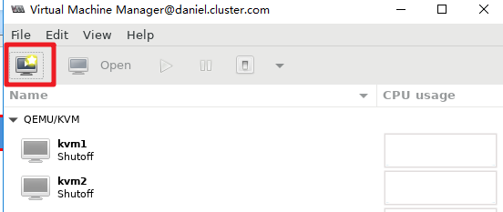

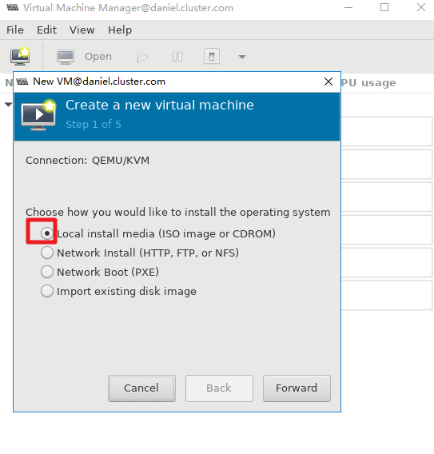

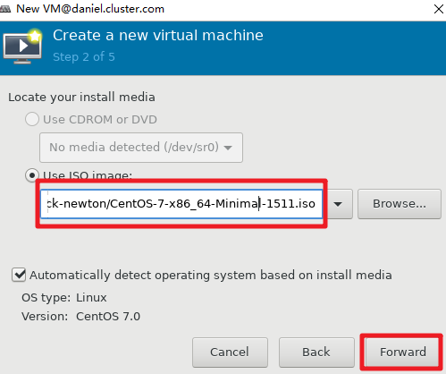

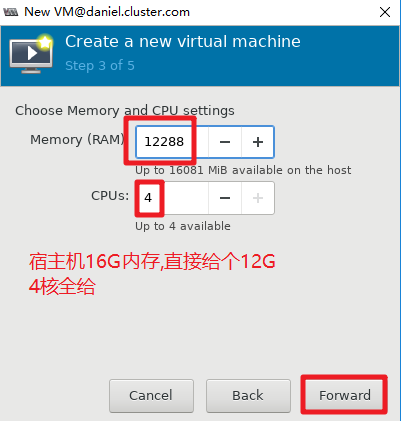

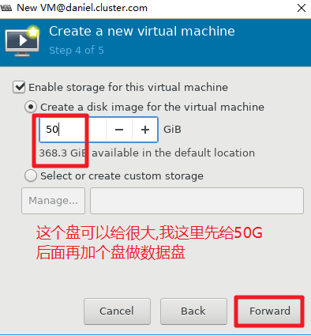

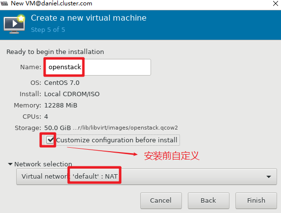

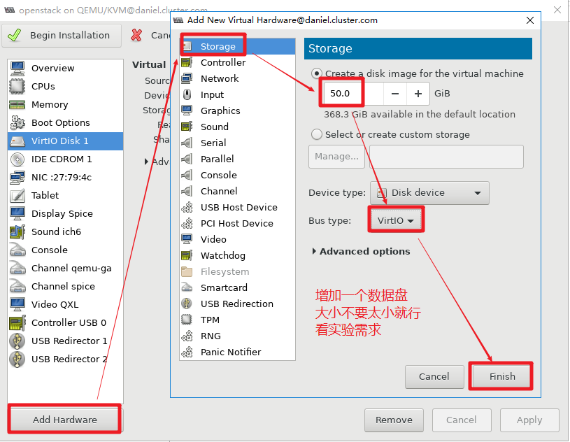

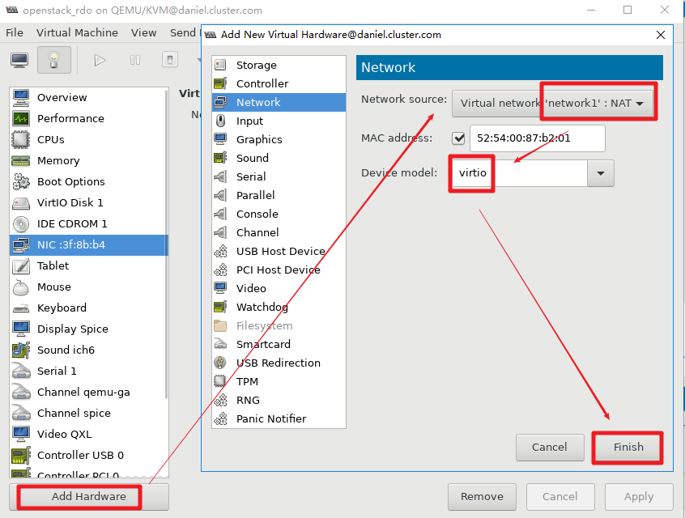

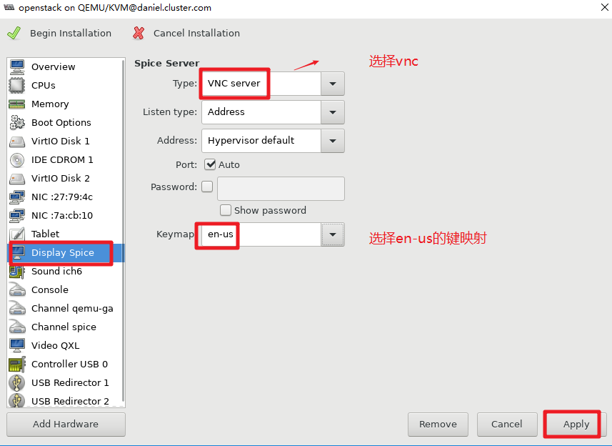

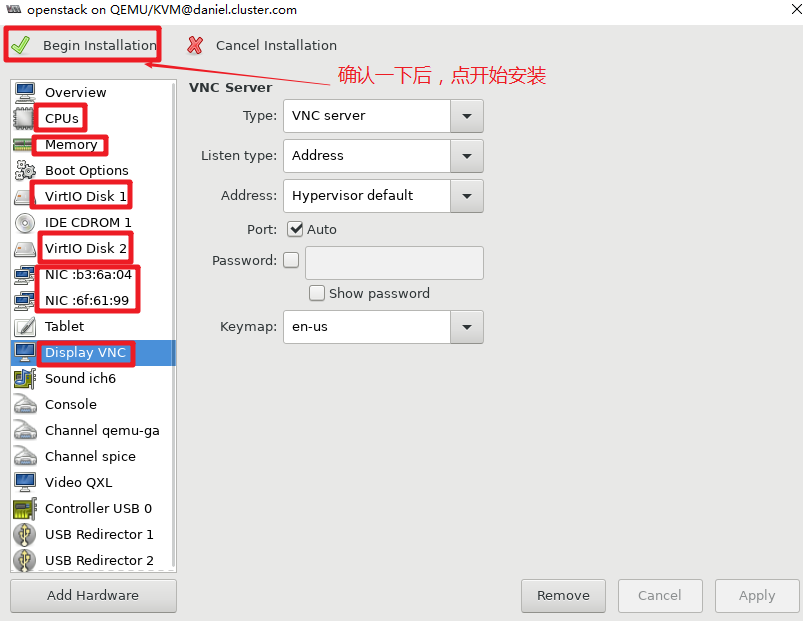

安装过程就不一一贴图了,注意的地方都在下面这2张图

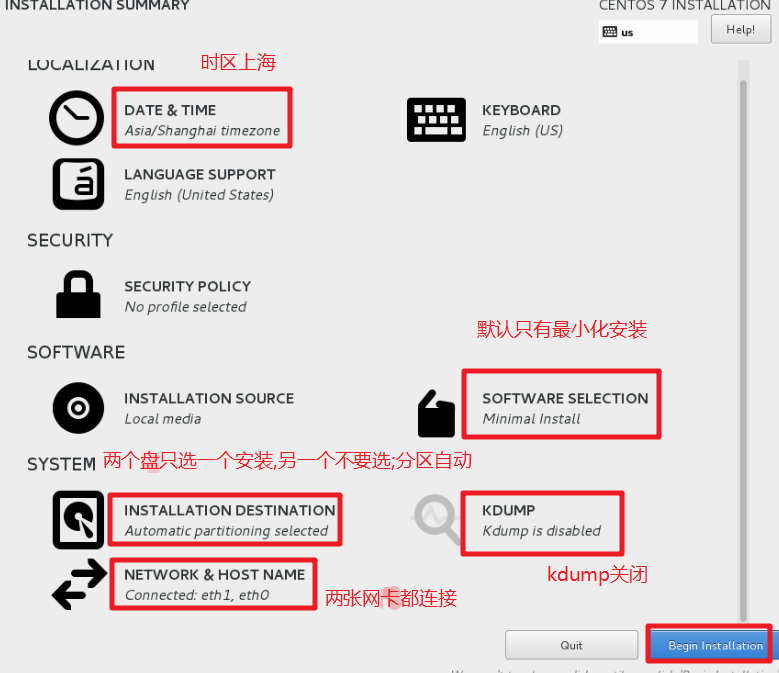

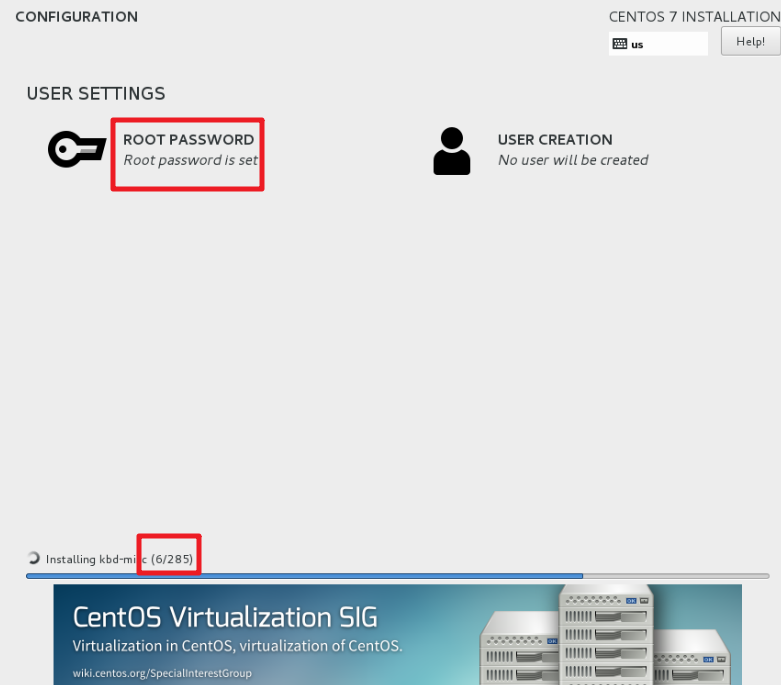

## 系统配置

安装完成后,登录后操作

**eth0 管理网络(给运维管理人员连接使用),可不用连外网**

**eth1 openstack创建VM实例使用的网络,需要上外网(这里建议大家使用NAT网络来模拟)**

1,配置IP

~~~powershell
# cd /etc/sysconfig/network-scripts/
# vi ifcfg-eth0
BOOTPROTO="static"
NAME="eth0"
DEVICE="eth0"
ONBOOT="yes"
IPADDR=192.168.122.20
NETMASK=255.255.255.0

注意: eth1可配可不配(因为后面安装脚本里会指定这个网络,在脚本安装时会自动帮助配置)
# vi ifcfg-eth1										
BOOTPROTO=static
NAME=eth1
DEVICE=eth1
ONBOOT=yes
IPADDR=192.168.100.20
NETMASK=255.255.255.0

# systemctl restart network

注意:NetworkManager这次不要关闭,因为后面脚本安装Neutron时要用到(会调用nmcli命令)
# systemctl status NetworkManager
~~~

2, 主机名

~~~powershell
# hostnamectl set-hostname --static openstack.cluster.com

主机名不配置也没关系,安装脚本里会配置,然后在安装过程会帮我们配置并绑到/etc/hosts
我这里个人习惯先配置了
~~~

3, 准备yum源

先把共享的CentOS7.2-Mini-Newton.tar.gz拷贝到openstack服务器上解压

~~~powershell
[root@openstack ~]# tar xf CentOS7.2-Mini-Newton.tar.gz -C /opt/
[root@openstack ~]# mv /opt/CentOS7.2-Mini-Newton/ /opt/openstack-newton

[root@openstack ~]# cd /etc/yum.repos.d/
[root@openstack yum.repos.d]# mkdir bak
[root@openstack yum.repos.d]# mv *.repo bak/

这里注意,yum文件名要为repo.repo,因为脚本里规定好了
[root@openstack yum.repos.d]# vim /etc/yum.repos.d/repo.repo

[repo]														名字也为repo
name=repo
baseurl=file:///opt/openstack-newton
enabled=1
gpgcheck=0
~~~

## 修改脚本文件

我们现在是做单台openstack,所以需要修改相关hosts文件,还要改相应的IP与其它参数

1,拷贝共享的脚本目录到openstack的/root目录

~~~powershell
[root@openstack ~]# ls /root/newton_install-V1.0.4/
etc  lib  main.sh
~~~

2, 修改脚本里的hosts文件(执行脚本会帮我们覆盖/etc/hosts文件)

~~~powershell
# vim  /root/newton_install-V1.0.4/lib/hosts
127.0.0.1   localhost localhost.localdomain localhost4 localhost4.localdomain4
::1         localhost localhost.localdomain localhost6 localhost6.localdomain6
192.168.122.20  openstack.cluster.com
~~~

3,修改

~~~powershell
# vim  /root/newton_install-V1.0.4/lib/installrc

#controller system information
HOST_NAME=openstack.cluster.com					修改主机名,和hosts文件保持一致
#controller manager IP
MANAGER_IP=192.168.122.20				eth0的IP
ALL_PASSWORD=daniel.com					openstack里有近20个密码,这里统一为daniel.com
#controler secondary net device
NET_DEVICE_NAME=eth1							eth1网卡名称
#install openstack-nova-compute on controller
CONTROLLER_COMPUTER=True

#For neutron information
#[FLOATING_METWORK_ADDR]
NEUTRON_PUBLIC_NET="192.168.100.0/24"
PUBLIC_NET_GW="192.168.100.1"
PUBLIC_NET_START="192.168.100.100"
PUBLIC_NET_END="192.168.100.200"
SECOND_NET="192.168.100.254/24"	 这里都为第2张网卡eth1的网段(配置eth1的IP为192.168.100.254/24)
NEUTRON_DNS="114.114.114.114"			

#[DEMO_NET_ADDR]
NEUTRON_PRIVATE_NET="192.168.200.0/24"	 		
PRIVATE_NET_GW="192.168.200.1"
PRIVATE_NET_DNS="114.114.114.114"	demo用户创建虚拟的网络,可自定义(这里为192.168.200.0/24)

#For cinder
#please input disk or partition by blank to separate
#eg1:CINDER_DISK='/dev/vdb /dev/vdc'
#eg2:CINDER_DISK='/dev/vdb1 /dev/vdc1'
#controller disk for cinder
CINDER_DISK='/dev/vdb'				打开这句注释,并改为/dev/vdb,用于做块存储
#block node disk for cinder
#BLOCK_CINDER_DISK='/dev/sdb'

#for manila
#please input disk or partition by blank to separate
#MANILA_DISK='/dev/sdb'
~~~

## 脚本安装

~~~powershell
必须要cd到里面去执行
# cd /root/newton_install-V1.0.4

[root@openstack newton_install-V1.0.4]# sh main.sh
1) Install Controller Node Service.
2) Install Computer Node Service.
3) Install Block Node Service (Cinder).
0) Quit
please input one number for install :1						选择1安装控制节点
1) Configure System Environment.
2) Install Mariadb and Rabbitmq-server.
3) Install Keystone.
4) Install Glance.
5) Install Nova.
6) Install Cinder.
7) Install Neutron.
8) Install Dashboard.
0) Quit
please input one number for install :1					    从1安装到8

~~~

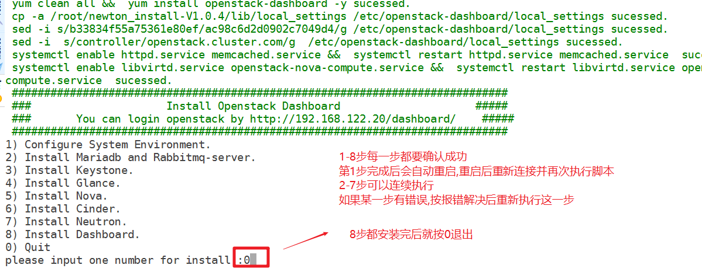

## dashboard访问

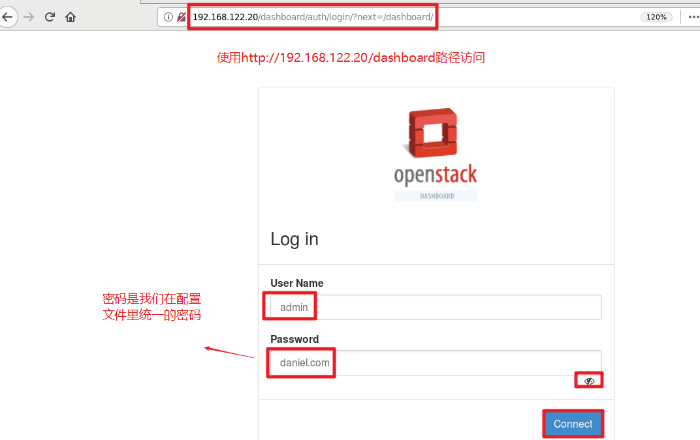

# OpenStack基本应用

## admin与demo用户区别

**admin是管理员,拥有openstack云平台的管理权**

**demo是普通用户,普通用户openstack云平台的使用权**

## admin创建云主机

**使用admin用户登录创建云主机**

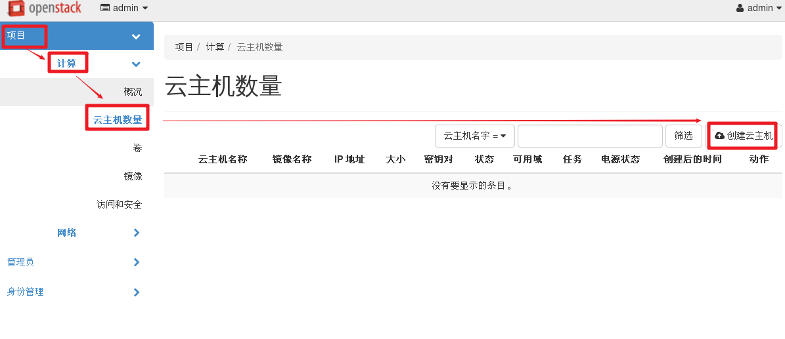

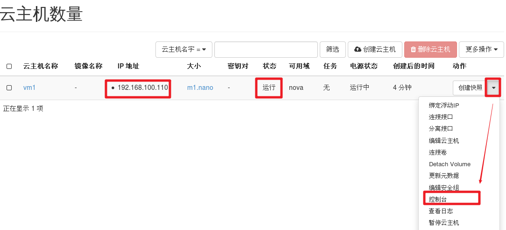

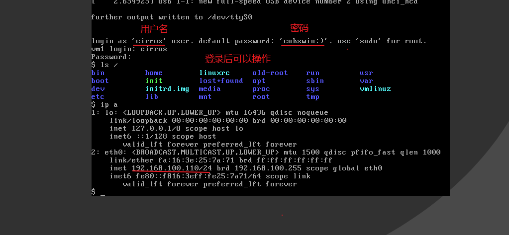

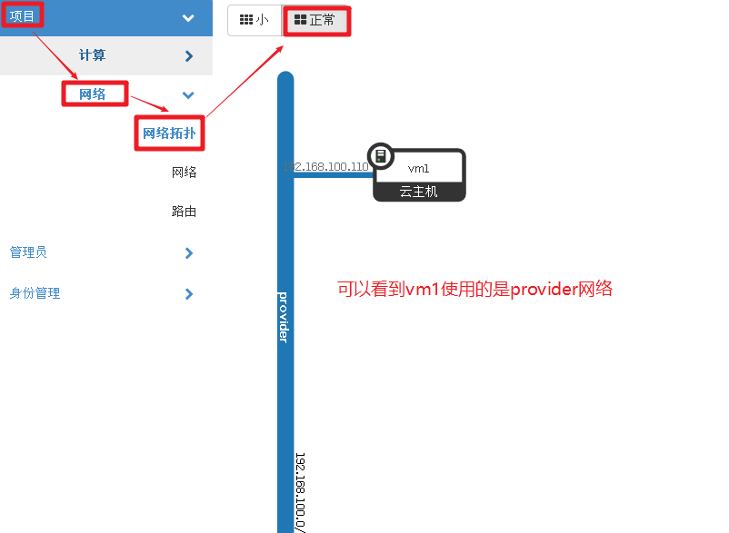

## demo用户创建云主机

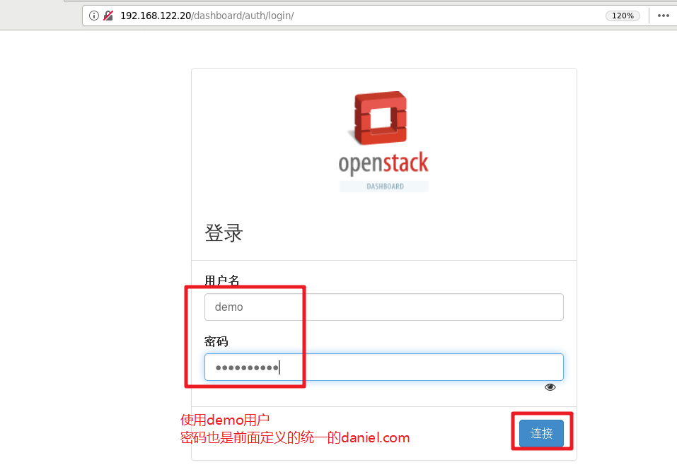

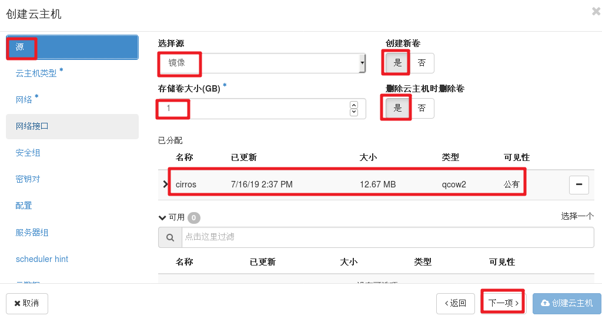

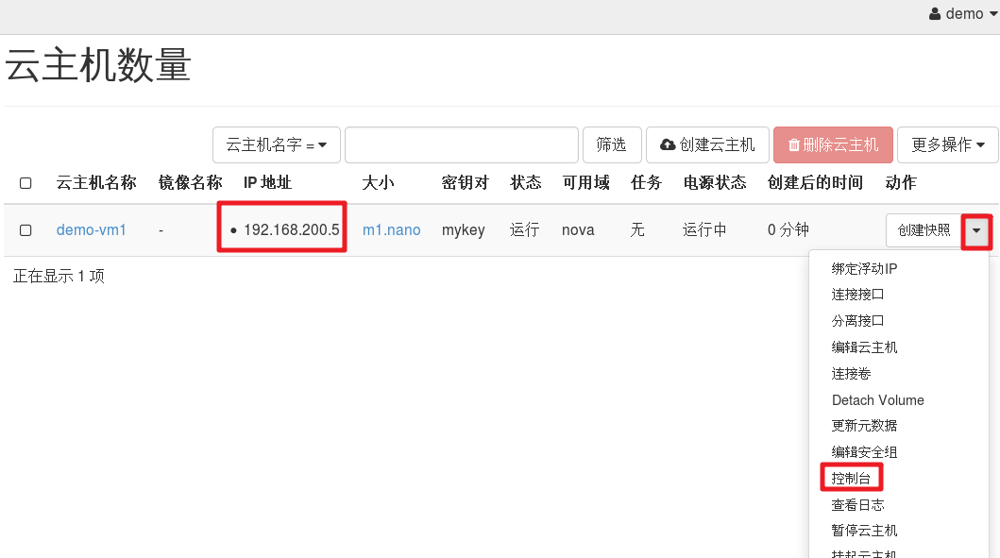

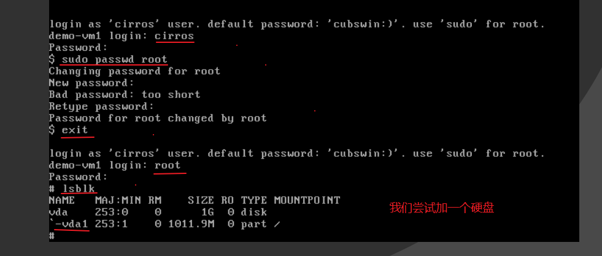

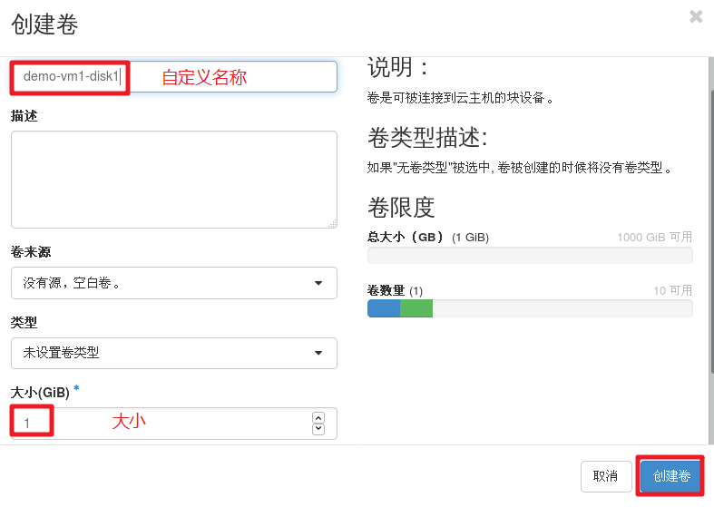

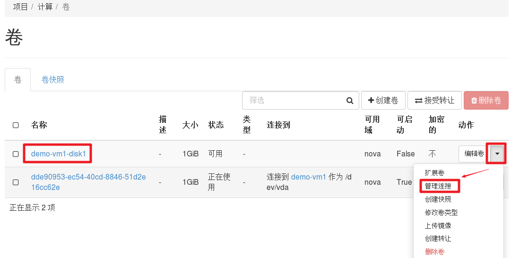

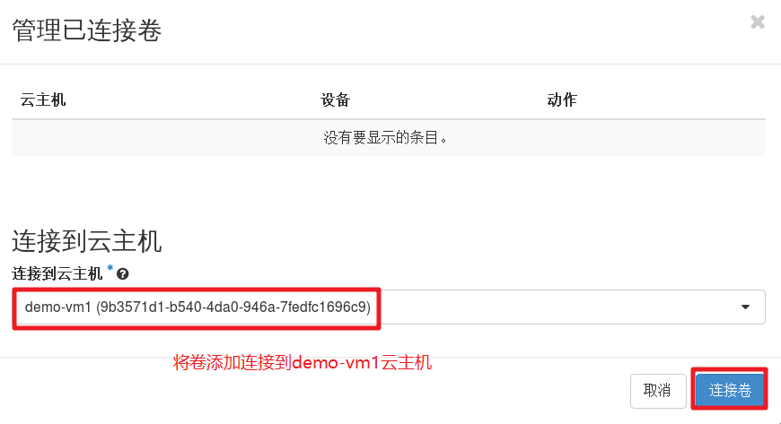

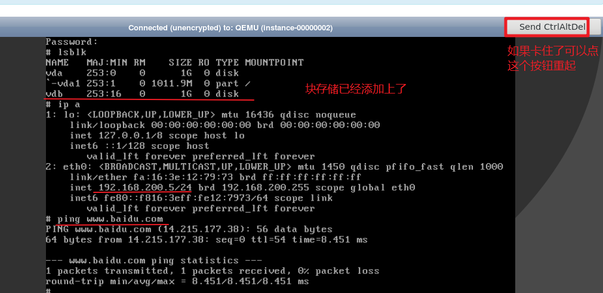

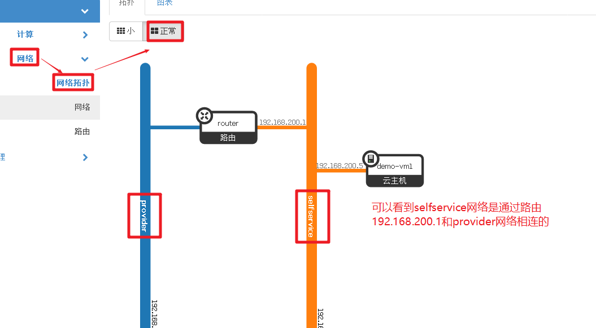

## 增加卷

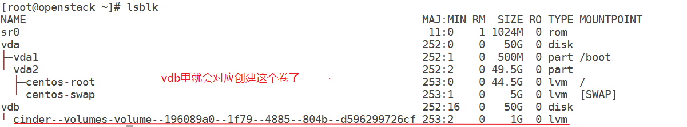

# 排错

脚本安装完后仍然可能无法成功创建虚拟机，请检查以下几个错误

## rabbit-mq权限的问题

给rabbitmq里的openstack用户授予管理权限

~~~powershell
[root@openstack ~]# rabbitmq-plugins enable rabbitmq_management
The following plugins have been enabled:
  mochiweb
  webmachine
  rabbitmq_web_dispatch
  amqp_client
  rabbitmq_management_agent
  rabbitmq_management

Applying plugin configuration to rabbit@openstack... started 6 plugins.
~~~

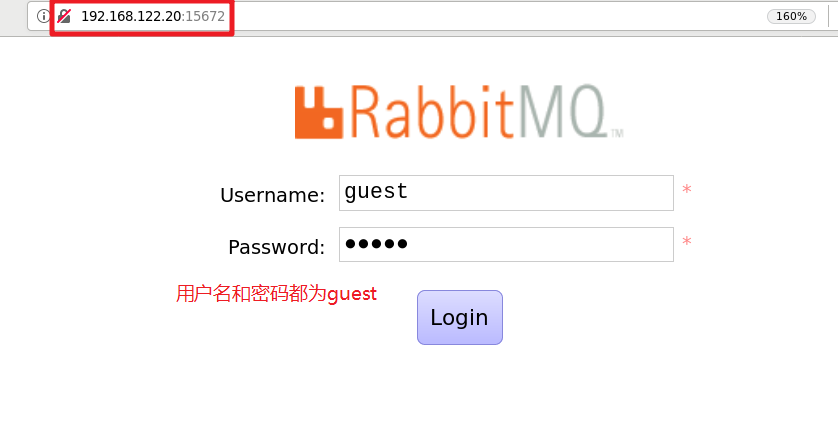

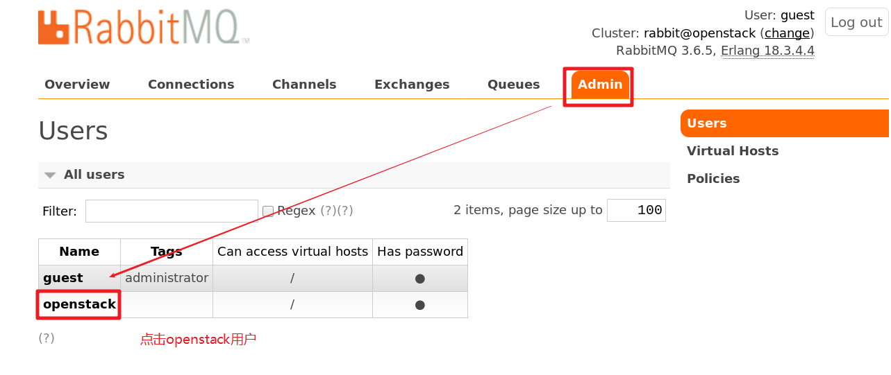

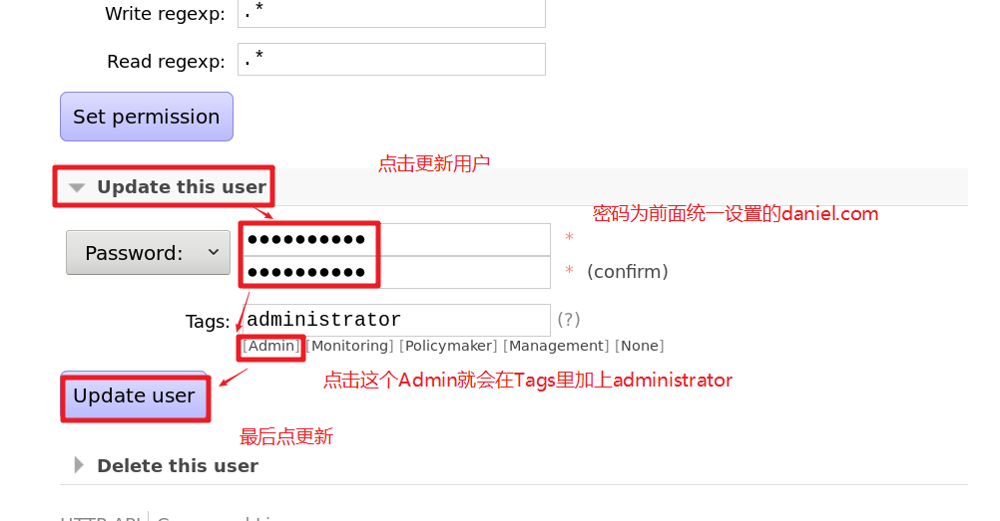

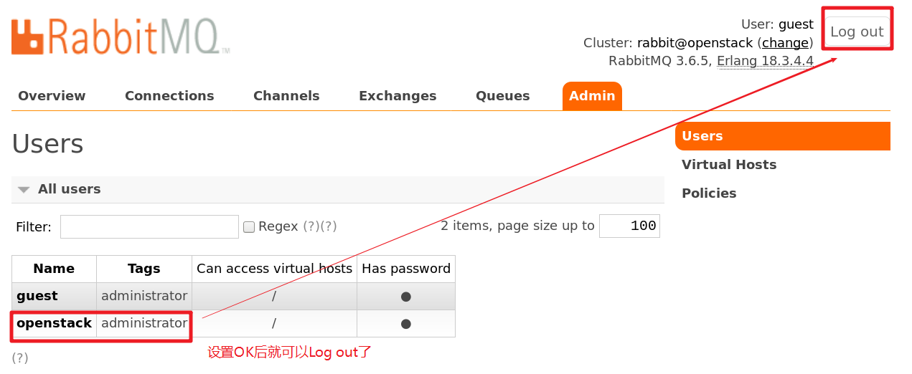

## cinder逻辑卷的问题

~~~powershell
[root@openstack ~]# vim /etc/cinder/cinder.conf

[DEFAULT]						最上面确认这一段
rpc_backend = rabbit
auth_strategy = keystone
my_ip = 192.168.122.20
volume_driver = cinder.volume.drivers.lvm.LVMVolumeDriver
volume_group = cinder-volumes
iscsi_protocol = iscsi
iscsi_helper = lioadm
glance_host = openstack.cluster.com
enabled_backends = lvm
glance_api_servers = http://openstack.cluster.com:9292

[lvm]							配置文件最后确认这一段,如果没有,请加上
volume_driver = cinder.volume.drivers.lvm.LVMVolumeDriver
volume_group = cinder-volumes
iscsi_protocol = iscsi
iscsi_helper = lioadm
~~~

