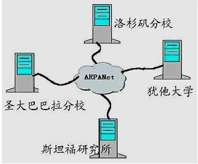
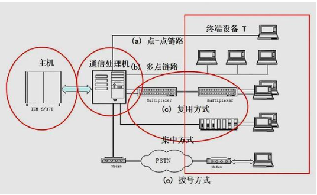
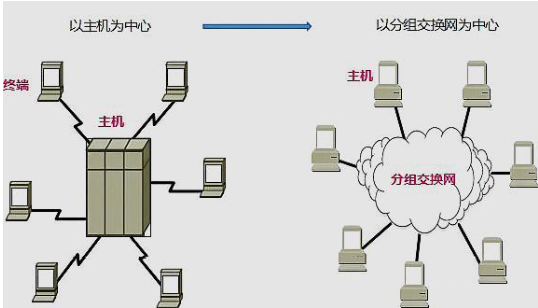
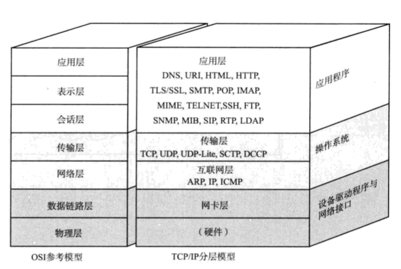
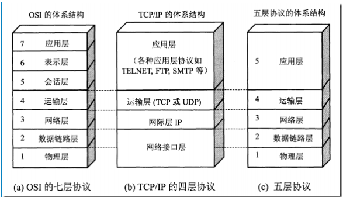

# 1_网络起源

[TOC]

# 任务场景

波仔是SmartGo公司运维人员，由于2019年互联网公司经营整体不景气，公司决定进行人员优化，原公司网络部门被整体优化，公司现有网络技术支持由运维部门承担，运维部门经理指定后期公司内部及对外提供的网络由波仔负责，而波仔以前从没有接触过计算机网络，如果你是波仔，应该如何接手网络部分的工作？

如果我是波仔，对于运维人员我将会从如下技术开始着手：

1. 了解计算机网络的概念
2. 了解计算机网络的作用
3. 了解计算机网络涉及的关键技术点
4. 掌握计算机网络物理层技术
5. 掌握计算机网络数据链路层技术
6. 掌握计算机网络网络层技术
7. 掌握计算机网络传输层协议
8. 掌握计算机网络应用层协议

# 任务清单

## 清单列表

- [x] 计算机网络作用
- [x] 计算机网络起源
- [x] 计算机网络阶段划分

## 一、计算机网络作用

## 目标

通过了解计算机网络的作用进而掌握计算机网络存在的价值，思考如果运维中没有计算机网络的参与是否可以将本地服务提供给远端用户或服务器之间是否可相互调用？

## 计算机网络作用

计算机网络主要是通过网络设备为计算机提供连网功能，用于实现计算机和计算机之间互联，进而为每台计算机之上运行的应用提供连接通路。

## 打卡要求

1. 写出计算机网络作用

## 二、计算机网络起源

我们现在所说的计算机网络从广义上来讲应该是互联网，互联网也就是大家所熟悉的Internet，又称国际网络，它通过一组通用的协议把众多一个一个的网络串连成一个庞大的网络，形成逻辑上的单一巨大国际网络。那么是谁想起来这么做的呢？因此不得不提到一个名词-ARPANET(阿帕)，我们今天所使用的互联网就是始于1969年美国的“阿帕网”。下面我们来了解一下阿帕网的由来。

第二次世界大站结束后，世界两个强国(苏联和美国)开始了长达数年的冷战，冷战期间两国进行了旷日持久的军备竞赛，双方都希望自己在某一领域碾压对方。

1957年苏联发射了人类第一颗人造地球卫星，美国做为对苏联发射人造卫星的响应，由美国国防部(DoD)组建了高级研究计划局(Advanced  Research  Project  Agency，简称“ARPA”)，开始将科学技术应用于军事领域。

20世纪60年代初，古巴核导弹危机发生，美国和当时的苏联之间的冷战状态随之升温，核毁灭的威胁成了人们日常生活的话题。美国国防部认为，如果仅有一个集中的军事指挥中心，万一这个指挥中心被当时的苏联核武器摧毁，全国的军事指挥将处于瘫痪状态，后果不堪设想，因此有必要设计一个分散的指挥系统，它将由一个个分散的指挥点组成，当部分指挥点被摧毁后其它点仍能正常工作，而这些分散的点又能通过某种形式上通讯网取得联系。

1967年拉里.罗伯茨进入美国高级研究计划局，着手筹建美国国防部提出的设想“分布式网络”，人员调度和工程设计很顺利，不到一年，就提出了关于把分散点连接起来的通讯网。

1968年，拉里.罗伯茨提交研究报告《资源共享的计算机网络》，其中着力阐发的就是让“阿帕”的电脑达到互相连接，从而使大家分享彼此的研究成果，这就是阿帕网。

最初的“阿帕网”，由西海岸的4个节点构成。第一个节点选在加州大学洛杉矶分校（UCLA），因为罗伯茨过去的麻省理工学院同事L.克莱因罗克教授，正在该校主持网络研究。第二个节点选在斯坦福研究院（SRI），那里有道格拉斯·恩格巴特（D.Engelbart）等一批网络的先驱人物。此外，加州大学圣巴巴拉分校（UCSB）和犹他大学（UTAH）分别被选为三、四节点。加州大学洛杉矶分校的第一节点与斯坦福研究院的第二节点的连通，实现了分组交换网络的远程通讯，才是互联网正式诞生的标志，当时准确的时间是1969年10月29日22点30分。

## 打卡要求

1. 能够描述计算机网络起源

## 三、计算机网络阶段划分

计算机网络是计算机技术与通信技术相结合的产物。随着计算机技术和通信技术的不断发展,计算机网络也经历了从简单到复杂，从单机到多机的发展过程,其发展过程大致可以细分为以下4个阶段。

### 第一阶段

==面向终端的计算机网络==

20世纪50~60年代,计算机网络进入到面向终端的阶段,以主机为中心，通过计算机实现与远程终端的数据通信。

主要特点是：数据集中式处理，数据处理和通信处理都是通过主机完成，这样数据的传输速率就受到了限制；而且系统的可靠性和性能完全取决于主机的可靠性和性能，但这样却能便于维护和管理，数据的一致性也较好；然而主机的通信开销较大，通信线路利用率低，对主机依赖性大。

### 第二阶段

==多计算机互联的计算机网络==

以通信子网为中心的网络阶段(又称为“计算机-计算机网络阶段”),它是在20世纪60年代中期发展起来的，由若干台计算机相互连接成一个系统，即利用通信线路将多台计算机连接起来,实现了计算机与计算机之间的通信。

主要有两个标志性成果：

- 提出分组交换技术
  - 通常把要发送的整块数据称之为一个报文
  - 在发送报文之前，把一个报文划分为几个分组后在进行传送 
  - 优点
    - 高效 在分组传输的过程中动态分配传输带宽，对通信链路是逐段占用
    - 灵活 为每一个分组独立地选择最合适的转发路由
    - 迅速 以分组作为传送单位，可以不先建立连接就能向其它主机发送分组
    - 可靠 保证可靠性的网络协议；分布式多路由的分组交换网，使网络有很好的生存性
- 形成TCP/IP协议雏形

**分组交换理论与技术主要创始人**

1961和1965年加州大学洛杉矶分校（UCLA）雷纳德·克兰罗克博士（L.Kleinrock）提出了涉及分组交换的理论

1964 年美国兰德公司科学家保罗·巴兰（P. Baran）提出了存储转发概念

1966 年英国学者唐纳德·戴维斯（D. Davies）提出了分组的概念。

**分组交换网络的基本要求：**

网络侧重于计算机之间的数据传送，而不是为了打电话（语言）。网络能够连接不同类型的计算机，不局限于单一类型的计算机。计算机在进行通信时，必须有冗余的路由。网络的结构应当尽可能地简单，同时还能够非常可靠地传送数据。

**面向终端计算机系统与分组交换网的区别：**

早期的面向终端的计算机网络是以单个主机为中心的星形网，各终端通过通信线路共享昂贵的中心主机的硬件和软件资源。

分组交换网则是以网络为中心，主机都处在网络的外围。用户通过分组交换网可共享连接在网络上的许多硬件和各种丰富的软件资源。

**电路交换、报文交换、分组交换对比**

- 电路交换 

  - 这种必须经过“建立连接”（占用资源）--->“通话”（一直占用资源）--->“释放连接”（释放资源）三个步骤的交换方式称之为**电路交换**。

    通话的全部时间内，通话的两个用户始终占用端到端的通信资源。

    电路交换的实时性好，稳定性高，但是由于通话双方独占通信资源，线路的利用率很低。

- 报文交换 

  -  在交换中心，一份完整的报文被全部接受后，在进行转发，这就叫做报文交换

- 分组交换 

在这阶段最引人注目的是ARPAnet的建立，**高等研究计划署网络**（英语：Advanced Research Projects Agency Network，缩写ARPAnet）是美国国防高等研究计划署开发的世界上第一个运营的数据包交换网络，是全球互联网的鼻祖。

以现在的水平论，这个最早的网络显得非常原始，传输速度也慢的让人难以接受。但是，阿帕网的四个节点及其链接，已经具备网络的基本形态和功能。所以阿帕网的诞生通常被认为是网络传播的“创世纪”。

不过，阿帕网问世之际，大部分电脑还互不兼容。于是，如何使硬件和软件都不同的电脑实现真正的互联，就是人们力图解决的难题。这个过程中，温顿·瑟夫为此做出首屈一指的贡献，从而被称为“互联网之父”。

**TCP/IP协议的建立原因：**

由于ARPAnet规模增大，人们需要一种统一的体系结构，1973年12月25日，Vinton Cerf 和 Robert Kahn完成了TCP描述。1978年分离出IP和TCP，后又增加UDP。

**TCP/IP协议的创始人：**

温顿·瑟夫(Vinton G. Cerf)博士1943年出生于康涅狄格州，斯坦福大学数学学士学位、加州大学洛杉矶分校的计算机科学硕士和博士学位。谷歌全球副总裁。

罗伯特卡恩（Robert Elliot Kahn）, 美国国家工程协会(National Academy of Engineering)成员，美国IEEE fellow，美国人工智能协会(American Association for Artificial Intelligence)fellow，美国计算机协会(ACM) fellow，前美国总统科技顾问。他于1986年创立美国全国研究创新联合(CNRICorporationforNationalResearchInitiatives)并任主席，同时也执行IETF的秘书处职能。

这阶段虽然有两大标志性成果，并建立了计算机与计算机的互连与通信，实现了计算机资源的共享。但缺点是没有形成统一的互连标准，使网络在规模与应用等方面受到了限制。最引人注目的是诞生了ARPANet。

**TCP/IP协议栈**

第一层：网络接口层

第二层：互联网层

第三层：传输层

第四层：应用层

### 第三阶段

==面向标准化的计算机网络==

20世纪70年代末至20世纪80年代初，微型计算机得到了广泛的应用，各机关和企事业单位为了适应办公自动化的需要,迫切要求将自己拥有的为数众多的微型计算机、工作站、小型计算机等连接起来，以达到资源共享和相互传递信息的目的，而且迫切要求降低联网费用，提高数据传输效率。但是,这一时期计算机之间的组网是有条件的，在同网络中只能存在同一厂家生产的计算机,其他厂家生产的计算机无法接入。在此期间，各大公司都推出了自己的网络体系结构。

**提出网络系统结构标准化具有重大的意义：**

开放系统异种独立工作的计算机系统入网互联网络资源/用户资源共享层次结构和通信协议接口标准化**这一阶段的标志性成果有：**制定网络体系结构：OSI-RM模型形成TCP/IP系统结构形成以太网、公用数据网等标准，如X.25标准等X系列建议提出Web技术与开发浏览器

1984年公布了 ISO7498，即ISO/OSI-RM国际标准，该模型按层次结构划分为七个子层，已被国际社会普遍接受，是目前计算机网络系统结构的基础。

**ISO/OSI参考模型**

第一层：物理层                  第一层 网络接口层

第二层：数据链路层          第二层  互联网层

第三层：网络层

第四层：传输层

第五层：会话层

第六层：表示层

第七层：应用层

**ISO/OSI参考模型与TCP/IP协议栈对比**

### 第四阶段

==面向全球互连的计算机网络==

20世纪90年代以后,随着数字通信的出现,计算机网络进入到第4个发展阶段,其主要特征是综合化、高速化、智能化和全球化。1993年美国政府发布了名为“国家信息基础设施行动计划” 的文件，其核心是构建国家信息高速公路。

这一时期在计算机通信与网络技术方面以 高速率、高服务质量、高可靠性等为指标， 出现了高速以太网、VPN、无线网络、P2P网络、NGN等技术，计算机网络的发展与应用渗入了人们生活的各个方面，进入一个多层次的发展阶段。

各个国家都建立了自己的高速因特网，这些因特网的互连构成了全球互连的因特网，并且渗透到社会的各个层次。那么下一个计算机网络的发展阶段是什么时间开始呢？是以移动互联网或物联网为标志？这有待我们去探索研究与发现。

## 打卡要求

1. 写出计算机网络阶段划分四个阶段名称及时间范围

# 任务总结

1. 计算机网络作用

   

2. 计算机网络起源

   

3. 计算机网络阶段划分

# 任务打卡

1. 通过Xmind文档实现上述课程内容总结，并发送至327092504@qq.com邮箱

   - 邮件标题：姓名-课程名称总结

   - 邮件正文：可表达总结心得

   - 邮件附件：将课程内容总结以附件形式发送

     

# 任务订阅

1. 观看《互联网时代》10集记录片，提交观后感邮箱：327092504@qq.com
   - 邮件标题：姓名-第几集观后感
   - 邮件正文：可表达观后感
   - 邮件附件：可无附件

