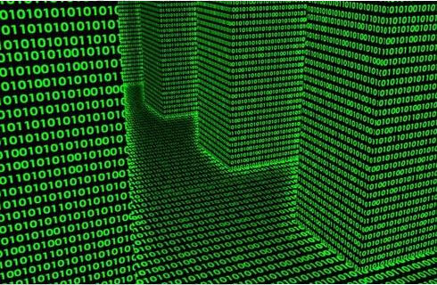
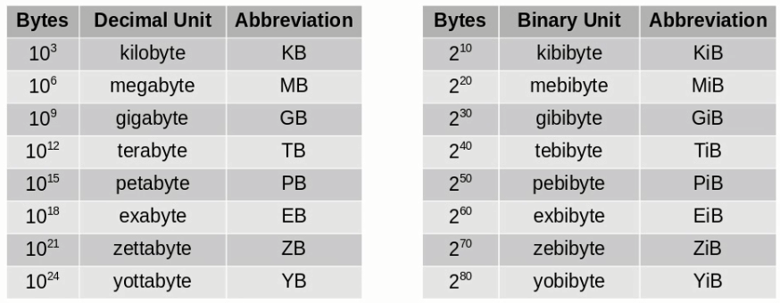

# 2_进制转换

[TOC]

# 任务场景

波仔在学习计算机网络过程中发现，需要了解计算机及计算机网络中传输、存储、运算基本计量单位并认识到原来计算机仅认识二进制，而且在实际应用中计算机系统及计算机网络中涉及的进制并不唯一，例如二进制，八进制，十进制，十六进制等，那么这些进制将应用在什么位置及进制间应该如何转换呢？

# 任务清单

## 清单列表

- [x] 计算机及计算机网络中传输、存储、运算基本计量单位
- [x] 什么是进制？
- [x] 计算机网络中常用进制有哪些？
- [x] 十进制转换为二进制
- [x] 二进制转换为十进制
- [x] 十进制转换为八进制
- [x] 八进制转换为十进制
- [x] 十进制转换为十六进制
- [x] 十六进制转换为十进制

## 一、计算机及计算机网络中传输、存储、运算基本计量单位

### 1.1 基本计量单位

#### 1.1.1 位

最小的存储单位称为位（[bit](https://www.baidu.com/s?wd=bit&tn=SE_PcZhidaonwhc_ngpagmjz&rsv_dl=gh_pc_zhidao)），也称为比特，在计算机网络中可使用b来表示。只能容纳两个值（0或1）之一，不能在一个位中存储更多的信息。位是计算机存储的基本单位。

例如教室的一个座位只能坐下一个人，且这个人性别可能是男也可能是女，但是不能同时坐在同一个座位上。

#### 1.1.2 字节

字节(byte)是常用的计算机存储单位，可以使用B来表示。

字节的标准定义：一个字节均为8位。

计算机中以字节为单位存储和解释信息，规定一个字节由八个二进制位构成，即1个字节等于8个比特（1Byte=8[bit](https://www.baidu.com/s?wd=bit&tn=SE_PcZhidaonwhc_ngpagmjz&rsv_dl=gh_pc_zhidao)）

由于上述所讲每个位或者是0或者是1，所以一个8位的字节包含256种可能的0，1组合。

#### 1.1.3 字

计算机进行数据处理时，一次存取、加工和传送的数据长度称为字（word）。一个字通常由一个或多个（一般是字节的整数位）字节构成。

例如286微机的字由2个字节组成，它的字长为16；486微机的字由4个字节组成，它的字长为32位机。

计算机的字长决定了其[CPU](https://www.baidu.com/s?wd=CPU&tn=SE_PcZhidaonwhc_ngpagmjz&rsv_dl=gh_pc_zhidao)一次操作处理实际位数的多少，由此可见计算机的字长越大，其性能越优越。

#### 1.1.4 字长

计算机的每个字所包含的位数称为字长。根据计算机的不同，字长有固定的和可变的两种。固定字长，即字长度不论什么情况都是固定不变的；可变字长，则在一定范围内，其长度是可变的。

计算的字长是指它一次可处理的二进创数字的数目。计算机处理数据的速率，自然和它一次能加工的位数以及进行运算的快慢有关。

如果一台计算机的字长是另一台计算机的两倍，即使两台计算机的速度相同，在相同的时间内，前者能做的工作是后者的两倍，因此，字长是衡量计算机性能的一个重要因素。

### 1.2 计量标准

在计算机及计算机网络中计量标准是获取计算机及计算机网络性能的参考依据，了解计量标准有助于理解其它专业术语。

#### 1.2.0 Linux操作系统中两套计量标准

- SI标准  国际单位制

旧称“万国公制”，是现时世界上最普遍采用的标准度量衡单位系统，采用十进制进位系统。是18世纪末科学家的努力，最早于法国大革命时期的1799年被法国作为度量衡单位。国际单位制是在公制基础上发展起来的单位制，于1960年第十一届国际计量大会通过，推荐各国采用，其国际简称为SI。

- IEC标准 国际电工委员会标准

国际电工委员会（International Electro technical Commission，简称IEC）成立于1906年，是世界上成立最早的非政府性国际电工标准化机构，是联合国经社理事会(ECOSOC)的甲级咨询组织。

#### 1.2.1 K

表示千,根据以上标准的不同，K可以表示为10^3^或2^10^

例如KB

#### 1.2.2 M

表示百万,就是兆,根据以上标准的不同，M可以表示为10^6^或2^20^

例如MB或Mb

#### 1.2.3 G

表示10亿,根据以上标准的不同，G可以表示为10^9^或2^30^

例如GB

#### 1.2.4 T

表示10,000亿,根据以上标准的不同，T可以表示为10^12^或2^40^

例如TB

#### 1.2.5 P

表示10,000,000亿,根据以上标准的不同，P可以表示为10^15^或2^50^

例如PB

#### 1.2.6 E

表示10,000,000,000亿,根据以上标准的不同，E可以表示为10^18^或2^60^

例如EB

#### 1.2.7 举例说明

硬盘500GB 是指硬盘的存储空间为500*(2^30次方)字节。*

内存8GB 指内存的容量为8*(2^30次方)字节。

带宽100Mb 指网络中数据传输速率，带宽的单位为Mbps，每秒多少兆比特，所以带宽100M指的是网络传输速率为每秒100Mbit，而不是我们通常认为的每秒100MB。电信领域通常将比特bit称为b，字节Byte称为B。

算力PH/s  指比特币（区块链）网络中的挖矿算力，H/s是指每秒进行哈希碰撞的次数，PH/s指每次进行哈希碰撞的次数已达到2的50次方。实际上目前比特币的全网算力已达到EH/s量级，即每秒2的60次方，数据来源于BTC.com矿池。

## 打卡要求

1. 写出计量标准作用
2. 写出两套计量标准所对应的标准

## 二、什么是进制？

进制也就是进位计数制，是人为定义的带进位的计数方法（有不带进位的计数方法，比如原始的结绳计数法，唱票时常用的“正”字计数法）。 对于任何一种进制---X进制，就表示每一位置上的数运算时都是逢X进一位。

## 打卡要求

1. 写出进制的作用
2. 请发明一种进制用于统计班级学生数量，提示:1打

## 三、计算机网络中常用进制有哪些？

### 3.1 十进制

逢十进一

基符：0，1，2，3，4，5，6，7，8，9

比较普遍的一种进制，在工作、学习、生活中随处可见。

### 3.2 二进制

逢二进一

基符：0，1

多用于计算机中

### 3.3 八进制

逢八进一

基符：0，1，2，3，4，5，6，7

例如每周循环或Linux系统中权限表示

### 3.4 十六进制

逢十六进一

基符：0，1，2，3，4，5，6，7，8，9，A,B,C,D,E,F

多用于存储大数据中，例如IPV6地址，MAC地址

## 打卡要求

1. 写出每种进制的基符

## 四、十进制转换为二进制

|      | 2^7^ | 2^6^ | 2^5^ | 2^4^ | 2^3^ | 2^2^ | 2^1^ | 2^0^ |      |
| ---- | ---- | ---- | ---- | ---- | ---- | ---- | ---- | ---- | ---- |
|      | 128  | 64   | 32   | 16   | 8    | 4    | 2    | 1    | 255  |
| 5    |      |      |      |      |      | 1    | 0    | 1    |      |
| 120  |      | 1    | 1    | 1    | 1    | 0    | 0    | 0    |      |

## 打卡要求

1. 123转换为二进制

   01111011

2. 251转换为二进制

   11111011

## 五、二进制转换为十进制

|               | 2^7^ | 2^6^ | 2^5^ | 2^4^ | 2^3^ | 2^2^ | 2^1^ | 2^0^ |      |
| ------------- | ---- | ---- | ---- | ---- | ---- | ---- | ---- | ---- | ---- |
|               | 128  | 64   | 32   | 16   | 8    | 4    | 2    | 1    | 255  |
| (1100)~2~     |      |      |      |      | 1    | 1    | 0    | 0    | 12   |
| (10110011)~2~ | 1    | 0    | 1    | 1    | 0    | 0    | 1    | 1    | 179  |

## 打卡要求

1. (110011)~2~转换为十进制    51
2. (00110011)~2~转换为十进制  51

## 六、十进制转换为八进制

~~~po
十进制转换为八进制可以考虑先把十进制转换为二进制

3位二进制可以表示一位八进制
~~~

|      | 2^7^ | 2^6^ | 2^5^ | 2^4^ | 2^3^ | 2^2^ | 2^1^ | 2^0^ |                           |
| ---- | ---- | ---- | ---- | ---- | ---- | ---- | ---- | ---- | ------------------------- |
|      | 128  | 64   | 32   | 16   | 8    | 4    | 2    | 1    | 255                       |
| 120  |      | 1    | 1    | 1    | 1    | 0    | 0    | 0    | 转为二进制                |
|      |      |      |      |      |      | 0    | 0    | 0    | 转为八进制，为0           |
|      |      |      |      |      |      | 1    | 1    | 1    | 转为八进制，为7           |
|      |      |      |      |      |      | 0    | 0    | 1    | 转为八进制，为1           |
|      |      |      |      |      |      |      |      |      | 转为八进制，最终结果为170 |
| 245  | 1    | 1    | 1    | 1    | 0    | 1    | 0    | 1    |                           |
|      |      |      |      |      |      | 1    | 0    | 1    | 5                         |
|      |      |      |      |      |      | 1    | 1    | 0    | 6                         |
|      |      |      |      |      |      | 0    | 1    | 1    | 3                         |
| 113  | 0    | 1    | 1    | 1    | 0    | 0    | 0    | 1    |                           |

## 打卡要求

1. 245转换为八进制
2. 113转换为八进制

## 七、八进制转换为十进制

|         | 2^7^ | 2^6^ | 2^5^ | 2^4^ | 2^3^ | 2^2^ | 2^1^ | 2^0^ |                |
| ------- | ---- | ---- | ---- | ---- | ---- | ---- | ---- | ---- | -------------- |
|         | 128  | 64   | 32   | 16   | 8    | 4    | 2    | 1    | 255            |
| (56)~8~ |      |      |      |      |      | 1    | 1    | 0    | 转6为二进制    |
|         |      |      |      |      |      | 1    | 0    | 1    | 转5为二进制    |
|         |      |      | 1    | 0    | 1    | 1    | 1    | 0    | 完整的二进制   |
|         |      |      |      |      |      |      |      |      | 转换为十进制46 |

## 打卡要求

1. (75)~8~转换为十进制    111101   61
2. (50)~8~转换为十进制    101000   40

## 八、十进制转换为十六进制

~~~shell
可以考虑先转为二进制

4位二进制表示一位十六进制
~~~

|      | 2^7^ | 2^6^ | 2^5^ | 2^4^ | 2^3^ | 2^2^ | 2^1^ | 2^0^ |                            |
| ---- | ---- | ---- | ---- | ---- | ---- | ---- | ---- | ---- | -------------------------- |
|      | 128  | 64   | 32   | 16   | 8    | 4    | 2    | 1    | 255                        |
| 120  |      | 1    | 1    | 1    | 1    | 0    | 0    | 0    | 转为二进制                 |
|      |      |      |      |      | 1    | 0    | 0    | 0    | 转为十六进制，为8          |
|      |      |      |      |      | 0    | 1    | 1    | 1    | 转为十六进制，为7          |
|      |      |      |      |      |      |      |      |      | 转为十六进制，最终结果为78 |

## 打卡要求

1. 102转换为十六进制    01100110   (66)~16~
2. 223转换为十六进制    11011111 (DF)~16~

## 九、十六进制转换为十进制

|          | 2^7^ | 2^6^ | 2^5^ | 2^4^ | 2^3^ | 2^2^ | 2^1^ | 2^0^ |                           |
| -------- | ---- | ---- | ---- | ---- | ---- | ---- | ---- | ---- | ------------------------- |
|          | 128  | 64   | 32   | 16   | 8    | 4    | 2    | 1    | 255                       |
| (A0)~16~ |      |      |      |      | 1    | 0    | 1    | 0    | 转为A二进制               |
|          |      |      |      |      | 0    | 0    | 0    | 0    | 转为0二进制               |
|          | 1    | 0    | 1    | 0    | 0    | 0    | 0    | 0    | 转为二进制                |
|          |      |      |      |      |      |      |      |      | 转为十进制，最终结果为160 |

## 打卡要求

1. (A0)~16~转换为十进制
2. (EF)~16~转换为十进制   11101111  239

# 任务总结

1. 计算机及计算机网络中传输、存储、运算基本单位

   - 位 bit   b
   - 字节 byte B
   - 字
   - 字长
   - K
   - M
   - G
   - T
   - P
   - E
   - Z
   - Y

2. 什么是进制？

   进位计数

3. 计算机网络中常用进制有哪些？

   二进制、八进制、十进制、十六进制

4. 十进制转换为二进制

5. 二进制转换为十进制

6. 十进制转换为八进制

7. 八进制转换为十进制

8. 十进制转换为十六进制

9. 十六进制转换为十进制

# 任务打卡

1. 实现进制之间转换
   - 十进制转二进制  97、101、220、246、380、450、533、809、911、1020
   - 二进制转十进制  (1011)~2~、(11001100)~2~、(111000111)~2~、(11001111)~2~
   - 十进制转八进制 5、11、37、25、101、187、209、35356
   - 八进制转十进制 23、7、16、57、77、67、31、56
   - 十进制转十六进制 5、10、64、118、256、350
   - 十六进制转十进制 15、86、A0、bc、AE、1C、00、9F

# 任务订阅

1. 观看《互联网时代》10集记录片，提交观后感邮箱：327092504@qq.com
   - 邮件标题：姓名-第几集观后感
   - 邮件正文：可表达观后感
   - 邮件附件：可无附件

