# 3_OSI参考模型物理层

[TOC]

# 任务场景

波仔现在是一边工作一边学习计算机网络相关技术，这天波仔正在做进制之间的转换，突然接到运维经理一条工单系统派单信息：“波仔，公司项目组现在需要上线2台服务器用于做项目开发测试，你去配合一下服务器上线，主要工作内容是为服务器准备2条网线，用于服务器连接交换机使用。”，波仔接到任务后一脸懵，心想我这还在学习中呢，还没有学到如何制作网线呢，现在如何是好？如果你是波仔，请问你会如何执行运维经理的工单指派的任务呢？

波仔可以从以下几个方面入手来完成运维经理指派的任务：

1. 了解物理层功能及特性
2. 了解物理层标准
3. 了解物理层设备及传输介质
4. 能够选择物理层传输介质并完成制作

# 任务清单

## 清单列表

- [ ] 物理层功能及特性
- [ ] 物理层标准
- [ ] 物理层设备及传输介质
- [ ] 双绞线制作

## 一、物理层功能及特性

### 物理层功能

- OSI 物理层通过网络介质传输构成数据链路层帧的比特

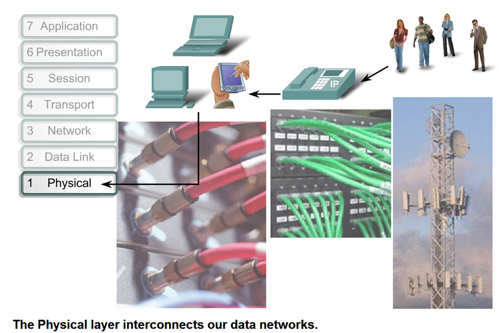

~~~shell
总结：
用于传输比特流
~~~

- 用于创建电信号、光信号或微波信号，以表示每个帧中的比特。

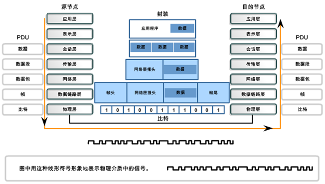

### 物理层特性

物理层的主要任务描述为确定与传输媒体的接口的一些特性

| 特性     | 描述                                                         |
| -------- | ------------------------------------------------------------ |
| 机械特性 | 指明接口所用接线器的形状和尺寸、引线数目和排列、固定和锁定装置等等 |
| 电气特性 | 指明在接口电缆的各条线上出现的电压的范围                     |
| 功能特性 | 指明某条线上出现的某一电平的电压表示何种意义                 |
| 过程特性 | 指明对于不同功能的各种可能事件的出现顺序                     |

## 打卡要求

1. 写出物理层功能
2. 绘制物理层在数据传输过程中的作用图例

## 二、物理层标准

### 比较物理层与上层的标准

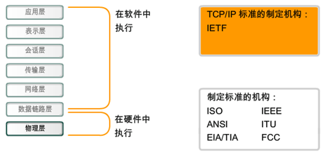

### 物理层标准规定了信号、连接器、电缆要求

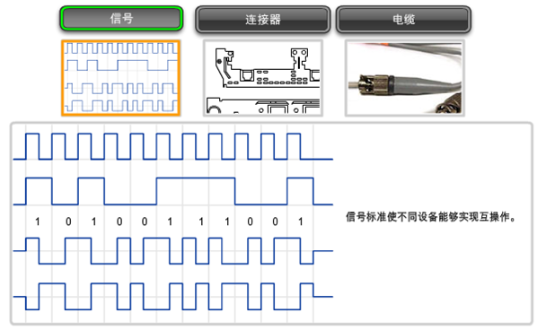

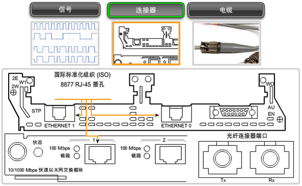

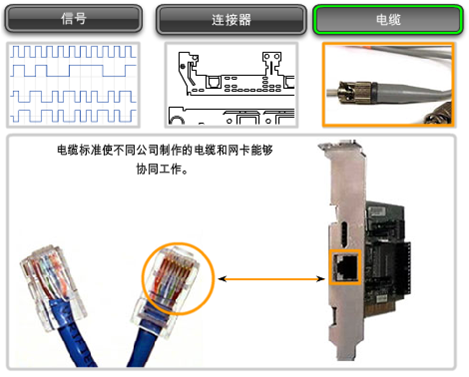

~~~shell
总结：
规定信号，数字信号
规定连接器，机械特性，电气特性，功能特性，规程特性
规定网络传输介质 
~~~

### 数据帧在物理层转化过程

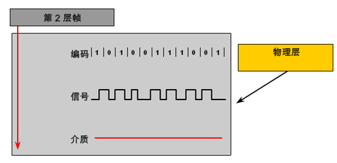

~~~shell
总结：
第一步：把数据链路层输入的帧转为编码，二进制编码
第二步：把编码转为信号（电信号、光信号、微波信号）
第三步：通过网络介质传输到远端节点
~~~

### 信号在信道中传输时方式

- 单向通信（单工通信）——只能有一个方向的通信而没有反方向的交互。

- 双向交替通信（半双工通信）——通信的双方都可以发送信息，但不能双方同时发送(当然也就不能同时接收)。

- 双向同时通信（全双工通信）——通信的双方可以同时发送和接收信息。 

~~~shell
总结：
单工：单向通信  收音机
半双工：在一个信道上，同一时间只能往一方通信   对讲机
全双工：在二个信道上，同一时间可以相互通信     打电话
~~~

## 打卡要求

1. 写出物理层对哪些内容制定了标准   信号、连接器、网络介质
2. 写出数据帧在物理层转化过程  编码-信号-通过介质传输
3. 写出信号在信道中传输时方式  单工、半双工、全双工

## 三、物理层设备及传输介质

### 物理层设备

- 中继器

由于信号在传输过程有衰减，中继器主要用于放大数字信号

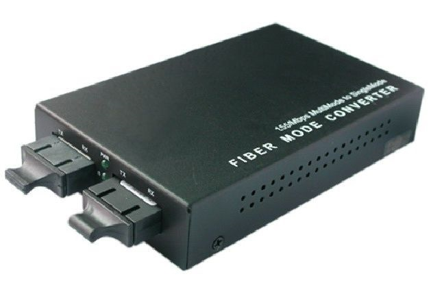

- 集线器 Hub

实质上属于多接口中继器

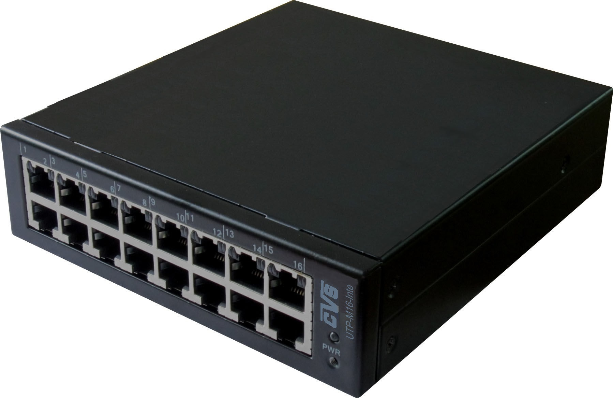

> 以上设备在实际工作中使用越来越少

- 网卡

**网络接口控制器**  (network interface controller，NIC),又名网络适配器或局域网接收器

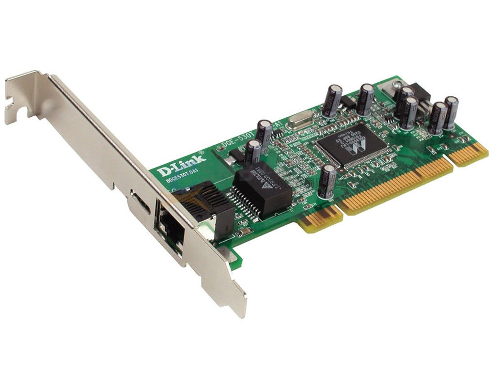

是一块被设计用来允许计算机在计算机网络上进行通讯的计算机硬件。由于其拥有MAC地址，因此属于OSI模型的第1层。它使得用户可以通过电缆或无线相互连接。每一个网卡都有一个被称为MAC地址的独一无二的48位串行号，它被写在卡上的一块ROM中。在网络上的每一个计算机都必须拥有一个独一无二的MAC地址。没有任何两块被生产出来的网卡拥有同样的地址。这是因为电气电子工程师协会（IEEE）负责为网络接口控制器销售商分配唯一的MAC地址。

网卡以前是作为扩展卡插到计算机总线上的，但是由于其价格低廉而且以太网标准普遍存在，大部分新的计算机都在主板上集成了网络接口。这些主板或是在主板芯片中集成了以太网的功能，或是使用一块通过PCI (或者更新的PCI-Express总线)连接到主板上的廉价网卡。除非需要多接口或者使用其它种类的网络，否则不再需要一块独立的网卡。甚至更新的主板可能含有内置的双网络（以太网）接口。

~~~shell
总结：
中继器
集线器 hub
网卡
MAC  电子电气工程师协会 IEEE 发放前24位，后24位厂商给自己的网卡的编号
~~~

### 物理层传输介质

- 双绞线

  双绞线由8根不同颜色的线分成4对绞合在一起，成对扭绞的作用是为了尽可能减少电磁辐射与外部电磁干扰的影响。

  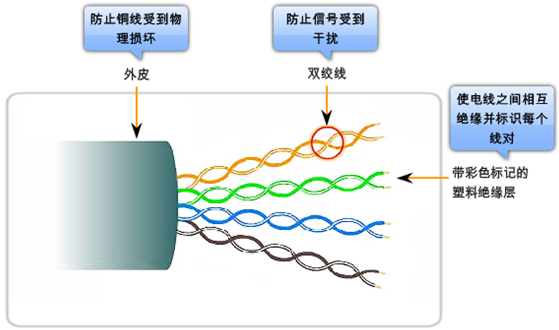

  

  - 屏蔽双绞线 STP (Shielded Twisted Pair)

  

  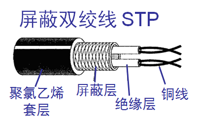

  

  - 无屏蔽双绞线 UTP (Unshielded Twisted Pair) 

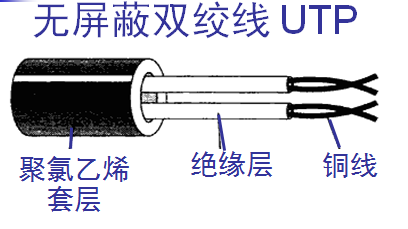

双绞线连接网络设备方法

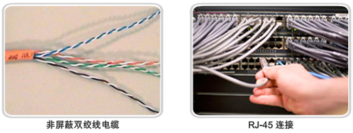

双绞线连接安全性

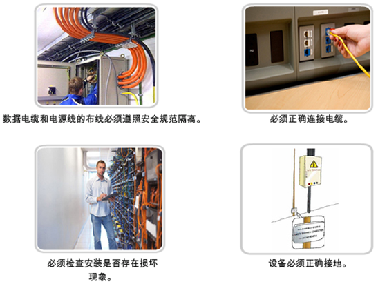

双绞线连接器

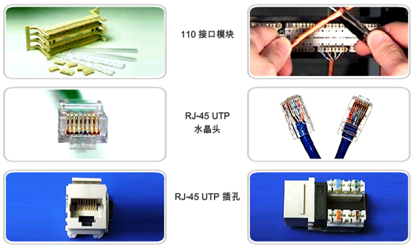

双绞线正确的连接器

- 光纤

  - 工作原理

  

  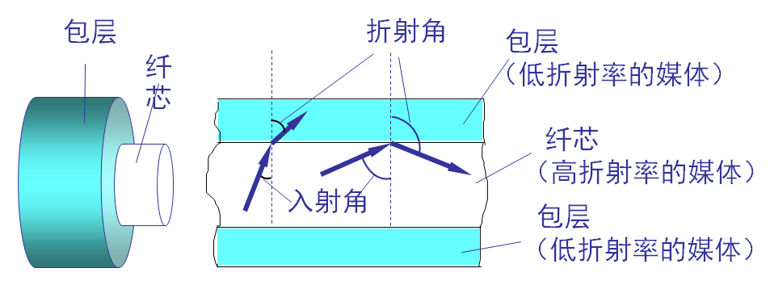

  

  

  

  - 单模光纤

  

  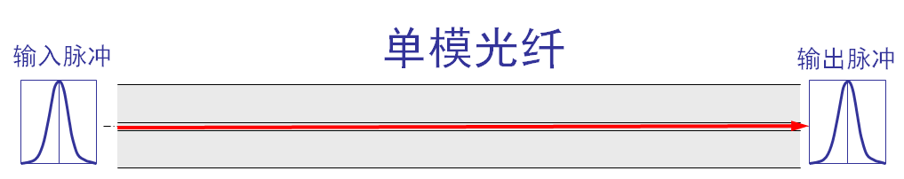

  

  

  - 多模光纤

  

  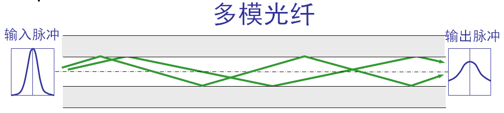

  

  

  - 光纤连接器

  

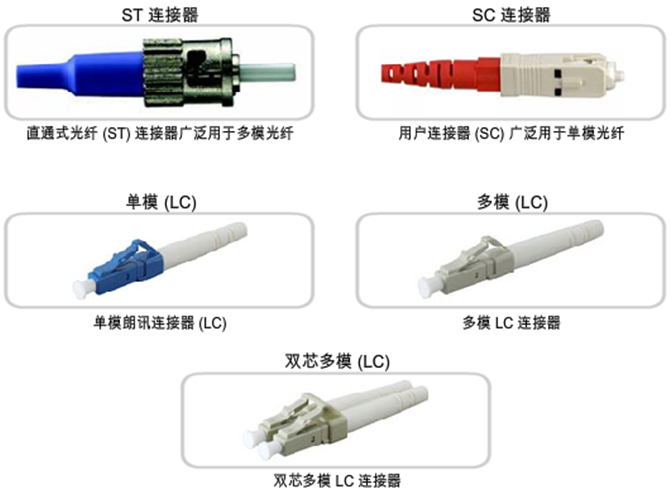

- 无线
  - 短波
  - 微波

## 打卡要求

1. 写出双绞线的类型 STP UTP 
2. 写出光纤的类型   单模  多模

## 四、双绞线制作

- 双绞线制作依据

  - EIA/TIA－568标准

    - 568A

      白绿，绿，白橙，蓝，白蓝，橙，白棕，棕

      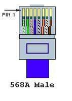

    - 568B

      白橙，橙，白绿，蓝，白蓝，绿，白棕，棕

      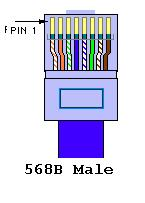

    

  

  - 直通线

    双绞线两端全部为568标准中同一标准

    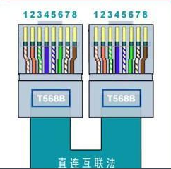

  

  - 交叉线

    双绞线两端为568标准中不同标准

    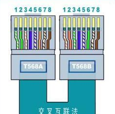

    

  - RJ-45水晶头

    RJ45水晶头由金属片和塑料构成，制作网线所需要的RJ一45水晶接头前端有8个凹槽， 凹槽内的金属触点共有 8个。

    

    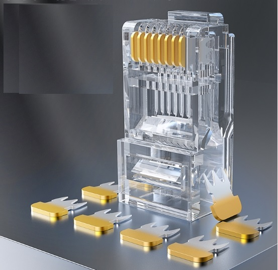

    

    > 特别需要注意的是RJ45水晶头引脚序号，当金属片面对我们的时候从左至右引脚序号是1～8

- 双绞线制作方法
  - 准备RJ-45水晶头
  - 准备双绞线
  - 准备线钳
  - 制作直通线或交叉线

# 任务总结

1. 物理层功能及特性
2. 物理层标准
3. 物理层设备及传输介质
4. 双绞线制作

# 任务打卡

1. 通过Xmind文档实现上述课程内容总结，并发送至327092504@qq.com邮箱

   - 邮件标题：姓名-课程名称总结

   - 邮件正文：可表达总结心得

   - 邮件附件：将课程内容总结以附件形式发送

     

# 任务订阅

1. 观看《互联网时代》10集记录片，提交观后感邮箱：327092504@qq.com
   - 邮件标题：姓名-第几集观后感
   - 邮件正文：可表达观后感
   - 邮件附件：可无附件

