# 4_OSI参考模型数据链路层

[TOC]

# 任务场景

波仔帮助开发人员制作网线后，将服务器与交换机进行了连接，服务器就被开发人员访问到了，波仔回到工位后，他在思考一个新问题“服务器连接上网线就可以被访问啦，那么交换机是如何工作呢？”，如果你是波仔，你将如何去了解交换机的工作原理并在工作中正确使用交换呢？

如果我是波仔，我将从如下着手进行学习：

1. 了解数据链路层功能

2. 了解数据链路层设备及其工作原理

3. 使用交换机实现多计算机之间相互通信

4. 了解虚拟局域网

    

# 任务清单

## 清单列表

- [ ] 了解数据链路层功能
- [ ] 了解数据链路层设备及其工作原理
- [ ] 使用交换机实现多计算机之间相互通信
- [ ] 了解虚拟局域网

## 一、数据链路层功能

### 1.1 数据链路层作用及其实现方式

- 数据链路层和物理层通常构成网络通信中必不可少的低层服务
- 数据链路层一般在节点的网络接口中实现

### 1.2 数据链路层基本概念

- 连接相邻节点之间的通信信道称为**链路**(link)
- 数据链路层协议就是解决每一段链路上的数据传输问题的
- 相邻结点之间的链路以及该链路上采用的通信协议构成了**数据链路**（data link）的概念
- 数据链路层传输的分组被称为**帧**(frame)

### 1.3 数据链路层协议的功能

- 封装成帧
  - 把数据封装成帧
  - 帧包含首部和数据部分:
    - 首部包含传递该帧需要的控制信息
    - 数据部分包含要传递的信息数据,通常来自上层协议
  - 帧的结构和首部各字段的含义由数据链路层协议规定
  - 帧定界方法：用特殊的控制字符或特定的比特组合标记一帧的开始和结束
- 透明传输
  - 含义：不限制数据部分包含的比特组合，即使数据部分恰巧出现和控制字符或帧定界字符相同的编码字节，接收方也不会错误理解
  - 两种方法：
    - 字符填充(DLE作为转义字符) 
    - 比特填充（ 当数据部分出现与帧定界符相同的码序列时，按照约定插入若干1或0比特）	
- 差错检测
  - 物理层不提供比特差错校验的服务，为了对比特传输差错进行控制，数据链路层要提供差错控制功能。
  - 该层多采用循环冗余校验编码（CRC），利用在帧数据后面添加n 比特的差错校验的冗余位（帧校验和）实现差错检验。
- 寻址
  - 数据链路层地址通常又被称为物理地址或硬件地址。 
  - 有时还要携带源地址，标识发送结点。
  - 若接收结点固定则不需要进行寻址。
- 可靠交付
  - 含义：接收节点的数据链路层向上层交付无差错的分组
  - 可靠交付通常使用**确认和重传机制**
    - 若接收无误，向发送端发送确认信息（ACK）；
    - 若发现差错，则反馈回NACK信息，请求发送结点重发该帧。
  - 不是所有的数据链路层协议都提供确认机制
- 流量控制
  - 目的：避免接收方来不及接收而造成的数据丢失
  - 原因：接收结点和发送结点在处理能力、缓存空间以及负载方面的差异造成
  - 措施：对发送的数据流量的进行调控，使发送速率不致超过接收方的速率。
  - 控制相邻两结点间数据链路上的流量，作用范围是一段点到点链路。
- 链路接入和管理
  - 链路接入又被称为媒体访问控制
  - 对面向连接的数据链路层协议，链路管理功能包括数据链路的建立、链路的维持和释放三个主要方面， 需要双方交换必要的信息。

### 1.4 数据链路层协议

- HDLC
  - 高级数据链路控制 (High Level Data Link Control)
  - 国际标准化组织提出的标准

- PPP
  - 点到点协议 (Point-to-Point Protocol)
  - 因特网的正式标准 [RFC 1661]
  - 普遍地应用在因特网中
    - 个人用户到ISP(互联网服务提供商)的拨号连接
    - 路由器之间专线连接

- 局域网中的数据链路层协议
  - 随机接入的MAC协议
    - 局域网的标准IEEE802.3（兼容的以太网标准）
    - 采用的媒体访问控制方法(MAC)是持续的CSMA/CD(基带冲突检测的载波监听多路访问技术)和二进制指数退避算法。
    - CSMA/CD  先听后说，边听边说，冲突避让
    - 二进制指数退避算法：未发生或少发生冲突的帧，具有优先发送的概率；而多次冲突的帧，发送机会逐次减少

- IEEE 802 参考模型

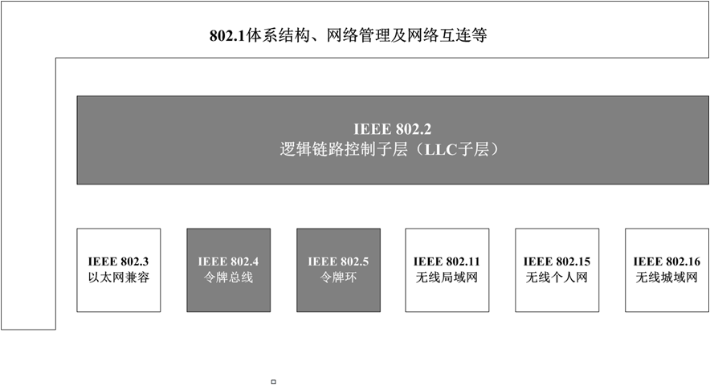

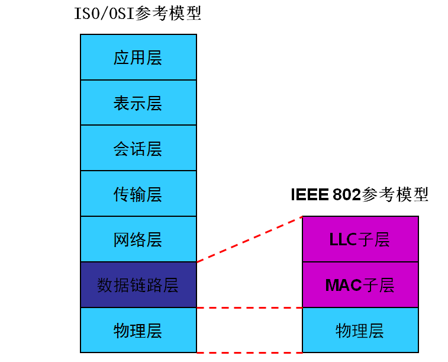

~~~shell
总结：
HDLC
PPP
MAC
~~~

- MAC子层和LLC子层

  - MAC子层
    - 媒体访问控制
    - 帧的寻址和识别
    - 帧检验等。

  

  - LLC子层
    - 逻辑链路控制
    - 二种类型链路服务
      - 无连接
      - 面向连接

- 以太网的基本MAC帧

- 以太网MAC帧字段
  - 前导码（Preamble，Pre），7字节的1和0交替码序列，比特同步，当物理层采用同步信道时（如SDH/SONET），不再需要前同步码。
  - 帧定界（Start-of-Frame Delimiter，SFD ）。10101011。以太网的帧定界符只用于标识帧的开始，不必标识结束。
  - 一般认为MAC 帧从DA 开始。
  - DA：目的MAC 地址， 6字节。
  - SA：源MAC 地址， 6字节。 
  - Type：类型字段，上层协议类型，最常见的如0x0800指IP协议。
    - DIX Ethernet V2定义该字段为类型
    - IEEE802.3 标准定义为“长度/类型”字段，规定小于0x0600时，表示数据部分的长度；大于0x0600时，表示类型。
  - 数据字段：长度在46字节 到1500字节之间可变的任意值序列。
  - FCS，4字节，采用CRC编码，用于差错校验。FCS校验的计算不包括同步码、帧定界和FCS字段本身。

- 全球MAC地址与本地MAC地址

  - **全球统一管理的地址**：由设备制造商唯一地分配给设备，前3个字节为机构唯一标识OUI (Organizationally Unique Identifier），如：3Com公司主产的以太网卡的OUI地址块有“00-60-8C”， Intel公司的地址块有“00-AA-00”等

  - **本地管理的地址**： 不包含OUI成分，同设备制造商指定

  - **区分** **方法**： G/L（Global/Local）位为0时, 是全球管理的地址；G/L位为1时, 是本地管理的地址。

  - 十六进制的MAC(6字节)

    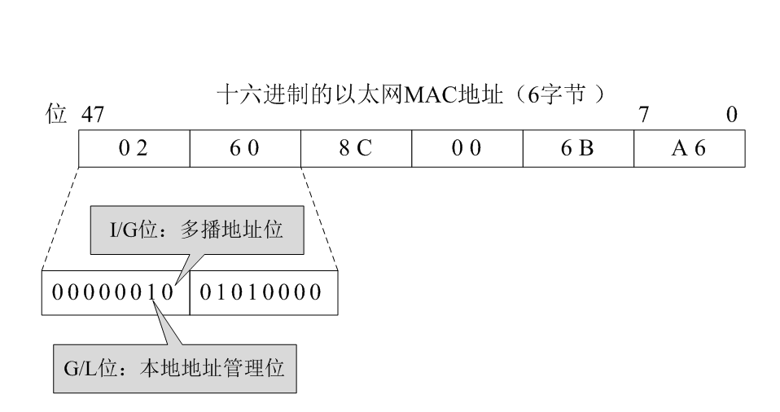

- 单播地址 unicast

  某特定站点的MAC 地址

  

- 组播地址或多播地址 multicast

  表示一个包含多个目的站点的组地址

> 单播与组播区分方法：I/G位为0时，单播；I/G位为1时，组播

- 广播地址 broadcast

  表示发给所有站点， 16进制表示为FF-FF-FF-FF-FF-FF。 

### 1.5 以太网类型

- 拓扑结构
  - 总线
  - 环型
  - 星型

- 共享式以太网
  
  - 集线器
  
- 交换式以太网
  - 采用交换机进行网络互连，交换机主要功能是完成数据帧转发。
  - 交换机采用MAC地址/交换机端口映射表的方式进行过滤式的转发。
  - 支持多端口之间并发连接
  - 需处理数据链路层协议，工作在第二层
  - 端口速率为所连接的设备独享

## 打卡要求

1. 画出以太网的MAC帧格式

  2.标明MAC地址的功能

## 二、数据链路层设备及其工作原理

### 2.1 数据链路层设备

- 以太网交换机

以太网交换机是基于以太网传输数据的交换机，以太网采用共享总线型传输媒体方式的局域网。以太网交换机的结构是每个端口都直接与主机相连，并且一般都工作在全双工方式。交换机能同时连通许多对端口，使每一对相互通信的主机都能像独占通信媒体那样，进行无冲突地传输数据。

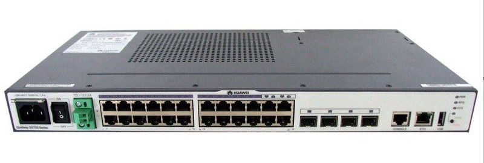

### 2.2 以太网交换机工作原理

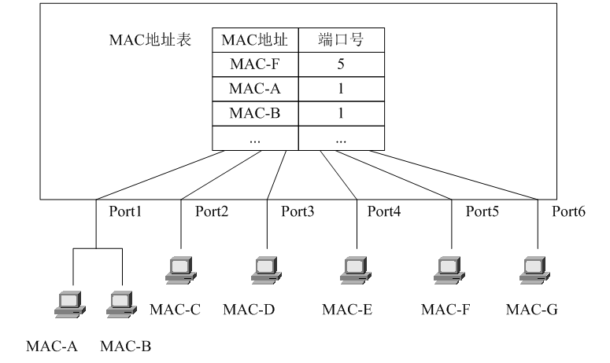

1.初始MAC地址与端口映射表是空的，如何自动建立表中记录？

2.收到数据帧后，将该帧的源MAC地址和端口号的映射关系写入表中。

3.若目的MAC地址在映射表中，则将数据帧转发给对应的交换机端口。

4.若目的MAC地址不在映射表中，则向除源端口外的所有端口广播，对应的MAC做出应答， 交换机记录其所在端口。

~~~shell
总结：
交换机的学习功能：能够把mac地址表中没有MAC与端口进行映射
交换机的更新功能：当主机连接到交换机端口发生的改变，MAC地址表更新
交换机的转发功能：当交换机拿到数据帧时，查找MAC地址表，对数据帧进行转发
~~~

## 打卡要求

1. 写出交换机工作原理

## 三、使用交换机实现多计算机之间相互通信

### 3.1 交换机连接单台计算机

思路：

计算机与交换机之间连接使用的线缆标准？

使用直通线或直连线

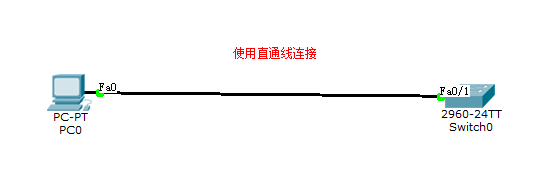

### 3.2 交换机连接多台计算机

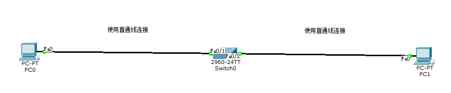

打卡要求：

1. 使用交换机实现多台计算机的连接，并查看MAC地址表
2. 生成文档

### 3.3 多交换机连接多台计算机

思路：

1. 准备多台交换机
2. 交换机之间使用交叉线连接
3. 查看MAC地址表

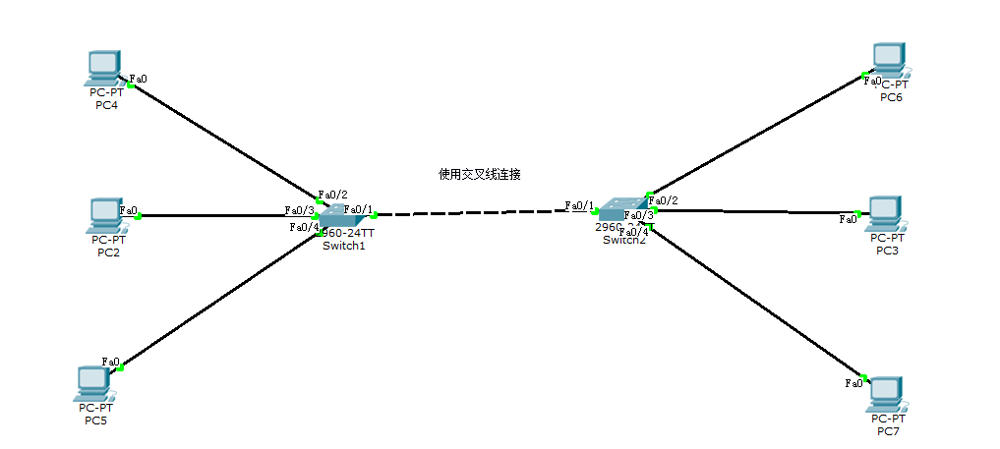

## 打卡要求

1. 思考如何使用交换机连接不同网段计算机，并实现其通信？

   答：使用二层交换机，无法实现不同网段计算机之间通信，但是可以使用三层交换机。

## 四、虚拟局域网

### 4.1 虚拟局域网介绍

- Virtual LAN, VLAN 
- 交换机所提供的一种功能
- 虚拟局域网作用
  - 不受物理位置的限制划分逻辑组
  - 将某些网络流量限制在各自的VLAN之中
- VLAN划分的方法
  - 按照交换机端口划分
  - 按照MAC 地址划分
  - 按照第三层网络地址划分：常按IP子网来划分

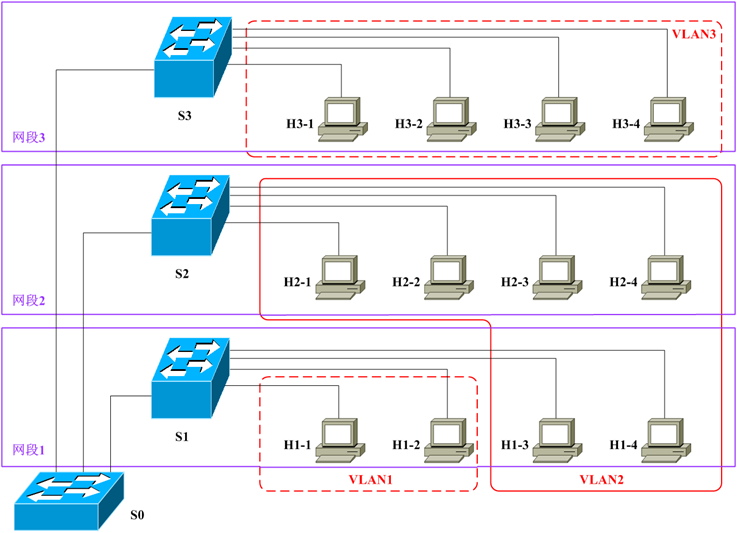

### 4.2 虚拟局域网协议

- IEEE 802.1Q
- 扩展MAC帧首部——标识VLAN
- IEEE 802.1Q（Virtual Bridged Local Area Networks）协议
- 首部增加4个字节
  - TPID （Tag Protocol Identifier），固定取值为0x8100
  - TCI （Tag Control Information）
    - 用户优先级, 3bit
    - CFI Canonical Format Indicator）,1bit
    -  VLAN ID, 12bit

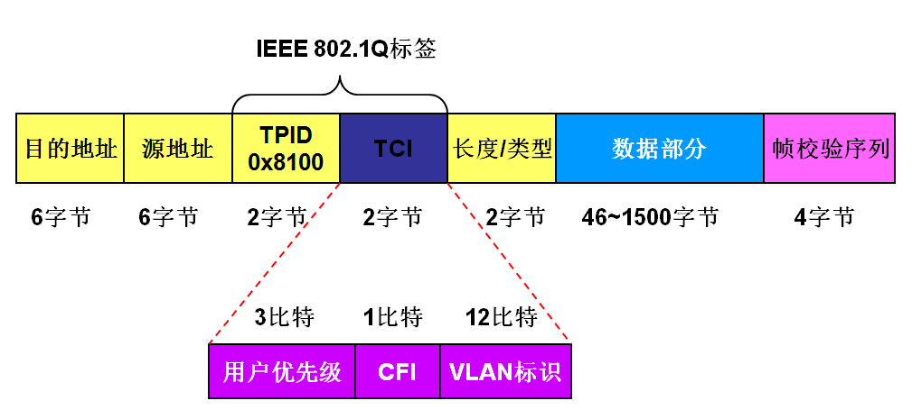

### 4.3 VLAN划分案例

**基于Cisco交换机实现VLAN划分**

#### 4.3.1 实验拓扑图（一台交换机应用案例）

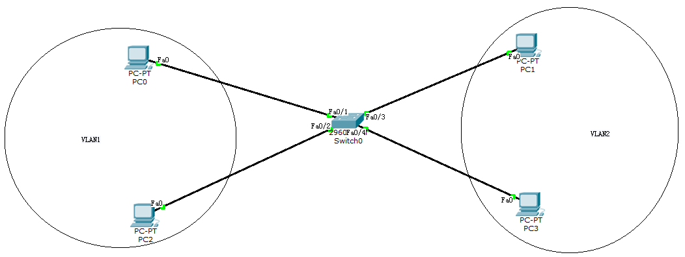

#### 4.3.2 查看交换中现有的VLAN

~~~powershell
Switch>enable
#用户模式，用于开启下一级功能，可使用的命令较少
Switch#show vlan
#特权模式，用于进行查看等操作，可使用的命令较用户模式多了一些

VLAN Name                             Status    Ports
---- -------------------------------- --------- -------------------------------
1    default                          active    Fa0/1, Fa0/2, Fa0/3, Fa0/4
                                                Fa0/5, Fa0/6, Fa0/7, Fa0/8
                                                Fa0/9, Fa0/10, Fa0/11, Fa0/12
                                                Fa0/13, Fa0/14, Fa0/15, Fa0/16
                                                Fa0/17, Fa0/18, Fa0/19, Fa0/20
                                                Fa0/21, Fa0/22, Fa0/23, Fa0/24
                                                Gig1/1, Gig1/2
1002 fddi-default                     act/unsup 
1003 token-ring-default               act/unsup 
1004 fddinet-default                  act/unsup 
1005 trnet-default                    act/unsup 

VLAN Type  SAID       MTU   Parent RingNo BridgeNo Stp  BrdgMode Trans1 Trans2
---- ----- ---------- ----- ------ ------ -------- ---- -------- ------ ------
1    enet  100001     1500  -      -      -        -    -        0      0
1002 fddi  101002     1500  -      -      -        -    -        0      0   
1003 tr    101003     1500  -      -      -        -    -        0      0   
1004 fdnet 101004     1500  -      -      -        ieee -        0      0   
1005 trnet 101005     1500  -      -      -        ibm  -        0      0   

Remote SPAN VLANs
------------------------------------------------------------------------------

Primary Secondary Type              Ports
------- --------- ----------------- ------------------------------------------
~~~

#### 4.3.3 划分VLAN

思想：把交换机端口添加到指定VLAN中即可把计算机添加到某一VLAN

命令：

~~~shell
Switch>enable
#由用户模式进行特权模式
Switch#config terminal 
#开启全局配置模式
Enter configuration commands, one per line.  End with CNTL/Z.
Switch(config)#interface f0/3
#进行端口配置模式
Switch(config-if)#switchport mode access
#配置端口为access模式，即为接入模式，功能就是为了接入计算机，没有其它功能
Switch(config-if)#switchport access vlan 2
#把f0/3端口添加到vlan 2,注意此时vlan 2并不存在
% Access VLAN does not exist. Creating vlan 2
Switch(config-if)#interface f0/4
#进入接口模式
Switch(config-if)#switchport mode access
#配置接口为access模式
Switch(config-if)#switchport access vlan 2
#添加接口到vlan 2
Switch(config-if)#exit
#退出接口模式
Switch(config)#exit
#退出全局配置模式

Switch#show vlan
#查看vlan信息

VLAN Name                             Status    Ports
---- -------------------------------- --------- -------------------------------
1    default                          active    Fa0/1, Fa0/2, Fa0/5, Fa0/6
                                                Fa0/7, Fa0/8, Fa0/9, Fa0/10
                                                Fa0/11, Fa0/12, Fa0/13, Fa0/14
                                                Fa0/15, Fa0/16, Fa0/17, Fa0/18
                                                Fa0/19, Fa0/20, Fa0/21, Fa0/22
                                                Fa0/23, Fa0/24, Gig1/1, Gig1/2
2    VLAN0002                         active    Fa0/3, Fa0/4
1002 fddi-default                     act/unsup 
1003 token-ring-default               act/unsup 
1004 fddinet-default                  act/unsup 
1005 trnet-default                    act/unsup 

VLAN Type  SAID       MTU   Parent RingNo BridgeNo Stp  BrdgMode Trans1 Trans2
---- ----- ---------- ----- ------ ------ -------- ---- -------- ------ ------
1    enet  100001     1500  -      -      -        -    -        0      0
2    enet  100002     1500  -      -      -        -    -        0      0
1002 fddi  101002     1500  -      -      -        -    -        0      0   
1003 tr    101003     1500  -      -      -        -    -        0      0   
1004 fdnet 101004     1500  -      -      -        ieee -        0      0   
1005 trnet 101005     1500  -      -      -        ibm  -        0      0   

Remote SPAN VLANs
------------------------------------------------------------------------------

Primary Secondary Type              Ports
------- --------- ----------------- ------------------------------------------

Switch#show vlan id 2
#查看指定vlan信息

VLAN Name                             Status    Ports
---- -------------------------------- --------- -------------------------------
2    VLAN0002                         active    Fa0/3, Fa0/4

VLAN Type  SAID       MTU   Parent RingNo BridgeNo Stp  BrdgMode Trans1 Trans2
---- ----- ---------- ----- ------ ------ -------- ---- -------- ------ ------
2    enet  100002     1500  -      -      -        -    -        0      0

#配置后保存配置
Switch#copy run start
Destination filename [startup-config]? 
#此处直接回车即可
Building configuration...
[OK]
~~~

#### 4.3.4 实验拓扑图(二台交换机应用案例 Trunk)

#### 4.3.4 划分VLAN

思路：

1. 分别把端口添加到不同的VLAN中
2. 配置交换机之间连接端口为trunk链路

命令：

~~~shell
#以下为S1配置

Switch>enable
#用户模式下进入特权模式
Switch#config terminal 
#进入全局配置模式
Enter configuration commands, one per line.  End with CNTL/Z.

Switch(config)#hostname s1
#配置交换机名称
s1(config)#interface f0/3
#进入接口配置
s1(config-if)#switchport mode access
#配置接口为access
s1(config-if)#switchport access vlan 2
#添加接口到vlan 2

% Access VLAN does not exist. Creating vlan 2
s1(config-if)#do show vlan
#在接口模式下使用do转换show vlan完成对vlan信息查看

VLAN Name                             Status    Ports
---- -------------------------------- --------- -------------------------------
1    default                          active    Fa0/1, Fa0/2, Fa0/4, Fa0/5
                                                Fa0/6, Fa0/7, Fa0/8, Fa0/9
                                                Fa0/10, Fa0/11, Fa0/12, Fa0/13
                                                Fa0/14, Fa0/15, Fa0/16, Fa0/17
                                                Fa0/18, Fa0/19, Fa0/20, Fa0/21
                                                Fa0/22, Fa0/23, Fa0/24, Gig1/1
                                                Gig1/2
2    VLAN0002                         active    Fa0/3
1002 fddi-default                     act/unsup 
1003 token-ring-default               act/unsup 
1004 fddinet-default                  act/unsup 
1005 trnet-default                    act/unsup 

VLAN Type  SAID       MTU   Parent RingNo BridgeNo Stp  BrdgMode Trans1 Trans2
---- ----- ---------- ----- ------ ------ -------- ---- -------- ------ ------
1    enet  100001     1500  -      -      -        -    -        0      0
2    enet  100002     1500  -      -      -        -    -        0      0
1002 fddi  101002     1500  -      -      -        -    -        0      0   
1003 tr    101003     1500  -      -      -        -    -        0      0   
1004 fdnet 101004     1500  -      -      -        ieee -        0      0   
1005 trnet 101005     1500  -      -      -        ibm  -        0      0   

Remote SPAN VLANs
------------------------------------------------------------------------------

Primary Secondary Type              Ports
------- --------- ----------------- ------------------------------------------

#以下为s2配置

Switch>enable

Switch#config terminal 
Enter configuration commands, one per line.  End with CNTL/Z.

Switch(config-if)#hostname s2

s2(config)#interface f0/3
s2(config-if)#switchport mode access
s2(config-if)#switchport access vlan 2
% Access VLAN does not exist. Creating vlan 2
s2(config-if)#do show vlan

VLAN Name                             Status    Ports
---- -------------------------------- --------- -------------------------------
1    default                          active    Fa0/1, Fa0/2, Fa0/4, Fa0/5
                                                Fa0/6, Fa0/7, Fa0/8, Fa0/9
                                                Fa0/10, Fa0/11, Fa0/12, Fa0/13
                                                Fa0/14, Fa0/15, Fa0/16, Fa0/17
                                                Fa0/18, Fa0/19, Fa0/20, Fa0/21
                                                Fa0/22, Fa0/23, Fa0/24, Gig1/1
                                                Gig1/2
2    VLAN0002                         active    Fa0/3
1002 fddi-default                     act/unsup 
1003 token-ring-default               act/unsup 
1004 fddinet-default                  act/unsup 
1005 trnet-default                    act/unsup 

VLAN Type  SAID       MTU   Parent RingNo BridgeNo Stp  BrdgMode Trans1 Trans2
---- ----- ---------- ----- ------ ------ -------- ---- -------- ------ ------
1    enet  100001     1500  -      -      -        -    -        0      0
2    enet  100002     1500  -      -      -        -    -        0      0
1002 fddi  101002     1500  -      -      -        -    -        0      0   
1003 tr    101003     1500  -      -      -        -    -        0      0   
1004 fdnet 101004     1500  -      -      -        ieee -        0      0   
1005 trnet 101005     1500  -      -      -        ibm  -        0      0   

Remote SPAN VLANs
------------------------------------------------------------------------------

Primary Secondary Type              Ports
------- --------- ----------------- ------------------------------------------
~~~

~~~shell
#以下为s1 trunk配置

s1>enable
s1#config terminal
Enter configuration commands, one per line.  End with CNTL/Z.

s1(config)#interface f0/1

s1(config-if)#switchport mode trunk
#配置为trunk模式，可以实现多VLAN通信

s1(config-if)#switchport nonegotiate
#配置为不协议模式，一端协议为dot1q,另一端协议也应该为dot1q

s1(config-if)#do show vlan

VLAN Name                             Status    Ports
---- -------------------------------- --------- -------------------------------
1    default                          active    Fa0/2, Fa0/4, Fa0/5, Fa0/6
                                                Fa0/7, Fa0/8, Fa0/9, Fa0/10
                                                Fa0/11, Fa0/12, Fa0/13, Fa0/14
                                                Fa0/15, Fa0/16, Fa0/17, Fa0/18
                                                Fa0/19, Fa0/20, Fa0/21, Fa0/22
                                                Fa0/23, Fa0/24, Gig1/1, Gig1/2
2    VLAN0002                         active    Fa0/3
1002 fddi-default                     act/unsup 
1003 token-ring-default               act/unsup 
1004 fddinet-default                  act/unsup 
1005 trnet-default                    act/unsup 

VLAN Type  SAID       MTU   Parent RingNo BridgeNo Stp  BrdgMode Trans1 Trans2
---- ----- ---------- ----- ------ ------ -------- ---- -------- ------ ------
1    enet  100001     1500  -      -      -        -    -        0      0
2    enet  100002     1500  -      -      -        -    -        0      0
1002 fddi  101002     1500  -      -      -        -    -        0      0   
1003 tr    101003     1500  -      -      -        -    -        0      0   
1004 fdnet 101004     1500  -      -      -        ieee -        0      0   
1005 trnet 101005     1500  -      -      -        ibm  -        0      0   

Remote SPAN VLANs
------------------------------------------------------------------------------

Primary Secondary Type              Ports
------- --------- ----------------- ------------------------------------------

#以下为s2 trunk配置

s2>enable
s2#config terminal
Enter configuration commands, one per line.  End with CNTL/Z.
s2(config)#interface f0/1

s2(config-if)#switchport mode trunk
#配置为trunk模式，可以实现多VLAN通信

s2(config-if)#switchport nonegotiate
#配置为不协议模式，一端协议为dot1q,另一端协议也应该为dot1q

s2(config-if)#do show vlan

VLAN Name                             Status    Ports
---- -------------------------------- --------- -------------------------------
1    default                          active    Fa0/2, Fa0/4, Fa0/5, Fa0/6
                                                Fa0/7, Fa0/8, Fa0/9, Fa0/10
                                                Fa0/11, Fa0/12, Fa0/13, Fa0/14
                                                Fa0/15, Fa0/16, Fa0/17, Fa0/18
                                                Fa0/19, Fa0/20, Fa0/21, Fa0/22
                                                Fa0/23, Fa0/24, Gig1/1, Gig1/2
2    VLAN0002                         active    Fa0/3
1002 fddi-default                     act/unsup 
1003 token-ring-default               act/unsup 
1004 fddinet-default                  act/unsup 
1005 trnet-default                    act/unsup 

VLAN Type  SAID       MTU   Parent RingNo BridgeNo Stp  BrdgMode Trans1 Trans2
---- ----- ---------- ----- ------ ------ -------- ---- -------- ------ ------
1    enet  100001     1500  -      -      -        -    -        0      0
2    enet  100002     1500  -      -      -        -    -        0      0
1002 fddi  101002     1500  -      -      -        -    -        0      0   
1003 tr    101003     1500  -      -      -        -    -        0      0   
1004 fdnet 101004     1500  -      -      -        ieee -        0      0   
1005 trnet 101005     1500  -      -      -        ibm  -        0      0   

Remote SPAN VLANs
------------------------------------------------------------------------------

Primary Secondary Type              Ports
------- --------- ----------------- ------------------------------------------

~~~

~~~shell
总结：
trunk的使用是为了实现跨交换机相同VLAN中的计算机通信
配置trunk步骤：
1、给计算机配置IP
2、把计算机连接的端口划分到指定的VLAN
3、在特定的端口上配置trunk
~~~

## 打卡要求

1. 实现多台计算机处于不同虚拟局域网中
2. 实现跨交换机相同VLAN的计算机相互通信

# 任务总结

1. 数据链路层功能

   

2. 数据链路层设备及其工作原理

   

3. 使用交换机实现多计算机之间相互通信

   

4. 虚拟局域网

# 任务打卡

1. 通过Xmind文档实现上述课程内容总结，并发送至327092504@qq.com邮箱

   - 邮件标题：姓名-课程名称总结

   - 邮件正文：可表达总结心得

   - 邮件附件：将课程内容总结以附件形式发送

     

# 任务订阅

1. 观看《互联网时代》10集记录片，提交观后感邮箱：327092504@qq.com
   - 邮件标题：姓名-第几集观后感
   - 邮件正文：可表达观后感
   - 邮件附件：可无附件

