# 5_OSI参考模型网络层

[TOC]

# 任务场景

波仔刚刚把数据链路层及交换机相关技术搞明白，通过工单系统又收到了运维经理派单任务：“完成测试环境与生产环境的局域网建设，并在需要两个局域网通信时，可通过路由器实现通信”。如果你是波仔，那么，应该如何下手去完成两个局域网建设呢？

如果我是波仔，我将会从如下方面入手：

1. 了解网络层功能
2. 了解网络层协议
3. 了解网络层设备及其工作原理
4. 使用路由器实现局域网连接

# 任务清单

## 清单列表

- [ ] 网络层功能
- [ ] 网络层协议
- [ ] 网络层设备及其工作原理
- [ ] 使用路由器实现局域网连接

## 一、网络层功能

### 1.1 功能

将分组从源主机通过网络路径转发到目的主机，所以网络层最核心的功能是：

- 分组转发
  - 当一个分组到达路由器输入链路时，需要将该分组转发到相应合适的输出链路上。
  - 每一个分组都会带有一个首部，而首部包含有转发标识。
  - 路由器根据转发标识，查询路由器内的转发表，转发表会为分组指出该通往的输出链路。
- 路由选择
  - 当分组开始从源主机发往目的主机，网络层必须决定分组应该采用的路由或路径。
  - 路由选择就是用来提供分组转发时所需要的转发表。

~~~shell
总结：
功能：  分组转发  路由选择
~~~

### 1.2 服务

网络层可以为用户提供两种服务，一个是面向连接的服务，一个是无连接的服务。我们现有的计算机网络体系结构中，网络层只能单独提供其中一个服务，不能两能服务同时提供。

- 面向连接的计算机网络
  - 虚电路网络
    - 借鉴于电信网，让网络负责可靠交付。
    - 要求两台计算机进行通信时，应当先建立连接，所建立的连接就是虚电路，然后双方就可以通过该虚电路发送分组。
    - 通信结果结束后，就释放掉虚电路。
    - 可靠

- 无连接的计算机网络
  - 数据报网络
    - 因特网的先驱者则坚定认为无连接服务是更适合因特网的网络层的。电信网的提供可靠的传输服务，对于电话这种无智能，没有处理差错能力的设备无疑是非常奏效的。但计算机是可以有很强的差错处理能力的。所以因特网设计时就与电信网完全不一样：网络层向上只提供简单灵活的、无连接的、尽最大努力交付的数据报服务。
    - 在数据报网络里，分组发送时并不需要建立连接，每一个分组都是独立发送的，并且网络层不提供服务质量保证。所以分组在发送过程中，会出现出错、丢失、重复和失序，还有交付期限。而为了保证通信可靠，这些差错处理则交给网络边缘主机——终端，来进行处理。这样网络核心相比之下就简单许多，网络造价大大降低，并且灵活适应性强。这种设计思想称为端到端原则(end-to-end arguments)。
    - 不可靠

### 1.3 网络层服务网络对比

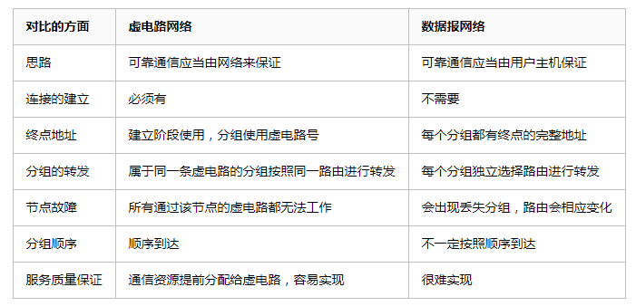

## 打卡要求

1. 写出网络层功能有哪些？
2. 写出网络层服务有哪些？

## 二、网络层协议

IP协议、因特网路由选择协议（RIP/OSPF/BGP）、因特网控制报文协议（ICMP）

### 2.1 IP协议

#### 2.1.1 IP数据报分片

一个链路层帧能够承载的最大数据量叫做最大传输单元，即MTU。

#### 2.1.2 IP分片过程

假设原IP分组总长度为L，待转发链路的MTU=M，若L>M，且允许分片，则需要分片，分片时每个分片的标识复制原IP分组的标识号。除最后一个分片，其他分片均分为MTU允许的最大分片。一个最大分片可封装的数据应该是8的倍数，因此一个最大分片可封装的数据为：

- d=[(M-20)/8] * 8  向下取整

- 需要的总片数是L-20/d向上取整

#### 2.1.3 IPv4编址

##### 2.1.3.1 接口

主机或路由器与物理链路之间的边界叫做接口，为了实现网络层功能，路由器通常有多个接口，主机通常只有一个或两个接口。

##### 2.1.3.2 IP地址

- IPv4
  - 32位(bit)
  - 点分十进制写法
    - 例如：192.168.1.1
  - 编号标识主机或路由器的接口，与每个接口关联
  - 分为网络位和主机位
  - IP子网
    - IP地址具有相同网络位的设备接口
    - 有类编址：A,B,C,D,E
      - A
        - IP地址范围 1-126
        - 网络位+主机位+主机位+主机位
        - 网络位最高位为0，其它位除最低位外为1，均可为0，主机位全为0，即A类地址最小可用IP；网络位最高位为0，其它位全部为1，主机位全为0，即A类地址最大可用IP；但由于127段被保留给本地回环使用，故A类地址范围为1-126
        - 网络掩码为：255.0.0.0
        - 私有地址保留：10.0.0.0 255.0.0.0-10.255.255.255 255.0.0.0
      - B
        - IP地址范围128-191
        - 网络位+网络位+主机位+主机位
        - 第一组网络位最高二位为10，其它位为0，即为B类地址最小可用IP；第一组网络位最高二位为10，其它位为1，即为B类地址最大可用IP，故B类地址范围为128-191
        - 网络掩码为：255.255.0.0
        - 私有地址保留：172.16.0.0 255.255.0.0 - 172.31.255.255 255.255.0.0
      - C
        - IP地址范围 192-223
        - 网络位+网络位+网络位+主机位
        - 第一组网络位最高三位为110，其它位为0，即为C类地址最小可用IP；第一组网络位最高三位为110，其它位为1，即为B类地址最大可用IP，故C类地址范围为192-223
        - 网络掩码为：255.255.255.0
        - 私有地址保留：192.168.0.0 255.255.255.0 - 192.168.255.255 255.255.255.0
      - D
        - IP地址范围为224-239
        - 不分网络位和主机位
        - 为组播地址
        - 第一个八位组最高四位为1110
        - 例如：224.0.0.5，224.0.0.6
      - E
        - IP地址范围为240-255
        - 不分网络位和主机位
        - 用于科学研究使用
        - 第一个八位组最高五位为11110

- IPv6
  - 128位(bit)
  - 冒号分十六进制写法
    - 2001::1

### 2.2 路由选择协议

路由选择协议主要用于路由器之间实现路由表收敛的协议，当路由表稳定时，使用其对数据包进行转发。

- RIP
  - 跳数
- OSPF
  - 最短路径优先
- BGP

~~~shell
总结：
路由转发功能
根据路由表转发
路由表由路由条目组成
路由条目获取的方法：
1、直连
2、静态
3、动态
~~~

### 2.3 因特网控制报文协议 (ICMP)

- 网络探寻
- 差错报告
- 例如：ping使用ICMP进行探测

### 2.4 路由协议、IP协议、ICMP协议之间的关系

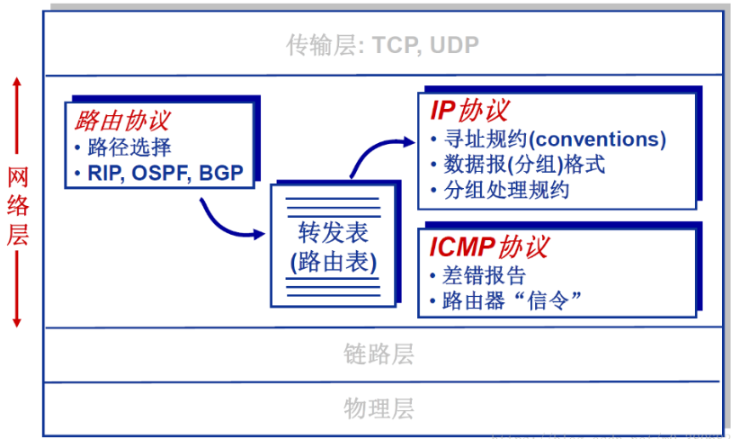

## 打卡要求

1. 计算机A,B,C类地址容纳的主机数量
2. 子网划分如何实现？
3. 为什么要使用NAT模式？

## 三、网络层设备及其工作原理

### 3.1 路由

- 路由(routing)是指数据包分组从源地址到达目的地址，用于决定数据包经过路径的进程。
- 路由器从一个接口上收到数据包，根据数据包的目的地址进行定向并转发到另一个接口的过程。

### 3.2 路由器

路由器是用于承担路由功能的设备，工作在OSI参考模型第三层，主要用于数据包转发。

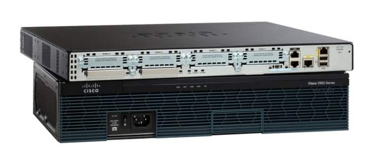

### 3.3 路由器工作原理

- 路由器通过接口完成与相邻路由器的连接
- 路由器之间的路由表由协议完成构建
- 路由器通过使用路由表完成对数据包的转发

### 3.4 路由表

路由表是由路由条目组成，路由条目由路由间的路由协议共同维护。

- 直连路由条目 
  - 路由器接口所在网段
- 静态路由条目
  - 由网络管理员手动配置的路由条目
- 动态路由条目
  - 通过动态路由协议学习的路由条目

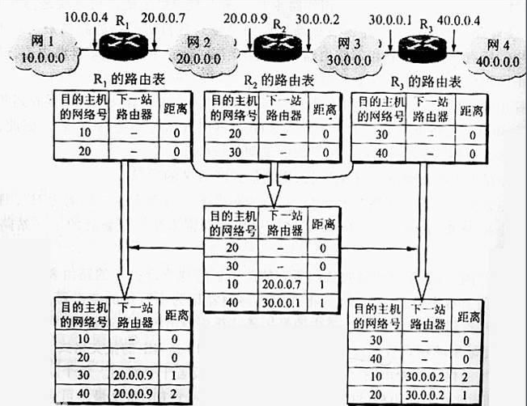

## 打卡要求

1. 写出路由、路由器、路由表、路由条目之间的关系

## 四、使用路由器实现局域网连接

### 4.1 实现单一局域网连接

#### 4.1.1 主机与路由器直接相连

##### 4.1.1.1 实验拓扑

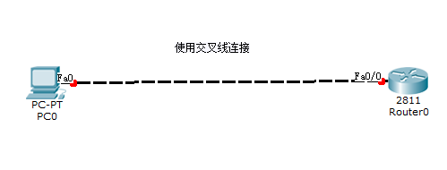

##### 4.1.1.2 实现连通配置

- 主机配置

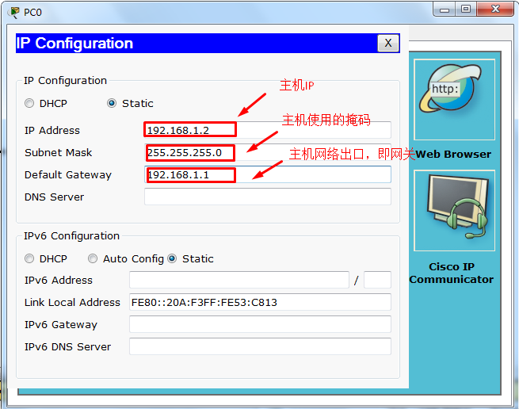

- 路由器配置

~~~shell
         --- System Configuration Dialog ---

Continue with configuration dialog? [yes/no]: no #不进入对话配置模式

Press RETURN to get started!

Router>enable
#由用户模式进行特权模式
Router#config terminal
#由特权模式进行全局配置模式
Enter configuration commands, one per line.  End with CNTL/Z.
Router(config)#interface f0/0
#进入接口配置模式
Router(config-if)#ip address 192.168.1.1 255.255.255.0
#配置ip地址
Router(config-if)#no shutdown
#开启接口

Router#show ip route
#查看路由条目
Codes: C - connected, S - static, I - IGRP, R - RIP, M - mobile, B - BGP
       D - EIGRP, EX - EIGRP external, O - OSPF, IA - OSPF inter area
       N1 - OSPF NSSA external type 1, N2 - OSPF NSSA external type 2
       E1 - OSPF external type 1, E2 - OSPF external type 2, E - EGP
       i - IS-IS, L1 - IS-IS level-1, L2 - IS-IS level-2, ia - IS-IS inter area
       * - candidate default, U - per-user static route, o - ODR
       P - periodic downloaded static route

Gateway of last resort is not set

C    192.168.1.0/24 is directly connected, FastEthernet0/0
#即为直连路由条目
~~~

- 配置后验证

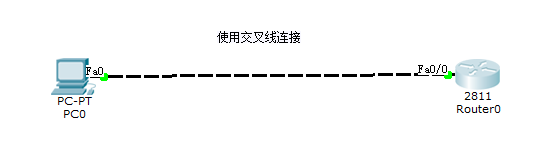

~~~shell
PC>ping 192.168.1.1

Pinging 192.168.1.1 with 32 bytes of data:

Reply from 192.168.1.1: bytes=32 time=1ms TTL=255
Reply from 192.168.1.1: bytes=32 time=0ms TTL=255
Reply from 192.168.1.1: bytes=32 time=0ms TTL=255
Reply from 192.168.1.1: bytes=32 time=0ms TTL=255

Ping statistics for 192.168.1.1:
    Packets: Sent = 4, Received = 4, Lost = 0 (0% loss),
Approximate round trip times in milli-seconds:
    Minimum = 0ms, Maximum = 1ms, Average = 0ms
~~~

#### 4.1.2 主机通过交换机连接路由器

##### 4.1.2.1 实验拓扑

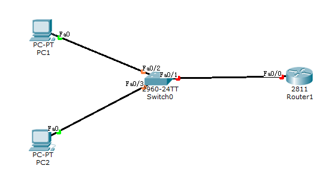

##### 4.1.2.2 实现连接配置

- 2台主机配置

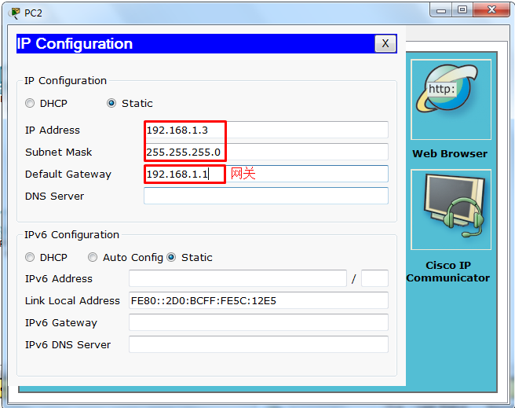

- 路由器配置

~~~shell
Continue with configuration dialog? [yes/no]: no

Press RETURN to get started!

Router>enable
#进入特权模式
Router#config terminal 
#进入全局配置模式

Enter configuration commands, one per line.  End with CNTL/Z.

Router(config)#interface f0/0
#进入接口配置模式

Router(config-if)#ip address 192.168.1.1 255.255.255.0
#配置IP地址

Router(config-if)#no shutdown
#开启接口

%LINK-5-CHANGED: Interface FastEthernet0/0, changed state to up

%LINEPROTO-5-UPDOWN: Line protocol on Interface FastEthernet0/0, changed state to up

Router(config-if)#do show ip route
#查看路由表
Codes: C - connected, S - static, I - IGRP, R - RIP, M - mobile, B - BGP
       D - EIGRP, EX - EIGRP external, O - OSPF, IA - OSPF inter area
       N1 - OSPF NSSA external type 1, N2 - OSPF NSSA external type 2
       E1 - OSPF external type 1, E2 - OSPF external type 2, E - EGP
       i - IS-IS, L1 - IS-IS level-1, L2 - IS-IS level-2, ia - IS-IS inter area
       * - candidate default, U - per-user static route, o - ODR
       P - periodic downloaded static route

Gateway of last resort is not set

C    192.168.1.0/24 is directly connected, FastEthernet0/0
~~~

- 配置后验证

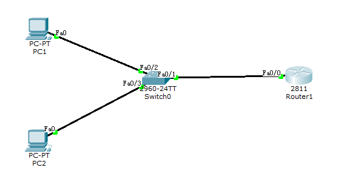

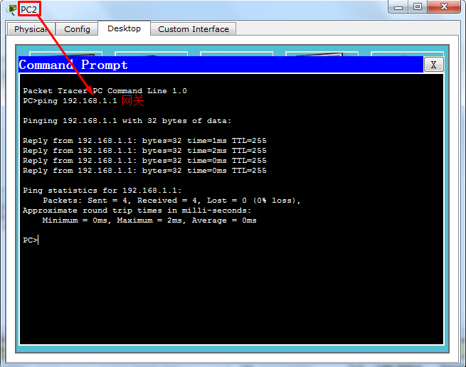

### 4.2 实现2个局域网连接

#### 4.2.1 实验拓扑

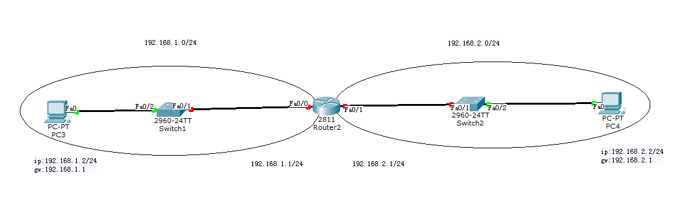

#### 4.2.2 配置

##### 4.2.2.1 主机配置

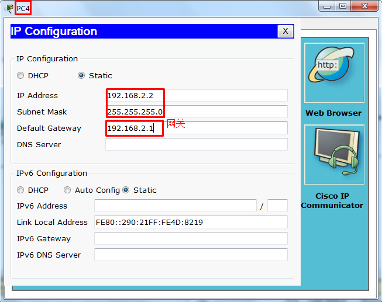

##### 4.2.2.2 路由器配置

~~~shell
         --- System Configuration Dialog ---

Continue with configuration dialog? [yes/no]: no #不进入配置对话模式

Press RETURN to get started!

Router>enable
Router#config terminal
Enter configuration commands, one per line.  End with CNTL/Z.
Router(config)#interface f0/0
Router(config-if)#ip address 192.168.1.1 255.255.255.0
Router(config-if)#no shutdown

%LINK-5-CHANGED: Interface FastEthernet0/0, changed state to up

%LINEPROTO-5-UPDOWN: Line protocol on Interface FastEthernet0/0, changed state to up

Router(config-if)#interface f0/1
Router(config-if)#ip address 192.168.2.1 255.255.255.0
Router(config-if)#no shutdown

%LINK-5-CHANGED: Interface FastEthernet0/1, changed state to up

%LINEPROTO-5-UPDOWN: Line protocol on Interface FastEthernet0/1, changed state to up

Router(config-if)#do show ip route
Codes: C - connected, S - static, I - IGRP, R - RIP, M - mobile, B - BGP
       D - EIGRP, EX - EIGRP external, O - OSPF, IA - OSPF inter area
       N1 - OSPF NSSA external type 1, N2 - OSPF NSSA external type 2
       E1 - OSPF external type 1, E2 - OSPF external type 2, E - EGP
       i - IS-IS, L1 - IS-IS level-1, L2 - IS-IS level-2, ia - IS-IS inter area
       * - candidate default, U - per-user static route, o - ODR
       P - periodic downloaded static route

Gateway of last resort is not set

C    192.168.1.0/24 is directly connected, FastEthernet0/0
C    192.168.2.0/24 is directly connected, FastEthernet0/1
~~~

#### 4.2.3 验证

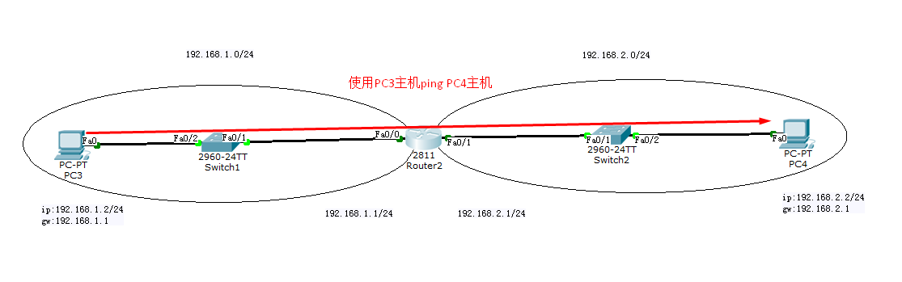

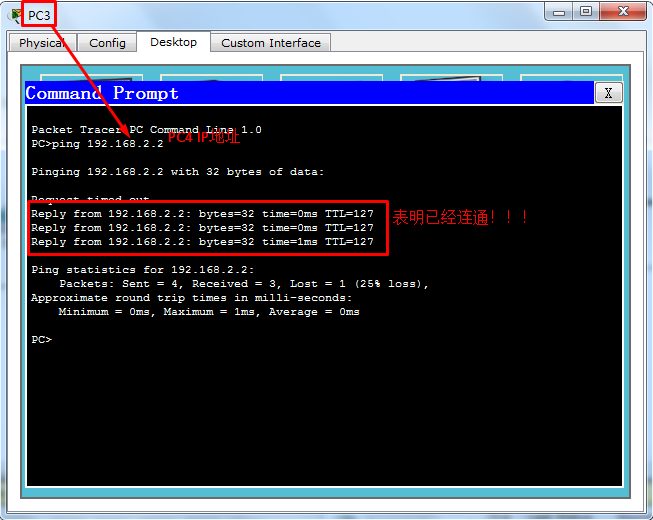

### 4.3 实现多个局域网连接

#### 4.3.1 静态路由

静态路由指由网络管理员手动指定的路由条目，从而形成稳定的路由表。

#### 4.3.2 动态路由协议

动态路由协议用于完成路由表的动态创建，不需要人为干预，从而达到路由表的快速收敛的目的。

#### 4.3.3 实验拓扑

#### 4.3.4 静态路由实现方式

##### 4.3.4.1 主机配置

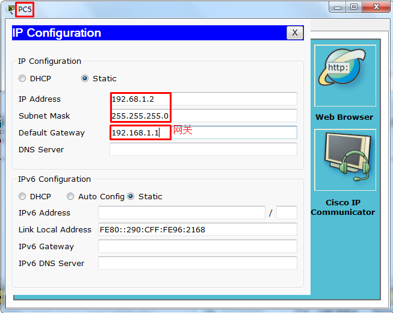

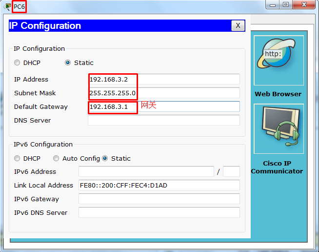

##### 4.3.4.2 路由器配置

~~~shell
#Router3

         --- System Configuration Dialog ---

Continue with configuration dialog? [yes/no]: no

Router>enable
Router#config terminal
Enter configuration commands, one per line.  End with CNTL/Z.
Router(config)#interface f0/1
Router(config-if)#ip address 192.168.1.1 255.255.255.0

Router(config-if)#no shutdown

%LINK-5-CHANGED: Interface FastEthernet0/1, changed state to up

%LINEPROTO-5-UPDOWN: Line protocol on Interface FastEthernet0/1, changed state to up

Router(config-if)#interface f0/0
Router(config-if)#ip address 192.168.2.1 255.255.255.0
Router(config-if)#no shutdown

%LINK-5-CHANGED: Interface FastEthernet0/0, changed state to up

#仅配置Router3完成查看路由表
Router#show ip route
Codes: C - connected, S - static, I - IGRP, R - RIP, M - mobile, B - BGP
       D - EIGRP, EX - EIGRP external, O - OSPF, IA - OSPF inter area
       N1 - OSPF NSSA external type 1, N2 - OSPF NSSA external type 2
       E1 - OSPF external type 1, E2 - OSPF external type 2, E - EGP
       i - IS-IS, L1 - IS-IS level-1, L2 - IS-IS level-2, ia - IS-IS inter area
       * - candidate default, U - per-user static route, o - ODR
       P - periodic downloaded static route

Gateway of last resort is not set

C    192.168.1.0/24 is directly connected, FastEthernet0/1

#配置Router4后再次查看路由表
Router#show ip route
Codes: C - connected, S - static, I - IGRP, R - RIP, M - mobile, B - BGP
       D - EIGRP, EX - EIGRP external, O - OSPF, IA - OSPF inter area
       N1 - OSPF NSSA external type 1, N2 - OSPF NSSA external type 2
       E1 - OSPF external type 1, E2 - OSPF external type 2, E - EGP
       i - IS-IS, L1 - IS-IS level-1, L2 - IS-IS level-2, ia - IS-IS inter area
       * - candidate default, U - per-user static route, o - ODR
       P - periodic downloaded static route

Gateway of last resort is not set

C    192.168.1.0/24 is directly connected, FastEthernet0/1
C    192.168.2.0/24 is directly connected, FastEthernet0/0
~~~

~~~shell
#Router4

        --- System Configuration Dialog ---

Continue with configuration dialog? [yes/no]: no

Router>enable
Router#config terminal
Enter configuration commands, one per line.  End with CNTL/Z.
Router(config)#interface f0/1
Router(config-if)#ip address 192.168.3.1 255.255.255.0
Router(config-if)#no shutdown

%LINK-5-CHANGED: Interface FastEthernet0/1, changed state to up

%LINEPROTO-5-UPDOWN: Line protocol on Interface FastEthernet0/1, changed state to up

Router(config-if)#interface f0/0
Router(config-if)#ip address 192.168.2.2 255.255.255.0
Router(config-if)#no shutdown

%LINK-5-CHANGED: Interface FastEthernet0/0, changed state to up

%LINEPROTO-5-UPDOWN: Line protocol on Interface FastEthernet0/0, changed state to up

Router(config-if)#exit
Router(config)#exit

#配置Router4后查看路由表
Router#show ip route
Codes: C - connected, S - static, I - IGRP, R - RIP, M - mobile, B - BGP
       D - EIGRP, EX - EIGRP external, O - OSPF, IA - OSPF inter area
       N1 - OSPF NSSA external type 1, N2 - OSPF NSSA external type 2
       E1 - OSPF external type 1, E2 - OSPF external type 2, E - EGP
       i - IS-IS, L1 - IS-IS level-1, L2 - IS-IS level-2, ia - IS-IS inter area
       * - candidate default, U - per-user static route, o - ODR
       P - periodic downloaded static route

Gateway of last resort is not set

C    192.168.2.0/24 is directly connected, FastEthernet0/0
C    192.168.3.0/24 is directly connected, FastEthernet0/1

~~~

##### 4.3.4.3 配置静态路由条目

~~~shell
#Router3 静态路由条目配置
Router>enable
Router#config terminal
Enter configuration commands, one per line.  End with CNTL/Z.
Router(config)#ip route 192.168.3.0 255.255.255.0 192.168.2.2
Router(config)#do show ip route
Codes: C - connected, S - static, I - IGRP, R - RIP, M - mobile, B - BGP
       D - EIGRP, EX - EIGRP external, O - OSPF, IA - OSPF inter area
       N1 - OSPF NSSA external type 1, N2 - OSPF NSSA external type 2
       E1 - OSPF external type 1, E2 - OSPF external type 2, E - EGP
       i - IS-IS, L1 - IS-IS level-1, L2 - IS-IS level-2, ia - IS-IS inter area
       * - candidate default, U - per-user static route, o - ODR
       P - periodic downloaded static route

Gateway of last resort is not set

C    192.168.1.0/24 is directly connected, FastEthernet0/1
C    192.168.2.0/24 is directly connected, FastEthernet0/0
S    192.168.3.0/24 [1/0] via 192.168.2.2

#Router4 静态路由条目配置
Router>enable
Router#config terminal
Enter configuration commands, one per line.  End with CNTL/Z.
Router(config)#ip route 192.168.1.0 255.255.255.0 192.168.2.1

	
Router(config)#do show ip route
Codes: C - connected, S - static, I - IGRP, R - RIP, M - mobile, B - BGP
       D - EIGRP, EX - EIGRP external, O - OSPF, IA - OSPF inter area
       N1 - OSPF NSSA external type 1, N2 - OSPF NSSA external type 2
       E1 - OSPF external type 1, E2 - OSPF external type 2, E - EGP
       i - IS-IS, L1 - IS-IS level-1, L2 - IS-IS level-2, ia - IS-IS inter area
       * - candidate default, U - per-user static route, o - ODR
       P - periodic downloaded static route

Gateway of last resort is not set

S    192.168.1.0/24 [1/0] via 192.168.2.1
C    192.168.2.0/24 is directly connected, FastEthernet0/0
C    192.168.3.0/24 is directly connected, FastEthernet0/1
~~~

##### 4.3.4.4 在主机验证网络可达性

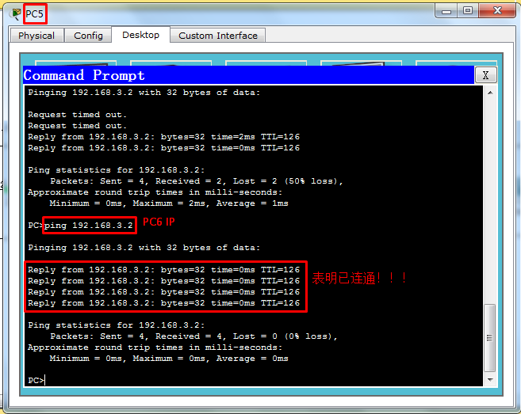

#### 4.3.5 动态路由实现方式

> 实验拓扑与静态一致

~~~shell
#Router3 RIP配置

Router>enable
Router#config t
Enter configuration commands, one per line.  End with CNTL/Z.
Router(config)#router rip
Router(config-router)#network 192.168.1.0
Router(config-router)#network 192.168.2.0
Router(config-router)#do show ip route
Codes: C - connected, S - static, I - IGRP, R - RIP, M - mobile, B - BGP
       D - EIGRP, EX - EIGRP external, O - OSPF, IA - OSPF inter area
       N1 - OSPF NSSA external type 1, N2 - OSPF NSSA external type 2
       E1 - OSPF external type 1, E2 - OSPF external type 2, E - EGP
       i - IS-IS, L1 - IS-IS level-1, L2 - IS-IS level-2, ia - IS-IS inter area
       * - candidate default, U - per-user static route, o - ODR
       P - periodic downloaded static route

Gateway of last resort is not set

C    192.168.1.0/24 is directly connected, FastEthernet0/1
C    192.168.2.0/24 is directly connected, FastEthernet0/0

#配置Router RIP后再查看路由表
Router(config-router)#do show ip route
Codes: C - connected, S - static, I - IGRP, R - RIP, M - mobile, B - BGP
       D - EIGRP, EX - EIGRP external, O - OSPF, IA - OSPF inter area
       N1 - OSPF NSSA external type 1, N2 - OSPF NSSA external type 2
       E1 - OSPF external type 1, E2 - OSPF external type 2, E - EGP
       i - IS-IS, L1 - IS-IS level-1, L2 - IS-IS level-2, ia - IS-IS inter area
       * - candidate default, U - per-user static route, o - ODR
       P - periodic downloaded static route

Gateway of last resort is not set

C    192.168.1.0/24 is directly connected, FastEthernet0/1
C    192.168.2.0/24 is directly connected, FastEthernet0/0
R    192.168.3.0/24 [120/1] via 192.168.2.2, 00:00:14, FastEthernet0/0
~~~

~~~shell
#Router4 RIP配置

Router>enable
Router#config terminal
Enter configuration commands, one per line.  End with CNTL/Z.
Router(config)#router rip
Router(config-router)#network 192.168.2.0
Router(config-router)#network 192.168.3.0
Router(config-router)#do show ip route
Codes: C - connected, S - static, I - IGRP, R - RIP, M - mobile, B - BGP
       D - EIGRP, EX - EIGRP external, O - OSPF, IA - OSPF inter area
       N1 - OSPF NSSA external type 1, N2 - OSPF NSSA external type 2
       E1 - OSPF external type 1, E2 - OSPF external type 2, E - EGP
       i - IS-IS, L1 - IS-IS level-1, L2 - IS-IS level-2, ia - IS-IS inter area
       * - candidate default, U - per-user static route, o - ODR
       P - periodic downloaded static route

Gateway of last resort is not set

R    192.168.1.0/24 [120/1] via 192.168.2.1, 00:00:03, FastEthernet0/0
C    192.168.2.0/24 is directly connected, FastEthernet0/0
C    192.168.3.0/24 is directly connected, FastEthernet0/1
~~~

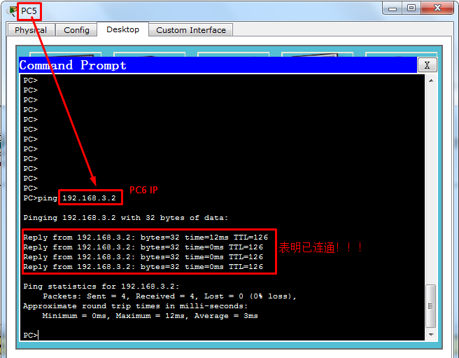

## 打卡要求

1. 设计并实现路由器连接多个局域网的案例，网段可自行决定。

# 任务总结

1. 网络层功能

   - 分组转发
   - 路由选择

    

2. 网络层协议

   - IP协议

   - 路由协议 RIP OSPF BGP

   - 互联网控制消息协议 ICMP

     

    

3. 网络层设备及其工作原理

   - 路由器
   - 路由器收到数据包后，查看数据包的目的地址，查找路由表，转发到发送接口

    

4. 使用路由器实现局域网连接

# 任务打卡

1. 通过Xmind文档实现上述课程内容总结，并发送至327092504@qq.com邮箱

   - 邮件标题：姓名-课程名称总结

   - 邮件正文：可表达总结心得

   - 邮件附件：将课程内容总结以附件形式发送

     

# 任务订阅

1. 观看《互联网时代》10集记录片，提交观后感邮箱：327092504@qq.com
   - 邮件标题：姓名-第几集观后感
   - 邮件正文：可表达观后感
   - 邮件附件：可无附件

