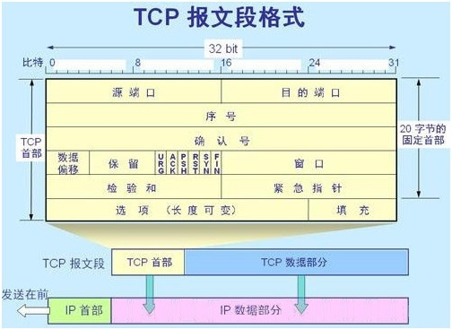
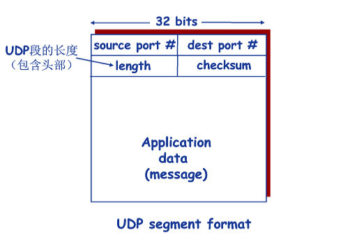
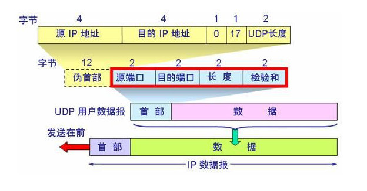
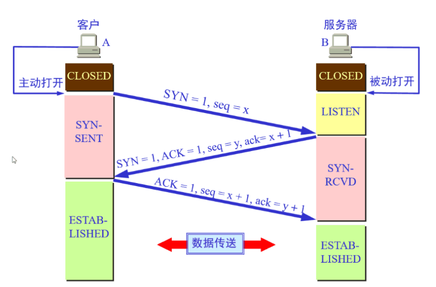
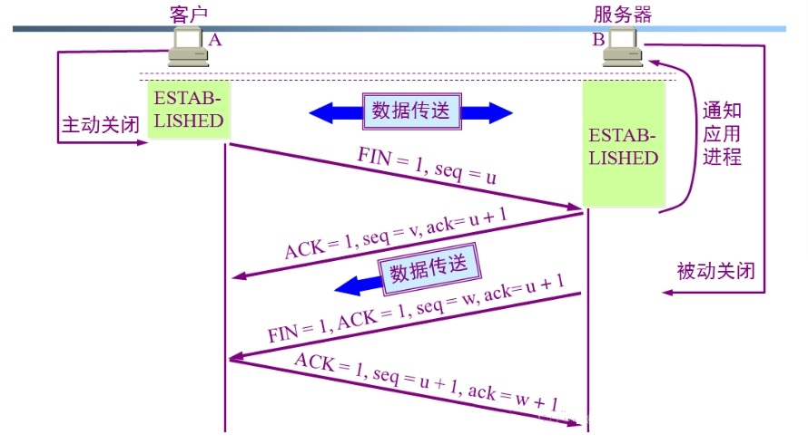

# 6_OSI参考模型传输层

[TOC]

# 任务场景

波仔在边工作边学习计算机网络的内容，其已学习了物理层、数据链路层、网络层的内容，物理层主要提供信号、电缆等方面的功能，数据链路层主要提供数据包的封装成帧等方面的功能，网络层主要提供数据包分组转发及路由选择功能，由此我们可以看出OSI参考模型的下三层主要提供数据传输线路的问题，那么当数据被传输到接收主机后，接收主机是如何把所接收到的数据传递给对应的应用程序的呢？这就涉及到传输层问题。

我们可以建议波仔从如下几个方面来学习传输层：

1. 传输层的作用
2. 传输层提供的服务
3. 传输层协议
4. TCP协议连接管理

# 任务清单

## 清单列表

- [ ] 了解传输层的作用
- [ ] 了解传输层提供的服务
- [ ] 掌握传输层协议
- [ ] 掌握TCP协议连接管理

## 一、传输层的作用

传输层主要提供不同主机上的进程之间的逻辑通信(端到端的通信),即使在不可靠的网络层(主机之间的逻辑通信)传输下，传输层也能提供可靠的传输。

## 打卡要求

1. 用一句话总结出传输层的作用

## 二、传输层提供的服务

### 2.1 传输层提供的服务基本原理

#### 2.1.1 多路复用和解复用(分路)技术

发送方的不同的应用进程使用同一个传输层协议传送数据，即为复用。

接收方的传输层剥去报文首部之后能把数据正确地传输到对应的应用进程，即为解复用(分路)

#### 2.1.2 可靠数据传输

传输层可以提供可靠的数据传输机制

- 不错、不丢、不乱
- 底层信道完全可靠
- 不会丢弃分组
- 差错检测
- 接收方反馈控制消息 ACK
- 重传机制

#### 2.1.3 流量控制和拥塞控制

传输层可以提供流量控制和拥塞控制机制

### 2.2 传输层寻址和端口

-  传输层的寻址最重要的就是进程的端口
- 端口
  - 发送数据时应用层的应用进程的数据通过“门(端口)”向传输层传递数据
  - 接收数据时传输层把接收到的数据通过“门(端口)”传递到对应的应用层的应用进程

- 端口号
  - 用于标识应用进程的数字标识   /etc/services
  - 长度为16bit
  - 能够标识2^16^个不同的端口  0-65535  共65536个
  - 只在本地有意义，即只标识本地计算机应用进程
  - 分2类
    - 知名端口
      - 0-1023，由IANA指派给TCP/IP重要应用进程，固定，不能随便使用。
      - 80 http
      - 22 ssh
      - 20 ftp
      - 21 ftp
      - 23 telnet
      - 25 smtp
      - 53 dns
      - 110 pop3
      - 443 ssl
    - 非知名端口
      - 服务端 1024-49151，需要给IANA注册登记
      - 客户端 49152-65535，是客户端进程运行成功后动态选择的
- 常用知名端口号

| 应用进程 | HTTP | HTTPS | SSHD | FTP    |
| -------- | ---- | ----- | ---- | ------ |
| 端口号   | 80   | 443   | 22   | 21、20 |

- 套接字 socket  

在网络中通过IP来唯一标识一台主机，在主机上通过端口来标识主机中不同应用进程，因此可以通过Socket套接字来标识一台主机上的某一应用进程。也可以理解为一个通信端点(endpoint)

- 套接字(socket)=(host ip+port)

### 2.3 传输层提供的服务

传输层能够提供面向连接服务的可靠传输，也可以提供无连接服务的不可靠传输，二者本质区别在于通信双方在通信前，是否需要建立连接。

#### 2.3.1 面向连接的服务

在TCP/IP协议栈中，在网络层使用了这两种协议服务,而在传输层，由TCP协议也提供了面向连接的可靠传输服务，它不提供广播和组播机制，但它包括数据发送确认、重传、流量控制、计时定时器、连接管理等，从而使用TCP协议在一些可靠性要求高的传输场合大量使用，例如:http等。但为了保证传输的可靠性，需要建立连接，在时间上会有延长。

#### 2.3.2 无连接的服务

在传输屋也提供了UDP协议，用于进行非连接的不可靠传输，它在网络层之上仅提供了多路复用和数据差错检查服务。

使用UDP协议的服务，在传输数据时，不需要建立连接，执行速度快，实时性好，但数据传输不可靠，特别对大文件或需要保持连接的服务，因此其多用于小文件的传输，例如dns解析服务等。

## 打卡要求

1. 写出对传输层面向连接服务的描述
2. 写出对传输层无连接服务的描述

## 三、传输层协议

### 3.1 TCP

TCP(传输控制协议)协议解决数据传输过程中的可靠、有序、无丢失和不重复的问题，其特点如下：

- 是面向连接的传输层协议
- 是端对端的，即可应用进程到应用进程，只能一对一连接
- 可靠的交付服务
- 无差错
- 无重复
- 有序
- 面向字节流

#### 3.1.1 TCP报文

TCP报文分为TCP首部和数据两部分，其报文格式如下：

- 源端口(16位)  识别发送端口
- 目的端口(16位) 识别接收端口
- 序列号 (seq,32位)
- 确认号 (ack,32位) 
  - 期望接收到的数据的起始序列号，通过情况下为已收到的数据字节长度加1
  - 如果含有同步标志位(SYN),则此为最初序列号
  - 如果没有同步标志位(SYN),则此为第一个数据比特的序列号
- 报头长度 以4字节为单位计算出的数据段开始地址的偏移值
- 保留 必须为0
- 标志位
  - URG —为1表示高优先级数据包，紧急指针字段有效。
  - ACK —为1表示确认号字段有效
  - PSH —为1表示是带有 PUSH标志的数据，指示接收方应该尽快将这个报文段交给应用层而不用等待缓冲区装满(很少使用)
  - RST —为1表示出现严重差错。可能需要重现创建TCP连接。还可以用于拒绝非法的报文段和拒绝连接请求。
  - SYN —为1表示这是连接请求或是连接接受请求，用于创建连接和使顺序号同步
  - FIN —为1表示发送方没有数据要传输了，要求释放连接。

- 窗口（WIN） —表示从确认号开始，本报文的源方可以接收的字节数，即源方接收窗口大小，用于流量控制。
- 校验和 —对整个的TCP报文段,包括TCP头部和TCP数据，以16位字进行计算所得。这是一个强制性的字段。
- 紧急指针 —本报文段中的紧急数据的最后一个字节的序号。
- 选项字段 —最多40字节。每个选项的开始是1字节的kind字段，说明选项的类型。

>序列号:
>
>序列号指的是Segment中第一个字节的编号,而不是Segment的编号
>建立TCP连接时,双方随机选择序列号
>
>
>
>ACKs:
>
>希望收到的下一个字节的序列号
>累积确认:该序列号之前的所有字节均已被正确接收到

### 3.2 UDP报文

- UDP(用户数据报协议)数据报有两个部分组成，分为UDP首部和用户数据。首部部分有8个字节，4个2字节的字段组成，整个UDP数据报作为IP数据报的数据部分封装在IP数据报中。

- UDP数据报如下图所示：

>checkSum校验和表示简单的校验和来进行差错检测。有错就丢弃。该字段是可选的。

- UDP数据报首部和伪首部和IP数据报之间的关系

## 打卡要求

1. 画出TCP数据报文包含内容
2. 画出UDP数据报文包含内容

## 四、TCP协议连接管理

TCP是面向连接的，所以每一个TCP连接都会有三个阶段状态：

- 建立连接
  - “三次握手”
- 数据传输
- 连接拆除
  - “四次挥手”

### 4.1 TCP建立连接的“三次握手”

- 第一次

当客户端向服务器发起连接请求时，客户端会发送同步序列标号SYN到服务器，在这里我们设SYN为1，等待服务器确认，这时客户端的状态为SYN_SENT。

- 第二次

当服务器收到客户端发送的SYN后，服务器要做的是确认客户端发送过来的SYN，在这里服务器发送确认包ACK，这里的ACK为1，意思是说“我收到了你发送的SYN了”，同时，服务器也会向客户端发送一个SYN包，这里我们设SYN为1。这时服务器的状态为SYN_RECV。在此时，服务器为该TCP连接分配TCP缓存和变量。服务器资源在此时分配（而客户端在第三次完成时才分配资源）。记录了客户端的请求信息，如果没有收到来自客户端的第三次回话，就会在一段时间内缓存TCP信息，这也是黑客攻击服务器的SYN洪泛攻击

- 第三次

客户端收到服务器发送的SYN和ACK包后，需向服务器发送确认包ACK，“我也收到你发送的SYN了，我这就给你发个确认过去，然后我们即能合体了”，这里的ACK为1，发送完毕后，客户端和服务器的状态为ESTABLISH，即TCP连接成功。

~~~shell
总结：
TCP在传输数据时，需要三步：建立连接、数据传输、连接拆除
建立连接的三次握手：
第一步：由客户端向服务端发SYN=1，同时发送随机数据 seq=x    SYN-SEND
第二步：由服务端向客户端发ACK=1，确认SYN=1已收到，并也会发送SYN=1,请求建立连接，对seq=x进行确认，ack=x+1  发送seq=y SYN-RCVD
第三步：由客户端确认服务端SYN=1，仅发ACK=1，发送随机数据seq=x+1,还对服务端发送的seq=y进行确认 ESTABLISHED
~~~

### 4.2 TCP连接拆除的“四次挥手”

- 第一次

A端向B端请求断开连接时会向B端发送一个带有FIN标记的报文段，这里的FIN是FINish的意思。

- 第二次

B端收到A发送的FIN后，B段现在可能现在还有数据没有传完，所以B端并不会马上向A端发送FIN，而是先发送一个确认序号ACK，意思是说“你发的断开连接请求我收到了，但是我现在还有数据没有发完，请稍等一下呗”。

- 第三次

当B端的事情忙完了，那么此时B端就可以断开连接了，此时B端向A端发送FIN序号，意思是这次可以断开连接了。

- 第四次

A端收到B端发送的FIN后，会向B端发送确认ACK，然后经过两个MSL时长后断开连接。

>MSL是Maximum Segment Lifetime，最大报文段生存时间，2个MSL是报文段发送和接收的最长时间。

## 打卡要求

1. 描述TCP三次握手过程
2. 描述TCP四次挥手过程

# 任务总结

1. 传输层的作用

   

2. 传输层提供的服务

   

3. 传输层协议

   

4. TCP协议连接管理

# 任务打卡

1. 通过Xmind文档实现上述课程内容总结，并发送至327092504@qq.com邮箱

   - 邮件标题：姓名-课程名称总结

   - 邮件正文：可表达总结心得

   - 邮件附件：将课程内容总结以附件形式发送

     

# 任务订阅

1. 观看《互联网时代》10集记录片，提交观后感邮箱：327092504@qq.com
   - 邮件标题：姓名-第几集观后感
   - 邮件正文：可表达观后感
   - 邮件附件：可无附件

