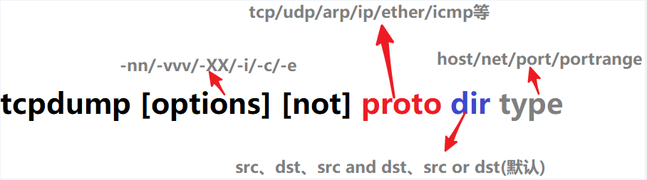
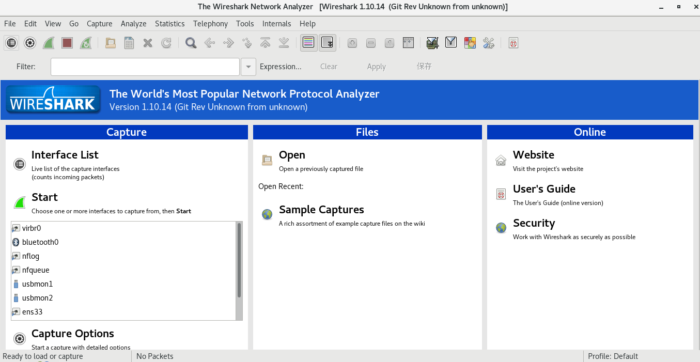

# 7_抓包工具使用

[TOC]

# 任务场景

波仔在学习计算机网络的过程中，需要了解各层协议数据单元具体的呈现形式或在运维过程中需要了解不同协议(服务)的工作原理，最好的办法就是通过网络协议抓包工具对数据包进行抓包分析。

我们可以建议波仔从如下几个方面来学习抓包工具的应用：

1. 抓包工具的作用
2. 抓包工具介绍
3. 使用命令行抓包工具tcpdump
4. 使用图形界面抓包工具Wireshark抓包并对数据包进行分析

# 任务清单

## 清单列表

- [ ] 了解抓包工具的作用
- [ ] 了解抓包工具的分类
- [ ] 掌握命令行抓包工具tcpdump应用
- [ ] 掌握图形界面抓包工具Wireshark抓包并对数据包进行分析

## 一、抓包工具的作用

网络协议抓包工具主要用于对网络协议的数据包进行捕获，捕获后亦可通过其对数据包的结构及其封装内容进行分析查看，以便了解数据包在网络传输时的状态，进而为学习数据包结构和故障排除积累素材。

**作用：**

- 对网络协议的数据包进行捕获
- 对抓获的网络协议数据包进行分析

**位置：**

对于服务器之间的通信数据包抓包，可选择在网络接口卡上操作；如果需要捕获局域网数据包，需要网络设备的配合，例如使用集线器或使用交换机(需要完成端口镜像配置)。

## 打卡要求

1. 用一句话描述出抓包工具的作用
2. 说出抓包工具部署位置

## 二、抓包工具的分类

根据抓包工具应用环境的不同，抓包工具可以分为：

- 命令行抓包工具

  - tcpdump 

    - 在接口位置

    - 对数据包进行筛选

    - 表达方式灵活

      - and、or、not

    - 终端中可以直接使用

    - 对于初学者不利于数据包分析

    - 只能抓取流经本机的数据包

      

- 图形界面抓包工具

  - wireshark
    - 在接口位置
    - 对数据包进行筛选
    - 对捕获数据包结构分层清析，易于对数据包进行分析
    - 必须有图型界面配合使用

## 打卡要求

1. 写出命令行抓包工具及其优缺点
2. 写出图形界面抓包工具及其优缺点

## 三、tcpdump命令行抓包工具应用

### 3.1 小试牛刀

~~~shell
[root@localhost ~]# tcpdump
#不带任何选项的tcpdump，默认会抓取第一个网络接口，且只有将tcpdump进程终止才会停止抓包
~~~

### 3.2 格式

~~~shell
tcpdump [ -DenNqvX ] [ -c count ] [ -F file ] [ -i interface ] [ -r file ]
        [ -s snaplen ] [ -w file ] [ expression ]
~~~

### 3.3 选项

#### 3.3.1 抓包选项

~~~shell
-c：指定要抓取的包数量。注意，是最终要获取这么多个包。例如，指定"-c 10"将获取10个包，但可能已经处理了100个包，只不过只有10个包是满足条件的包。

-i interface：指定tcpdump需要监听的接口。若未指定该选项，将从系统接口列表中搜寻编号最小的已配置好的接口(不包括loopback接口，要抓取loopback接口使用tcpdump -i lo)，一旦找到第一个符合条件的接口，搜寻马上结束。可以使用'any'关键字表示所有网络接口。

-n：对地址以数字方式显式，否则显式为主机名，也就是说-n选项不做主机名解析。

-nn：除了-n的作用外，还把端口显示为数值，否则显示端口服务名。

-N：不打印出host的域名部分。例如tcpdump将会打印'nic'而不是'nic.ddn.mil'。

-P：指定要抓取的包是流入还是流出的包。可以给定的值为"in"、"out"和"inout"，默认为"inout"。

-s len：设置tcpdump的数据包抓取长度为len，如果不设置默认将会是65535字节。对于要抓取的数据包较大时，长度设置不够可能会产生包截断，若出现包截断，输出行中会出现"[|proto]"的标志(proto实际会显示为协议名)。但是抓取len越长，包的处理时间越长，并且会减少tcpdump可缓存的数据包的数量，从而会导致数据包的丢失，所以在能抓取我们想要的包的前提下，抓取长度越小越好。
~~~

#### 3.3.2 输出选项

~~~shell
-e：输出的每行中都将包括数据链路层头部信息，例如源MAC和目标MAC。

-q：快速打印输出。即打印很少的协议相关信息，从而输出行都比较简短。

-X：输出包的头部数据，会以16进制和ASCII两种方式同时输出。

-XX：输出包的头部数据，会以16进制和ASCII两种方式同时输出，更详细。

-v：当分析和打印的时候，产生详细的输出。

-vv：产生比-v更详细的输出。

-vvv：产生比-vv更详细的输出
~~~

#### 3.3.3 其它功能选项

~~~shell
-D：列出可用于抓包的接口。将会列出接口的数值编号和接口名，它们都可以用于"-i"后。

-F：从文件中读取抓包的表达式。若使用该选项，则命令行中给定的其他表达式都将失效。

-w：将抓包数据输出到文件中而不是标准输出。可以同时配合"-G time"选项使得输出文件每time秒就自动切换到另一个文件。可通过"-r"选项载入这些文件以进行分析和打印。

-r：从给定的数据包文件中读取数据。使用"-"表示从标准输入中读取。

~~~

### 3.4 tcpdump常用选项

- 列出接口

~~~shell
[root@localhost ~]# tcpdump -D
~~~

- 基于接口抓包

~~~shell
[root@localhost ~]# tcpdump -i int -c num  -nn -XX -vvv
~~~

### 3.5 tcpdump表达式

#### 3.5.1 表达式作用

表达式用于筛选输出哪些类型的数据包，如果没有给定表达式，所有的数据包都将输出，否则只输出表达式为true的包。在表达式中出现的shell元字符建议使用单引号包围。

#### 3.5.2 表达式格式

tcpdump的表达式由一个或多个"单元"组成，每个单元一般包含ID的修饰符和一个ID(数字或名称)。有三种修饰符：

- type：指定ID的类型。

可以给定的值有host/net/port/portrange。例如"host foo"，"net 128.3"，"port 20"，"portrange 6000-6008"。默认的type为host。

- dir：指定ID的方向。

可以给定的值包括src/dst/src or dst/src and dst，默认为src or dst。例如，"src foo"表示源主机为foo的数据包，"dst net 128.3"表示目标网络为128.3的数据包，"src or dst port 22"表示源或目的端口为22的数据包。

- proto：通过给定协议限定匹配的数据包类型。

常用的协议有tcp/udp/arp/ip/ether/icmp等，若未给定协议类型，则匹配所有可能的类型。例如"tcp port 21"，"udp portrange 7000-7009"。

所以，一个基本的表达式单元格式为"proto dir type ID"

除了使用修饰符和ID组成的表达式单元，还有关键字表达式单元：gateway，broadcast，less，greater以及算术表达式。

表达式单元之间可以使用操作符" and / && / or / || / not / ! "进行连接，从而组成复杂的条件表达式。如"host foo and not port ftp and not port ftp-data"，这表示筛选的数据包要满足"主机为foo且端口不是ftp(端口21)和ftp-data(端口20)的包"，常用端口和名字的对应关系可在linux系统中的/etc/service文件中找到。

另外，同样的修饰符可省略，如"tcp dst port ftp or ftp-data or domain"与"tcp dst port ftp or tcp dst port ftp-data or tcp dst port domain"意义相同，都表示包的协议为tcp且目的端口为ftp或ftp-data或domain(端口53)。

使用括号"()"可以改变表达式的优先级，但需要注意的是括号会被shell解释，所以应该使用反斜线"\"转义为"\(\)"，在需要的时候，还需要包围在引号中。

### 3.6 tcpdump应用示例

#### 3.6.1 启动

~~~shell
[root@localhost ~]# tcpdump
~~~

#### 3.6.2 抓取指定接口数据包

~~~shell
[root@localhost ~]# tcpdump -i ens33

#如果不指定网卡，默认tcpdump只会监视第一个网络接口，如ens33。
~~~

#### 3.6.3 抓取离开或进入主机的数据包

~~~shell
#两台主机
#设置主机名及主机名解析
#tcpdump -i ens33 host 第二台主机的主机名   
#tcpdump -i ens33 -nn host 第二台主机的主机名
#打开另外一个终端去ping 第二台主机

[root@localhost ~]# tcpdump -i ens33 host 主机名   [此命令不可行]
~~~

#### 3.6.4 抓取当前主机与指定主机之间的通信数据包

~~~shell
[root@localhost ~]# tcpdump -i ens33 -nn host 当前主机名 and \(主机A or 主机B\)

[root@localhost ~]# tcpdump -i ens33 -nn host node1 and \(node2 or node3\)
~~~

#### 3.6.5 抓取当前主机(A)与其它主机通信IP数据包，但不包含B主机

~~~shell
[root@localhost ~]# tcpdump -i ens33  ip host 当前主机名 and not 主机B

[root@localhost ~]# tcpdump -i ens33 -nn ip host node1 and not node2
~~~

#### 3.6.6 抓取当前主机发送的所有数据包

~~~shell
[root@localhost ~]# tcpdump -i ens33 -nn src host 当前主机名

[root@localhost ~]# tcpdump -i ens33 -nn src host node1

~~~

#### 3.6.7 抓取当前主机接收的所有数据包

~~~shell
[root@localhost ~]# tcpdump -i ens33 -nn dst host 当前主机名
~~~

#### 3.6.8 抓取当前主机与指定主机之间指定协议、指定端口的数据包

~~~shell
[root@localhost ~]# tcpdump -i ens33 -nn tcp port 22 and host 主机名

[root@localhost ~]# tcpdump -i ens33 -nn tcp port 22 and host node2
~~~

#### 3.6.9 抓取本地主机指定协议、指定端口的数据包

~~~shell
[root@localhost ~]# tcpdump -i ens33 -nn udp port  123  
~~~

#### 3.6.10 抓取指定当前主机与某一网段(例如：192.168)通信的数据包，仅抓取10个

~~~shell
[root@localhost ~]# tcpdump -i ens33 -nn -c 10 net 192.168
~~~

#### 3.6.11 抓取ping包

~~~shell
[root@localhost ~]# tcpdump -i ens33 -c 10 -nn icmp
#icmp是网络层协议
#不能直接抓取应用层协议
~~~

#### 3.6.12 抓取来自于某一主机的ping包

~~~shell
[root@localhost ~]# tcpdump -i ens33 -c 10 -nn icmp and src 某一主机名或IP
~~~

#### 3.6.13 抓取到本机某一端口的数据包

~~~shell
[root@localhost ~]# tcpdump -i ens33 -nn -c 10  tcp dst port 22
~~~

#### 3.6.14 解析被抓取数据包

~~~shell
[root@localhost ~]#  tcpdump -i ens33 -c 2 -q -XX -vvv -nn tcp dst port 22
~~~

#### 3.6.15 抓取数据包保存至指定名称文件

~~~shell
[root@localhost ~]# tcpdump -i ens33  -nn -w file.cap

[root@localhost ~]# tcpdump -i ens33  -w file.cap host 192.168.1.1 and tcp port 80

#-w 参数指定将监听到的数据包写入文件中保存，file.cap就是该文件
~~~

#### 3.6.16 解析指定名称文件中数据包

~~~shell
[root@localhost ~]#  tcpdump  -r file.cap

#-r 从后面接的文件将数据包数据读出来

#或可以直接在wireshark中打开
~~~

## 打卡要求

1. 使用tcpdump抓获http协议包
2. 使用tcpdump抓获ssh协议包

## 四、图形界面抓包工具WireShark抓包并对数据包进行分析

### 4.1 WireShark作用

用于图形界面下对网络协议进行抓包

### 4.2 WireShark安装

~~~shell
[root@localhost ~]# yum -y install wireshark*
~~~

### 4.3 WireShark使用

## 打卡要求

1. 使用wireshare工具抓获ssh协议数据包并查看二层、三层、四层封装
2. 使用wireshare工具抓获http协议数据包并查看二层、三层、四层封装

# 任务总结

1. 抓包工具的作用
2. 抓包工具的分类
3. tcpdump命令行抓包工具应用
4. 图型界面抓包工具wireshark抓包并对数据包进行分析

# 任务打卡

1. 通过Xmind文档实现上述课程内容总结，并发送至327092504@qq.com邮箱

   - 邮件标题：姓名-课程名称总结

   - 邮件正文：可表达总结心得

   - 邮件附件：将课程内容总结以附件形式发送

     

# 任务订阅

1. 完成对参考链接的阅读：https://www.tcpdump.org/tcpdump_man.html

