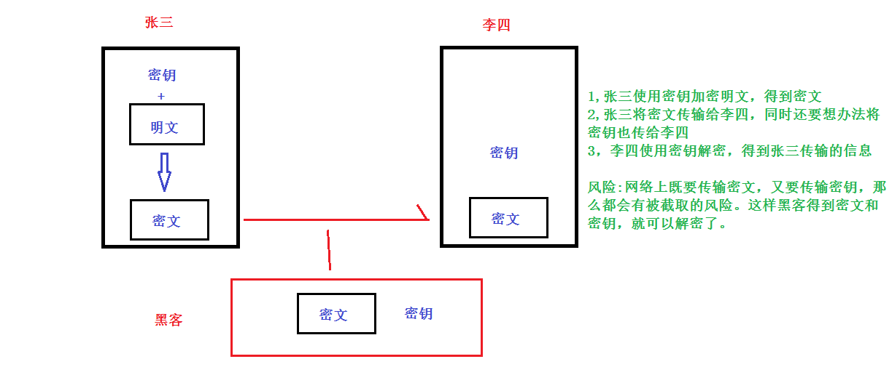
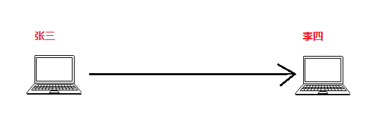
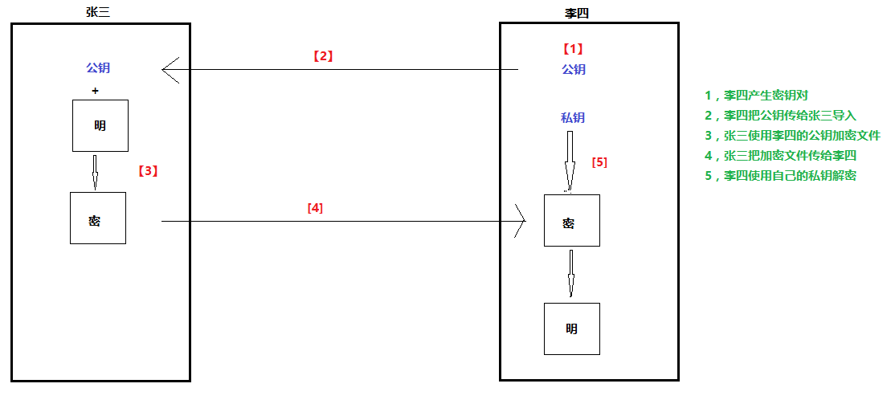
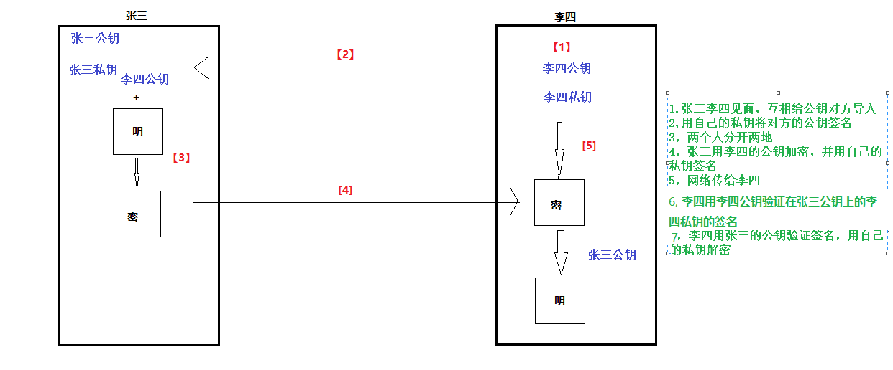
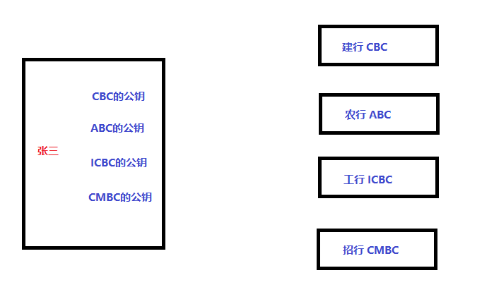
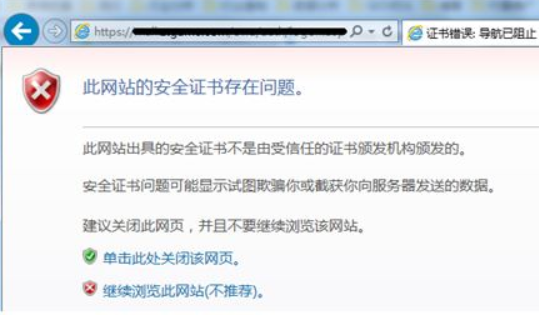

# 任务背景

公司内网的架构做好之后, 我们对外服务的服务器需要考虑安全问题了。现在互联网很多大型网站都已经转为了https安全传输协议, 如百度, 淘宝, 京东等,因为保护用户的隐私是非常重要的。我们公司的web架构也需要由传统的http转为https来保证客户访问的安全性。


# 任务要求

1, 了解ssl的原理

2, 实现https网站


# **学习目标**

- [ ] 能够实现对文件的对称加密解密

- [ ] 能够实现对文件的非对称加密解密

- [ ] 能够对加密后的文件实现签名与验证

- [ ] 了解SSL协议,CA认证,https的优缺点

- [ ] 能够使用自签证书实现https传输


# 加密

**目的: 防止数据被窃取**

验证与加密的区别


# 硬盘分区加密(拓展)

## 硬盘分区加密介绍

问题:

假设个人电脑里重要的数据（个人隐私或者公司商业机密）放在D盘，就只把管理员用户设置一个复杂的密码，但不做D盘的分区加密，这样安全吗？

答案:  假设电脑被偷, 使用winPE进入就可以很轻松地获取D盘的机密文件。如果D盘做了加密,没有D盘的密码，就无法得到里面的机密文件数据。


使用场景: 

1. 服务器的机密数据
2. 个人电脑的隐私数据

术语: LUKS(Linux  Unified  Key Setup-on-disk-format)是Linux硬盘加密标准。

软件: cryptsetup


## 实验: linux本地硬盘分区加密

**实验准备**:

1. 在虚拟机上新加一个硬盘（大小无所谓，1G就OK）,vmware虚拟机加硬盘后需要reboot生效
2. 使用fdisk或parted分一个区（假设为/dev/sdb1,不用mkfs格式化文件系统)

**实验基本步骤**:

1. 加密格式化（干掉原数据，设置密码)
2. 打开加密磁盘（需要密码，解密）
3. 常规格式化，格式化成文件系统
4. 挂载使用

**实验过程**:

第1步: 使用luks格式化准备好的分区,并设置密码（加密）

~~~powershell
# cryptsetup luksFormat /dev/sdb1

WARNING!
========
This will overwrite data on /dev/sdb1 irrevocably.

Are you sure? (Type uppercase yes): YES		要大写的YES
Enter LUKS passphrase: 
Verify passphrase: 			两次密码一致，并且在centos7里的版本要求密码不能太简单，有一定复杂度
~~~

第2步: 把这个加密磁盘做一个映射，后面的secretdisk这个名字自定义（解密）

~~~powershell
# cryptsetup luksOpen /dev/sdb1 secretdisk	 
Enter passphrase for /dev/sdb1: 	输入上一步设定的密码

解密成功后，确认映射好的设备
# ls /dev/mapper/secretdisk
/dev/mapper/secretdisk
~~~

第3步: 把映射好的设备格式化成文件系统(我这里是xfs),这是常规格式化,下次再使用就不要再格式化了（格式化都只做一次）

~~~powershell
# mkfs.xfs /dev/mapper/secretdisk
~~~

第4步: 挂载，然后可以进行任意的读写测试了

```powershell
# mount /dev/mapper/secretdisk /mnt/
# echo daniel > /mnt/123
# cat /mnt/123
daniel
```


**使用完后，关闭的做法:**

第1步: 不使用后，先umount

~~~powershell
# umount /mnt/
~~~

第2步: 再luksclose（此操作与第3步是相反操作那么/dev/mapper就没有secretdisk这个设备文件了

~~~powershell
# cryptsetup luksClose /dev/mapper/secretdisk
~~~


**再次使用的做法:**

第1步: 如果要再次使用，直接挂载是没有用的

~~~powershell
# mount /dev/sdb1 /mnt/	
mount: unknown filesystem type 'crypto_LUKS'
~~~

第2步: 如果想要再次使用,就用这个命令再次open一个映射,名字可以和上次的不一样;当然还是需要输入你的密码

~~~powershell
# cryptsetup luksOpen /dev/sdb1 abc
Enter passphrase for /dev/sdb1:
  就能看到这个新映射的设备，然后就可以挂载使用了
# ls /dev/mapper/abc
~~~


**步骤小结:**
第一次使用:  luksFormat--》luksOpen--》mkfs.xfs--》mount并使用
再次使用:    luksOpen--》mount并使用
使用完后:    umount --》luksClose

​	

**应用总结:**  

* 目的:  保障硬盘分区内的数据安全，防窃取。

* 应用:  保障本地的文件安全，而非网络。


# 网络上文件传输加密

场景: 张三和李四住在两个不同的城市，经常需要传输重要的机密信息或机密文件，下面三种情形请对比一下 。

1. 见面，面对面传输
2. 用QQ,wechat等软件
3. 用软件（商业或开源）加密，网络传输


**gpg**: （gnu privicy guard） 开源软件

**pgp**:  (pretty good privicy)  商业软件


## 对称加密

### 对称加密介绍

> 什么是对称加密？
>
> 答: 只有一个密钥,用它进行加密, 也要用它进行解密。
>
> 优点: 加密速度快
>
> 缺点: 密钥在网络上传输的安全性问题

```powershell
			             		网络
			张三 ------------------------------------> 李四
			
	1   张三使用密钥加密文件		 
	2	        网络传加密后的文件（但只传加密后的文件给李四，李四没有密钥解密不了）	         	
	3			还要想办法传密钥给李四（但只要网络传输密钥，就有被截取的可能）       
	4			如果加密后的文件和密钥都被截取了，则被破解的风险就大了
```





### 实验: 异地两人对称加密传输文件

**实验准备**:

两台linux，一台模拟张三，另一台模拟李四。(要求:网络互通，防火墙关闭，时间同步)



**实验过程**:

第1步: 使用gpg2命令加密(gpg2相当于是gpg的2版本，没有命令的自行安装)，下面的test只是一个准备好的用于加密的测试文件，-c 表示对称加密

~~~powershell
[root@zhangsan ~]# echo "lisi,I love you" > test
[root@zhangsan ~]# gpg2 -c test 	
密码：
重输入密码：

[root@zhangsan ~]# file test.gpg 		
test.gpg: data
~~~

第2步: 加密后，产生test.gpg文件，就可以把原文件删除了

~~~powershell
[root@zhangsan ~]# rm test -rf
~~~

第3步: 本地解密文件或者scp给李四解密

~~~powershell
[root@lisi ~]# gpg2 test.gpg    
或者使用gpg2 -d test.gpg
~~~

第4步: 拓展验证, 加密文件拷给任何人,都可以用密码解密


**注意:** 如果要对目录的做加密，可以先把目录打包，然后再做加密

**小结**

1. 软件 gpg2（开源), pgp (商业 )
2. 对称加密特点:  简单方便, 加密效率高，缺点是网络传输安全性低。


安全性低表现在两个方面:

* 张三需要在网络上把密码传给李四，李四才能解密。这就是增加了密码被劫持的风险。
* 李四无法确认是否是真的张三传过来的，而且无法确认信息的真实性或完整性。


## 非对称加密

### 非对称加密介绍

> 什么是非对称加密?
>
> 答: 使用一对密钥(公钥和私钥)。==公钥用于加密==，==私钥用于解密==。
>
> 优点: 密钥在网络上传输比较安全
>
> 缺点: 加密速度慢

```powershell
	             			      网络
			    张三 --------------------------------> 李四
			
		1				          			 李四使用软件产生一对密钥
		2				         李四把公钥给张三导入(放到公网给任何人下载都可以)，但私钥自己保留
		3  张三用李四的公钥加密数据		 
		4	        	 通网络传加密数据给李四	         	
		5		     						  李四使用自己的私钥解密
```




### 实验: 异地两人非对称加密传输文件

**实验准备**: 两台linux，一台模拟用户张三，另一台模拟李四（两台必须要时间同步)


**实验步骤:** (与画图的5步一致)

**实验过程**:

第1步: 在李四电脑上使用gpg2命令生成非对称加密的密钥,--gen-key表示generate key(产生key)

~~~powershell
[root@lisi ~]# gpg2 --gen-key			

Please select what kind of key you want:
   (1) RSA and RSA (default)
   (2) DSA and Elgamal
   (3) DSA (sign only)
   (4) RSA (sign only)
Your selection? 1					--算法选择默认的1
RSA keys may be between 1024 and 4096 bits long.
What keysize do you want? (2048) 	--密钥长度，越长越安全，但加密和解密消耗的资源和时间也较长
Requested keysize is 2048 bits
Please specify how long the key should be valid.
         0 = key does not expire
      <n>  = key expires in n days
      <n>w = key expires in n weeks
      <n>m = key expires in n months
      <n>y = key expires in n years
Key is valid for? (0) 1				--密钥过期时间，我这里选择1天是为了方便后面测试。
Key expires at Fri 09 Oct 2015 11:35:11 AM CST
Is this correct? (y/N) y

GnuPG needs to construct a user ID to identify your key.

Real name: lisihaha			   			lisihaha为我实验的密钥名称，必须要5位以上的长度
Email address: lisihaha@itcast.com		email地址
Comment: @_@							注释说明
You selected this USER-ID:
    "lisihaha (@_@) <lisihaha@itcast.com>"

Change (N)ame, (C)omment, (E)mail or (O)kay/(Q)uit? O		--选择O按回车

在这里设置密码，需要输入两次（这个密码是李四设置的，只有李四知道，不能告诉其他任何人）
然后产生密钥对
生成成功后，再次使用下面命令查看就会有密钥信息了
[root@lisi ~]# gpg2 -k				查看公钥
[root@lisi ~]# gpg2 -K				查看私钥
~~~

可能的问题: 如果在创建密钥对这一步会卡住，报随机数不够的错误. 解决方法：

~~~powershell
随机数不够，再开一个终端用下面的命令生成一下(如果没有rngd命令，则yum install rng-tools)
[root@lisi ~] rngd -r /dev/urandom -o /dev/random -f 
~~~

第2步: 李四把自己的公钥传给张三导入

~~~powershell
1, 在李四电脑上将公钥传给张三
[root@lisi ~]# gpg2 --export > lisi.asc					导出公钥成为一个文件，后缀为.asc
[root@lisi ~]# scp lisi.asc zhangsanIP:/opt/			传给另一台模拟张三的电脑

2, 在张三电脑上导入李四传过来的公钥(再次确认时间同步，然后导入)
[root@zhangsan opt]# gpg2 --import lisi.asc     

[root@zhangsan opt]# gpg2 -k
/root/.gnupg/pubring.gpg
------------------------
pub   2048R/001CB3D4 2015-10-08 [expires: 2015-10-09]
uid                  lisihaha (@_@) <lisihaha@itcast.com>
sub   2048R/7F9ADD4B 2015-10-08 [expires: 2015-10-09]
~~~

第3步: 张三使用李四的公钥加密一个文件(-e代表非对称加密，-r参数后接公钥的名字)

```powershell
[root@zhangsan opt]# echo "lisi,I love you" > test2
[root@zhangsan opt]# gpg2 -e -r lisihaha test2  

加密时有这句话表示公钥不受信任（也就是说它不能确定这个公钥就一定属于叫lisihaha的人，那么怎么解决？需要CA认证，后面再讨论）
It is NOT certain that the key belongs to the person named
in the user ID.  If you *really* know what you are doing,
you may answer the next question with yes.
```

第4步: 把加密的文件传回给李四,这里假设传给李四的/opt/目录

~~~powershell
[root@zhangsan opt]# scp /test2.gpg lisiIP:/opt/
~~~

第5步: 李四使用自己的私钥去解密，可以解密成功(用李四的私钥密码，这个密码只有李四知道)

~~~powershell
[root@lisi ~]# cd /opt
[root@lisi opt]# gpg2 -d test2.gpg
~~~


**验证一:** 如果把加密的文件传给没有私钥的第三个人(比如用户王五,可以用第三台虚拟机模拟一下),那么他也用下面的命令去解密,会直接报没有私钥,解密失败(这里就证明了黑客截取了文件，没有私钥也解密不了)

```powershell
[root@zhangsan ~]# scp /test2.gpg wangwuIP:/opt/
[root@wangwu ~]# gpg2 -d /root/test.txt.gpg 
gpg: encrypted with RSA key, ID E2F4585F
gpg: decryption failed: No secret key
```


**验证二:**把张三的电脑时间使用date -s 改成过期后的时间(前面在创建密钥时我为了测试方便设定的有效期时间为1天，这里你改成2天后的时间就可以了），再加密，就直接报错:不可使用的公钥

~~~powershell
[root@zhangsan ~]# gpg2 -e -r lisihaha test2
gpg: lisihaha: skipped: Unusable public key
gpg: test2: encryption failed: Unusable public key
~~~

删除密钥的方法：先删除私钥，再删除公钥

~~~powershell
# gpg2 --delete-secret-keys lisihaha
# gpg2 --delete-keys lisihaha
~~~

小结:

1. 【公】钥加密,【私】钥解密

1. 非对称加密的应用: 适合网络的文件安全传输。


## 数字签名(难点)

### 数字签名介绍

**问题**: 上面的非对称加密实验环境下，如果张三上厕所走开了，电脑没关。另一个人王五趁机用张三的电脑给李四发了一封假信息，而李四信以为真了，这就出问题了。怎么解决？

答:

1. 事后张三当面找李四再去解释(这没什么大用，可能李四已经铸成大错了)
2. 使用数字签名技术验证张三的身份


> 什么是数字签名?
>
> 答: 大家都知道在生活中有很多地方需要签字，盖章，按手印，如签订合同，李四贷款等，这么做的目的就是为了证明。那么在计算机领域，也有些场景需要签名来证明发信人的身份，数据的完整性等，这时候就要用到数字签名技术了。总的来说：就是利用计算机技术实现的签名，盖章，按手印。
>
> 数字签名主要分为签名和验证两部分. ==**私钥用于签名**==（因为私钥是不公开的，所以能做为拥有者的身份标识，可以用于签名），==**公钥用于验证签名**==。


问题 :在前面非对称加密的基础上，如何保证王五即使把张三电脑偷了，也不能使用李四的公钥？

~~~powershell
答: 用张三的私钥对李四的公钥签名（需要使用张三的私钥密码），这样王五偷了张三的电脑，但不知道张三的私钥密码，也用不了李四的公钥。
~~~

问题: 李四怎么验证张三发来的信息是张三本人发来的？

~~~powershell
答: 李四要用张三的公钥来验证张三的签名是否是张三的。如果担心张三的公钥会被人替换，那么李四可以用李四的私钥再给张三的公钥签名.
~~~




总结:  双方都产生一对密钥，并把公钥给对方导入。然后用自己的私钥签名对方的公钥。最终就可以双方互相安全传输数据。


### **实验**:  异地两人非对称加密传输文件，并验证签名 


**实验准备**: 接着上面的非对称加密实验继续做实验

**实验步骤**:

1. 张三使用`gpg2 --gen-key`命令也产生属于自己一对密钥
2. 张三将自己的公钥导出传给李四
3. 李四导入张三的公钥，李四用自己的私钥通过gpg2 --sign-key来签名张三的公钥（这一步的目的:**张三面对面把公钥亲手交给李四时，李四就通过用自己的私钥对张三公钥签名来防止张三公钥被人替换**）
4. 张三使用李四的公钥加密一个文件，并用张三自己的私钥对其签名
5. 张三将加密并签名过的文件通过网络传输给李四
6. 李四解密并验证张三的签名

**实验过程**:

第1步: 在张三的电脑上产生名为zhangsan的一对密钥，命令过程省略

~~~powershell
[root@zhangsan ~]# gpg2 --gen-key
~~~

第2步: 张三将自己的公钥导出传给李四

~~~powershell
[root@zhangsan ~]# gpg2 --export > zhangsan.asc
[root@zhangsan ~]# scp zhangsan.asc lisiIP:/opt/
~~~

第3步: 李四导入张三的公钥,李四用自己的私钥通过gpg2 --sign-key来签名张三的公钥

~~~powershell
[root@lisi ~]# gpg2 --import /opt/zhangsan.asc
[root@lisi ~]# gpg2 -k
/root/.gnupg/pubring.gpg
pub	  2048R/80A83A8B 2018-10-14			    注意这里的80A83A8B
uid                  zhangsan (@_@) <zhangsan@itcast.com>
sub   2048R/FB42BDBE 2018-10-14

[root@lisi ~] gpg2 --sign-key 80A83A8B		李四使用自已的私钥来签名张三的公钥
~~~

第4步: 张三使用李四的公钥加密一个文件，并用张三自己的私钥对其签名

~~~powershell
[root@zhangsan ~]# echo "lisi,I love you" > test3			
[root@zhangsan ~]# gpg2 -u zhangsan -e -r lisihaha -s test3
参数说明:
-e -r lisihaha表示以李四的公钥进行非对称加密
-u zhangsan -s test表示zhangsan在test文件上做签名
~~~

第5步: 张三将加密并签名过的文件通过网络传输给李四

~~~powershell
[root@zhangsan ~]# scp test3.gpg lisiIP:/opt/
~~~

第6步: 李四解密并验证张三的签名

~~~powershell
[root@lisi ~]# gpg2 -d /opt/test3.gpg

You need a passphrase to unlock the secret key for
user: "lisihaha (@_@) <lisihaha@itcast.com>"
2048-bit RSA key, ID B6D04A12, created 2018-10-14 (main key ID 1FD6E488)

gpg: encrypted with 2048-bit RSA key, ID B6D04A12, created 2018-10-14
      "lisihaha (@_@) <lisihaha@itcast.com>"
lisi,I love you													--这是解密的信息
gpg: Signature made Sun 14 Oct 2018 08:47:23 PM CST using RSA key ID 80A83A8B
gpg: Good signature from "zhangsan (@_@) <zhangsan@itcast.com>"	--这是验证了张三的签名确实来自张三
~~~


**问题:** yum配置里的gpgcheck到底是check什么?


开源,李纳斯

软件 数字签名									用户  公钥


参考:

https://dev.mysql.com/doc/refman/5.6/en/checking-gpg-signature.html

https://www.apache.org/dyn/closer.cgi#verify

**小结：**

1. 【私】钥签名，【公】钥验证签名

   数字签名的目的: 网络上验证身份，保障数据完整性。


## SSL与CA认证(重点)

问题: 前面的张三，李四安全传输个文件也太麻烦了，如果把李四换成一个网站或软件应用，张三要和它安全传数据也要这么麻烦吗？



### SSL介绍

> 什么是SSL/TLS?
>
> 答 : ==**SSL**==(secure socket layer)安全套接层及其继任者**==TLS==**(transport layer security)传输层安全简单来说就是一组**==安全协议==**，使用非对称加密和数字签名等技术实现网络传输的安全。
>
> SSL有哪些应用?
>
> 答: ==**https**==(http+ssl)就是最常见的一种应用。现在的网站很多都涉及到交付或者为了保护用户的隐私，所以做成加密的传输方式是必要的。最近几年，很多大网站都改成了全站https模式,如淘宝,百度，京东等。除了https外，SSL还有些应用场景，如smtps,pop3s,ftps,vpn加密,远程监控加密等。总之一句话: 只要是涉及到网络通讯安全的，一般都会支持SSL。
>
> https相对于http有什么==**优缺点**==?
>
> 答: 主要的**优点**：
>
> - 加了==**安全保障**==。
>
> ​     主要的**缺点**：
>
> * 访问速度受到了一定的影响造成==**性能下降**==（加密解密，http跳转https等都需要时间，而且CA一般都是国外的，浏览器还要根据证书的序列号去国外服务器查询状态，这个消耗的时间更多); 网站所有的页面都要转成https的（这对于大网站要转的话是很大的工作量);
>
> * 证书**==需要一定的费用==**等（大网站不差这点钱）免费的证书也有，比如Let's Encrypt;。
>
> * 搭建或转换https需要==**额外的时间和人力成本**==。对于已经运行很久的网站转成https需要很大的工作量，尤其是大型网站。
>
>   因为上述原因，所以有些网站仍然是部分转https，不是全站https(如部分银行网站等) 。
>

小结:

1. SSL/TLS是: 一组安全协议
2. https的应用: 对http协议加上安全传输的功能。
3. https的优缺点: 
   - 优点:安全
   - 缺点:性能下降，证书费用问题，额外人力和时间成本

> 为什么有些https网站访问时有绿色标识(有些是一个绿色锁标识，有些是绿色导航条) ，而有些https网站却报错说不信任的连接呢（如下图所示）?
>
> 答: 绿色导航条的网站说明它的证书经过了CA认证，报错不信任连接的https网站可能是自签的证书，也就是没有经过CA认证的证书（以前12306的购票界面就是自签证书，现在也是绿色了)




### CA认证介绍

> 到底什么是CA认证？
> 答: 简单来说，就是被权威机构认证过。请看下图：
>
> 假设现在有一个A银行网站，现在有一真一假两个网站，域名非常类似（第一次访问此网站的人无法通过域名辨认真假）。那么客户不知道谁真谁假，就需要一个权威的公司（CA）去认证它们，然后来告诉我们真假（通过浏览器来的锁标识就可以告诉我们,不同的浏览器标识会有不同）


> 什么是自签证书?
>
> 答: 自签证书就是用开源软件产生的证书，没有经过CA机构认证。但在某些小众场景还是有一定的应用。比如测试环境或者内部应用等。
>

**实验准备**: 准备一台虚拟机模拟实现一个https网站


**实验步骤**: 

1. 安装web服务器相关软件包与SSL证书生成工具
2. 生成key（私钥）和 certificate (公钥)
3. 在服务器配置文件里配置对应的key和certificate相关证书路径
4. 启动服务
5. 浏览器访问验证


### **实验**: 自签证书实现httpd的https连接

第1步: 安装相关软件包

~~~powershell
# yum install httpd httpd-devel openssl\* mod_ssl

安装成功后，会产生一个httpd支持ssl的子配置文件,还有一个支持ssl的模块
# ls /etc/httpd/conf.d/ssl.conf
/etc/httpd/conf.d/ssl.conf
# ls /etc/httpd/modules/mod_ssl.so 	
/etc/httpd/modules/mod_ssl.so
~~~

第2步: 因为我们创建自签证书的命令为openssl,而openssl命令非常难记（根本没必要记，一般相关软件会提供简单的创建证书的工具）;这里就是利用/etc/pki/tls/certs/下的make命令来创建

~~~powershell
# cd /etc/pki/tls/certs/

证书名字可以随意写，扩展名用.crt（非强制）
# make httpd.crt
umask 77 ; \
        /usr/bin/openssl genrsa -des3 1024 > httpd.key
Generating RSA private key, 1024 bit long modulus
....................++++++
.........................++++++
e is 65537 (0x10001)
Enter pass phrase:
Verifying - Enter pass phrase:		--设置密码，第一次设定
umask 77 ; \
        /usr/bin/openssl req -utf8 -new -key httpd.key -x509 -days 365 -out httpd.crt -set_serial 0
Enter pass phrase for httpd.key:	--输密码，第二次设定


下面填上证书相关的信息（一般填你公司相关的信息就OK）
Country Name (2 letter code) [GB]:cn
State or Province Name (full name) [Berkshire]:guangdong
Locality Name (eg, city) [Newbury]:shenzhen
Organization Name (eg, company) [My Company Ltd]:haha
Organizational Unit Name (eg, section) []:it
Common Name (eg, your name or your server's hostname) []:daniel.itcast.com
Email Address []:daniel@itcast.com
~~~

第3步: 编辑httpd配置文件，让它支持ssl

~~~powershell
# vim /etc/httpd/conf.d/ssl.conf

100 SSLCertificateFile /etc/pki/tls/certs/httpd.crt		--证书，就是公钥，客户端浏览器访问会下载
107 SSLCertificateKeyFile /etc/pki/tls/certs/httpd.key	--私钥，本机保存的
~~~

第4步: 重启apache服务

```powershell
# systemctl restart httpd	--如果重启服务卡，那就绑定主机名，并pkill httpd之后再启动
Enter SSL pass phrase for daniel.itcast.com:443 (RSA) : ******   
Enter SSL pass phrase for daniel.itcast.com:443 (RSA) : ******   --输入创建证书时的密码

验证端口(https默认为443端口)
# netstat -ntlup |grep httpd
tcp        0      0 :::80                       :::*                        LISTEN      5821/httpd          
tcp        0      0 :::443                      :::*                        LISTEN      5821/httpd 
```

第5步: 使用另一台机器打开浏览器测试

~~~powershell
使用下面的url来访问，会报不安全的连接，手动确认增加证书就可以访问了
https://serverIP/	
~~~


### **实验**: 自签证书实现nginx的https连接

（**注意:** 如果和上面的实验同一台机器，记得关闭httpd服务，否则端口会冲突，除非换端口）

第1步: 安装nginx和openssl相关软件包（nginx软件包需要epel源)

~~~powershell
# yum install epel-release 
# yum install nginx\* openssl\*
~~~

第2步: 创建证书得到nginx.crt和nginx.key,步骤同上例，这里省略创建过程

~~~powershell
# cd /etc/pki/tls/certs/
# make nginx.crt
~~~

第3步: 编辑nginx配置文件, 在server{}配置段里添加以下三句

~~~powershell
# vim /etc/nginx/nginx.conf
		listen    443 ssl;
        ssl_certificate      /etc/pki/tls/certs/nginx.crt;
        ssl_certificate_key  /etc/pki/tls/certs/nginx.key;
        
        ssl_protocols       TLSv1.2;			--ssl v1 v2 v3和tls1.0 tls1.1基本被废除了
        ssl_ciphers         ECDHE-RSA-AES256-GCM-SHA384;	--使用高强度的加密套件，不使用md5,sha1这种了
~~~

第4步: 启动nginx

**注意:** 但centos7的服务脚本启动会有问题，所以你可以直接使用nginx命令来启动; 如果是centos6就可以用服务脚本启动

~~~powershell
下面命令启动服务时需要输入密码
# nginx
~~~

第5步: 使用另一台机器打开浏览器测试

~~~powershell
使用下面的url来访问，会报不安全的连接，手动确认增加证书就可以访问了
https://serverIP/	
~~~


### **实验**: 使用Let's Encrypt免费SSL证书实现公网网站的https(拓展)

要求: 有一个公网服务器（云服务器就OK），并且域名可以访问（国内就需要备案）

第1步: 安装nginx

~~~powershell
# yum install nginx
~~~

第2步: 下载Let's Encrypt，并生成证书（需要验证你的域名;验证时先不要开启80,443，否则验证失败）

~~~powershell
# git clone https://github.com/letsencrypt/letsencrypt
# cd letsencrypt/
# ./certbot-auto certonly --standalone --email linuxdaniel@itcast.com -d itjiangshi.com -d www.itjiangshi.com 
# ls /etc/letsencrypt/live/itjiangshi.com/
cert.pem
chain.pem
fullchain.pem		--可以配置到nginx里的证书	
privkey.pem			--可以配置到nginx里的私钥
README
~~~

第3步: 将下面一段配置到nginx配置文件里的server{}配置段里

~~~powershell
        listen    443 ssl;
        ssl_certificate      /etc/letsencrypt/live/itjiangshi.com/fullchain.pem;
        ssl_certificate_key  /etc/letsencrypt/live/itjiangshi.com/privkey.pem;

        ssl_protocols       TLSv1.2;
        ssl_ciphers         ECDHE-RSA-AES256-GCM-SHA384;
~~~

第4步: 启动nginx服务

```powershell
# systemctl start nginx
```

第5步: 验证

使用浏览器访问https://www.itjiangshi.com验证


思考:如何实现http强制跳转https(301状态码为永久重定向,将旧URL重定向为新的URL)

~~~powershell
nginx配置文件里的server{}配置段里再加这一段
server_name   www.itjiangshi.com:

 if ($scheme = http) {
              return 301 https://$server_name$request_uri;
       }
重启服务后测试
~~~


**课后兴趣作业:** 申请云主机，使用云主机服务商提供的免费SSL实现https


